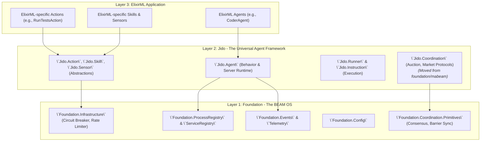

Excellent, this is a fantastic and timely request. Analyzing the architecture of `jido` and `foundation` reveals two powerful but overlapping systems. `foundation` is a generic, robust infrastructure layer, while `jido` is a feature-rich, high-level agent framework.

The key to a robust and scalable future is not to choose one over the other, but to **refactor them into a clean, layered architecture**. `jido` should be built *on top* of `foundation`, leveraging its infrastructure primitives. This creates a powerful separation of concerns, making `foundation` a reusable "BEAM OS" and `jido` the "Agent Runtime" that runs on it.

This proposal will:
1.  **Analyze the Feasibility** of integrating `jido` and `foundation`.
2.  **Propose a Robust Architecture** that refactors them into coherent layers.
3.  **Provide a Concrete Integration Plan** with code-level examples.
4.  **Illustrate the End State** showing how `ElixirML` would use this new architecture.

---

### Part 1: Feasibility Analysis

A direct merge is infeasible and undesirable. Both codebases have developed parallel solutions for similar problems (e.g., process management, telemetry). Simply combining them would create a monolithic, confusing system.

**`foundation` Strengths:**
*   **Generic Primitives:** `ProcessRegistry`, `ServiceRegistry`, `CircuitBreaker`, `RateLimiter` are domain-agnostic and highly reusable.
*   **Infrastructure-focused:** Excellent at managing core BEAM concerns like processes, configuration, and events.
*   **Distribution-Ready Concepts:** The MABEAM modules in `foundation` introduce coordination protocols (`Auction`, `Market`) that are fundamental to multi-agent systems.

**`jido` Strengths:**
*   **High-Level Agent Model:** Provides a complete, user-friendly framework (`Agent`, `Action`, `Skill`, `Sensor`) for building agents.
*   **Rich Feature Set:** Comes with pre-built actions, a workflow engine, and tools for easy agent development.
*   **Clear Abstractions:** The concepts of `Instruction`, `Runner`, and `Directive` provide a clear model for agent execution.

**The Core Conflict:** `jido` has its own implicit infrastructure (e.g., its own agent supervision and lifecycle management). `foundation` has started to include agent-specific application logic (`mabeam`). This creates a blurry line and duplicates effort.

**Conclusion:** It is not only feasible but **architecturally necessary** to integrate these two. The correct approach is to refactor `jido` to be a consumer of `foundation`'s services, making `foundation` the explicit infrastructure layer for `jido`.

---

### Part 2: Proposed Robust Architecture: A Layered Approach

The ideal architecture organizes the system into three distinct layers, each with a clear responsibility:



#### Layer 1: `foundation` - The Generic BEAM Toolkit
*   **Responsibility:** Provide robust, reusable, domain-agnostic infrastructure for any Elixir application.
*   **Key Modules:** `ProcessRegistry`, `ServiceRegistry`, `EventStore`, `TelemetryService`, `CircuitBreaker`, `RateLimiter`.
*   **Change:** The high-level economic protocols (`Auction`, `Market`) inside `foundation/mabeam` should be **moved out of `foundation` and into `jido`**. The low-level `Coordination.Primitives` (consensus, barriers) correctly belong in `foundation`.

#### Layer 2: `jido` - The Universal Agent Framework (MABEAM)
*   **Responsibility:** Provide the complete runtime and set of abstractions for building, running, and coordinating autonomous agents. **`jido` *is* the MABEAM framework.**
*   **Key Modules:** `Jido.Agent`, `Jido.Action`, `Jido.Skill`, `Jido.Sensor`.
*   **Change:** `jido` will be refactored to use `foundation`'s services for its infrastructure needs.

#### Layer 3: `ElixirML` - The Domain-Specific Application
*   **Responsibility:** Define concrete agents, actions, and skills that solve ML-specific problems.
*   **Implementation:** `ElixirML` modules will `use Jido.Agent` or `use Jido.Action` to implement the application logic, leveraging the `jido` framework.

---

### Part 3: Concrete Integration & Refactoring Plan

This plan details how to refactor `jido` to be built on `foundation`.

#### Step 1: Replace `jido`'s Implicit Infrastructure with `foundation`

1.  **Process Management:**
    *   The `Jido.Agent.Server.start_link` function will be modified. Instead of managing its own name registration, it will use `Foundation.ServiceRegistry`.
    *   **Code Example (`jido/agent/server.ex`):**
        ```elixir
        # In Jido.Agent.Server
        def start_link(opts) do
          # ... build agent, validate opts ...
          agent_id = Keyword.get(opts, :id)
          registry = Keyword.get(opts, :registry, Foundation.ProcessRegistry)
          namespace = Keyword.get(opts, :namespace, :production)
          
          # Use Foundation's registry for naming and discovery
          via_tuple = Foundation.ServiceRegistry.via_tuple(namespace, agent_id)

          GenServer.start_link(__MODULE__, opts, name: via_tuple)
        end
        ```

2.  **Observability & Logging:**
    *   `Jido.Telemetry` should be removed. Instead, `Jido.Exec` and `Jido.Agent.Server` will emit telemetry events using `Foundation.Telemetry.execute/3`.
    *   `Jido.Actions.Basic.Log` will be refactored to call the `Foundation` logger, which is already configured for structured logging.
    *   **Code Example (`jido/exec.ex`):**
        ```elixir
        # In Jido.Exec private functions
        defp start_span(action, params, context, telemetry) do
          # ...
          # Use Foundation's Telemetry
          Foundation.Telemetry.execute([:jido, :action, :start], %{}, metadata)
        end
        ```

3.  **State & Configuration:**
    *   The `Jido.Agent.Server` will remain responsible for its own instance state (`ServerState`).
    *   For configuration shared across multiple agents or the system, `jido`'s components should read from `Foundation.Config.get/1`.

#### Step 2: Relocate and Refine MABEAM Coordination Logic

1.  **Move `Auction` and `Market` from `foundation` to `jido`:**
    *   Move the files from `foundation/mabeam/coordination/` to a new `jido/coordination/` directory.
    *   Refactor them to be regular modules or GenServers, not tied to `foundation`'s internal structure. They are now part of the `jido` agent framework's offerings.

2.  **Integrate Coordination into `jido` Actions:**
    *   The `jido` framework can now offer specialized actions that trigger these coordination protocols.
    *   **Code Example (new file `jido/actions/coordination.ex`):**
        ```elixir
        defmodule Jido.Actions.Coordination do
          alias Jido.Coordination.{Auction, Consensus}
          alias Jido.Action
          
          defmodule RunAuction do
            use Action, name: "run_auction", description: "Initiate a resource auction"
            # schema for auction_spec, participants, etc.
            
            def run(params, _context) do
              # The jido action now calls the coordination protocol
              Auction.run_auction(params.auction_spec, params.participants)
            end
          end

          defmodule SeekConsensus do
            use Action, name: "seek_consensus", description: "Initiate consensus among agents"
            # schema for proposal, agents, etc.

            def run(params, _context) do
              Consensus.run(params.proposal, params.agents)
            end
          end
        end
        ```

#### Step 3: Clarify the Agent Model

*   A `Jido.Agent` is a behavior that defines the logic and state for an autonomous process.
*   A `Jido.Agent.Server` is the GenServer that hosts and executes a `Jido.Agent`. It handles the OTP-level concerns (message queue, state loop).
*   The `Jido.Runner` (e.g., `Simple`, `Chain`) is the "CPU" of the agent, executing `Instruction`s from the queue. This architecture is sound and should be retained.

---

### Part 4: The Final Integrated `ElixirML` Application

With this refactored architecture, building an `ElixirML` agent becomes clean and intuitive.

**1. Define an `ElixirML` Agent:**
The `ElixirML` developer focuses purely on the agent's logic, using `jido`'s high-level abstractions.

```elixir
# In elixir_ml/agents/coder_agent.ex
defmodule ElixirML.Agents.CoderAgent do
  use Jido.Agent,
    name: "coder_agent",
    description: "An agent that writes code based on specifications.",
    # The agent has its own state schema, independent of the infrastructure
    schema: [
      current_task: [type: :string],
      language_proficiency: [type: :map, default: %{elixir: 0.9, python: 0.8}]
    ]

  # Agent can define its own startup logic
  @impl Jido.Agent
  def mount(state, _opts) do
    # Log using foundation, via jido
    Jido.Actions.Basic.Log.run(%{level: :info, message: "CoderAgent mounting."}, %{})
    {:ok, state}
  end
end
```

**2. Define an `ElixirML` Action:**
The developer writes a pure function that performs a task. It can use `foundation`'s infrastructure for resilience.

```elixir
# In elixir_ml/actions/generate_code_action.ex
defmodule ElixirML.Actions.GenerateCodeAction do
  use Jido.Action, name: "generate_code"
  
  alias Foundation.Infrastructure.CircuitBreaker

  # Action to call an external LLM API to generate code
  def run(params, _context) do
    # Use Foundation's circuit breaker to protect the external call
    CircuitBreaker.execute(:llm_api, fn ->
      # call external LLM service...
      {:ok, %{generated_code: "def hello, do: :world"}}
    end)
  end
end
```

**3. Orchestrate Agents:**
An orchestrator agent in `ElixirML` can now plan and execute work for other agents using `jido`'s directive system.

```elixir
# In elixir_ml/agents/project_manager_agent.ex
defmodule ElixirML.Agents.ProjectManagerAgent do
  use Jido.Agent, name: "project_manager"
  alias Jido.Actions.Directives

  # This agent's job is to delegate tasks to other agents
  def plan_and_delegate(task_spec) do
    # Plan a sequence of actions for the CoderAgent
    instructions_for_coder = [
      # An ElixirML-specific action
      {ElixirML.Actions.GenerateCodeAction, %{spec: task_spec}}, 
      # A built-in Jido action
      {Jido.Actions.Files.WriteFile, %{path: "lib/new_feature.ex", content: ...}}
    ]

    # Use a Jido Directive to enqueue these instructions on the CoderAgent
    directive = %Directives.EnqueueAction{
      action: ElixirML.Agents.CoderAgent, # Target agent
      params: %{instructions: instructions_for_coder}
    }
    
    # Return the directive to the Jido runtime
    {:ok, %{}, directive}
  end
end
```

## Conclusion and Recommendation

**The path forward is clear: Refactor, Don't Replace.**

1.  **Purify `foundation`:** Make it the universal, domain-agnostic BEAM OS. Move `mabeam` coordination protocols out.
2.  **Elevate `jido`:** Position it as the standard agent framework (`MABEAM`) built on `foundation`. It provides the agent runtime, abstractions, and now the coordination protocols.
3.  **Empower `ElixirML`:** Allow it to focus on defining ML agents and actions, leveraging the powerful, layered architecture underneath.

This approach creates a robust, maintainable, and highly reusable system. It leverages the strengths of both existing codebases, resolves their architectural conflicts, and provides a clear and powerful model for building sophisticated, multi-agent systems in Elixir.
