# ProcessRegistry Architecture Diagrams

## Diagram 1: Current (Broken) Architecture

```mermaid
graph TB
    subgraph "Foundation.ProcessRegistry Module (1,143 lines)"
        API[Public API Layer]
        API --> |"register/4"| RegFunc[register function]
        API --> |"lookup/2"| LookFunc[lookup function] 
        API --> |"unregister/2"| UnregFunc[unregister function]
        API --> |"via_tuple/2"| ViaFunc[via_tuple function]
        
        RegFunc --> |"ensure_backup_registry()"| EnsureETS[ETS Table Creation]
        EnsureETS --> |":ets.new(:process_registry_backup)"| ETSTable[(ETS Backup Table)]
        
        RegFunc --> |"lines 140-193"| CustomLogic[Custom Registry+ETS Logic]
        CustomLogic --> |":ets.lookup/insert"| ETSTable
        CustomLogic --> |"Registry operations"| NativeReg[Native Registry]
        
        LookFunc --> |"Registry.lookup first"| NativeReg
        LookFunc --> |"fallback to ETS"| ETSTable
        
        UnregFunc --> |"Registry.unregister"| NativeReg
        UnregFunc --> |":ets.delete"| ETSTable
        
        ViaFunc --> |"via tuple creation"| NativeReg
    end
    
    subgraph "Optimization Module (lines 996-1127)"
        OptAPI[Optimization Functions]
        OptAPI --> |"register_with_indexing/4"| OptReg[Optimized Register]
        OptAPI --> |"cached_lookup/2"| OptLook[Cached Lookup]
        OptAPI --> |"bulk_register/1"| BulkReg[Bulk Operations]
        
        OptReg --> |"bypasses backend"| OptModule[Foundation.ProcessRegistry.Optimizations]
        OptLook --> OptModule
        BulkReg --> OptModule
    end
    
    subgraph "UNUSED Backend System (258 lines + implementations)"
        BackendBeh[Backend Behaviour]
        BackendBeh -.-> |"@callback init/1"| InitCB[init callback]
        BackendBeh -.-> |"@callback register/4"| RegCB[register callback]
        BackendBeh -.-> |"@callback lookup/2"| LookCB[lookup callback]
        BackendBeh -.-> |"@callback unregister/2"| UnregCB[unregister callback]
        BackendBeh -.-> |"@callback list_all/1"| ListCB[list_all callback]
        BackendBeh -.-> |"@callback update_metadata/3"| UpdateCB[update_metadata callback]
        BackendBeh -.-> |"@callback health_check/1"| HealthCB[health_check callback]
        
        ETSBackend[ETS Backend - 387 lines]
        ETSBackend -.-> |"implements all callbacks"| BackendBeh
        ETSBackend -.-> |"performance optimizations"| ETSPerfOpt[Dead Process Cleanup<br/>Statistics Collection<br/>Memory Tracking]
        
        RegBackend[Registry Backend]
        RegBackend -.-> BackendBeh
        
        HordeBackend[Horde Backend - Distributed]
        HordeBackend -.-> BackendBeh
        HordeBackend -.-> |"cluster coordination"| DistFeatures[Distributed Features<br/>Node Failover<br/>Global Registry]
    end
    
    subgraph "Configuration System (UNUSED)"
        ConfigSys[Backend Configuration]
        ConfigSys -.-> |"backend selection"| BackendSelect[Runtime Backend Selection]
        ConfigSys -.-> |"backend_opts"| BackendOpts[Backend Options]
        BackendSelect -.-> ETSBackend
        BackendSelect -.-> RegBackend  
        BackendSelect -.-> HordeBackend
    end
    
    %% No connections between main module and backend system!
    
    %% Problems highlighted
    ETSTable ==> |"REDUNDANT STORAGE"| BackendBeh
    CustomLogic ==> |"BYPASSES ABSTRACTION"| BackendBeh
    OptModule ==> |"IGNORES BACKEND SYSTEM"| BackendBeh
    
    %% Styling
    classDef used fill:#ccffcc,stroke:#00aa00,stroke-width:3px
    classDef unused fill:#ffcccc,stroke:#aa0000,stroke-width:3px,stroke-dasharray: 10 10
    classDef problem fill:#ffaaaa,stroke:#ff0000,stroke-width:4px
    
    class API,RegFunc,LookFunc,UnregFunc,ViaFunc,CustomLogic,NativeReg,ETSTable,OptAPI,OptModule used
    class BackendBeh,ETSBackend,RegBackend,HordeBackend,ConfigSys,BackendSelect,InitCB,RegCB,LookCB,UnregCB,ListCB,UpdateCB,HealthCB,ETSPerfOpt,DistFeatures,BackendOpts unused
    class CustomLogic,ETSTable,OptModule problem
```



### Issues Highlighted:
- **RED DASHED**: Entire backend system unused (700+ lines of code)
- **RED SOLID**: Problem areas with architectural violations
- **GREEN**: Currently used code paths
- **NO CONNECTIONS**: Main module never calls backend system

### Specific Problems:
1. **Dual Storage**: Registry + ETS backup table + unused backend implementations
2. **Bypassed Abstraction**: Custom logic instead of `backend.register(state, key, pid, metadata)`
3. **Lost Capabilities**: Cannot use Horde distributed registry or runtime backend switching
4. **Configuration Ignored**: Backend selection system exists but never used

---

## Diagram 2: Intended (Correct) Architecture

```mermaid
graph TB
    subgraph "ProcessRegistry API (Simplified)"
        API[Public API Layer]
        API --> |"register/4"| GenServerCall[GenServer.call]
        API --> |"lookup/2"| GenServerCall
        API --> |"unregister/2"| GenServerCall
        API --> |"via_tuple/2"| ViaHelper[Via Tuple Helper]
    end
    
    subgraph "ProcessRegistry GenServer"
        GenServerCall --> |"handle_call"| CallHandlers[Handle Call Functions]
        
        CallHandlers --> |"{:register, key, pid, meta}"| RegHandler[Register Handler]
        CallHandlers --> |"{:lookup, key}"| LookHandler[Lookup Handler]
        CallHandlers --> |"{:unregister, key}"| UnregHandler[Unregister Handler]
        
        RegHandler --> |"backend.register(state, key, pid, meta)"| BackendCall[Backend Delegation]
        LookHandler --> |"backend.lookup(state, key)"| BackendCall
        UnregHandler --> |"backend.unregister(state, key)"| BackendCall
        
        BackendCall --> |"update backend_state"| StateUpdate[State Management]
        StateUpdate --> |"new backend_state"| GenServerState[GenServer State]
    end
    
    subgraph "Backend Configuration System"
        AppConfig[Application Config]
        AppConfig --> |"backend: ETS/Registry/Horde"| BackendSelector[Backend Selection]
        AppConfig --> |"backend_opts: [...]"| BackendOpts[Backend Options]
        
        BackendSelector --> |"init(opts)"| BackendInit[Backend Initialization]
        BackendInit --> |"returns backend_state"| InitialState[Initial Backend State]
        InitialState --> GenServerState
    end
    
    subgraph "Backend Implementations"
        BackendCall --> |"runtime delegation"| BackendInterface[Backend Interface]
        
        BackendInterface --> |"configured backend"| SelectedBackend{Selected Backend}
        
        SelectedBackend --> |"local storage"| ETSBackend[ETS Backend]
        SelectedBackend --> |"native registry"| RegBackend[Registry Backend]  
        SelectedBackend --> |"distributed"| HordeBackend[Horde Backend]
        
        ETSBackend --> ETSStorage[(ETS Table)]
        ETSBackend --> |"dead process cleanup"| ETSCleanup[Automatic Cleanup]
        ETSBackend --> |"health monitoring"| ETSHealth[Health Checks]
        ETSStorage --> |"O(1) operations"| ETSPerf[High Performance<br/>< 1ms latency<br/>Concurrent access]
        
        RegBackend --> RegStorage[Native Registry]
        RegBackend --> |"OTP supervision"| RegSupervision[Automatic Process Monitoring]
        RegStorage --> |"partitioned storage"| RegPerf[CPU Optimized<br/>Automatic cleanup<br/>Fault tolerance]
        
        HordeBackend --> DistStorage[Distributed Registry]
        HordeBackend --> |"node coordination"| NodeSync[Node Synchronization]
        DistStorage --> |"cluster operations"| DistPerf[Global Consistency<br/>Node failover<br/>Network partition handling]
    end
    
    subgraph "Optimization Layer"
        OptimizationAPI[Optimization Functions]
        OptimizationAPI --> |"register_with_indexing/4"| OptReg[Enhanced Register]
        OptimizationAPI --> |"cached_lookup/2"| OptLook[Cached Lookup]
        
        OptReg --> |"first register normally"| BackendCall
        OptReg --> |"then add indexing"| IndexSystem[Metadata Indexing]
        
        OptLook --> |"check cache first"| CacheLayer[Cache Layer]
        CacheLayer --> |"cache miss"| BackendCall
        CacheLayer --> |"cache hit"| CacheHit[Direct Return]
        
        IndexSystem --> |"ETS metadata index"| MetaIndex[(Metadata Index Table)]
        MetaIndex --> |"fast searches"| FastSearch[O(1) metadata queries]
    end
    
    subgraph "Monitoring & Health"
        HealthAPI[Health Check API]
        HealthAPI --> |"get_stats/0"| StatsCall[Statistics Call]
        StatsCall --> |"backend.health_check(state)"| BackendHealth[Backend Health Check]
        
        BackendHealth --> |"backend-specific metrics"| HealthMetrics[Health Metrics]
        HealthMetrics --> |"registration count"| RegCount[Registration Count]
        HealthMetrics --> |"memory usage"| MemUsage[Memory Usage]
        HealthMetrics --> |"performance stats"| PerfStats[Performance Statistics]
        HealthMetrics --> |"error rates"| ErrorRates[Error Rates]
    end
    
    %% Runtime backend switching capability
    BackendSelector -.-> |"runtime reconfiguration"| RuntimeSwitch[Runtime Backend Switching]
    RuntimeSwitch -.-> |"migrate state"| StateMigration[State Migration]
    StateMigration -.-> SelectedBackend
    
    %% Styling
    classDef api fill:#e6f3ff,stroke:#0066cc,stroke-width:2px
    classDef genserver fill:#f0f8e6,stroke:#2d5a27,stroke-width:2px
    classDef backend fill:#fff2e6,stroke:#cc6600,stroke-width:2px
    classDef storage fill:#f8f0ff,stroke:#6600cc,stroke-width:2px
    classDef optimization fill:#ffe6f0,stroke:#cc0066,stroke-width:2px
    classDef monitoring fill:#f0fff0,stroke:#006600,stroke-width:2px
    
    class API,GenServerCall,ViaHelper api
    class CallHandlers,RegHandler,LookHandler,UnregHandler,BackendCall,StateUpdate,GenServerState genserver
    class AppConfig,BackendSelector,BackendOpts,BackendInit,BackendInterface,SelectedBackend,ETSBackend,RegBackend,HordeBackend backend
    class ETSStorage,RegStorage,DistStorage,MetaIndex storage
    class OptimizationAPI,OptReg,OptLook,CacheLayer,IndexSystem,FastSearch optimization
    class HealthAPI,StatsCall,BackendHealth,HealthMetrics monitoring
```

### Benefits of Correct Architecture:
1. **Single Responsibility**: GenServer manages state, backends handle storage
2. **Pluggable Backends**: Runtime selection between ETS/Registry/Horde
3. **Consistent Interface**: All operations go through backend abstraction
4. **Distributed Ready**: Horde backend enables cluster deployment
5. **Performance Optimized**: Each backend optimized for its use case
6. **Health Monitoring**: Built-in metrics and diagnostics
7. **State Management**: Proper OTP GenServer state handling

### Configuration Example:
```elixir
# Development - Fast local storage
config :foundation, ProcessRegistry,
  backend: Foundation.ProcessRegistry.Backend.ETS,
  backend_opts: [cleanup_interval: 30_000]

# Production - Distributed cluster
config :foundation, ProcessRegistry,  
  backend: Foundation.ProcessRegistry.Backend.Horde,
  backend_opts: [
    members: [:node1@host, :node2@host, :node3@host],
    sync_interval: 5_000
  ]
```

### Performance Characteristics:
- **ETS Backend**: < 1ms latency, high concurrency, local only
- **Registry Backend**: OTP native, automatic cleanup, local only  
- **Horde Backend**: Distributed consistency, network partition tolerance
- **Optimization Layer**: Metadata indexing, caching, bulk operations

### Migration Path:
1. **Phase 1**: Implement GenServer wrapper with backend delegation
2. **Phase 2**: Create Hybrid backend containing current Registry+ETS logic  
3. **Phase 3**: Configure system to use Hybrid backend (no behavior change)
4. **Phase 4**: Optimize by switching to pure ETS or Registry backend
5. **Phase 5**: Enable distributed deployment with Horde backend