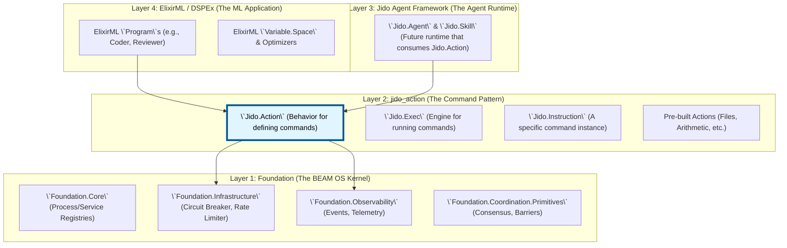

Excellent question. This refactoring—extracting `jido_action` into a standalone library—is a brilliant architectural move. It isolates a core pattern and allows us to reason about its place in the wider system.

If we only have the `jido_action` library, its role becomes crystal clear: it is a **universal, standardized "Command Pattern" for the entire stack**. It provides a way to define, validate, execute, and compose discrete units of work.

Here is a detailed analysis of its place and a robust integration plan.

### Part 1: Architectural Placement of `jido_action`

`jido_action` is not infrastructure, nor is it a complete application framework. It is a powerful, reusable **pattern library**. It sits neatly between the low-level infrastructure of `foundation` and the high-level application logic of `ElixirML`.

This creates a clean, four-layer architecture:



**Key Insights:**

1.  **`foundation` is Layer 1:** It's the "kernel" that knows nothing about application logic. It manages processes, provides resilience patterns (`CircuitBreaker`), and handles observability (`Telemetry`).
2.  **`jido_action` is Layer 2:** It's a utility library that provides a **standardized way to define and execute functions**. It sits on top of `foundation` because an `Action`'s `run/2` implementation might need to use `foundation`'s infrastructure (e.g., wrap a network call in a circuit breaker).
3.  **`jido` (the full agent framework) is Layer 3:** The *full* `jido` agent library (which you've refactored `jido_action` out of) would be the next layer up. A `Jido.Agent` would use `Jido.Exec` to run its queued `Jido.Instruction`s.
4.  **`ElixirML` is Layer 4:** It's the application. It defines ML-specific `Action`s (e.g., `GenerateCodeAction`) and uses the agent framework (`jido`) or the command executor (`Jido.Exec`) to run them.

### Part 2: Robust Integration Plan

This plan details how the `jido_action` library would be wired into the existing `foundation` and `ElixirML` stacks.

#### Step 1: Establish the Dependency Hierarchy

The dependency chain in `mix.exs` would be crystal clear:

*   `elixir_ml` depends on `jido_action` and `foundation`.
*   `jido_action` depends on `foundation`.
*   `foundation` has no application-level dependencies.

```elixir
# In ElixirML's mix.exs
def deps do
  [
    {:jido_action, "~> x.y"},
    {:foundation, "~> x.y"},
    # ... other deps
  ]
end

# In jido_action's mix.exs
def deps do
  [
    {:foundation, "~> x.y"},
    # ... other deps
  ]
end
```

#### Step 2: Connect `jido_action` Down to `foundation`

The `Jido.Action` pattern becomes more powerful when it can leverage `foundation`'s infrastructure. Actions are no longer just pure functions; they are resilient, observable operations.

**Example: A Foundation-Aware Action**

Let's imagine an Action in `ElixirML` that needs to call an external API. It would use `Foundation.Infrastructure.CircuitBreaker`.

```elixir
# in elixir_ml/actions/call_external_api_action.ex

defmodule ElixirML.Actions.CallExternalAPI do
  # Use the behavior from the standalone library
  use Jido.Action,
    name: "call_external_api",
    schema: [
      url: [type: :string, required: true],
      payload: [type: :map, required: true]
    ]

  # Depend on foundation's infrastructure
  alias Foundation.Infrastructure.{CircuitBreaker, ConnectionManager}
  alias Foundation.Infrastructure.PoolWorkers.HttpWorker

  @impl Jido.Action
  def run(params, _context) do
    # 1. Use Foundation's Circuit Breaker
    CircuitBreaker.execute(:external_llm_service, fn ->
      # 2. Use Foundation's Connection Pool
      ConnectionManager.with_connection(:http_pool, fn http_worker ->
        # 3. Use a pooled worker to make the call
        HttpWorker.post(http_worker, params.url, params.payload)
      end)
    end)
    # The result is automatically a standard {:ok, _} or {:error, Foundation.Types.Error}
  end
end
```
**Benefits of this integration:**
*   **Resilience:** The action automatically gains circuit breaking and connection pooling without needing to manage that logic itself.
*   **Observability:** `Foundation.CircuitBreaker` and `ConnectionManager` already have built-in telemetry. Every execution of this action is now automatically monitored.
*   **Standardization:** The action conforms to the `Jido.Action` behavior, but its implementation is powered by `foundation`.

#### Step 3: Connect `ElixirML` Up to `jido_action`

`ElixirML` programs and modules would use `Jido.Exec.run/2` as their primary method for executing complex, stateful, or external operations.

**Example: An ElixirML Program Using an Action**

```elixir
# in elixir_ml/programs/feature_implementer.ex

defmodule ElixirML.Programs.FeatureImplementer do
  use DSPEx.Module # Or your program abstraction

  alias Jido.Exec
  alias ElixirML.Actions.{GenerateCodeAction, WriteAndTestAction}

  # The main logic of the program
  def forward(program_state, inputs) do
    # ... logic to determine task ...
    task_spec = %{requirements: inputs.requirements, language: "Elixir"}

    # Use Jido.Exec to run a chain of actions
    Jido.Exec.Chain.chain(
      [
        # Run the action to generate code
        {GenerateCodeAction, task_spec},
        # Run another action to write the file and run tests
        {WriteAndTestAction, %{file_path: "lib/new_feature.ex"}}
      ],
      %{}, # Initial params
      program_state.context # Pass context down
    )
  end
end
```
**Benefits of this integration:**
*   **Decoupling:** The `FeatureImplementer` program doesn't need to know *how* to generate code or run tests. It only needs to know *which* `Action` to call.
*   **Testability:** `GenerateCodeAction` can be tested in isolation. The `FeatureImplementer` program can be tested by mocking the output of `Jido.Exec.Chain.chain/3`.
*   **Clarity:** The `forward/2` function becomes a high-level description of a workflow, composed of well-defined `Action`s.

#### Step 4: Refactor `jido_action` to Use `Foundation.Error`

The standalone `jido_action` library defines its own error struct (`Jido.Action.Error`). To create a fully cohesive stack, it should be refactored to use `Foundation.Types.Error` and the helpers in `Foundation.Error`.

*   **In `jido_action/mix.exs`:** Add `{:foundation, ...}` dependency.
*   **In `jido_action/error.ex`:** Remove the `Jido.Action.Error` struct and its helpers.
*   **In `jido_action.ex` and `jido_exec.ex`:**
    *   Alias `Foundation.Types.Error` and `Foundation.Error`.
    *   Replace all calls like `Jido.Action.Error.validation_error(...)` with the equivalent `Foundation.Error.new(:validation_failed, ...)` or a more specific code.

This change ensures that an error, no matter where it originates (`foundation`, `jido_action`, or `ElixirML`), has a single, consistent, and richly detailed structure.

### Part 3: Evolutionary Path - The Emergence of the Full Agent

This refactored architecture provides a perfect base for re-introducing the full `Jido` agent framework as **Layer 3**.

1.  **A new `jido_agent` library would be created.**
2.  It would depend on `jido_action` and `foundation`.
3.  The `Jido.Agent.Server` from the original `jido` repo would be the heart of this new library.
4.  Its `run` implementation would use `Jido.Exec.run` to execute the instructions from its queue.
5.  The `Directives.ex` and `StateManager.ex` actions, which were commented out of `jido_action`, would find their home here, as they are specific to a stateful agent runtime.

An agent from this new library would look like this:

```elixir
# In a new `jido_agent` library:
defmodule Jido.Agent do
  use GenServer

  alias Jido.Instruction
  alias Jido.Exec
  alias Foundation.ServiceRegistry

  # --- Agent Server Logic ---
  def start_link(agent_module, opts) do
    # Uses Foundation's registry
    via_tuple = ServiceRegistry.via_tuple(:production, agent_module.name())
    GenServer.start_link(__MODULE__, {agent_module, opts}, name: via_tuple)
  end

  def init({agent_module, opts}) do
    # ... agent setup ...
    state = %{
      agent_module: agent_module,
      instruction_queue: :queue.new(),
      # ... other state
    }
    {:ok, state, {:continue, :run_next_instruction}}
  end
  
  def handle_continue(:run_next_instruction, state) do
    case :queue.out(state.instruction_queue) do
      {{:value, instruction}, new_queue} ->
        # It uses Jido.Exec to run the command!
        case Exec.run(instruction) do
          # ... handle result and directives ...
        end
        {:noreply, %{state | instruction_queue: new_queue}, {:continue, :run_next_instruction}}

      {:empty, _} ->
        # Queue is empty, wait for more work
        {:noreply, state}
    end
  end

  # ... other callbacks for enqueuing instructions, etc.
end
```

### Conclusion

The refactoring of `jido` into `jido_action` was a pivotal step towards a cleaner architecture.

**If we only had `jido_action`, it would become the universal "Command Pattern" library for our stack.**

1.  **Placement:** It would be **Layer 2**, sitting directly on top of `foundation`.
2.  **Dependencies:** It would depend on `foundation` to use its infrastructure primitives like `CircuitBreaker` and `Error`.
3.  **Role:** It provides a standard, observable, and resilient way to define and execute any business logic.
4.  **Integration:**
    *   **Downstream:** Both `foundation` services and `ElixirML` programs can use `Jido.Exec` to run encapsulated logic.
    *   **Upstream:** A full agent framework (`jido` or `MABEAM`) can be built on top, using `Jido.Exec` as its core instruction-execution engine.

This model is clean, composable, and aligns perfectly with the Elixir philosophy of building powerful systems from small, well-defined, and reusable components.
