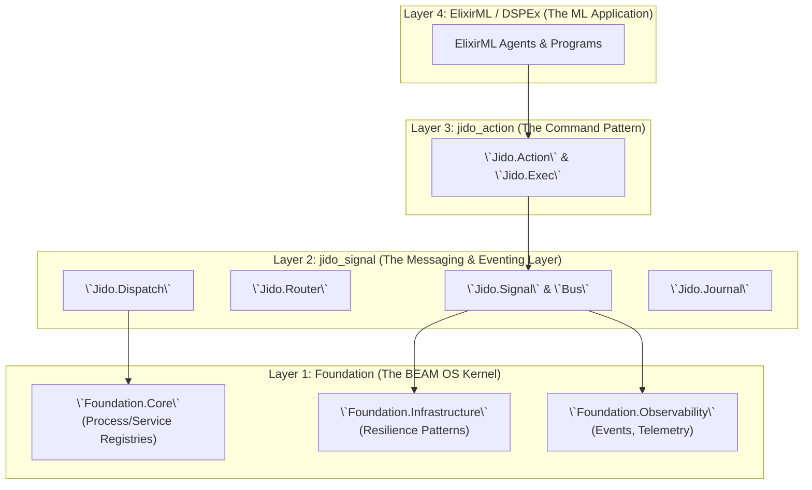

Excellent. Analyzing the standalone `jido_signal` library is a crucial next step in defining a clean, layered architecture. This library is the nervous system of the entire system, and its correct placement is paramount.

By extracting it, we've isolated a powerful **Eventing and Messaging Abstraction Layer**. Its role is to define a standardized message format (`Jido.Signal`) and provide the mechanisms to route, dispatch, and store these messages.

This analysis will detail where `jido_signal` fits in the stack, how it integrates with `foundation`, and how it serves as a foundational layer for `jido_action`.

### Part 1: Architectural Placement of `jido_signal`

`jido_signal` is a foundational library, but it is not *the* foundation. It provides application-level messaging primitives, while `foundation` provides BEAM-level infrastructure primitives. Therefore, `jido_signal` sits directly on top of `foundation`.

This creates a clear hierarchy:

1.  **`foundation`:** The BEAM OS Kernel. Manages processes, services, and infrastructure resilience patterns (`CircuitBreaker`, `RateLimiter`). It provides a generic `EventStore` and `Telemetry` service.
2.  **`jido_signal`:** The Universal Messaging & Eventing Layer. It *uses* `foundation` to do its job. It defines the `Jido.Signal` format and provides the `Router`, `Dispatch`, and `Bus` for handling these signals.
3.  **`jido_action`:** The Command Pattern Library. It sits on top of both, defining and executing units of work. An `Action` can be *triggered by* a `Signal` and can *emit* a `Signal` as a result.

The resulting layered architecture is exceptionally clean:



### Part 2: Robust Integration Plan

The power of this layered model comes from clear, well-defined integration points.

#### Step 1: `jido_signal` Depends on `foundation`

The `jido_signal` library is made more powerful and resilient by leveraging `foundation` for its infrastructure needs.

1.  **Dispatch using Foundation's Registries & Infrastructure:**
    The `Jido.Signal.Dispatch` adapters should be refactored to use `foundation`'s services instead of handling process lookups and HTTP calls themselves.

    *   **`Dispatch.PidAdapter` & `Dispatch.Named`:** These should use `Foundation.ServiceRegistry.lookup/2` or `Foundation.ProcessRegistry.lookup/2` to resolve a logical name or agent ID to a PID before sending a message. This makes dispatching location-transparent.
    *   **`Dispatch.Http` & `Dispatch.Webhook`:** These should not use `:httpc` directly. Instead, they should execute their requests through `Foundation.Infrastructure.ConnectionManager` (for connection pooling) and `Foundation.Infrastructure.CircuitBreaker`. This provides immediate resilience and monitoring for all outgoing signal webhooks.

    **Code Example (Refactored `Dispatch.Http`):**
    ```elixir
    # in jido_signal/dispatch/http.ex
    defmodule Jido.Signal.Dispatch.Http do
      @behaviour Jido.Signal.Dispatch.Adapter
      
      # Depend on foundation
      alias Foundation.Infrastructure.{CircuitBreaker, ConnectionManager}
      alias Foundation.Infrastructure.PoolWorkers.HttpWorker

      # ... validate_opts/1 remains the same ...

      @impl true
      def deliver(signal, opts) do
        http_pool = Keyword.get(opts, :pool, :default_http_pool)
        circuit_breaker = Keyword.get(opts, :circuit_breaker, :default_http_breaker)
        body = Jason.encode!(signal)

        # Use foundation for resilience and pooling
        CircuitBreaker.execute(circuit_breaker, fn ->
          ConnectionManager.with_connection(http_pool, fn worker_pid ->
            HttpWorker.post(worker_pid, opts.url, body, opts.headers)
          end)
        end)
      end
    end
    ```

2.  **Bus & Journal using Foundation's EventStore:**
    The `Jido.Signal.Bus` acts as a high-level, queryable log of application-specific `Signal`s. For its own internal audit trail, it should use the lower-level `Foundation.Events` service.

    *   When the `Jido.Signal.Bus` GenServer starts or a persistent subscription is created, it can log a structured `Foundation.Event`.
    *   This separates the application-level signal log (`jido_signal`) from the system-level event log (`foundation`).

    **Code Example (Refactored `Jido.Signal.Bus`):**
    ```elixir
    # in jido_signal/bus.ex
    defmodule Jido.Signal.Bus do
      use GenServer
      alias Foundation.Events

      # ...

      @impl GenServer
      def handle_call({:subscribe, path, opts}, _from, state) do
        # ... logic to create subscription ...
        
        # Log the subscription action to the foundational event store for auditing
        Events.new_event(:bus_subscription_created, %{
          bus_name: state.name,
          subscription_id: sub_id,
          path: path,
          opts: opts
        })
        |> Events.store()

        # ... return reply ...
      end
    end
    ```

#### Step 2: `jido_action` Depends on `jido_signal`

This is the most critical integration point. It makes the entire system event-driven and decouples action-takers from action-callers. An `Action`'s purpose can now be to *produce a `Signal`*, which the system then routes to the appropriate handler (which might be another `Action`).

1.  **Extend `Jido.Action`'s Return Signature:**
    The `run/2` callback in `Jido.Action` should be updated to optionally return one or more signals to be dispatched.

    *   `{:ok, result}` -> No signals emitted.
    *   `{:ok, result, signal}` -> Emit a single signal.
    *   `{:ok, result, [signal_1, signal_2]}` -> Emit multiple signals.

2.  **Update `Jido.Exec` to Handle Signal Dispatch:**
    The `Exec` engine becomes responsible for taking the signal(s) returned by an action and dispatching them.

    **Code Example (Refactored `jido_exec.ex`):**
    ```elixir
    # in jido_action/exec.ex
    defmodule Jido.Exec do
      # ...
      alias Jido.Signal.Dispatch
      
      defp execute_action(action, params, context, opts) do
        # ... existing logic ...
        case action.run(params, context) do
          # New: Handle return with signals
          {:ok, result, signals} ->
            # Dispatch the signals returned by the action
            Dispatch.dispatch(signals)
            {:ok, result} # The result of the action is still returned to the caller
            
          # Existing patterns
          {:ok, result} ->
            {:ok, result}

          {:error, reason} ->
            {:error, reason}
        end
      end
    end
    ```

This change is profound. It means an `Action` can now focus solely on its business logic, and the *consequence* of that logic (notifying other parts of the system) is handled by returning a declarative `Signal`. The `Exec` engine and the `Dispatch` system take care of the rest.

### Part 3: The Complete Integrated Workflow

This architecture creates a powerful, decoupled, and event-driven workflow.

**Scenario:** An `ElixirML` program needs to generate code for a new feature and then notify a Slack channel.

1.  **The Trigger (ElixirML):** A high-level process (e.g., a Phoenix controller or another agent) starts the workflow.
    ```elixir
    # In ElixirML application code
    Jido.Exec.run(ElixirML.Actions.ImplementFeature, %{spec: "..."})
    ```

2.  **The Planner Action (jido_action):** The `ImplementFeature` action doesn't generate the code. Its job is to *plan the work* and emit a signal.
    ```elixir
    # In ElixirML.Actions.ImplementFeature
    def run(params, _context) do
      # The "result" of this action is just an ack
      result = %{status: :request_accepted, spec: params.spec}
      
      # The *real* output is a Signal, which is a command for another component
      signal_to_dispatch = Jido.Signal.new!(%{
        type: "code.generation.request",
        source: "/project_manager",
        data: %{spec: params.spec, language: "elixir"}
      })

      {:ok, result, signal_to_dispatch}
    end
    ```

3.  **The Router (`jido_signal`):** A central router (likely part of a larger `jido` agent runtime) is subscribed to `code.generation.**`. It receives the signal and finds the correct handler.
    ```elixir
    # In the runtime's router configuration
    {"code.generation.request", ElixirML.Actions.GenerateCodeAction}
    ```

4.  **The Worker Action (jido_action + foundation):** The router now executes the `GenerateCodeAction`. This action performs the actual work, using `foundation` for resilience.
    ```elixir
    # In ElixirML.Actions.GenerateCodeAction
    def run(params, _context) do
      # Use Foundation to make a resilient API call
      with {:ok, llm_response} <- Foundation.Infrastructure.CircuitBreaker.execute(:llm_api, fn -> call_llm(params.spec) end)
      do
        code = llm_response.code
        
        # Action is done. Now, what happens next? Emit more signals.
        result = %{code_generated: true, file: "new_feature.ex"}
        
        # Multiple signals can be returned
        signals = [
          Jido.Signal.new!(type: "file.write.request", data: %{path: "lib/new_feature.ex", content: code}),
          Jido.Signal.new!(type: "notification.slack.send", data: %{channel: "#dev", message: "New feature generated!"})
        ]

        {:ok, result, signals}
      else
        {:error, reason} -> {:error, reason}
      end
    end
    ```

5.  **The Dispatchers (`jido_signal`):** The `Jido.Exec` engine receives the two signals. The router directs them:
    *   `file.write.request` is handled by `Jido.Actions.Files.WriteFile`.
    *   `notification.slack.send` is handled by an `ElixirML.Actions.SendSlackMessage`, which uses the `Dispatch.Webhook` adapter to post to Slack's API.

### Conclusion

The standalone `jido_signal` library is a cornerstone of the modern ElixirML stack. Its correct architectural placement is:

*   **As Layer 2, built on `foundation`'s infrastructure.** It uses `foundation`'s registries for process discovery and its infrastructure modules for resilient dispatching.
*   **As a foundational dependency for `jido_action`.** The `Jido.Action` pattern is elevated from a simple function wrapper to a powerful command that can declaratively emit events, fully decoupling business logic from communication and side effects.

This architecture creates a robust, event-driven system where components are highly decoupled and communicate through standardized, observable, and resilient `Signal`s. This is the ideal foundation for building complex, scalable, and maintainable agent-based systems.