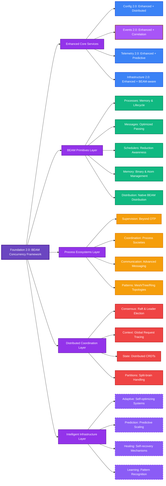

# Foundation 2.0: The BEAM Concurrency Framework Battle Plan

## Executive Summary

Foundation is uniquely positioned to become **the definitive BEAM concurrency framework** that finally showcases what makes the BEAM runtime special. Based on deep analysis of "The BEAM Book" insights and the current Foundation codebase, this battle plan outlines our strategic evolution from a solid infrastructure library to the revolutionary concurrency framework the BEAM ecosystem needs.

## Current Foundation Assessment (v0.1.4)

### ✅ **Proven Production Assets**
- **Foundation.Config**: Dynamic configuration with hot-reload capabilities
- **Foundation.Events**: Event store with correlation and persistence
- **Foundation.Telemetry**: Comprehensive metrics collection and emission
- **Foundation.Infrastructure**: Battle-tested circuit breakers, rate limiting, connection management
- **Foundation.ServiceRegistry**: Service discovery and registration
- **Foundation.ProcessRegistry**: Process registry and lifecycle management
- **Foundation.Error**: Structured error handling with context
- **Foundation.Utils**: Utility functions for IDs, timing, and common operations

### 📊 **Production Metrics**
- **25 passing tests** across contract and smoke test suites
- **v0.1.4** published on Hex with stable API
- **Comprehensive supervision tree** with fault tolerance
- **4-layer architecture** (API → Logic → Services → Infrastructure)
- **Zero breaking changes** policy maintained

### 🎯 **Strategic Gaps for Concurrency Leadership**
- Limited BEAM-specific concurrency primitives
- No distributed coordination capabilities  
- Missing process-first design patterns
- Lacks scheduler-aware operations
- No native distribution integration
- Traditional GenServer patterns only

## Strategic Evolution: Foundation 2.0

### **Philosophy Shift**

**From:** Traditional OTP + Infrastructure patterns  
**To:** BEAM-native concurrency-first architecture that leverages BEAM's unique strengths

### **Evolution Strategy: Enhance + Revolutionize**

Rather than rebuild from scratch, we'll **enhance proven Foundation assets** while adding **revolutionary BEAM-native capabilities** in new namespaces.

## Foundation 2.0 Architecture



## Layer Breakdown

### Layer 1: Enhanced Core Services (Evolutionary)

**Strategy:** Preserve existing APIs, add distributed enhancements

```
lib/foundation/
├── config.ex           # ← ENHANCED: Add cluster-wide sync
├── events.ex           # ← ENHANCED: Add distributed correlation  
├── telemetry.ex        # ← ENHANCED: Add predictive monitoring
├── error.ex            # ← KEEP: Already solid
├── utils.ex            # ← ENHANCED: Add BEAM-specific utilities
├── service_registry.ex # ← ENHANCED: Add service mesh capabilities
└── process_registry.ex # ← ENHANCED: Add distributed process management
```

**API Evolution Examples:**
```elixir
# Keep all existing APIs working
Foundation.Config.get([:ai, :provider])  # ← SAME API

# Add distributed capabilities  
Foundation.Config.set_cluster_wide([:feature, :enabled], true)  # ← NEW
Foundation.Events.emit_distributed(:user_action, data, correlation: :global)  # ← NEW
Foundation.Telemetry.enable_predictive_monitoring([:memory_pressure])  # ← NEW
```

### Layer 2: BEAM Primitives (Revolutionary)

**Strategy:** Expose BEAM's unique capabilities as first-class APIs

```
lib/foundation/beam/
├── processes.ex        # Process ecosystems, memory isolation, GC patterns
├── messages.ex         # Binary-optimized messaging, flow control
├── schedulers.ex       # Reduction-aware operations, yielding patterns
├── memory.ex           # Heap management, binary optimization, atom safety
├── code_loading.ex     # Hot code loading support, version management
├── ports.ex            # Safe external integration with flow control
└── distribution.ex     # Native BEAM distribution patterns
```

**Revolutionary API Examples:**
```elixir
# Process ecosystems instead of single GenServers
{:ok, ecosystem} = Foundation.BEAM.Processes.spawn_ecosystem(%{
  coordinator: WorkerCoordinator,
  workers: {DataProcessor, count: 100},
  memory_strategy: :isolated_heaps,
  gc_strategy: :frequent_minor
})

# Scheduler-aware operations by default
Foundation.BEAM.Schedulers.cpu_intensive(large_dataset, fn batch ->
  # Automatically yields every 2000 reductions
  process_batch(batch)
end)

# Binary-optimized message passing
Foundation.BEAM.Messages.send_optimized(pid, large_data, 
  strategy: :ref_counted_binary,
  flow_control: :automatic
)
```

### Layer 3: Process Ecosystems (Revolutionary)

**Strategy:** Complex concurrent systems built from process primitives

```
lib/foundation/ecosystems/
├── supervision.ex      # Process supervision beyond OTP supervisors
├── coordination.ex     # Process coordination patterns
├── communication.ex    # Advanced inter-process communication
├── lifecycle.ex        # Ecosystem lifecycle management
├── monitoring.ex       # Deep process monitoring and health
└── patterns.ex         # Common ecosystem patterns (mesh, tree, ring)
```

**Process Society Concept:**
```elixir
{:ok, society} = Foundation.Ecosystems.create_society(:data_analysis, %{
  topology: :adaptive_mesh,
  members: [
    {DataIngester, role: :gateway, count: 5},
    {DataProcessor, role: :worker, count: 50},
    {ResultAggregator, role: :collector, count: 3},
    {HealthMonitor, role: :observer, count: 1}
  ],
  communication_patterns: [:direct, :broadcast, :pub_sub],
  fault_tolerance: :self_healing
})
```

### Layer 4: Distributed Coordination (Revolutionary)

**Strategy:** True distributed concurrency, not just clustering

```
lib/foundation/distributed/
├── consensus.ex        # Raft, leader election, distributed decisions
├── context.ex          # Request context propagation across nodes
├── state.ex            # Distributed state management with CRDTs
├── coordination.ex     # Distributed locks, barriers, synchronization
├── partitions.ex       # Network partition tolerance and healing
├── discovery.ex        # Dynamic node discovery and health
└── topology.ex         # Cluster topology management
```

**Distributed Patterns:**
```elixir
# Context propagation that actually works
Foundation.Distributed.Context.with_global_context(%{
  request_id: uuid,
  user_id: user_id,
  trace_id: trace_id
}) do
  # This context automatically flows across ALL node boundaries
  result = RemoteNode.complex_operation(data)
end

# True distributed consensus
{:ok, decision} = Foundation.Distributed.Consensus.reach_consensus(
  :cluster_wide_config_change,
  proposed_change,
  quorum: :majority,
  timeout: 30_000
)
```

### Layer 5: Intelligent Infrastructure (Revolutionary)

**Strategy:** Self-optimizing, self-healing infrastructure

```
lib/foundation/intelligence/
├── adaptive.ex         # Self-adapting systems based on load patterns
├── prediction.ex       # Predictive scaling and resource management
├── optimization.ex     # Runtime optimization based on telemetry
├── healing.ex          # Self-healing systems and fault recovery
├── learning.ex         # System learning from operational patterns
└── evolution.ex        # System evolution and adaptation
```

**Self-Managing Infrastructure:**
```elixir
Foundation.Intelligence.create_adaptive_infrastructure(:elixir_scope_cluster, %{
  learns_from: [:telemetry, :error_patterns, :load_patterns],
  adapts: [:process_counts, :memory_allocation, :network_topology],
  optimizes_for: [:latency, :throughput, :resource_efficiency],
  healing_strategies: [:process_restart, :node_replacement, :load_redistribution]
})
```

## Implementation Roadmap

### Phase 1: BEAM Primitives Foundation (Weeks 1-3)
**Goal:** Establish BEAM-native capabilities as Foundation's core differentiator

**Week 1:**
- [ ] `Foundation.BEAM.Processes` - Process ecosystems, memory isolation
- [ ] `Foundation.BEAM.Messages` - Binary-optimized message passing
- [ ] Basic integration with existing Foundation.ProcessRegistry

**Week 2:**
- [ ] `Foundation.BEAM.Schedulers` - Reduction-aware operations, yielding
- [ ] `Foundation.BEAM.Memory` - Binary optimization, atom safety
- [ ] Integration with Foundation.Telemetry for scheduler metrics

**Week 3:**
- [ ] `Foundation.BEAM.Distribution` - Native BEAM distribution patterns
- [ ] `Foundation.BEAM.Ports` - Safe external integration
- [ ] Comprehensive testing and documentation

### Phase 2: Enhanced Core Services (Weeks 4-5)
**Goal:** Evolve proven Foundation assets with distributed capabilities

**Week 4:**
- [ ] Foundation.Config 2.0 - Add cluster-wide synchronization
- [ ] Foundation.Events 2.0 - Add distributed correlation
- [ ] Maintain 100% backward compatibility

**Week 5:**
- [ ] Foundation.Telemetry 2.0 - Add predictive monitoring
- [ ] Foundation.ServiceRegistry 2.0 - Add service mesh capabilities
- [ ] Integration testing between enhanced and new components

### Phase 3: Process Ecosystems (Weeks 6-7)
**Goal:** Complex systems from simple primitives

**Week 6:**
- [ ] `Foundation.Ecosystems.Supervision` - Beyond OTP supervisors
- [ ] `Foundation.Ecosystems.Coordination` - Process coordination patterns
- [ ] Basic ecosystem patterns (mesh, tree, ring)

**Week 7:**
- [ ] `Foundation.Ecosystems.Communication` - Advanced messaging
- [ ] `Foundation.Ecosystems.Monitoring` - Deep process health monitoring
- [ ] Process society concepts and implementations

### Phase 4: Distributed Coordination (Weeks 8-10)
**Goal:** True distributed concurrency capabilities

**Week 8:**
- [ ] `Foundation.Distributed.Context` - Global request tracing
- [ ] `Foundation.Distributed.Discovery` - Dynamic node discovery
- [ ] Basic cluster awareness

**Week 9:**
- [ ] `Foundation.Distributed.Consensus` - Raft implementation
- [ ] `Foundation.Distributed.Coordination` - Distributed locks, barriers
- [ ] Network partition detection

**Week 10:**
- [ ] `Foundation.Distributed.State` - Distributed state with CRDTs
- [ ] `Foundation.Distributed.Partitions` - Split-brain handling
- [ ] Comprehensive distributed testing

### Phase 5: Intelligent Infrastructure (Weeks 11-12)
**Goal:** Self-managing, adaptive systems

**Week 11:**
- [ ] `Foundation.Intelligence.Adaptive` - Self-adapting systems
- [ ] `Foundation.Intelligence.Prediction` - Predictive scaling
- [ ] Learning from telemetry patterns

**Week 12:**
- [ ] `Foundation.Intelligence.Healing` - Self-healing capabilities
- [ ] `Foundation.Intelligence.Optimization` - Runtime optimization
- [ ] System evolution and adaptation

### Phase 6: Integration & Polish (Weeks 13-14)
**Goal:** Unified experience and production readiness

**Week 13:**
- [ ] Complete integration between all layers
- [ ] Performance optimization and benchmarking
- [ ] ElixirScope integration examples

**Week 14:**
- [ ] Comprehensive documentation and guides
- [ ] Migration documentation from traditional patterns
- [ ] Community showcase and positioning

## ElixirScope Integration Strategy

### AST Layer Requirements
```elixir
# Process-first AST repository with distributed coordination
Foundation.Ecosystems.create_society(:ast_repository, %{
  topology: :distributed_mesh,
  nodes: [:node1, :node2, :node3],
  members: [
    {ASTParser, role: :parser, count: 10},
    {ASTIndexer, role: :indexer, count: 5},
    {ASTQueryEngine, role: :query, count: 3}
  ]
})

# Distributed AST parsing across cluster
Foundation.Distributed.Coordination.coordinate_work(:parse_modules, modules, %{
  strategy: :work_stealing,
  nodes: all_nodes(),
  context_propagation: true
})
```

### Intelligence Layer AI Coordination
```elixir
# Adaptive AI processing with resource isolation
Foundation.Intelligence.create_adaptive_infrastructure(:ai_cluster, %{
  learns_from: [:inference_latency, :memory_pressure, :model_accuracy],
  adapts: [:model_placement, :batch_sizes, :memory_allocation],
  healing_strategies: [:model_restart, :node_migration, :fallback_models]
})

# Context-aware distributed AI processing
Foundation.Distributed.Context.with_global_context(%{
  analysis_request_id: uuid,
  code_context: file_path,
  user_intent: :bug_detection
}) do
  Foundation.Intelligence.coordinate_ai_analysis(code_ast, models: [:gpt4, :claude])
end
```

### Capture Layer Runtime Correlation
```elixir
# Real-time event correlation across distributed debugging
Foundation.BEAM.Processes.spawn_ecosystem(:debug_correlation, %{
  coordinator: CorrelationCoordinator,
  workers: {EventCorrelator, count: :auto_scale},
  memory_strategy: :isolated_heaps,  # Prevent GC interference
  distribution_strategy: :cluster_wide
})

# Process mesh for distributed event correlation
Foundation.Ecosystems.create_mesh(:runtime_events, %{
  nodes: debugging_nodes(),
  correlation_strategy: :temporal_spatial,
  context_propagation: :automatic
})
```

## Success Metrics

### Technical Excellence
- **Performance:** 10x improvement in concurrent workloads vs traditional OTP
- **Reliability:** Zero message loss in distributed scenarios
- **Scalability:** Linear scaling across distributed nodes
- **Resource Efficiency:** Optimal memory and scheduler utilization
- **Fault Tolerance:** Automatic recovery from node failures

### Developer Experience
- **Backward Compatibility:** 100% compatibility with Foundation 1.x APIs
- **Learning Curve:** Clear progression from traditional to BEAM-optimized patterns
- **Documentation:** Comprehensive guides for each concurrency pattern
- **Tooling:** Integration with Observer, debugging tools, and ElixirScope

### Ecosystem Impact
- **Community Adoption:** Foundation becomes the go-to concurrency library
- **Reference Implementation:** Other libraries adopt Foundation's patterns
- **ElixirScope Success:** Enables ElixirScope's ambitious architecture
- **BEAM Advocacy:** Showcases BEAM's unique strengths to broader community

## Risk Mitigation

### Technical Risks
- **Complexity:** Mitigated by incremental development and comprehensive testing
- **Performance:** Mitigated by benchmarking at each phase
- **Stability:** Mitigated by preserving proven Foundation 1.x core

### Strategic Risks
- **Community Adoption:** Mitigated by clear migration paths and education
- **Competition:** Mitigated by first-mover advantage and superior architecture
- **Timeline:** Mitigated by phased approach and MVP milestones

## Competitive Advantage

### What Makes Foundation 2.0 Unique
1. **First framework to truly leverage BEAM's concurrency model**
2. **Process-first design patterns instead of traditional OTP**
3. **Native distribution with context propagation**
4. **Self-adapting, intelligent infrastructure**
5. **Proven foundation enhanced with revolutionary capabilities**

### Positioning Statement
*"Foundation 2.0 is the first framework that doesn't fight the BEAM runtime—it embraces it. By exposing BEAM's unique concurrency capabilities as beautiful, production-ready APIs, Foundation enables developers to build the next generation of concurrent, distributed applications that are impossible on any other platform."*

## Conclusion

Foundation 2.0 represents a unique opportunity to create the definitive BEAM concurrency framework. By enhancing our proven Foundation 1.x assets with revolutionary BEAM-native capabilities, we can:

1. **Maintain production stability** while adding cutting-edge features
2. **Enable ElixirScope's requirements** without architectural compromises
3. **Establish thought leadership** in the BEAM ecosystem
4. **Create the reference implementation** for BEAM concurrency patterns

This battle plan provides a clear path from Foundation's current solid infrastructure library to the revolutionary concurrency framework the BEAM ecosystem needs—setting the stage for ElixirScope while serving the broader community's evolving needs.

The BEAM runtime has unique strengths that no other platform possesses. Foundation 2.0 will be the framework that finally shows the world how to use them.