# Foundation 2.0: Libcluster-Partisan Battle Plan

## Executive Summary

Foundation 2.0 combines the **best of both worlds**: deep BEAM primitives for local concurrency excellence with Partisan-powered distribution that obsoletes libcluster. This unified approach creates the first framework that's both BEAM-native and enterprise-distributed, positioning Foundation as the definitive platform for next-generation distributed BEAM applications.

## Strategic Synthesis: Current Progress + Partisan Vision

### **Current Foundation Assessment (15% Complete)**

#### ✅ **Proven Foundation 1.x Assets**
- **25 passing tests** - Stable production foundation
- **v0.1.4 on Hex** - Established user base and API
- **Complete core services**: Config, Events, Telemetry, Error, Infrastructure
- **4-layer architecture** - Solid architectural foundation

#### 🏗️ **In-Progress BEAM Primitives**
- **Foundation.BEAM.Processes** ✅ - Process ecosystems implemented
- **Foundation.BEAM.Messages** ❌ - Not started
- **Foundation.BEAM.Schedulers** ❌ - Not started
- **Foundation.BEAM.Memory** ❌ - Not started
- **Foundation.BEAM.Distribution** ❌ - **OPPORTUNITY FOR PARTISAN**

#### 🎯 **Revolutionary Opportunity**
The original battle plan's `Foundation.BEAM.Distribution` module is the **perfect integration point** for Partisan. Instead of building basic BEAM distribution, we can leapfrog to revolutionary Partisan-powered capabilities.

## Comparative Analysis: Original vs Partisan Vision

### **Original Battle Plan Strengths**
- ✅ **BEAM-native approach** - Deep integration with runtime primitives
- ✅ **Process ecosystems** - Revolutionary local concurrency patterns
- ✅ **Solid progression** - Build up from primitives to distributed systems
- ✅ **Backward compatibility** - Preserve Foundation 1.x APIs

### **Original Battle Plan Limitations**
- ❌ **Basic distribution** - Limited to traditional Distributed Erlang
- ❌ **No clustering innovation** - Doesn't address libcluster limitations
- ❌ **Sequential approach** - Distributed capabilities come late (Phase 4)

### **10030.md Partisan Vision Strengths**
- ✅ **Revolutionary distribution** - Partisan replaces libcluster entirely
- ✅ **Scalability breakthrough** - 1000+ nodes vs ~200 with Distributed Erlang
- ✅ **Network innovation** - Multi-channel, dynamic topologies
- ✅ **Immediate differentiation** - Clear competitive advantage

### **10030.md Partisan Vision Gaps**
- ❌ **Missing BEAM primitives** - Doesn't leverage unique runtime features
- ❌ **Distribution-only focus** - Limited local concurrency innovation
- ❌ **High complexity** - Partisan learning curve without stepping stones

## Unified Strategic Vision: Foundation 2.0 Libcluster-Partisan

### **Core Philosophy**
Foundation 2.0 = **BEAM Primitives Excellence** + **Partisan Distribution Revolution**

The synthesis approach:
1. **Enhance proven Foundation 1.x** - Zero breaking changes, added capabilities
2. **Complete BEAM primitives** - Revolutionary local concurrency patterns
3. **Integrate Partisan as distribution layer** - Replace traditional clustering
4. **Bridge local and distributed** - Seamless progression from single-node to cluster

## Foundation 2.0 Unified Architecture

```mermaid
graph TD
    A[Foundation 2.0: BEAM-Native + Partisan-Distributed] --> B[Enhanced Core Services]
    A --> C[BEAM Primitives Layer] 
    A --> D[Partisan Distribution Layer]
    A --> E[Process Ecosystems Layer]
    A --> F[Intelligent Infrastructure Layer]
    
    B --> B1[Config 2.0: Enhanced + Distributed]
    B --> B2[Events 2.0: Enhanced + Partisan Channels]
    B --> B3[Telemetry 2.0: Enhanced + Cluster Aggregation]
    B --> B4[Registry 2.0: Enhanced + Service Mesh]
    
    C --> C1[Processes: Ecosystems ✅]
    C --> C2[Messages: Binary Optimization]
    C --> C3[Schedulers: Reduction Awareness]
    C --> C4[Memory: Atom Safety + GC Patterns]
    
    D --> D1[Distribution: Partisan Integration]
    D --> D2[Channels: Multi-channel Communication]
    D --> D3[Topology: Dynamic Network Management]
    D --> D4[Discovery: Multi-strategy Node Discovery]
    
    E --> E1[Coordination: Partisan-aware Ecosystems]
    E --> E2[Communication: Cross-node Messaging]
    E --> E3[Supervision: Distributed Process Trees]
    E --> E4[Patterns: Mesh/Tree/Ring across Cluster]
    
    F --> F1[Adaptive: Self-optimizing Topologies]
    F --> F2[Prediction: Predictive Scaling]
    F --> F3[Healing: Self-recovery Mechanisms]
    F --> F4[Context: Global Request Tracing]

    %% Styling
    classDef primary fill:#6B46C1,stroke:#4C1D95,stroke-width:3px,color:#FFFFFF
    classDef secondary fill:#9333EA,stroke:#6B21A8,stroke-width:2px,color:#FFFFFF
    classDef partisan fill:#EF4444,stroke:#B91C1C,stroke-width:3px,color:#FFFFFF
    classDef beam fill:#10B981,stroke:#047857,stroke-width:2px,color:#FFFFFF
    classDef enhanced fill:#F59E0B,stroke:#D97706,stroke-width:2px,color:#FFFFFF
    classDef intelligent fill:#3B82F6,stroke:#1D4ED8,stroke-width:2px,color:#FFFFFF

    class A primary
    class B,E,F secondary
    class D,D1,D2,D3,D4 partisan
    class C,C1,C2,C3,C4 beam
    class B1,B2,B3,B4 enhanced
    class F1,F2,F3,F4 intelligent
```



## Implementation Roadmap: Parallel Track Strategy

### **Track 1: BEAM Primitives (Foundation Excellence)**
Complete the revolutionary local concurrency capabilities

### **Track 2: Partisan Integration (Distribution Revolution)** 
Replace libcluster with Partisan-powered distribution

### **Track 3: Unified Features (Bridging Innovation)**
Seamlessly integrate local and distributed capabilities

## Phase-by-Phase Implementation Plan

### **Phase 1: Parallel Foundation (Weeks 1-3)**
**Objective**: Complete BEAM primitives while establishing Partisan foundation

#### **Week 1: BEAM Primitives Completion**
**Track 1: Complete BEAM Layer**
- [ ] **Foundation.BEAM.Messages** - Binary-optimized messaging
  - Smart message passing with copy minimization
  - Flow control and backpressure
  - IOList optimization for binary construction
- [ ] **Foundation.BEAM.Memory** - Memory management patterns
  - Binary optimization (ref-counted sharing)
  - Atom safety (prevent table exhaustion)
  - GC isolation patterns
- [ ] **Enhance Foundation.BEAM.Processes** - Add advanced ecosystem patterns
  - Mesh, ring, tree topologies for local ecosystems
  - Cross-ecosystem communication
  - Advanced supervision patterns

**Track 2: Partisan Foundation**
- [ ] **Foundation.BEAM.Distribution** - Partisan integration core
  - Add Partisan as dependency
  - Basic Partisan configuration management
  - Environment detection (dev/test/prod topologies)
- [ ] **Partisan Compatibility Layer** - libcluster API compatibility
  - Support existing libcluster configurations
  - Migration utilities from libcluster
  - Backward compatibility testing

#### **Week 2: Partisan Core Implementation**
**Track 2: Core Partisan Features**
- [ ] **Foundation.Distributed.Topology** - Dynamic topology management
  - Full-mesh, HyParView, client-server strategies
  - Automatic topology switching based on cluster size
  - Performance monitoring and optimization
- [ ] **Foundation.Distributed.Channels** - Multi-channel communication
  - Separate channels for coordination, events, telemetry
  - Channel prioritization and QoS
  - Head-of-line blocking elimination
- [ ] **Foundation.Distributed.Discovery** - Enhanced node discovery
  - Kubernetes, Consul, DNS, static configurations
  - Multi-strategy discovery with failover
  - Health monitoring and automatic reconnection

**Track 1: BEAM Primitives Testing**
- [ ] Comprehensive testing of all BEAM primitives
- [ ] Performance benchmarking vs traditional approaches
- [ ] Memory usage optimization validation

#### **Week 3: Integration Foundation**
**Track 3: Bridge Local + Distributed**
- [ ] **Foundation.BEAM.Distribution** - Complete Partisan integration
  - Replace any Distributed Erlang usage with Partisan
  - Multi-node ecosystem support
  - Cross-node process coordination
- [ ] **Enhanced Process Ecosystems** - Partisan-aware ecosystems
  - Distributed process spawning across Partisan cluster
  - Cross-node supervision trees
  - Fault tolerance across network partitions

### **Phase 2: Enhanced Core Services with Partisan (Weeks 4-6)**
**Objective**: Transform Foundation 1.x services into distributed, Partisan-powered capabilities

#### **Week 4: Distributed Configuration & Events**
- [ ] **Foundation.Config 2.0** - Partisan-distributed configuration
  - Cluster-wide configuration synchronization via Partisan channels
  - Consensus-based configuration updates
  - Conflict resolution with intelligent merging
  - Adaptive configuration learning
  - **100% API Compatibility**: All Foundation.Config APIs unchanged
- [ ] **Foundation.Events 2.0** - Partisan-powered event streaming
  - Distributed event emission across Partisan cluster
  - Intelligent event correlation using cluster topology
  - Event routing optimization via Partisan channels
  - Predictive event patterns and anomaly detection
  - **100% API Compatibility**: All Foundation.Events APIs unchanged

#### **Week 5: Distributed Telemetry & Registry**
- [ ] **Foundation.Telemetry 2.0** - Cluster-wide metrics via Partisan
  - Metrics aggregation across Partisan cluster
  - Predictive monitoring with anomaly detection
  - Performance optimization recommendations
  - Adaptive thresholds based on cluster behavior
  - **100% API Compatibility**: All Foundation.Telemetry APIs unchanged
- [ ] **Foundation.ServiceRegistry 2.0** - Service mesh capabilities
  - Cross-cluster service discovery via Partisan
  - Intelligent load balancing and routing
  - Health monitoring and automatic failover
  - Service mesh topology awareness
  - **100% API Compatibility**: All Foundation.ServiceRegistry APIs unchanged

#### **Week 6: Process Registry & Error Correlation**
- [ ] **Foundation.ProcessRegistry 2.0** - Distributed process coordination
  - Cluster-wide process registration via Partisan
  - Cross-node process lookup and monitoring
  - Distributed supervision trees
  - Process migration and load balancing
  - **100% API Compatibility**: All Foundation.ProcessRegistry APIs unchanged
- [ ] **Foundation.Error 2.0** - Distributed error correlation
  - Error pattern learning across cluster
  - Cascade prediction and prevention
  - Proactive error detection
  - Cross-cluster error context propagation

### **Phase 3: Advanced Distributed Coordination (Weeks 7-9)**
**Objective**: Revolutionary distributed concurrency patterns impossible with traditional clustering

#### **Week 7: Context & State Management**
- [ ] **Foundation.Distributed.Context** - Global context propagation
  - Request tracing across Partisan topologies
  - Context flowing through async operations
  - Distributed debugging support
  - Cross-network boundary context preservation
- [ ] **Foundation.Distributed.State** - Distributed state management
  - CRDTs with Partisan broadcast optimization
  - Conflict-free replicated data types
  - Eventually consistent distributed state
  - Partition tolerance strategies

#### **Week 8: Consensus & Coordination**
- [ ] **Foundation.Distributed.Consensus** - Raft over Partisan channels
  - Leader election with topology awareness
  - Distributed decision making
  - Quorum-based operations
  - Network partition handling
- [ ] **Foundation.Distributed.Coordination** - Advanced coordination primitives
  - Distributed locks and barriers
  - Cross-cluster synchronization
  - Partition-tolerant coordination
  - Performance-optimized coordination patterns

#### **Week 9: Ecosystem Distribution**
- [ ] **Foundation.Ecosystems.Distributed** - Cross-cluster process ecosystems
  - Distributed process societies
  - Cross-node ecosystem coordination
  - Fault tolerance across network boundaries
  - Intelligent process placement
- [ ] **Foundation.Ecosystems.Communication** - Advanced distributed messaging
  - Cross-ecosystem communication patterns
  - Partisan-optimized message routing
  - Distributed backpressure and flow control

### **Phase 4: Intelligent Infrastructure (Weeks 10-12)**
**Objective**: Self-managing, adaptive distributed systems

#### **Week 10: Adaptive Systems**
- [ ] **Foundation.Intelligence.AdaptiveTopology** - Self-optimizing networks
  - Learn from message patterns and latency
  - Automatic Partisan topology reconfiguration
  - Performance-driven network optimization
  - Load-aware topology switching
- [ ] **Foundation.Intelligence.PredictiveScaling** - Predictive node management
  - Workload prediction and scaling
  - Resource utilization optimization
  - Proactive cluster scaling
  - Cost optimization strategies

#### **Week 11: Failure Prediction & Healing**
- [ ] **Foundation.Intelligence.FailurePrediction** - Proactive failure detection
  - Pattern recognition for failure prediction
  - Network partition prediction
  - Performance degradation early warning
  - Preventive measures and mitigation
- [ ] **Foundation.Intelligence.Healing** - Self-healing distributed systems
  - Automatic recovery from failures
  - Topology healing after partitions
  - Process ecosystem recovery
  - Performance regression healing

#### **Week 12: Evolution & Optimization**
- [ ] **Foundation.Intelligence.Evolution** - System evolution
  - System adaptation based on load patterns
  - Automatic optimization learning
  - Long-term performance improvement
  - Cluster evolution strategies
- [ ] **Complete Integration Testing** - End-to-end validation
  - Multi-node cluster testing
  - Partition tolerance validation
  - Performance benchmarking vs libcluster
  - Migration testing from traditional setups

## API Evolution Strategy: Zero Breaking Changes

### **Foundation 1.x APIs (Unchanged)**
```elixir
# All existing APIs work exactly the same
Foundation.Config.get([:ai, :provider])           # ✅ SAME
Foundation.Events.new_event(:test, %{data: "test"}) # ✅ SAME  
Foundation.Telemetry.emit_counter([:requests], %{}) # ✅ SAME
Foundation.ServiceRegistry.register(:prod, :service, self()) # ✅ SAME
```

### **Foundation 2.0 Enhanced APIs (Additive)**
```elixir
# Enhanced capabilities - optional upgrades
Foundation.Config.set_cluster_wide([:feature, :enabled], true)
Foundation.Config.enable_adaptive_config([:auto_optimize, :predict_needs])

Foundation.Events.emit_distributed(:user_action, data, correlation: :global)
Foundation.Events.subscribe_cluster_wide([:user_action, :system_event])
Foundation.Events.enable_intelligent_correlation()

Foundation.Telemetry.get_cluster_metrics(aggregation: :sum)
Foundation.Telemetry.enable_predictive_monitoring([:memory_pressure])
Foundation.Telemetry.detect_performance_anomalies()

Foundation.ServiceRegistry.register_mesh_service(:api, self(), capabilities: [:http])
Foundation.ServiceRegistry.discover_services(capability: :ml_inference)
Foundation.ServiceRegistry.route_to_best_instance(:api, request_context)
```

### **Foundation 2.0 Revolutionary APIs (New Capabilities)**
```elixir
# BEAM primitives - impossible with traditional approaches
Foundation.BEAM.Processes.spawn_ecosystem(%{
  coordinator: DataCoordinator,
  workers: {DataProcessor, count: 100},
  memory_strategy: :isolated_heaps,
  distribution: :cluster_wide
})

Foundation.BEAM.Messages.send_optimized(pid, large_data,
  strategy: :ref_counted_binary,
  channel: :high_priority,
  flow_control: :automatic
)

# Partisan distribution - revolutionary clustering
Foundation.Distributed.Topology.switch_topology(:full_mesh, :hyparview)
Foundation.Distributed.Context.with_global_context(%{
  request_id: uuid,
  trace_id: trace_id
}) do
  # Context flows across ALL network boundaries automatically
  RemoteNode.complex_operation(data)
end

# Intelligent infrastructure - self-managing systems
Foundation.Intelligence.create_adaptive_infrastructure(:my_cluster, %{
  learns_from: [:telemetry, :error_patterns, :load_patterns],
  adapts: [:topology, :process_counts, :memory_allocation],
  optimizes_for: [:latency, :throughput, :cost_efficiency]
})
```

## Competitive Positioning: Foundation 2.0 vs The World

### **vs. Traditional libcluster + Distributed Erlang**
| Feature | libcluster + Disterl | Foundation 2.0 |
|---------|---------------------|-----------------|
| **Node Scaling** | ~200 nodes | 1000+ nodes |
| **Network Architecture** | Single TCP, full-mesh | Multi-channel, adaptive topology |
| **Head-of-line Blocking** | Yes (major limitation) | No (eliminated via channels) |
| **Dynamic Topology** | No | Yes (runtime switching) |
| **Context Propagation** | Manual/None | Automatic across all boundaries |
| **Intelligent Features** | None | Predictive, adaptive, self-healing |
| **BEAM Integration** | Basic | Deep primitives integration |
| **Local Concurrency** | Standard OTP | Revolutionary process ecosystems |

### **vs. External Platforms (Kubernetes, Service Mesh)**
| Feature | External Platforms | Foundation 2.0 |
|---------|-------------------|-----------------|
| **Integration** | External, complex | Native, seamless |
| **Performance** | Network overhead | BEAM-optimized |
| **Fault Tolerance** | Infrastructure-level | Process-level + infrastructure |
| **Context** | Limited, manual | Automatic, comprehensive |
| **Learning Curve** | High (new platforms) | Natural (BEAM-native) |
| **Operational Complexity** | High | Self-managing |

### **Strategic Differentiation**
1. **First BEAM-native distributed framework** - Not a wrapper around external tools
2. **Zero breaking changes migration** - Risk-free upgrade from any BEAM setup
3. **Revolutionary local + distributed** - Excellent locally, revolutionary distributed
4. **Self-managing intelligence** - Reduces operational burden significantly
5. **Process-first architecture** - Leverages BEAM's unique strengths

## Migration Strategy: From Any Foundation to Foundation 2.0

### **Scenario 1: Existing Foundation 1.x Users**
```elixir
# Before: Foundation 1.x
children = [
  {Foundation.Services.ConfigServer, []},
  {Foundation.Services.EventStore, []},
  {Foundation.Services.TelemetryService, []}
]

# After: Foundation 2.0 (Zero Changes Required)
children = [
  {Foundation.Services.ConfigServer, []},     # ✅ Works unchanged
  {Foundation.Services.EventStore, []},       # ✅ Works unchanged  
  {Foundation.Services.TelemetryService, []}  # ✅ Works unchanged
]

# Optional: Add distributed features when ready
Foundation.Config.enable_cluster_wide_sync()
Foundation.Events.enable_distributed_correlation()
Foundation.Telemetry.enable_cluster_aggregation()
```

### **Scenario 2: libcluster Users**
```elixir
# Before: libcluster
config :libcluster,
  topologies: [
    k8s: [
      strategy: Cluster.Strategy.Kubernetes,
      config: [kubernetes_selector: "app=myapp"]
    ]
  ]

# After: Foundation 2.0 (Backward Compatible + Enhanced)
config :foundation,
  # libcluster compatibility mode
  libcluster_topologies: [
    k8s: [
      strategy: Cluster.Strategy.Kubernetes,
      config: [kubernetes_selector: "app=myapp"]
    ]
  ],
  # Foundation 2.0 enhancements (optional)
  partisan_overlays: [
    control_plane: [overlay: :full_mesh, channels: [:coordination]],
    data_plane: [overlay: :hyparview, channels: [:events, :user_data]]
  ]
```

### **Scenario 3: Traditional OTP Applications**
```elixir
# Before: Standard OTP
children = [
  MyApp.Repo,
  {MyApp.Worker, []},
  MyApp.Web.Endpoint
]

# After: Foundation 2.0 Enhanced (Gradual Migration)
children = [
  MyApp.Repo,
  
  # Replace single worker with process ecosystem
  {Foundation.BEAM.Processes, %{
    coordinator: MyApp.WorkerCoordinator,
    workers: {MyApp.Worker, count: :auto_scale},
    memory_strategy: :isolated_heaps
  }},
  
  MyApp.Web.Endpoint,
  
  # Add Foundation 2.0 services for distributed capabilities
  {Foundation.Services.ConfigServer, []},
  {Foundation.Distributed.Topology, [
    overlays: [
      app_cluster: [strategy: :hyparview, discovery: :kubernetes]
    ]
  ]}
]
```

## Performance Benchmarks & Validation

### **Expected Performance Improvements**
- **Cluster Formation**: 3-5x faster than libcluster + Distributed Erlang
- **Message Throughput**: 2-10x higher (depending on message size and pattern)
- **Network Utilization**: 50% reduction in coordination overhead
- **Fault Recovery**: 10x faster partition recovery
- **Memory Efficiency**: 30% reduction via BEAM primitives optimization

### **Validation Strategy**
1. **Microbenchmarks**: Individual component performance vs alternatives
2. **Integration Benchmarks**: Full-stack scenarios vs traditional setups
3. **Chaos Testing**: Network partitions, node failures, load spikes
4. **Production Validation**: ElixirScope integration as primary test case

## ElixirScope Integration: Real-World Validation

### **AST Repository Enhancement**
```elixir
# Distributed AST parsing with Foundation 2.0
Foundation.Ecosystems.create_distributed_society(:ast_repository, %{
  topology: :adaptive_mesh,
  nodes: [:parser1, :parser2, :parser3],
  coordinator: ASTCoordinator,
  workers: {ASTParser, count: :auto_scale},
  distribution: :partisan,
  intelligence: [:predictive_scaling, :load_balancing]
})

# Context-aware distributed parsing
Foundation.Distributed.Context.with_global_context(%{
  analysis_request_id: uuid,
  codebase_context: project_root,
  parsing_strategy: :incremental
}) do
  Foundation.Distributed.coordinate_work(:parse_modules, modules, %{
    strategy: :work_stealing,
    nodes: all_nodes(),
    optimization: :memory_isolated
  })
end
```

### **Intelligence Layer Coordination**
```elixir
# AI processing with Partisan-aware distribution
Foundation.Intelligence.create_adaptive_infrastructure(:ai_cluster, %{
  learns_from: [:model_latency, :memory_pressure, :accuracy_metrics],
  adapts: [:model_placement, :batch_sizes, :topology],
  healing_strategies: [:model_restart, :node_migration, :fallback_routing]
})

# Multi-model coordination across cluster
Foundation.Distributed.coordinate_ai_inference(
  code_context,
  models: [:gpt4, :claude, :local_model],
  strategy: :parallel_consensus,
  fallback: :local_model,
  context_preservation: :automatic
)
```

### **Capture Layer Real-time Correlation**
```elixir
# Real-time debugging with distributed event correlation
Foundation.BEAM.Processes.spawn_ecosystem(:debug_correlation, %{
  coordinator: DebugCoordinator,
  workers: {EventCorrelator, count: :adaptive},
  memory_strategy: :isolated_heaps,
  distribution: :cluster_wide,
  intelligence: [:pattern_detection, :anomaly_detection]
})

# Cross-cluster debugging with automatic context flow
Foundation.Distributed.Context.enable_debug_mode()
Foundation.Intelligence.enable_proactive_correlation(%{
  correlation_strategies: [:temporal, :spatial, :causal],
  prediction_models: [:anomaly_detection, :pattern_matching],
  automatic_debugging: [:context_reconstruction, :root_cause_analysis]
})
```

## Success Metrics & Timeline

### **Technical Success Criteria**
- **Week 3**: Partisan cluster formation working, BEAM primitives complete
- **Week 6**: All Foundation 1.x APIs enhanced with distributed capabilities
- **Week 9**: Advanced coordination primitives working across cluster
- **Week 12**: Intelligent infrastructure self-managing and optimizing

### **Performance Targets**
- **Scalability**: Support 1000+ nodes vs ~200 with traditional approaches
- **Throughput**: 5x improvement in distributed message processing
- **Latency**: 50% reduction in cluster coordination overhead
- **Reliability**: 99.9% uptime during network partitions vs 95% traditional

### **Strategic Success Indicators**
- **Zero Regression**: All existing Foundation tests continue passing
- **Seamless Migration**: ElixirScope integration without architectural changes
- **Community Interest**: Developer adoption and community feedback
- **Competitive Moat**: Clear differentiation from libcluster and alternatives

## Risk Mitigation Strategy

### **Technical Risks**
- **Partisan Complexity**: Mitigated by gradual integration and comprehensive testing
- **Performance Regression**: Mitigated by continuous benchmarking
- **Integration Issues**: Mitigated by maintaining Foundation 1.x compatibility

### **Strategic Risks**
- **Timeline Pressure**: Mitigated by parallel track development
- **Community Adoption**: Mitigated by zero breaking changes migration
- **Competition Response**: Mitigated by first-mover advantage and technical superiority

### **Contingency Plans**
- **Partisan Issues**: Fall back to enhanced Distributed Erlang for Phase 1
- **Performance Problems**: Optimize incrementally while maintaining functionality
- **Integration Complexity**: Phase rollout to reduce risk surface area

## Conclusion: The Ultimate BEAM Framework

Foundation 2.0 represents a unique opportunity to create the definitive framework for distributed BEAM applications. By combining:

1. **Proven Foundation 1.x stability** - Zero risk migration path
2. **Revolutionary BEAM primitives** - Showcase unique runtime capabilities  
3. **Partisan-powered distribution** - Breakthrough clustering technology
4. **Intelligent infrastructure** - Self-managing, adaptive systems

We create a framework that's:
- **Impossible to ignore** - Clear technical superiority
- **Easy to adopt** - Zero breaking changes migration
- **Future-proof** - Next-generation architecture ready for cloud-native scale
- **Community-defining** - Sets the standard for BEAM distributed applications

Foundation 2.0 doesn't just improve on existing approaches—it creates an entirely new category of distributed BEAM framework that showcases what the BEAM runtime can really do at enterprise scale.

**The vision is clear. The technology is proven. The opportunity is now.**

Let's build the framework that finally shows the world why BEAM is the superior platform for distributed applications. 🚀