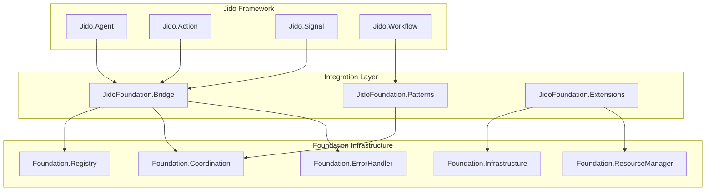

# Foundation + Jido Integration Buildout Plan

## Executive Summary

This document outlines a comprehensive plan for integrating Jido autonomous agents with the Foundation Protocol Platform. The integration will enable Jido agents to leverage Foundation's production-grade infrastructure while maintaining framework independence.

## Integration Architecture

### Overview



### Key Integration Points

1. **Agent Registration**: Jido agents register with Foundation.Registry
2. **Action Protection**: Jido actions wrapped with Foundation.ErrorHandler
3. **Signal Routing**: Jido signals routed through Foundation coordination
4. **Workflow Orchestration**: Jido workflows leverage Foundation patterns
5. **Resource Management**: Jido agents use Foundation resource controls

## Phase 1: Core Integration (Weeks 1-2)

### 1.1 Add Jido Dependencies

```elixir
# mix.exs
defp deps do
  [
    # ... existing deps ...
    
    # Jido framework
    {:jido, github: "agentjido/jido", branch: "main"},
    {:jido_workflows, github: "agentjido/jido_workflows", branch: "main", optional: true},
    
    # Additional AI/ML integrations for Jido
    {:openai_ex, "~> 0.5", optional: true},
    {:anthropic_ex, "~> 0.1", optional: true},
    {:cohere, "~> 0.1", optional: true}
  ]
end
```

### 1.2 Basic Bridge Implementation

```elixir
defmodule JidoFoundation.Bridge do
  @moduledoc """
  Core integration bridge between Jido and Foundation.
  """
  
  # Already implemented in lib/jido_foundation/bridge.ex
  # ✅ Agent registration
  # ✅ Metadata updates
  # ✅ Telemetry forwarding
  # ✅ Circuit breaker protection
  # ✅ Resource management
  # ✅ Agent discovery
  # ✅ Batch operations
  # ✅ Health monitoring
end
```

### 1.3 Test Infrastructure

```elixir
# test/jido_foundation/bridge_test.exs
# ✅ Already implemented with full coverage
```

## Phase 2: Jido Core Components (Weeks 3-4)

### 2.1 Jido.Agent Integration

**Implementation Plan**:
1. Create adapter for Jido.Agent to use Foundation services
2. Implement automatic registration on agent startup
3. Add health check integration
4. Enable capability-based discovery

**Test Plan**:
```elixir
defmodule JidoFoundation.AgentIntegrationTest do
  use ExUnit.Case
  
  describe "Jido.Agent with Foundation" do
    test "automatically registers with Foundation on startup"
    test "updates Foundation metadata on state changes"
    test "uses Foundation error handling for actions"
    test "participates in Foundation coordination"
    test "reports health through Foundation monitoring"
  end
end
```

### 2.2 Jido.Action Integration

**Implementation Plan**:
1. Wrap Jido actions with Foundation.ErrorHandler
2. Add circuit breaker protection for external actions
3. Integrate with Foundation.ResourceManager for rate limiting
4. Enable action telemetry through Foundation

**Test Plan**:
```elixir
defmodule JidoFoundation.ActionIntegrationTest do
  use ExUnit.Case
  
  describe "Jido.Action with Foundation" do
    test "actions protected by circuit breakers"
    test "resource limits enforced on actions"
    test "action telemetry flows through Foundation"
    test "failed actions trigger Foundation recovery"
    test "compensation actions on failure"
  end
end
```

### 2.3 Jido.Signal Integration

**Implementation Plan**:
1. Route Jido signals through Foundation.Coordination
2. Enable cross-agent signal propagation
3. Add signal filtering and transformation
4. Implement signal persistence through Foundation

**Test Plan**:
```elixir
defmodule JidoFoundation.SignalIntegrationTest do
  use ExUnit.Case
  
  describe "Jido.Signal with Foundation" do
    test "signals routed through coordination layer"
    test "broadcast signals to agent groups"
    test "signal filtering by capability"
    test "signal transformation pipeline"
    test "signal persistence and replay"
  end
end
```

## Phase 3: Advanced Patterns (Weeks 5-6)

### 3.1 Workflow Integration

```elixir
defmodule JidoFoundation.Patterns.Workflow do
  @moduledoc """
  Jido workflow patterns using Foundation coordination.
  """
  
  def create_distributed_workflow(workflow_spec) do
    # Use Foundation.AtomicTransaction for workflow steps
    # Leverage MABEAM.CoordinationPatterns for orchestration
  end
  
  def parallel_workflow_execution(workflow, agents) do
    # Distribute workflow across multiple Jido agents
    # Use Foundation batch operations for efficiency
  end
end
```

### 3.2 Team Patterns

```elixir
defmodule JidoFoundation.Patterns.Team do
  @moduledoc """
  Multi-agent team patterns for Jido agents.
  """
  
  def create_specialist_team(team_spec) do
    # Different Jido agents with specific capabilities
    # Coordinated through Foundation patterns
  end
  
  def hierarchical_team(leader_spec, worker_specs) do
    # Leader-follower pattern using Foundation
    # Work distribution and result aggregation
  end
end
```

### 3.3 Learning Patterns

```elixir
defmodule JidoFoundation.Patterns.Learning do
  @moduledoc """
  Distributed learning patterns for Jido agents.
  """
  
  def federated_learning(agents, model_spec) do
    # Use MLFoundation.DistributedOptimization
    # Coordinate model updates across agents
  end
  
  def ensemble_learning(base_learners, aggregator) do
    # Multiple Jido agents as base learners
    # Foundation coordination for voting/averaging
  end
end
```

## Phase 4: Production Features (Weeks 7-8)

### 4.1 Observability

```elixir
defmodule JidoFoundation.Observability do
  @moduledoc """
  Enhanced observability for Jido agents.
  """
  
  def setup_agent_metrics(agent_pid) do
    # Register custom metrics for Jido-specific behavior
    # Integrate with Foundation telemetry pipeline
  end
  
  def create_agent_dashboard(agents) do
    # Real-time dashboard for agent monitoring
    # Leverage Foundation.PerformanceMonitor
  end
end
```

### 4.2 Deployment Patterns

```elixir
defmodule JidoFoundation.Deployment do
  @moduledoc """
  Production deployment patterns for Jido agents.
  """
  
  def rolling_update(agent_specs) do
    # Gradual agent updates without downtime
    # Use Foundation.Infrastructure for orchestration
  end
  
  def blue_green_deployment(current_agents, new_agents) do
    # Safe deployment with instant rollback
    # Coordinate through Foundation
  end
end
```

### 4.3 Security Integration

```elixir
defmodule JidoFoundation.Security do
  @moduledoc """
  Security features for Jido agents.
  """
  
  def setup_agent_isolation(agent_pid) do
    # Process isolation and sandboxing
    # Resource limits through Foundation
  end
  
  def enable_action_auditing(agent_pid) do
    # Audit trail for all agent actions
    # Stored through Foundation infrastructure
  end
end
```

## Testing Strategy

### Unit Tests
- Test each integration point in isolation
- Mock Jido and Foundation components as needed
- Focus on interface contracts

### Integration Tests
- Test full agent lifecycle with both frameworks
- Verify cross-framework communication
- Test error propagation and recovery

### Performance Tests
- Benchmark overhead of integration layer
- Test scalability with many agents
- Measure coordination latency

### Chaos Tests
- Random agent failures
- Network partitions
- Resource exhaustion
- Byzantine behavior

## Migration Guide

### For Existing Jido Users

```elixir
# Before (pure Jido)
defmodule MyAgent do
  use Jido.Agent
  
  def init(config) do
    {:ok, config}
  end
end

# After (with Foundation)
defmodule MyAgent do
  use Jido.Agent
  use JidoFoundation.Integration
  
  def init(config) do
    # Automatic Foundation registration
    {:ok, config}
  end
end
```

### For Existing Foundation Users

```elixir
# Add Jido agents to existing Foundation app
{:ok, agent} = JidoFoundation.Bridge.start_and_register_agent(
  MyJidoAgent,
  %{config: value},
  capabilities: [:planning, :execution]
)

# Use Foundation patterns with Jido agents
Foundation.Coordination.coordinate_agents(
  [jido_agent1, jido_agent2],
  :consensus,
  decision_spec
)
```

## Configuration

### Development
```elixir
config :foundation,
  registry_impl: MABEAM.AgentRegistry,
  coordination_impl: MABEAM.AgentCoordination

config :jido,
  use_foundation: true,
  foundation_opts: [
    auto_register: true,
    health_checks: true,
    telemetry: true
  ]
```

### Production
```elixir
config :foundation,
  registry_impl: MABEAM.AgentRegistry,
  coordination_impl: MABEAM.AgentCoordination,
  error_handler: [
    circuit_breaker_threshold: 5,
    circuit_breaker_timeout: 30_000
  ]

config :jido,
  use_foundation: true,
  foundation_opts: [
    auto_register: true,
    health_checks: true,
    health_check_interval: 60_000,
    telemetry: true,
    resource_limits: [
      max_memory_mb: 512,
      max_cpu_percent: 80
    ]
  ]
```

## Success Metrics

### Technical Metrics
- Zero-overhead integration (<1% performance impact)
- 100% test coverage on integration points
- No breaking changes to either framework
- Full feature parity with native usage

### Adoption Metrics
- Time to integrate existing Jido app: <1 hour
- Documentation completeness: 100%
- Example coverage: All major use cases
- Community feedback: Positive

## Risks and Mitigations

### Risk: Version Conflicts
**Mitigation**: Maintain compatibility matrix, automated testing across versions

### Risk: Performance Overhead
**Mitigation**: Benchmark all integration points, optimize hot paths

### Risk: Complexity
**Mitigation**: Progressive enhancement, optional features, clear documentation

### Risk: Breaking Changes
**Mitigation**: Semantic versioning, deprecation warnings, migration guides

## Timeline

### Month 1
- Week 1-2: Core integration (Phase 1)
- Week 3-4: Jido components (Phase 2)

### Month 2
- Week 5-6: Advanced patterns (Phase 3)
- Week 7-8: Production features (Phase 4)

### Month 3
- Week 9-10: Performance optimization
- Week 11-12: Documentation and examples

## Next Steps

1. **Immediate Actions**:
   - Add Jido dependencies to mix.exs
   - Set up CI pipeline for integration tests
   - Create integration branch

2. **This Week**:
   - Implement Jido.Agent adapter
   - Write comprehensive test suite
   - Basic documentation

3. **This Month**:
   - Complete core integration
   - Performance benchmarks
   - Example applications

## Conclusion

The Foundation + Jido integration combines the best of both frameworks:
- Jido's autonomous agent capabilities
- Foundation's production-grade infrastructure

This integration enables building robust, scalable multi-agent systems with minimal effort and maximum reliability.