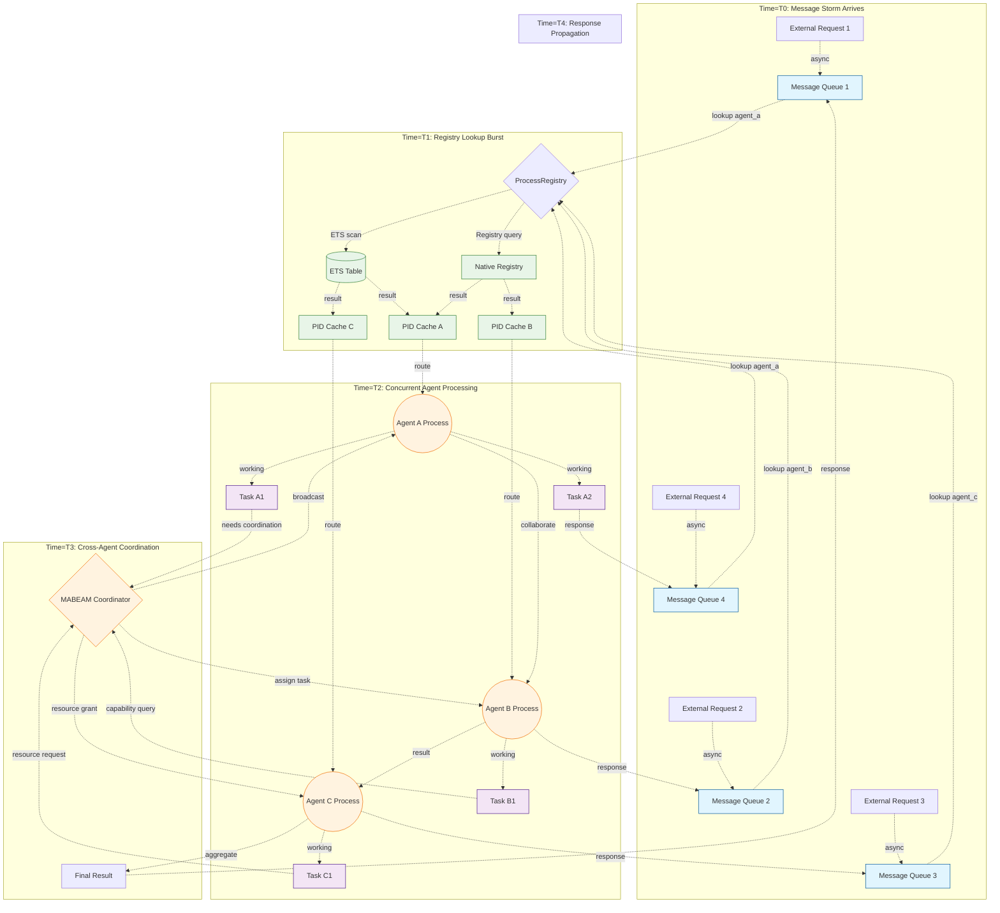
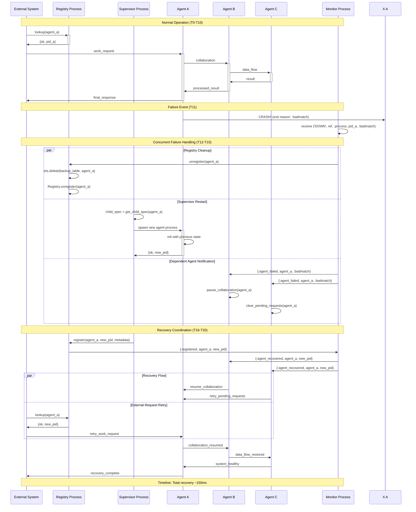

# Concurrent Agent Lifecycle Data Flows

## Diagram 1: Multi-Agent Startup Cascade (Concurrent Flow)

```mermaid
---
title: "Concurrent Agent Initialization - Time Flow Visualization"
---
gantt
    title Agent System Startup - Concurrent Timeline
    dateFormat X
    axisFormat %L
    
    section Registry_Init
    Registry GenServer Start    :milestone, r1, 0, 0ms
    Registry ETS Tables         :r2, after r1, 5ms
    Registry Ready Signal       :milestone, r3, after r2, 0ms
    
    section Supervisor_Init
    AgentSupervisor Start       :milestone, s1, 0, 0ms
    DynamicSupervisor Ready     :s2, after s1, 8ms
    Tracking Tables Init        :s3, after s1, 3ms
    Supervisor Ready Signal     :milestone, s4, after s2, 0ms
    
    section Agent_Burst_1
    Agent_A Config Load         :a1, after r3, 2ms
    Agent_A Process Spawn       :a2, after a1, 1ms
    Agent_A Registry Insert     :a3, after a2, 1ms
    Agent_A Ready Signal        :milestone, a4, after a3, 0ms
    
    section Agent_Burst_2
    Agent_B Config Load         :b1, after r3, 3ms
    Agent_B Process Spawn       :b2, after b1, 1ms
    Agent_B Registry Insert     :b3, after b2, 1ms
    Agent_B Ready Signal        :milestone, b4, after b3, 0ms
    
    section Agent_Burst_3
    Agent_C Config Load         :c1, after r3, 4ms
    Agent_C Process Spawn       :c2, after c1, 1ms
    Agent_C Registry Insert     :c3, after c2, 1ms
    Agent_C Ready Signal        :milestone, c4, after c3, 0ms
    
    section Coordination_Layer
    MABEAM Coord Start          :coord1, after s4, 2ms
    Agent Discovery Scan        :coord2, after coord1, 3ms
    Capability Map Build        :coord3, after coord2, 2ms
    System Ready Signal         :milestone, coord4, after coord3, 0ms
```

### Concurrent Flow Analysis:
- **Parallel Initialization**: Registry and Supervisor start simultaneously (0ms)
- **Agent Burst Pattern**: Agents A,B,C start at different offsets but overlap in execution
- **Dependency Chains**: Each agent waits for registry readiness before proceeding
- **Coordination Lag**: MABEAM coordination starts after supervisor but scans during agent startup
- **Total System Ready**: ~15ms with full concurrency vs ~45ms sequential

---

## Diagram 2: Agent Message Flow Patterns (Live System)

### Concurrency Insights:
- **Registry Contention**: 4 simultaneous lookups hit same registry process
- **Cache Splitting**: Results cached at different storage layers based on load
- **Agent Parallelism**: All agents process independently until coordination needed
- **Coordination Bottleneck**: MABEAM coordinator becomes single point of synchronization
- **Response Fan-out**: Results propagate back through different paths than requests came in

---

## Diagram 3: Process Failure Cascade (Fault Tolerance Flow)

### Fault Tolerance Patterns:
- **Parallel Cleanup**: Registry and supervisor act concurrently during failure
- **Notification Cascade**: Dependent agents notified simultaneously, not sequentially  
- **State Isolation**: Each agent maintains its own failure handling without blocking others
- **Recovery Coordination**: Multiple systems coordinate to restore consistent state
- **External Transparency**: Client sees brief unavailability but automatic recovery

---

## Diagram 4: Resource Contention Under Load (Bottleneck Analysis)

```mermaid
graph TB
    subgraph "Load Pattern: 50 req/sec"
        direction TB
        Load[50 Requests/sec] 
        Load -.->|10 req/sec| Q1[Queue Partition 1]
        Load -.->|15 req/sec| Q2[Queue Partition 2] 
        Load -.->|25 req/sec| Q3[Queue Partition 3]
    end
    
    subgraph "Registry Layer: Contention Point"
        Q1 -.->|lookup burst| RegBot{Registry Process<br/>⚠️ BOTTLENECK}
        Q2 -.->|lookup burst| RegBot
        Q3 -.->|lookup burst| RegBot
        
        RegBot -.->|ETS read: ~1ms| ETS[(ETS Table<br/>Concurrent Reads)]
        RegBot -.->|Registry call: ~2ms| RegSys[Registry System<br/>Sequential Access]
        
        ETS -.->|hit| FastPath[Fast Path<br/>~1ms total]
        RegSys -.->|hit| SlowPath[Slow Path<br/>~3ms total]
    end
    
    subgraph "Agent Processing: Parallel Execution"
        FastPath -.->|route| AgentPool[Agent Pool<br/>20 Processes]
        SlowPath -.->|route| AgentPool
        
        AgentPool -.->|distribute| A1((A1<br/>busy))
        AgentPool -.->|distribute| A2((A2<br/>idle))  
        AgentPool -.->|distribute| A3((A3<br/>busy))
        AgentPool -.->|distribute| A4((A4<br/>idle))
        AgentPool -.->|queue| A5((A5<br/>queue:3))
        AgentPool -.->|queue| A6((A6<br/>queue:1))
    end
    
    subgraph "Coordination Layer: Secondary Bottleneck"  
        A1 -.->|coordinate| CoordQ{Coordination Queue<br/>⚠️ SECONDARY BOTTLENECK}
        A3 -.->|coordinate| CoordQ
        A5 -.->|coordinate| CoordQ
        
        CoordQ -.->|process| CoordWorker[Coordination Worker<br/>~5ms per coordination]
        CoordWorker -.->|broadcast| AgentPool
    end
    
    subgraph "Performance Metrics"
        PerfMon[Performance Monitor]
        PerfMon -.->|sample| RegBot
        PerfMon -.->|sample| AgentPool  
        PerfMon -.->|sample| CoordQ
        
        RegBot -.->|queue_length: 12| RegMetric[Registry: 12 queued<br/>avg_latency: 8ms<br/>🔴 OVERLOADED]
        AgentPool -.->|utilization: 60%| AgentMetric[Agents: 60% busy<br/>avg_latency: 15ms<br/>🟡 MODERATE]
        CoordQ -.->|queue_length: 3| CoordMetric[Coordination: 3 queued<br/>avg_latency: 12ms<br/>🟢 HEALTHY]
    end
    
    classDef bottleneck fill:#ffebee,stroke:#c62828,stroke-width:3px
    classDef moderate fill:#fff8e1,stroke:#f57c00,stroke-width:2px  
    classDef healthy fill:#e8f5e8,stroke:#2e7d32,stroke-width:1px
    classDef concurrent fill:#e3f2fd,stroke:#1565c0
    
    class RegBot,RegMetric bottleneck
    class CoordQ,AgentMetric moderate
    class CoordMetric,ETS healthy
    class AgentPool,A1,A2,A3,A4,A5,A6 concurrent
```

### Bottleneck Analysis:
- **Primary Bottleneck**: Registry process becomes single point of contention at 50 req/sec
- **Queue Build-up**: 12 requests queued at registry vs 3 at coordination (4:1 ratio)
- **Utilization Imbalance**: Registry overloaded while agents only 60% utilized  
- **Latency Amplification**: Registry adds 8ms delay, agents add 15ms, but coordination only 12ms
- **Scaling Strategy**: Registry needs partitioning or caching layer before agent pool scaling

### Novel Concurrency Representation Key:
- **Dotted Arrows (-.->)**: Asynchronous message flow
- **Timeline Annotations**: Explicit time markers (T0, T1, T2...)
- **Parallel Sections**: Gantt charts and `par` blocks show true concurrency
- **Queue Depth Visualization**: Numbers show actual queue lengths under load
- **Bottleneck Highlighting**: Color coding and metrics show system stress points
- **Process State**: Visual indicators (busy/idle/queue depth) show runtime behavior

This approach reveals the **living system behavior** rather than static code structure, showing how data flows, queues, contends, and recovers in real concurrent execution.