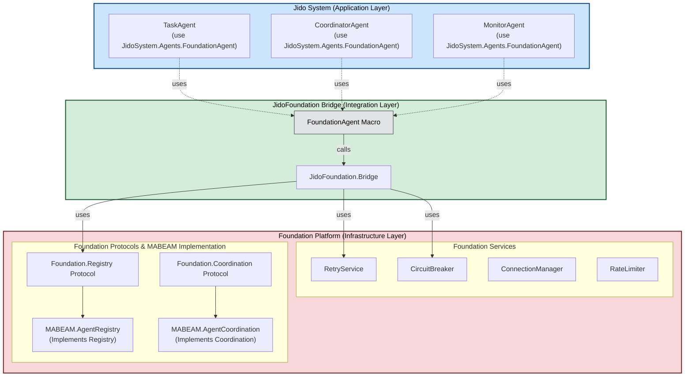
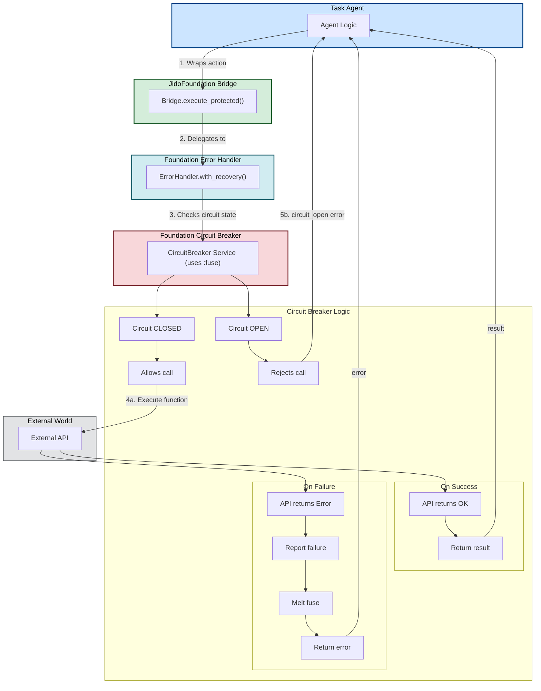

Of course. Creating architecture diagrams is an excellent way to visualize the interactions and appreciate the design. The complexity here is layered, and breaking it down visually will clarify the benefits.

Here is a series of detailed Mermaid diagrams illustrating the key architectural patterns and integrations in your framework.

### 1. High-Level Architecture Overview

This diagram shows the major layers of the system—the Jido agents, the integration Bridge, and the Foundation platform—and how they relate to each other.



### 2. Agent Registration Lifecycle

This diagram details the sequence of events when a new agent starts up, highlighting the automatic registration process enabled by the `FoundationAgent` macro.


### 3. Resilient Action Execution with Circuit Breaker

This diagram illustrates how an agent performs an action that is protected by the Foundation's infrastructure, such as calling an external API.



### 4. Coordinated Agent Discovery and Interaction

This diagram shows how a CoordinatorAgent can efficiently find the right TaskAgent for a job using the atomic, multi-criteria discovery mechanism.

```mermaid
graph TD
    subgraph Coordinator["Coordinator Agent"]
        C1["Coordinator Logic"]
    end

    subgraph DiscoveryLayer["MABEAM Discovery"]
        D1["Discovery.find_capable_and_healthy()"]
    end

    subgraph FoundationFacade["Foundation Facade"]
        F1["Foundation.query()"]
    end

    subgraph RegistryImpl["MABEAM.AgentRegistry Implementation"]
        R1["Registry GenServer"]
        subgraph Compiler["MatchSpec Compiler"]
            MSC["ETSHelpers.MatchSpecCompiler"]
        end
        subgraph ETS["ETS Read-Path (Direct, Concurrent Access)"]
            MainTable["Main Agent Table"]
        end
    end
    
    subgraph TaskAgentPool["Task Agent Pool"]
        T1["TaskAgent 1 (Healthy, Inference)"]
        T2["TaskAgent 2 (Unhealthy, Inference)"]
        T3["TaskAgent 3 (Healthy, Data)"]
    end

    C1 -->|1. "Find healthy agent with inference"| D1
    D1 -->|2. Composes criteria & calls| F1
    F1 -->|3. Dispatches to impl| R1
    R1 -->|4. Compiles criteria| MSC
    MSC -->|5. Returns efficient "match_spec"| R1
    R1 -->|6. Atomic "ets.select(match_spec)"| MainTable
    MainTable -->|7. Returns only matching agents [T1]| R1
    R1 -->|8. Returns result| F1
    F1 --> D1
    D1 --> C1
    C1 -->|9. Delegates task| T1
    
    style Coordinator fill:#cce5ff,stroke:#004085,stroke-width:2px,color:#000
    style DiscoveryLayer fill:#d4edda,stroke:#155724,stroke-width:2px,color:#000
    style FoundationFacade fill:#d1ecf1,stroke:#0c5460,stroke-width:2px,color:#000
    style RegistryImpl fill:#f8d7da,stroke:#721c24,stroke-width:2px,color:#000
    style TaskAgentPool fill:#fff3cd,stroke:#856404,stroke-width:1px,color:#000
```

### 5. System Observability: Telemetry and Monitoring

This diagram illustrates how events from agents flow through the telemetry system to be processed by sensors and monitors, providing a holistic view of system health.

```mermaid
graph LR
    subgraph Agents["Operating Agents"]
        TaskAgent["TaskAgent"]
        CoordAgent["CoordinatorAgent"]
    end
    
    subgraph FoundationTelemetry["Foundation.Telemetry Bus"]
        direction TB
        TelemetryBus[":telemetry Events"]
    end

    subgraph Observers["Observers & Sensors"]
        direction TB
        HealthSensor["JidoSystem.Sensors.SystemHealthSensor"]
        PerfSensor["JidoSystem.Sensors.AgentPerformanceSensor"]
        MonitorAgent["JidoSystem.Agents.MonitorAgent"]
    end

    subgraph User["User / Admin"]
        Admin["Admin"]
    end

    TaskAgent -->|1. Action completes, emits event| TelemetryBus
    CoordAgent -->|1. Workflow step, emits event| TelemetryBus

    TelemetryBus -->|2. Dispatches to all subscribers| HealthSensor
    TelemetryBus -->|2. Dispatches to all subscribers| PerfSensor
    TelemetryBus -->|2. Dispatches to all subscribers| MonitorAgent

    HealthSensor -->|3. Delivers signal| MonitorAgent
    PerfSensor -->|3. Delivers signal| MonitorAgent

    Admin -->|4. Queries for system status| MonitorAgent
    MonitorAgent -->|5. Returns aggregated health report| Admin

    style Agents fill:#cce5ff,stroke:#004085,stroke-width:2px,color:#000
    style FoundationTelemetry fill:#d1ecf1,stroke:#0c5460,stroke-width:2px,color:#000
    style Observers fill:#d4edda,stroke:#155724,stroke-width:2px,color:#000
    style User fill:#e2e3e5,stroke:#383d41,stroke-width:1px,color:#000
```


