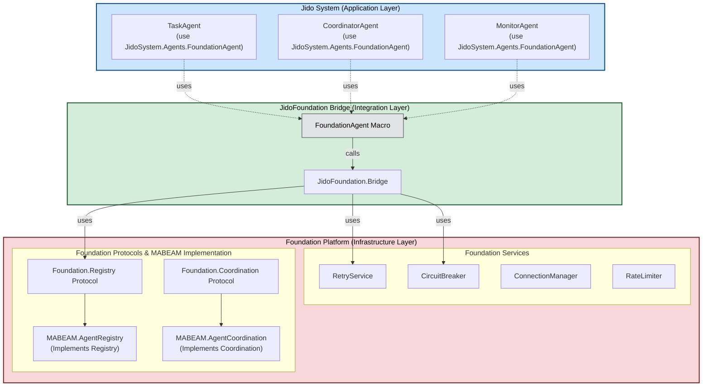
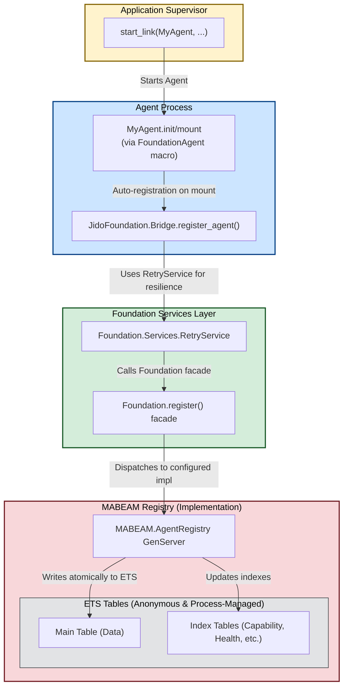
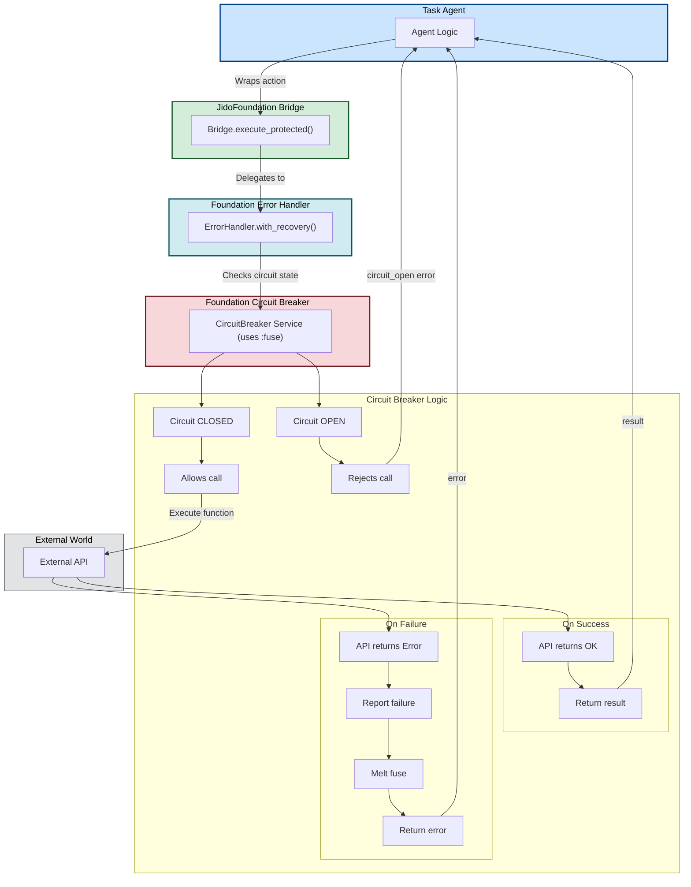
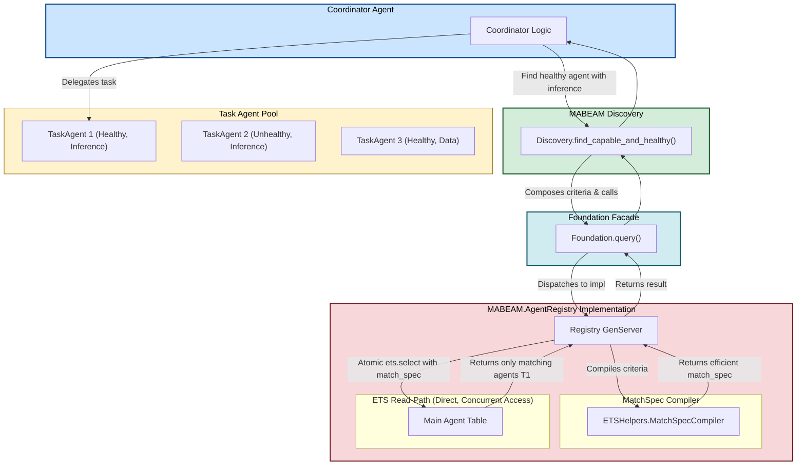
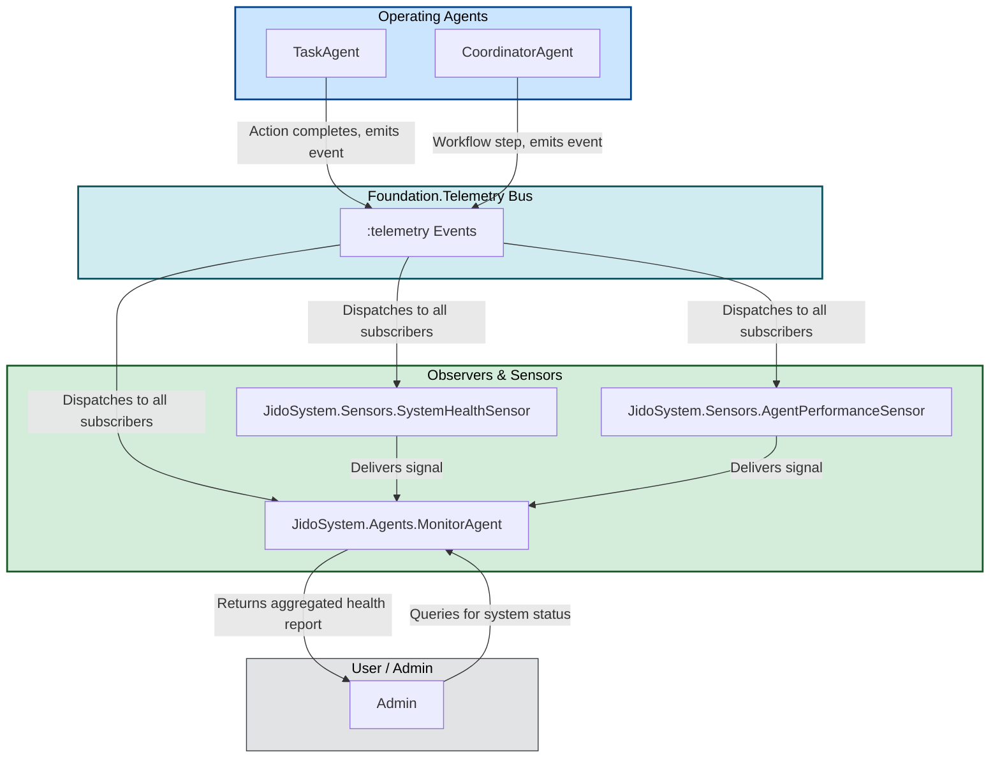
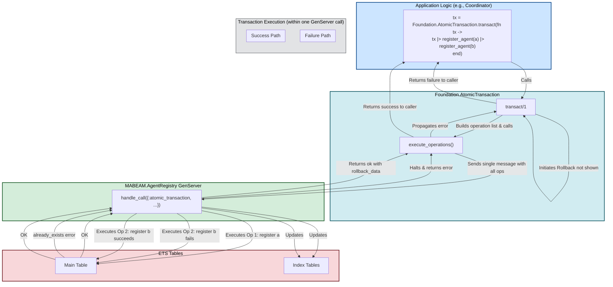
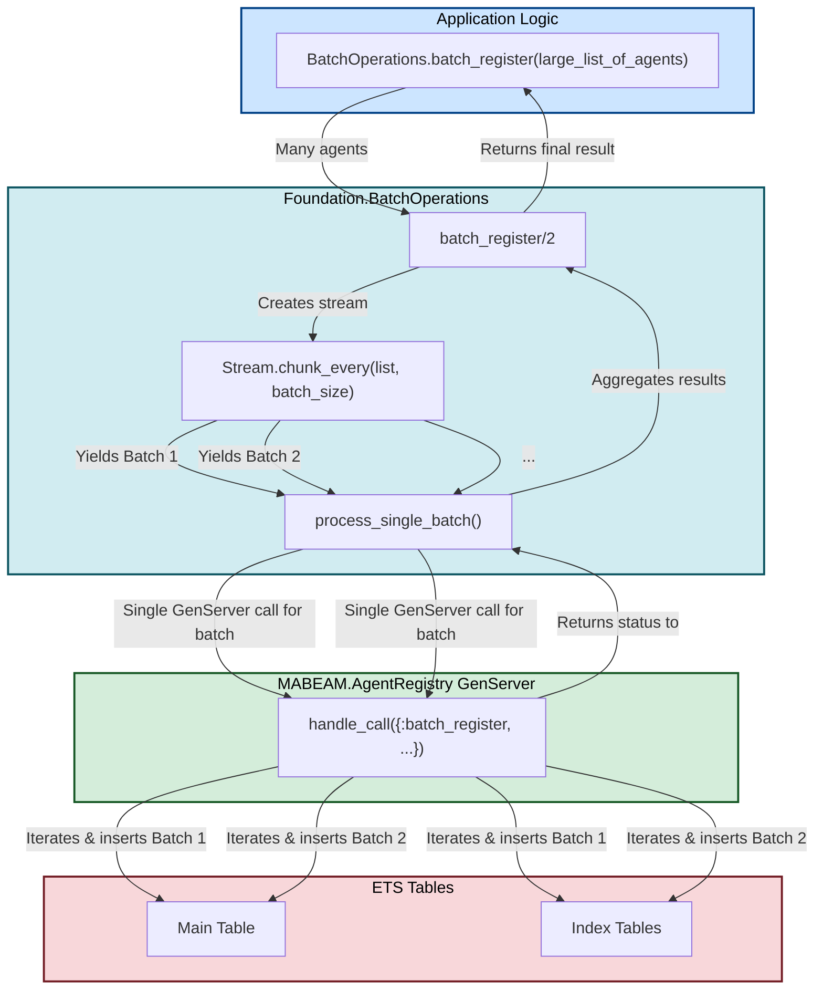
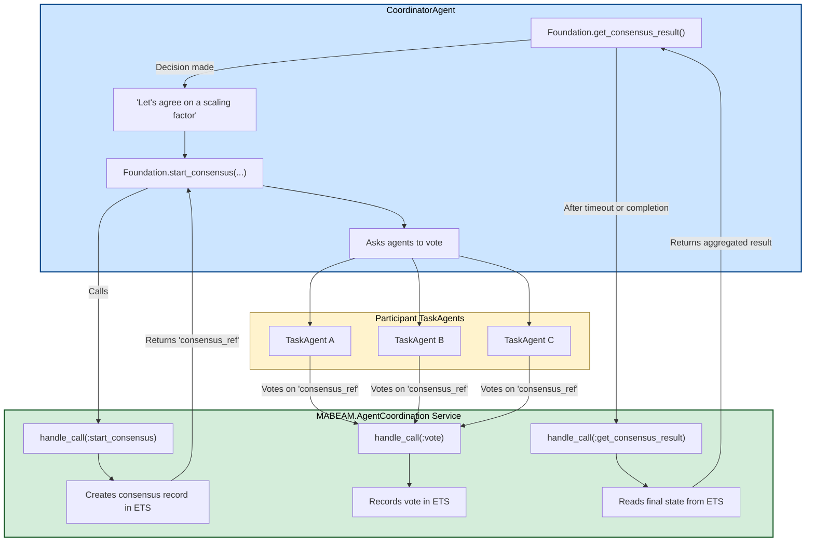
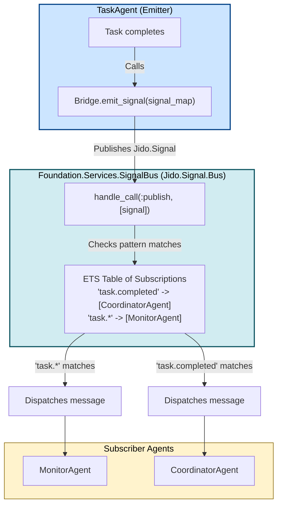
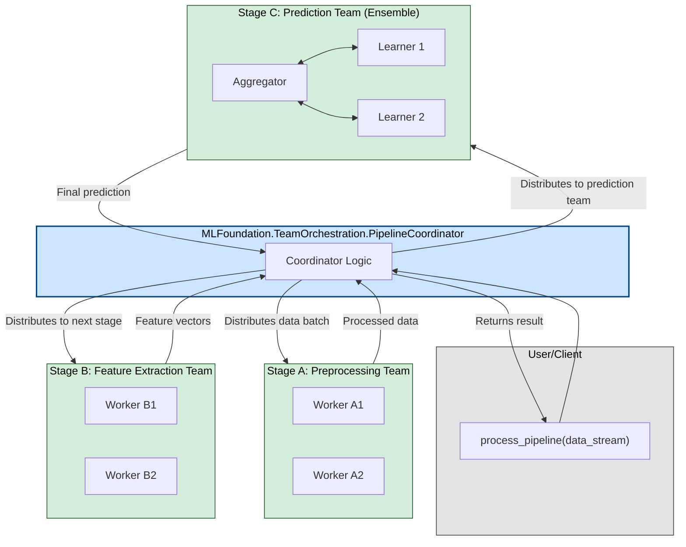

Of course. Creating architecture diagrams is an excellent way to visualize the interactions and appreciate the design. The complexity here is layered, and breaking it down visually will clarify the benefits.

Here is a series of detailed Mermaid diagrams illustrating the key architectural patterns and integrations in your framework.

### 1. High-Level Architecture Overview

This diagram shows the major layers of the system—the Jido agents, the integration Bridge, and the Foundation platform—and how they relate to each other.

### 2. Agent Registration Lifecycle

This diagram details the sequence of events when a new agent starts up, highlighting the automatic registration process enabled by the `FoundationAgent` macro.

### 3. Resilient Action Execution with Circuit Breaker

This diagram illustrates how an agent performs an action that is protected by the Foundation's infrastructure, such as calling an external API.

### 4. Coordinated Agent Discovery and Interaction

This diagram shows how a CoordinatorAgent can efficiently find the right TaskAgent for a job using the atomic, multi-criteria discovery mechanism.

### 5. System Observability: Telemetry and Monitoring

This diagram illustrates how events from agents flow through the telemetry system to be processed by sensors and monitors, providing a holistic view of system health.

 
### 6. Atomic Transaction Workflow

This diagram shows how `Foundation.AtomicTransaction` ensures that a series of registry operations either all succeed or none do, providing ACID-like guarantees for complex state changes.

### 7. High-Performance Batch Operations

This diagram illustrates the flow for `batch_register`, showing how it improves performance by reducing GenServer call overhead and processing data in chunks.

### 8. Multi-Agent Consensus Coordination

This diagram shows the process of achieving consensus among a group of agents, mediated by the `MABEAM.AgentCoordination` service.

### 9. Jido Signal Bus and Event Routing

This diagram shows the publish-subscribe pattern used for communication between agents, leveraging the `Jido.Signal.Bus` via the `JidoFoundation.Bridge`.

### 10. ML Team Orchestration (Pipeline Example)

This diagram shows how the generic agent patterns in `MLFoundation` can be composed to create a sophisticated, multi-stage ML pipeline team, orchestrated by a coordinator.

