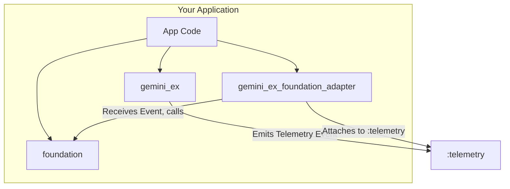
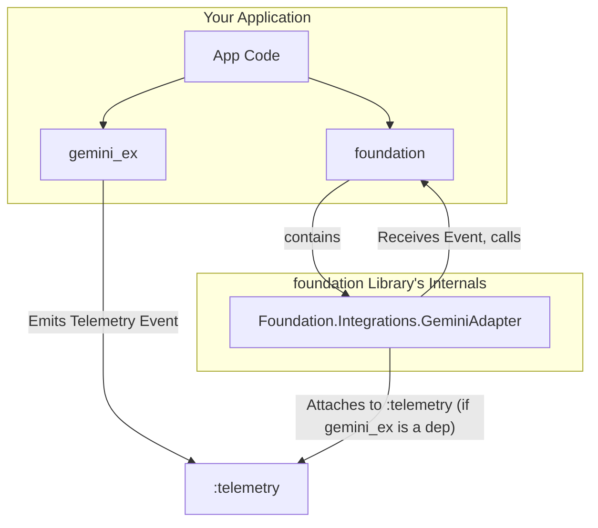

#### **Proposal 1: The Adapter/Plugin Pattern (Highly Recommended)**

This is the most idiomatic and robust approach in the Elixir ecosystem. It uses `:telemetry` as the decoupling mechanism.

**Concept:**
`gemini_ex` emits telemetry events at key points. A new, small "adapter" library listens for these events and translates them into `foundation` calls.

**Diagram:**


**How it Works:**

1.  **`gemini_ex`:** Emits telemetry events. It has no dependency on `foundation`.
    ```elixir
    # In Gemini.Generate.content/2
    :telemetry.execute([:gemini, :request, :start], %{...}, %{...})
    # ... on success
    :telemetry.execute([:gemini, :request, :stop], %{duration: duration}, %{...})
    # ... on error
    :telemetry.execute([:gemini, :request, :exception], %{...}, %{...})
    ```
2.  **`foundation`:** Remains completely unchanged. It knows nothing about `gemini_ex`.
3.  **`gemini_ex_foundation_adapter` (New Library):** This is a new, lightweight library.
    *   It depends on both `gemini_ex` and `foundation`.
    *   It contains a single module that attaches to the `[:gemini, ...]` telemetry events and calls the appropriate `Foundation` functions.

**Advantages:**
*   ✅ **Perfect Decoupling:** `gemini_ex` is a pure API client. It can be used in any project, with or without `foundation`.
*   ✅ **Clean Codebases:** No conditional logic pollutes `gemini_ex`. The integration logic is isolated in its own module.
*   ✅ **Maximum Extensibility:** This is the biggest win. Anyone can write a new adapter (`gemini_ex_opentelemetry`, `gemini_ex_prometheus`) to integrate `gemini_ex` with any other system, without ever touching the `gemini_ex` code. This is how you build empires.
*   ✅ **Idiomatic Elixir:** Using `:telemetry` for instrumentation is the standard, community-accepted pattern.

---
 

### 4. Detailed Implementation Plan (for Proposal 1)

This is the concrete plan to achieve the recommended architecture.

#### **Step 1: Instrument `gemini_ex`**

Modify `gemini_ex` to emit telemetry events at key points.

**File to change:** `lib/gemini/client/http.ex`

```elixir
# In lib/gemini/client/http.ex inside request/5
def request(method, path, body, auth_config, _opts \\ []) do
  Config.validate!()

  # ...
  # Add telemetry execution around the Req.request call
  #
  telemetry_meta = %{
    auth_type: auth_type,
    method: method,
    path: path,
    body_size: if(body, do: :erlang.external_size(body), else: 0)
  }

  :telemetry.execute(
    [:gemini, :request, :start],
    %{system_time: System.monotonic_time()},
    telemetry_meta
  )

  start_time = System.monotonic_time()

  result =
    case Req.request(req_opts) do
      # ... original Req call ...
    end

  duration = System.monotonic_time() - start_time

  case result do
    {:ok, response} ->
      :telemetry.execute(
        [:gemini, :request, :stop],
        %{duration: duration},
        Map.put(telemetry_meta, :status, response.status)
      )
      handle_response({:ok, response})

    {:error, reason} ->
      :telemetry.execute(
        [:gemini, :request, :exception],
        %{duration: duration, reason: reason},
        telemetry_meta
      )
      handle_response({:error, reason})
  end
end
```
You would apply a similar pattern to the `stream_post_raw/4` function for streaming events.

#### **Step 2: Create the `gemini_ex_foundation_adapter` Library**

Create a new mix project.

**`mix.exs`:**
```elixir
defp deps do
  [
    {:gemini, "~> 0.1.0"},
    {:foundation, "~> 0.1.4"}
  ]
end
```

**`lib/gemini_ex_foundation_adapter.ex`:**
```elixir
defmodule GeminiExFoundationAdapter do
  @moduledoc "Attaches Gemini telemetry events to the Foundation event store."

  def setup() do
    events = [
      [:gemini, :request, :start],
      [:gemini, :request, :stop],
      [:gemini, :request, :exception]
    ]

    :telemetry.attach_many(
      "gemini-foundation-adapter",
      events,
      &__MODULE__.handle_event/4,
      nil
    )
  end

  def handle_event([:gemini, :request, :start], measurements, metadata, _config) do
    data = Map.merge(measurements, metadata)
    Foundation.Events.new_event(:gemini_request_start, data)
    |> Foundation.Events.store()
  end

  def handle_event([:gemini, :request, :stop], measurements, metadata, _config) do
    data = Map.merge(measurements, metadata)
    Foundation.Events.new_event(:gemini_request_stop, data)
    |> Foundation.Events.store()
  end

  def handle_event([:gemini, :request, :exception], measurements, metadata, _config) do
    data = Map.merge(measurements, metadata)
    # This could be a specialized error event
    Foundation.Events.new_event(:gemini_request_exception, data)
    |> Foundation.Events.store()
  end
end
```

#### **Step 3: No Changes to `foundation`**

This is a key benefit. The `foundation` library remains completely agnostic and unchanged.

#### **Step 4: Final Application Setup**

In your final application that uses both, the setup is simple.

**`mix.exs`:**
```elixir
defp deps do
  [
    {:my_app, ...},
    {:gemini, "~> 0.1.0"},
    {:foundation, "~> 0.1.4"},
    {:gemini_ex_foundation_adapter, "~> 0.1.0"}
  ]
end
```

**`lib/my_app/application.ex`:**
```elixir
def start(_type, _args) do
  children = [
    Foundation.Application,
    # ... your other children
  ]

  # After starting the supervision tree, setup the adapter
  {:ok, pid} = Supervisor.start_link(children, opts)

  # Attach the telemetry handlers
  GeminiExFoundationAdapter.setup()

  {:ok, pid}
end
```

### Conclusion and Recommendation

Your intuition to keep the libraries separate and enable integration via configuration is correct. The user-facing experience would be exactly as you described. However, the implementation mechanism should be chosen carefully to ensure long-term health of the ecosystem you're building.

I strongly recommend **Proposal 1: The Adapter/Plugin Pattern using `:telemetry`**.

It provides the best of all worlds:
*   **Decoupling:** `gemini_ex` remains a pure, high-quality client library.
*   **Extensibility:** It opens the door for anyone to integrate `gemini_ex` with any system.
*   **Maintainability:** The logic for each concern (Gemini client vs. Foundation integration) is cleanly separated.

This approach aligns perfectly with your goal of building "OTP empires" on `gemini_ex`, as it establishes it as a robust, independent, and instrumentable core component.


---


---
---


You've hit on a very sharp and practical point. Architecturally, the third repository is the "purest" solution, but in the real world, dependency management is a real cost. Your hesitation is completely valid—it's a classic trade-off between architectural purity and developer ergonomics.

You are absolutely right to question it, and yes, there is a better way that gives us the best of both worlds. We can achieve the same decoupling benefits of the adapter pattern *without* forcing the end-user to manage a third dependency.

The solution lies in **conditional compilation and optional dependencies**.

### The Bundled Adapter Pattern (Recommended)

Instead of a separate `gemini_ex_foundation_adapter` library, we will place the adapter module *inside* the `foundation` library. Its compilation will be conditional on the `gemini_ex` library being present in the user's project.

**Concept:** The `foundation` library will contain the "glue" code to integrate with `gemini_ex`, but this code will only be activated if the developer has explicitly added `gemini_ex` to their dependencies.

**Diagram:**



Here is the detailed implementation plan for this superior approach:

---

#### Step 1: Modify `foundation`'s `mix.exs`

We declare `gemini_ex` as an **optional dependency** for `foundation`. This means `mix` will not fetch `gemini_ex` unless the user's project also lists it as a dependency.

**File to change:** `foundation/mix.exs`

```elixir
defp deps do
  [
    # ... your existing core deps for foundation ...
    {:jason, "~> 1.4"},
    {:telemetry, "~> 1.2"},
    
    # Add gemini_ex as an optional dependency for the integration
    {:gemini, "~> 0.1.0", optional: true}
  ]
end
```

#### Step 2: Create the Bundled Adapter Module inside `foundation`

We create the adapter module inside `foundation`, but we wrap it in a conditional compilation block. This is the key to the pattern.

**New file:** `foundation/lib/foundation/integrations/gemini_adapter.ex`

```elixir
# This code lives inside the `foundation` project.

# The `Code.ensure_loaded?/1` check will only pass if the user's
# project has `gemini_ex` in its dependency list.
if Code.ensure_loaded?(Gemini) do
  defmodule Foundation.Integrations.GeminiAdapter do
    @moduledoc """
    Telemetry handler to connect `gemini_ex` events to `foundation`.
    This module is only compiled if `gemini_ex` is a dependency.
    """

    def setup() do
      events = [
        [:gemini, :request, :start],
        [:gemini, :request, :stop],
        [:gemini, :request, :exception]
      ]

      :telemetry.attach_many(
        "foundation-gemini-adapter",
        events,
        &__MODULE__.handle_event/4,
        nil
      )
    end

    def handle_event([:gemini, :request, :start], measurements, metadata, _config) do
      # Translate the telemetry event into a Foundation event
      data = Map.merge(measurements, metadata)
      Foundation.Events.new_event(:gemini_request_start, data)
      |> Foundation.Events.store()
    end

    def handle_event([:gemini, :request, :stop], measurements, metadata, _config) do
      data = Map.merge(measurements, metadata)
      Foundation.Events.new_event(:gemini_request_stop, data)
      |> Foundation.Events.store()
      Foundation.Telemetry.emit_histogram([:gemini, :request, :duration], measurements.duration, metadata)
    end

    def handle_event([:gemini, :request, :exception], measurements, metadata, _config) do
      data = Map.merge(measurements, metadata)
      Foundation.Events.new_event(:gemini_request_exception, data)
      |> Foundation.Events.store()
      Foundation.Telemetry.emit_counter([:gemini, :request, :errors], metadata)
    end
  end

else
  # This `else` block is crucial. If `gemini_ex` is NOT a dependency,
  # we still define the module with a no-op `setup/0` function.
  # This prevents compilation errors if the user tries to call it.
  defmodule Foundation.Integrations.GeminiAdapter do
    @moduledoc """
    A no-op version of the Gemini adapter.
    The `gemini_ex` library is not present in the project's dependencies.
    """
    def setup(), do: :noop
  end
end
```

#### Step 3: Instrument `gemini_ex` (Same as Before)

This step remains unchanged. `gemini_ex` will still be instrumented with `:telemetry` events and will have no knowledge of `foundation`. This preserves its purity.

#### Step 4: Final Application Setup (The User's Experience)

The developer experience is now much cleaner.

1.  The developer adds just two dependencies to their `mix.exs`:
    ```elixir
    defp deps do
      [
        {:foundation, "~> 0.1.4"},
        {:gemini, "~> 0.1.0"}
      ]
    end
    ```

2.  In their `application.ex`, they call the setup function from `foundation`:
    ```elixir
    def start(_type, _args) do
      children = [
        Foundation.Application,
        # ... your other children
      ]

      {:ok, pid} = Supervisor.start_link(children, opts)

      # Enable the integration. It just works!
      Foundation.Integrations.GeminiAdapter.setup()

      {:ok, pid}
    end
    ```

### Why This Architecture is Superior

This "Bundled Adapter" pattern resolves your concern perfectly while maintaining architectural integrity:

*   ✅ **No Third Dependency:** The end-user only manages two dependencies.
*   ✅ **Perfect Decoupling:** `gemini_ex` remains completely independent and knows nothing about `foundation`. Its only contract is the telemetry events it emits.
*   ✅ **"It Just Works":** The integration is automatically available when both libraries are present. There's no need for complex configuration flags.
*   ✅ **Graceful Fallback:** If the user *only* includes `foundation`, the call to `Foundation.Integrations.GeminiAdapter.setup()` will compile and run without error, simply doing nothing. This is clean and robust.
*   ✅ **Clear Ownership:** The integration logic lives within `foundation`, the library that is *consuming* the telemetry events. This makes sense: `foundation` is the framework, and it's providing an integration for a specific tool (`gemini_ex`). This pattern can be repeated for other popular libraries (`Foundation.Integrations.Phoenix`, `Foundation.Integrations.Ecto`, etc.), creating a suite of first-class integrations.

This is the standard way that frameworks in the Elixir ecosystem provide optional, "batteries-included" integrations, and it's the ideal path forward for your projects.