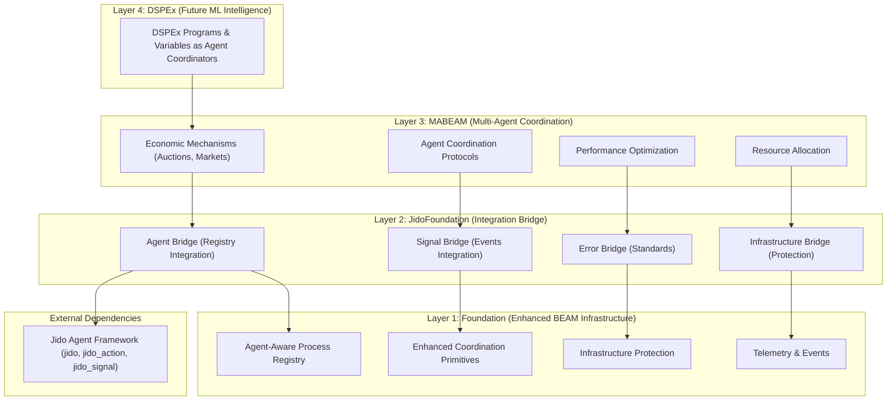

# Jido Integration Master Plan
**Date:** June 27, 2025  
**Vision:** Multi-Agent AI Coordination Platform on the BEAM  
**Architecture:** Foundation → JidoFoundation → MABEAM → DSPEx

## Executive Summary

This plan outlines the expansion of three core libraries to create the world's first production-ready multi-agent AI coordination platform on the BEAM:

1. **lib/foundation** - Enhanced BEAM infrastructure with agent-aware capabilities
2. **lib/jido_foundation** - Integration bridge between Foundation and Jido frameworks  
3. **lib/mabeam** - Sophisticated multi-agent coordination built on Jido agents

The result will be a revolutionary system where Variables become universal coordinators for entire Jido agent ecosystems, enabling emergent intelligence through economic mechanisms, sophisticated coordination protocols, and ML-native optimization.

## Architecture Overview



## 1. Foundation Library Expansion Plan

### 1.1 Current State Analysis
**Status:** Stable, clean protocol-based infrastructure  
**Strengths:** Registry, Coordination, Infrastructure protocols  
**Needs:** Agent-aware enhancements for Jido integration

### 1.2 Foundation Enhancements

#### A. Agent-Aware Process Registry
```elixir
# lib/foundation/process_registry.ex - Enhanced API
defmodule Foundation.ProcessRegistry do
  # Current stable API (keep unchanged)
  @spec register(atom(), term(), pid(), map()) :: :ok | {:error, term()}
  def register(namespace, key, pid, metadata)

  # NEW: Agent-specific registration
  @spec register_agent(atom(), atom(), pid(), agent_metadata()) :: :ok | {:error, term()}
  def register_agent(namespace, agent_id, pid, metadata)

  # NEW: Agent discovery and querying
  @spec lookup_agents_by_capability(atom(), atom()) :: [agent_reference()]
  def lookup_agents_by_capability(namespace, capability)

  @spec lookup_agents_by_role(atom(), atom()) :: [agent_reference()]
  def lookup_agents_by_role(namespace, role)
end
```

#### B. Enhanced Coordination Primitives
```elixir
# lib/foundation/coordination/primitives.ex - New modules
defmodule Foundation.Coordination.AgentConsensus do
  @spec agent_consensus([agent_reference()], proposal(), keyword()) :: consensus_result()
  def agent_consensus(agents, proposal, opts \\ [])
end

defmodule Foundation.Coordination.ResourceNegotiation do
  @spec negotiate_resources([resource_request()], resource_pool()) :: allocation_result()
  def negotiate_resources(requests, pool)
end
```

#### C. Infrastructure Protection Enhancements
```elixir
# lib/foundation/infrastructure.ex - Agent-aware protection
defmodule Foundation.Infrastructure do
  # NEW: Agent-scoped circuit breakers
  @spec protect_agent_operation(agent_reference(), atom(), function()) :: {:ok, term()} | {:error, term()}
  def protect_agent_operation(agent, operation_type, operation)

  # NEW: Agent resource limiting
  @spec limit_agent_resources(agent_reference(), resource_limits(), function()) :: {:ok, term()} | {:error, term()}
  def limit_agent_resources(agent, limits, operation)
end
```

### 1.3 Foundation Implementation Tasks

1. **Agent Metadata Support** (Week 1)
   - Extend ProcessRegistry with agent-specific metadata schemas
   - Add agent capability and role indexing
   - Implement agent discovery queries

2. **Enhanced Coordination** (Week 2)
   - Build agent-aware consensus protocols
   - Implement resource negotiation primitives
   - Add distributed coordination support

3. **Infrastructure Protection** (Week 3)
   - Create agent-scoped circuit breakers
   - Add agent resource limiting
   - Implement protection telemetry

## 2. JidoFoundation Bridge Library Design

### 2.1 Purpose and Scope
**Purpose:** Seamless integration bridge between Foundation infrastructure and Jido agent framework  
**Scope:** Bidirectional adaptation layer enabling Jido agents to leverage Foundation services

### 2.2 JidoFoundation Architecture

#### A. Agent Bridge - Registry Integration
```elixir
# lib/jido_foundation/agent_bridge.ex
defmodule JidoFoundation.AgentBridge do
  @moduledoc """
  Bridges Jido agents with Foundation.ProcessRegistry for unified process management.
  """

  @spec register_jido_agent(Jido.Agent.t(), agent_config()) :: {:ok, agent_reference()} | {:error, term()}
  def register_jido_agent(agent, config)

  @spec start_agent_with_foundation(module(), keyword()) :: {:ok, pid()} | {:error, term()}
  def start_agent_with_foundation(agent_module, opts)

  @spec lookup_agents_by_jido_capability(atom()) :: [Jido.Agent.t()]
  def lookup_agents_by_jido_capability(capability)
end
```

#### B. Signal Bridge - Events Integration  
```elixir
# lib/jido_foundation/signal_bridge.ex
defmodule JidoFoundation.SignalBridge do
  @moduledoc """
  Bridges JidoSignal with Foundation.Events for unified event handling.
  """

  @spec publish_signal_to_foundation(Jido.Signal.t()) :: :ok | {:error, term()}
  def publish_signal_to_foundation(signal)

  @spec subscribe_foundation_events_to_signals(atom(), signal_pattern()) :: :ok | {:error, term()}
  def subscribe_foundation_events_to_signals(namespace, pattern)

  @spec create_signal_from_foundation_event(Foundation.Event.t()) :: Jido.Signal.t()
  def create_signal_from_foundation_event(event)
end
```

#### C. Error Bridge - Standards Unification
```elixir
# lib/jido_foundation/error_bridge.ex
defmodule JidoFoundation.ErrorBridge do
  @moduledoc """
  Standardizes error handling between Jido and Foundation using Foundation.Types.Error.
  """

  @spec normalize_jido_error(Jido.Error.t()) :: Foundation.Types.Error.t()
  def normalize_jido_error(jido_error)

  @spec handle_foundation_error_in_jido(Foundation.Types.Error.t()) :: Jido.Action.result()
  def handle_foundation_error_in_jido(foundation_error)
end
```

#### D. Infrastructure Bridge - Protection Integration
```elixir
# lib/jido_foundation/infrastructure_bridge.ex
defmodule JidoFoundation.InfrastructureBridge do
  @moduledoc """
  Enables Jido agents to leverage Foundation infrastructure protection.
  """

  @spec execute_protected_action(Jido.Action.t(), protection_config()) :: Jido.Action.result()
  def execute_protected_action(action, protection)

  @spec configure_agent_protection(Jido.Agent.t(), protection_spec()) :: :ok | {:error, term()}
  def configure_agent_protection(agent, spec)
end
```

### 2.3 JidoFoundation Implementation Tasks

1. **Core Bridge Modules** (Week 4)
   - Implement AgentBridge for registry integration
   - Build SignalBridge for event integration
   - Create ErrorBridge for error standardization

2. **Infrastructure Integration** (Week 5)
   - Build InfrastructureBridge for protection patterns
   - Add telemetry integration
   - Implement resource management bridges

3. **Testing and Validation** (Week 6)
   - Comprehensive integration tests
   - Performance benchmarking
   - Error handling validation

## 3. MABEAM Library Expansion Plan

### 3.1 Current State Analysis
**Status:** Basic coordination protocols exist  
**Needs:** Rebuild as Jido agents using Foundation services

### 3.2 MABEAM Architecture Rebuild

#### A. Core Coordination Agents
```elixir
# lib/mabeam/agents/orchestration_coordinator.ex
defmodule MABEAM.Agents.OrchestrationCoordinator do
  use Jido.Agent

  @impl Jido.Agent
  def init(config) do
    {:ok, %{
      coordination_variables: config.variables,
      active_agents: %{},
      resource_pool: config.resources
    }}
  end

  @impl Jido.Agent
  def handle_action(:coordinate_agents, params, state) do
    # Use Foundation.Coordination.AgentConsensus
    # Return Jido.Signal for results
  end
end
```

#### B. Economic Mechanism Agents
```elixir
# lib/mabeam/agents/auctioneer.ex
defmodule MABEAM.Agents.Auctioneer do
  use Jido.Agent

  @impl Jido.Agent
  def handle_action(:run_auction, auction_spec, state) do
    # Sophisticated auction implementation
    # Uses Foundation.Infrastructure for protection
    # Emits JidoSignals for auction events
  end
end

# lib/mabeam/agents/marketplace.ex
defmodule MABEAM.Agents.Marketplace do
  use Jido.Agent
  # Market-based resource allocation
end
```

#### C. MABEAM Actions - Jido Integration
```elixir
# lib/mabeam/actions/coordinate_agents.ex
defmodule MABEAM.Actions.CoordinateAgents do
  use Jido.Action,
    name: "coordinate_agents",
    schema: [
      agents: [type: {:list, :atom}, required: true],
      coordination_type: [type: :atom, required: true],
      variables: [type: :map, required: true]
    ]

  @impl Jido.Action
  def run(params, context) do
    # Complex multi-agent coordination logic
    # Uses JidoFoundation.AgentBridge for agent discovery
    # Uses Foundation.Coordination for consensus
    
    result = perform_coordination(params, context)
    signals = create_coordination_signals(result)
    
    {:ok, result, signals}
  end
end
```

### 3.3 MABEAM Implementation Tasks

1. **Agent Architecture Rebuild** (Weeks 7-8)
   - Convert coordination logic to Jido agents
   - Implement economic mechanism agents
   - Build sophisticated auction protocols

2. **Action Integration** (Week 9)
   - Create MABEAM-specific Jido actions
   - Implement coordination actions
   - Build resource allocation actions

3. **Advanced Coordination** (Week 10)
   - Implement consensus protocols
   - Build negotiation mechanisms
   - Add performance optimization

## 4. Implementation Roadmap

### Phase 1: Foundation Enhancement (Weeks 1-3)
- **Week 1:** Agent-aware ProcessRegistry enhancements
- **Week 2:** Coordination primitives for multi-agent scenarios  
- **Week 3:** Infrastructure protection for agent operations

### Phase 2: JidoFoundation Bridge (Weeks 4-6)
- **Week 4:** Core bridge modules (Agent, Signal, Error)
- **Week 5:** Infrastructure integration and protection
- **Week 6:** Testing, validation, and performance tuning

### Phase 3: MABEAM Reconstruction (Weeks 7-10)
- **Week 7-8:** Rebuild coordination as Jido agents
- **Week 9:** Jido action integration and signals
- **Week 10:** Advanced coordination and optimization

### Phase 4: Integration and Testing (Weeks 11-12)
- **Week 11:** End-to-end integration testing
- **Week 12:** Performance optimization and production hardening

## 5. Success Metrics

### Technical Metrics
- **Performance:** Sub-millisecond agent coordination through Foundation services
- **Scalability:** Support 1000+ Jido agents per node via Foundation infrastructure
- **Reliability:** 99.9% uptime with graceful degradation via Foundation protection
- **Integration:** Seamless Jido agent lifecycle through JidoFoundation bridge

### Functional Metrics
- **Agent Coordination:** Complex multi-agent workflows with economic mechanisms
- **Resource Management:** Dynamic resource allocation via Foundation infrastructure
- **Fault Tolerance:** Automatic recovery and adaptation via Foundation supervision
- **Observability:** Complete telemetry and monitoring through Foundation services

## 6. Revolutionary Capabilities

### Variables as Universal Agent Coordinators
The completed system will enable Variables to coordinate entire Jido agent ecosystems:
```elixir
# Variables control agent teams, not just parameters
temperature_var = DSPEx.Variable.agent_coordination(:temperature_control,
  jido_agents: [:creative_agent, :analytical_agent, :reviewer_agent],
  coordination_fn: &temperature_based_agent_selection/3,
  adaptation_fn: &performance_feedback_adaptation/3
)

# Coordination flows through all tiers:
# DSPEx → MABEAM → JidoFoundation → Foundation
{:ok, team_result} = MABEAM.Agents.OrchestrationCoordinator.coordinate_agents(
  agent_space, 
  temperature_var, 
  task
)
```

### Economic Agent Coordination
Sophisticated market mechanisms for agent resource allocation:
```elixir
# Agents bid for computational resources
auction_result = MABEAM.Agents.Auctioneer.run_auction(%{
  resource_type: :gpu_compute,
  duration: 3600,
  agents: [:training_agent, :inference_agent, :optimization_agent]
})
```

### Emergent Intelligence Through Layered Coordination
Agent teams develop emergent intelligence through sophisticated 4-tier coordination:
```elixir
# Negotiation flows through all layers
negotiation_result = MABEAM.Coordination.negotiate_configuration(
  :reasoning_strategy,
  agent_preferences,
  strategy: :consensus_with_foundation_primitives
)
```

## 7. Next Steps

<function_calls>
<invoke name="todo_write">
<parameter name="todos">[{"id": "1", "content": "Read ASSESSMENT.md", "status": "completed", "priority": "high"}, {"id": "2", "content": "Read specs/discussion docs (first and latest)", "status": "completed", "priority": "high"}, {"id": "3", "content": "Read docs20250627 0090 and 0100 docs", "status": "completed", "priority": "high"}, {"id": "4", "content": "Read README", "status": "completed", "priority": "high"}, {"id": "5", "content": "Read more docs20250627 for history", "status": "completed", "priority": "medium"}, {"id": "6", "content": "Examine lib_old for real history", "status": "completed", "priority": "medium"}, {"id": "7", "content": "Understand current stable lib codebase", "status": "completed", "priority": "high"}, {"id": "8", "content": "Create comprehensive jido integration plan", "status": "completed", "priority": "high"}, {"id": "9", "content": "Begin Foundation agent-aware enhancements", "status": "todo", "priority": "high"}, {"id": "10", "content": "Design JidoFoundation bridge interfaces", "status": "todo", "priority": "high"}, {"id": "11", "content": "Plan MABEAM agent reconstruction", "status": "todo", "priority": "high"}, {"id": "12", "content": "Start Week 1 Foundation ProcessRegistry enhancements", "status": "todo", "priority": "high"}]
