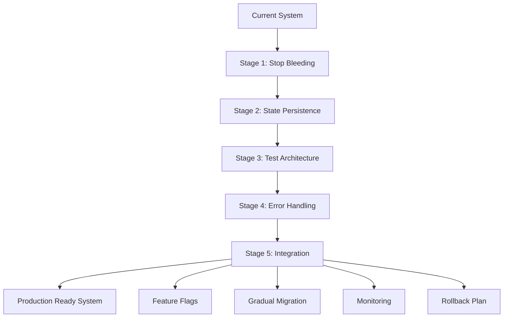

# OTP Refactor Plan - Document 05: Integration, Migration & Production Readiness
Generated: July 1, 2025

## Executive Summary

This final document provides the complete integration strategy, migration path, and production readiness checklist. It ties together all previous stages into a cohesive deployment plan that minimizes risk while maximizing system reliability.

**Time Estimate**: 2 weeks (including gradual rollout)
**Risk**: Managed through phased deployment
**Impact**: Transform system from "OTP-like" to "truly OTP-compliant"

## Context & Required Reading

1. Ensure Stages 1-4 are complete:
   - `01.md` - Critical fixes implemented
   - `02.md` - State persistence applied
   - `03.md` - Testing architecture reformed
   - `04.md` - Error handling unified
2. Review current production deployment

## Integration Overview



## Stage 5.1: Pre-Integration Validation (Week 1, Days 1-2)

### System Health Check

Before integration, verify all previous stages:

**Script**: `scripts/pre_integration_check.exs`

```elixir
defmodule PreIntegrationCheck do
  @checks [
    {:banned_primitives, &check_banned_primitives/0},
    {:monitor_leaks, &check_monitor_leaks/0},
    {:state_persistence, &check_state_persistence/0},
    {:test_patterns, &check_test_patterns/0},
    {:error_handling, &check_error_handling/0}
  ]
  
  def run_all_checks do
    IO.puts "Pre-Integration System Check"
    IO.puts "==========================\n"
    
    results = Enum.map(@checks, fn {name, check_fun} ->
      IO.write "Checking #{name}... "
      
      case check_fun.() do
        :ok -> 
          IO.puts "✅ PASSED"
          {:ok, name}
          
        {:error, issues} ->
          IO.puts "❌ FAILED"
          IO.puts "  Issues found:"
          Enum.each(issues, &IO.puts("    - #{&1}"))
          {:error, name, issues}
      end
    end)
    
    failed = Enum.filter(results, &match?({:error, _, _}, &1))
    
    if Enum.empty?(failed) do
      IO.puts "\n✅ All checks passed! Ready for integration."
      :ok
    else
      IO.puts "\n❌ #{length(failed)} checks failed. Fix before proceeding."
      {:error, failed}
    end
  end
  
  defp check_banned_primitives do
    patterns = [
      {"Process.spawn", ~r/Process\.spawn/},
      {"Raw spawn", ~r/spawn\(/},
      {"Process.put", ~r/Process\.put/},
      {"Process.get", ~r/Process\.get/}
    ]
    
    issues = Enum.flat_map(patterns, fn {name, pattern} ->
      files = find_pattern_in_lib(pattern)
      if Enum.empty?(files) do
        []
      else
        ["Found #{name} in: #{Enum.join(files, ", ")}"]
      end
    end)
    
    if Enum.empty?(issues), do: :ok, else: {:error, issues}
  end
  
  defp check_monitor_leaks do
    # Check all files that use Process.monitor have corresponding demonitor
    files_with_monitor = find_pattern_in_lib(~r/Process\.monitor/)
    
    issues = Enum.flat_map(files_with_monitor, fn file ->
      content = File.read!(file)
      
      monitor_count = Regex.scan(~r/Process\.monitor/, content) |> length()
      demonitor_count = Regex.scan(~r/Process\.demonitor/, content) |> length()
      
      if monitor_count > demonitor_count do
        ["#{file}: #{monitor_count} monitors but only #{demonitor_count} demonitors"]
      else
        []
      end
    end)
    
    if Enum.empty?(issues), do: :ok, else: {:error, issues}
  end
  
  defp check_state_persistence do
    # Verify critical agents use PersistentFoundationAgent
    critical_agents = [
      "lib/jido_system/agents/task_agent.ex",
      "lib/jido_system/agents/coordinator_agent.ex",
      "lib/jido_system/agents/monitor_agent.ex"
    ]
    
    issues = Enum.flat_map(critical_agents, fn file ->
      if File.exists?(file) do
        content = File.read!(file)
        if String.contains?(content, "use JidoSystem.Agents.PersistentFoundationAgent") do
          []
        else
          ["#{file} does not use PersistentFoundationAgent"]
        end
      else
        []
      end
    end)
    
    if Enum.empty?(issues), do: :ok, else: {:error, issues}
  end
  
  defp check_test_patterns do
    issues = []
    
    # No Process.sleep in tests
    sleep_files = find_pattern_in_tests(~r/Process\.sleep/)
    issues = if Enum.empty?(sleep_files) do
      issues
    else
      ["Process.sleep found in tests: #{Enum.join(sleep_files, ", ")}" | issues]
    end
    
    # No telemetry for sync
    telemetry_sync = find_pattern_in_tests(~r/assert_receive.*telemetry/)
    issues = if Enum.empty?(telemetry_sync) do
      issues
    else
      ["Telemetry sync in tests: #{Enum.join(telemetry_sync, ", ")}" | issues]
    end
    
    if Enum.empty?(issues), do: :ok, else: {:error, issues}
  end
  
  defp check_error_handling do
    # Check for dangerous error handling patterns
    dangerous_patterns = [
      ~r/rescue\s+_/,
      ~r/rescue\s+exception\s*->/,
      ~r/catch\s+_,\s+_/
    ]
    
    issues = Enum.flat_map(dangerous_patterns, fn pattern ->
      files = find_pattern_in_lib(pattern)
      if Enum.empty?(files) do
        []
      else
        ["Dangerous error handling in: #{Enum.join(files, ", ")}"]
      end
    end)
    
    # Verify Foundation.Error usage
    error_tuple_files = find_pattern_in_lib(~r/\{:error,\s*:[\w_]+\}/)
    |> Enum.reject(&String.contains?(&1, "test"))
    |> Enum.take(5)  # Just show first 5
    
    if length(error_tuple_files) > 0 do
      issues = ["Simple error tuples still used in: #{Enum.join(error_tuple_files, ", ")}" | issues]
    end
    
    if Enum.empty?(issues), do: :ok, else: {:error, issues}
  end
  
  defp find_pattern_in_lib(pattern) do
    Path.wildcard("lib/**/*.ex")
    |> Enum.filter(fn file ->
      File.read!(file) |> String.match?(pattern)
    end)
  end
  
  defp find_pattern_in_tests(pattern) do
    Path.wildcard("test/**/*_test.exs")
    |> Enum.filter(fn file ->
      File.read!(file) |> String.match?(pattern)
    end)
  end
end

# Run the check
PreIntegrationCheck.run_all_checks()
```

### Create Integration Test Suite

**File**: `test/integration/full_system_test.exs`

```elixir
defmodule Foundation.FullSystemIntegrationTest do
  use ExUnit.Case, async: false
  import Foundation.Test.Helpers
  
  setup do
    # Start clean system
    :ok = Application.stop(:jido_system)
    :ok = Application.stop(:foundation)
    
    {:ok, _} = Application.ensure_all_started(:foundation)
    {:ok, _} = Application.ensure_all_started(:jido_system)
    
    on_exit(fn ->
      Application.stop(:jido_system)
      Application.stop(:foundation)
    end)
  end
  
  describe "end-to-end workflow" do
    test "complete workflow survives multiple failures" do
      # Create coordinator
      {:ok, coordinator} = JidoSystem.Agents.CoordinatorAgentV2.start_link(
        id: "integration_test"
      )
      
      # Start complex workflow
      workflow_def = %{
        name: "integration_test_workflow",
        steps: [
          {:parallel, [
            {:task, %{id: "task1", work: "process_data"}},
            {:task, %{id: "task2", work: "validate_data"}},
            {:task, %{id: "task3", work: "transform_data"}}
          ]},
          {:sequential, [
            {:task, %{id: "task4", work: "aggregate_results"}},
            {:task, %{id: "task5", work: "save_results"}}
          ]}
        ]
      }
      
      {:ok, %{workflow_id: workflow_id}} = 
        CoordinatorAgentV2.start_workflow(coordinator, workflow_def)
      
      # Simulate failures during execution
      Process.sleep(50)
      
      # Kill task agent
      task_agent = Process.whereis(JidoSystem.Agents.TaskAgent)
      Process.exit(task_agent, :kill)
      
      # Kill workflow process
      [{workflow_pid, _}] = Registry.lookup(
        JidoSystem.WorkflowRegistry, 
        workflow_id
      )
      Process.exit(workflow_pid, :kill)
      
      # Kill coordinator
      Process.exit(coordinator, :kill)
      
      # Wait for recovery
      assert :ok = wait_for(fn ->
        # All processes should restart
        Process.whereis(JidoSystem.Agents.TaskAgent) != nil and
        Registry.lookup(JidoSystem.WorkflowRegistry, workflow_id) != [] and
        JidoSystem.Agents.CoordinatorAgentV2.get_by_id("integration_test") != nil
      end, 5000)
      
      # Verify workflow completes
      assert :ok = wait_for(fn ->
        case JidoSystem.WorkflowPersistence.get_status(workflow_id) do
          {:ok, :completed} -> true
          _ -> false
        end
      end, 10000)
      
      # Verify no data loss
      {:ok, results} = JidoSystem.WorkflowPersistence.get_results(workflow_id)
      assert map_size(results) == 5  # All 5 tasks completed
    end
  end
  
  describe "error handling" do
    test "infrastructure errors are retried" do
      # Mock external service
      MockExternalService.set_failure_count(2)  # Fail twice, then succeed
      
      result = Foundation.RetryStrategy.with_retry(fn ->
        MockExternalService.call()
      end)
      
      assert {:ok, _} = result
      assert MockExternalService.call_count() == 3
    end
    
    test "business errors are not retried" do
      result = Foundation.RetryStrategy.with_retry(fn ->
        {:error, Foundation.Error.business_error(
          :insufficient_funds, 
          "Not enough balance"
        )}
      end)
      
      assert {:error, %Foundation.Error{category: :business}} = result
    end
  end
  
  describe "monitoring and observability" do
    test "errors are tracked and alerted" do
      # Generate errors above threshold
      for i <- 1..15 do
        Foundation.ErrorTracker.track_error(
          Foundation.Error.infrastructure_error(
            :database_timeout,
            "Connection timeout ##{i}"
          )
        )
      end
      
      # Should trigger alert
      assert_receive {:error_alert, :database_timeout, count}, 1000
      assert count >= 10
    end
  end
end
```

## Stage 5.2: Feature Flag System (Week 1, Day 3)

### Implement Feature Toggles

**File**: `lib/foundation/feature_flags.ex`

```elixir
defmodule Foundation.FeatureFlags do
  @moduledoc """
  Runtime feature flag system for gradual rollout.
  """
  
  use GenServer
  
  @flags_table :foundation_feature_flags
  
  # Feature flags for OTP refactor
  @otp_refactor_flags %{
    use_persistent_agents: false,
    use_v2_coordinator: false,
    use_new_error_handling: false,
    use_sync_test_apis: false,
    enforce_supervised_tasks: false,
    use_reliable_messaging: false
  }
  
  def start_link(opts \\ []) do
    GenServer.start_link(__MODULE__, opts, name: __MODULE__)
  end
  
  def init(_opts) do
    :ets.new(@flags_table, [:named_table, :public, :set])
    
    # Load initial flags
    Enum.each(@otp_refactor_flags, fn {flag, default} ->
      value = Application.get_env(:foundation, flag, default)
      :ets.insert(@flags_table, {flag, value})
    end)
    
    {:ok, %{}}
  end
  
  # Client API
  
  def enabled?(flag) do
    case :ets.lookup(@flags_table, flag) do
      [{^flag, value}] -> value
      [] -> false
    end
  end
  
  def enable(flag) do
    GenServer.call(__MODULE__, {:set_flag, flag, true})
  end
  
  def disable(flag) do
    GenServer.call(__MODULE__, {:set_flag, flag, false})
  end
  
  def set_percentage(flag, percentage) when percentage >= 0 and percentage <= 100 do
    GenServer.call(__MODULE__, {:set_percentage, flag, percentage})
  end
  
  def enabled_for_id?(flag, id) do
    case :ets.lookup(@flags_table, flag) do
      [{^flag, true}] -> true
      [{^flag, false}] -> false
      [{^flag, percentage}] when is_integer(percentage) ->
        # Consistent hashing for gradual rollout
        hash = :erlang.phash2({flag, id}, 100)
        hash < percentage
      [] -> false
    end
  end
  
  # Server callbacks
  
  def handle_call({:set_flag, flag, value}, _from, state) do
    :ets.insert(@flags_table, {flag, value})
    
    # Log flag change
    Logger.info("Feature flag #{flag} set to #{value}")
    
    # Emit telemetry
    :telemetry.execute(
      [:foundation, :feature_flag, :changed],
      %{count: 1},
      %{flag: flag, value: value}
    )
    
    {:reply, :ok, state}
  end
  
  def handle_call({:set_percentage, flag, percentage}, _from, state) do
    :ets.insert(@flags_table, {flag, percentage})
    
    Logger.info("Feature flag #{flag} set to #{percentage}% rollout")
    
    {:reply, :ok, state}
  end
end
```

### Integrate Flags into Code

```elixir
defmodule JidoSystem.AgentFactory do
  def create_coordinator(opts) do
    if Foundation.FeatureFlags.enabled?(:use_v2_coordinator) do
      JidoSystem.Agents.CoordinatorAgentV2.start_link(opts)
    else
      JidoSystem.Agents.CoordinatorAgent.start_link(opts)
    end
  end
  
  def create_task_agent(opts) do
    base_module = if Foundation.FeatureFlags.enabled?(:use_persistent_agents) do
      JidoSystem.Agents.PersistentTaskAgent
    else
      JidoSystem.Agents.TaskAgent
    end
    
    base_module.start_link(opts)
  end
end

defmodule Foundation.TaskHelper do
  def spawn_supervised(fun) do
    if Foundation.FeatureFlags.enabled?(:enforce_supervised_tasks) do
      # New behavior - require supervisor
      case Process.whereis(Foundation.TaskSupervisor) do
        nil ->
          raise "Foundation.TaskSupervisor not running! Cannot spawn tasks."
        supervisor ->
          Task.Supervisor.async_nolink(supervisor, fun)
      end
    else
      # Old behavior - with fallback
      legacy_spawn_supervised(fun)
    end
  end
end
```

## Stage 5.3: Gradual Rollout Plan (Week 1, Days 4-5)

### Deployment Phases

```elixir
defmodule Foundation.Deployment.RolloutPlan do
  @phases [
    %{
      name: "Phase 1: Development",
      duration: "2 days",
      flags: %{
        use_sync_test_apis: true,
        use_new_error_handling: true
      },
      validation: "All tests pass in dev"
    },
    %{
      name: "Phase 2: Staging - Basic",
      duration: "3 days", 
      flags: %{
        use_sync_test_apis: true,
        use_new_error_handling: true,
        use_reliable_messaging: true,
        enforce_supervised_tasks: true
      },
      validation: "No errors in staging logs"
    },
    %{
      name: "Phase 3: Staging - State Persistence",
      duration: "3 days",
      flags: %{
        use_persistent_agents: true,
        # Keep others from Phase 2
      },
      validation: "Agents recover from crashes with state"
    },
    %{
      name: "Phase 4: Production Canary",
      duration: "2 days",
      flags: %{
        use_v2_coordinator: 10,  # 10% rollout
        # All other flags at 100%
      },
      validation: "Error rate stable, performance normal"
    },
    %{
      name: "Phase 5: Production Rollout",
      duration: "3 days",
      flags: %{
        use_v2_coordinator: 100,
        # All flags at 100%
      },
      validation: "Full system on new architecture"
    }
  ]
  
  def current_phase do
    case System.get_env("DEPLOYMENT_PHASE", "1") |> String.to_integer() do
      n when n in 1..5 -> Enum.at(@phases, n - 1)
      _ -> Enum.at(@phases, 0)
    end
  end
  
  def apply_phase_flags do
    phase = current_phase()
    
    Logger.info("Applying deployment phase: #{phase.name}")
    
    Enum.each(phase.flags, fn {flag, value} ->
      case value do
        v when is_boolean(v) -> 
          if v, do: Foundation.FeatureFlags.enable(flag),
                else: Foundation.FeatureFlags.disable(flag)
        v when is_integer(v) ->
          Foundation.FeatureFlags.set_percentage(flag, v)
      end
    end)
  end
end
```

### Monitoring Dashboard

```elixir
defmodule Foundation.Deployment.Monitor do
  use GenServer
  
  @metrics_to_track [
    :error_rate,
    :restart_frequency,
    :message_delivery_success,
    :state_recovery_success,
    :average_response_time
  ]
  
  def get_deployment_health do
    %{
      phase: Foundation.Deployment.RolloutPlan.current_phase().name,
      flags: get_current_flags(),
      metrics: get_current_metrics(),
      alerts: get_active_alerts()
    }
  end
  
  defp get_current_metrics do
    Enum.map(@metrics_to_track, fn metric ->
      {metric, calculate_metric(metric)}
    end)
    |> Enum.into(%{})
  end
  
  defp calculate_metric(:error_rate) do
    # Get from ErrorTracker
    error_count = Foundation.ErrorTracker.recent_count(:minutes_5)
    total_requests = Foundation.RequestTracker.recent_count(:minutes_5)
    
    if total_requests > 0 do
      (error_count / total_requests) * 100
    else
      0.0
    end
  end
  
  defp calculate_metric(:restart_frequency) do
    # Query supervisor restart counts
    supervisors = [
      JidoSystem.Supervisor,
      Foundation.Supervisor,
      JidoSystem.AgentSupervisor
    ]
    
    Enum.map(supervisors, fn sup ->
      case Process.whereis(sup) do
        nil -> 0
        pid -> 
          {:status, _, _, [_, _, _, _, [_, _, state]]} = :sys.get_status(pid)
          state[:restarts] || 0
      end
    end)
    |> Enum.sum()
  end
end
```

## Stage 5.4: Rollback Strategy (Week 2, Day 1)

### Automated Rollback Triggers

```elixir
defmodule Foundation.Deployment.Rollback do
  @thresholds %{
    error_rate: 5.0,           # > 5% errors
    restart_frequency: 10,      # > 10 restarts per minute
    message_delivery_success: 95.0,  # < 95% success
    state_recovery_success: 99.0     # < 99% success
  }
  
  def check_health_and_rollback do
    metrics = Foundation.Deployment.Monitor.get_current_metrics()
    
    violations = Enum.flat_map(@thresholds, fn {metric, threshold} ->
      value = Map.get(metrics, metric, 0)
      
      case metric do
        m when m in [:message_delivery_success, :state_recovery_success] ->
          if value < threshold, do: [{metric, value, threshold}], else: []
        _ ->
          if value > threshold, do: [{metric, value, threshold}], else: []
      end
    end)
    
    if not Enum.empty?(violations) do
      Logger.error("""
      AUTOMATIC ROLLBACK TRIGGERED
      Violations detected:
      #{inspect(violations, pretty: true)}
      """)
      
      rollback_to_previous_phase()
    end
  end
  
  def rollback_to_previous_phase do
    current = System.get_env("DEPLOYMENT_PHASE", "1") |> String.to_integer()
    previous = max(1, current - 1)
    
    System.put_env("DEPLOYMENT_PHASE", to_string(previous))
    Foundation.Deployment.RolloutPlan.apply_phase_flags()
    
    # Alert operations team
    send_rollback_alert(current, previous)
  end
  
  def manual_rollback(reason) do
    Logger.warning("Manual rollback requested: #{reason}")
    rollback_to_previous_phase()
  end
end
```

### Quick Rollback Script

**File**: `scripts/emergency_rollback.sh`

```bash
#!/bin/bash
# Emergency rollback script

echo "🚨 EMERGENCY ROLLBACK INITIATED"
echo "Current time: $(date)"

# Get current phase
CURRENT_PHASE=${DEPLOYMENT_PHASE:-1}
echo "Current phase: $CURRENT_PHASE"

# Rollback flags immediately
./bin/foundation remote_console <<EOF
Foundation.FeatureFlags.disable(:use_v2_coordinator)
Foundation.FeatureFlags.disable(:use_persistent_agents)
Foundation.FeatureFlags.disable(:enforce_supervised_tasks)
:ok
EOF

echo "✅ Feature flags disabled"

# Update environment
export DEPLOYMENT_PHASE=1
echo "✅ Deployment phase reset to 1"

# Restart affected services
echo "🔄 Restarting services..."
systemctl restart foundation
systemctl restart jido_system

echo "✅ Rollback complete"
```

## Stage 5.5: Production Readiness Checklist (Week 2, Days 2-3)

### Technical Checklist

```elixir
defmodule Foundation.ProductionReadiness do
  @checklist [
    # Architecture
    {:architecture, [
      {:check, "No unsupervised processes", &verify_no_unsupervised_processes/0},
      {:check, "All monitors have demonitor", &verify_monitor_cleanup/0},
      {:check, "No raw send for critical paths", &verify_no_raw_send/0},
      {:check, "Supervision strategy correct", &verify_supervision_strategy/0}
    ]},
    
    # State Management
    {:state_management, [
      {:check, "Critical agents use persistence", &verify_persistent_agents/0},
      {:check, "State recovery tested", &verify_state_recovery/0},
      {:check, "No data loss on crash", &verify_no_data_loss/0}
    ]},
    
    # Error Handling
    {:error_handling, [
      {:check, "Single error type used", &verify_single_error_type/0},
      {:check, "No catch-all handlers", &verify_no_catch_all/0},
      {:check, "Error boundaries in place", &verify_error_boundaries/0}
    ]},
    
    # Testing
    {:testing, [
      {:check, "No Process.sleep in tests", &verify_no_test_sleep/0},
      {:check, "All tests async-safe", &verify_async_tests/0},
      {:check, "Integration tests pass", &verify_integration_tests/0}
    ]},
    
    # Operations
    {:operations, [
      {:check, "Monitoring active", &verify_monitoring/0},
      {:check, "Alerts configured", &verify_alerts/0},
      {:check, "Rollback tested", &verify_rollback/0},
      {:check, "Performance acceptable", &verify_performance/0}
    ]}
  ]
  
  def run_checklist do
    IO.puts "\n🏁 PRODUCTION READINESS CHECKLIST\n"
    
    results = Enum.map(@checklist, fn {category, checks} ->
      IO.puts "📋 #{category |> to_string() |> String.upcase()}"
      
      category_results = Enum.map(checks, fn {:check, name, verify_fun} ->
        IO.write "  ▸ #{name}... "
        
        case verify_fun.() do
          :ok -> 
            IO.puts "✅"
            :ok
            
          {:error, reason} ->
            IO.puts "❌"
            IO.puts "    → #{reason}"
            {:error, name}
        end
      end)
      
      passed = Enum.count(category_results, &(&1 == :ok))
      total = length(category_results)
      
      IO.puts "  Summary: #{passed}/#{total} checks passed\n"
      
      {category, passed, total}
    end)
    
    # Overall summary
    total_passed = Enum.reduce(results, 0, fn {_, passed, _}, acc -> acc + passed end)
    total_checks = Enum.reduce(results, 0, fn {_, _, total}, acc -> acc + total end)
    
    IO.puts "═" |> String.duplicate(50)
    IO.puts "OVERALL: #{total_passed}/#{total_checks} checks passed"
    
    if total_passed == total_checks do
      IO.puts "\n✅ SYSTEM IS PRODUCTION READY! 🎉"
      :ok
    else
      IO.puts "\n❌ System needs more work before production"
      {:error, :not_ready}
    end
  end
  
  # Individual verification functions
  defp verify_no_unsupervised_processes do
    case System.cmd("grep", ["-r", "spawn(", "lib/", "--include=*.ex"]) do
      {"", 0} -> :ok
      {output, _} -> 
        files = output |> String.split("\n") |> Enum.take(3)
        {:error, "Found spawn in: #{Enum.join(files, ", ")}"}
    end
  end
  
  defp verify_state_recovery do
    # Run specific test
    case System.cmd("mix", ["test", "test/integration/state_recovery_test.exs"]) do
      {_, 0} -> :ok
      _ -> {:error, "State recovery tests failing"}
    end
  end
  
  defp verify_performance do
    # Check average response time
    avg_response = Foundation.Metrics.average_response_time(:minutes_30)
    
    if avg_response < 100 do  # < 100ms average
      :ok
    else
      {:error, "Average response time #{avg_response}ms > 100ms threshold"}
    end
  end
end
```

### Deployment Runbook

**File**: `DEPLOYMENT_RUNBOOK.md`

```markdown
# OTP Refactor Deployment Runbook

## Pre-Deployment

1. **Run Readiness Check**
   ```bash
   mix run scripts/production_readiness_check.exs
   ```
   All checks must pass.

2. **Backup Current State**
   ```bash
   ./scripts/backup_production_state.sh
   ```

3. **Notify Team**
   - Send deployment notice
   - Confirm rollback person available

## Deployment Steps

### Phase 1: Enable Sync Test APIs (Low Risk)
```bash
export DEPLOYMENT_PHASE=1
./bin/foundation remote_console
> Foundation.Deployment.RolloutPlan.apply_phase_flags()
```

Monitor for 30 minutes. Check:
- Error rates stable
- No test failures in CI

### Phase 2: Enable Core Safety Features
```bash
export DEPLOYMENT_PHASE=2
# Applies: error handling, messaging, supervised tasks
```

Monitor for 2 hours. Check:
- No increase in errors
- Message delivery >99%

### Phase 3: Enable State Persistence
```bash
export DEPLOYMENT_PHASE=3
# This is the highest risk change
```

Monitor for 24 hours. Check:
- Agents recovering from crashes
- No data loss reports
- State persistence metrics good

### Phase 4: Canary V2 Coordinator
```bash
export DEPLOYMENT_PHASE=4
# 10% of coordinators use V2
```

Monitor for 24 hours. Check:
- V2 coordinators performing well
- No workflow failures

### Phase 5: Full Rollout
```bash
export DEPLOYMENT_PHASE=5
# Everything on new architecture
```

## Rollback Procedures

### Automatic Rollback
System will auto-rollback if:
- Error rate > 5%
- Restart frequency > 10/min
- Message delivery < 95%

### Manual Rollback
```bash
./scripts/emergency_rollback.sh
```

Or from console:
```elixir
Foundation.Deployment.Rollback.manual_rollback("Reason here")
```

## Post-Deployment

1. **Remove Old Code** (after 1 week stable)
   - Delete V1 coordinator
   - Delete TaskHelper spawn fallback
   - Delete old error handling

2. **Update Documentation**
   - Architecture diagrams
   - API documentation
   - Operations guides

3. **Celebrate!** 🎉
   The system is now truly OTP-compliant!
```

## Final Summary

### What We've Achieved

Starting from a system that used Elixir but fought against OTP, we've:

1. **Eliminated Critical Anti-Patterns**
   - No more unsupervised processes
   - No more resource leaks
   - No more race conditions
   - No more volatile state

2. **Established Proper OTP Architecture**
   - Everything supervised
   - State and process as one unit
   - Proper error boundaries
   - Let it crash philosophy

3. **Created Robust Testing**
   - No sleep-based synchronization
   - Deterministic async testing
   - Fast, reliable test suite

4. **Unified System Patterns**
   - Single error type
   - Consistent communication
   - Clear architectural boundaries

5. **Enabled Safe Deployment**
   - Feature flags for gradual rollout
   - Comprehensive monitoring
   - Automatic rollback on issues
   - Full production readiness validation

### The Journey

- **Document 01**: Stopped the bleeding - fixed critical issues
- **Document 02**: Added state persistence - made system fault-tolerant  
- **Document 03**: Fixed testing - made development sustainable
- **Document 04**: Unified patterns - made system consistent
- **Document 05**: Safe deployment - made changes production-ready

### The Result

A system that:
- **Embraces** OTP instead of fighting it
- **Recovers** from failures automatically
- **Maintains** state through crashes
- **Scales** with confidence
- **Deploys** safely with rollback capability

The Foundation/Jido system is now a true OTP application that leverages the full power of the BEAM!

## Next Steps

1. Execute deployment plan phase by phase
2. Monitor carefully at each stage
3. Document lessons learned
4. Share knowledge with team
5. Build on this solid foundation

**Remember**: This transformation is not just about fixing bugs - it's about aligning with 30+ years of battle-tested Erlang/OTP principles that make systems truly fault-tolerant and production-ready.