# Living System Snapshots: Cross-Layer Integration & Data Flow Intelligence

## Innovation: Integration Intelligence Visualization

This snapshot shows **integration as intelligent orchestration** - how data flows, transforms, and creates value across system boundaries with human oversight and optimization opportunities.

---

## Snapshot 1: Foundation → MABEAM → ElixirML Integration Pipeline

```mermaid
flowchart TD
    subgraph "🧠 HUMAN INTEGRATION ARCHITECT"
        IntegrationArchitect[👤 Integration Performance Control<br/>📊 Live Integration Dashboard:<br/>• Cross-layer calls: 12,500/min<br/>• Data transformation overhead: 125ms<br/>• Serialization cost: 3.5x data growth<br/>• Integration success rate: 96.8%<br/>• Layer transition latency: 45ms avg<br/>🎯 Optimization Targets:<br/>• Reduce transformation overhead to 50ms<br/>• Minimize data growth to 2x<br/>• Improve success rate to 99%]
        
        IntegrationDecisions[💭 Integration Strategy Decisions<br/>🔴 Critical: Success rate <95% → Circuit breaker<br/>🟡 Warning: Latency >100ms → Optimize transforms<br/>🟢 Optimize: Data growth >3x → Compression<br/>📈 Scaling: Volume +25%/week → Async patterns]
    end
    
    subgraph "🌊 DATA FLOW TRANSFORMATION PIPELINE"
        direction TB
        
        subgraph "🏛️ Foundation Layer (Entry & Exit Points)"
            FoundationEntry[🚪 Foundation Entry Point<br/>🏗️ Code: foundation/api_gateway.ex<br/>⚡ Behavior: Request validation & routing<br/>📊 Request volume: 15,000/min<br/>💾 Request size: 2.3KB avg<br/>⏱️ Processing time: 8ms validation<br/>🔄 Success rate: 99.2%<br/>🎯 Transformation: HTTP → Internal format<br/>👤 Performance: Excellent baseline]
            
            FoundationExit[🚪 Foundation Exit Point<br/>🏗️ Code: foundation/response_handler.ex<br/>⚡ Behavior: Response assembly & formatting<br/>📊 Response volume: 14,500/min (96.7% completion)<br/>💾 Response size: 8.1KB avg (3.5x growth)<br/>⏱️ Processing time: 12ms formatting<br/>🎯 Transformation: Internal → HTTP format<br/>🚨 Issue: 3.5x data growth<br/>👤 Decision: Implement compression?]
        end
        
        subgraph "🤖 MABEAM Layer (Coordination Intelligence)"
            MABEAMIngress[📥 MABEAM Ingress Router<br/>🏗️ Code: mabeam/ingress_router.ex<br/>⚡ Behavior: Task decomposition & agent routing<br/>📊 Task volume: 12,500/min<br/>💾 Task size: 5.7KB avg (2.5x growth from Foundation)<br/>⏱️ Processing time: 25ms decomposition<br/>🔄 Routing success: 97.1%<br/>🎯 Intelligence: Agent capability matching<br/>👤 Performance: Good but growing complexity]
            
            MABEAMEgress[📤 MABEAM Egress Aggregator<br/>🏗️ Code: mabeam/egress_aggregator.ex<br/>⚡ Behavior: Result aggregation & coordination<br/>📊 Result volume: 11,800/min (94.4% completion)<br/>💾 Result size: 12.3KB avg (2.2x growth)<br/>⏱️ Processing time: 35ms aggregation<br/>🔄 Agent coordination: 165ms avg<br/>🎯 Intelligence: Multi-agent consensus<br/>🚨 Issue: 6% task incompletion rate<br/>👤 Decision: Investigate failure modes]
        end
        
        subgraph "🧠 ElixirML Layer (Configuration Intelligence)"
            ElixirMLProcessor[⚙️ ElixirML Configuration Engine<br/>🏗️ Code: elixir_ml/variable/space.ex<br/>⚡ Behavior: Variable space management & optimization<br/>📊 Config requests: 8,500/min<br/>💾 Config size: 3.2KB avg<br/>⏱️ Generation time: 15ms per config<br/>🔄 Optimization cycles: 2.3 avg per request<br/>🎯 Intelligence: ML-driven parameter optimization<br/>👤 Performance: Efficient but optimization-heavy]
            
            ElixirMLValidator[✅ ElixirML Schema Validator<br/>🏗️ Code: elixir_ml/schema/runtime.ex<br/>⚡ Behavior: ML data validation & transformation<br/>📊 Validation volume: 11,200/min<br/>💾 Validation overhead: 1.8KB avg<br/>⏱️ Validation time: 5ms per validation<br/>🔄 Validation success: 98.7%<br/>🎯 Intelligence: ML-aware schema validation<br/>👤 Performance: Fast and reliable]
        end
    end
    
    subgraph "🔄 INTEGRATION FLOW PATTERNS (Live Data Streams)"
        direction LR
        
        DataTransformationFlow[🔄 Data Transformation Chain<br/>📊 HTTP Request (2.3KB)<br/>↓ Foundation processing (+0.2KB metadata)<br/>📊 Internal Format (2.5KB)<br/>↓ MABEAM decomposition (+3.2KB agent context)<br/>📊 Task Format (5.7KB)<br/>↓ ElixirML configuration (+1.5KB ML params)<br/>📊 ML Format (7.2KB)<br/>↓ Result aggregation (+5.1KB coordination data)<br/>📊 Response Format (12.3KB)<br/>↓ Foundation formatting (-4.2KB compression)<br/>📊 HTTP Response (8.1KB)<br/>🚨 Total growth: 3.5x original size<br/>👤 Optimization needed: Compression at each layer]
        
        ErrorPropagationFlow[❌ Error Propagation Patterns<br/>🔍 Error sources:<br/>• Foundation validation: 0.8% (fixable)<br/>• MABEAM coordination: 2.9% (complex)<br/>• ElixirML optimization: 1.3% (timeout)<br/>• Integration timeouts: 1.2% (network)<br/>📊 Error propagation time: 45ms avg<br/>🔄 Recovery success rate: 78%<br/>⚡ Recovery strategies:<br/>• Retry with backoff: 45% success<br/>• Fallback configs: 67% success<br/>• Circuit breaker: 89% cascade prevention<br/>👤 Decision: Improve recovery strategies?]
        
        PerformanceFlow[⚡ Performance Degradation Points<br/>🐌 Slow points identified:<br/>• MABEAM coordination: 165ms (coordination overhead)<br/>• Data serialization: 125ms (cross-layer)<br/>• ElixirML optimization: 85ms (ML computation)<br/>• Foundation formatting: 45ms (response assembly)<br/>📊 Total integration overhead: 420ms<br/>🎯 Target: <200ms total overhead<br/>💡 Optimization opportunities:<br/>• Async coordination: -60ms<br/>• Binary serialization: -75ms<br/>• Cached optimization: -40ms<br/>👤 Decision: Implement async patterns?]
    end
    
    subgraph "🎯 INTEGRATION OPTIMIZATION STRATEGIES"
        direction TB
        
        AsyncPatterns[🔄 Asynchronous Integration Patterns<br/>💡 Current: Synchronous layer transitions<br/>🎯 Proposed: Async with correlation IDs<br/>📊 Expected benefits:<br/>• Latency reduction: 60% (420ms → 170ms)<br/>• Throughput increase: 150%<br/>• Error isolation: Better fault tolerance<br/>• Resource utilization: +40% efficiency<br/>⚡ Implementation complexity: Medium<br/>🔄 Requires: Message correlation, state management<br/>👤 Decision: High ROI, implement gradually?]
        
        DataOptimization[📦 Data Optimization Strategies<br/>💡 Current: 3.5x data growth across layers<br/>🎯 Techniques:<br/>• Protocol buffers: -40% serialization size<br/>• Layer-specific compression: -25% per layer<br/>• Delta encoding: -30% for similar requests<br/>• Streaming: -60% memory usage<br/>📊 Combined potential: 2.5x → 1.4x growth<br/>⚡ Implementation effort: High<br/>🔄 Requires: Protocol redesign<br/>👤 Decision: Worth the architectural change?]
        
        CircuitBreakers[🛡️ Integration Circuit Breakers<br/>💡 Current: Basic retry patterns<br/>🎯 Enhanced: Layer-specific circuit breakers<br/>📊 Protection scope:<br/>• Foundation → MABEAM: 5% error threshold<br/>• MABEAM → ElixirML: 8% error threshold<br/>• ElixirML → External: 10% error threshold<br/>⚡ Benefits: 89% cascade prevention<br/>🔄 Recovery: Automatic with backoff<br/>👤 Decision: Implement cross-layer protection?]
    end
    
    subgraph "📊 REAL-TIME INTEGRATION MONITORING"
        direction TB
        
        IntegrationHealth[💚 Integration Health Dashboard<br/>📊 Overall health score: 87/100<br/>⚡ Layer performance:<br/>• Foundation: 95/100 (excellent)<br/>• MABEAM: 82/100 (good, coordination overhead)<br/>• ElixirML: 89/100 (good, optimization time)<br/>🔄 Integration success: 96.8%<br/>⏱️ End-to-end latency: 420ms avg<br/>👤 Status: Good, optimization opportunities]
        
        DataFlowMetrics[📈 Data Flow Metrics<br/>📊 Request throughput: 15,000/min<br/>📊 Completion rate: 96.8%<br/>📊 Error rate: 3.2% (acceptable)<br/>💾 Data growth factor: 3.5x<br/>⏱️ Processing overhead: 420ms<br/>🔄 Retry success rate: 78%<br/>📈 Trend: Stable performance<br/>👤 Status: Monitor growth patterns]
        
        OptimizationOpportunities[🎯 Live Optimization Tracker<br/>💡 Identified opportunities: 7 active<br/>📊 ROI ranking:<br/>1️⃣ Async patterns: 250% ROI<br/>2️⃣ Data compression: 180% ROI<br/>3️⃣ Circuit breakers: 120% ROI<br/>4️⃣ Caching layer: 110% ROI<br/>⚡ Implementation timeline: 6-12 weeks<br/>👤 Decision: Prioritize by ROI?]
    end
    
    %% Data flow connections
    FoundationEntry -.->|"2.5KB internal format"| MABEAMIngress
    MABEAMIngress -.->|"5.7KB task format"| ElixirMLProcessor
    ElixirMLProcessor -.->|"7.2KB ML format"| ElixirMLValidator
    ElixirMLValidator -.->|"7.2KB validated"| MABEAMEgress
    MABEAMEgress -.->|"12.3KB result format"| FoundationExit
    
    %% Error and performance flows
    DataTransformationFlow -.->|"Track transformations"| DataFlowMetrics
    ErrorPropagationFlow -.->|"Monitor errors"| IntegrationHealth
    PerformanceFlow -.->|"Measure latency"| DataFlowMetrics
    
    %% Human control flows
    IntegrationArchitect -.->|"Monitor health"| IntegrationHealth
    IntegrationDecisions -.->|"Trigger optimizations"| AsyncPatterns
    IntegrationDecisions -.->|"Approve changes"| DataOptimization
    IntegrationDecisions -.->|"Configure protection"| CircuitBreakers
    
    %% Optimization feedback
    AsyncPatterns -.->|"Reduce latency"| PerformanceFlow
    DataOptimization -.->|"Reduce growth"| DataTransformationFlow
    CircuitBreakers -.->|"Improve reliability"| ErrorPropagationFlow
    
    %% Monitoring feedback
    IntegrationHealth -.->|"Alert on degradation"| IntegrationArchitect
    OptimizationOpportunities -.->|"Recommend actions"| IntegrationDecisions
    
    classDef integration_critical fill:#ffcdd2,stroke:#d32f2f,stroke-width:4px
    classDef integration_warning fill:#fff3e0,stroke:#ef6c00,stroke-width:3px
    classDef integration_healthy fill:#e8f5e8,stroke:#2e7d32,stroke-width:2px
    classDef integration_human fill:#e1f5fe,stroke:#0277bd,stroke-width:3px
    classDef integration_optimization fill:#f3e5f5,stroke:#7b1fa2,stroke-width:2px
    
    class FoundationExit,MABEAMEgress,ErrorPropagationFlow integration_critical
    class MABEAMIngress,DataTransformationFlow,PerformanceFlow integration_warning
    class FoundationEntry,ElixirMLProcessor,ElixirMLValidator,IntegrationHealth integration_healthy
    class IntegrationArchitect,IntegrationDecisions,DataFlowMetrics,OptimizationOpportunities integration_human
    class AsyncPatterns,DataOptimization,CircuitBreakers integration_optimization
```

---

## Snapshot 2: External Service Integration & API Orchestration

```mermaid
sequenceDiagram
    participant 👤 as Integration Engineer
    participant 🌐 as API Gateway
    participant 🤖 as MABEAM Agents
    participant 🔌 as Service Adapters
    participant 🛡️ as Circuit Breakers
    participant 🌍 as External ML APIs
    participant 📊 as Metrics Collector
    
    Note over 👤,📊: 🧠 EXTERNAL INTEGRATION ORCHESTRATION LIFECYCLE
    
    Note over 👤,📊: ⏰ T=0s: External Service Request Initiation
    🤖->>🌐: External service request<br/>📊 Request context:<br/>• Service: OpenAI GPT-4 API<br/>• Operation: Text generation<br/>• Priority: High<br/>• Timeout: 30s<br/>• Retry policy: 3 attempts<br/>🎯 Expected latency: 2.5s<br/>👤 Monitoring: Real-time tracking enabled
    
    🌐->>🌐: Request preprocessing & validation<br/>🏗️ Code: api_gateway/request_processor.ex<br/>⚡ Processing steps:<br/>• Authentication validation<br/>• Rate limit checking<br/>• Request formatting<br/>• Circuit breaker consultation<br/>⏱️ Processing time: 15ms<br/>📊 Success rate: 99.1%
    
    Note over 👤,📊: ⏰ T=15ms: Circuit Breaker & Service Health Check
    🌐->>🛡️: Check service health & circuit status<br/>🛡️->>🛡️: Circuit breaker evaluation<br/>🏗️ Code: circuit_breaker.ex:125-267<br/>📊 OpenAI API status:<br/>• Current state: CLOSED (healthy)<br/>• Error rate: 2.1% (last 5 min)<br/>• Response time: 2.3s avg<br/>• Success rate: 97.9%<br/>✅ Status: Allow request through
    
    🛡️->>🔌: Route to service adapter<br/>🔌->>🔌: Service adapter selection & configuration<br/>🏗️ Code: adapters/openai_adapter.ex<br/>⚡ Adapter configuration:<br/>• Connection pool: 10 connections<br/>• Timeout: 30s<br/>• Retry strategy: Exponential backoff<br/>• Request batching: Disabled for this request<br/>📊 Adapter health: 96% success rate
    
    Note over 👤,📊: ⏰ T=45ms: External API Call Execution
    🔌->>🌍: Execute external API call<br/>🌍->>🌍: External service processing<br/>⚡ External service: OpenAI GPT-4 API<br/>📊 Request details:<br/>• Model: gpt-4-turbo<br/>• Tokens: 1,250 input, ~800 output<br/>• Processing time: 2.4s<br/>• Network latency: 180ms<br/>• Total external time: 2.58s
    
    Note over 👤,📊: ⏰ T=2.6s: External Service Response Processing
    🌍->>🔌: Return API response<br/>📊 Response details:<br/>• Status: 200 OK<br/>• Response size: 3.2KB<br/>• Generated tokens: 847<br/>• Quality score: 0.94<br/>• Usage metadata: Included<br/>✅ Success: Within expected parameters
    
    🔌->>🔌: Response processing & transformation<br/>🏗️ Code: adapters/response_transformer.ex<br/>⚡ Transformation steps:<br/>• Response validation<br/>• Format standardization<br/>• Metadata extraction<br/>• Error handling<br/>• Usage tracking<br/>⏱️ Processing time: 25ms<br/>📊 Transformation success: 99.7%
    
    Note over 👤,📊: ⏰ T=2.65s: Success Path Completion
    🔌->>📊: Record service metrics<br/>📊->>📊: Metrics collection & analysis<br/>📈 Service metrics updated:<br/>• Response time: 2.58s (within SLA)<br/>• Success rate: 97.9% → 97.9% (maintained)<br/>• Error rate: 2.1% → 2.1% (stable)<br/>• Usage cost: $0.045 (expected)<br/>🎯 Performance: Meeting targets
    
    🔌->>🛡️: Update circuit breaker state<br/>🛡️->>🛡️: Circuit breaker state update<br/>📊 State update:<br/>• Success recorded<br/>• Error count: No change<br/>• Health score: +0.1 (improved)<br/>• Circuit state: CLOSED (maintained)<br/>✅ System resilience: Strong
    
    🛡️->>🌐: Return successful response<br/>🌐->>🤖: Deliver formatted response<br/>📊 Final response:<br/>• Total latency: 2.67s (target: <3s)<br/>• Response quality: 0.94<br/>• Integration overhead: 90ms (3.4%)<br/>• Cost efficiency: $0.045 (expected)<br/>✅ Success: All targets met
    
    Note over 👤,📊: ⏰ T=2.67s: Parallel Error Scenario (Simulated)
    Note over 👤,📊: 🚨 Alternative Timeline: Service Failure Handling
    
    🔌->>🌍: [SIMULATION] API call with timeout<br/>🌍->>🌍: [SIMULATION] Service timeout (30s)<br/>🚨 Simulated failure:<br/>• Timeout after 30s<br/>• No response received<br/>• Network error: Connection timeout<br/>• Impact: Single request failure
    
    🌍->>🔌: [SIMULATION] Timeout error response<br/>🔌->>🔌: [SIMULATION] Error handling activation<br/>🏗️ Code: error_handler.ex:78-102<br/>⚡ Error handling steps:<br/>• Classify error: Timeout (retriable)<br/>• Check retry policy: 2 attempts remaining<br/>• Calculate backoff: 2s exponential<br/>• Update metrics: Error recorded<br/>⏱️ Error processing: 15ms
    
    🔌->>🛡️: [SIMULATION] Report service failure<br/>🛡️->>🛡️: [SIMULATION] Circuit breaker update<br/>📊 Circuit breaker state change:<br/>• Error count: +1<br/>• Error rate: 2.1% → 2.3%<br/>• Still below threshold: 5%<br/>• Circuit state: CLOSED (maintained)<br/>• Health score: -0.2 (slight decrease)<br/>⚡ Action: Continue allowing requests
    
    🛡️->>📊: [SIMULATION] Alert on service degradation<br/>📊->>👤: 🟡 Service Performance Alert<br/>📱 Notification: OpenAI timeout detected<br/>📊 Context:<br/>• Service: OpenAI API<br/>• Error: Timeout (30s)<br/>• Impact: Single request<br/>• Trend: Within normal variance<br/>💭 Human assessment: Monitor, no action needed
    
    Note over 👤,📊: ⏰ T=32s: Retry Mechanism Execution
    🔌->>🔌: [SIMULATION] Execute retry with backoff<br/>⏱️ Retry timing: 2s backoff + 15ms processing<br/>🔌->>🌍: [SIMULATION] Retry API call<br/>🌍->>🔌: [SIMULATION] Successful response (2.1s)<br/>✅ Retry success: Request completed<br/>📊 Total time with retry: 34.1s<br/>🎯 Resilience: System recovered automatically
    
    🔌->>🤖: [SIMULATION] Deliver retry success response<br/>📊 Final retry scenario metrics:<br/>• Total latency: 34.1s (with retry)<br/>• Retry success rate: 78%<br/>• System reliability: 99.2%<br/>• Human intervention: Not required<br/>✅ Outcome: Automatic recovery successful
    
    Note over 👤,📊: ⏰ Post-Request: Integration Intelligence Analysis
    📊->>👤: 📊 Integration Intelligence Report<br/>📈 Service performance analysis:<br/>• Success scenarios: 97.9% (excellent)<br/>• Retry scenarios: 78% recovery (good)<br/>• Circuit breaker: 0 activations (stable)<br/>• Cost efficiency: $0.045 per request (on target)<br/>• Performance trend: Stable with minor variance<br/>💡 Recommendations:<br/>• Continue current settings<br/>• Monitor for pattern changes<br/>• Consider caching for repeated requests
```



---

## Snapshot 3: Integration Failure Recovery & System Healing

```mermaid
flowchart TD
    subgraph "🧠 HUMAN INTEGRATION RELIABILITY ENGINEER"
        ReliabilityEngineer[👤 Integration Reliability Control<br/>📊 Integration Reliability Dashboard:<br/>• Overall success rate: 96.8%<br/>• MTTR (Mean Time To Recovery): 45s<br/>• Circuit breaker activations: 2/day<br/>• Auto-recovery success: 89%<br/>• Cascade failure prevention: 94%<br/>🎯 Reliability Targets:<br/>• Success rate >99%<br/>• MTTR <30s<br/>• Zero cascade failures]
        
        ReliabilityDecisions[💭 Reliability Strategy Decisions<br/>🔴 Critical: Cascade detected → Emergency isolation<br/>🟡 Warning: MTTR >60s → Improve automation<br/>🟢 Optimize: Success <97% → Review patterns<br/>📈 Prevention: Proactive failure injection testing]
    end
    
    subgraph "🚨 INTEGRATION FAILURE PATTERNS (Real Failure Modes)"
        direction TB
        
        subgraph "💥 Failure Cascade Scenarios"
            ExternalServiceFailure[🌍 External Service Failure<br/>🚨 Scenario: OpenAI API outage<br/>📊 Failure characteristics:<br/>• Duration: 15 minutes<br/>• Affected requests: 2,500<br/>• Error rate: 100% for service<br/>• Cascade risk: High (dependent services)<br/>⚡ Detection time: 45s<br/>🔄 Recovery strategy: Circuit breaker + fallback<br/>👤 Human escalation: 2 minutes]
            
            NetworkPartitionFailure[🌐 Network Partition Failure<br/>🚨 Scenario: Inter-service connectivity loss<br/>📊 Failure characteristics:<br/>• Affected integrations: Foundation ↔ MABEAM<br/>• Timeout rate: 85%<br/>• Success rate drop: 96.8% → 12%<br/>• Service isolation: Partial<br/>⚡ Detection time: 30s<br/>🔄 Recovery strategy: Service mesh rerouting<br/>👤 Human escalation: Immediate (1 minute)]
            
            DataCorruptionFailure[💾 Data Corruption Failure<br/>🚨 Scenario: Serialization version mismatch<br/>📊 Failure characteristics:<br/>• Affected layer: MABEAM → ElixirML<br/>• Corruption rate: 23%<br/>• Data loss risk: Medium<br/>• Business impact: Task failures<br/>⚡ Detection time: 2 minutes<br/>🔄 Recovery strategy: Rollback + validation<br/>👤 Human escalation: 5 minutes]
        end
        
        subgraph "🛡️ Failure Detection & Response Systems"
            FailureDetector[🔍 Multi-Layer Failure Detection<br/>🏗️ Code: failure_detector.ex:45-89<br/>⚡ Detection methods:<br/>• Response time monitoring (>3x baseline)<br/>• Error rate tracking (>5% threshold)<br/>• Health check failures (3 consecutive)<br/>• Circuit breaker state changes<br/>📊 Detection accuracy: 94%<br/>⏱️ Detection latency: 30-45s avg<br/>👤 Tuning: Reduce false positives]
            
            AutoRecoverySystem[🔄 Automatic Recovery Orchestrator<br/>🏗️ Code: auto_recovery.ex:122-267<br/>⚡ Recovery strategies:<br/>• Service restart: 67% success<br/>• Traffic rerouting: 89% success<br/>• Graceful degradation: 94% success<br/>• State reconstruction: 78% success<br/>📊 Overall auto-recovery: 89%<br/>⏱️ Recovery time: 45s avg<br/>👤 Success: Good but can improve]
            
            HumanEscalation[👤 Human Escalation Manager<br/>🏗️ Code: escalation_manager.ex:56-102<br/>⚡ Escalation triggers:<br/>• Auto-recovery failed (11% of failures)<br/>• Cascade risk detected (5% of failures)<br/>• Business impact high (15% of failures)<br/>• Unknown failure pattern (8% of failures)<br/>📊 Escalation accuracy: 91%<br/>⏱️ Escalation time: 2-5 minutes<br/>👤 Response: Usually effective]
        end
    end
    
    subgraph "🔄 RECOVERY PATTERN FLOWS (Intelligent Healing)"
        direction LR
        
        GracefulDegradation[🎯 Graceful Degradation Flow<br/>🔄 Degradation strategy:<br/>1️⃣ Detect service unavailability<br/>2️⃣ Switch to fallback implementation<br/>3️⃣ Reduce feature set gracefully<br/>4️⃣ Maintain core functionality<br/>5️⃣ Auto-restore when service returns<br/>📊 Success rate: 94%<br/>⏱️ Degradation time: 15s<br/>🎯 User impact: Minimal (reduced features)<br/>👤 Decision: Excellent strategy]
        
        ServiceReconstruction[🔧 Service State Reconstruction<br/>🔄 Reconstruction process:<br/>1️⃣ Identify corrupted/lost state<br/>2️⃣ Retrieve backup state data<br/>3️⃣ Validate state consistency<br/>4️⃣ Rebuild service connections<br/>5️⃣ Resume normal operations<br/>📊 Success rate: 78%<br/>⏱️ Reconstruction time: 180s<br/>🎯 Data integrity: 99.2% preserved<br/>👤 Decision: Reliable but slow]
        
        CircuitBreakerRecovery[⚡ Circuit Breaker Recovery Cycle<br/>🔄 Recovery cycle:<br/>1️⃣ Circuit OPEN (failure detected)<br/>2️⃣ Fail fast period (30s)<br/>3️⃣ HALF-OPEN testing (gradual)<br/>4️⃣ Health verification (95% success for 60s)<br/>5️⃣ Circuit CLOSED (full recovery)<br/>📊 Recovery success: 87%<br/>⏱️ Full recovery time: 90s<br/>🎯 Cascade prevention: 94%<br/>👤 Decision: Excellent protection]
    end
    
    subgraph "📊 INTEGRATION HEALTH INTELLIGENCE"
        direction TB
        
        HealthScoring[💚 Integration Health Scoring<br/>📊 Health score calculation:<br/>• Success rate weight: 40%<br/>• Latency performance: 25%<br/>• Error recovery rate: 20%<br/>• Circuit breaker stability: 15%<br/>🎯 Current overall score: 87/100<br/>📈 Score trend: Stable with improvement<br/>👤 Target: 95/100 score]
        
        PredictiveFailure[🔮 Predictive Failure Analysis<br/>🤖 ML-based failure prediction:<br/>• Pattern recognition: 89% accuracy<br/>• Early warning: 5-15 minutes advance<br/>• False positive rate: 8%<br/>• Intervention success: 76%<br/>📊 Prediction confidence: High<br/>🎯 Prevention rate: 34% of failures<br/>👤 Value: High ROI on prevention]
        
        ContinuousImprovement[📈 Continuous Improvement Engine<br/>🔄 Improvement cycle:<br/>• Failure pattern analysis: Weekly<br/>• Recovery strategy optimization: Monthly<br/>• Success rate trending: Daily<br/>• Human feedback integration: Continuous<br/>📊 Improvement rate: +2% reliability/month<br/>🎯 Goal: 99% reliability in 6 months<br/>👤 Confidence: High achievability]
    end
    
    subgraph "🎯 RELIABILITY OPTIMIZATION ROADMAP"
        direction TB
        
        ImmediateReliability[⚡ Immediate Reliability Improvements<br/>💡 Quick wins (1-2 weeks):<br/>• Tune detection thresholds: +5% accuracy<br/>• Optimize circuit breaker timing: -15s MTTR<br/>• Improve fallback coverage: +10% degradation success<br/>• Enhanced monitoring alerts: -30% false positives<br/>📊 Combined impact: 91% → 96% reliability<br/>👤 Decision: High ROI, implement immediately]
        
        StrategicReliability[🔄 Strategic Reliability Enhancements<br/>💡 Medium-term (1-3 months):<br/>• Chaos engineering: Proactive failure testing<br/>• Advanced ML prediction: +15% prediction accuracy<br/>• Multi-region failover: 99.9% availability<br/>• Automated recovery orchestration: +20% auto-recovery<br/>📊 Combined impact: 96% → 99% reliability<br/>👤 Decision: Evaluate business case]
        
        NextGenReliability[🚀 Next-Generation Reliability<br/>💡 Long-term (3-6 months):<br/>• Self-healing architecture: Adaptive recovery<br/>• Quantum-resistant security: Future-proof<br/>• AI-driven optimization: Continuous learning<br/>• Zero-downtime deployments: Seamless updates<br/>📊 Combined impact: 99% → 99.9% reliability<br/>👤 Decision: Strategic investment evaluation]
    end
    
    %% Failure cascade connections
    ExternalServiceFailure -.->|"Cascade risk"| NetworkPartitionFailure
    NetworkPartitionFailure -.->|"Data consistency"| DataCorruptionFailure
    FailureDetector -.->|"Detect failures"| AutoRecoverySystem
    AutoRecoverySystem -.->|"Escalate failures"| HumanEscalation
    
    %% Recovery pattern connections
    GracefulDegradation -.->|"Maintain service"| HealthScoring
    ServiceReconstruction -.->|"Restore state"| HealthScoring
    CircuitBreakerRecovery -.->|"Prevent cascades"| HealthScoring
    
    %% Intelligence and improvement connections
    HealthScoring -.->|"Feed predictions"| PredictiveFailure
    PredictiveFailure -.->|"Drive improvements"| ContinuousImprovement
    ContinuousImprovement -.->|"Optimize recovery"| AutoRecoverySystem
    
    %% Human control connections
    ReliabilityEngineer -.->|"Monitor health"| HealthScoring
    ReliabilityDecisions -.->|"Trigger improvements"| ImmediateReliability
    ReliabilityDecisions -.->|"Plan enhancements"| StrategicReliability
    ReliabilityDecisions -.->|"Evaluate investments"| NextGenReliability
    
    %% Optimization feedback loops
    ImmediateReliability -.->|"Improve detection"| FailureDetector
    StrategicReliability -.->|"Enhance recovery"| AutoRecoverySystem
    NextGenReliability -.->|"Transform architecture"| GracefulDegradation
    
    %% Monitoring and alerting feedback
    HealthScoring -.->|"Alert on degradation"| ReliabilityEngineer
    PredictiveFailure -.->|"Early warnings"| ReliabilityDecisions
    HumanEscalation -.->|"Escalation alerts"| ReliabilityEngineer
    
    classDef reliability_critical fill:#ffcdd2,stroke:#d32f2f,stroke-width:4px
    classDef reliability_warning fill:#fff3e0,stroke:#ef6c00,stroke-width:3px
    classDef reliability_healthy fill:#e8f5e8,stroke:#2e7d32,stroke-width:2px
    classDef reliability_human fill:#e1f5fe,stroke:#0277bd,stroke-width:3px
    classDef reliability_optimization fill:#f3e5f5,stroke:#7b1fa2,stroke-width:2px
    
    class ExternalServiceFailure,NetworkPartitionFailure,DataCorruptionFailure reliability_critical
    class FailureDetector,AutoRecoverySystem,ServiceReconstruction reliability_warning
    class HumanEscalation,GracefulDegradation,CircuitBreakerRecovery,HealthScoring reliability_healthy
    class ReliabilityEngineer,ReliabilityDecisions,PredictiveFailure,ContinuousImprovement reliability_human
    class ImmediateReliability,StrategicReliability,NextGenReliability reliability_optimization
```

### 🎯 Integration Intelligence Insights:

#### **🌊 Data Flow Transformation Patterns:**
- **Data Growth**: 3.5x growth from 2.3KB request to 8.1KB response
- **Layer Overhead**: 125ms total transformation overhead across layers
- **Success Rate**: 96.8% end-to-end success with 3.2% retry recovery
- **Integration Latency**: 420ms total integration overhead (target: <200ms)

#### **🛡️ Reliability & Recovery Patterns:**
- **Auto-Recovery**: 89% success rate for automatic failure recovery
- **MTTR**: 45s mean time to recovery (target: <30s)
- **Cascade Prevention**: 94% success in preventing failure cascades
- **Human Escalation**: Required for 11% of failures with 91% accuracy

#### **🧠 Human Decision Integration:**
- **Predictive Analytics**: 89% accuracy in failure prediction with 5-15 minute advance warning
- **Decision Support**: ROI-based optimization roadmap with clear timelines
- **Escalation Management**: Clear thresholds for human intervention with context
- **Continuous Learning**: Monthly improvements with +2% reliability growth

#### **⚡ Performance Optimization Opportunities:**
- **Async Patterns**: 250% ROI potential, 60% latency reduction
- **Data Compression**: 180% ROI potential, reduce 3.5x to 1.4x growth
- **Circuit Breakers**: 120% ROI potential, enhanced cascade prevention
- **Reliability Improvements**: 91% → 99% reliability achievable in 6 months

### **🚀 Integration Intelligence Innovation Elements:**

1. **Integration as Orchestration**: Shows integration as intelligent coordination, not simple data passing
2. **Real-time Health Scoring**: Live reliability metrics with predictive failure analysis
3. **Recovery Intelligence**: Adaptive recovery strategies with success rate tracking
4. **Human-AI Collaboration**: Clear division between automated and human decision points
5. **Continuous Improvement**: Self-optimizing system with performance feedback loops

This representation transforms integration from **technical plumbing** into **intelligent orchestration** that actively optimizes performance, predicts failures, and continuously improves reliability through human-AI collaboration.