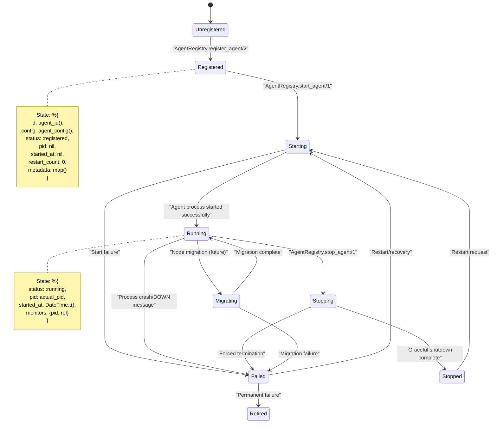
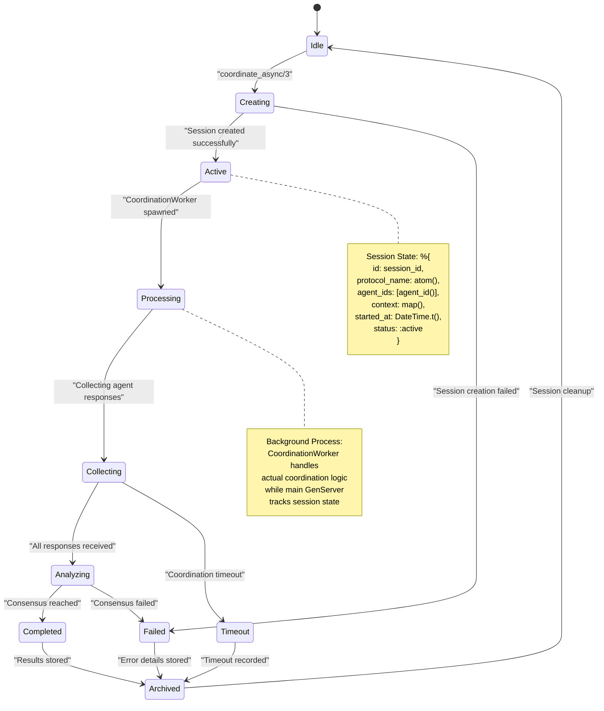
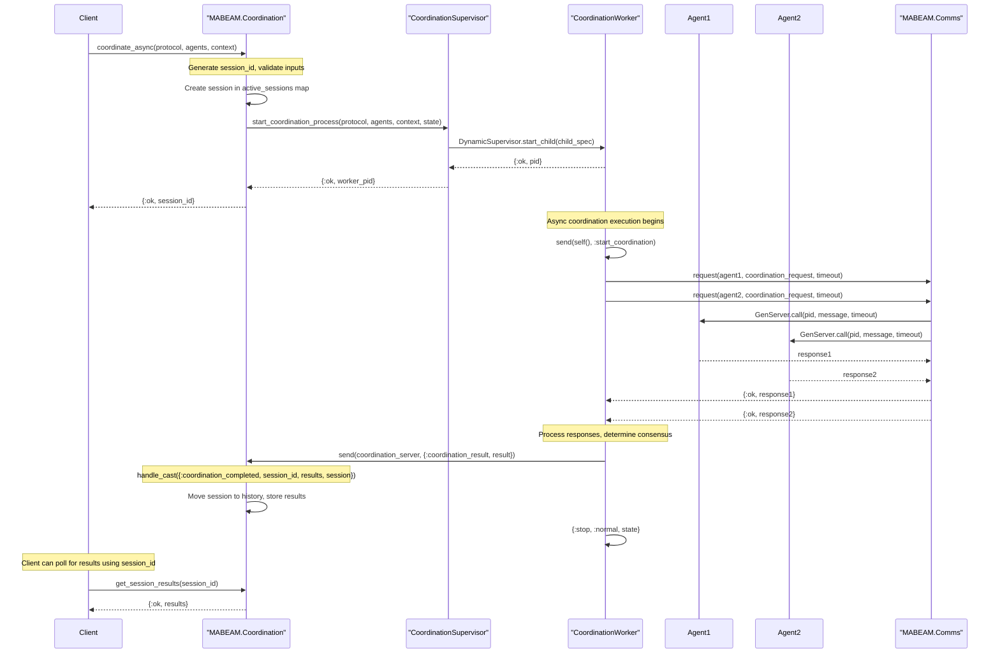
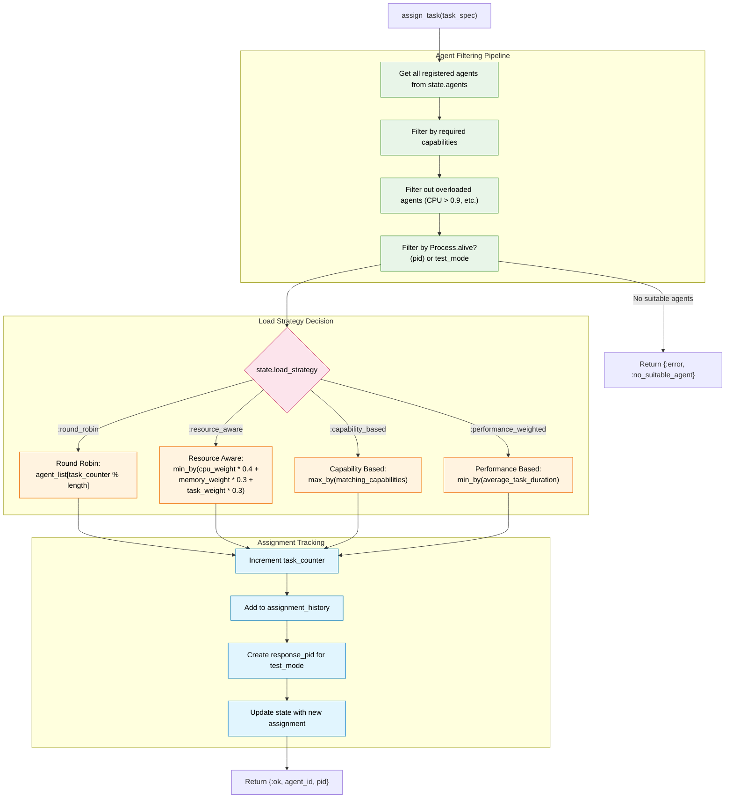
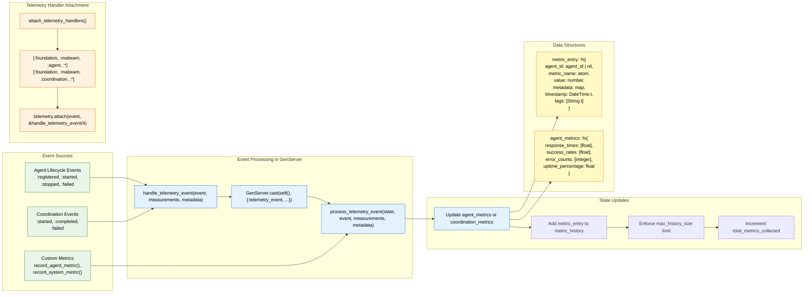
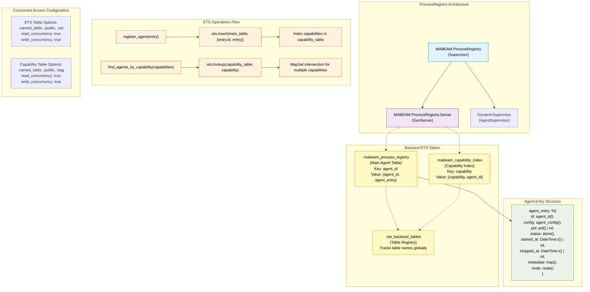

I'll create comprehensive Mermaid diagrams that expose MABEAM's internal architecture and concurrency patterns for senior BEAM/OTP engineers. Let me analyze the codebase and create detailed diagrams showing key data structures, process relationships, and message flows.

## 1. Overall System Architecture & Process Hierarchy

```mermaid
graph TB
    subgraph "MABEAM Application Supervision Tree"
        App["MABEAM.Application<br/>(Supervisor)"] 
        
        App --> Core["MABEAM.Core<br/>(GenServer)"]
        App --> AgentReg["MABEAM.AgentRegistry<br/>(GenServer)"]
        App --> AgentSup["MABEAM.AgentSupervisor<br/>(DynamicSupervisor)"]
        App --> Coord["MABEAM.Coordination<br/>(GenServer)"]
        App --> CoordSup["MABEAM.CoordinationSupervisor<br/>(DynamicSupervisor)"]
        App --> Comms["MABEAM.Comms<br/>(GenServer)"]
        App --> LoadBal["MABEAM.LoadBalancer<br/>(GenServer)"]
        App --> PerfMon["MABEAM.PerformanceMonitor<br/>(GenServer)"]
        App --> Telemetry["MABEAM.Telemetry<br/>(GenServer)"]
        
        subgraph "Process Registry Subsystem"
            App --> ProcReg["MABEAM.ProcessRegistry<br/>(Supervisor)"]
            ProcReg --> ProcRegServer["MABEAM.ProcessRegistry.Server<br/>(GenServer)"]
            ProcReg --> ProcRegAgentSup["MABEAM.ProcessRegistry.AgentSupervisor<br/>(DynamicSupervisor)"]
        end
        
        subgraph "Dynamic Agent Processes"
            AgentSup --> Agent1["Agent Process 1<br/>(GenServer)"]
            AgentSup --> Agent2["Agent Process 2<br/>(GenServer)"]
            AgentSup --> AgentN["Agent Process N<br/>(GenServer)"]
        end
        
        subgraph "Dynamic Coordination Workers"
            CoordSup --> CoordWorker1["MABEAM.CoordinationWorker<br/>(GenServer)"]
            CoordSup --> CoordWorker2["MABEAM.CoordinationWorker<br/>(GenServer)"]
        end
    end
    
    subgraph "Foundation Integration"
        Foundation["Foundation.ProcessRegistry<br/>(External)"]
        AgentReg -.-> Foundation
        ProcRegServer -.-> Foundation
        Telemetry -.-> Foundation
    end
    
    classDef supervisor fill:#e1f5fe,stroke:#0277bd,color:#000
    classDef genserver fill:#f3e5f5,stroke:#7b1fa2,color:#000
    classDef dynamic fill:#fff3e0,stroke:#ef6c00,color:#000
    classDef external fill:#e8f5e8,stroke:#388e3c,color:#000
    
    class App,ProcReg supervisor
    class Core,AgentReg,Coord,Comms,LoadBal,PerfMon,Telemetry,ProcRegServer genserver
    class AgentSup,CoordSup,ProcRegAgentSup,Agent1,Agent2,AgentN,CoordWorker1,CoordWorker2 dynamic
    class Foundation external
```

## 2. Agent Lifecycle & State Management

## 3. Agent Registry Internal Data Flow

```mermaid
graph TB
    subgraph "AgentRegistry State Structure"
        State["State: %{<br/>agents: %{agent_id => agent_info},<br/>monitors: %{pid => {agent_id, ref}},<br/>performance_metrics: map(),<br/>cleanup_interval: integer()<br/>}"]
    end
    
    subgraph "Registration Flow"
        RegCall["handle_call({:register_agent, id, config})"]
        ValidateConfig["validate_agent_config(config)"]
        CreateInfo["Create agent_info structure"]
        UpdateState["Update agents map"]
        RegisterFoundation["Register in Foundation.ProcessRegistry"]
        
        RegCall --> ValidateConfig
        ValidateConfig --> CreateInfo
        CreateInfo --> UpdateState
        UpdateState --> RegisterFoundation
    end
    
    subgraph "Start Flow"
        StartCall["handle_call({:start_agent, id})"]
        CheckStatus["Check agent status != :running"]
        StartViaSuper["start_agent_via_supervisor(id, config)"]
        MonitorProc["Process.monitor(pid)"]
        UpdateMonitors["Update monitors map"]
        UpdateFoundation["Update Foundation registry"]
        
        StartCall --> CheckStatus
        CheckStatus --> StartViaSuper
        StartViaSuper --> MonitorProc
        MonitorProc --> UpdateMonitors
        UpdateMonitors --> UpdateFoundation
    end
    
    subgraph "Monitor Flow"
        DownMsg["handle_info({:DOWN, ref, :process, pid, reason})"]
        LookupAgent["Map.get(monitors, pid)"]
        UpdateStatus["Update agent status to :failed"]
        CleanupMaps["Remove from monitors and update state"]
        EmitTelemetry["Emit crash telemetry"]
        
        DownMsg --> LookupAgent
        LookupAgent --> UpdateStatus
        UpdateStatus --> CleanupMaps
        CleanupMaps --> EmitTelemetry
    end
    
    classDef datastructure fill:#fff9c4,stroke:#f57f17,color:#000
    classDef process fill:#e8f5e8,stroke:#388e3c,color:#000
    classDef flow fill:#e3f2fd,stroke:#1976d2,color:#000
    
    class State datastructure
    class RegCall,StartCall,DownMsg process
    class ValidateConfig,CreateInfo,UpdateState,CheckStatus,StartViaSuper,MonitorProc,LookupAgent,UpdateStatus flow
```

## 4. Coordination Protocol State Machine

## 5. Message Flow in Coordination System

## 6. Communication System Internal Architecture

```mermaid
graph TB
    subgraph "MABEAM.Comms State"
        CommsState["State: %{<br/>total_requests: integer(),<br/>successful_requests: integer(),<br/>failed_requests: integer(),<br/>average_response_time: float(),<br/>active_requests: map()<br/>}"]
    end
    
    subgraph "Request Processing Pipeline"
        IncomingReq["handle_call({:request, agent_id, message, timeout})"]
        GetAgentPid["get_agent_pid(agent_id)"]
        ProcessReq["process_request(agent_pid, message, timeout)"]
        SendRequest["send_request_to_agent(agent_pid, message, timeout)"]
        UpdateStats["update_stats_and_emit_telemetry()"]
        
        IncomingReq --> GetAgentPid
        GetAgentPid --> ProcessReq
        ProcessReq --> SendRequest
        SendRequest --> UpdateStats
    end
    
    subgraph "Agent PID Resolution"
        CheckRegistry["ProcessRegistry.get_agent_info(agent_id)"]
        ValidatePid["Check if pid != nil and Process.alive?(pid)"]
        ReturnPid["Return {:ok, pid} or {:error, :not_found}"]
        
        CheckRegistry --> ValidatePid
        ValidatePid --> ReturnPid
    end
    
    subgraph "Deduplication Logic"
        CheckDupe["Check request_key in active_requests"]
        CacheResult["Store result for future duplicates"]
        ReturnCached["Return cached result for duplicates"]
        
        CheckDupe --> CacheResult
        CheckDupe --> ReturnCached
    end
    
    subgraph "Statistics Tracking"
        RequestCount["Increment total_requests"]
        ResponseTime["Calculate duration"]
        SuccessRate["Update success/failure counters"]
        AvgTime["Recalculate average_response_time"]
        
        RequestCount --> ResponseTime
        ResponseTime --> SuccessRate
        SuccessRate --> AvgTime
    end
    
    classDef state fill:#fff9c4,stroke:#f57f17,color:#000
    classDef process fill:#e8f5e8,stroke:#388e3c,color:#000
    classDef cache fill:#f3e5f5,stroke:#7b1fa2,color:#000
    classDef stats fill:#e1f5fe,stroke:#0277bd,color:#000
    
    class CommsState state
    class IncomingReq,GetAgentPid,CheckRegistry process
    class CheckDupe,CacheResult,ReturnCached cache
    class RequestCount,ResponseTime,SuccessRate,AvgTime stats
```

## 7. Load Balancer Agent Selection Algorithm

## 8. Performance Monitor Data Flow

```mermaid
graph TB
    subgraph "Performance Monitor State"
        MonitorState["State: %{<br/>agent_metrics: %{agent_id => metrics},<br/>metrics_history: %{agent_id => [historical_metrics]},<br/>monitoring_status: %{agent_id => boolean},<br/>active_alerts: [alert],<br/>alert_thresholds: thresholds<br/>}"]
    end
    
    subgraph "Metrics Recording Flow"
        RecordCast["handle_cast({:record_metrics, agent_id, metrics})"]
        CheckMonitoring["Check monitoring_status[agent_id] or existing metrics"]
        AddTimestamp["Add timestamp to metrics"]
        UpdateCurrent["Update agent_metrics map"]
        UpdateHistory["Add to metrics_history with size limit"]
        CheckAlerts["check_and_update_alerts()"]
        
        RecordCast --> CheckMonitoring
        CheckMonitoring -->|"Monitoring enabled"| AddTimestamp
        CheckMonitoring -->|"Not monitored"| DropMetrics["Drop metrics (no recording)"]
        AddTimestamp --> UpdateCurrent
        UpdateCurrent --> UpdateHistory
        UpdateHistory --> CheckAlerts
    end
    
    subgraph "Alert Processing"
        CompareThresholds["Compare metrics vs alert_thresholds"]
        GenerateAlerts["Create new alert structs"]
        ResolveAlerts["Remove resolved alerts"]
        LogAlerts["Log new/resolved alerts"]
        UpdateActiveAlerts["Update active_alerts list"]
        
        CompareThresholds --> GenerateAlerts
        GenerateAlerts --> ResolveAlerts
        ResolveAlerts --> LogAlerts
        LogAlerts --> UpdateActiveAlerts
    end
    
    subgraph "Statistics Calculation"
        CalcStats["calculate_performance_statistics()"]
        CalcAvgCPU["Calculate average CPU across all agents"]
        CalcAvgMemory["Calculate average memory usage"]
        CalcTotals["Calculate totals and extremes"]
        
        CalcStats --> CalcAvgCPU
        CalcAvgCPU --> CalcAvgMemory
        CalcAvgMemory --> CalcTotals
    end
    
    classDef state fill:#fff9c4,stroke:#f57f17,color:#000
    classDef process fill:#e8f5e8,stroke:#388e3c,color:#000
    classDef alert fill:#ffebee,stroke:#d32f2f,color:#000
    classDef stats fill:#e1f5fe,stroke:#0277bd,color:#000
    
    class MonitorState state
    class RecordCast,CheckMonitoring,AddTimestamp,UpdateCurrent process
    class CompareThresholds,GenerateAlerts,ResolveAlerts,LogAlerts,UpdateActiveAlerts alert
    class CalcStats,CalcAvgCPU,CalcAvgMemory,CalcTotals stats
```

## 9. Telemetry Event Processing Pipeline

## 10. Process Registry Backend & ETS Integration

This comprehensive set of diagrams exposes the key internal mechanisms of MABEAM:

1. **Overall architecture** shows the supervision tree and process relationships
2. **Agent lifecycle** reveals the state machine and transitions
3. **Registry data flow** exposes internal state management and monitoring
4. **Coordination state machine** shows protocol execution phases
5. **Message flow** demonstrates inter-process communication patterns
6. **Communication system** reveals request processing and deduplication
7. **Load balancer** shows agent selection algorithms and filtering
8. **Performance monitor** exposes metrics collection and alerting
9. **Telemetry pipeline** shows event processing and state updates
10. **Process registry backend** reveals ETS table structure and concurrent access patterns

Each diagram focuses on the critical data structures, concurrent access patterns, and message flows that senior BEAM/OTP engineers need to understand for debugging, optimization, and extending the system.
