# Multi-Agent Coordination Patterns & Data Flows

## Diagram 1: Agent Discovery & Capability Matching (Real-time Flow)

```mermaid
sequenceDiagram
    participant Client as External Client
    participant Registry as Agent Registry
    participant Discovery as Discovery Service
    participant AgentA as Agent A (Coder)
    participant AgentB as Agent B (Reviewer)  
    participant AgentC as Agent C (Optimizer)
    participant Coordinator as MABEAM Coordinator
    
    Note over Client,Coordinator: T0: System Bootstrap & Discovery
    Registry->>+Discovery: start_discovery_scan()
    
    par Agent Capability Broadcasting
        AgentA->>Registry: register_capabilities([code_generation, python, elixir])
        AgentB->>Registry: register_capabilities([code_review, quality_analysis, security])
        AgentC->>Registry: register_capabilities([optimization, simba, hyperparameter_tuning])
    and Discovery Process
        Discovery->>+Registry: scan_registered_agents()
        Registry-->>Discovery: agent_list[{id, capabilities, load, metadata}]
        Discovery->>Discovery: build_capability_index()
        Discovery->>Discovery: calculate_compatibility_matrix()
    end
    
    Note over Client,Coordinator: T1: Task Request Arrives (Complex ML Pipeline)
    Client->>+Coordinator: request_task_execution({
                                task: "implement_ml_pipeline",
                                requirements: [code_generation, code_review, optimization],
                                priority: high,
                                deadline: 300_seconds
                            })
    
    Note over Client,Coordinator: T2: Capability Matching & Team Assembly
    Coordinator->>+Discovery: find_optimal_team(requirements: [code_generation, code_review, optimization])
    
    par Capability Analysis
        Discovery->>Discovery: capability_match_score(AgentA, code_generation) -> 0.95
        Discovery->>Discovery: capability_match_score(AgentB, code_review) -> 0.88  
        Discovery->>Discovery: capability_match_score(AgentC, optimization) -> 0.92
    and Load Balancing Check
        Discovery->>Registry: get_agent_load(AgentA) -> {queue: 2, active: 1, cpu: 45%}
        Discovery->>Registry: get_agent_load(AgentB) -> {queue: 0, active: 0, cpu: 12%}
        Discovery->>Registry: get_agent_load(AgentC) -> {queue: 1, active: 1, cpu: 78%}
    and Compatibility Matrix
        Discovery->>Discovery: check_agent_compatibility(AgentA, AgentB) -> 0.91
        Discovery->>Discovery: check_agent_compatibility(AgentB, AgentC) -> 0.89
        Discovery->>Discovery: check_agent_compatibility(AgentA, AgentC) -> 0.94
    end
    
    Discovery->>Discovery: calculate_team_score({A,B,C}) -> 0.887 (weighted average)
    Discovery-->>Coordinator: optimal_team[{agent_a: 0.95, agent_b: 0.88, agent_c: 0.92}, team_score: 0.887]
    
    Note over Client,Coordinator: T3: Team Coordination Setup  
    Coordinator->>+AgentA: establish_coordination_channel(session_id: #ref456, team: [B,C])
    Coordinator->>+AgentB: establish_coordination_channel(session_id: #ref456, team: [A,C])
    Coordinator->>+AgentC: establish_coordination_channel(session_id: #ref456, team: [A,B])
    
    par Coordination Channels
        AgentA-->>Coordinator: channel_ready(session_id: #ref456)  
        AgentB-->>Coordinator: channel_ready(session_id: #ref456)
        AgentC-->>Coordinator: channel_ready(session_id: #ref456)
    and Task Distribution  
        Coordinator->>AgentA: assign_task({phase: code_generation, inputs: requirements, dependencies: []})
        Coordinator->>AgentB: assign_task({phase: code_review, inputs: [], dependencies: [AgentA]})
        Coordinator->>AgentC: assign_task({phase: optimization, inputs: [], dependencies: [AgentA, AgentB]})
    end
    
    Note over Client,Coordinator: T4: Coordinated Execution Pipeline
    AgentA->>AgentA: execute_code_generation() -> generated_code
    AgentA->>+Coordinator: task_complete(phase: code_generation, output: generated_code, next: [AgentB])
    
    Coordinator->>+AgentB: dependency_satisfied(input: generated_code, from: AgentA)
    AgentB->>AgentB: execute_code_review(generated_code) -> review_report  
    AgentB->>+Coordinator: task_complete(phase: code_review, output: review_report, next: [AgentC])
    
    Coordinator->>+AgentC: dependency_satisfied(input: {generated_code, review_report}, from: [AgentA, AgentB])
    AgentC->>AgentC: execute_optimization(generated_code, review_report) -> optimized_solution
    AgentC->>+Coordinator: task_complete(phase: optimization, output: optimized_solution, next: [])
    
    Coordinator->>Coordinator: aggregate_results([generated_code, review_report, optimized_solution])
    Coordinator-->>Client: task_execution_complete(result: optimized_solution, metadata: execution_stats)
    
    Note over Client,Coordinator: Total Execution Time: 127ms (85ms work + 42ms coordination)
```

### Capability Matching Data Flows:
- **Discovery Latency**: 23ms to scan, index, and calculate compatibility matrix
- **Team Assembly**: Weighted scoring considers capability match (0.95), load (45% CPU), and compatibility (0.91)
- **Coordination Overhead**: 42ms coordination vs 85ms actual work (33% overhead)
- **Dependency Pipeline**: Sequential execution with dependency satisfaction triggers
- **Load-aware Selection**: High CPU agent (78%) gets lowest priority despite high capability match (0.92)

---

## Diagram 2: Auction-Based Task Allocation (Market Mechanism)

```mermaid
graph TB
    subgraph "T0: Task Announcement (Broadcast Phase)"
        TaskCoord[Task Coordinator<br/>auction_id: #ref789]
        Task[High-Value Task<br/>reward: 100 credits<br/>complexity: 0.8<br/>deadline: 60s]
        
        TaskCoord -.->|broadcast_auction| Agent1[Agent 1<br/>Specialist: NLP<br/>Load: 20%<br/>Credits: 450]
        TaskCoord -.->|broadcast_auction| Agent2[Agent 2<br/>Specialist: Vision<br/>Load: 60%<br/>Credits: 230]
        TaskCoord -.->|broadcast_auction| Agent3[Agent 3<br/>Specialist: General<br/>Load: 30%<br/>Credits: 680]
        TaskCoord -.->|broadcast_auction| Agent4[Agent 4<br/>Specialist: NLP<br/>Load: 80%<br/>Credits: 120]
        TaskCoord -.->|broadcast_auction| Agent5[Agent 5<br/>Specialist: Optimization<br/>Load: 10%<br/>Credits: 890]
    end
    
    subgraph "T1: Bid Calculation (Parallel Decision Making)"
        Agent1 -.->|evaluate| Calc1{Bid Calculator<br/>Agent 1}
        Agent2 -.->|evaluate| Calc2{Bid Calculator<br/>Agent 2}
        Agent3 -.->|evaluate| Calc3{Bid Calculator<br/>Agent 3}
        Agent4 -.->|evaluate| Calc4{Bid Calculator<br/>Agent 4}
        Agent5 -.->|evaluate| Calc5{Bid Calculator<br/>Agent 5}
        
        Calc1 -.->|factors| Factors1[Capability Match: 0.9<br/>Load Factor: 0.8<br/>Reward Appeal: 0.7<br/>Risk Assessment: 0.3<br/>🎯 BID: 85 credits]
        
        Calc2 -.->|factors| Factors2[Capability Match: 0.4<br/>Load Factor: 0.4<br/>Reward Appeal: 0.9<br/>Risk Assessment: 0.7<br/>❌ NO BID (low capability)]
        
        Calc3 -.->|factors| Factors3[Capability Match: 0.7<br/>Load Factor: 0.7<br/>Reward Appeal: 0.6<br/>Risk Assessment: 0.4<br/>🎯 BID: 75 credits]
        
        Calc4 -.->|factors| Factors4[Capability Match: 0.9<br/>Load Factor: 0.2<br/>Reward Appeal: 1.0<br/>Risk Assessment: 0.8<br/>❌ NO BID (overloaded)]
        
        Calc5 -.->|factors| Factors5[Capability Match: 0.6<br/>Load Factor: 0.9<br/>Reward Appeal: 0.5<br/>Risk Assessment: 0.2<br/>🎯 BID: 65 credits]
    end
    
    subgraph "T2: Bid Collection & Evaluation (15ms window)"
        Factors1 -.->|submit_bid| BidQueue[Bid Collection Queue<br/>Timeout: 15ms]
        Factors3 -.->|submit_bid| BidQueue
        Factors5 -.->|submit_bid| BidQueue
        
        BidQueue -.->|sort_by_value| BidRank{Bid Ranking<br/>1st: Agent1 (85 credits)<br/>2nd: Agent3 (75 credits)<br/>3rd: Agent5 (65 credits)}
        
        BidRank -.->|winner_selection| WinnerLogic[Winner Selection Logic<br/>Criteria: Highest Bid + Risk Assessment<br/>Winner: Agent1 (85 credits, risk: 0.3)]
    end
    
    subgraph "T3: Auction Resolution & Contract"
        WinnerLogic -.->|award_contract| Contract[Contract Execution<br/>Agent1 ← Task<br/>Reward: 85 credits<br/>Penalty: 25 credits if failed]
        
        Contract -.->|notify_losers| Notify1[Agent3: lost_auction]
        Contract -.->|notify_losers| Notify2[Agent5: lost_auction]
        Contract -.->|notify_non_bidders| Notify3[Agent2: auction_ended]  
        Contract -.->|notify_non_bidders| Notify4[Agent4: auction_ended]
        
        Contract -.->|start_execution| Execute[Agent1 Task Execution<br/>Status: IN_PROGRESS<br/>Progress Monitoring: ON<br/>Deadline Tracking: 60s]
    end
    
    subgraph "T4: Execution Monitoring & Settlement"
        Execute -.->|progress_updates| Monitor[Progress Monitor<br/>25% complete: 15s<br/>50% complete: 28s<br/>75% complete: 41s<br/>100% complete: 53s]
        
        Monitor -.->|success| Settlement[Settlement System<br/>Task: COMPLETED<br/>Quality Score: 0.92<br/>Time: 53s (under deadline)<br/>💰 Award: 85 credits → Agent1<br/>📊 Update Reputation: +0.05]
        
        Settlement -.->|update_economics| Economics[Economic System Update<br/>Agent1: 450 + 85 = 535 credits<br/>Agent1 Success Rate: 94.2% → 94.4%<br/>Task Pool: -1 task<br/>Market Liquidity: High]
    end
    
    classDef highbid fill:#c8e6c9,stroke:#2e7d32,stroke-width:3px
    classDef mediumbid fill:#fff3e0,stroke:#ef6c00,stroke-width:2px
    classDef lowbid fill:#e3f2fd,stroke:#1565c0,stroke-width:1px
    classDef nobid fill:#ffebee,stroke:#c62828,stroke-dasharray: 5 5
    classDef winner fill:#e8f5e8,stroke:#388e3c,stroke-width:4px
    classDef monitor fill:#f3e5f5,stroke:#7b1fa2
    
    class Factors1,Agent1 highbid
    class Factors3,Agent3 mediumbid  
    class Factors5,Agent5 lowbid
    class Factors2,Factors4,Agent2,Agent4 nobid
    class Contract,Execute,WinnerLogic winner
    class Monitor,Settlement,Economics monitor
```

### Market Mechanism Analysis:
- **Bid Strategy Differentiation**: Agents use different weighting (capability vs load vs reward vs risk)
- **Market Participation**: 3/5 agents bid (60% participation rate) 
- **Selection Criteria**: Combines highest bid (85) with lowest risk (0.3) rather than pure price
- **Economic Feedback Loop**: Success updates reputation, affecting future bid calculations
- **Market Efficiency**: 15ms bid collection window vs 53s execution (0.47% auction overhead)

**🚨 DESIGN GAP DETECTED**: Current codebase lacks auction-based allocation mechanism entirely. This represents a major missing coordination pattern for multi-agent systems.

---

## Diagram 3: Consensus-Based Decision Making (Agent Voting)

```mermaid
flowchart TD
    subgraph "Decision Context: ML Model Selection"
        DecisionReq[Decision Required<br/>Select ML Model for Production<br/>Stakeholder Agents: 7<br/>Consensus Threshold: 60%<br/>Options: [BERT, GPT-4, Claude, Custom]]
    end
    
    subgraph "T0-T5s: Information Gathering Phase"
        Agent_Data[Data Scientist Agent<br/>Preference: Custom Model<br/>Reasoning: Domain-specific needs]
        Agent_Perf[Performance Agent<br/>Preference: BERT<br/>Reasoning: Latency requirements] 
        Agent_Cost[Cost Agent<br/>Preference: BERT<br/>Reasoning: Budget constraints]
        Agent_Quality[Quality Agent<br/>Preference: GPT-4<br/>Reasoning: Accuracy metrics]
        Agent_Ops[Operations Agent<br/>Preference: BERT<br/>Reasoning: Deployment simplicity]
        Agent_Security[Security Agent<br/>Preference: Custom<br/>Reasoning: Data privacy]
        Agent_Product[Product Agent<br/>Preference: Claude<br/>Reasoning: Feature completeness]
        
        DecisionReq -.->|gather_input| Agent_Data
        DecisionReq -.->|gather_input| Agent_Perf
        DecisionReq -.->|gather_input| Agent_Cost  
        DecisionReq -.->|gather_input| Agent_Quality
        DecisionReq -.->|gather_input| Agent_Ops
        DecisionReq -.->|gather_input| Agent_Security
        DecisionReq -.->|gather_input| Agent_Product
    end
    
    subgraph "T5-T10s: Initial Voting Round"
        VoteRound1{Initial Vote Tally<br/>BERT: 3 votes (43%)<br/>GPT-4: 1 vote (14%)<br/>Claude: 1 vote (14%)<br/>Custom: 2 votes (29%)<br/>❌ No Consensus (need 60%)}
        
        Agent_Data -.->|vote: Custom| VoteRound1
        Agent_Perf -.->|vote: BERT| VoteRound1
        Agent_Cost -.->|vote: BERT| VoteRound1
        Agent_Quality -.->|vote: GPT-4| VoteRound1
        Agent_Ops -.->|vote: BERT| VoteRound1
        Agent_Security -.->|vote: Custom| VoteRound1
        Agent_Product -.->|vote: Claude| VoteRound1
    end
    
    subgraph "T10-T15s: Negotiation & Preference Exchange"
        NegotiationFacilitator[Negotiation Facilitator<br/>Identify Compromise Opportunities<br/>Analyze Preference Similarities<br/>Suggest Trade-offs]
        
        VoteRound1 -.->|trigger_negotiation| NegotiationFacilitator
        
        NegotiationFacilitator -.->|analysis| PrefMatrix[Preference Analysis<br/>Cost + Performance align on BERT<br/>Data + Security align on Custom<br/>Quality stands alone on GPT-4<br/>Product stands alone on Claude<br/>💡 BERT has strongest coalition]
        
        PrefMatrix -.->|facilitate_discussion| Discussion[Agent Discussion Round<br/>Quality Agent: "What if BERT + fine-tuning?"<br/>Security Agent: "Custom allows better control"<br/>Cost Agent: "BERT lowest TCO"<br/>Product Agent: "Claude has better APIs"]
    end
    
    subgraph "T15-T20s: Informed Re-voting"
        Discussion -.->|trigger_revote| VoteRound2{Second Vote Tally<br/>BERT + Fine-tuning: 5 votes (71%)<br/>Custom: 1 vote (14%)<br/>Claude: 1 vote (14%)<br/>✅ CONSENSUS ACHIEVED (71% > 60%)}
        
        Agent_Data -.->|changed_vote: BERT+FT| VoteRound2
        Agent_Perf -.->|vote: BERT+FT| VoteRound2
        Agent_Cost -.->|vote: BERT+FT| VoteRound2
        Agent_Quality -.->|changed_vote: BERT+FT| VoteRound2
        Agent_Ops -.->|changed_vote: BERT+FT| VoteRound2
        Agent_Security -.->|vote: Custom| VoteRound2
        Agent_Product -.->|vote: Claude| VoteRound2
    end
    
    subgraph "T20-T25s: Decision Implementation"
        VoteRound2 -.->|implement_decision| Implementation[Decision Implementation<br/>Selected: BERT + Fine-tuning<br/>Consensus Level: 71%<br/>Dissenting Agents: 2<br/>Implementation Priority: HIGH]
        
        Implementation -.->|notify_all| NotifyAll[Notification Broadcast<br/>Decision: BERT + Fine-tuning selected<br/>Rationale: Cost-performance balance with customization<br/>Timeline: Implementation begins immediately<br/>Dissent Recorded: Security & Product concerns noted]
        
        Implementation -.->|track_outcome| OutcomeTracking[Outcome Tracking Setup<br/>Success Metrics: [latency, accuracy, cost, security]<br/>Review Period: 30 days<br/>Dissent Review: If metrics fail, revisit Custom/Claude options]
    end
    
    classDef bert fill:#4caf50,stroke:#2e7d32,stroke-width:3px
    classDef custom fill:#ff9800,stroke:#ef6c00,stroke-width:2px
    classDef gpt4 fill:#2196f3,stroke:#1565c0,stroke-width:2px
    classDef claude fill:#9c27b0,stroke:#7b1fa2,stroke-width:2px  
    classDef consensus fill:#66bb6a,stroke:#2e7d32,stroke-width:4px
    classDef negotiation fill:#ffc107,stroke:#f57c00,stroke-width:2px
    
    class Agent_Perf,Agent_Cost,Agent_Ops,VoteRound2 bert
    class Agent_Data,Agent_Security custom
    class Agent_Quality gpt4
    class Agent_Product claude
    class Implementation,NotifyAll,OutcomeTracking consensus
    class NegotiationFacilitator,PrefMatrix,Discussion negotiation
```

### Consensus Decision Analysis:
- **Initial Fragmentation**: 4 options split vote, no clear majority (highest: 43%)
- **Negotiation Impact**: Discussion creates new hybrid option (BERT + Fine-tuning)
- **Coalition Building**: Cost + Performance agents bring Data + Quality agents to BERT coalition
- **Consensus Achievement**: 71% consensus on hybrid solution vs 43% on original options
- **Dissent Management**: Minority preferences recorded for future evaluation
- **Implementation Speed**: 25 seconds total decision time for 7-agent consensus

**🚨 DESIGN GAP DETECTED**: Current coordination system lacks consensus-based decision making protocols. Agents cannot collectively decide on system-level choices.

---

## Diagram 4: Dynamic Resource Allocation & Load Balancing

```mermaid
gantt
    title Dynamic Resource Allocation - Live System Response
    dateFormat X
    axisFormat %L
    
    section System_Load_Monitor
    Baseline Monitoring     :monitor1, 0, 50ms
    Load Spike Detection    :milestone, spike1, 50, 0ms
    Resource Analysis       :analysis1, after spike1, 25ms
    Allocation Decision     :decision1, after analysis1, 15ms
    
    section Agent_Pool_A
    Normal Load (30%)       :normal1, 0, 50ms
    Spike Handling (95%)    :spike_a, after normal1, 40ms
    Overload Alert          :milestone, alert1, after spike_a, 0ms
    Request Redirect        :redirect1, after alert1, 10ms
    
    section Agent_Pool_B  
    Low Load (15%)          :low1, 0, 50ms
    Incoming Redirects      :incoming1, after low1, 30ms
    Load Increase (65%)     :increase1, after incoming1, 25ms
    Stabilization           :stable1, after increase1, 15ms
    
    section Agent_Pool_C
    Medium Load (45%)       :med1, 0, 50ms
    Partial Redirects       :partial1, after med1, 35ms  
    Load Increase (70%)     :increase2, after partial1, 20ms
    Peak Performance        :peak1, after increase2, 10ms
    
    section New_Agent_Spawn
    Spawn Decision          :milestone, spawn_decision, 90, 0ms
    Agent Initialization    :init1, after spawn_decision, 25ms
    Registration            :reg1, after init1, 10ms
    Load Assignment         :assign1, after reg1, 5ms
    
    section Load_Rebalancing
    Rebalance Trigger       :milestone, rebalance, 130, 0ms
    Calculate Optimal       :calc1, after rebalance, 20ms
    Migrate Tasks           :migrate1, after calc1, 15ms
    System Stabilized       :milestone, stable_final, after migrate1, 0ms
```



### Resource Allocation Flow Data:
- **Detection Latency**: 50ms to detect load spike via monitoring system
- **Response Time**: 15ms to make allocation decision after analysis
- **Rebalancing Strategy**: Redirect from 95% loaded pool to 15% and 45% loaded pools
- **Spawn Threshold**: New agent spawned when sustained load >90% for >40ms
- **Migration Cost**: 15ms to migrate active tasks between agents during rebalancing
- **Total Adaptation Time**: 165ms from spike detection to system stabilization

**🚨 DESIGN GAP DETECTED**: Current system lacks dynamic resource allocation mechanisms. No automatic load balancing or agent pool scaling based on demand.

---

## Summary of Design Gaps Identified:

### 1. **Missing Auction-Based Task Allocation** 
**Current State**: Static assignment through registry lookup
**Required**: Market-based coordination with bidding, contracts, and reputation
**Impact**: Suboptimal resource utilization, no economic incentives

### 2. **No Consensus Decision Making**
**Current State**: Centralized coordinator makes all decisions  
**Required**: Distributed agent voting with negotiation and conflict resolution
**Impact**: Cannot handle conflicting agent preferences or collective choices

### 3. **Lack of Dynamic Resource Management**
**Current State**: Fixed agent pools, manual scaling
**Required**: Auto-scaling, load balancing, and adaptive resource allocation  
**Impact**: Poor performance under varying load, resource waste

### 4. **Missing Coordination Protocols**
**Current State**: Direct message passing between agents
**Required**: Structured protocols for auction, consensus, negotiation, and coordination
**Impact**: Ad-hoc communication, difficult to debug and optimize

### 5. **No Economic/Reputation System**
**Current State**: No incentive mechanisms for agent cooperation
**Required**: Credit system, reputation tracking, and performance-based rewards
**Impact**: No mechanism to encourage high-quality agent behavior

These diagrams reveal that while the **technical infrastructure** (processes, supervision, registry) exists, the **coordination intelligence** layer is largely missing from the current implementation.