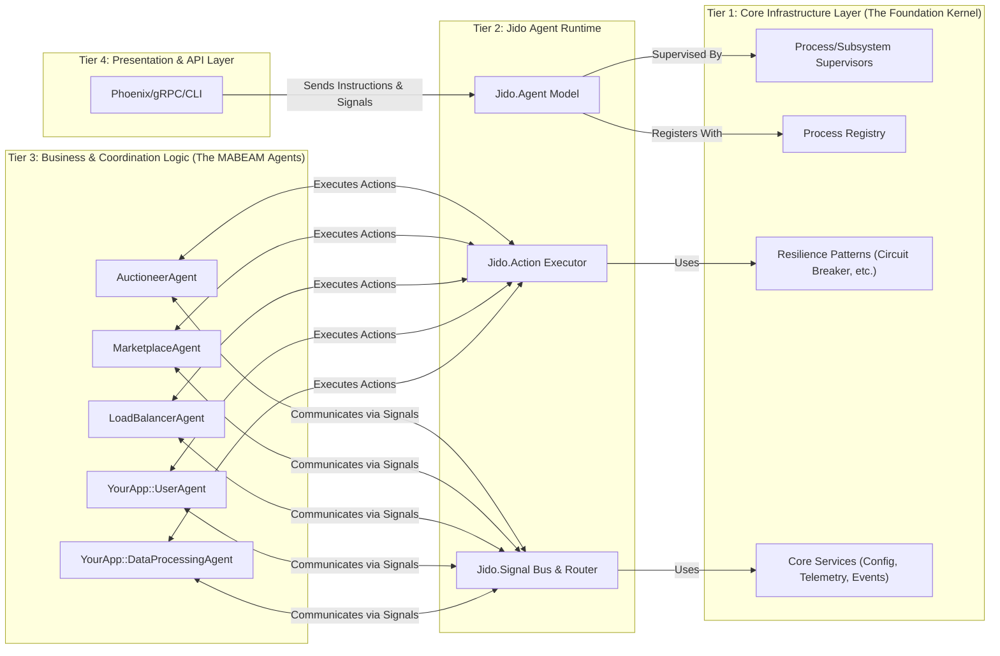

Excellent. This is a fascinating set of libraries. `foundation` provides a general-purpose toolkit, `mabeam` introduces high-level multi-agent concepts, and the `jido` suite (`jido`, `jido_action`, `jido_signal`) offers a very specific, well-designed, and composable agent-based programming model.

The request to "rethink the intention" of `foundation` and `mabeam` is key. Instead of treating them as separate, competing frameworks, we will refactor their concepts into a cohesive, layered architecture centered around the robust agent model provided by `jido`.

Here is a review of the libraries followed by a proposed multi-tier architecture.

### Library Review & Analysis

1.  **`foundation`**: This is a solid, general-purpose "platform" library.
    *   **Strengths**: Strong infrastructure components (`CircuitBreaker`, `RateLimiter`, `ConnectionManager`), good use of OTP (`EcosystemSupervisor`), and a clear definition of service contracts (`Contracts`). The `ProcessRegistry` is a fundamental building block.
    *   **Weaknesses/Redundancies**: `BEAM.Processes` is a less mature agent model compared to `jido`. The `Coordination.Primitives` are useful but are a lower level of abstraction than the agent-based coordination needed for `mabeam`.
    *   **Rethought Intention**: `foundation` should not be an application framework itself, but the **OS/Kernel** of our new architecture. It provides the rock-solid, non-domain-specific bedrock: infrastructure, core OTP patterns, and service contracts that higher layers will implement.

2.  **`mabeam`**: This library introduces high-level, domain-specific concepts for multi-agent systems.
    *   **Strengths**: Focus on economic coordination (`Auction`, `Market`), agent lifecycle (`AgentSupervisor`, `AgentRegistry`), and performance monitoring. These are the *goals* of a sophisticated agent system.
    *   **Weaknesses/Redundancies**: It has its own `ProcessRegistry` and `AgentSupervisor`, which are redundant with `foundation` and less flexible than `jido`'s model. Its agent implementation is less defined than `jido`'s.
    *   **Rethought Intention**: The *concepts* from `mabeam` (economics, load balancing, coordination) are invaluable. However, its implementation will be discarded. These concepts will be rebuilt as powerful, specialized **Jido Agents** and **Skills** within the new architecture, rather than being a separate framework.

3.  **The `jido` Libraries (`jido`, `jido_action`, `jido_signal`)**: This suite is the most cohesive and powerful core for an agent-based system.
    *   **Strengths**:
        *   `jido_action`: The `Action` is a brilliant abstraction—a self-contained, validated, composable unit of work. This is the "verb" of our system.
        *   `jido_signal`: A well-defined, CloudEvents-based messaging system. The `Bus` and `Router` provide a clean "nervous system."
        *   `jido`: The `Agent` itself, with its `Server` process, `Skills` (collections of actions), and `Sensors` (event producers), forms a complete, testable, and extensible programming model.
    *   **Rethought Intention**: The `jido` suite is not just a library; it is the **Core Application Runtime**. It's the framework upon which all business and coordination logic will be built. It provides the "nouns" (`Agent`), "verbs" (`Action`), and "sentences" (`Instruction`) of our new architecture.

---

### A Robust Multi-Tier Architecture for Autonomous Systems

This architecture re-imagines the libraries as layers of a cohesive system, emphasizing separation of concerns, high cohesion, and clear data flow, while embodying OTP and SOLID principles.

#### Architectural Vision

We will construct a 4-tier system where each layer provides a distinct service to the layer above it, moving from low-level infrastructure to high-level business logic. `Foundation` becomes the Kernel, `Jido` becomes the Application Runtime, and `MABEAM`'s concepts are implemented as Applications on top.

---

### Tier 1: The Core Infrastructure Layer (The Kernel)

This layer is the re-purposed `foundation` library. It is completely agnostic of agents, actions, or signals. Its sole responsibility is to provide a stable, observable, and resilient OTP platform.

*   **Components**:
    *   **Process Supervision (`Foundation.BEAM.EcosystemSupervisor`)**: Renamed to `JidoOS.Subsystem.Supervisor`. It is the primary tool for starting and supervising major, long-running parts of the system, including the Jido Runtime itself and core services.
    *   **Service Registry (`Foundation.ProcessRegistry`)**: The single source of truth for process discovery. All major services and agents register here. It uses the ETS/Horde backends for single-node performance and future distribution.
    *   **Core Services (`Foundation.Services.*`)**:
        *   `ConfigServer`: Manages system-wide configuration.
        *   `TelemetryService`: Centralized telemetry hub.
        *   `EventStore`: A generic event store for auditing and history, separate from the real-time `Jido.Signal` bus.
    *   **Resilience Patterns (`Foundation.Infrastructure.*`)**:
        *   `CircuitBreaker`, `RateLimiter`, `ConnectionManager` provide protection for interactions with external systems or expensive internal resources. They are used by `Actions` in the higher tiers.
    *   **Contracts (`Foundation.Contracts.*`)**: Define the behaviours for core services, ensuring a stable interface for the layers above.

*   **SOLID Principles**:
    *   **SRP**: This layer's single responsibility is to manage BEAM processes and provide stable, low-level infrastructure.
    *   **OCP**: It is closed for modification but open for extension; new resilience patterns or core services can be added without changing existing ones.

---

### Tier 2: The Jido Agent Runtime (The Application Runtime)

This is the heart of the new architecture, built entirely from the `jido` libraries. It provides the programming model and execution environment for all higher-level logic.

*   **Components**:
    *   **`Jido.Agent`**: The core abstraction for a unit of logic. An `Agent` is a `GenServer` that encapsulates state, skills, and sensors. It is supervised by a `JidoOS.Subsystem.Supervisor` from Tier 1.
    *   **`Jido.Action` & `Jido.Instruction`**: The fundamental units of work. All business logic is encapsulated in `Actions`. `Instructions` are the messages that command an `Agent` to perform an `Action`.
    *   **`Jido.Skill`**: A cohesive grouping of `Actions`, representing a capability that can be attached to an `Agent`. This is how we achieve modularity and reuse.
    *   **`Jido.Sensor`**: The input mechanism for agents. Sensors listen to external or internal events (e.g., a message on a RabbitMQ queue, a cron job, a change in a database) and translate them into `Jido.Signals`.
    *   **`Jido.Signal` & `Jido.Signal.Bus`**: The communication backbone. Agents communicate by sending and receiving `Signals` via the bus. This decouples agents from each other.
    *   **`Jido.Exec`**: The action execution engine, providing timeouts, retries, and error handling for every `Action`.

*   **OTP Best Practices**:
    *   The entire runtime is supervised. A top-level `Jido.Runtime.Supervisor` (a `JidoOS.Subsystem.Supervisor`) would manage the `SignalBus` and a `Jido.Agent.Supervisor` (a `DynamicSupervisor`) for all business logic agents.
    *   This provides fault isolation between the core runtime (the bus) and the business logic (the agents).

---

### Tier 3: Business & Coordination Logic (The Applications)

This is where the application's unique value is created. It consists entirely of `Jido.Agents` that use the runtime from Tier 2 to perform their work. The concepts from `mabeam` are reborn here as specialized agents and skills.

*   **Components (as Jido Agents)**:
    *   **`MABEAM.Coordination.AuctioneerAgent`**: An agent whose purpose is to run auctions.
        *   **Skills**: `AuctionManagementSkill` (provides `CreateAuction`, `PlaceBid`, `CloseAuction` actions).
        *   **State**: Active auctions, bids, history.
        *   **Sensors**: Could have a `CronSensor` to close expired auctions.
    *   **`MABEAM.Coordination.MarketplaceAgent`**: An agent that manages a marketplace for services or resources.
        *   **Skills**: `MarketManagementSkill` (provides `ListService`, `RequestService` actions).
    *   **`MABEAM.LoadBalancerAgent`**: An agent that monitors the performance of other agents (via telemetry signals) and provides recommendations on task assignment.
        *   **Sensors**: A `TelemetrySensor` that subscribes to performance metrics from the `TelemetryService`.
        *   **Skills**: `LoadBalancingSkill` (provides `AssignTaskToBestAgent` action).
    *   **Application-Specific Agents**:
        *   `MyApp.UserAgent`: Manages user state and lifecycle.
        *   `MyApp.LLMQueryAgent`: A specialized agent for interacting with an LLM, protected by `CircuitBreaker` and `RateLimiter` from Tier 1. Its "work" is a single `QueryLLM` action.

*   **Cohesion**: This design has extremely high cohesion. For example, everything related to auctions (state, logic, rules) is encapsulated within the `AuctioneerAgent` and its `AuctionManagementSkill`.

---

### Tier 4: The Presentation Layer

This is the entry point for external requests (e.g., human users, other systems).

*   **Components**: A Phoenix web server, a gRPC endpoint, or a CLI.
*   **Interaction Model**: This layer **does not** call agents directly. Instead, it translates external requests into `Jido.Instructions` or `Jido.Signals`.
    1.  An HTTP request comes into a Phoenix controller.
    2.  The controller validates the request and creates an `Instruction`, e.g., `%Instruction{action: MyApp.Actions.CreateUser, params: %{...}}`.
    3.  The controller uses the `Jido.Agent` API to send this instruction to the appropriate agent (e.g., `Jido.Agent.cmd(MyApp.UserAgent, instruction)`).
    4.  It can then await a result or return immediately.

This decouples the external interface from the internal agent-based implementation completely.

### CMMI Maturity Levels Embodied

*   **Level 1 (Initial):** The basic structure allows for development.
*   **Level 2 (Managed):** The architecture provides natural project management boundaries. `Actions`, `Skills`, and `Agents` are well-defined units of work that can be assigned, estimated, and tracked.
*   **Level 3 (Defined):** This architecture *is* a defined process. It provides a standard, repeatable way to build any new feature:
    1.  Define the `Action`(s).
    2.  Group them into a `Skill`.
    3.  Create or assign the `Skill` to an `Agent`.
    4.  Define the `Signals` the agent will react to.
    5.  Define the `Sensors` that will generate those signals.
*   **Level 4 (Quantitatively Managed):** Tier 1's `TelemetryService` and Tier 2's `SignalBus` are central collection points. Every `Action` execution (`Jido.Exec`), every `Signal` transfer, and every agent state change can be instrumented. This provides the quantitative data needed to measure process performance, quality, and stability.
*   **Level 5 (Optimizing):** This is the ultimate goal. The `LoadBalancerAgent` and `MarketplaceAgent` from Tier 3 are designed to consume the quantitative data from L4 to continuously optimize the system. They can dynamically adjust task routing, pricing, or even recommend spawning new agents in response to observed performance, embodying a continuous feedback and improvement loop.
