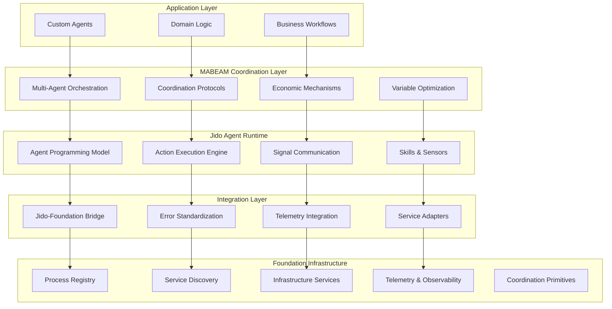

# Foundation Multi-Agent Framework: Complete Architecture & Implementation Guide
**Version 1.0 - Comprehensive Design for Premier Batteries-Included Agentic Framework**  
**Date: December 28, 2024**

## Executive Summary

This document defines the complete architecture and implementation plan for transforming the existing Foundation codebase into the premier batteries-included agentic framework for the BEAM ecosystem. The design achieves three critical goals:

1. **Distribution-Ready Architecture**: All data structures, function signatures, and mechanisms properly abstracted for seamless migration to multi-cluster deployment
2. **Concurrency-Optimized**: Handles the complexities of multi-agent systems on a single node with optimal performance
3. **Jido Integration**: Leverages Jido as the agent programming core while maintaining Foundation as the infrastructure kernel

**Key Innovation**: Clean separation between infrastructure (Foundation) and agent runtime (Jido) with a sophisticated integration layer that enables world-class multi-agent coordination.

## Architectural Principles

### 1. Distribution-First Design
All APIs and data structures designed for eventual cluster deployment:
- Process identification via `{namespace, node, id}` tuples
- Message routing abstraction (local/remote transparent)
- State distribution primitives ready for Horde integration
- Serializable data structures throughout

### 2. Concurrency Excellence
Optimized for multi-agent coordination patterns:
- Lock-free data structures where possible
- Intelligent back-pressure mechanisms
- Coordination primitives (barriers, consensus, auctions)
- Resource contention management

### 3. Jido as Agent Core
Foundation provides infrastructure, Jido provides agent abstraction:
- Foundation: Process registry, telemetry, infrastructure services
- Jido: Agent lifecycle, actions, signals, skills
- Integration layer: Bridges between Foundation services and Jido agents

## Target Architecture



## Detailed Implementation Plan

### Phase 1: Foundation Infrastructure Enhancement

#### 1.1 Process Registry Evolution
**Goal**: Transform process registry into distribution-ready agent registry

**Current Issues in Code**:
- `lib/foundation/process_registry.ex` - Basic process lookup only
- `lib/mabeam/process_registry.ex` - Duplicate implementation
- No agent-specific metadata support

**Enhancement Strategy**:
```elixir
# lib/foundation/process_registry.ex (enhanced)
defmodule Foundation.ProcessRegistry do
  @moduledoc """
  Distribution-ready process registry with agent-aware capabilities.
  """
  
  @type process_id :: {namespace :: atom(), node :: atom(), local_id :: term()}
  @type agent_metadata :: %{
    type: :agent | :service | :coordinator,
    capabilities: [atom()],
    resources: map(),
    coordination_variables: [atom()],
    health_status: :healthy | :degraded | :unhealthy,
    node_affinity: [atom()],
    created_at: DateTime.t()
  }
  
  # Distribution-ready APIs
  def register(process_id, pid, metadata \\ %{})
  def lookup(process_id)
  def lookup_local(local_id, namespace \\ :default)
  def find_by_capability(capability)
  def find_by_type(type)
  def list_all(namespace \\ :default)
  
  # Agent-specific functions
  def register_agent(agent_id, pid, agent_config)
  def update_agent_health(agent_id, health_status)
  def get_agent_metadata(agent_id)
  
  # Distribution support (Future: Horde integration)
  def cluster_lookup(process_id)
  def migrate_agent(agent_id, target_node)
end
```

#### 1.2 Infrastructure Services Enhancement
**Goal**: Add agent-aware circuit breakers, rate limiters, and coordination primitives

**Current Issues**:
- Basic circuit breaker without agent context
- No coordination primitives for multi-agent scenarios
- Missing distributed consensus mechanisms

**Enhancement Strategy**:
```elixir
# lib/foundation/infrastructure/agent_circuit_breaker.ex
defmodule Foundation.Infrastructure.AgentCircuitBreaker do
  @moduledoc """
  Agent-aware circuit breaker with coordination support.
  """
  
  def register_for_agent(agent_id, service_name, config)
  def execute_for_agent(agent_id, service_name, function)
  def get_agent_circuit_status(agent_id)
  def coordinate_circuit_state(agents, service_name)
end

# lib/foundation/coordination/primitives.ex (enhanced)
defmodule Foundation.Coordination.Primitives do
  @moduledoc """
  Distribution-ready coordination primitives for multi-agent systems.
  """
  
  # Consensus mechanisms
  def start_consensus(participants, proposal, timeout \\ 30_000)
  def vote(consensus_id, participant_id, vote)
  def get_consensus_result(consensus_id)
  
  # Barrier synchronization
  def create_barrier(barrier_id, participant_count)
  def arrive_at_barrier(barrier_id, participant_id)
  def wait_for_barrier(barrier_id, timeout \\ 60_000)
  
  # Distributed locks
  def acquire_lock(lock_id, holder_id, timeout \\ 30_000)
  def release_lock(lock_id, holder_id)
  def lock_status(lock_id)
  
  # Leader election
  def start_election(group_id, candidates)
  def elect_leader(group_id)
  def get_current_leader(group_id)
end
```

#### 1.3 Telemetry Enhancement
**Goal**: Cross-layer observability with agent-specific metrics

**Enhancement Strategy**:
```elixir
# lib/foundation/telemetry.ex (enhanced)
defmodule Foundation.Telemetry do
  @moduledoc """
  Enhanced telemetry with agent-aware capabilities and distribution support.
  """
  
  # Agent lifecycle events
  def track_agent_lifecycle(agent_id, event, metadata \\ %{})
  def track_agent_action(agent_id, action, duration, result)
  def track_agent_coordination(agent_id, coordination_type, participants)
  
  # Multi-agent metrics
  def track_coordination_efficiency(coordination_id, efficiency_score)
  def track_system_health(active_agents, coordination_load)
  def track_resource_utilization(agent_id, resources)
  
  # Distribution metrics (Future)
  def track_cross_node_communication(source_node, target_node, message_type)
  def track_cluster_health(node_status, partition_risk)
end
```

### Phase 2: Jido Integration Layer

#### 2.1 Core Integration Strategy
**Goal**: Clean bridge between Foundation infrastructure and Jido agent runtime

**Implementation**:
```elixir
# lib/jido_foundation/integration.ex
defmodule JidoFoundation.Integration do
  @moduledoc """
  Primary integration layer between Jido agent runtime and Foundation infrastructure.
  """
  
  def start_link(opts \\ []) do
    children = [
      {JidoFoundation.AgentBridge, []},
      {JidoFoundation.SignalBridge, []},
      {JidoFoundation.ErrorBridge, []},
      {JidoFoundation.TelemetryBridge, []}
    ]
    
    Supervisor.start_link(children, strategy: :one_for_one, name: __MODULE__)
  end
end

# lib/jido_foundation/agent_bridge.ex
defmodule JidoFoundation.AgentBridge do
  @moduledoc """
  Bridges Jido agents with Foundation process registry and services.
  """
  use GenServer
  
  def register_agent(agent_module, agent_id, opts) do
    # Register with Foundation process registry
    agent_metadata = %{
      type: :agent,
      capabilities: extract_capabilities(agent_module),
      coordination_variables: opts[:coordination_variables] || [],
      resources: opts[:resources] || %{},
      health_status: :healthy,
      node_affinity: [node()],
      created_at: DateTime.utc_now()
    }
    
    # Start Jido agent
    {:ok, pid} = Jido.Agent.start_link(agent_module, opts)
    
    # Register with Foundation
    process_id = {:default, node(), agent_id}
    Foundation.ProcessRegistry.register(process_id, pid, agent_metadata)
    
    # Setup infrastructure services
    setup_agent_infrastructure(agent_id, pid, opts)
    
    {:ok, pid}
  end
  
  defp setup_agent_infrastructure(agent_id, pid, opts) do
    # Setup circuit breakers for external services
    if external_services = opts[:external_services] do
      Enum.each(external_services, fn service ->
        Foundation.Infrastructure.AgentCircuitBreaker.register_for_agent(
          agent_id, service, opts[:circuit_breaker_config] || %{}
        )
      end)
    end
    
    # Setup rate limiting
    if rate_limits = opts[:rate_limits] do
      Foundation.Infrastructure.RateLimiter.setup_for_agent(agent_id, rate_limits)
    end
    
    # Setup health monitoring
    Foundation.ProcessRegistry.HealthMonitor.monitor_agent(agent_id, pid)
  end
end
```

#### 2.2 Signal Integration
**Goal**: Bridge Jido signals with Foundation events and telemetry

```elixir
# lib/jido_foundation/signal_bridge.ex
defmodule JidoFoundation.SignalBridge do
  @moduledoc """
  Bridges Jido signals with Foundation events and cross-agent communication.
  """
  use GenServer
  
  def start_link(_opts) do
    GenServer.start_link(__MODULE__, %{}, name: __MODULE__)
  end
  
  def init(_state) do
    # Subscribe to all Jido signals
    :ok = JidoSignal.subscribe(self(), :all)
    
    # Subscribe to Foundation events for agent coordination
    :ok = Foundation.Events.subscribe(self(), [:agent_coordination, :system_events])
    
    {:ok, %{signal_mappings: %{}, event_mappings: %{}}}
  end
  
  def handle_info({:jido_signal, signal}, state) do
    # Convert Jido signal to Foundation event
    foundation_event = %Foundation.Types.Event{
      type: "jido.#{signal.type}",
      source: signal.source,
      data: signal.data,
      timestamp: signal.timestamp,
      metadata: %{
        signal_id: signal.id,
        routing_key: signal.routing_key
      }
    }
    
    # Publish to Foundation event system
    Foundation.Events.publish(foundation_event)
    
    # Track in telemetry
    Foundation.Telemetry.track_agent_signal(signal.source, signal.type, signal.data)
    
    {:noreply, state}
  end
  
  def handle_info({:foundation_event, event}, state) do
    # Convert Foundation event to Jido signal for agent consumption
    if String.starts_with?(event.type, "coordination.") do
      jido_signal = %JidoSignal{
        id: JidoSignal.ID.generate(),
        type: event.type,
        source: event.source,
        data: event.data,
        timestamp: event.timestamp,
        routing_key: event.metadata[:routing_key] || "agent.coordination"
      }
      
      JidoSignal.publish(jido_signal)
    end
    
    {:noreply, state}
  end
end
```

### Phase 3: MABEAM Coordination Layer (Rebuilt on Jido)

#### 3.1 Multi-Agent Orchestration
**Goal**: Rebuild MABEAM coordination using Jido agent framework

**Current Issues**:
- `lib/mabeam/` contains mixed infrastructure and coordination logic
- Duplicate process registry implementation
- No clean separation between coordination and infrastructure

**New Architecture**:
```elixir
# lib/mabeam/orchestration/coordinator.ex
defmodule MABEAM.Orchestration.Coordinator do
  @moduledoc """
  Multi-agent coordination built on Jido agent framework.
  """
  use Jido.Agent
  
  def start_link(opts) do
    Jido.Agent.start_link(__MODULE__, opts)
  end
  
  def init(opts) do
    state = %{
      coordination_groups: %{},
      active_coordinations: %{},
      agent_capabilities: %{},
      performance_metrics: %{}
    }
    
    # Register with Foundation as coordination agent
    JidoFoundation.AgentBridge.register_agent(
      __MODULE__, 
      :mabeam_coordinator,
      %{
        capabilities: [:coordination, :orchestration, :consensus],
        coordination_variables: [:system_load, :agent_health],
        external_services: [:metric_collector]
      }
    )
    
    {:ok, state}
  end
  
  # Coordination actions implemented as Jido actions
  def coordinate_agents(agent_ids, coordination_type, params) do
    action = %Jido.Instruction{
      action: MABEAM.Actions.CoordinateAgents,
      params: %{
        agent_ids: agent_ids,
        coordination_type: coordination_type,
        coordination_params: params
      }
    }
    
    Jido.Agent.cmd(self(), action)
  end
end

# lib/mabeam/actions/coordinate_agents.ex
defmodule MABEAM.Actions.CoordinateAgents do
  @moduledoc """
  Multi-agent coordination action.
  """
  use Jido.Action
  
  def run(params, context) do
    coordination_id = generate_coordination_id()
    agent_ids = params.agent_ids
    coordination_type = params.coordination_type
    
    # Start coordination using Foundation primitives
    case coordination_type do
      :consensus ->
        run_consensus_coordination(coordination_id, agent_ids, params.coordination_params)
      
      :auction ->
        run_auction_coordination(coordination_id, agent_ids, params.coordination_params)
      
      :resource_allocation ->
        run_resource_allocation(coordination_id, agent_ids, params.coordination_params)
      
      _ ->
        {:error, :unknown_coordination_type}
    end
  end
  
  defp run_consensus_coordination(coordination_id, agent_ids, params) do
    # Use Foundation coordination primitives
    case Foundation.Coordination.Primitives.start_consensus(agent_ids, params.proposal) do
      {:ok, consensus_ref} ->
        # Track coordination in telemetry
        Foundation.Telemetry.track_agent_coordination(
          :mabeam_coordinator, 
          :consensus, 
          agent_ids
        )
        
        # Wait for consensus result
        result = Foundation.Coordination.Primitives.get_consensus_result(consensus_ref)
        
        # Emit coordination complete signal
        signal = %JidoSignal{
          id: JidoSignal.ID.generate(),
          type: "coordination.consensus.complete",
          source: :mabeam_coordinator,
          data: %{
            coordination_id: coordination_id,
            participants: agent_ids,
            result: result
          }
        }
        
        JidoSignal.publish(signal)
        
        {:ok, %{coordination_id: coordination_id, result: result}}
      
      {:error, reason} ->
        {:error, reason}
    end
  end
end
```

#### 3.2 Economic Mechanisms
**Goal**: Implement auction and market mechanisms as Jido agents and actions

```elixir
# lib/mabeam/economic/auctioneer.ex
defmodule MABEAM.Economic.Auctioneer do
  @moduledoc """
  Auction coordination agent built on Jido.
  """
  use Jido.Agent
  
  def start_link(opts) do
    Jido.Agent.start_link(__MODULE__, opts)
  end
  
  def run_auction(auction_spec) do
    action = %Jido.Instruction{
      action: MABEAM.Actions.RunAuction,
      params: auction_spec
    }
    
    Jido.Agent.cmd(:auctioneer, action)
  end
end

# lib/mabeam/actions/run_auction.ex
defmodule MABEAM.Actions.RunAuction do
  use Jido.Action
  
  def run(params, context) do
    auction_id = generate_auction_id()
    
    # Create auction using Foundation coordination
    participants = find_eligible_participants(params.resource_type, params.requirements)
    
    # Start auction process
    auction_result = conduct_auction(auction_id, participants, params)
    
    # Use Foundation circuit breaker for external notifications
    notify_result = Foundation.Infrastructure.AgentCircuitBreaker.execute_for_agent(
      :auctioneer,
      :notification_service,
      fn -> notify_auction_result(auction_result) end
    )
    
    {:ok, auction_result}
  end
  
  defp find_eligible_participants(resource_type, requirements) do
    # Use Foundation process registry to find agents
    Foundation.ProcessRegistry.find_by_capability(resource_type)
    |> Enum.filter(&meets_requirements?(&1, requirements))
  end
end
```

### Phase 4: Error Standardization

#### 4.1 Unified Error System
**Goal**: Single error type across Foundation, Jido, and MABEAM

```elixir
# lib/foundation/types/error.ex (enhanced)
defmodule Foundation.Types.Error do
  @moduledoc """
  Unified error type for entire multi-agent framework.
  """
  
  defstruct [
    :category,
    :code,
    :message,
    :context,
    :agent_id,
    :coordination_id,
    :severity,
    :retry_strategy,
    :timestamp
  ]
  
  @type category :: 
    :validation | :authentication | :authorization | :network | 
    :timeout | :not_found | :conflict | :internal | :external |
    :agent_communication | :coordination_failure | :resource_exhaustion
  
  @type t :: %__MODULE__{
    category: category(),
    code: atom(),
    message: String.t(),
    context: map(),
    agent_id: atom() | nil,
    coordination_id: String.t() | nil,
    severity: :low | :medium | :high | :critical,
    retry_strategy: :none | :immediate | :backoff | :exponential,
    timestamp: DateTime.t()
  }
  
  def new(category, code, message, opts \\ []) do
    %__MODULE__{
      category: category,
      code: code,
      message: message,
      context: Keyword.get(opts, :context, %{}),
      agent_id: Keyword.get(opts, :agent_id),
      coordination_id: Keyword.get(opts, :coordination_id),
      severity: Keyword.get(opts, :severity, :medium),
      retry_strategy: Keyword.get(opts, :retry_strategy, :none),
      timestamp: DateTime.utc_now()
    }
  end
  
  # Jido integration
  def from_jido_error(jido_error) do
    new(
      :agent_communication,
      jido_error.code,
      jido_error.message,
      context: jido_error.context,
      severity: map_jido_severity(jido_error.severity)
    )
  end
  
  def to_jido_error(foundation_error) do
    %Jido.Error{
      code: foundation_error.code,
      message: foundation_error.message,
      context: foundation_error.context
    }
  end
end

# lib/jido_foundation/error_bridge.ex
defmodule JidoFoundation.ErrorBridge do
  @moduledoc """
  Automatic error conversion between Jido and Foundation error formats.
  """
  
  def convert_jido_error(jido_error) do
    Foundation.Types.Error.from_jido_error(jido_error)
  end
  
  def convert_foundation_error(foundation_error) do
    Foundation.Types.Error.to_jido_error(foundation_error)
  end
  
  # Middleware for automatic error conversion
  def wrap_jido_action(action_module) do
    fn params, context ->
      try do
        action_module.run(params, context)
      rescue
        %Jido.Error{} = error ->
          {:error, convert_jido_error(error)}
      end
    end
  end
end
```

## Directory Structure

### Target Structure
```
lib/
├── foundation/                    # Pure BEAM infrastructure
│   ├── application.ex            # Foundation supervisor
│   ├── process_registry.ex       # Enhanced with agent awareness
│   ├── infrastructure/           # Circuit breakers, rate limiters
│   │   ├── agent_circuit_breaker.ex
│   │   ├── agent_rate_limiter.ex
│   │   └── resource_manager.ex
│   ├── coordination/             # Distribution-ready primitives
│   │   ├── primitives.ex         # Consensus, barriers, locks
│   │   ├── consensus.ex
│   │   ├── barrier.ex
│   │   └── leader_election.ex
│   ├── telemetry.ex             # Enhanced with agent metrics
│   ├── services/                # Foundation services
│   │   ├── health_monitor.ex
│   │   └── metric_collector.ex
│   └── types/
│       ├── error.ex             # Unified error system
│       └── agent_info.ex        # Agent metadata structures
│
├── jido_foundation/              # Integration layer
│   ├── application.ex           # Integration supervisor
│   ├── agent_bridge.ex          # Jido agent → Foundation services
│   ├── signal_bridge.ex         # Signal ↔ Event bridging
│   ├── error_bridge.ex          # Error format conversion
│   ├── telemetry_bridge.ex      # Telemetry integration
│   └── adapters/                # Service adapters
│       ├── process_registry_adapter.ex
│       ├── infrastructure_adapter.ex
│       └── coordination_adapter.ex
│
├── mabeam/                      # Multi-agent coordination (rebuilt)
│   ├── application.ex           # MABEAM supervisor
│   ├── orchestration/           # High-level coordination
│   │   ├── coordinator.ex       # Main coordination agent
│   │   ├── resource_allocator.ex
│   │   └── performance_optimizer.ex
│   ├── economic/                # Economic mechanisms
│   │   ├── auctioneer.ex        # Auction agent
│   │   ├── marketplace.ex       # Market agent
│   │   └── pricing_engine.ex
│   ├── actions/                 # Coordination actions
│   │   ├── coordinate_agents.ex
│   │   ├── run_auction.ex
│   │   ├── allocate_resources.ex
│   │   └── optimize_performance.ex
│   ├── agents/                  # MABEAM-specific agents
│   │   ├── load_balancer.ex
│   │   ├── health_monitor.ex
│   │   └── metric_aggregator.ex
│   └── types/                   # MABEAM data structures
│       ├── coordination_request.ex
│       ├── auction_spec.ex
│       └── resource_allocation.ex
│
└── foundation.ex                # Main module and API
```

## Migration Path from Current Code

### Step 1: Foundation Cleanup (Weeks 1-2)
1. **Remove MABEAM from Foundation**:
   - Move `lib/mabeam/` to temporary location
   - Remove all MABEAM-specific code from Foundation
   - Clean up process registry to be purely infrastructure

2. **Enhance Foundation Infrastructure**:
   - Enhance `process_registry.ex` with agent metadata support
   - Add coordination primitives to `coordination/primitives.ex`
   - Enhance telemetry for agent-specific metrics

### Step 2: Jido Integration (Weeks 3-4)
1. **Add Jido Dependencies**:
   - Add Jido, JidoAction, JidoSignal to mix.exs
   - Create `jido_foundation/` integration layer
   - Implement agent bridge and error standardization

2. **Build Integration Layer**:
   - Create signal/event bridging
   - Implement service adapters
   - Add telemetry integration

### Step 3: MABEAM Reconstruction (Weeks 5-7)
1. **Rebuild MABEAM on Jido**:
   - Reimplement coordination as Jido agents and actions
   - Build economic mechanisms using Jido framework
   - Create orchestration layer

2. **Integration Testing**:
   - Test Foundation ↔ Jido integration
   - Validate MABEAM coordination scenarios
   - Performance testing and optimization

### Step 4: Distribution Preparation (Week 8)
1. **Distribution Abstractions**:
   - Ensure all APIs support cluster deployment
   - Add Horde integration points
   - Test with simulated multi-node scenarios

## Key Benefits

### 1. Distribution-Ready
- All data structures serializable
- Process identification supports clustering
- Coordination primitives ready for Horde/libcluster

### 2. Concurrency-Optimized
- Lock-free designs where possible
- Intelligent back-pressure mechanisms
- Resource contention management

### 3. Agent-Centric Design
- Jido provides clean agent abstraction
- Foundation provides robust infrastructure
- MABEAM enables sophisticated coordination

### 4. Production-Ready
- Comprehensive error handling
- Full observability stack
- Battle-tested OTP patterns

## Success Metrics

### Technical Metrics
- **Performance**: Support 1000+ agents on single node
- **Reliability**: 99.9% uptime with automatic recovery
- **Observability**: Complete visibility into agent coordination
- **Distribution-Ready**: Zero code changes needed for clustering

### Integration Quality
- **Clean Boundaries**: No architectural violations
- **Error Consistency**: Single error system across all layers
- **API Consistency**: Uniform programming model
- **Test Coverage**: >95% across all integration points

This architecture creates the premier batteries-included agentic framework for BEAM, ready for single-node excellence and seamless clustering migration.
