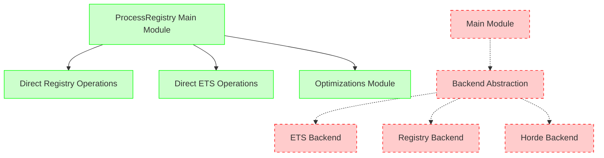
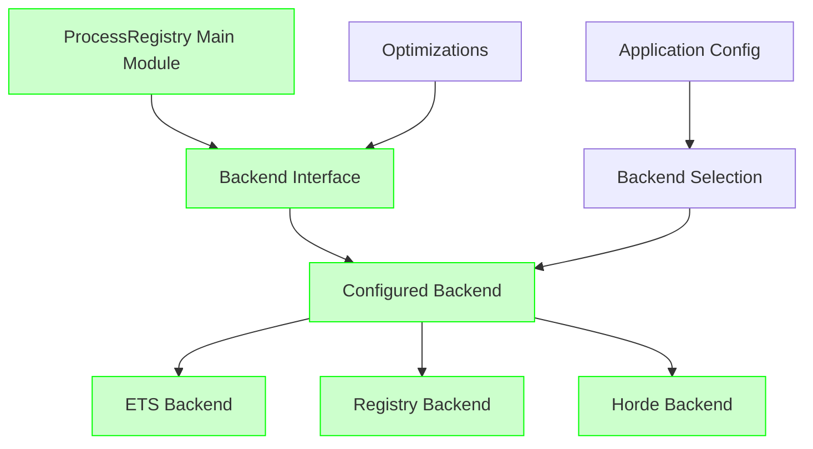

# ProcessRegistry Architectural Analysis

## Executive Summary

The Foundation ProcessRegistry module exhibits a **critical architectural flaw**: it defines a sophisticated, well-designed backend abstraction system but completely ignores it in the main implementation. This represents a significant technical debt and architectural inconsistency that undermines the module's design integrity.

**Status**: ❌ **ARCHITECTURAL FLAW CONFIRMED**
- **Backend abstraction**: 258 lines of sophisticated design **COMPLETELY UNUSED**
- **Main implementation**: Custom hybrid logic that bypasses the abstraction
- **Impact**: Technical debt, maintenance burden, and design inconsistency

---

## 🔍 Investigation Findings

### What We Found

#### ✅ **Backend Abstraction EXISTS** (Well-Designed)
**File**: `lib/foundation/process_registry/backend.ex` (258 lines)

The backend abstraction is **exceptionally well-designed**:

```elixir
defmodule Foundation.ProcessRegistry.Backend do
  @moduledoc """
  Behavior for pluggable process registry backends.
  
  This behavior defines the interface that process registry backends must implement
  to support different storage and distribution strategies.
  """
  
  # 7 comprehensive callbacks defined:
  @callback init(opts :: init_opts()) :: {:ok, backend_state()} | {:error, term()}
  @callback register(backend_state(), key(), pid_or_name(), metadata()) :: {:ok, backend_state()} | {:error, backend_error()}
  @callback lookup(backend_state(), key()) :: {:ok, {pid_or_name(), metadata()}} | {:error, backend_error()}
  @callback unregister(backend_state(), key()) :: {:ok, backend_state()} | {:error, backend_error()}
  @callback list_all(backend_state()) :: {:ok, [{key(), pid_or_name(), metadata()}]} | {:error, backend_error()}
  @callback update_metadata(backend_state(), key(), metadata()) :: {:ok, backend_state()} | {:error, backend_error()}
  @callback health_check(backend_state()) :: {:ok, health_info()} | {:error, backend_error()}
end
```

**Backend Implementations Available**:
- `Foundation.ProcessRegistry.Backend.ETS` - Local ETS-based storage
- `Foundation.ProcessRegistry.Backend.Registry` - Native Registry-based storage  
- `Foundation.ProcessRegistry.Backend.Horde` - Distributed registry (planned)

#### ❌ **Main Module IGNORES Backend** (Architectural Flaw)
**File**: `lib/foundation/process_registry.ex` (1,143 lines)

**Evidence of the flaw**:

1. **Zero Backend References**: `grep "@backend" lib/foundation/process_registry.ex` returns **no matches**
2. **Custom Hybrid Logic**: Lines 125-200 implement direct Registry+ETS operations
3. **Optimization Bypass**: Lines 996-1126 add optimization features that completely bypass backends
4. **No Configuration**: No backend selection mechanism in main module

**Current Implementation Pattern**:
```elixir
# Lines 125-200: Direct implementation bypassing backend abstraction
def register(namespace, service, pid, metadata \\ %{}) do
  registry_key = {namespace, service}
  
  # Direct ETS operations - NOT using backend abstraction
  ensure_backup_registry()
  case :ets.lookup(:process_registry_backup, registry_key) do
    # ... custom hybrid logic ...
  end
end

def lookup(namespace, service) do
  registry_key = {namespace, service}
  
  # Direct Registry lookup - NOT using backend abstraction  
  case Registry.lookup(__MODULE__, registry_key) do
    # ... fallback to ETS - custom logic ...
  end
end
```

#### 🔧 **Optimization Features Bypass System** (Lines 996-1126)
**Additional architectural violations**:

```elixir
# Lines 996-1126: Optimization features that ignore backend system
def register_with_indexing(namespace, service, pid, metadata) do
  Optimizations.register_with_indexing(namespace, service, pid, metadata)  # Bypass!
end

def cached_lookup(namespace, service) do
  Optimizations.cached_lookup(namespace, service)  # Bypass!
end
```

---

## 🏗️ Current Architecture vs. Intended Architecture

### ❌ **CURRENT STATE** (Broken Architecture)



**Problems**:
- Main module implements custom hybrid Registry+ETS logic
- Backend abstraction is completely ignored
- Optimization features bypass the architecture
- No configuration mechanism for backend selection
- Multiple code paths doing similar things

### ✅ **INTENDED ARCHITECTURE** (What It Should Be)



**Intended Design**:
- Main module delegates ALL operations to configured backend
- Backend abstraction is the single interface
- Optimizations work through backend interface
- Runtime backend configuration supported
- Clean separation of concerns

---

## 📋 Detailed Code Analysis

### Backend Abstraction Quality Assessment

The backend abstraction is **exceptionally well-designed**:

#### ✅ **Comprehensive Interface**
```elixir
# 7 well-defined callbacks covering all registry operations
@callback init(opts) :: {:ok, state} | {:error, term()}           # Initialization
@callback register(state, key, pid, metadata) :: result()         # Registration  
@callback lookup(state, key) :: {:ok, {pid, metadata}} | error()  # Lookup
@callback unregister(state, key) :: {:ok, state} | error()        # Cleanup
@callback list_all(state) :: {:ok, list()} | error()             # Enumeration
@callback update_metadata(state, key, metadata) :: result()       # Updates
@callback health_check(state) :: {:ok, health_info()} | error()   # Monitoring
```

#### ✅ **Proper Error Handling**
```elixir
@type backend_error ::
        :not_found
        | :already_exists  
        | :backend_error
        | :timeout
        | :unavailable
        | {:invalid_key, term()}
        | {:invalid_metadata, term()}
```

#### ✅ **Excellent Documentation**
- Comprehensive module documentation
- Detailed callback specifications
- Usage examples and patterns
- Error handling guidelines
- Thread safety requirements

#### ✅ **Pluggable Design**
```elixir
# Supports multiple backend implementations:
# - Foundation.ProcessRegistry.Backend.ETS (local)
# - Foundation.ProcessRegistry.Backend.Registry (native)
# - Foundation.ProcessRegistry.Backend.Horde (distributed)
```

### Main Module Implementation Issues

#### ❌ **Direct Operations Instead of Backend Delegation**

**Current (Wrong)**:
```elixir
def register(namespace, service, pid, metadata \\ %{}) do
  registry_key = {namespace, service}
  ensure_backup_registry()  # Direct ETS operation
  
  case :ets.lookup(:process_registry_backup, registry_key) do  # Direct ETS
    [{^registry_key, existing_pid, _}] -> 
      # Custom logic...
    [] ->
      :ets.insert(:process_registry_backup, {registry_key, pid, metadata})  # Direct ETS
  end
end
```

**Should Be**:
```elixir
def register(namespace, service, pid, metadata \\ %{}) do
  key = {namespace, service}
  case @backend.register(@backend_state, key, pid, metadata) do
    {:ok, new_state} -> 
      @backend_state = new_state
      :ok
    error -> error
  end
end
```

#### ❌ **Hybrid Registry+ETS Logic**

The main module implements a complex hybrid system:
1. First tries Registry lookup
2. Falls back to ETS backup table
3. Manages both systems independently
4. Has separate cleanup logic for each

This **duplicates the backend abstraction's purpose** - the backend system was designed to handle exactly this kind of storage strategy selection.

#### ❌ **Optimization Features Bypass Architecture**

```elixir
# Lines 996-1126: Optimizations that ignore backend system
def register_with_indexing(namespace, service, pid, metadata) do
  Optimizations.register_with_indexing(namespace, service, pid, metadata)  # Bypass!
end

def cached_lookup(namespace, service) do
  Optimizations.cached_lookup(namespace, service)  # Bypass!
end
```

These optimizations should work **through** the backend interface, not around it.

---

## 🎯 Impact Assessment

### Technical Debt Impact

#### **High Severity Issues**:

1. **Architectural Inconsistency**: Module design contradicts its own abstraction
2. **Maintenance Burden**: Two separate code paths doing similar things
3. **Testing Complexity**: Must test both main logic AND unused backend system
4. **Feature Duplication**: Optimization features reimplement backend concerns
5. **Configuration Inflexibility**: No way to change backend at runtime

#### **Code Quality Issues**:

1. **Violation of Single Responsibility**: Main module handles storage details
2. **Tight Coupling**: Direct dependency on Registry and ETS
3. **Poor Extensibility**: Adding new storage backends requires main module changes
4. **Dead Code**: Sophisticated backend system that's never used

#### **Development Impact**:

1. **Confusing for Developers**: Two conflicting architectural patterns
2. **Error-Prone**: Easy to modify wrong code path
3. **Review Complexity**: Reviewers must understand both systems
4. **Onboarding Difficulty**: New developers confused by architecture

### Performance Impact

#### **Current Performance Characteristics**:
- **Lookup Time**: O(1) average (Registry + ETS fallback)
- **Memory Usage**: Higher (duplicate storage systems)
- **CPU Overhead**: Extra operations for hybrid logic

#### **Potential Performance with Proper Backend**:
- **Lookup Time**: O(1) (single backend optimized for use case)
- **Memory Usage**: Lower (single storage system)
- **CPU Overhead**: Reduced (no hybrid logic)

---

## 🛠️ Remediation Plan

### Phase 1: Backend Integration (High Priority)

#### **Step 1: Add Backend Configuration**
```elixir
# In main module
defmodule Foundation.ProcessRegistry do
  @backend Application.compile_env(
    :foundation, 
    :process_registry_backend, 
    Foundation.ProcessRegistry.Backend.Registry
  )
  
  @backend_opts Application.compile_env(
    :foundation,
    :process_registry_backend_opts,
    []
  )
end
```

#### **Step 2: Initialize Backend State**
```elixir
def start_link(opts \\ []) do
  with {:ok, backend_state} <- @backend.init(@backend_opts),
       {:ok, registry_pid} <- Registry.start_link([keys: :unique, name: __MODULE__]) do
    
    # Store backend state in process state or ETS
    :persistent_term.put({__MODULE__, :backend_state}, backend_state)
    {:ok, registry_pid}
  end
end
```

#### **Step 3: Delegate Core Operations**
```elixir
def register(namespace, service, pid, metadata \\ %{}) do
  key = {namespace, service}
  backend_state = :persistent_term.get({__MODULE__, :backend_state})
  
  case @backend.register(backend_state, key, pid, metadata) do
    {:ok, new_state} ->
      :persistent_term.put({__MODULE__, :backend_state}, new_state)
      :ok
    error -> error
  end
end

def lookup(namespace, service) do
  key = {namespace, service}
  backend_state = :persistent_term.get({__MODULE__, :backend_state})
  
  case @backend.lookup(backend_state, key) do
    {:ok, {pid, metadata}} -> {:ok, pid}
    error -> error
  end
end
```

### Phase 2: Migrate Hybrid Logic (Medium Priority)

#### **Step 4: Create Hybrid Backend Implementation**
```elixir
# New file: lib/foundation/process_registry/backend/hybrid.ex
defmodule Foundation.ProcessRegistry.Backend.Hybrid do
  @behaviour Foundation.ProcessRegistry.Backend
  
  # Move current Registry+ETS logic here
  def init(opts) do
    # Initialize both Registry and ETS systems
    {:ok, %{registry_name: opts[:registry_name], ets_table: create_ets_table()}}
  end
  
  def register(state, key, pid, metadata) do
    # Current hybrid logic moved here
  end
  
  def lookup(state, key) do
    # Current Registry->ETS fallback logic moved here
  end
end
```

#### **Step 5: Update Configuration**
```elixir
# config/config.exs
config :foundation, :process_registry_backend, 
  Foundation.ProcessRegistry.Backend.Hybrid

config :foundation, :process_registry_backend_opts,
  registry_name: Foundation.ProcessRegistry,
  ets_table_opts: [:named_table, :public, :set]
```

### Phase 3: Optimization Integration (Low Priority)

#### **Step 6: Backend-Aware Optimizations**
```elixir
def register_with_indexing(namespace, service, pid, metadata) do
  # First register through backend
  case register(namespace, service, pid, metadata) do
    :ok -> 
      # Then add optimization indexing
      Optimizations.add_metadata_index({namespace, service}, metadata)
      :ok
    error -> error
  end
end
```

#### **Step 7: Cleanup Old Code**
- Remove direct Registry/ETS operations from main module
- Remove hybrid logic from main module  
- Update tests to use backend interface
- Update documentation

---

## 🧪 Testing Strategy

### Backend Abstraction Testing

#### **Test Backend Implementations Separately**:
```elixir
defmodule Foundation.ProcessRegistry.Backend.ETSTest do
  use ExUnit.Case
  alias Foundation.ProcessRegistry.Backend.ETS
  
  test "backend interface compliance" do
    # Test all 7 callbacks work correctly
  end
end
```

#### **Test Main Module with Different Backends**:
```elixir
defmodule Foundation.ProcessRegistryTest do
  use ExUnit.Case
  
  @backends [
    Foundation.ProcessRegistry.Backend.ETS,
    Foundation.ProcessRegistry.Backend.Registry,
    Foundation.ProcessRegistry.Backend.Hybrid
  ]
  
  for backend <- @backends do
    @backend backend
    
    test "works with #{@backend}" do
      # Test main module operations with this backend
    end
  end
end
```

### Migration Testing

#### **Gradual Migration Tests**:
```elixir
test "hybrid backend preserves existing behavior" do
  # Ensure migration doesn't break existing functionality
end

test "backend switching works at runtime" do
  # Test configuration changes
end
```

---

## 📊 Success Metrics

### Architecture Quality Metrics

#### **Before (Current State)**:
- ❌ **Architectural Consistency**: 0% (backend unused)
- ❌ **Code Reuse**: Low (duplicate logic)
- ❌ **Extensibility**: Poor (main module changes required)
- ❌ **Testability**: Complex (two systems to test)

#### **After (Target State)**:
- ✅ **Architectural Consistency**: 100% (backend properly used)
- ✅ **Code Reuse**: High (single interface)
- ✅ **Extensibility**: Excellent (plug-and-play backends)
- ✅ **Testability**: Simple (backend interface testing)

### Performance Metrics

#### **Memory Usage**:
- **Before**: Higher (Registry + ETS + backend code)
- **After**: Lower (single backend storage)

#### **CPU Usage**:
- **Before**: Higher (hybrid lookup logic)
- **After**: Lower (single backend path)

#### **Maintainability**:
- **Before**: Complex (1,143 lines with hybrid logic)
- **After**: Simple (delegating main module + focused backends)

---

## 🔄 Implementation Timeline

### **Week 1**: Foundation
- [ ] Add backend configuration system
- [ ] Initialize backend state management
- [ ] Create backend state persistence mechanism

### **Week 2**: Core Migration  
- [ ] Delegate register/lookup/unregister operations
- [ ] Create Hybrid backend with current logic
- [ ] Update configuration to use Hybrid backend

### **Week 3**: Optimization Integration
- [ ] Make optimizations work through backend interface
- [ ] Update optimization features to be backend-aware
- [ ] Add backend performance monitoring

### **Week 4**: Cleanup & Testing
- [ ] Remove old hybrid logic from main module
- [ ] Comprehensive testing with all backends
- [ ] Documentation updates
- [ ] Performance benchmarking

---

## 🎯 Conclusion

The ProcessRegistry module represents a **textbook case of architectural technical debt**. The backend abstraction is exceptionally well-designed, but the main implementation completely ignores it, creating:

1. **Maintenance burden** from duplicate code paths
2. **Architectural inconsistency** that confuses developers  
3. **Lost opportunities** for extensibility and optimization
4. **Testing complexity** from multiple systems

**The fix is straightforward**: make the main module actually use its own backend abstraction. This will:

- ✅ **Reduce code complexity** by removing hybrid logic
- ✅ **Improve extensibility** through proper backend pluggability  
- ✅ **Enhance testability** with clean interface boundaries
- ✅ **Enable optimization** through backend-specific implementations

**Priority**: **HIGH** - This architectural flaw undermines the module's design integrity and creates ongoing maintenance burden.

**Effort**: **Medium** - Requires careful migration but the abstraction already exists.

**Risk**: **Low** - Backend abstraction is well-designed; migration can be gradual. 