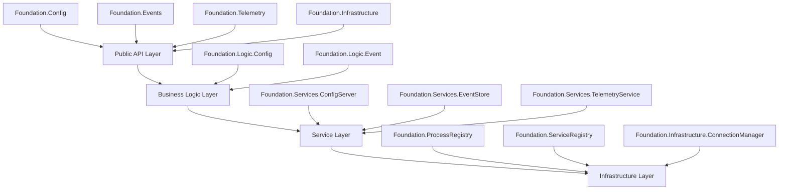
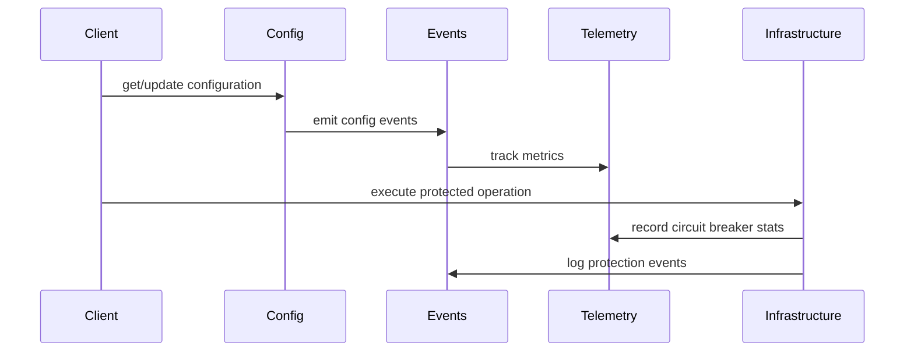
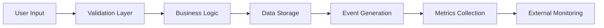

# Foundation Architecture

This document describes the architecture of the Foundation library.

## System Overview

The Foundation library follows a layered architecture with clear separation of concerns:

## Component Interactions

The following diagram shows how the main components interact:

## Data Flow

