# Architectural Diagrams

This document provides comprehensive architectural diagrams for the Foundation library, illustrating the system's layered architecture, supervision structure, data flows, and key operational patterns.

## Overview

The Foundation library follows a layered architecture pattern with clear separation of concerns:

- **Public API Layer:** Clean interfaces for configuration, events, telemetry, infrastructure, and service registry
- **Logic & Validation Layer:** Pure functions for business logic and data validation
- **Service Layer:** Stateful GenServers managing application state
- **Infrastructure Layer:** Wrappers around external libraries with unified interfaces

This architecture ensures maintainability, testability, and fault tolerance while providing a consistent developer experience.

## Architectural Diagrams

### 1. High-Level Architecture

This diagram illustrates the layered architecture of the Foundation library, showing the separation of concerns from the Public API down to the Infrastructure layer.

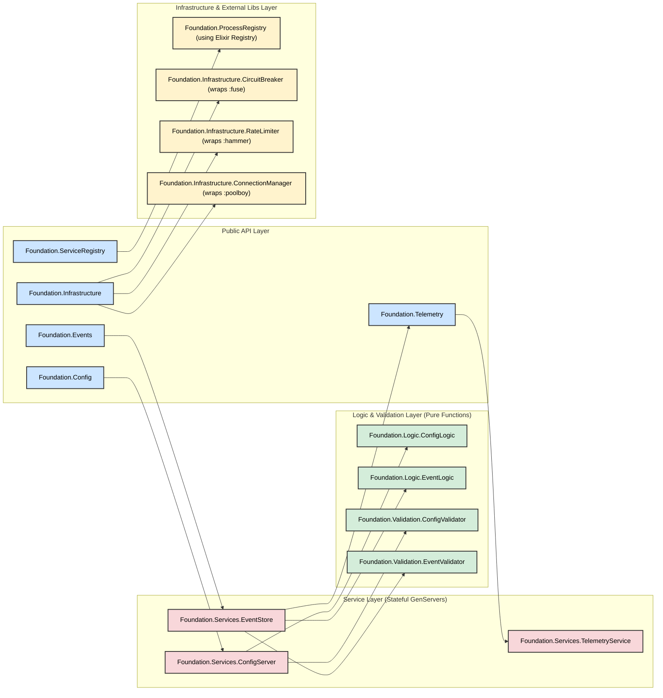

## Application Supervision Tree

This diagram shows the supervision structure defined in `Foundation.Application`, outlining which processes are started and managed for fault tolerance.

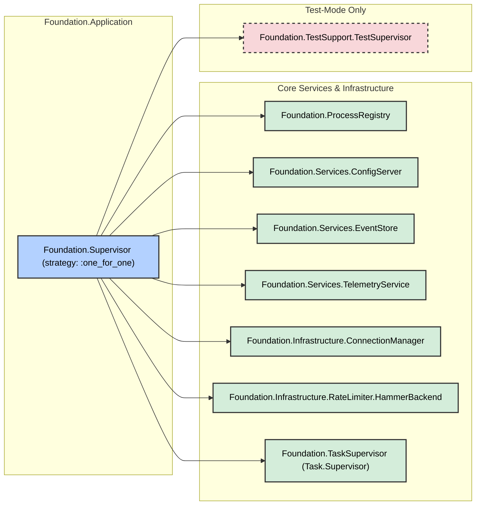

## Configuration Update Flow

This diagram details the sequence of interactions that occur when a configuration value is updated, showing how the change propagates through the logic, service, event, and telemetry layers.

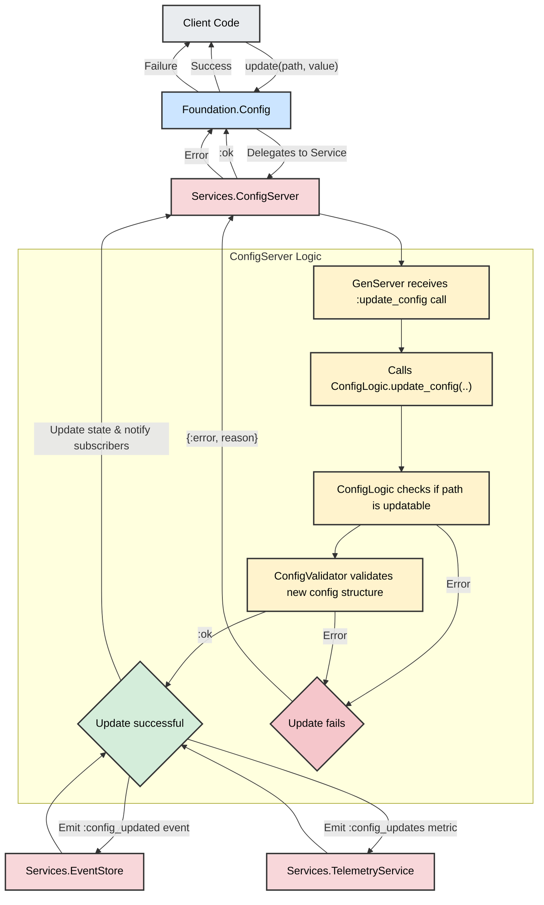

## Protected Operation Flow

This diagram illustrates the flow of a protected operation using `Foundation.Infrastructure.execute_protected`, showing how the different protection layers (Rate Limiter, Circuit Breaker, Connection Pool) are applied in sequence.

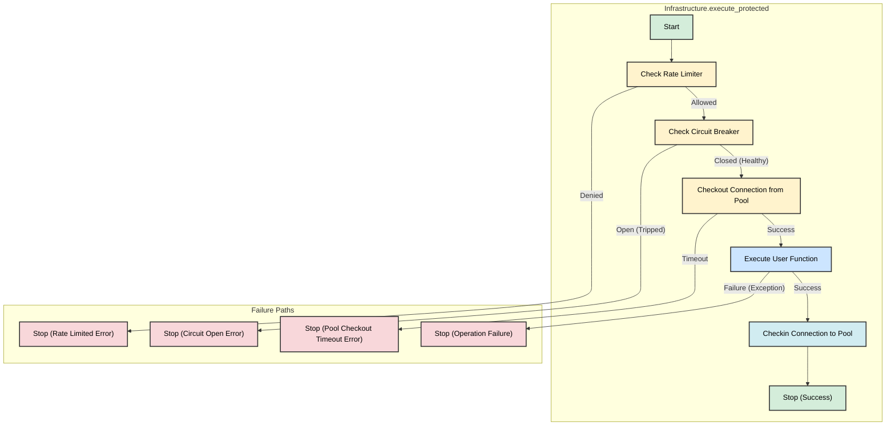

## Service Registration & Lookup Architecture

This diagram explains the dual-mechanism approach to service registration and lookup, involving both the native Elixir `Registry` for supervised processes and a backup ETS table for manual registrations.

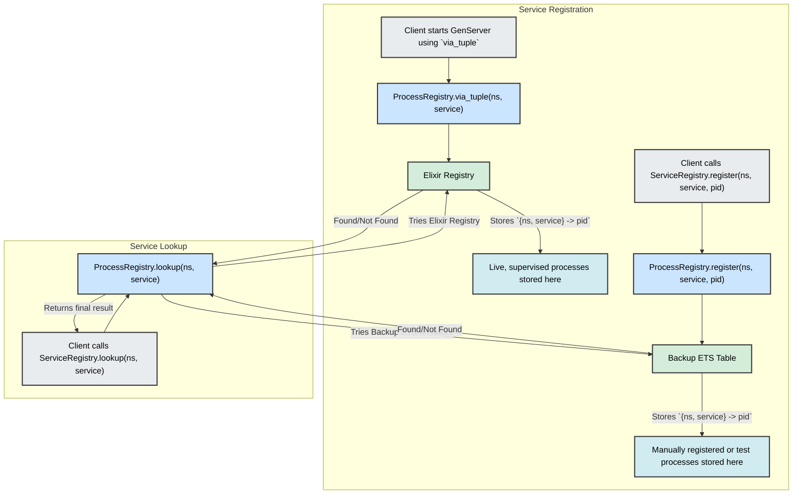

## Error Context & Handling Flow

This diagram shows how `ErrorContext` is used to wrap an operation, provide context, and enhance any resulting errors with rich, debuggable information.

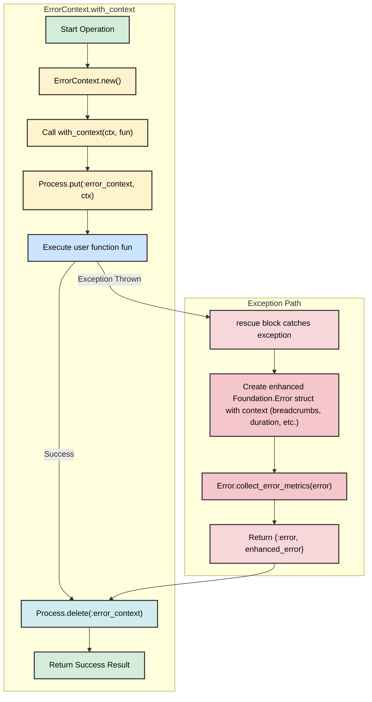

## Test Isolation Architecture

This diagram explains the architecture that enables concurrent testing by isolating services within unique, per-test namespaces.

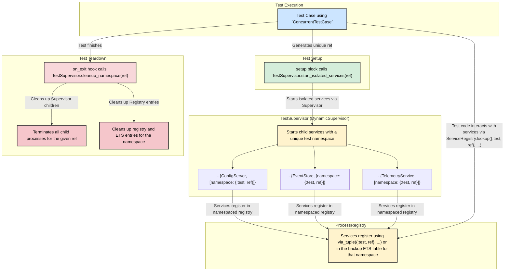

## Core Data Model

This class diagram illustrates the primary data structures (`Config`, `Event`, `Error`) and their key fields, providing a static view of the library's data schema.

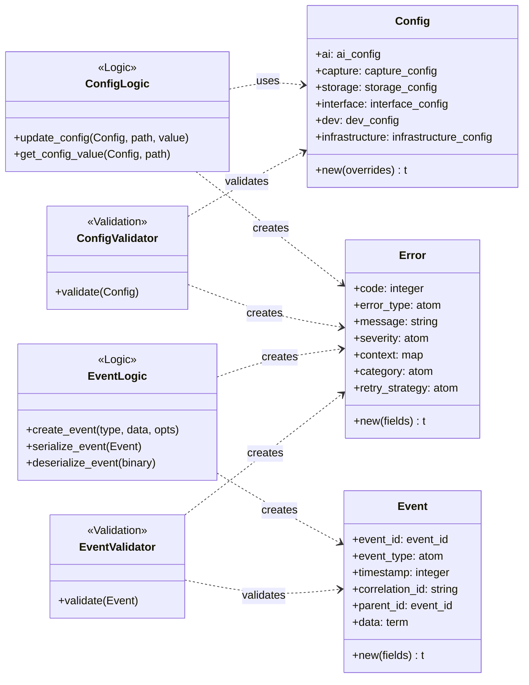

## Connection Pool Flow (`with_connection`)

This sequence diagram details the process of executing a function using a pooled connection from the `ConnectionManager`. It highlights the automatic checkout and check-in of worker processes.

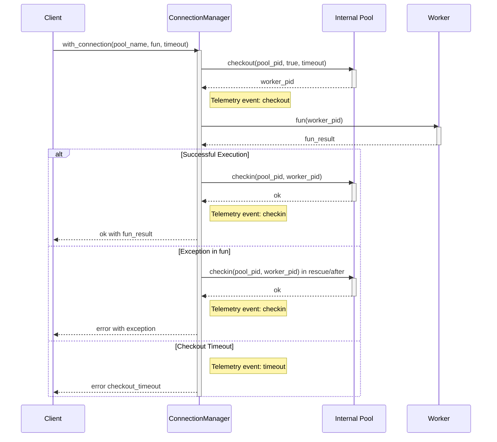

## Circuit Breaker State Machine

This state diagram visualizes the behavior of the `CircuitBreaker` wrapper around the `:fuse` library. It shows the transitions between the `Closed` (healthy), `Open` (tripped), and `HalfOpen` (recovering) states.

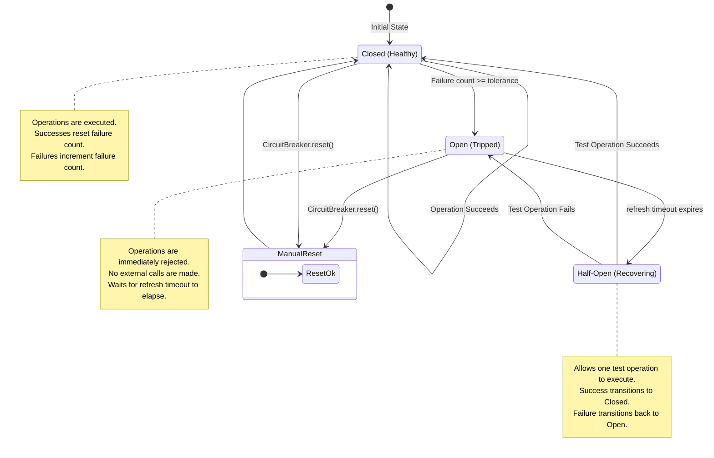

## Config Graceful Degradation Flow

This flowchart illustrates the logic within `Config.GracefulDegradation.get_with_fallback`, showing how it attempts to retrieve configuration from the primary service and falls back to a cache if the service is unavailable.

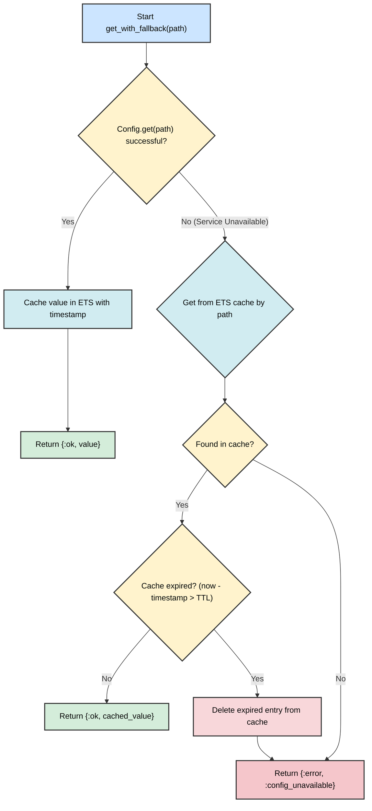

## Summary

These architectural diagrams illustrate the Foundation library's comprehensive design principles:

- **Layered Architecture:** Clear separation between API, logic, services, and infrastructure layers
- **Fault Tolerance:** Supervision trees and circuit breakers ensure system resilience
- **Observability:** Telemetry and event tracking provide visibility into system behavior
- **Testability:** Test isolation architecture enables reliable testing
- **Graceful Degradation:** Systems continue operating with reduced functionality when dependencies fail

The Foundation library provides a robust, observable, and maintainable foundation for Elixir applications, with clear architectural patterns that promote best practices in distributed system design.

