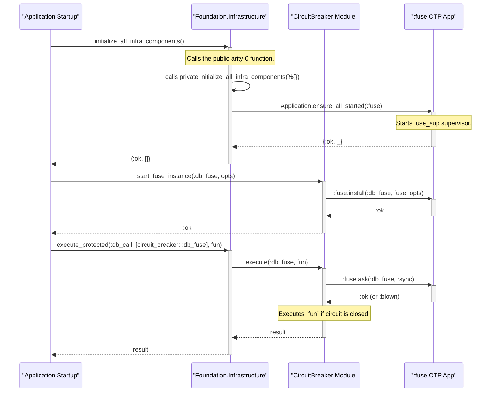

# Infrastructure - `:fuse` Integration

This document provides a detailed breakdown of how the `foundation` library integrates the `:fuse` circuit breaker library. It explains the design choices, the abstraction layers, and how developers can use the feature effectively.

## Overview

The standard `:fuse` integration pattern involves two main steps:
1.  Starting the `:fuse` OTP application.
2.  Installing one or more "fuse descriptions" that define the circuit breaker's behavior.

The `foundation` library adheres to this pattern but provides a robust abstraction layer through its `Infrastructure` and `CircuitBreaker` modules. This abstraction offers several advantages:

-   **Centralized Control:** Simplifies management of multiple circuit breakers.
-   **Dynamic Installation:** Allows fuses to be installed at any point in the application lifecycle, not just on startup.
-   **Standardized Errors:** Converts `:fuse`'s responses and errors into the `Foundation.Error` struct for consistent error handling.
-   **Observability:** Automatically emits telemetry events for circuit breaker state changes and operations.

## The Integration in Detail

### 1. Starting the `:fuse` Application Supervisor

The `:fuse` documentation recommends starting its application supervisor via a release script or by adding `:fuse` to `extra_applications` in `mix.exs`.

The `foundation` library uses a more on-demand approach to ensure the `:fuse` application is running precisely when needed. This is handled within the unified `Infrastructure` facade.

**File:** `foundation/infrastructure/infrastructure.ex`

Instead of being a dependency in the application supervisor tree, `:fuse` is started by this function:

```elixir
# The public API function to initialize all infrastructure components.
def initialize_all_infra_components() do
  # This calls the private implementation...
end

# The private implementation where :fuse is started.
defp initialize_all_infra_components(config) do
  # ...
  # Ensure Fuse application is started
  case Application.ensure_all_started(:fuse) do
    {:ok, _apps} ->
      :ok
    {:error, reason} ->
      raise "Failed to start Fuse application: #{inspect(reason)}"
  end
  # ...
end
```

**Key Points:**

-   The public API to start the infrastructure is `Foundation.Infrastructure.initialize_all_infra_components/0`.
-   This function calls the internal logic that uses **`Application.ensure_all_started(:fuse)`**.
-   This call is idempotent and safe to make multiple times. It guarantees that the `:fuse` application and its top-level supervisor (`fuse_sup`) are running before any fuses are installed.

### 2. Installing a Fuse Description

Directly calling `fuse:install/2` is abstracted away by the `CircuitBreaker` module. This provides a cleaner, more descriptive API and allows `foundation` to add its own logic (like telemetry) around the installation process.

**File:** `foundation/infrastructure/circuit_breaker.ex`

The `start_fuse_instance/2` function is the `foundation` equivalent of `fuse:install/2`.

```elixir
# The public API for installing a fuse.
@spec start_fuse_instance(fuse_name(), fuse_options()) :: :ok | {:error, Error.t()}
def start_fuse_instance(name, options \\ []) do
  # ... (logic to build fuse_options tuple)

  # The core call to the :fuse library.
  case :fuse.install(name, fuse_options) do
    :ok ->
      emit_telemetry(:fuse_installed, %{name: name, options: fuse_options})
      :ok
    # ... (error and exception handling)
  end
end
```

**Key Points:**

-   The function constructs the `fuse_options` tuple exactly as required by `:fuse`, making it a transparent wrapper.
-   It provides a simpler keyword-list based configuration (`tolerance: 5, refresh: 30_000`) instead of requiring the user to build the nested tuples manually.
-   It handles the `:already_installed` error gracefully, which is a common occurrence in supervised applications.

## End-to-End Workflow

Here is the complete sequence of events for using a circuit breaker through the `foundation` library:



1.  **Application Startup:** The application initializes the foundation infrastructure via `Foundation.Infrastructure.initialize_all_infra_components/0`.
2.  **`:fuse` Startup:** The infrastructure module ensures the `:fuse` OTP application is running.
3.  **Fuse Installation:** The application installs a specific, named circuit breaker for a service (e.g., a database) by calling `CircuitBreaker.start_fuse_instance/2`.
4.  **Protected Execution:** The application wraps external calls using `Infrastructure.execute_protected/3`, which in turn calls `CircuitBreaker.execute/3`. This module handles the interaction with the `:fuse` library, translating its responses into `foundation`'s standard format.

## Comparison Summary

This table summarizes how `foundation` implements the standard `:fuse` patterns.

| `:fuse` Documentation Pattern | `foundation` Library Implementation |
| :------------------------------ | :---------------------------------- |
| Start `:fuse` in release script or `extra_applications`. | The `:fuse` application is started on-demand via **`Application.ensure_all_started(:fuse)`** inside `Infrastructure.initialize_all_infra_components/0`. |
| Call `fuse:install/2` in `application:start/1` callback. | The `fuse:install/2` call is wrapped inside **`CircuitBreaker.start_fuse_instance/2`**. This allows for dynamic installation of fuses. |
| Direct calls to `:fuse` module (e.g., `fuse:ask/2`). | Calls are abstracted through the `CircuitBreaker` wrapper module, which provides telemetry and standardized error handling. |

By using these abstractions, `foundation` provides a more integrated, observable, and developer-friendly way to leverage the power of `:fuse`'s circuit breaker capabilities.