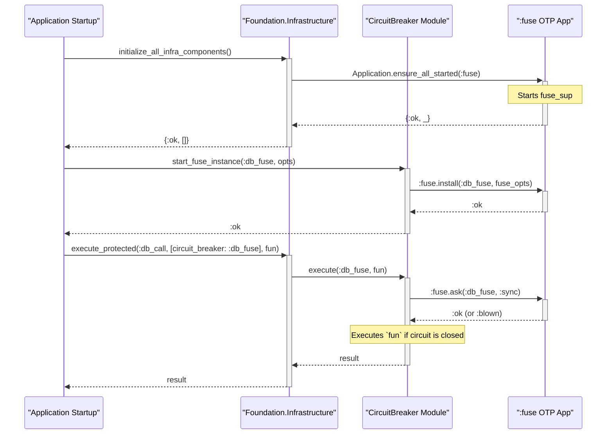

Of course. The code snippet you provided describes the standard pattern for integrating the `:fuse` library into an Elixir application. The `foundation` codebase implements this pattern, but with a layer of abstraction for better integration, testability, and centralized control.

Here is a detailed breakdown of where and how this is accomplished in the codebase.

### 1. The Core Implementation: `fuse:install/2`

The direct equivalent of `fuse:install(Name, Opts)` from the documentation is located in the **`CircuitBreaker`** wrapper module. This is the central point where a named fuse is installed into the system.

**File:** `foundation/infrastructure/circuit_breaker.ex`
**Function:** `start_fuse_instance/2`

```elixir
# foundation/infrastructure/circuit_breaker.ex

  @spec start_fuse_instance(fuse_name(), fuse_options()) :: :ok | {:error, Error.t()}
  def start_fuse_instance(name, options \\ []) when is_atom(name) do
    default_options = {{:standard, 5, 60_000}, {:reset, 60_000}}

    fuse_options =
      case options do
        [] ->
          default_options

        [strategy: :standard, tolerance: tolerance, refresh: refresh] ->
          {{:standard, tolerance, refresh}, {:reset, refresh}}

        _ ->
          default_options
      end

    try do
      # --- THIS IS THE KEY LINE ---
      case :fuse.install(name, fuse_options) do
        :ok ->
          emit_telemetry(:fuse_installed, %{name: name, options: fuse_options})
          :ok
        # ... (error handling)
      end
    # ... (exception handling)
    end
  end
```

**Analysis:**

*   The function `CircuitBreaker.start_fuse_instance/2` is the `foundation` library's public API for installing a new fuse.
*   It takes a `name` and `options`, constructs the `fuse_options` tuple exactly as described in the `:fuse` documentation (`{{strategy, ...}, {reset, ...}}`).
*   The line **`:fuse.install(name, fuse_options)`** is the direct call that installs the fuse description, making it available for use.
*   Instead of being hardcoded in an `application:start/1` callback, this approach allows fuses to be installed dynamically anywhere in the application lifecycle.

---

### 2. Starting the `:fuse` Application Supervisor

The documentation snippet suggests starting the `:fuse` application in a release script or `extra_applications`. The `foundation` library takes a slightly different but equally valid approach: it ensures the `:fuse` application is started on-demand when the infrastructure is initialized.

This is done in the unified **`Infrastructure`** facade.

**File:** `foundation/infrastructure/infrastructure.ex`
**Function:** `initialize_all_infra_components/1`

```elixir
# foundation/infrastructure/infrastructure.ex

  defp initialize_all_infra_components(config) do
    try do
      # ... (Hammer configuration) ...

      # --- THIS IS THE KEY LINE ---
      # Ensure Fuse application is started
      case Application.ensure_all_started(:fuse) do
        {:ok, _apps} ->
          :ok

        {:error, reason} ->
          raise "Failed to start Fuse application: #{inspect(reason)}"
      end

      emit_telemetry(
        :infrastructure_initialized,
        %{
          config: config,
          components: [:fuse, :hammer]
        },
        %{}
      )

      {:ok, []}
    rescue
      exception ->
        {:error, {:infrastructure_init_failed, exception}}
    end
  end
```

**Analysis:**

*   The `Foundation.Application` supervisor does **not** list `:fuse` in its children or in `extra_applications`.
*   Instead, the `Foundation.Infrastructure.initialize_all_infra_components/1` function is responsible for starting it.
*   The line **`Application.ensure_all_started(:fuse)`** guarantees that the `:fuse` OTP application (including its top-level supervisor `fuse_sup`) is running before any attempts are made to install or use fuses. This is a robust way to manage the dependency.

---

### 3. The Complete Flow in the `foundation` Library

Combining these pieces, the intended workflow for a developer using the `foundation` library is as follows:

1.  **Application Startup**: The application's supervisor starts `Foundation.Application`, which in turn starts `Foundation.Infrastructure.ConnectionManager` and other core components.
2.  **Infrastructure Initialization**: At some point during startup, the client application calls `Foundation.Infrastructure.initialize_all_infra_components()`. This call ensures the `:fuse` application supervisor is running.
3.  **Dynamic Fuse Installation**: The client application then calls `Foundation.Infrastructure.CircuitBreaker.start_fuse_instance(:my_database_fuse, ...)` to install a specific, named circuit breaker.
4.  **Protected Execution**: The application wraps calls to the database (or other external service) using the `Foundation.Infrastructure.execute_protected/3` facade, referencing the installed fuse by name.



### Summary: Comparison with `:fuse` Documentation

| `:fuse` Documentation Pattern | `foundation` Library Implementation |
| :--- | :--- |
| Start `:fuse` in release script or `extra_applications`. | The `:fuse` application is started on-demand via **`Application.ensure_all_started(:fuse)`** inside `Infrastructure.initialize_all_infra_components`. |
| Call `fuse:install/2` in `application:start/1` callback. | The `fuse:install/2` call is wrapped inside **`CircuitBreaker.start_fuse_instance/2`**. This allows for dynamic installation of fuses. |
| Direct calls to `:fuse` module (e.g., `fuse:ask/2`). | Calls are abstracted through the `CircuitBreaker` wrapper module, which provides telemetry and standardized error handling. |

In conclusion, the `foundation` codebase adheres to the core principles of the `:fuse` library's integration pattern but abstracts it behind its own service and infrastructure layers for better organization, dynamic control, and observability.