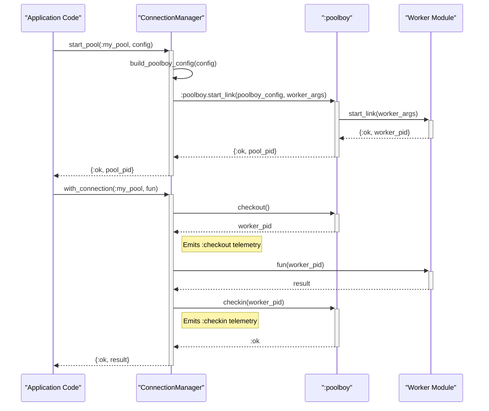

# Infrastructure - Poolboy Integration

This document provides a detailed breakdown of how the `foundation` library integrates `poolboy` for connection pooling, contrasting the direct `poolboy` pattern with the abstractions provided by the `ConnectionManager`.

## Overview

The standard `poolboy` integration pattern involves directly calling `:poolboy.start_link/2` with a specific configuration keyword list. The `foundation` library abstracts this process within the **`ConnectionManager`** module to provide validation, logging, and a more user-friendly configuration format.

The `foundation` library adheres to this pattern but provides a robust abstraction layer through its `Infrastructure` and `ConnectionManager` modules. This abstraction offers several advantages:

- **Centralized Control:** Simplifies management of multiple connection pools.
- **Configuration Translation:** Converts simple config formats into the specific keyword lists that `:poolboy.start_link` expects.
- **Safety:** Wraps the checkout/checkin lifecycle in safe functions that prevent resource leakage.
- **Observability:** Automatically emits telemetry events for pool operations and performance metrics.

## The Integration in Detail

### 1. Starting a Pool: `poolboy:start_link`

The standard `poolboy` pattern involves directly calling `:poolboy.start_link/2` with a specific configuration keyword list. The `foundation` library abstracts this process within the **`ConnectionManager`** module to provide validation, logging, and a more user-friendly configuration format.

**File:** `foundation/infrastructure/connection_manager.ex`
**Functions:** `start_pool/2`, `do_start_pool/2`, `build_poolboy_config/2`

```elixir
# foundation/infrastructure/connection_manager.ex

# --- The Public API ---
@spec start_pool(pool_name(), pool_config()) :: {:ok, pid()} | {:error, term()}
def start_pool(pool_name, config) do
  GenServer.call(__MODULE__, {:start_pool, pool_name, config})
end

# --- The Private Implementation ---
@spec do_start_pool(pool_name(), pool_config()) :: {:ok, pid()} | {:error, term()}
defp do_start_pool(pool_name, config) do
  # ... (validation logic) ...
  {poolboy_config, worker_args} = build_poolboy_config(pool_name, config)

  # --- THIS IS THE KEY LINE ---
  case :poolboy.start_link(poolboy_config, worker_args) do
    {:ok, pid} -> {:ok, pid}
    {:error, reason} -> {:error, reason}
  end
  # ...
end

# --- Configuration Translation ---
@spec build_poolboy_config(pool_name(), pool_config()) :: {keyword(), keyword()}
defp build_poolboy_config(pool_name, config) do
  merged_config = Keyword.merge(@default_config, config)

  poolboy_config = [
    name: {:local, pool_name}, # `poolboy` requires the {:local, name} format
    worker_module: Keyword.fetch!(merged_config, :worker_module),
    size: Keyword.get(merged_config, :size),
    max_overflow: Keyword.get(merged_config, :max_overflow),
    strategy: Keyword.get(merged_config, :strategy)
  ]

  worker_args = Keyword.get(merged_config, :worker_args, [])

  {poolboy_config, worker_args}
end
```

**Analysis:**

*   **Abstraction:** Instead of calling `:poolboy.start_link` directly, users call the much cleaner `ConnectionManager.start_pool(:my_pool, [...])`.
*   **Configuration:** The `build_poolboy_config` function acts as a translator. It takes `foundation`'s simple config format and transforms it into the specific keyword list that `:poolboy.start_link` expects, including enforcing the `name: {:local, pool_name}` convention.
*   **Validation:** Before starting the pool, `ConnectionManager` validates the configuration (`validate_pool_config`) and ensures the worker module exists and is compiled (`validate_worker_module`), providing better error messages than `poolboy` might alone.
*   **Centralization:** All pools are managed by the `ConnectionManager` GenServer, which keeps track of their state and configuration in a centralized location.

---

### 2. The Worker Module Concept

`Poolboy` requires a "worker" module—a `GenServer` that implements a `start_link/1` function. The `foundation` library fully adheres to this pattern and provides a sample implementation with `HttpWorker`.

**File:** `foundation/infrastructure/pool_workers/http_worker.ex`
**Function:** `start_link/1`

```elixir
# foundation/infrastructure/pool_workers/http_worker.ex

  @doc """
  Starts an HTTP worker with the given configuration.

  This function is called by Poolboy to create worker instances.
  """
  @spec start_link(worker_config()) :: GenServer.on_start()
  def start_link(config) do
    GenServer.start_link(__MODULE__, config)
  end

  # ... (GenServer implementation for the worker)
```

**Analysis:**

*   The `HttpWorker.start_link/1` function is the entry point that `poolboy` will call whenever it needs to create a new worker for the pool.
*   The `worker_args` from the `ConnectionManager.start_pool` configuration are passed directly as the `config` argument to this `start_link` function. This is how you provide initial state (like a base URL or API keys) to each worker.
*   This demonstrates that `foundation`'s abstraction does not change the fundamental contract required of a `poolboy` worker.

---

### 3. Using a Pooled Resource: `checkout` and `checkin`

The most significant abstraction `ConnectionManager` provides is wrapping the `checkout`/`checkin` lifecycle. The standard `poolboy` pattern requires developers to manually:
1.  `:poolboy.checkout(...)` to get a worker.
2.  Use the worker inside a `try/after` block.
3.  `:poolboy.checkin(...)` in the `after` clause to guarantee the worker is returned to the pool, even if the main operation fails.

`ConnectionManager` encapsulates this entire error-prone process in a single, safe function.

**File:** `foundation/infrastructure/connection_manager.ex`
**Functions:** `with_connection/3`, `do_with_connection/4`

```elixir
# foundation/infrastructure/connection_manager.ex

# --- The Public API ---
@spec with_connection(pool_name(), (pid() -> term()), timeout()) ::
        {:ok, term()} | {:error, term()}
def with_connection(pool_name, fun, timeout \\ @default_checkout_timeout) do
  # ... (timeout logic) ...
  GenServer.call(__MODULE__, {:with_connection, pool_name, fun, timeout}, genserver_timeout)
end

# --- The Private Implementation ---
@spec do_with_connection(pool_name(), pid(), (pid() -> term()), timeout()) ::
        {:ok, term()} | {:error, term()}
defp do_with_connection(pool_name, pool_pid, fun, timeout) do
  start_time = System.monotonic_time()

  try do
    # --- CHECKOUT ---
    worker = :poolboy.checkout(pool_pid, true, timeout)

    emit_telemetry(
      :checkout,
      %{ checkout_time: System.monotonic_time() - start_time },
      %{pool_name: pool_name}
    )

    try do
      # --- EXECUTE USER'S FUNCTION ---
      result = fun.(worker)
      {:ok, result}
    # ... (error handling) ...
    after
      # --- CHECKIN (GUARANTEED) ---
      :poolboy.checkin(pool_pid, worker)
      emit_telemetry(:checkin, %{}, %{pool_name: pool_name})
    end
  catch
    # ... (timeout and other exit handling) ...
  end
end
```

**Analysis:**

*   **Abstraction:** The developer calls `ConnectionManager.with_connection/2` and simply provides a function that receives the checked-out `worker` as an argument. They never see or call `:poolboy.checkout` or `:poolboy.checkin`.
*   **Safety:** The `try/after` block inside `do_with_connection` is the crucial safety mechanism. It guarantees that `:poolboy.checkin` is *always* called for the worker, preventing pool resource leakage even if the user's function (`fun.()`) crashes.
*   **Observability:** The wrapper emits `:checkout` and `:checkin` telemetry events, providing valuable insight into pool usage, checkout times, and potential bottlenecks, which would have to be implemented manually otherwise.
*   **Error Handling:** The `catch` block provides standardized error handling for common `poolboy` exit reasons, like `:timeout`, translating them into clean `{:error, reason}` tuples.

---

## End-to-End Workflow

This diagram visualizes the end-to-end flow, from starting a pool to using it via the `ConnectionManager`.



---

## Comparison Summary

This table summarizes how `foundation` implements the standard `poolboy` patterns.

| `poolboy` Documentation Pattern | `foundation` Library Implementation |
| :--- | :--- |
| Call `:poolboy.start_link` with specific config. | Call **`ConnectionManager.start_pool`**. It handles config translation, validation, and logging. |
| Implement a `worker_module` with `start_link/1`. | This is the same. The contract for the worker is unchanged. `HttpWorker` is provided as an example. |
| Manually wrap work in `try...after` with `:poolboy.checkout` and `:poolboy.checkin`. | Call **`ConnectionManager.with_connection`** and provide a function. The wrapper handles the entire `checkout`/`checkin` lifecycle and associated error handling. |
| Implement telemetry and logging for pool events manually. | Telemetry for checkouts, check-ins, and timeouts is **built into** the `ConnectionManager` wrapper. |
| Manage multiple pools manually. | `ConnectionManager` is a **centralized GenServer** that manages the state and configuration of all active pools. |

By using these abstractions, `foundation` provides a more integrated, observable, and developer-friendly way to leverage the power of `poolboy`'s connection pooling capabilities.