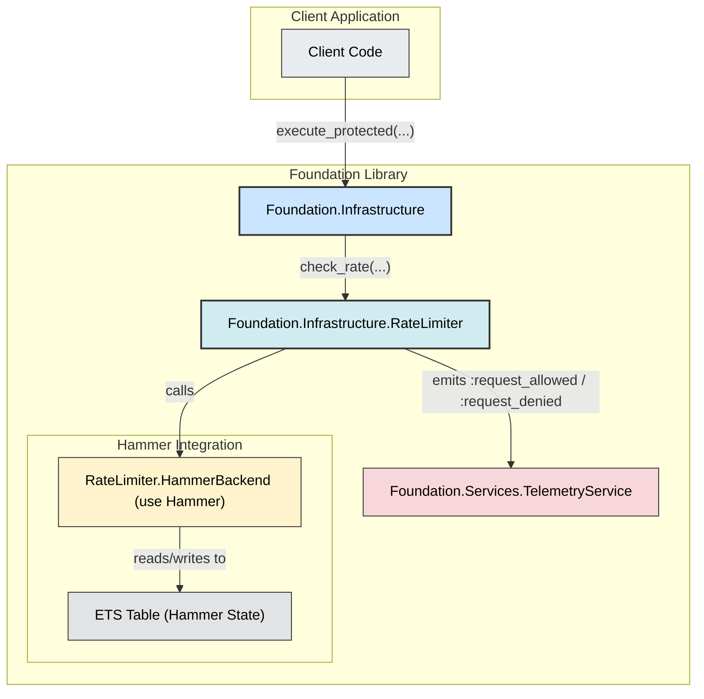
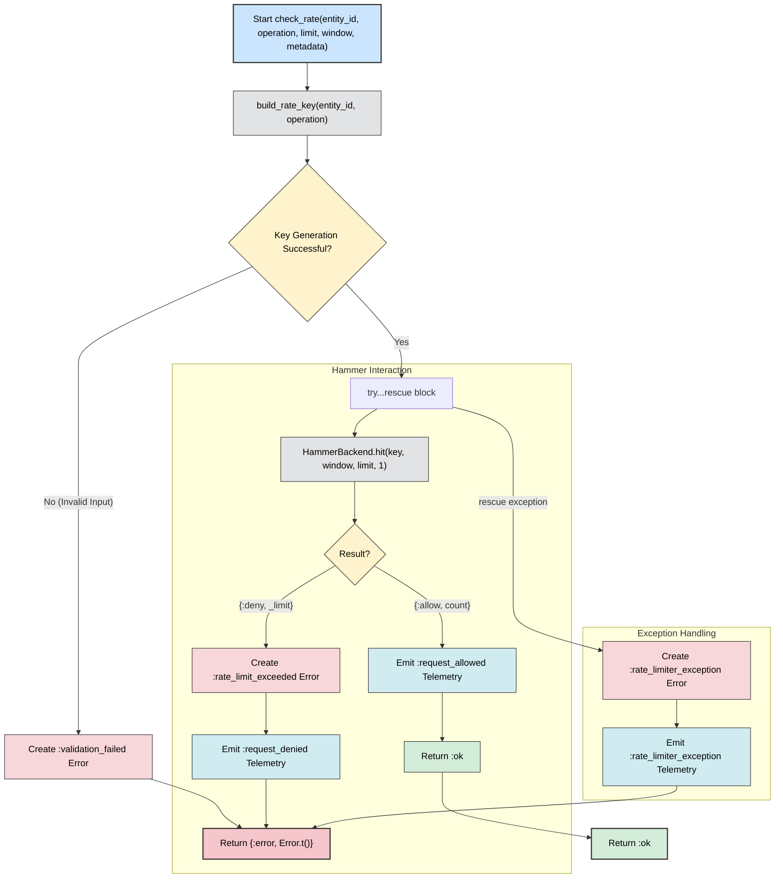
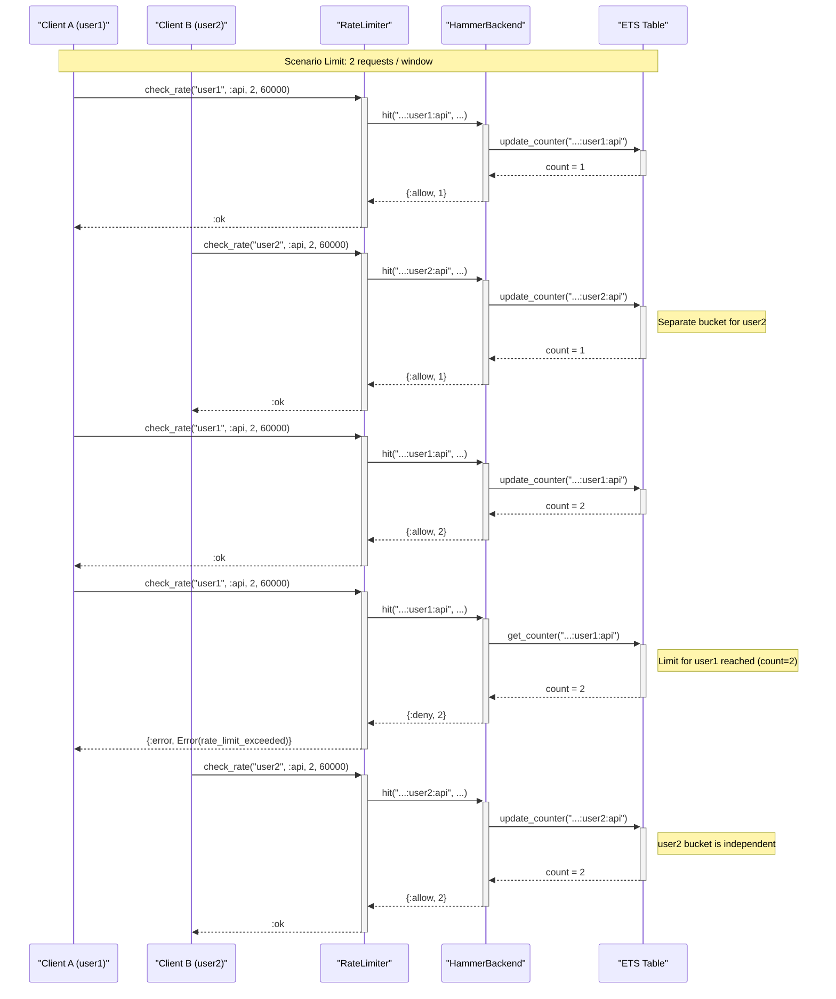

# Infrastructure - Rate Limiter

### 1. Rate Limiter Architectural Context

This diagram shows how the `RateLimiter` module fits within the overall Foundation architecture. It illustrates its role as a wrapper around the `Hammer` library and its interactions with the `Infrastructure` facade, the `HammerBackend` (which uses ETS), and the `TelemetryService`.

### 2. Logical Flow of `check_rate`

This flowchart details the internal decision-making process of the `RateLimiter.check_rate/5` function. It visualizes how an incoming request is processed, how the underlying `Hammer` library is invoked, and how different outcomes (allow, deny, exception) are handled and reported.

### 3. Concurrent Rate Limiting Sequence Diagram

This sequence diagram demonstrates how the rate limiter handles concurrent requests from two different entities (`user_A` and `user_B`). It clearly shows that each entity has its own independent rate-limiting bucket within the shared ETS backend, preventing one user's activity from affecting another's.

