# MABEAM Architecture

## Overview

MABEAM (Multi-Agent BEAM) is a sophisticated multi-agent coordination system built on the Foundation library. It provides universal variable orchestration, agent lifecycle management, and advanced coordination protocols including auctions and market-based mechanisms.

## Table of Contents

1. [System Architecture](#system-architecture)
2. [Component Architecture](#component-architecture)
3. [Data Flow Architecture](#data-flow-architecture)
4. [Coordination Protocols](#coordination-protocols)
5. [Service Integration](#service-integration)
6. [Deployment Architecture](#deployment-architecture)
7. [Scalability Considerations](#scalability-considerations)

---

## System Architecture

### High-Level Architecture

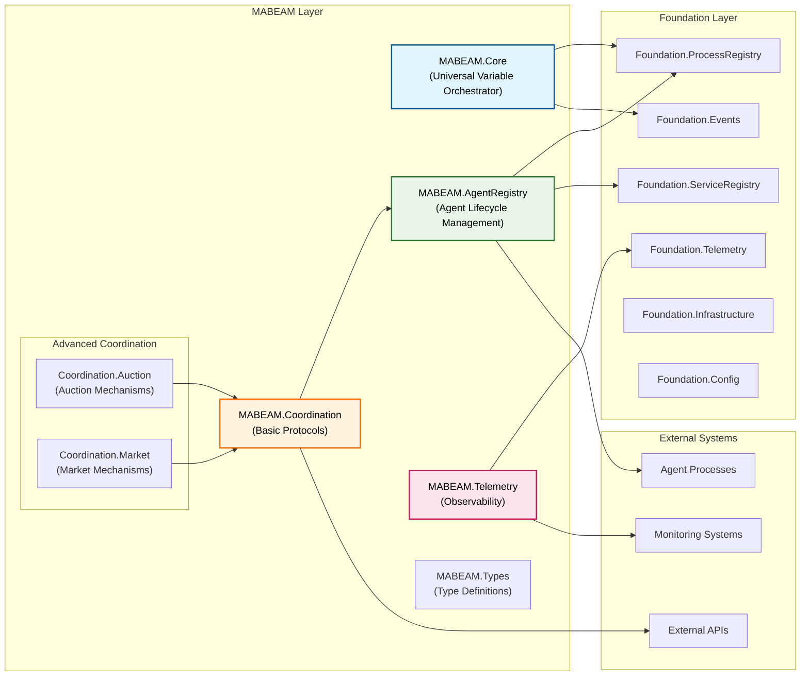

### Design Principles

1. **Layered Architecture**: Clear separation between MABEAM components and Foundation services
2. **Service-Oriented**: Each component is a service with well-defined interfaces
3. **Fault Tolerance**: Built on OTP principles with supervision and recovery
4. **Observability**: Comprehensive telemetry and monitoring throughout
5. **Extensibility**: Plugin architecture for coordination protocols
6. **Pragmatic Distribution**: Single-node optimized with distributed-ready APIs

---

## Component Architecture

### MABEAM Core Components

#### 1. MABEAM.Core (Universal Variable Orchestrator)

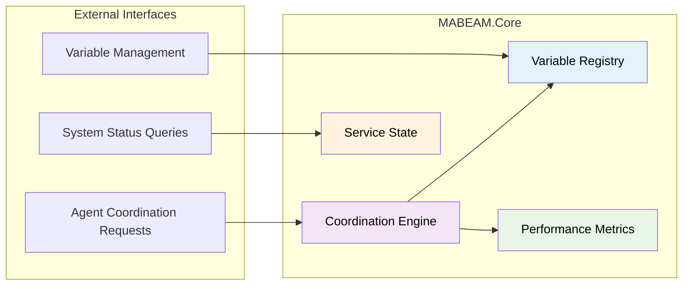

**Responsibilities:**
- Universal variable registration and management
- System-wide coordination orchestration
- Performance monitoring and optimization
- Integration with Foundation services

#### 2. MABEAM.AgentRegistry (Agent Lifecycle Management)

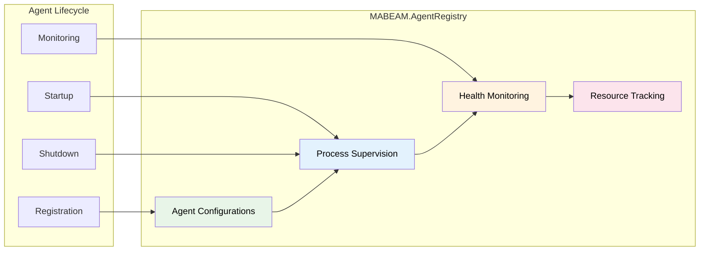

**Responsibilities:**
- Agent registration and configuration management
- Agent process lifecycle (start, stop, restart)
- Health monitoring and status tracking
- Resource usage monitoring and limits

#### 3. MABEAM.Coordination (Protocol Framework)

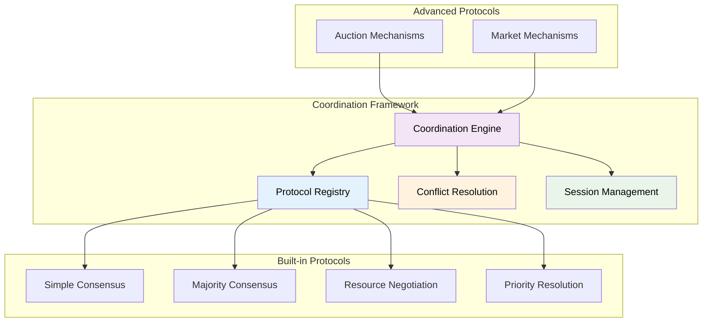

**Responsibilities:**
- Protocol registration and validation
- Coordination session management
- Built-in consensus and negotiation algorithms
- Conflict resolution strategies

#### 4. MABEAM.Telemetry (Observability)

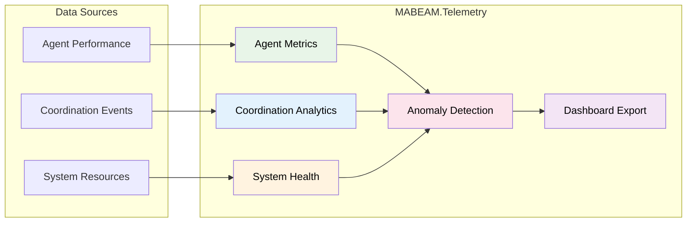

**Responsibilities:**
- Agent performance metrics collection
- Coordination protocol analytics
- System health monitoring
- Anomaly detection and alerting
- Dashboard data export

---

## Data Flow Architecture

### Agent Coordination Flow

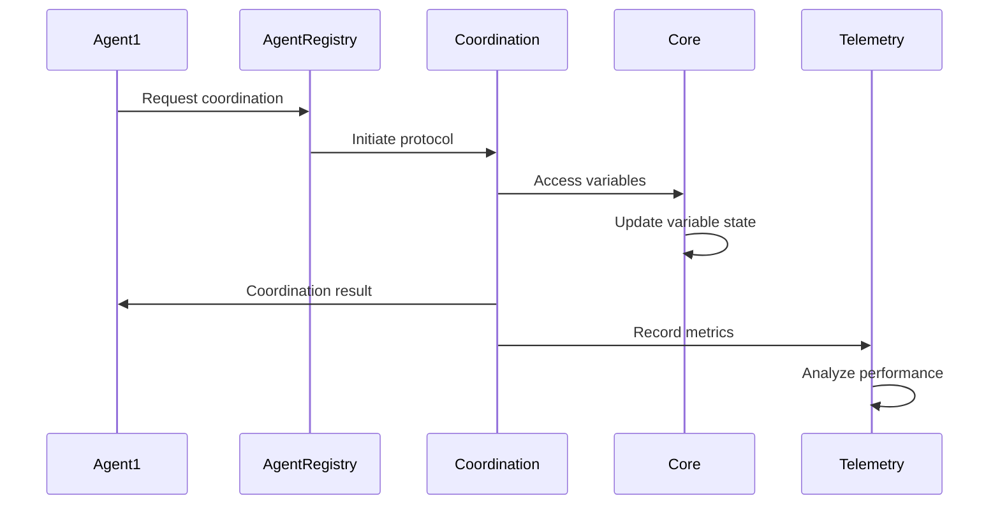

### Auction-Based Coordination Flow

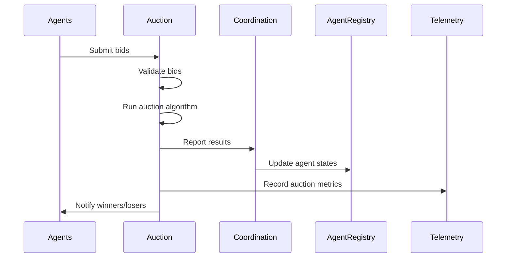

### Market Equilibrium Flow

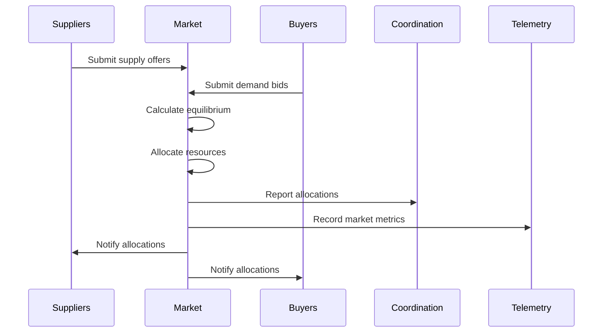

---

## Coordination Protocols

### Protocol Architecture

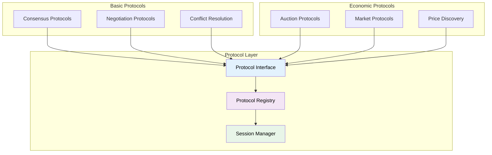

### Protocol Types

#### 1. Consensus Protocols
- **Simple Consensus**: Basic agreement mechanisms
- **Majority Consensus**: Voting-based decisions
- **Weighted Consensus**: Priority-based voting

#### 2. Auction Protocols
- **Sealed-Bid Auctions**: First-price and second-price
- **English Auctions**: Ascending price mechanisms
- **Dutch Auctions**: Descending price mechanisms
- **Combinatorial Auctions**: Bundle bidding

#### 3. Market Protocols
- **Equilibrium Markets**: Supply/demand matching
- **Dynamic Markets**: Multi-period simulation
- **Double Auctions**: Simultaneous bid/ask matching

---

## Service Integration

### Foundation Services Integration

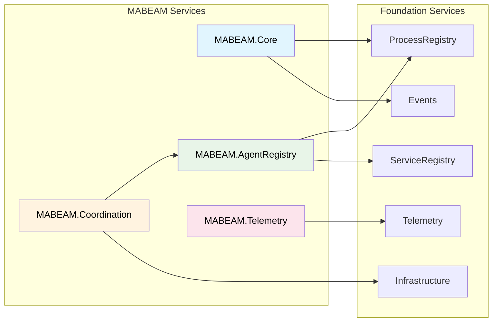

### Service Dependencies

1. **MABEAM.Core** depends on:
   - Foundation.ProcessRegistry (service registration)
   - Foundation.ServiceRegistry (service discovery)
   - Foundation.Events (coordination events)
   - Foundation.Telemetry (performance metrics)

2. **MABEAM.AgentRegistry** depends on:
   - Foundation.ProcessRegistry (agent registration)
   - MABEAM.Core (orchestration integration)

3. **MABEAM.Coordination** depends on:
   - MABEAM.AgentRegistry (agent management)
   - Foundation.Infrastructure (protection patterns)

4. **MABEAM.Telemetry** depends on:
   - Foundation.ProcessRegistry (service registration)
   - Foundation.Telemetry (telemetry infrastructure)

---

## Deployment Architecture

### Single-Node Deployment

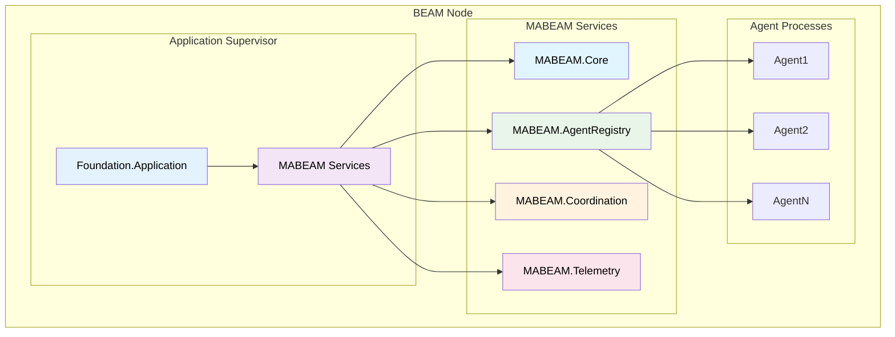

### Multi-Node Deployment (Future)

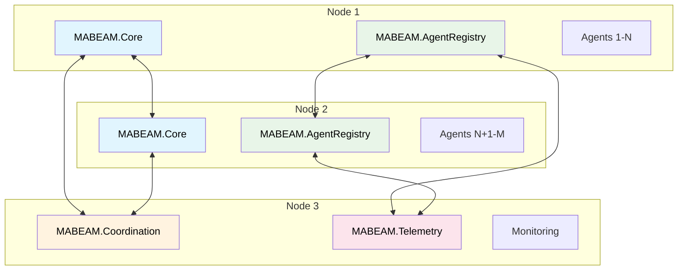

---

## Scalability Considerations

### Horizontal Scaling

1. **Agent Distribution**: Agents can be distributed across nodes
2. **Service Replication**: Core services can be replicated
3. **Load Balancing**: Coordination requests can be load balanced
4. **Data Partitioning**: Variables can be partitioned by domain

### Vertical Scaling

1. **Memory Optimization**: Efficient data structures and caching
2. **CPU Optimization**: Parallel processing for coordination
3. **I/O Optimization**: Async operations and batching
4. **Resource Limits**: Configurable limits and quotas

### Performance Patterns

#### 1. Caching Strategy
- Variable state caching
- Agent metadata caching
- Coordination result caching
- Telemetry data aggregation

#### 2. Batching Strategy
- Bulk agent operations
- Batch coordination requests
- Aggregated telemetry events
- Bulk variable updates

#### 3. Async Processing
- Non-blocking coordination
- Async telemetry collection
- Background health checks
- Deferred cleanup operations

---

## Security Architecture

### Security Layers

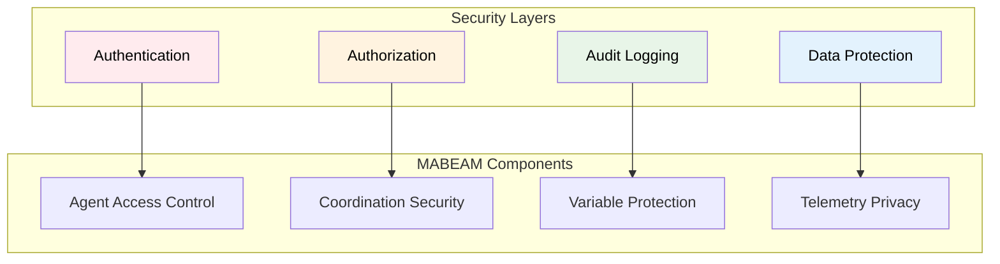

### Security Features

1. **Agent Authentication**: Verify agent identity
2. **Resource Authorization**: Control access to variables
3. **Coordination Security**: Secure protocol execution
4. **Audit Trails**: Complete operation logging
5. **Data Encryption**: Sensitive data protection

---

## Monitoring and Observability

### Observability Stack

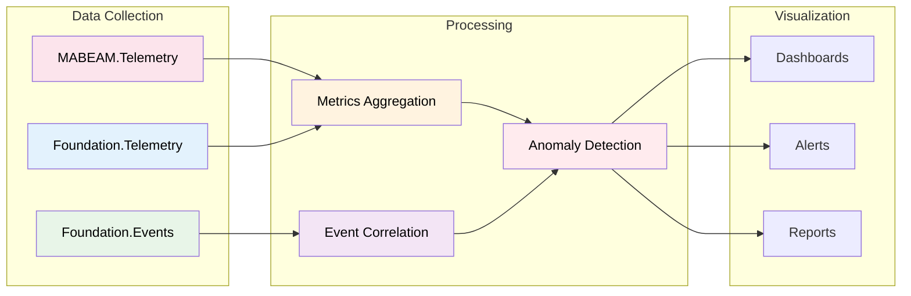

### Key Metrics

1. **Agent Metrics**: Performance, health, resource usage
2. **Coordination Metrics**: Success rates, latency, throughput
3. **System Metrics**: Memory, CPU, network, storage
4. **Business Metrics**: Efficiency, optimization, outcomes

---

## Conclusion

The MABEAM architecture provides a comprehensive, scalable, and observable multi-agent coordination system. Built on Foundation's proven infrastructure, it offers:

- **Robust Service Architecture**: Well-defined components with clear responsibilities
- **Advanced Coordination**: Sophisticated protocols including auctions and markets
- **Comprehensive Observability**: Full-stack monitoring and telemetry
- **Production Ready**: Built on OTP principles with fault tolerance
- **Future-Proof**: Designed for single-node efficiency with distributed scalability

This architecture enables building sophisticated multi-agent systems that can coordinate complex tasks, optimize resource allocation, and adapt to changing conditions while maintaining high performance and reliability. 