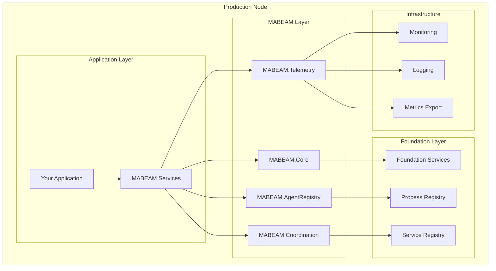
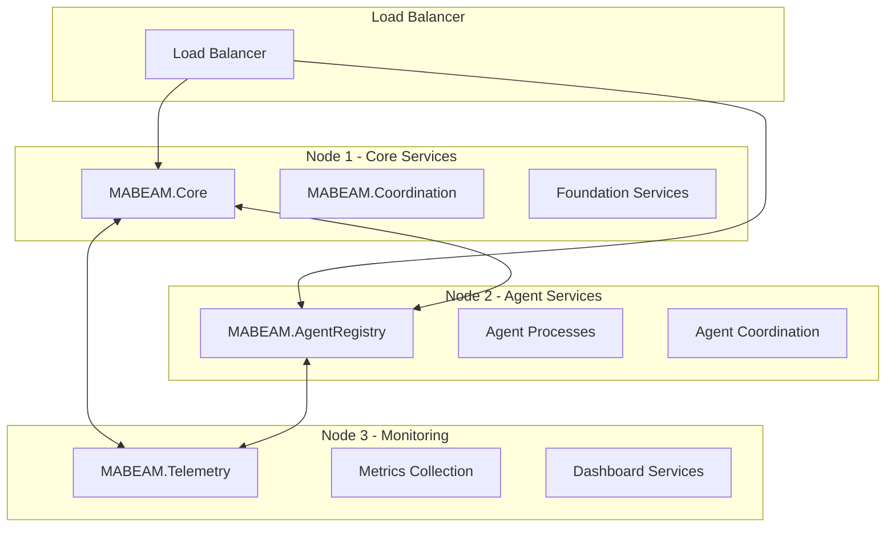

# MABEAM Deployment Guide

## Overview

This guide provides comprehensive instructions for deploying MABEAM (Multi-Agent BEAM) systems in production environments. It covers deployment strategies, configuration management, monitoring setup, and operational best practices.

## Table of Contents

1. [Prerequisites](#prerequisites)
2. [Deployment Architecture](#deployment-architecture)
3. [Configuration Management](#configuration-management)
4. [Service Deployment](#service-deployment)
5. [Monitoring and Observability](#monitoring-and-observability)
6. [Security Considerations](#security-considerations)
7. [Scaling and Performance](#scaling-and-performance)
8. [Troubleshooting](#troubleshooting)

---

## Prerequisites

### System Requirements

- **Elixir**: 1.15+ 
- **Erlang/OTP**: 26+
- **Memory**: Minimum 2GB RAM (4GB+ recommended)
- **CPU**: 2+ cores (4+ cores recommended)
- **Storage**: 10GB+ available space
- **Network**: Stable network connectivity for distributed deployment

### Dependencies

```elixir
# In mix.exs
def deps do
  [
    {:foundation, "~> 0.1.0"},
    {:telemetry, "~> 1.0"},
    {:jason, "~> 1.4"},
    {:poolboy, "~> 1.5"},
    {:hammer, "~> 6.0"},
    {:fuse, "~> 2.4"}
  ]
end
```

---

## Deployment Architecture

### Single-Node Deployment



### Multi-Node Deployment (Future)



---

## Configuration Management

### Production Configuration

Create `config/prod.exs` with production-specific settings:

```elixir
# config/prod.exs
import Config

# Foundation Configuration
config :foundation,
  environment: :production,
  log_level: :info

# MABEAM Core Configuration
config :foundation, Foundation.MABEAM.Core,
  max_variables: 5000,
  coordination_timeout: 10_000,
  history_retention: 1000,
  telemetry_enabled: true,
  health_check_interval: 15_000,
  graceful_shutdown_timeout: 10_000

# MABEAM Agent Registry Configuration  
config :foundation, Foundation.MABEAM.AgentRegistry,
  max_agents: 10_000,
  health_check_interval: 20_000,
  auto_restart: true,
  resource_monitoring: true,
  restart_strategy: :permanent,
  graceful_shutdown_timeout: 10_000

# MABEAM Coordination Configuration
config :foundation, Foundation.MABEAM.Coordination,
  default_timeout: 10_000,
  max_concurrent_coordinations: 500,
  protocol_timeout: 15_000,
  auction_cleanup_interval: 60_000,
  market_update_frequency: 5_000,
  telemetry_enabled: true,
  metrics_enabled: true

# MABEAM Telemetry Configuration
config :foundation, Foundation.MABEAM.Telemetry,
  retention_minutes: 1440,        # 24 hours
  cleanup_interval_ms: 300_000,   # 5 minutes
  anomaly_threshold: 1.5,
  export_interval: 60_000,        # 1 minute
  dashboard_enabled: true,
  telemetry_enabled: true,
  metrics_enabled: true

# Performance Tuning
config :foundation, :mabeam_performance,
  memory_limit_mb: 512,
  gc_frequency: 30_000,
  metrics_retention: 86_400_000   # 24 hours

# Concurrency Settings
config :foundation, :mabeam_concurrency,
  max_agents_per_node: 10_000,
  coordination_pool_size: 100,
  telemetry_buffer_size: 1_000

# Health Monitoring
config :foundation, :health_monitoring,
  global_health_check_interval: 30_000,
  health_check_timeout: 5_000,
  unhealthy_threshold: 3,
  degraded_threshold: 1
```

### Environment Variables

Set environment-specific variables:

```bash
# Production environment variables
export MIX_ENV=prod
export PHX_SERVER=true
export SECRET_KEY_BASE="your-secret-key-base"
export DATABASE_URL="your-database-url"

# MABEAM specific
export MABEAM_MAX_AGENTS=10000
export MABEAM_COORDINATION_TIMEOUT=10000
export MABEAM_TELEMETRY_RETENTION=1440

# Monitoring
export PROMETHEUS_ENDPOINT="http://prometheus:9090"
export GRAFANA_ENDPOINT="http://grafana:3000"
```

### Runtime Configuration

```elixir
# config/runtime.exs
import Config

if config_env() == :prod do
  # Read from environment variables
  max_agents = System.get_env("MABEAM_MAX_AGENTS", "10000") |> String.to_integer()
  coordination_timeout = System.get_env("MABEAM_COORDINATION_TIMEOUT", "10000") |> String.to_integer()
  
  config :foundation, Foundation.MABEAM.AgentRegistry,
    max_agents: max_agents
    
  config :foundation, Foundation.MABEAM.Coordination,
    default_timeout: coordination_timeout
end
```

---

## Service Deployment

### Application Supervision Tree

```elixir
# lib/your_app/application.ex
defmodule YourApp.Application do
  use Application
  
  @impl true
  def start(_type, _args) do
    children = [
      # Foundation services (automatically started)
      Foundation.Application,
      
      # Your application services
      YourApp.Supervisor,
      
      # MABEAM services (if not auto-started)
      {Foundation.MABEAM.Core, []},
      {Foundation.MABEAM.AgentRegistry, []},
      {Foundation.MABEAM.Coordination, []},
      {Foundation.MABEAM.Telemetry, []}
    ]
    
    opts = [strategy: :one_for_one, name: YourApp.Supervisor]
    Supervisor.start_link(children, opts)
  end
end
```

### Docker Deployment

Create `Dockerfile`:

```dockerfile
FROM elixir:1.15-alpine AS build

# Install build dependencies
RUN apk add --no-cache build-base git

# Set build ENV
ENV MIX_ENV=prod

# Create and set workdir
WORKDIR /app

# Copy mix files
COPY mix.exs mix.lock ./
RUN mix local.hex --force && \
    mix local.rebar --force && \
    mix deps.get --only prod

# Copy source code
COPY . .

# Compile and build release
RUN mix compile && \
    mix release

# Runtime stage
FROM alpine:3.18 AS runtime

# Install runtime dependencies
RUN apk add --no-cache openssl ncurses-libs

# Create app user
RUN adduser -D -s /bin/sh app

# Set workdir
WORKDIR /app

# Copy release from build stage
COPY --from=build --chown=app:app /app/_build/prod/rel/your_app ./

USER app

# Expose port
EXPOSE 4000

# Start the application
CMD ["./bin/your_app", "start"]
```

Create `docker-compose.yml`:

```yaml
version: '3.8'

services:
  app:
    build: .
    ports:
      - "4000:4000"
    environment:
      - MIX_ENV=prod
      - MABEAM_MAX_AGENTS=10000
      - MABEAM_COORDINATION_TIMEOUT=10000
    volumes:
      - ./logs:/app/logs
    depends_on:
      - prometheus
      - grafana
    restart: unless-stopped

  prometheus:
    image: prom/prometheus:latest
    ports:
      - "9090:9090"
    volumes:
      - ./prometheus.yml:/etc/prometheus/prometheus.yml
      - prometheus_data:/prometheus
    restart: unless-stopped

  grafana:
    image: grafana/grafana:latest
    ports:
      - "3000:3000"
    environment:
      - GF_SECURITY_ADMIN_PASSWORD=admin
    volumes:
      - grafana_data:/var/lib/grafana
      - ./grafana/dashboards:/etc/grafana/provisioning/dashboards
    restart: unless-stopped

volumes:
  prometheus_data:
  grafana_data:
```

### Kubernetes Deployment

Create `k8s/deployment.yaml`:

```yaml
apiVersion: apps/v1
kind: Deployment
metadata:
  name: mabeam-app
  labels:
    app: mabeam-app
spec:
  replicas: 3
  selector:
    matchLabels:
      app: mabeam-app
  template:
    metadata:
      labels:
        app: mabeam-app
    spec:
      containers:
      - name: mabeam-app
        image: your-registry/mabeam-app:latest
        ports:
        - containerPort: 4000
        env:
        - name: MIX_ENV
          value: "prod"
        - name: MABEAM_MAX_AGENTS
          value: "10000"
        - name: MABEAM_COORDINATION_TIMEOUT
          value: "10000"
        resources:
          requests:
            memory: "2Gi"
            cpu: "1000m"
          limits:
            memory: "4Gi"
            cpu: "2000m"
        livenessProbe:
          httpGet:
            path: /health
            port: 4000
          initialDelaySeconds: 30
          periodSeconds: 10
        readinessProbe:
          httpGet:
            path: /ready
            port: 4000
          initialDelaySeconds: 5
          periodSeconds: 5
---
apiVersion: v1
kind: Service
metadata:
  name: mabeam-app-service
spec:
  selector:
    app: mabeam-app
  ports:
  - protocol: TCP
    port: 80
    targetPort: 4000
  type: LoadBalancer
```

---

## Monitoring and Observability

### Health Check Endpoints

```elixir
# lib/your_app_web/controllers/health_controller.ex
defmodule YourAppWeb.HealthController do
  use YourAppWeb, :controller
  
  alias Foundation.MABEAM.{Core, AgentRegistry, Coordination, Telemetry}

  def health(conn, _params) do
    health_status = %{
      status: "healthy",
      timestamp: DateTime.utc_now(),
      services: %{
        core: service_health(Core),
        agent_registry: service_health(AgentRegistry),
        coordination: service_health(Coordination),
        telemetry: service_health(Telemetry)
      }
    }
    
    overall_status = determine_overall_status(health_status.services)
    
    conn
    |> put_status(if overall_status == "healthy", do: :ok, else: :service_unavailable)
    |> json(Map.put(health_status, :status, overall_status))
  end

  def ready(conn, _params) do
    ready_status = %{
      ready: all_services_ready?(),
      timestamp: DateTime.utc_now()
    }
    
    conn
    |> put_status(if ready_status.ready, do: :ok, else: :service_unavailable)
    |> json(ready_status)
  end

  defp service_health(service) do
    case GenServer.whereis(service) do
      nil -> "down"
      _pid -> "up"
    end
  end

  defp determine_overall_status(services) do
    if Enum.all?(services, fn {_service, status} -> status == "up" end) do
      "healthy"
    else
      "degraded"
    end
  end

  defp all_services_ready? do
    [Core, AgentRegistry, Coordination, Telemetry]
    |> Enum.all?(&(GenServer.whereis(&1) != nil))
  end
end
```

### Prometheus Metrics

```elixir
# lib/your_app/telemetry.ex
defmodule YourApp.Telemetry do
  use Supervisor
  import Telemetry.Metrics

  def start_link(arg) do
    Supervisor.start_link(__MODULE__, arg, name: __MODULE__)
  end

  @impl true
  def init(_arg) do
    children = [
      # Telemetry poller for VM metrics
      {:telemetry_poller, measurements: periodic_measurements(), period: 10_000},
      
      # Prometheus metrics exporter
      {TelemetryMetricsPrometheus, metrics: metrics()}
    ]

    Supervisor.init(children, strategy: :one_for_one)
  end

  def metrics do
    [
      # MABEAM Core metrics
      counter("foundation.mabeam.core.variables.registered.total"),
      counter("foundation.mabeam.core.coordination.requests.total"),
      distribution("foundation.mabeam.core.coordination.duration", unit: {:native, :millisecond}),
      
      # Agent Registry metrics
      counter("foundation.mabeam.agent_registry.agents.registered.total"),
      counter("foundation.mabeam.agent_registry.agents.started.total"),
      counter("foundation.mabeam.agent_registry.agents.stopped.total"),
      last_value("foundation.mabeam.agent_registry.agents.active"),
      
      # Coordination metrics
      counter("foundation.mabeam.coordination.protocols.registered.total"),
      counter("foundation.mabeam.coordination.sessions.started.total"),
      counter("foundation.mabeam.coordination.sessions.completed.total"),
      distribution("foundation.mabeam.coordination.session.duration", unit: {:native, :millisecond}),
      
      # Auction metrics
      counter("foundation.mabeam.auction.auctions.total"),
      counter("foundation.mabeam.auction.bids.total"),
      distribution("foundation.mabeam.auction.duration", unit: {:native, :millisecond}),
      distribution("foundation.mabeam.auction.efficiency"),
      
      # Market metrics
      counter("foundation.mabeam.market.equilibriums.found.total"),
      counter("foundation.mabeam.market.simulations.total"),
      distribution("foundation.mabeam.market.equilibrium.price"),
      distribution("foundation.mabeam.market.efficiency"),
      
      # VM metrics
      last_value("vm.memory.total", unit: :byte),
      last_value("vm.memory.processes", unit: :byte),
      last_value("vm.memory.system", unit: :byte),
      last_value("vm.total_run_queue_lengths.total"),
      last_value("vm.total_run_queue_lengths.cpu"),
      last_value("vm.total_run_queue_lengths.io")
    ]
  end

  defp periodic_measurements do
    [
      # A module, function and arguments to be invoked periodically.
      {__MODULE__, :dispatch_vm_stats, []},
      {__MODULE__, :dispatch_mabeam_stats, []}
    ]
  end

  def dispatch_vm_stats do
    :telemetry.execute([:vm, :memory], :erlang.memory())
    :telemetry.execute([:vm, :total_run_queue_lengths], :erlang.statistics(:total_run_queue_lengths))
  end

  def dispatch_mabeam_stats do
    # Dispatch MABEAM-specific metrics
    if Process.whereis(Foundation.MABEAM.AgentRegistry) do
      {:ok, agents} = Foundation.MABEAM.AgentRegistry.list_agents()
      :telemetry.execute([:foundation, :mabeam, :agent_registry, :agents], %{active: length(agents)})
    end
  end
end
```

### Grafana Dashboard

Create `grafana/dashboards/mabeam-dashboard.json`:

```json
{
  "dashboard": {
    "id": null,
    "title": "MABEAM System Dashboard",
    "tags": ["mabeam", "multi-agent"],
    "timezone": "browser",
    "panels": [
      {
        "id": 1,
        "title": "Active Agents",
        "type": "stat",
        "targets": [
          {
            "expr": "foundation_mabeam_agent_registry_agents_active",
            "legendFormat": "Active Agents"
          }
        ]
      },
      {
        "id": 2,
        "title": "Coordination Success Rate",
        "type": "stat",
        "targets": [
          {
            "expr": "rate(foundation_mabeam_coordination_sessions_completed_total[5m]) / rate(foundation_mabeam_coordination_sessions_started_total[5m])",
            "legendFormat": "Success Rate"
          }
        ]
      },
      {
        "id": 3,
        "title": "Auction Efficiency",
        "type": "timeseries",
        "targets": [
          {
            "expr": "foundation_mabeam_auction_efficiency",
            "legendFormat": "Auction Efficiency"
          }
        ]
      },
      {
        "id": 4,
        "title": "Memory Usage",
        "type": "timeseries",
        "targets": [
          {
            "expr": "vm_memory_total",
            "legendFormat": "Total Memory"
          },
          {
            "expr": "vm_memory_processes",
            "legendFormat": "Process Memory"
          }
        ]
      }
    ]
  }
}
```

---

## Security Considerations

### Network Security

```elixir
# Configure SSL/TLS
config :your_app, YourAppWeb.Endpoint,
  https: [
    port: 443,
    cipher_suite: :strong,
    keyfile: System.get_env("SSL_KEY_PATH"),
    certfile: System.get_env("SSL_CERT_PATH"),
    transport_options: [socket_opts: [:inet6]]
  ]
```

### Authentication and Authorization

```elixir
# Agent authentication
defmodule YourApp.AgentAuth do
  def authenticate_agent(agent_id, credentials) do
    # Implement agent authentication logic
    case verify_credentials(agent_id, credentials) do
      {:ok, agent} -> {:ok, agent}
      {:error, reason} -> {:error, reason}
    end
  end

  def authorize_coordination(agent_id, protocol, context) do
    # Implement authorization logic
    case check_permissions(agent_id, protocol, context) do
      true -> :authorized
      false -> :unauthorized
    end
  end

  defp verify_credentials(agent_id, credentials) do
    # Implement credential verification
    :ok
  end

  defp check_permissions(agent_id, protocol, context) do
    # Implement permission checking
    true
  end
end
```

### Data Protection

```elixir
# Encrypt sensitive data
config :foundation, Foundation.MABEAM.Core,
  encryption_enabled: true,
  encryption_key: System.get_env("MABEAM_ENCRYPTION_KEY")

# Audit logging
config :foundation, Foundation.MABEAM.Coordination,
  audit_enabled: true,
  audit_level: :all
```

---

## Scaling and Performance

### Horizontal Scaling

```bash
# Scale with Kubernetes
kubectl scale deployment mabeam-app --replicas=5

# Scale with Docker Swarm
docker service scale mabeam-app=5
```

### Performance Tuning

```elixir
# Optimize BEAM VM
config :kernel,
  start_timer: true,
  start_pg2: true

# Optimize scheduler
config :runtime_tools,
  scheduler_wall_time: true

# Memory optimization
config :foundation, :mabeam_performance,
  memory_limit_mb: 1024,
  gc_frequency: 15_000,
  process_limit: 50_000
```

### Load Testing

```bash
# Install load testing tools
mix deps.get wrk

# Run load tests
wrk -t12 -c400 -d30s --script=load_test.lua http://localhost:4000/api/coordinate
```

---

## Troubleshooting

### Common Issues

1. **Service Startup Failures**
```bash
# Check logs
docker logs mabeam-app

# Check service status
kubectl get pods -l app=mabeam-app
```

2. **Memory Issues**
```bash
# Monitor memory usage
docker stats mabeam-app

# Check for memory leaks
:observer.start()
```

3. **Coordination Timeouts**
```elixir
# Increase timeouts
config :foundation, Foundation.MABEAM.Coordination,
  default_timeout: 30_000,
  protocol_timeout: 60_000
```

### Diagnostic Commands

```bash
# Check system health
curl http://localhost:4000/health

# Check readiness
curl http://localhost:4000/ready

# Get metrics
curl http://localhost:4000/metrics

# Check agent status
iex> Foundation.MABEAM.AgentRegistry.list_agents()

# Check coordination metrics
iex> Foundation.MABEAM.Telemetry.get_coordination_metrics(:all, :last_hour)
```

### Log Analysis

```bash
# Follow application logs
tail -f logs/mabeam.log

# Search for errors
grep -i error logs/mabeam.log

# Analyze coordination patterns
grep "coordination" logs/mabeam.log | head -100
```

---

## Conclusion

This deployment guide provides a comprehensive framework for deploying MABEAM systems in production. Key takeaways:

- **Comprehensive Configuration**: Production-ready configuration for all components
- **Monitoring and Observability**: Full-stack monitoring with Prometheus and Grafana
- **Security**: Authentication, authorization, and data protection
- **Scalability**: Horizontal and vertical scaling strategies
- **Operational Excellence**: Health checks, diagnostics, and troubleshooting

Following these practices ensures robust, scalable, and maintainable MABEAM deployments in production environments. 