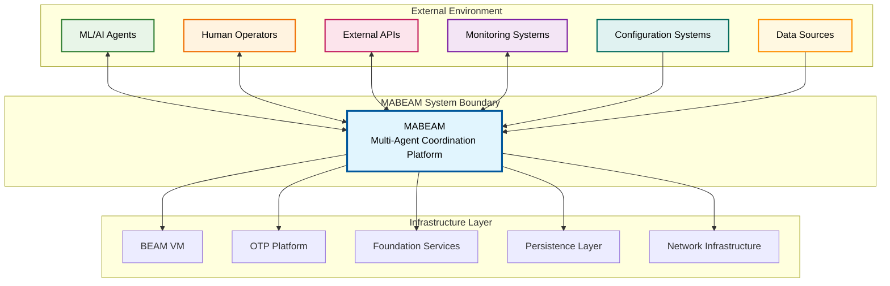

I'll create a comprehensive architecture document with multiple levels of architectural detail, including overview and detailed diagrams, along with extensive architectural information.
Read file: foundation/docs/MABEAM_ARCHITECTURE.md
Now I'll create a comprehensive architecture document with multiple architectural levels and extensive detail:

# MABEAM Architecture - Comprehensive Design Document

## Overview

MABEAM (Multi-Agent BEAM) is a sophisticated multi-agent coordination system built on the Foundation library. It provides universal variable orchestration, agent lifecycle management, and advanced coordination protocols including auctions and market-based mechanisms. This document provides comprehensive architectural analysis across multiple levels of abstraction.

## Table of Contents

1. [Executive Architecture Overview](#executive-architecture-overview)
2. [System Architecture Levels](#system-architecture-levels)
3. [Detailed Component Architecture](#detailed-component-architecture)
4. [Data Flow and Communication Patterns](#data-flow-and-communication-patterns)
5. [Coordination Protocol Architecture](#coordination-protocol-architecture)
6. [Foundation Integration Architecture](#foundation-integration-architecture)
7. [Deployment and Runtime Architecture](#deployment-and-runtime-architecture)
8. [Scalability and Performance Architecture](#scalability-and-performance-architecture)
9. [Security and Compliance Architecture](#security-and-compliance-architecture)
10. [Monitoring and Observability Architecture](#monitoring-and-observability-architecture)
11. [Evolution and Migration Architecture](#evolution-and-migration-architecture)

---

## Executive Architecture Overview

### System Context Diagram

### Core Value Propositions

1. **Universal Variable Orchestration**: Centralized coordination of all agent variables and resources
2. **Advanced Economic Protocols**: Built-in auction and market mechanisms for resource allocation
3. **Fault-Tolerant Agent Management**: OTP-based supervision and recovery patterns
4. **Comprehensive Observability**: Full-stack monitoring with anomaly detection
5. **Extensible Protocol Framework**: Plugin architecture for custom coordination algorithms
6. **Production-Ready Foundation**: Built on proven Foundation library infrastructure

---

## System Architecture Levels

### Level 1: Conceptual Architecture

### Level 2: Logical Architecture

### Level 3: Physical Architecture

---

## Detailed Component Architecture

### Detail Diagram 1: MABEAM Core Engine Architecture

### Detail Diagram 2: Coordination Protocol Engine Architecture

---

## Data Flow and Communication Patterns

### Agent Coordination Flow (Detailed)

### Economic Protocol Flow (Auction Example)

### System Event Flow

---

## Coordination Protocol Architecture

### Protocol Framework Design

### Economic Protocol Specifications

#### Auction Mechanism Architecture

---

## Foundation Integration Architecture

### Service Integration Patterns

### Process Registry Integration

---

## Deployment and Runtime Architecture

### Single-Node Deployment Architecture

### Multi-Node Distribution Architecture (Future)

---

## Scalability and Performance Architecture

### Performance Optimization Layers

### Scalability Patterns

#### Horizontal Scaling Strategy

1. **Agent Distribution**: Distribute agents across multiple nodes
2. **Service Replication**: Replicate core services for load distribution
3. **Data Partitioning**: Partition variable state by domain or agent group
4. **Load Balancing**: Distribute coordination requests across service instances

#### Vertical Scaling Strategy

1. **Memory Optimization**: Efficient data structures and garbage collection tuning
2. **CPU Optimization**: Parallel processing and worker pool management
3. **I/O Optimization**: Async operations and connection pooling
4. **Resource Limits**: Configurable limits and quotas

### Performance Targets

| Component | Metric | Target | Measurement |
|-----------|--------|--------|-------------|
| MABEAM.Core | Variable Access Latency | < 1ms | P95 |
| MABEAM.AgentRegistry | Agent Registration | < 5ms | P95 |
| MABEAM.Coordination | Simple Consensus | < 10ms | P95 |
| Auction Engine | Sealed-Bid Auction | < 100ms | P95 |
| Market Engine | Equilibrium Calculation | < 50ms | P95 |
| System Throughput | Coordination Requests | > 10,000/sec | Sustained |
| Memory Usage | Per Agent | < 1MB | Average |
| CPU Usage | System Load | < 80% | Peak |

---

## Security and Compliance Architecture

### Security Layers

### Compliance Framework

1. **Data Protection**: GDPR/CCPA compliance for agent data
2. **Audit Requirements**: SOX/SOC2 compliance for financial protocols
3. **Security Standards**: ISO 27001 security management
4. **Privacy Controls**: Data minimization and anonymization

---

## Monitoring and Observability Architecture

### Observability Stack

### Key Observability Metrics

#### System Health Metrics
- **Process Health**: Process count, restart rates, memory usage
- **System Resources**: CPU, memory, disk, network utilization
- **Service Availability**: Uptime, response times, error rates

#### Business Metrics
- **Agent Performance**: Task completion rates, efficiency scores
- **Coordination Success**: Protocol success rates, conflict resolution
- **Economic Efficiency**: Auction outcomes, market efficiency, resource utilization

#### Operational Metrics
- **Throughput**: Requests per second, coordination sessions per minute
- **Latency**: Response times, protocol execution times
- **Error Rates**: Failed requests, protocol failures, system errors

---

## Evolution and Migration Architecture

### Migration Strategy

### Architectural Evolution Path

#### Current State (Single-Node)
- Foundation services providing core infrastructure
- MABEAM services for agent coordination
- Local process management and communication
- Basic telemetry and monitoring

#### Target State (Distributed)
- Multi-node agent distribution
- Distributed coordination protocols
- Global state management
- Advanced analytics and ML integration

#### Migration Principles
1. **Backward Compatibility**: Maintain API compatibility during migration
2. **Incremental Deployment**: Phase-by-phase rollout with rollback capability
3. **Zero Downtime**: Hot upgrades and blue-green deployments
4. **Data Migration**: Seamless state transfer and synchronization

---

## Conclusion

This comprehensive architecture document provides multiple levels of architectural detail for the MABEAM system:

### Key Architectural Strengths

1. **Layered Design**: Clear separation of concerns across multiple architectural layers
2. **Scalable Foundation**: Built on proven OTP principles with horizontal and vertical scaling strategies
3. **Comprehensive Observability**: Full-stack monitoring with real-time analytics and anomaly detection
4. **Economic Protocol Integration**: Advanced auction and market mechanisms with economic property validation
5. **Fault Tolerance**: Comprehensive error handling, circuit breaking, and recovery patterns
6. **Future-Ready**: Designed for single-node efficiency with clear distributed evolution path

### Architectural Innovation

- **Universal Variable Orchestration**: Centralized coordination of all agent resources
- **Economic Protocol Framework**: Built-in auction and market mechanisms
- **Pluggable Backend Architecture**: Flexible storage and communication backends
- **Comprehensive Telemetry**: Real-time performance monitoring and optimization
- **Security-First Design**: Multi-layer security with audit trails and compliance support

This architecture enables building sophisticated multi-agent systems that can coordinate complex tasks, optimize resource allocation through economic mechanisms, and scale from single-node deployments to large distributed systems while maintaining high performance, reliability, and observability.