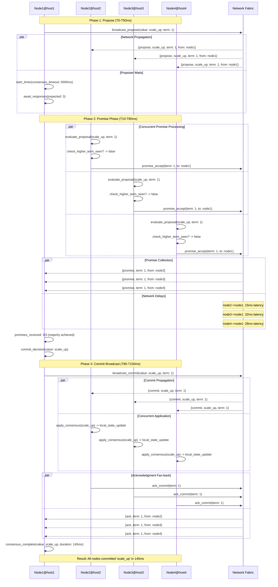

# Distributed Coordination Primitive Flows

## Diagram 1: Consensus Protocol - Network Message Flows



### Network Flow Characteristics:
- **Message Amplification**: 1 propose → 3 promises → 1 commit → 3 acks = 8 total messages
- **Latency Variance**: Network delays vary (15ms, 32ms, 28ms) but consensus waits for slowest
- **Concurrent Processing**: All nodes evaluate proposals simultaneously
- **Failure Window**: 50ms window between propose and promise where network failures critical

---

## Diagram 2: Leader Election During Network Partition

```mermaid
graph TB
    subgraph "Network Topology: T0"
        N1((Node1<br/>candidate))
        N2((Node2<br/>follower))
        N3((Node3<br/>follower))
        N4((Node4<br/>follower))
        N5((Node5<br/>follower))
        
        N1 -.->|heartbeat| N2
        N1 -.->|heartbeat| N3
        N1 -.->|heartbeat| N4
        N1 -.->|heartbeat| N5
        N2 -.->|ack| N1
        N3 -.->|ack| N1
        N4 -.->|ack| N1
        N5 -.->|ack| N1
    end
    
    subgraph "Network Partition Event: T100ms"
        direction TB
        subgraph "Partition A: Majority"
            N1_A((Node1<br/>🔴 leader_timeout))
            N2_A((Node2<br/>🟡 follower))
            N3_A((Node3<br/>🟡 follower))
            
            N2_A -.->|vote_request| N1_A
            N3_A -.->|vote_request| N1_A
            N1_A -.->|vote_grant| N2_A
            N1_A -.->|vote_grant| N3_A
        end
        
        subgraph "Partition B: Minority"
            N4_B((Node4<br/>🔴 leader_timeout))
            N5_B((Node5<br/>🔴 leader_timeout))
            
            N4_B -.->|vote_request| N5_B
            N5_B -.->|vote_request| N4_B
            N4_B -.->|vote_deny<br/>tie| N5_B
            N5_B -.->|vote_deny<br/>tie| N4_B
        end
        
        N1_A -.->X N4_B
        N1_A -.->X N5_B
        N4_B -.->X N1_A
        N5_B -.->X N1_A
    end
    
    subgraph "Election Resolution: T200-T400ms"
        direction TB
        subgraph "Partition A: Successful Election"
            N1_WIN((Node1<br/>🟢 NEW LEADER<br/>term: 2))
            N2_WIN((Node2<br/>🟢 follower))
            N3_WIN((Node3<br/>🟢 follower))
            
            N1_WIN -.->|leader_announce<br/>term: 2| N2_WIN
            N1_WIN -.->|leader_announce<br/>term: 2| N3_WIN
            N2_WIN -.->|leader_ack| N1_WIN  
            N3_WIN -.->|leader_ack| N1_WIN
        end
        
        subgraph "Partition B: Election Failure"
            N4_FAIL((Node4<br/>🔴 candidate<br/>no majority))
            N5_FAIL((Node5<br/>🔴 candidate<br/>no majority))
            
            N4_FAIL -.->|timeout_retry| N4_FAIL
            N5_FAIL -.->|timeout_retry| N5_FAIL
        end
    end
    
    subgraph "Partition Healing: T500ms"
        direction TB
        N1_FINAL((Node1<br/>🟢 LEADER<br/>term: 2))
        N2_FINAL((Node2<br/>🟢 follower))
        N3_FINAL((Node3<br/>🟢 follower))
        N4_FINAL((Node4<br/>🟡 sync_recovery))
        N5_FINAL((Node5<br/>🟡 sync_recovery))
        
        N1_FINAL -.->|leader_announce<br/>term: 2| N4_FINAL
        N1_FINAL -.->|leader_announce<br/>term: 2| N5_FINAL
        N4_FINAL -.->|accept_leader<br/>step_down| N1_FINAL
        N5_FINAL -.->|accept_leader<br/>step_down| N1_FINAL
        
        N1_FINAL -.->|state_sync| N4_FINAL
        N1_FINAL -.->|state_sync| N5_FINAL
    end
    
    classDef leader fill:#c8e6c9,stroke:#2e7d32,stroke-width:3px
    classDef follower fill:#e3f2fd,stroke:#1565c0  
    classDef candidate fill:#fff3e0,stroke:#ef6c00
    classDef failed fill:#ffebee,stroke:#c62828
    classDef recovering fill:#f3e5f5,stroke:#7b1fa2
    
    class N1_WIN,N1_FINAL leader
    class N2_WIN,N3_WIN,N2_FINAL,N3_FINAL follower  
    class N1_A,N4_B,N5_B,N4_FAIL,N5_FAIL candidate
    class N4_FINAL,N5_FINAL recovering
```

### Partition Behavior Analysis:
- **Split Brain Prevention**: Only partition with majority (3/5) can elect leader
- **Minority Starvation**: Nodes 4&5 cannot progress, remain in candidate state
- **Recovery Synchronization**: Healing requires state sync, not just leader acceptance
- **Time Delays**: Election ~300ms, partition healing +200ms = 500ms total unavailability

---

## Diagram 3: Distributed Mutex Contention (Lamport Algorithm)

```mermaid
gantt
    title Distributed Mutex Access - Concurrent Request Timeline
    dateFormat X
    axisFormat %L
    
    section Node1_Request
    Request Timestamp       :milestone, n1_req, 0, 0ms
    Broadcast Request       :n1_bc, after n1_req, 15ms
    Collect Responses       :n1_wait, after n1_bc, 45ms
    Enter Critical Section  :milestone, n1_enter, after n1_wait, 0ms
    Critical Work           :n1_work, after n1_enter, 100ms
    Release Broadcast       :n1_rel, after n1_work, 10ms
    
    section Node2_Request  
    Request Timestamp       :milestone, n2_req, 10, 0ms
    Broadcast Request       :n2_bc, after n2_req, 12ms
    Collect Responses       :n2_wait, after n2_bc, 135ms
    Enter Critical Section  :milestone, n2_enter, after n2_wait, 0ms
    Critical Work           :n2_work, after n2_enter, 80ms
    Release Broadcast       :n2_rel, after n2_work, 8ms
    
    section Node3_Request
    Request Timestamp       :milestone, n3_req, 25, 0ms  
    Broadcast Request       :n3_bc, after n3_req, 18ms
    Collect Responses       :n3_wait, after n3_bc, 195ms
    Enter Critical Section  :milestone, n3_enter, after n3_wait, 0ms
    Critical Work           :n3_work, after n3_enter, 60ms
    Release Broadcast       :n3_rel, after n3_work, 12ms
    
    section Node4_Observer
    Receive N1 Request      :n4_r1, 20, 2ms
    Receive N2 Request      :n4_r2, 25, 2ms  
    Receive N3 Request      :n4_r3, 50, 2ms
    Send Responses          :n4_resp, after n4_r3, 5ms
    
    section Node5_Observer  
    Receive N1 Request      :n5_r1, 18, 3ms
    Receive N2 Request      :n5_r2, 28, 3ms
    Receive N3 Request      :n5_r3, 48, 3ms
    Send Responses          :n5_resp, after n5_r3, 5ms
```



### Mutex Flow Analysis:
- **Timestamp Ordering**: Node1 (T=0) < Node2 (T=10) < Node3 (T=25) determines execution order
- **Broadcast Overlap**: All nodes broadcast requests before any complete, creating contention
- **Wait Queue Formation**: Node2 waits for Node1 completion, Node3 waits for both
- **Observer Load**: Nodes 4&5 handle 3 concurrent requests each, respond to all
- **Total System Throughput**: 240ms for 3 sequential critical sections vs potential parallelism

---

## Diagram 4: Barrier Synchronization with Stragglers

```mermaid 
flowchart TD
    subgraph "Phase 1: Barrier Setup (T0)"
        Coord[Barrier Coordinator<br/>barrier_id: #ref123]
        Coord -.->|register| N1_P1[Node1: registered]
        Coord -.->|register| N2_P1[Node2: registered] 
        Coord -.->|register| N3_P1[Node3: registered]
        Coord -.->|register| N4_P1[Node4: registered]
        Coord -.->|register| N5_P1[Node5: registered]
    end
    
    subgraph "Phase 2: Work Execution (T0-T200ms)"
        N1_P1 -.->|async work| W1[Work1: ML Training<br/>⚡ Fast: 50ms]
        N2_P1 -.->|async work| W2[Work2: Data Processing<br/>⚡ Fast: 75ms]
        N3_P1 -.->|async work| W3[Work3: Model Evaluation<br/>🐌 Slow: 180ms]
        N4_P1 -.->|async work| W4[Work4: Result Aggregation<br/>⚡ Fast: 60ms]
        N5_P1 -.->|async work| W5[Work5: Statistics Collection<br/>🐌 Very Slow: 200ms]
    end
    
    subgraph "Phase 3: Barrier Arrival (T50-T200ms)"
        W1 -.->|T=50ms| Arr1[Node1 Arrives<br/>✅ WAITING]
        W2 -.->|T=75ms| Arr2[Node2 Arrives<br/>✅ WAITING]  
        W4 -.->|T=60ms| Arr3[Node4 Arrives<br/>✅ WAITING]
        W3 -.->|T=180ms| Arr4[Node3 Arrives<br/>✅ WAITING]
        W5 -.->|T=200ms| Arr5[Node5 Arrives<br/>🚀 TRIGGER!]
        
        Arr1 -.->|barrier_wait| BarrierQ{Barrier Queue<br/>Count: 1/5}
        Arr2 -.->|barrier_wait| BarrierQ
        Arr3 -.->|barrier_wait| BarrierQ  
        Arr4 -.->|barrier_wait| BarrierQ
        Arr5 -.->|barrier_wait| BarrierQ
        
        BarrierQ -.->|count check| CountCheck{Count == 5?}
        CountCheck -.->|YES| Release[🚀 RELEASE ALL]
    end
    
    subgraph "Phase 4: Synchronized Release (T200ms)"
        Release -.->|broadcast_release| N1_R[Node1 Released<br/>Continue Phase 2]
        Release -.->|broadcast_release| N2_R[Node2 Released<br/>Continue Phase 2]
        Release -.->|broadcast_release| N3_R[Node3 Released<br/>Continue Phase 2]  
        Release -.->|broadcast_release| N4_R[Node4 Released<br/>Continue Phase 2]
        Release -.->|broadcast_release| N5_R[Node5 Released<br/>Continue Phase 2]
    end
    
    subgraph "Timeline Analysis"
        Timeline[Barrier Efficiency<br/>Total Wait Time: 150ms + 125ms + 140ms + 20ms + 0ms = 435ms<br/>Slowest Task Determines All: 200ms<br/>System Utilization During Wait: 0%<br/>🔴 STRAGGLER PROBLEM]
    end
    
    classDef fast fill:#c8e6c9,stroke:#2e7d32
    classDef slow fill:#ffecb3,stroke:#f57c00  
    classDef veryslow fill:#ffcdd2,stroke:#d32f2f
    classDef waiting fill:#e1f5fe,stroke:#0277bd
    classDef release fill:#e8f5e8,stroke:#388e3c,stroke-width:3px
    
    class W1,W2,W4 fast
    class W3 slow
    class W5 veryslow  
    class Arr1,Arr2,Arr3,Arr4,BarrierQ waiting
    class Release,N1_R,N2_R,N3_R,N4_R,N5_R release
```

### Barrier Synchronization Insights:
- **Straggler Dominance**: Slowest task (200ms) determines barrier release for all
- **Wasted Resources**: Fast tasks (50-75ms) wait 125-150ms doing nothing
- **Utilization Drop**: System drops to 0% utilization during barrier wait
- **Cascade Effect**: All subsequent phases delayed by slowest component
- **Optimization Opportunity**: Timeout-based barriers could improve throughput at cost of consistency

### Novel Concurrent Visualization Elements:
- **Gantt Timeline**: Shows true temporal overlap and waiting periods
- **Straggler Highlighting**: Color coding shows performance differences
- **Queue State Visualization**: Shows barrier counter progression
- **Resource Utilization**: Explicit wait time calculations
- **Network Partition Recovery**: Shows both failure and healing flows
- **Message Amplification Tracking**: Counts total messages in distributed protocols

This approach reveals **distributed system behavior patterns** like message amplification, partition tolerance, straggler effects, and resource utilization that are invisible in static code diagrams.