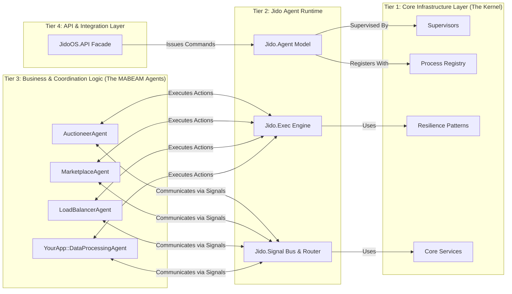

Understood. That clarification is important—it means our architecture's "top" layer isn't a traditional web front-end but rather a more abstract ML framework or orchestration layer. This makes the design even more relevant, as the boundary between our system and the "user" (the ML framework) needs to be clean and well-defined.

Let's refine the architecture and the `Boundary` setup to reflect this. We'll replace the "Presentation Layer" with a more appropriate "API & Integration Layer" designed to be consumed by an external ML framework.

### Revised Architecture (No Web App)

The core three tiers remain the same, but the top-level interface changes.



### Tier 4: The API & Integration Layer

Instead of a Phoenix app, we'll create a dedicated OTP application, `jido_api`, within our monorepo. This application serves as the **single, clean entry point** for the external ML framework. It embodies the **Facade** design pattern.

**Location**: `foundation/lib/jido_api/`

**Responsibilities**:

1.  **Expose a Public API**: This layer defines a clear, documented set of functions that the ML framework will call. It hides the complexity of agents, signals, and instructions.
2.  **Translate External Requests into Internal Commands**: It takes simple function calls from the ML framework and translates them into the `Jido.Instruction` or `Jido.Signal` format that the internal system understands.
3.  **Authentication & Authorization**: If needed, this is the layer where API keys are checked or permissions are enforced before passing a command to the internal system.
4.  **Entry Point for Supervision**: The `JidoAPI.Application` would be the root application started by the ML framework. It, in turn, would start the `FoundationKernel.Application`, which then starts the rest of the stack.

**Example `JidoAPI` module**:

```elixir
# foundation/lib/jido_api/api.ex

defmodule JidoAPI do
  @moduledoc "Public API for the JidoOS system, consumed by the external ML framework."

  alias JidoMabeam.Agents.AuctioneerAgent

  @doc """
  Initiates a resource auction.
  Takes a simple map of auction parameters from the ML framework.
  """
  def run_auction(auction_params) do
    # 1. Translate the request into a Jido Instruction
    instruction = %Jido.Instruction{
      action: JidoMabeam.Actions.Auction.CreateAuction,
      params: auction_params # Assuming params match the Action's schema
    }

    # 2. Send the command to the correct agent
    Jido.Agent.cmd(AuctioneerAgent, instruction)
  end

  @doc """
  Assigns a generic data processing task.
  """
  def process_data(data) do
    instruction = %Jido.Instruction{
      action: MyApp.DataActions.Process,
      params: %{data: data}
    }
    # Let the load balancer decide which agent gets the task
    Jido.Agent.cmd(JidoMabeam.Agents.LoadBalancerAgent, instruction)
  end
end
```

### Revised `Boundary` Usage Table

The table is updated to reflect `jido_api` as the top-level application instead of a web app.

| Tier | Application / Component | `use Boundary` Declaration | Rationale & Explanation |
|:---|:---|:---|:---|
| **1** | `foundation_kernel` | `use Boundary, top_level?: true, deps: [], exports: :all` | **Unchanged**. The Kernel remains the foundation with no internal dependencies and a fully public API for the layers above it. |
| **2** | `jido_runtime` | `use Boundary, top_level?: true, deps: [FoundationKernel], exports: [Jido.Agent, Jido.Action, Jido.Instruction, ...]` | **Unchanged**. The Runtime depends on the Kernel and exports its public API (the agent programming model). |
| **3** | `jido_mabeam` | `use Boundary, top_level?: true, deps: [JidoRuntime], exports: [JidoMabeam.Agents.AuctioneerAgent, ...]` | **Unchanged**. The Application logic depends on the Runtime to build agents and exports only the agent modules needed by the API layer. Internal skills and actions are not exported. |
| **4** | `jido_api` | `use Boundary, top_level?: true, deps: [JidoRuntime, JidoMabeam]` | **New Top Layer**. This is the API Facade. It depends on `JidoRuntime` to use `Jido.Agent.cmd/2` and `Jido.Instruction`. It depends on `JidoMabeam` to reference the specific agent modules (`AuctioneerAgent`) it needs to send commands to. It exports its own public API modules (`JidoAPI`). |

### How this Architecture Benefits the ML Framework

By formalizing this API layer, we create a powerful and clean separation between our Jido-based system and the ML framework that consumes it.

1.  **Stable Integration Point**: The ML framework only needs to know about the functions in `JidoAPI`. It doesn't need to know about `GenServers`, `Signals`, `Actions`, or even that the system is built with agents. The internal implementation can be completely refactored without breaking the integration, as long as the `JidoAPI` contract is maintained.
2.  **Simplified Interaction**: The ML framework developer doesn't need to construct complex `Instruction` or `Signal` structs. They just call a function: `JidoAPI.run_auction(%{...})`. All the internal complexity is hidden behind the facade.
3.  **Enforced Dependency Flow**: `Boundary` ensures that the internal agents in `jido_mabeam` cannot "reach out" and directly call functions in the ML framework. Communication must be explicit and flow through the defined channels (`JidoAPI` or a message bus), preventing a tangled mess of dependencies.
4.  **Clear Ownership**: It's perfectly clear where new public-facing functionality goes: into the `JidoAPI` module. It's also clear where the core business logic for that functionality goes: into a new or existing `Jido.Action` within the `jido_mabeam` application.

This structure creates a system that is robust, maintainable, and easy for an external framework to consume, while still providing all the power and autonomy of the underlying agent architecture.
