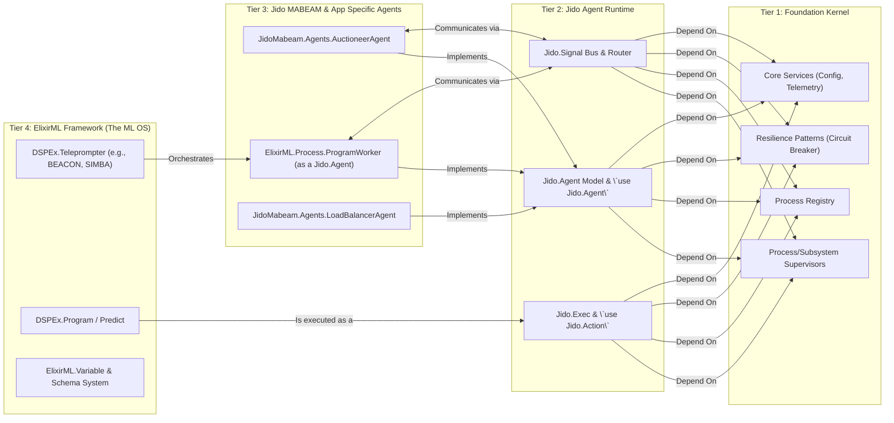

This is an excellent development. Seeing the `elixir_ml`/`dspex` framework that will be built on top of our system provides the perfect context to validate and concretize the proposed architecture.

The short answer is: **No, this does not fundamentally change the design; in fact, it powerfully validates and clarifies it.** The `elixir_ml` framework is the ideal "customer" for the `JidoOS` (our unified `foundation`/`jido`/`mabeam` system). It becomes the application-specific layer that consumes the generic agentic infrastructure we have designed.

Let's refine the architecture to show exactly how these two major systems integrate.

### The Refined Relationship: `JidoOS` as the Engine, `ElixirML` as the Application

Our unified system (which we'll call `JidoOS` for clarity) provides the runtime and orchestration engine. `ElixirML` builds upon it to create a specialized domain for ML program optimization.

*   `foundation_kernel` (Tier 1) + `jido_runtime` (Tier 2) = **The JidoOS Runtime**. Provides the generic agent model, supervision, communication, and infrastructure.
*   `jido_mabeam` (Tier 3) = **The JidoOS Standard Library for Agents**. Provides common, high-level agent types and skills (Auctioneer, Marketplace, etc.).
*   `elixir_ml` / `dspex` = **The Machine Learning Application Layer**. It defines its own set of specialized agents (`ProgramWorker`), actions (`DSPEx.Predict`), and coordination strategies (`Teleprompter`) that run on top of the JidoOS Runtime.

### Revised Architecture Diagram with `ElixirML`

### Component Placement: `elixir_ml` on `JidoOS`

Here is a table mapping key components from your `elixir_ml` tree into our proposed architecture. This shows how `elixir_ml` becomes a "citizen" or application on top of the generic `JidoOS`.

| `elixir_ml` Component | Role in New Architecture | Integration Point & Tier |
| :--- | :--- | :--- |
| `dspex/predict.ex` | This is a **Jido Action**. It's a fundamental unit of work: taking a signature and inputs and producing an output. `use DSPEx.Predict` becomes a specialized form of `use Jido.Action`. | **Tier 2/3**: Implements the `Jido.Action` behavior. |
| `elixir_ml/process/program_worker.ex` | This is a **Jido Agent**. A `ProgramWorker` is a long-running, stateful process whose primary job is to execute `DSPEx.Predict` actions. It `use Jido.Agent`. | **Tier 3**: An application-specific agent running on the Jido Runtime. |
| `dspex/teleprompter/*.ex` (e.g., BEACON) | These are **Orchestrator Agents**. A teleprompter like BEACON is a sophisticated `Jido.Agent` whose *task* is to coordinate other `ProgramWorker` agents, evaluate their performance, and optimize their configurations. | **Tier 3**: A high-level coordination agent that uses the Jido Runtime to manage other agents. |
| `dspex/client.ex` | This is an **Infrastructure Client**. It's responsible for making external HTTP calls to LLMs. | **Tier 1/3 Interface**: The client logic itself (building the request) is in Tier 3, but it **must** use the `FoundationKernel.Infrastructure` components (`CircuitBreaker`, `ConnectionManager`) from Tier 1 for resilience. |
| `dspex/adapter.ex` | An **Action Helper**. An adapter is a pure function module used *within* a `DSPEx.Predict` action to format data for a specific LLM provider. | **Tier 3**: Internal implementation detail of an Action. |
| `elixir_ml/schema/*.ex` | **Domain-Specific Type System**. Provides the rich, ML-aware data structures used within the `DSPEx.Predict` actions and agents. | **Tier 3/4**: Defines the data contracts for the `elixir_ml` application layer. |
| `elixir_ml/mabeam.ex` | This becomes the **API Facade** for the `elixir_ml` application, similar to the `JidoAPI` module we designed. It provides a clean entry point for users. | **Tier 4**: The public-facing API for the `elixir_ml` framework. |
| `elixir_ml/process/orchestrator.ex` & `program_supervisor.ex` | **Replaced by JidoOS Components**. The responsibility of starting, stopping, and supervising agents is now handled by `Jido.Agent.Server` and `FoundationKernel` supervisors. | **N/A**: Logic is absorbed by Tier 1 & 2. |
| `elixir_ml/process/tool_registry.ex` & `variable_registry.ex` | **Replaced by JidoOS Components**. `Jido.Action`s are the "tools," and they are discovered via `Jido.Discovery`. Variables are managed by the `JidoMabeam.VariableOrchestratorAgent`. | **N/A**: Logic is absorbed by Tier 1 & 3. |

### How It All Fits: A "Day in the Life" Example

Let's trace the `BEACON` teleprompter optimizing a program in this new, unified architecture.

1.  **Request (Tier 4)**: A user calls `DSPEx.Teleprompter.BEACON.compile(student, teacher, ...)`.

2.  **Orchestration (Tier 3)**:
    *   The `BEACON` function doesn't run in the user's process. Instead, it sends an `Instruction` to a long-running `BEACONAgent` (a `Jido.Agent`).
    *   The `BEACONAgent` receives the instruction to start an optimization run.
    *   It begins its optimization loop. For each trial, it needs to run the `student` program with a candidate configuration.

3.  **Agent Execution (Tier 2 & 3)**:
    *   The `BEACONAgent` sends an `Instruction` to a `ProgramWorker` agent (e.g., `:student_worker_1`). The instruction is simple: `Jido.Agent.cmd(worker_pid, DSPEx.Predict, %{...})`.
    *   The `ProgramWorker`'s `Jido.Agent.Server` (Tier 2) receives the command and executes the `DSPEx.Predict` action.

4.  **Infrastructure Interaction (Tier 1)**:
    *   The `DSPEx.Predict` action needs to call an LLM. It uses the `DSPEx.Client`.
    *   The `DSPEx.Client` makes a call through `FoundationKernel.Infrastructure.CircuitBreaker.execute(...)`.
    *   The `CircuitBreaker` uses a connection from the `FoundationKernel.Infrastructure.ConnectionManager` pool to make the actual HTTP request.
    *   All of this activity emits events to the `FoundationKernel.TelemetryService`.

5.  **Feedback Loop (Tier 2 & 3)**:
    *   The `ProgramWorker` completes its action and gets a result. It emits this result as a `Jido.Signal` onto the `Jido.Signal.Bus`.
    *   The `BEACONAgent` has a `Sensor` that is subscribed to these result signals. When it receives the result, it calculates the performance metric.
    *   Based on the metric, it generates the *next* candidate configuration and sends a new `Instruction` to another `ProgramWorker`, continuing the optimization loop.

### Conclusion: The Design Holds and Is Strengthened

Seeing the `elixir_ml` framework confirms the architectural design. It doesn't break it; it becomes its first and most important "customer."

*   **No Fundamental Change**: The 4-tier architecture (Kernel, Runtime, Application Agents, API) is exactly what is needed to host a complex system like `elixir_ml` without it becoming a tangled monolith.
*   **Clarification of Roles**:
    *   `foundation` + `jido` provide the **generic, reusable agent operating system (`JidoOS`)**.
    *   `elixir_ml` is the **specialized application suite** that runs on that OS. It defines the specific "apps" (agents) and "programs" (actions) for the ML domain.
*   **Immediate Benefits**: By migrating `elixir_ml` to run on top of this stack, it immediately gains:
    *   A single, unified process registry.
    *   Standardized resilience patterns (circuit breakers, rate limiters) for its LLM clients.
    *   A powerful, decoupled messaging system (`Jido.Signal.Bus`).
    *   A clear, testable, and composable unit of work (`Jido.Action`).

This integration creates a system where the concerns are perfectly separated, allowing both the underlying agent platform and the ML framework to evolve independently while remaining powerfully connected.
