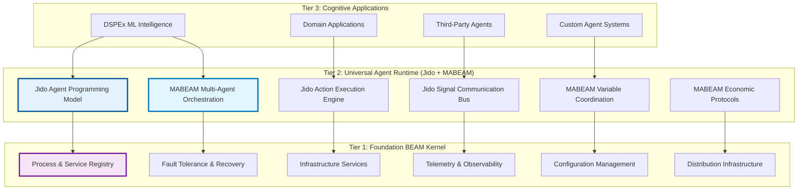

# The Foundation OS: World-Class Multi-Agent Architecture
**Version 1.0 - Revolutionary Integration Blueprint**  
**Date: June 27, 2025**

## Executive Summary: A Paradigm Shift in Multi-Agent Systems

After comprehensive analysis of the Foundation, MABEAM, Jido ecosystem, and DSPEx requirements, this document presents a revolutionary architectural vision that synthesizes the best of each component into a unified, world-class platform. The key insight is that we're not building separate frameworks, but rather **a universal multi-agent operating system** that naturally combines BEAM infrastructure, agent orchestration, and domain-specific intelligence.

The architecture transforms from a traditional layered approach to a **cognitive orchestration platform** where:
- **Foundation** becomes the universal BEAM kernel
- **Jido** provides the agent programming model and runtime
- **MABEAM** enables multi-agent coordination and optimization
- **DSPEx** delivers specialized ML intelligence

This creates the world's first production-ready multi-agent OS built on the BEAM's natural strengths.

## Core Architectural Vision

### The Three-Tier Unified Platform



## Revolutionary Integration Points

### 1. Foundation as Universal BEAM Kernel

Foundation evolves into the foundational kernel that provides:

**Core Infrastructure Services:**
- **Universal Process Registry**: Single source of truth for all agents, processes, and services
- **Fault-Tolerant Supervision**: OTP supervision trees optimized for multi-agent systems
- **Infrastructure Services**: Circuit breakers, rate limiters, connection management
- **Telemetry Platform**: Comprehensive observability for agent coordination
- **Configuration Management**: Dynamic configuration for distributed agent systems

**Architectural Decision**: Foundation remains domain-agnostic but agent-aware, providing the stable platform upon which all agent systems run.

### 2. Jido as Universal Agent Programming Model

Jido provides the canonical way to build and execute agents:

**Agent Programming Primitives:**
- **Agent Abstraction**: `use Jido.Agent` becomes the standard for all agent definitions
- **Action System**: `use Jido.Action` provides composable, validated units of work
- **Signal Communication**: Universal messaging between agents via `Jido.Signal`
- **Sensor Framework**: Event-driven agent inputs from external systems
- **Skill Composition**: Modular capabilities that can be attached to agents

**Revolutionary Insight**: Jido's action-based model naturally aligns with MABEAM's variable optimization and DSPEx's program structure.

### 3. MABEAM as Multi-Agent Coordination Layer

MABEAM provides the coordination intelligence that transforms individual agents into coherent teams:

**Coordination Capabilities:**
- **Variable Orchestration**: Universal parameter optimization across agent teams
- **Economic Protocols**: Auction, market, and consensus-based coordination
- **Resource Management**: Dynamic allocation of computational resources
- **Performance Optimization**: Continuous adaptation based on collective metrics
- **Fault Recovery**: Agent-aware recovery and rebalancing strategies

**Revolutionary Insight**: MABEAM variables become the universal coordination primitive, controlling not just parameters but entire agent ecosystems.

### 4. DSPEx as Specialized ML Intelligence

DSPEx leverages the unified platform to provide world-class ML capabilities:

**ML-Specific Features:**
- **Program-Agent Bridge**: DSPEx programs naturally become Jido agents
- **ML Variable Types**: Specialized variables for embeddings, probabilities, reasoning chains
- **Teleprompter Orchestration**: SIMBA, BEACON optimizing entire agent teams
- **Schema Validation**: ML-native data validation and transformation
- **Distributed Optimization**: Multi-agent teleprompters across the BEAM cluster

## Monorepo Architecture Strategy

### Unified Monorepo Structure

```
foundation/
├── lib/
│   ├── foundation/           # Tier 1: BEAM Kernel
│   │   ├── application.ex
│   │   ├── process_registry/
│   │   ├── infrastructure/
│   │   ├── services/
│   │   └── telemetry/
│   │
│   ├── jido/                # Tier 2: Agent Runtime (from agentjido/jido)
│   │   ├── application.ex
│   │   ├── agent.ex
│   │   ├── action.ex
│   │   ├── signal/
│   │   ├── sensor/
│   │   └── skill/
│   │
│   ├── jido_action/         # Tier 2: Action System (from agentjido/jido_action)
│   │   ├── exec.ex
│   │   ├── instruction.ex
│   │   └── actions/
│   │
│   ├── jido_signal/         # Tier 2: Communication (from agentjido/jido_signal)
│   │   ├── bus.ex
│   │   ├── router.ex
│   │   └── dispatch/
│   │
│   ├── mabeam/              # Tier 2: Multi-Agent Coordination
│   │   ├── orchestrator.ex
│   │   ├── coordination.ex
│   │   ├── economics.ex
│   │   └── variable_space.ex
│   │
│   └── dspex/               # Tier 3: ML Intelligence
│       ├── program.ex
│       ├── teleprompter/
│       ├── variable/
│       └── schema/
│
├── config/
├── test/
└── mix.exs
```

### Integration Philosophy

**Single Unified Application**: Instead of multiple applications, we create one comprehensive OTP application with clearly defined internal modules and dependencies.

**Benefits:**
- **Unified Testing**: Single test suite covering all integration points
- **Simplified Deployment**: One application to deploy and manage
- **Clear Dependencies**: Internal module dependencies are explicit and enforced
- **Maximum Cohesion**: All components designed to work together optimally

## Revolutionary Features

### 1. Universal Agent Orchestration

Every component in the system can be an agent:
- **DSPEx Programs** become Jido agents with MABEAM coordination
- **Foundation Services** can be agentized for dynamic management
- **User Applications** naturally participate in multi-agent coordination

### 2. Variables as Cognitive Control Planes

MABEAM variables evolve beyond parameter tuning to become universal coordinators:
- **Agent Selection**: Variables choose which agents are active for specific tasks
- **Resource Allocation**: Dynamic resource distribution based on performance
- **Communication Topology**: Variables control how agents communicate
- **Adaptation Strategies**: Continuous optimization of the entire system

### 3. Fault-Tolerant Multi-Agent Intelligence

The BEAM's natural fault tolerance extends to multi-agent coordination:
- **Agent Supervision**: OTP supervision trees for agent lifecycle management
- **Graceful Degradation**: System continues operating with reduced capabilities
- **Hot Code Swapping**: Update agent behavior without system downtime
- **Distributed Recovery**: Automatic recovery across BEAM cluster nodes

### 4. ML-Native Agent Programming

DSPEx programs gain all the benefits of the unified platform:
- **Action-Based ML**: ML operations become composable Jido actions
- **Signal-Driven Optimization**: Teleprompters coordinate via Jido signals
- **Variable Orchestration**: MABEAM optimizes entire ML workflows
- **Schema Validation**: Type-safe ML data flows throughout the system

## Implementation Strategy

### Phase 1: Foundation Integration (Weeks 1-2)
- Integrate Jido components into Foundation monorepo
- Establish unified OTP application structure
- Implement basic agent-Foundation integration
- Create comprehensive test infrastructure

### Phase 2: MABEAM Development (Weeks 3-4)
- Implement multi-agent variable orchestration
- Create coordination protocols and economic mechanisms
- Integrate with Foundation infrastructure services
- Develop agent lifecycle management

### Phase 3: DSPEx Integration (Weeks 5-6)
- Bridge DSPEx programs with Jido agent model
- Implement ML-specific variable types and validation
- Create teleprompter-agent orchestration
- Develop schema-signal integration

### Phase 4: Advanced Coordination (Weeks 7-8)
- Implement sophisticated coordination protocols
- Create performance optimization feedback loops
- Develop distributed agent management
- Build comprehensive monitoring and observability

## Success Metrics and Benefits

### Technical Excellence
- **Zero-Downtime Deployments**: Hot code swapping for all components
- **Linear Scalability**: Performance scales with BEAM cluster size
- **Sub-Second Fault Recovery**: OTP supervision ensures rapid recovery
- **Type Safety**: Comprehensive compile-time validation across all layers

### Developer Experience
- **Unified Programming Model**: Single way to build agents across all domains
- **Composable Actions**: Reusable units of work across different applications
- **Rich Telemetry**: Comprehensive observability into agent coordination
- **Clear Abstractions**: Well-defined boundaries between concerns

### Business Value
- **Universal Platform**: Single platform for any multi-agent application
- **Rapid Development**: Pre-built coordination and optimization capabilities
- **Production Ready**: Built on battle-tested BEAM infrastructure
- **Future Proof**: Designed for evolution and extension

## Comparison with Industry Standards

### vs. LangChain/LangGraph
- **Native Concurrency**: BEAM actor model vs. Python's GIL limitations
- **Fault Tolerance**: OTP supervision vs. manual error handling
- **Type Safety**: Elixir's type system vs. Python's dynamic typing
- **Performance**: BEAM's lightweight processes vs. heavy thread overhead

### vs. AutoGen/CrewAI
- **Infrastructure**: Built-in process management vs. external orchestration
- **Scalability**: Native distribution vs. single-machine limitations
- **Reliability**: OTP patterns vs. ad-hoc error handling
- **Flexibility**: Universal agent model vs. framework-specific constraints

### vs. Traditional BEAM Applications
- **Agent-Native**: First-class multi-agent support vs. retrofitted coordination
- **ML Integration**: Native ML capabilities vs. external ML frameworks
- **Variable Orchestration**: Universal optimization vs. manual parameter tuning
- **Cognitive Architecture**: Intelligent coordination vs. static supervision

## Revolutionary Impact

This architecture creates the world's first production-ready multi-agent operating system that:

1. **Unifies Best Practices**: Combines BEAM infrastructure, agent programming, and ML intelligence
2. **Enables Emergent Intelligence**: Agent teams can self-organize and optimize
3. **Scales Naturally**: Leverages BEAM's natural distribution and fault tolerance
4. **Accelerates Development**: Provides pre-built coordination and optimization
5. **Future-Proofs Applications**: Designed for continuous evolution and extension

The Foundation OS represents a paradigm shift from building applications to orchestrating intelligent agent ecosystems, positioning Elixir and the BEAM as the natural platform for the multi-agent AI revolution.

## Next Steps

The following documents detail the specific implementation strategy:
- **101_MONOREPO_STRUCTURE.md**: Detailed directory structure and dependencies
- **102_JIDO_INTEGRATION.md**: Jido component integration strategy
- **103_FOUNDATION_EVOLUTION.md**: Foundation adaptation and enhancement plans
- **104_DSPEX_INTEGRATION.md**: DSPEx-platform integration architecture

This architecture creates the foundation for a new era of intelligent, self-organizing systems built on the BEAM's unparalleled strengths.