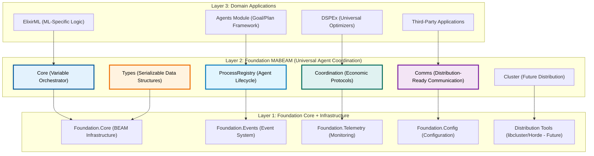

# Foundation MABEAM: Comprehensive Implementation Blueprint
**Version 3.0 - Unified Implementation Strategy**  
**Date: June 22, 2025**

## Executive Summary: A First Principles Approach

After a comprehensive review of the Foundation codebase, architectural documents, and implementation strategies, this document presents a unified, first-principles approach to implementing Foundation MABEAM as the universal multi-agent coordination kernel for the BEAM.

The key insight from the analysis is that we must build **incrementally and pragmatically** while maintaining **architectural purity**. This means starting with a solid single-node implementation that is explicitly designed for seamless evolution to distributed scenarios.

## Part 1: Architectural Foundation and First Principles

### Core Design Philosophy

The Foundation MABEAM system is built on these fundamental principles:

1. **Agent Identity Over Process Identity**: All APIs use durable `agent_id` instead of PIDs
2. **Serialization-First Data Structures**: Every structure avoids non-serializable terms
3. **Communication Abstraction**: Abstract local vs. remote calls from day one
4. **Asynchronous Coordination**: All protocols are non-blocking state machines
5. **Conflict Resolution Primitives**: Build distributed conflict handling locally first

### The Three-Layer Foundation Architecture

This architecture ensures:
- **Foundation MABEAM** is domain-agnostic and reusable
- **Clear separation** between infrastructure and application logic
- **Natural evolution** from single-node to distributed deployment
- **Maximum reusability** across different use cases

