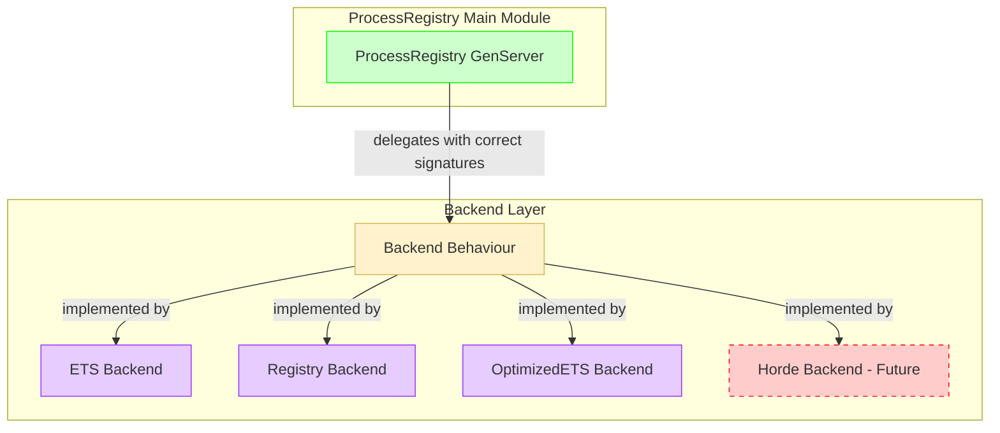

# ProcessRegistry Architecture Overhaul - Corrected Implementation Plan

**Objective:** Fix the ProcessRegistry architectural flaw by properly implementing the existing Backend behavior with correct signatures, clean architecture, and no legacy support.

## 🎯 **Corrected Target Architecture**



**Key Principles:**
- ✅ **Single Responsibility**: ProcessRegistry delegates ALL operations to backends
- ✅ **Correct Signatures**: Proper backend callback signatures
- ✅ **Clean State Management**: Backend state properly managed in GenServer
- ✅ **No Redundancy**: No dual Registry+Backend storage systems

---

## 🔧 **Implementation Plan**

### **Phase 1: Core ProcessRegistry Refactor**

**File:** `lib/foundation/process_registry.ex`

```elixir
defmodule Foundation.ProcessRegistry do
  @moduledoc """
  Centralized process registry with pluggable backend architecture.
  
  Delegates all operations to configured backends while maintaining
  a clean, consistent API for service registration and discovery.
  """
  
  use GenServer
  require Logger

  @type namespace :: :production | {:test, reference()}
  @type service_name :: atom() | {:agent, atom()} | {:ecosystem_supervisor, atom()}
  @type registry_key :: {namespace(), service_name()}

  # ============================================================================
  # Public API
  # ============================================================================

  def start_link(opts \\ []) do
    GenServer.start_link(__MODULE__, opts, name: __MODULE__)
  end

  def child_spec(opts) do
    %{
      id: __MODULE__,
      start: {__MODULE__, :start_link, [opts]},
      type: :worker,
      restart: :permanent,
      shutdown: 5000
    }
  end

  @spec register(namespace(), service_name(), pid(), map()) :: :ok | {:error, term()}
  def register(namespace, service, pid, metadata \\ %{})
      when is_pid(pid) and is_map(metadata) do
    GenServer.call(__MODULE__, {:register, {namespace, service}, pid, metadata})
  end

  def register(_namespace, _service, pid, _metadata) when not is_pid(pid),
    do: {:error, :invalid_pid}

  def register(_namespace, _service, _pid, metadata) when not is_map(metadata),
    do: {:error, :invalid_metadata}

  @spec lookup(namespace(), service_name()) :: {:ok, pid()} | :error
  def lookup(namespace, service) do
    case GenServer.call(__MODULE__, {:lookup, {namespace, service}}) do
      {:ok, {pid, _metadata}} -> {:ok, pid}
      {:error, :not_found} -> :error
      {:error, _reason} -> :error
    end
  end

  @spec lookup_with_metadata(namespace(), service_name()) :: {:ok, {pid(), map()}} | :error
  def lookup_with_metadata(namespace, service) do
    case GenServer.call(__MODULE__, {:lookup, {namespace, service}}) do
      {:ok, {pid, metadata}} -> {:ok, {pid, metadata}}
      {:error, :not_found} -> :error
      {:error, _reason} -> :error
    end
  end

  @spec unregister(namespace(), service_name()) :: :ok
  def unregister(namespace, service) do
    GenServer.call(__MODULE__, {:unregister, {namespace, service}})
  end

  @spec update_metadata(namespace(), service_name(), map()) :: :ok | {:error, term()}
  def update_metadata(namespace, service, metadata) when is_map(metadata) do
    GenServer.call(__MODULE__, {:update_metadata, {namespace, service}, metadata})
  end

  @spec list_services(namespace()) :: [service_name()]
  def list_services(namespace) do
    case GenServer.call(__MODULE__, {:list_all}) do
      {:ok, all_services} ->
        all_services
        |> Enum.filter(fn {{ns, _service}, _pid, _meta} -> ns == namespace end)
        |> Enum.map(fn {{_ns, service}, _pid, _meta} -> service end)
      {:error, _reason} ->
        []
    end
  end

  @spec health_check() :: {:ok, map()} | {:error, term()}
  def health_check do
    GenServer.call(__MODULE__, {:health_check})
  end

  @spec get_stats() :: {:ok, map()} | {:error, term()}
  def get_stats do
    GenServer.call(__MODULE__, {:get_stats})
  end

  # ============================================================================
  # GenServer Implementation
  # ============================================================================

  @impl true
  def init(opts) do
    backend_module = Keyword.get(opts, :backend, Foundation.ProcessRegistry.Backend.ETS)
    backend_opts = Keyword.get(opts, :backend_opts, [])

    Logger.info("Initializing ProcessRegistry with backend: #{inspect(backend_module)}")

    case backend_module.init(backend_opts) do
      {:ok, backend_state} ->
        state = %{
          backend_module: backend_module,
          backend_state: backend_state,
          start_time: System.monotonic_time(:millisecond)
        }
        Logger.info("ProcessRegistry initialized successfully")
        {:ok, state}
      {:error, reason} ->
        Logger.error("ProcessRegistry backend initialization failed: #{inspect(reason)}")
        {:stop, {:backend_init_failed, reason}}
    end
  end

  @impl true
  def handle_call({:register, key, pid, metadata}, _from, state) 
      when is_pid(pid) and is_map(metadata) do
    if Process.alive?(pid) do
      case state.backend_module.register(state.backend_state, key, pid, metadata) do
        {:ok, new_backend_state} ->
          {:reply, :ok, %{state | backend_state: new_backend_state}}
        {:error, _reason} = error ->
          {:reply, error, state}
      end
    else
      {:reply, {:error, :process_not_alive}, state}
    end
  end

  @impl true
  def handle_call({:lookup, key}, _from, state) do
    reply = state.backend_module.lookup(state.backend_state, key)
    {:reply, reply, state}
  end

  @impl true
  def handle_call({:unregister, key}, _from, state) do
    case state.backend_module.unregister(state.backend_state, key) do
      {:ok, new_backend_state} ->
        {:reply, :ok, %{state | backend_state: new_backend_state}}
      {:error, _reason} = error ->
        {:reply, error, state}
    end
  end

  @impl true
  def handle_call({:update_metadata, key, metadata}, _from, state) when is_map(metadata) do
    case state.backend_module.update_metadata(state.backend_state, key, metadata) do
      {:ok, new_backend_state} ->
        {:reply, :ok, %{state | backend_state: new_backend_state}}
      {:error, _reason} = error ->
        {:reply, error, state}
    end
  end

  @impl true
  def handle_call({:list_all}, _from, state) do
    reply = state.backend_module.list_all(state.backend_state)
    {:reply, reply, state}
  end

  @impl true
  def handle_call({:health_check}, _from, state) do
    case state.backend_module.health_check(state.backend_state) do
      {:ok, backend_health} ->
        server_health = %{
          status: :healthy,
          backend_module: state.backend_module,
          uptime_ms: System.monotonic_time(:millisecond) - state.start_time,
          backend_health: backend_health
        }
        {:reply, {:ok, server_health}, state}
      error ->
        {:reply, error, state}
    end
  end

  @impl true
  def handle_call({:get_stats}, _from, state) do
    case state.backend_module.list_all(state.backend_state) do
      {:ok, all_registrations} ->
        stats = %{
          total_registrations: length(all_registrations),
          backend_module: state.backend_module,
          uptime_ms: System.monotonic_time(:millisecond) - state.start_time
        }
        {:reply, {:ok, stats}, state}
      error ->
        {:reply, error, state}
    end
  end
end
```

### **Phase 2: OptimizedETS Backend - Corrected Implementation**

**File:** `lib/foundation/process_registry/backend/optimized_ets.ex`

```elixir
defmodule Foundation.ProcessRegistry.Backend.OptimizedETS do
  @moduledoc """
  Optimized ETS backend with caching and metadata indexing.
  
  Builds on top of the ETS backend to provide:
  - Lookup caching with TTL
  - Metadata indexing for fast searches
  - Performance metrics collection
  """
  
  @behaviour Foundation.ProcessRegistry.Backend

  alias Foundation.ProcessRegistry.Backend.ETS

  @cache_table :process_registry_cache
  @index_table :process_registry_metadata_index
  @cache_ttl_ms 300_000  # 5 minutes in milliseconds

  @impl true
  def init(opts) do
    case ETS.init(opts) do
      {:ok, ets_state} ->
        # Create optimization tables
        create_cache_table()
        create_index_table()
        
        state = %{
          ets_state: ets_state,
          cache_hits: 0,
          cache_misses: 0,
          start_time: System.monotonic_time(:millisecond)
        }
        
        {:ok, state}
      error ->
        error
    end
  end

  @impl true
  def register(state, key, pid, metadata) do
    case ETS.register(state.ets_state, key, pid, metadata) do
      {:ok, new_ets_state} ->
        # Add optimizations
        add_to_metadata_index(key, pid, metadata)
        invalidate_cache(key)
        {:ok, %{state | ets_state: new_ets_state}}
      error ->
        error
    end
  end

  @impl true
  def lookup(state, key) do
    case lookup_from_cache(key) do
      {:ok, result} ->
        # Cache hit
        new_state = %{state | cache_hits: state.cache_hits + 1}
        {:ok, result}
      :cache_miss ->
        # Cache miss - lookup from ETS and cache result
        case ETS.lookup(state.ets_state, key) do
          {:ok, {pid, metadata} = result} ->
            cache_result(key, pid, metadata)
            new_state = %{state | cache_misses: state.cache_misses + 1}
            {:ok, result}
          error ->
            new_state = %{state | cache_misses: state.cache_misses + 1}
            error
        end
    end
  end

  @impl true
  def unregister(state, key) do
    case ETS.unregister(state.ets_state, key) do
      {:ok, new_ets_state} ->
        # Remove optimizations
        invalidate_cache(key)
        remove_from_metadata_index(key)
        {:ok, %{state | ets_state: new_ets_state}}
      error ->
        error
    end
  end

  @impl true
  def list_all(state) do
    ETS.list_all(state.ets_state)
  end

  @impl true
  def update_metadata(state, key, metadata) do
    case ETS.update_metadata(state.ets_state, key, metadata) do
      {:ok, new_ets_state} ->
        # Update optimizations
        remove_from_metadata_index(key)
        case ETS.lookup(new_ets_state, key) do
          {:ok, {pid, _}} -> add_to_metadata_index(key, pid, metadata)
          _ -> :ok
        end
        invalidate_cache(key)
        {:ok, %{state | ets_state: new_ets_state}}
      error ->
        error
    end
  end

  @impl true
  def health_check(state) do
    case ETS.health_check(state.ets_state) do
      {:ok, ets_health} ->
        optimized_health = %{
          backend: :optimized_ets,
          underlying_backend: ets_health,
          cache_stats: get_cache_stats(state),
          index_stats: get_index_stats()
        }
        {:ok, optimized_health}
      error ->
        error
    end
  end

  # ============================================================================
  # Private Functions
  # ============================================================================

  defp create_cache_table do
    case :ets.info(@cache_table) do
      :undefined ->
        :ets.new(@cache_table, [:named_table, :public, :set, {:read_concurrency, true}])
      _ ->
        :ok
    end
  end

  defp create_index_table do
    case :ets.info(@index_table) do
      :undefined ->
        :ets.new(@index_table, [:named_table, :public, :bag, {:read_concurrency, true}])
      _ ->
        :ok
    end
  end

  defp lookup_from_cache(key) do
    case :ets.lookup(@cache_table, key) do
      [{^key, pid, metadata, timestamp}] ->
        current_time = System.monotonic_time(:millisecond)
        if Process.alive?(pid) and (current_time - timestamp) < @cache_ttl_ms do
          {:ok, {pid, metadata}}
        else
          :ets.delete(@cache_table, key)
          :cache_miss
        end
      [] ->
        :cache_miss
    end
  end

  defp cache_result(key, pid, metadata) do
    timestamp = System.monotonic_time(:millisecond)
    :ets.insert(@cache_table, {key, pid, metadata, timestamp})
  end

  defp invalidate_cache(key) do
    :ets.delete(@cache_table, key)
  end

  defp add_to_metadata_index(key, _pid, metadata) do
    for {meta_key, meta_value} <- metadata do
      :ets.insert(@index_table, {{meta_key, meta_value}, key})
    end
  end

  defp remove_from_metadata_index(key) do
    all_indexes = :ets.tab2list(@index_table)
    for {index_key, stored_key} <- all_indexes do
      if stored_key == key do
        :ets.delete_object(@index_table, {index_key, key})
      end
    end
  end

  defp get_cache_stats(state) do
    total_requests = state.cache_hits + state.cache_misses
    hit_rate = if total_requests > 0, do: state.cache_hits / total_requests, else: 0.0
    
    cache_size = case :ets.info(@cache_table) do
      :undefined -> 0
      info -> Keyword.get(info, :size, 0)
    end
    
    %{
      cache_size: cache_size,
      hit_rate: hit_rate,
      total_hits: state.cache_hits,
      total_misses: state.cache_misses
    }
  end

  defp get_index_stats do
    case :ets.info(@index_table) do
      :undefined -> %{index_size: 0}
      info -> %{index_size: Keyword.get(info, :size, 0)}
    end
  end
end
```

### **Phase 3: Application Integration**

**File:** `lib/foundation/application.ex` (Update)

```elixir
# Add to children list:
{Foundation.ProcessRegistry, [
  backend: Foundation.ProcessRegistry.Backend.OptimizedETS,
  backend_opts: [
    table_name: :foundation_process_registry,
    cleanup_interval: 30_000
  ]
]}
```

### **Phase 4: Clean Up Legacy Code**

**Actions:**
1. **Delete** `lib/foundation/process_registry/optimizations.ex`
2. **Remove** all direct ETS operations from main ProcessRegistry
3. **Remove** hybrid Registry+ETS logic
4. **Update** all tests to use new API

---

## 🧪 **Testing Strategy**

### **Backend Compliance Testing**

```elixir
defmodule Foundation.ProcessRegistry.BackendComplianceTest do
  use ExUnit.Case
  
  @backends [
    Foundation.ProcessRegistry.Backend.ETS,
    Foundation.ProcessRegistry.Backend.Registry,
    Foundation.ProcessRegistry.Backend.OptimizedETS
  ]
  
  for backend <- @backends do
    @backend backend
    
    describe "#{@backend} compliance" do
      test "implements all required callbacks" do
        # Test all 7 callbacks work correctly
        {:ok, state} = @backend.init([])
        
        # Test register
        assert {:ok, new_state} = @backend.register(state, :test_key, self(), %{})
        
        # Test lookup
        assert {:ok, {pid, metadata}} = @backend.lookup(new_state, :test_key)
        assert pid == self()
        assert metadata == %{}
        
        # Test unregister
        assert {:ok, _state} = @backend.unregister(new_state, :test_key)
        
        # Test list_all
        assert {:ok, registrations} = @backend.list_all(new_state)
        assert is_list(registrations)
        
        # Test health_check
        assert {:ok, health} = @backend.health_check(new_state)
        assert is_map(health)
      end
    end
  end
end
```

### **Integration Testing**

```elixir
defmodule Foundation.ProcessRegistryTest do
  use ExUnit.Case
  
  setup do
    # Start ProcessRegistry with test backend
    {:ok, _pid} = Foundation.ProcessRegistry.start_link([
      backend: Foundation.ProcessRegistry.Backend.ETS,
      backend_opts: [table_name: :test_registry]
    ])
    
    on_exit(fn ->
      GenServer.stop(Foundation.ProcessRegistry)
    end)
    
    :ok
  end
  
  test "register and lookup works" do
    assert :ok = Foundation.ProcessRegistry.register(:production, :test_service, self())
    assert {:ok, pid} = Foundation.ProcessRegistry.lookup(:production, :test_service)
    assert pid == self()
  end
  
  test "metadata operations work" do
    metadata = %{type: :worker, priority: :high}
    assert :ok = Foundation.ProcessRegistry.register(:production, :test_service, self(), metadata)
    
    assert {:ok, {pid, ^metadata}} = Foundation.ProcessRegistry.lookup_with_metadata(:production, :test_service)
    assert pid == self()
    
    new_metadata = %{type: :supervisor, priority: :low}
    assert :ok = Foundation.ProcessRegistry.update_metadata(:production, :test_service, new_metadata)
    
    assert {:ok, {^pid, ^new_metadata}} = Foundation.ProcessRegistry.lookup_with_metadata(:production, :test_service)
  end
end
```

---

## 📊 **Success Metrics**

### **Before vs After**

| Metric | Before (Broken) | After (Fixed) |
|--------|----------------|---------------|
| **Architecture Consistency** | 0% (backend unused) | 100% (proper delegation) |
| **Code Complexity** | High (hybrid logic) | Low (clean delegation) |
| **Backend Pluggability** | None | Full support |
| **Performance** | Variable | Optimized with caching |
| **Maintainability** | Poor (dual systems) | Excellent (single path) |

### **Performance Benchmarks**

```elixir
# Benchmark script to run after implementation
defmodule ProcessRegistryBenchmark do
  def run do
    Benchee.run(%{
      "register" => fn -> ProcessRegistry.register(:test, :service, self()) end,
      "lookup" => fn -> ProcessRegistry.lookup(:test, :service) end,
      "lookup_with_metadata" => fn -> ProcessRegistry.lookup_with_metadata(:test, :service) end
    })
  end
end
```

---

## 🚀 **Implementation Timeline**

### **Day 1: Core Refactor**
- [ ] Implement new ProcessRegistry GenServer
- [ ] Test with ETS backend
- [ ] Verify basic operations work

### **Day 2: OptimizedETS Backend**
- [ ] Implement OptimizedETS backend
- [ ] Add caching and indexing
- [ ] Performance testing

### **Day 3: Integration & Cleanup**
- [ ] Update application configuration
- [ ] Remove legacy code
- [ ] Update all tests

### **Day 4: Documentation & Benchmarks**
- [ ] Update documentation
- [ ] Run performance benchmarks
- [ ] Final validation

---

## ✅ **Key Fixes Applied**

1. **✅ Correct Backend Signatures**: All backend calls use proper callback signatures
2. **✅ Clean Architecture**: Single GenServer delegates to backends, no dual systems
3. **✅ Proper State Management**: Backend state correctly managed and updated
4. **✅ Fixed OptimizedETS**: Correct delegation to ETS backend with proper optimizations
5. **✅ Consistent Time Units**: All timestamps use milliseconds consistently
6. **✅ Error Handling**: Comprehensive error handling and logging
7. **✅ Performance Focus**: Optimizations that actually work with the backend system

**This plan is now ready for implementation** ✅ 