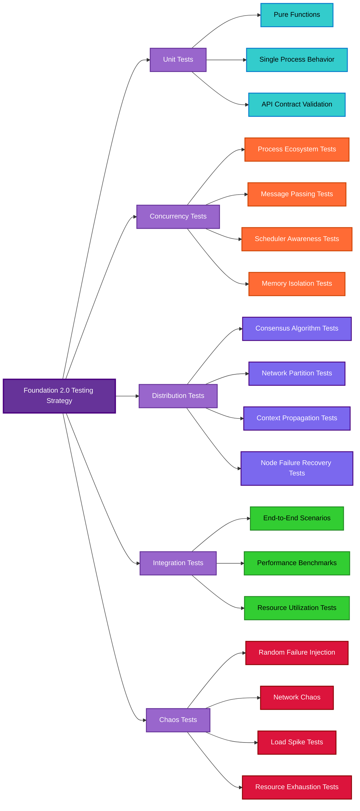

# Testing Concurrency and Distribution in Foundation 2.0

## Executive Summary

Testing concurrent and distributed systems is fundamentally different from testing sequential code. This document outlines Foundation 2.0's comprehensive testing strategy that addresses the unique challenges of BEAM concurrency, distributed coordination, and process ecosystem verification.

## The Challenge: Why Distributed/Concurrent Testing is Hard

### **Concurrency Testing Challenges**
1. **Non-deterministic behavior** - Race conditions, timing dependencies
2. **State space explosion** - Multiple processes with independent state
3. **Timing sensitivity** - Tests may pass/fail based on scheduler timing
4. **Resource contention** - Shared resources creating bottlenecks
5. **Process lifecycle complexity** - Spawning, monitoring, termination coordination

### **Distribution Testing Challenges**
1. **Network partitions** - Simulating split-brain scenarios
2. **Node failures** - Graceful and ungraceful node termination
3. **Message ordering** - Distributed message delivery guarantees
4. **Consensus verification** - Ensuring distributed agreement works
5. **Context propagation** - Verifying trace context flows across nodes

### **BEAM-Specific Testing Challenges**
1. **Scheduler behavior** - Multiple schedulers, reduction counting
2. **Memory management** - Per-process GC, binary reference counting
3. **Hot code loading** - Testing code upgrades without downtime
4. **Port isolation** - External process communication
5. **Distribution protocol** - Native BEAM clustering behavior

## Foundation 2.0 Testing Architecture



## Testing Strategy by Layer

### **Layer 1: Unit Tests (Foundation)**
**Purpose:** Test individual functions and modules in isolation

```elixir
# Example: Testing pure functions
defmodule Foundation.BEAM.ProcessesTest do
  use ExUnit.Case, async: true
  
  test "ecosystem_config validation" do
    valid_config = %{
      coordinator: MyCoordinator,
      workers: {MyWorker, count: 5}
    }
    
    assert {:ok, _} = Foundation.BEAM.Processes.validate_config(valid_config)
  end
end
```

**Characteristics:**
- Fast execution (< 1ms per test)
- Deterministic results
- No shared state
- Mock external dependencies

### **Layer 2: Concurrency Tests (The Hard Part)**
**Purpose:** Test process interactions, message passing, and ecosystem behavior

#### **2.1 Process Ecosystem Tests**

```elixir
defmodule Foundation.BEAM.ProcessesEcosystemTest do
  use ExUnit.Case, async: false  # Cannot be async!
  
  @tag :concurrency
  test "ecosystem spawns correct number of processes" do
    config = %{
      coordinator: TestCoordinator,
      workers: {TestWorker, count: 10}
    }
    
    {:ok, ecosystem} = Foundation.BEAM.Processes.spawn_ecosystem(config)
    
    # Verify process count
    {:ok, info} = Foundation.BEAM.Processes.ecosystem_info(ecosystem)
    assert info.total_processes == 11  # 1 coordinator + 10 workers
    
    # Verify all processes are alive
    assert Process.alive?(ecosystem.coordinator)
    assert Enum.all?(ecosystem.workers, &Process.alive?/1)
    
    # Cleanup
    Foundation.BEAM.Processes.shutdown_ecosystem(ecosystem)
  end
  
  test "ecosystem survives worker crashes" do
    # Test fault tolerance
    config = %{
      coordinator: TestCoordinator,
      workers: {TestWorker, count: 5},
      fault_tolerance: :self_healing
    }
    
    {:ok, ecosystem} = Foundation.BEAM.Processes.spawn_ecosystem(config)
    
    # Kill a worker
    [worker | _] = ecosystem.workers
    Process.exit(worker, :kill)
    
    # Wait for healing
    :timer.sleep(100)
    
    # Verify ecosystem is still healthy
    {:ok, info} = Foundation.BEAM.Processes.ecosystem_info(ecosystem)
    assert info.total_processes == 6  # Should have respawned
  end
end
```

#### **2.2 Message Passing Tests**

```elixir
defmodule Foundation.BEAM.MessagesTest do
  use ExUnit.Case, async: false
  
  @tag :concurrency
  test "optimized message passing preserves data integrity" do
    large_data = generate_large_binary(1_000_000)  # 1MB
    
    receiver = spawn(fn ->
      receive do
        {:data, received_data} ->
          send(test_pid(), {:received, byte_size(received_data)})
      end
    end)
    
    # Use optimized sending
    Foundation.BEAM.Messages.send_optimized(receiver, {:data, large_data})
    
    assert_receive {:received, 1_000_000}, 1000
  end
  
  test "flow control prevents mailbox overflow" do
    # Create a slow receiver
    slow_receiver = spawn(fn -> slow_receiver_loop() end)
    
    # Send many messages rapidly
    results = for i <- 1..1000 do
      Foundation.BEAM.Messages.send_with_flow_control(slow_receiver, {:msg, i})
    end
    
    # Should get backpressure errors
    assert Enum.any?(results, fn result -> 
      match?({:error, :backpressure}, result)
    end)
  end
end
```

#### **2.3 Scheduler Awareness Tests**

```elixir
defmodule Foundation.BEAM.SchedulersTest do
  use ExUnit.Case, async: false
  
  @tag :scheduler
  test "cpu_intensive_with_yielding doesn't block schedulers" do
    # Start monitoring scheduler utilization
    :erlang.system_flag(:scheduler_wall_time, true)
    start_time = :erlang.statistics(:scheduler_wall_time)
    
    # Run CPU-intensive work
    large_work = 1..100_000 |> Enum.to_list()
    
    task = Task.async(fn ->
      Foundation.BEAM.Schedulers.cpu_intensive_with_yielding(large_work, fn item ->
        # Simulate CPU work
        :math.pow(item, 2)
      end)
    end)
    
    # Run other work in parallel to ensure schedulers aren't blocked
    other_task = Task.async(fn ->
      for _i <- 1..1000, do: :timer.sleep(1)
    end)
    
    # Both should complete without scheduler starvation
    Task.await(task, 5000)
    Task.await(other_task, 5000)
    
    end_time = :erlang.statistics(:scheduler_wall_time)
    
    # Verify scheduler utilization was reasonable
    utilization = calculate_scheduler_utilization(start_time, end_time)
    assert utilization < 0.95  # No scheduler should be 100% utilized
  end
end
```

### **Layer 3: Distribution Tests (The Really Hard Part)**
**Purpose:** Test distributed coordination, consensus, and cross-node behavior

#### **3.1 Multi-Node Test Setup**

```elixir
defmodule Foundation.DistributedTestCase do
  @moduledoc """
  Base case for distributed testing.
  
  Automatically sets up a multi-node cluster for testing
  distributed functionality.
  """
  
  use ExUnit.CaseTemplate
  
  using do
    quote do
      import Foundation.DistributedTestCase
      
      setup_all do
        nodes = start_test_cluster(3)  # Start 3-node cluster
        on_exit(fn -> stop_test_cluster(nodes) end)
        %{nodes: nodes}
      end
    end
  end
  
  def start_test_cluster(node_count) do
    # Start multiple nodes for testing
    base_name = "foundation_test"
    
    nodes = for i <- 1..node_count do
      node_name = :"#{base_name}_#{i}@127.0.0.1"
      
      {:ok, node} = :slave.start(
        '127.0.0.1', 
        :"#{base_name}_#{i}",
        '-pa #{:code.get_path() |> Enum.join(" -pa ")}'
      )
      
      # Load Foundation on each node
      :rpc.call(node, :code, :add_paths, [:code.get_path()])
      :rpc.call(node, Application, :ensure_all_started, [:foundation])
      
      node
    end
    
    # Connect nodes to form cluster
    for node <- nodes do
      Node.connect(node)
    end
    
    nodes
  end
  
  def stop_test_cluster(nodes) do
    for node <- nodes do
      :slave.stop(node)
    end
  end
end
```

#### **3.2 Consensus Algorithm Tests**

```elixir
defmodule Foundation.Distributed.ConsensusTest do
  use Foundation.DistributedTestCase
  
  @tag :distributed
  test "raft consensus works across nodes", %{nodes: nodes} do
    # Start Raft cluster
    cluster_config = %{
      nodes: nodes,
      algorithm: :raft,
      election_timeout: 1000
    }
    
    {:ok, cluster} = Foundation.Distributed.Consensus.start_cluster(cluster_config)
    
    # Wait for leader election
    :timer.sleep(2000)
    
    # Verify leader exists
    {:ok, leader} = Foundation.Distributed.Consensus.get_leader(cluster)
    assert leader in nodes
    
    # Test consensus on a decision
    proposal = %{action: :update_config, key: :test_value, value: 42}
    
    {:ok, decision} = Foundation.Distributed.Consensus.reach_consensus(
      cluster,
      proposal,
      quorum: :majority,
      timeout: 5000
    )
    
    assert decision.committed == true
    assert decision.term > 0
    
    # Verify all nodes have the same state
    states = for node <- nodes do
      :rpc.call(node, Foundation.Distributed.Consensus, :get_state, [cluster])
    end
    
    assert Enum.uniq(states) |> length() == 1  # All states identical
  end
  
  test "consensus survives single node failure", %{nodes: [node1, node2, node3]} do
    cluster_config = %{nodes: [node1, node2, node3], algorithm: :raft}
    {:ok, cluster} = Foundation.Distributed.Consensus.start_cluster(cluster_config)
    
    # Wait for stable cluster
    :timer.sleep(2000)
    
    # Kill one node
    :slave.stop(node3)
    
    # Cluster should still reach consensus with majority
    proposal = %{action: :test_resilience, value: "after_failure"}
    
    {:ok, decision} = Foundation.Distributed.Consensus.reach_consensus(
      cluster,
      proposal,
      quorum: :majority,
      timeout: 5000
    )
    
    assert decision.committed == true
  end
end
```

#### **3.3 Context Propagation Tests**

```elixir
defmodule Foundation.Distributed.ContextTest do
  use Foundation.DistributedTestCase
  
  @tag :distributed
  test "context propagates across node boundaries", %{nodes: [node1, node2, _node3]} do
    trace_id = Foundation.Utils.generate_id()
    user_id = "test_user_123"
    
    # Start context on node1
    result = :rpc.call(node1, Foundation.Distributed.Context, :with_global_context, [
      %{trace_id: trace_id, user_id: user_id},
      fn ->
        # Call function on node2 from within context
        :rpc.call(node2, __MODULE__, :extract_context_on_remote_node, [])
      end
    ])
    
    # Verify context was preserved across node boundary
    assert {:ok, remote_context} = result
    assert remote_context.trace_id == trace_id
    assert remote_context.user_id == user_id
  end
  
  def extract_context_on_remote_node do
    case Foundation.Distributed.Context.current() do
      nil -> {:error, :no_context}
      context -> {:ok, context}
    end
  end
  
  test "context survives multiple hops", %{nodes: [node1, node2, node3]} do
    trace_id = Foundation.Utils.generate_id()
    
    # node1 -> node2 -> node3 -> back to node1
    result = :rpc.call(node1, Foundation.Distributed.Context, :with_global_context, [
      %{trace_id: trace_id, hop: 1},
      fn ->
        :rpc.call(node2, __MODULE__, :context_hop, [node3, node1])
      end
    ])
    
    assert {:ok, final_context} = result
    assert final_context.trace_id == trace_id
    assert final_context.hop == 4  # Should have incremented through hops
  end
  
  def context_hop(next_node, final_node) do
    current = Foundation.Distributed.Context.current()
    updated = Map.update!(current, :hop, &(&1 + 1))
    
    Foundation.Distributed.Context.with_global_context(updated, fn ->
      if next_node == final_node do
        Foundation.Distributed.Context.current()
      else
        :rpc.call(next_node, __MODULE__, :context_hop, [final_node, final_node])
      end
    end)
  end
end
```

#### **3.4 Network Partition Tests**

```elixir
defmodule Foundation.Distributed.PartitionTest do
  use Foundation.DistributedTestCase
  
  @tag :distributed
  @tag :partition
  test "system handles network partitions gracefully", %{nodes: [node1, node2, node3]} do
    # Start distributed service
    cluster_config = %{nodes: [node1, node2, node3]}
    {:ok, cluster} = Foundation.Distributed.Coordination.start_cluster(cluster_config)
    
    # Simulate network partition: isolate node3
    simulate_network_partition([node1, node2], [node3])
    
    # Majority partition should continue operating
    {:ok, status} = :rpc.call(node1, Foundation.Distributed.Coordination, :cluster_status, [cluster])
    assert status.operational == true
    assert status.quorum == true
    
    # Minority partition should recognize it's isolated
    {:ok, isolated_status} = :rpc.call(node3, Foundation.Distributed.Coordination, :cluster_status, [cluster])
    assert isolated_status.operational == false
    assert isolated_status.quorum == false
    
    # Heal the partition
    heal_network_partition([node1, node2, node3])
    
    # Wait for cluster healing
    :timer.sleep(3000)
    
    # All nodes should be operational again
    final_statuses = for node <- [node1, node2, node3] do
      :rpc.call(node, Foundation.Distributed.Coordination, :cluster_status, [cluster])
    end
    
    assert Enum.all?(final_statuses, fn {:ok, status} -> 
      status.operational == true 
    end)
  end
  
  defp simulate_network_partition(partition1, partition2) do
    # Disconnect nodes between partitions
    for n1 <- partition1, n2 <- partition2 do
      :rpc.call(n1, Node, :disconnect, [n2])
      :rpc.call(n2, Node, :disconnect, [n1])
    end
  end
  
  defp heal_network_partition(all_nodes) do
    # Reconnect all nodes
    for n1 <- all_nodes, n2 <- all_nodes, n1 != n2 do
      :rpc.call(n1, Node, :connect, [n2])
    end
  end
end
```

### **Layer 4: Chaos Testing (The Really, Really Hard Part)**
**Purpose:** Test system behavior under random failures and extreme conditions

```elixir
defmodule Foundation.ChaosTest do
  use Foundation.DistributedTestCase
  
  @tag :chaos
  @tag timeout: 60_000  # Long timeout for chaos tests
  test "system survives random chaos", %{nodes: nodes} do
    # Start full Foundation 2.0 system
    cluster_config = %{
      nodes: nodes,
      services: [:config, :events, :telemetry, :consensus, :coordination]
    }
    
    {:ok, cluster} = Foundation.start_distributed_cluster(cluster_config)
    
    # Run chaos for 30 seconds
    chaos_duration = 30_000
    chaos_pid = spawn(fn -> chaos_monkey(nodes, chaos_duration) end)
    
    # Run normal workload during chaos
    workload_pid = spawn(fn -> normal_workload(cluster, chaos_duration) end)
    
    # Wait for both to complete
    receive do
      {:chaos_complete, chaos_results} ->
        receive do
          {:workload_complete, workload_results} ->
            # Analyze results
            assert workload_results.success_rate > 0.8  # 80% success during chaos
            assert chaos_results.failures_injected > 10  # Significant chaos
        after 35_000 ->
          flunk("Workload didn't complete")
        end
    after 35_000 ->
      flunk("Chaos didn't complete")
    end
  end
  
  defp chaos_monkey(nodes, duration) do
    start_time = System.monotonic_time(:millisecond)
    failures_injected = chaos_loop(nodes, start_time, duration, 0)
    
    send(self(), {:chaos_complete, %{failures_injected: failures_injected}})
  end
  
  defp chaos_loop(nodes, start_time, duration, failures) do
    current_time = System.monotonic_time(:millisecond)
    
    if current_time - start_time > duration do
      failures
    else
      # Random chaos action
      case :rand.uniform(5) do
        1 -> kill_random_process(nodes)
        2 -> network_partition_random(nodes)
        3 -> memory_pressure(nodes)
        4 -> cpu_spike(nodes)
        5 -> message_flood(nodes)
      end
      
      :timer.sleep(:rand.uniform(1000))  # Random delay
      chaos_loop(nodes, start_time, duration, failures + 1)
    end
  end
  
  defp normal_workload(cluster, duration) do
    # Simulate normal application workload
    start_time = System.monotonic_time(:millisecond)
    
    results = workload_loop(cluster, start_time, duration, %{
      total_operations: 0,
      successful_operations: 0,
      failed_operations: 0
    })
    
    success_rate = results.successful_operations / results.total_operations
    
    send(self(), {:workload_complete, %{
      success_rate: success_rate,
      total_operations: results.total_operations
    }})
  end
end
```

## Testing Infrastructure and Utilities

### **Test Data Generators**

```elixir
defmodule Foundation.TestDataGenerators do
  @moduledoc """
  StreamData generators for property-based testing of concurrent systems.
  """
  
  use ExUnitProperties
  
  def ecosystem_config do
    gen all coordinator <- atom(:alphanumeric),
            worker_module <- atom(:alphanumeric),
            worker_count <- integer(1..100),
            memory_strategy <- member_of([:isolated_heaps, :shared_heap]),
            gc_strategy <- member_of([:frequent_minor, :standard]) do
      %{
        coordinator: coordinator,
        workers: {worker_module, count: worker_count},
        memory_strategy: memory_strategy,
        gc_strategy: gc_strategy
      }
    end
  end
  
  def message_payload do
    gen all size <- integer(1..1_000_000),
            content <- binary(length: size) do
      %{data: content, metadata: %{size: size, timestamp: System.monotonic_time()}}
    end
  end
  
  def distributed_operation do
    gen all operation <- atom(:alphanumeric),
            nodes <- list_of(atom(:alphanumeric), min_length: 1, max_length: 10),
            timeout <- integer(1000..30_000) do
      %{
        operation: operation,
        target_nodes: nodes,
        timeout: timeout,
        consensus_required: boolean()
      }
    end
  end
end
```

### **Test Helpers and Utilities**

```elixir
defmodule Foundation.TestHelpers do
  @moduledoc """
  Utility functions for testing concurrent and distributed systems.
  """
  
  def wait_for_condition(condition_fn, timeout \\ 5000, check_interval \\ 100) do
    end_time = System.monotonic_time(:millisecond) + timeout
    wait_loop(condition_fn, end_time, check_interval)
  end
  
  defp wait_loop(condition_fn, end_time, check_interval) do
    if System.monotonic_time(:millisecond) > end_time do
      {:error, :timeout}
    else
      if condition_fn.() do
        :ok
      else
        :timer.sleep(check_interval)
        wait_loop(condition_fn, end_time, check_interval)
      end
    end
  end
  
  def measure_memory_usage(fun) do
    before = :erlang.memory()
    result = fun.()
    after_mem = :erlang.memory()
    
    usage = for {type, after_val} <- after_mem do
      before_val = Keyword.get(before, type, 0)
      {type, after_val - before_val}
    end
    
    {result, usage}
  end
  
  def assert_eventually(condition, timeout \\ 5000) do
    case wait_for_condition(condition, timeout) do
      :ok -> :ok
      {:error, :timeout} -> 
        ExUnit.Assertions.flunk("Condition was not met within #{timeout}ms")
    end
  end
  
  def capture_telemetry(event_name, timeout \\ 1000) do
    test_pid = self()
    
    handler_id = :test_handler
    :telemetry.attach(handler_id, event_name, fn _event, measurements, metadata, _config ->
      send(test_pid, {:telemetry_event, measurements, metadata})
    end, %{})
    
    receive do
      {:telemetry_event, measurements, metadata} ->
        :telemetry.detach(handler_id)
        {:ok, measurements, metadata}
    after timeout ->
      :telemetry.detach(handler_id)
      {:error, :timeout}
    end
  end
end
```

## Test Execution Strategy

### **Test Categories and Tagging**

```elixir
# test/test_helper.exs
ExUnit.configure(exclude: [:distributed, :chaos, :slow, :stress])

# To run different test suites:
# mix test                          # Unit tests only
# mix test --include concurrency    # Include concurrency tests
# mix test --include distributed    # Include distributed tests  
# mix test --include chaos          # Include chaos tests
# mix test --include stress         # Include stress tests
```

### **CI/CD Pipeline Testing**

```yaml
# .github/workflows/test.yml
name: Foundation 2.0 Test Suite

on: [push, pull_request]

jobs:
  unit-tests:
    runs-on: ubuntu-latest
    steps:
      - uses: actions/checkout@v2
      - name: Setup Elixir
        uses: erlef/setup-beam@v1
      - name: Install dependencies
        run: mix deps.get
      - name: Run unit tests
        run: mix test
        
  concurrency-tests:
    runs-on: ubuntu-latest
    steps:
      - uses: actions/checkout@v2
      - name: Setup Elixir
        uses: erlef/setup-beam@v1
      - name: Install dependencies
        run: mix deps.get
      - name: Run concurrency tests
        run: mix test --include concurrency
        
  distributed-tests:
    runs-on: ubuntu-latest
    strategy:
      matrix:
        nodes: [3, 5]  # Test with different cluster sizes
    steps:
      - uses: actions/checkout@v2
      - name: Setup Elixir
        uses: erlef/setup-beam@v1
      - name: Install dependencies
        run: mix deps.get
      - name: Run distributed tests
        run: mix test --include distributed
        env:
          TEST_CLUSTER_SIZE: ${{ matrix.nodes }}
          
  chaos-tests:
    runs-on: ubuntu-latest
    if: github.ref == 'refs/heads/main'  # Only on main branch
    steps:
      - uses: actions/checkout@v2
      - name: Setup Elixir
        uses: erlef/setup-beam@v1
      - name: Install dependencies
        run: mix deps.get
      - name: Run chaos tests
        run: mix test --include chaos
        timeout-minutes: 15
```

## Performance and Benchmarking

### **Benchmark Tests**

```elixir
defmodule Foundation.BenchmarkTest do
  use ExUnit.Case
  
  @tag :benchmark
  test "ecosystem performance benchmarks" do
    # Benchmark ecosystem creation
    {creation_time, _} = :timer.tc(fn ->
      Foundation.BEAM.Processes.spawn_ecosystem(%{
        coordinator: BenchmarkCoordinator,
        workers: {BenchmarkWorker, count: 1000}
      })
    end)
    
    # Should create 1000 processes in under 100ms
    assert creation_time < 100_000  # microseconds
    
    # Benchmark message throughput
    {message_time, _} = :timer.tc(fn ->
      send_messages_to_ecosystem(ecosystem, 10_000)
    end)
    
    # Should handle 10k messages in under 1 second
    assert message_time < 1_000_000  # microseconds
  end
end
```

## Key Testing Principles

### **1. Deterministic Test Design**
- Use explicit timeouts instead of arbitrary sleeps
- Control randomness with seeds
- Isolate shared resources
- Use proper setup/teardown

### **2. Failure Mode Testing**
- Test every possible failure scenario
- Verify graceful degradation
- Test recovery mechanisms
- Validate error propagation

### **3. Performance Validation**
- Establish performance baselines
- Test under load conditions
- Verify resource cleanup
- Monitor memory leaks

### **4. Real-World Simulation**
- Test with realistic data sizes
- Simulate production load patterns
- Test with network latency
- Validate with production-like configurations

## Conclusion

Testing Foundation 2.0's concurrent and distributed capabilities requires a multi-layered approach:

1. **Unit tests** validate individual components
2. **Concurrency tests** verify process interactions
3. **Distribution tests** validate cluster behavior  
4. **Chaos tests** ensure resilience under failure
5. **Performance tests** validate scalability

This comprehensive testing strategy ensures Foundation 2.0 delivers on its promise of being the definitive BEAM concurrency framework while maintaining the reliability and performance that production systems demand.

The key insight is that **testing distributed concurrent systems is fundamentally different from testing sequential code**—it requires patience, proper tooling, and a deep understanding of the failure modes unique to concurrent and distributed systems.