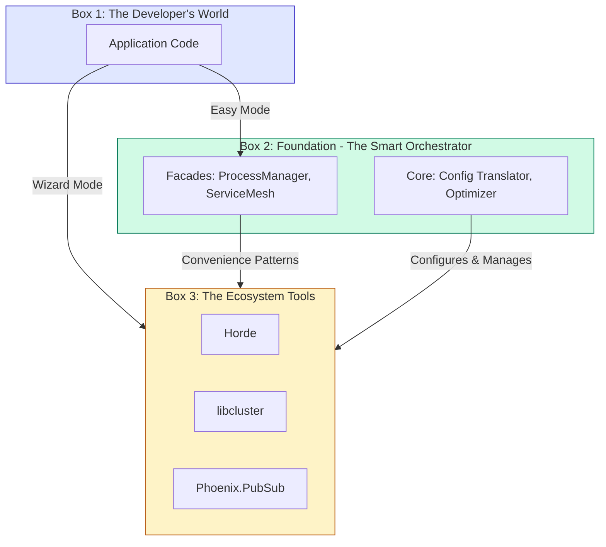

# Foundation 2.0: Conceptual Models & Mental Frameworks

**Purpose**: This document provides the mental models to reason about Foundation 2.0. It's not about code; it's about how to *think* about the architecture.

## 1. The Three-Box Model: Interacting with Foundation

The "Leaky Abstraction" philosophy can be visualized as three nested boxes. A developer can choose to interact at any level.


*   **Box 1 (Your App):** You write your business logic.
*   **Box 2 (Foundation):** You use Foundation's simple facades for common tasks (`start_singleton`). Foundation translates this into complex interactions with the tools in Box 3.
*   **Box 3 (Ecosystem Tools):** When you need raw power, your code can "reach through" Foundation and talk directly to Horde, libcluster, etc. Foundation ensures these tools are configured and running, but it doesn't block you from using them.

**Mental Model**: Think of Foundation as a helpful senior engineer. It gives you simple functions for common tasks but is happy to let you take the wheel and use the underlying tools directly when you have a specific, complex need.

## 2. The Lifecycle of a Distributed Process

When you call `Foundation.ProcessManager.start_singleton`, the process goes through a clear lifecycle across the cluster. Understanding this is key to avoiding race conditions.

1.  **`LOCAL_START`**: The process is started via `Horde.DynamicSupervisor` on the local node. It has a PID but is not yet globally registered.
2.  **`REGISTERING`**: `Horde.Registry.register` is called. The registration intent is now part of the local node's CRDT state.
3.  **`SYNCING`**: Horde's background gossip protocol sends the CRDT delta to other nodes. There is a window of time (typically <250ms) where other nodes do not yet see the process. **This is the most critical phase to understand.**
4.  **`GLOBAL_ACTIVE`**: All nodes have received the CRDT update and the process is globally discoverable via `Horde.Registry.lookup`.
5.  **`MIGRATING`**: If the hosting node goes down, Horde detects this. A new process is started on another node (`LOCAL_START`), and the registry entry is updated to point to the new PID.
6.  **`TERMINATED`**: The process is stopped, and the registration is removed globally.

**Mental Model**: Distributed processes are not instantly global. There's a "propagation delay." Facades can offer helpers to wait for global consistency, e.g., `start_singleton(..., wait_for_sync: true)`.

## 3. The Cluster Event Bus Model

Foundation's Channels are not magic. They are an application-level "event bus" built on a shared transport.

```mermaid
graph TD
    subgraph BEAM Cluster
        direction LR
        NodeA[Node A]
        NodeB[Node B]
        NodeA <-->|Single TCP Connection<br/>(Distributed Erlang)| NodeB
    end
    
    subgraph PubSub Topics [Application-Layer Channels via Phoenix.PubSub]
        direction LR
        TopicControl[Topic: "foundation:control"]
        TopicEvents[Topic: "foundation:events"]
        TopicData[Topic: "foundation:data"]
    end
    
    AppA[App on Node A] -- "Urgent Msg" --> TopicControl
    AppB[App on Node B] -- "Large Payload" --> TopicData
    
    TopicControl --> NodeA
    TopicData --> NodeA
```

**Mental Model**: Imagine one big highway (the Distributed Erlang TCP connection) between two cities (nodes).
*   **Without Channels**: All traffic (trucks, motorcycles, ambulances) is in one lane. A slow truck (large data message) blocks the ambulance (urgent control message). This is head-of-line blocking.
*   **With Channels**: The highway is still one road, but we've created logical "carpool" and "emergency" lanes *by agreement*. The `Phoenix.PubSub` process on each node acts as a traffic controller, picking messages off the topics and sending them. While a very large message can still saturate the physical link, OTP's scheduler and buffering ensure that messages from different topics are interleaved, dramatically reducing the *perceived* blocking for high-priority messages.
