ok so let's re-imagine this vision without using Partisan. Let's consider using libcluster. lets consider mdnslite. let's imagine what our founndation architecture should look like to support a variety of clsutering use cases -- i.e. be flexible -- but also provide an opininated, batteries included, miniaml config needed way to achiev clustering for mortals. i have related project elixir_scope that will be an integrated component for acutally building and debugging these apps thats just to give you an idea. elixir_scope uses foundation. same for my DSPy port ds_ex reimagined for BEAM -- same idea. we want foundation to make it easy to build clustered OTP apps but be ultimnately configurable under the hood (with defualt configs for the easy uses) to achieve as many use cases as possible include multi clustering. leverage existing elixir tools as much as possible for this. Re-arch our vision for the ultimate distribution framework building on the best tools.

**CRITICAL ADDITION**: Foundation 2.1 must also include MABEAM (Multi-Agent BEAM) as a core capability. This adds intelligent multi-agent coordination on top of the distributed infrastructure. MABEAM provides:

1. **Universal Variable Orchestrator**: Coordinates agents across the entire BEAM cluster
2. **Agent Lifecycle Management**: OTP-supervised agent processes with health monitoring  
3. **Coordination Protocols**: Consensus, negotiation, auction, and market-based coordination
4. **Advanced Coordination**: Game-theoretic protocols and adaptive strategies
5. **Comprehensive Telemetry**: Agent performance metrics and coordination analytics

This makes Foundation 2.1 + MABEAM the only framework that handles both "connecting the nodes" AND "coordinating the intelligence" - essential for modern AI/ML applications, distributed optimization, and intelligent system orchestration. ````` === BATTLE_PLAN_LIBCLUSTER_PARTISAN.md ===
# Foundation 2.0: Libcluster-Partisan Battle Plan

## Executive Summary

Foundation 2.0 combines the **best of both worlds**: deep BEAM primitives for local concurrency excellence with Partisan-powered distribution that obsoletes libcluster. This unified approach creates the first framework that's both BEAM-native and enterprise-distributed, positioning Foundation as the definitive platform for next-generation distributed BEAM applications.

## Strategic Synthesis: Current Progress + Partisan Vision

### **Current Foundation Assessment (15% Complete)**

#### ✅ **Proven Foundation 1.x Assets**
- **25 passing tests** - Stable production foundation
- **v0.1.4 on Hex** - Established user base and API
- **Complete core services**: Config, Events, Telemetry, Error, Infrastructure
- **4-layer architecture** - Solid architectural foundation

#### 🏗️ **In-Progress BEAM Primitives**
- **Foundation.BEAM.Processes** ✅ - Process ecosystems implemented
- **Foundation.BEAM.Messages** ❌ - Not started
- **Foundation.BEAM.Schedulers** ❌ - Not started
- **Foundation.BEAM.Memory** ❌ - Not started
- **Foundation.BEAM.Distribution** ❌ - **OPPORTUNITY FOR PARTISAN**

#### 🎯 **Revolutionary Opportunity**
The original battle plan's `Foundation.BEAM.Distribution` module is the **perfect integration point** for Partisan. Instead of building basic BEAM distribution, we can leapfrog to revolutionary Partisan-powered capabilities.

## Comparative Analysis: Original vs Partisan Vision

### **Original Battle Plan Strengths**
- ✅ **BEAM-native approach** - Deep integration with runtime primitives
- ✅ **Process ecosystems** - Revolutionary local concurrency patterns
- ✅ **Solid progression** - Build up from primitives to distributed systems
- ✅ **Backward compatibility** - Preserve Foundation 1.x APIs

### **Original Battle Plan Limitations**
- ❌ **Basic distribution** - Limited to traditional Distributed Erlang
- ❌ **No clustering innovation** - Doesn't address libcluster limitations
- ❌ **Sequential approach** - Distributed capabilities come late (Phase 4)

### **10030.md Partisan Vision Strengths**
- ✅ **Revolutionary distribution** - Partisan replaces libcluster entirely
- ✅ **Scalability breakthrough** - 1000+ nodes vs ~200 with Distributed Erlang
- ✅ **Network innovation** - Multi-channel, dynamic topologies
- ✅ **Immediate differentiation** - Clear competitive advantage

### **10030.md Partisan Vision Gaps**
- ❌ **Missing BEAM primitives** - Doesn't leverage unique runtime features
- ❌ **Distribution-only focus** - Limited local concurrency innovation
- ❌ **High complexity** - Partisan learning curve without stepping stones

## Unified Strategic Vision: Foundation 2.0 Libcluster-Partisan

### **Core Philosophy**
Foundation 2.0 = **BEAM Primitives Excellence** + **Partisan Distribution Revolution**

The synthesis approach:
1. **Enhance proven Foundation 1.x** - Zero breaking changes, added capabilities
2. **Complete BEAM primitives** - Revolutionary local concurrency patterns
3. **Integrate Partisan as distribution layer** - Replace traditional clustering
4. **Bridge local and distributed** - Seamless progression from single-node to cluster

## Foundation 2.0 Unified Architecture

```mermaid
graph TD
    A[Foundation 2.0: BEAM-Native + Partisan-Distributed] --> B[Enhanced Core Services]
    A --> C[BEAM Primitives Layer] 
    A --> D[Partisan Distribution Layer]
    A --> E[Process Ecosystems Layer]
    A --> F[Intelligent Infrastructure Layer]
    
    B --> B1[Config 2.0: Enhanced + Distributed]
    B --> B2[Events 2.0: Enhanced + Partisan Channels]
    B --> B3[Telemetry 2.0: Enhanced + Cluster Aggregation]
    B --> B4[Registry 2.0: Enhanced + Service Mesh]
    
    C --> C1[Processes: Ecosystems ✅]
    C --> C2[Messages: Binary Optimization]
    C --> C3[Schedulers: Reduction Awareness]
    C --> C4[Memory: Atom Safety + GC Patterns]
    
    D --> D1[Distribution: Partisan Integration]
    D --> D2[Channels: Multi-channel Communication]
    D --> D3[Topology: Dynamic Network Management]
    D --> D4[Discovery: Multi-strategy Node Discovery]
    
    E --> E1[Coordination: Partisan-aware Ecosystems]
    E --> E2[Communication: Cross-node Messaging]
    E --> E3[Supervision: Distributed Process Trees]
    E --> E4[Patterns: Mesh/Tree/Ring across Cluster]
    
    F --> F1[Adaptive: Self-optimizing Topologies]
    F --> F2[Prediction: Predictive Scaling]
    F --> F3[Healing: Self-recovery Mechanisms]
    F --> F4[Context: Global Request Tracing]

    %% Styling
    classDef primary fill:#6B46C1,stroke:#4C1D95,stroke-width:3px,color:#FFFFFF
    classDef secondary fill:#9333EA,stroke:#6B21A8,stroke-width:2px,color:#FFFFFF
    classDef partisan fill:#EF4444,stroke:#B91C1C,stroke-width:3px,color:#FFFFFF
    classDef beam fill:#10B981,stroke:#047857,stroke-width:2px,color:#FFFFFF
    classDef enhanced fill:#F59E0B,stroke:#D97706,stroke-width:2px,color:#FFFFFF
    classDef intelligent fill:#3B82F6,stroke:#1D4ED8,stroke-width:2px,color:#FFFFFF

    class A primary
    class B,E,F secondary
    class D,D1,D2,D3,D4 partisan
    class C,C1,C2,C3,C4 beam
    class B1,B2,B3,B4 enhanced
    class F1,F2,F3,F4 intelligent
```



## Implementation Roadmap: Parallel Track Strategy

### **Track 1: BEAM Primitives (Foundation Excellence)**
Complete the revolutionary local concurrency capabilities

### **Track 2: Partisan Integration (Distribution Revolution)** 
Replace libcluster with Partisan-powered distribution

### **Track 3: Unified Features (Bridging Innovation)**
Seamlessly integrate local and distributed capabilities

## Phase-by-Phase Implementation Plan

### **Phase 1: Parallel Foundation (Weeks 1-3)**
**Objective**: Complete BEAM primitives while establishing Partisan foundation

#### **Week 1: BEAM Primitives Completion**
**Track 1: Complete BEAM Layer**
- [ ] **Foundation.BEAM.Messages** - Binary-optimized messaging
  - Smart message passing with copy minimization
  - Flow control and backpressure
  - IOList optimization for binary construction
- [ ] **Foundation.BEAM.Memory** - Memory management patterns
  - Binary optimization (ref-counted sharing)
  - Atom safety (prevent table exhaustion)
  - GC isolation patterns
- [ ] **Enhance Foundation.BEAM.Processes** - Add advanced ecosystem patterns
  - Mesh, ring, tree topologies for local ecosystems
  - Cross-ecosystem communication
  - Advanced supervision patterns

**Track 2: Partisan Foundation**
- [ ] **Foundation.BEAM.Distribution** - Partisan integration core
  - Add Partisan as dependency
  - Basic Partisan configuration management
  - Environment detection (dev/test/prod topologies)
- [ ] **Partisan Compatibility Layer** - libcluster API compatibility
  - Support existing libcluster configurations
  - Migration utilities from libcluster
  - Backward compatibility testing

#### **Week 2: Partisan Core Implementation**
**Track 2: Core Partisan Features**
- [ ] **Foundation.Distributed.Topology** - Dynamic topology management
  - Full-mesh, HyParView, client-server strategies
  - Automatic topology switching based on cluster size
  - Performance monitoring and optimization
- [ ] **Foundation.Distributed.Channels** - Multi-channel communication
  - Separate channels for coordination, events, telemetry
  - Channel prioritization and QoS
  - Head-of-line blocking elimination
- [ ] **Foundation.Distributed.Discovery** - Enhanced node discovery
  - Kubernetes, Consul, DNS, static configurations
  - Multi-strategy discovery with failover
  - Health monitoring and automatic reconnection

**Track 1: BEAM Primitives Testing**
- [ ] Comprehensive testing of all BEAM primitives
- [ ] Performance benchmarking vs traditional approaches
- [ ] Memory usage optimization validation

#### **Week 3: Integration Foundation**
**Track 3: Bridge Local + Distributed**
- [ ] **Foundation.BEAM.Distribution** - Complete Partisan integration
  - Replace any Distributed Erlang usage with Partisan
  - Multi-node ecosystem support
  - Cross-node process coordination
- [ ] **Enhanced Process Ecosystems** - Partisan-aware ecosystems
  - Distributed process spawning across Partisan cluster
  - Cross-node supervision trees
  - Fault tolerance across network partitions

### **Phase 2: Enhanced Core Services with Partisan (Weeks 4-6)**
**Objective**: Transform Foundation 1.x services into distributed, Partisan-powered capabilities

#### **Week 4: Distributed Configuration & Events**
- [ ] **Foundation.Config 2.0** - Partisan-distributed configuration
  - Cluster-wide configuration synchronization via Partisan channels
  - Consensus-based configuration updates
  - Conflict resolution with intelligent merging
  - Adaptive configuration learning
  - **100% API Compatibility**: All Foundation.Config APIs unchanged
- [ ] **Foundation.Events 2.0** - Partisan-powered event streaming
  - Distributed event emission across Partisan cluster
  - Intelligent event correlation using cluster topology
  - Event routing optimization via Partisan channels
  - Predictive event patterns and anomaly detection
  - **100% API Compatibility**: All Foundation.Events APIs unchanged

#### **Week 5: Distributed Telemetry & Registry**
- [ ] **Foundation.Telemetry 2.0** - Cluster-wide metrics via Partisan
  - Metrics aggregation across Partisan cluster
  - Predictive monitoring with anomaly detection
  - Performance optimization recommendations
  - Adaptive thresholds based on cluster behavior
  - **100% API Compatibility**: All Foundation.Telemetry APIs unchanged
- [ ] **Foundation.ServiceRegistry 2.0** - Service mesh capabilities
  - Cross-cluster service discovery via Partisan
  - Intelligent load balancing and routing
  - Health monitoring and automatic failover
  - Service mesh topology awareness
  - **100% API Compatibility**: All Foundation.ServiceRegistry APIs unchanged

#### **Week 6: Process Registry & Error Correlation**
- [ ] **Foundation.ProcessRegistry 2.0** - Distributed process coordination
  - Cluster-wide process registration via Partisan
  - Cross-node process lookup and monitoring
  - Distributed supervision trees
  - Process migration and load balancing
  - **100% API Compatibility**: All Foundation.ProcessRegistry APIs unchanged
- [ ] **Foundation.Error 2.0** - Distributed error correlation
  - Error pattern learning across cluster
  - Cascade prediction and prevention
  - Proactive error detection
  - Cross-cluster error context propagation

### **Phase 3: Advanced Distributed Coordination (Weeks 7-9)**
**Objective**: Revolutionary distributed concurrency patterns impossible with traditional clustering

#### **Week 7: Context & State Management**
- [ ] **Foundation.Distributed.Context** - Global context propagation
  - Request tracing across Partisan topologies
  - Context flowing through async operations
  - Distributed debugging support
  - Cross-network boundary context preservation
- [ ] **Foundation.Distributed.State** - Distributed state management
  - CRDTs with Partisan broadcast optimization
  - Conflict-free replicated data types
  - Eventually consistent distributed state
  - Partition tolerance strategies

#### **Week 8: Consensus & Coordination**
- [ ] **Foundation.Distributed.Consensus** - Raft over Partisan channels
  - Leader election with topology awareness
  - Distributed decision making
  - Quorum-based operations
  - Network partition handling
- [ ] **Foundation.Distributed.Coordination** - Advanced coordination primitives
  - Distributed locks and barriers
  - Cross-cluster synchronization
  - Partition-tolerant coordination
  - Performance-optimized coordination patterns

#### **Week 9: Ecosystem Distribution**
- [ ] **Foundation.Ecosystems.Distributed** - Cross-cluster process ecosystems
  - Distributed process societies
  - Cross-node ecosystem coordination
  - Fault tolerance across network boundaries
  - Intelligent process placement
- [ ] **Foundation.Ecosystems.Communication** - Advanced distributed messaging
  - Cross-ecosystem communication patterns
  - Partisan-optimized message routing
  - Distributed backpressure and flow control

### **Phase 4: Intelligent Infrastructure (Weeks 10-12)**
**Objective**: Self-managing, adaptive distributed systems

#### **Week 10: Adaptive Systems**
- [ ] **Foundation.Intelligence.AdaptiveTopology** - Self-optimizing networks
  - Learn from message patterns and latency
  - Automatic Partisan topology reconfiguration
  - Performance-driven network optimization
  - Load-aware topology switching
- [ ] **Foundation.Intelligence.PredictiveScaling** - Predictive node management
  - Workload prediction and scaling
  - Resource utilization optimization
  - Proactive cluster scaling
  - Cost optimization strategies

#### **Week 11: Failure Prediction & Healing**
- [ ] **Foundation.Intelligence.FailurePrediction** - Proactive failure detection
  - Pattern recognition for failure prediction
  - Network partition prediction
  - Performance degradation early warning
  - Preventive measures and mitigation
- [ ] **Foundation.Intelligence.Healing** - Self-healing distributed systems
  - Automatic recovery from failures
  - Topology healing after partitions
  - Process ecosystem recovery
  - Performance regression healing

#### **Week 12: Evolution & Optimization**
- [ ] **Foundation.Intelligence.Evolution** - System evolution
  - System adaptation based on load patterns
  - Automatic optimization learning
  - Long-term performance improvement
  - Cluster evolution strategies
- [ ] **Complete Integration Testing** - End-to-end validation
  - Multi-node cluster testing
  - Partition tolerance validation
  - Performance benchmarking vs libcluster
  - Migration testing from traditional setups

## API Evolution Strategy: Zero Breaking Changes

### **Foundation 1.x APIs (Unchanged)**
```elixir
# All existing APIs work exactly the same
Foundation.Config.get([:ai, :provider])           # ✅ SAME
Foundation.Events.new_event(:test, %{data: "test"}) # ✅ SAME  
Foundation.Telemetry.emit_counter([:requests], %{}) # ✅ SAME
Foundation.ServiceRegistry.register(:prod, :service, self()) # ✅ SAME
```

### **Foundation 2.0 Enhanced APIs (Additive)**
```elixir
# Enhanced capabilities - optional upgrades
Foundation.Config.set_cluster_wide([:feature, :enabled], true)
Foundation.Config.enable_adaptive_config([:auto_optimize, :predict_needs])

Foundation.Events.emit_distributed(:user_action, data, correlation: :global)
Foundation.Events.subscribe_cluster_wide([:user_action, :system_event])
Foundation.Events.enable_intelligent_correlation()

Foundation.Telemetry.get_cluster_metrics(aggregation: :sum)
Foundation.Telemetry.enable_predictive_monitoring([:memory_pressure])
Foundation.Telemetry.detect_performance_anomalies()

Foundation.ServiceRegistry.register_mesh_service(:api, self(), capabilities: [:http])
Foundation.ServiceRegistry.discover_services(capability: :ml_inference)
Foundation.ServiceRegistry.route_to_best_instance(:api, request_context)
```

### **Foundation 2.0 Revolutionary APIs (New Capabilities)**
```elixir
# BEAM primitives - impossible with traditional approaches
Foundation.BEAM.Processes.spawn_ecosystem(%{
  coordinator: DataCoordinator,
  workers: {DataProcessor, count: 100},
  memory_strategy: :isolated_heaps,
  distribution: :cluster_wide
})

Foundation.BEAM.Messages.send_optimized(pid, large_data,
  strategy: :ref_counted_binary,
  channel: :high_priority,
  flow_control: :automatic
)

# Partisan distribution - revolutionary clustering
Foundation.Distributed.Topology.switch_topology(:full_mesh, :hyparview)
Foundation.Distributed.Context.with_global_context(%{
  request_id: uuid,
  trace_id: trace_id
}) do
  # Context flows across ALL network boundaries automatically
  RemoteNode.complex_operation(data)
end

# Intelligent infrastructure - self-managing systems
Foundation.Intelligence.create_adaptive_infrastructure(:my_cluster, %{
  learns_from: [:telemetry, :error_patterns, :load_patterns],
  adapts: [:topology, :process_counts, :memory_allocation],
  optimizes_for: [:latency, :throughput, :cost_efficiency]
})
```

## Competitive Positioning: Foundation 2.0 vs The World

### **vs. Traditional libcluster + Distributed Erlang**
| Feature | libcluster + Disterl | Foundation 2.0 |
|---------|---------------------|-----------------|
| **Node Scaling** | ~200 nodes | 1000+ nodes |
| **Network Architecture** | Single TCP, full-mesh | Multi-channel, adaptive topology |
| **Head-of-line Blocking** | Yes (major limitation) | No (eliminated via channels) |
| **Dynamic Topology** | No | Yes (runtime switching) |
| **Context Propagation** | Manual/None | Automatic across all boundaries |
| **Intelligent Features** | None | Predictive, adaptive, self-healing |
| **BEAM Integration** | Basic | Deep primitives integration |
| **Local Concurrency** | Standard OTP | Revolutionary process ecosystems |

### **vs. External Platforms (Kubernetes, Service Mesh)**
| Feature | External Platforms | Foundation 2.0 |
|---------|-------------------|-----------------|
| **Integration** | External, complex | Native, seamless |
| **Performance** | Network overhead | BEAM-optimized |
| **Fault Tolerance** | Infrastructure-level | Process-level + infrastructure |
| **Context** | Limited, manual | Automatic, comprehensive |
| **Learning Curve** | High (new platforms) | Natural (BEAM-native) |
| **Operational Complexity** | High | Self-managing |

### **Strategic Differentiation**
1. **First BEAM-native distributed framework** - Not a wrapper around external tools
2. **Zero breaking changes migration** - Risk-free upgrade from any BEAM setup
3. **Revolutionary local + distributed** - Excellent locally, revolutionary distributed
4. **Self-managing intelligence** - Reduces operational burden significantly
5. **Process-first architecture** - Leverages BEAM's unique strengths

## Migration Strategy: From Any Foundation to Foundation 2.0

### **Scenario 1: Existing Foundation 1.x Users**
```elixir
# Before: Foundation 1.x
children = [
  {Foundation.Services.ConfigServer, []},
  {Foundation.Services.EventStore, []},
  {Foundation.Services.TelemetryService, []}
]

# After: Foundation 2.0 (Zero Changes Required)
children = [
  {Foundation.Services.ConfigServer, []},     # ✅ Works unchanged
  {Foundation.Services.EventStore, []},       # ✅ Works unchanged  
  {Foundation.Services.TelemetryService, []}  # ✅ Works unchanged
]

# Optional: Add distributed features when ready
Foundation.Config.enable_cluster_wide_sync()
Foundation.Events.enable_distributed_correlation()
Foundation.Telemetry.enable_cluster_aggregation()
```

### **Scenario 2: libcluster Users**
```elixir
# Before: libcluster
config :libcluster,
  topologies: [
    k8s: [
      strategy: Cluster.Strategy.Kubernetes,
      config: [kubernetes_selector: "app=myapp"]
    ]
  ]

# After: Foundation 2.0 (Backward Compatible + Enhanced)
config :foundation,
  # libcluster compatibility mode
  libcluster_topologies: [
    k8s: [
      strategy: Cluster.Strategy.Kubernetes,
      config: [kubernetes_selector: "app=myapp"]
    ]
  ],
  # Foundation 2.0 enhancements (optional)
  partisan_overlays: [
    control_plane: [overlay: :full_mesh, channels: [:coordination]],
    data_plane: [overlay: :hyparview, channels: [:events, :user_data]]
  ]
```

### **Scenario 3: Traditional OTP Applications**
```elixir
# Before: Standard OTP
children = [
  MyApp.Repo,
  {MyApp.Worker, []},
  MyApp.Web.Endpoint
]

# After: Foundation 2.0 Enhanced (Gradual Migration)
children = [
  MyApp.Repo,
  
  # Replace single worker with process ecosystem
  {Foundation.BEAM.Processes, %{
    coordinator: MyApp.WorkerCoordinator,
    workers: {MyApp.Worker, count: :auto_scale},
    memory_strategy: :isolated_heaps
  }},
  
  MyApp.Web.Endpoint,
  
  # Add Foundation 2.0 services for distributed capabilities
  {Foundation.Services.ConfigServer, []},
  {Foundation.Distributed.Topology, [
    overlays: [
      app_cluster: [strategy: :hyparview, discovery: :kubernetes]
    ]
  ]}
]
```

## Performance Benchmarks & Validation

### **Expected Performance Improvements**
- **Cluster Formation**: 3-5x faster than libcluster + Distributed Erlang
- **Message Throughput**: 2-10x higher (depending on message size and pattern)
- **Network Utilization**: 50% reduction in coordination overhead
- **Fault Recovery**: 10x faster partition recovery
- **Memory Efficiency**: 30% reduction via BEAM primitives optimization

### **Validation Strategy**
1. **Microbenchmarks**: Individual component performance vs alternatives
2. **Integration Benchmarks**: Full-stack scenarios vs traditional setups
3. **Chaos Testing**: Network partitions, node failures, load spikes
4. **Production Validation**: ElixirScope integration as primary test case

## ElixirScope Integration: Real-World Validation

### **AST Repository Enhancement**
```elixir
# Distributed AST parsing with Foundation 2.0
Foundation.Ecosystems.create_distributed_society(:ast_repository, %{
  topology: :adaptive_mesh,
  nodes: [:parser1, :parser2, :parser3],
  coordinator: ASTCoordinator,
  workers: {ASTParser, count: :auto_scale},
  distribution: :partisan,
  intelligence: [:predictive_scaling, :load_balancing]
})

# Context-aware distributed parsing
Foundation.Distributed.Context.with_global_context(%{
  analysis_request_id: uuid,
  codebase_context: project_root,
  parsing_strategy: :incremental
}) do
  Foundation.Distributed.coordinate_work(:parse_modules, modules, %{
    strategy: :work_stealing,
    nodes: all_nodes(),
    optimization: :memory_isolated
  })
end
```

### **Intelligence Layer Coordination**
```elixir
# AI processing with Partisan-aware distribution
Foundation.Intelligence.create_adaptive_infrastructure(:ai_cluster, %{
  learns_from: [:model_latency, :memory_pressure, :accuracy_metrics],
  adapts: [:model_placement, :batch_sizes, :topology],
  healing_strategies: [:model_restart, :node_migration, :fallback_routing]
})

# Multi-model coordination across cluster
Foundation.Distributed.coordinate_ai_inference(
  code_context,
  models: [:gpt4, :claude, :local_model],
  strategy: :parallel_consensus,
  fallback: :local_model,
  context_preservation: :automatic
)
```

### **Capture Layer Real-time Correlation**
```elixir
# Real-time debugging with distributed event correlation
Foundation.BEAM.Processes.spawn_ecosystem(:debug_correlation, %{
  coordinator: DebugCoordinator,
  workers: {EventCorrelator, count: :adaptive},
  memory_strategy: :isolated_heaps,
  distribution: :cluster_wide,
  intelligence: [:pattern_detection, :anomaly_detection]
})

# Cross-cluster debugging with automatic context flow
Foundation.Distributed.Context.enable_debug_mode()
Foundation.Intelligence.enable_proactive_correlation(%{
  correlation_strategies: [:temporal, :spatial, :causal],
  prediction_models: [:anomaly_detection, :pattern_matching],
  automatic_debugging: [:context_reconstruction, :root_cause_analysis]
})
```

## Success Metrics & Timeline

### **Technical Success Criteria**
- **Week 3**: Partisan cluster formation working, BEAM primitives complete
- **Week 6**: All Foundation 1.x APIs enhanced with distributed capabilities
- **Week 9**: Advanced coordination primitives working across cluster
- **Week 12**: Intelligent infrastructure self-managing and optimizing

### **Performance Targets**
- **Scalability**: Support 1000+ nodes vs ~200 with traditional approaches
- **Throughput**: 5x improvement in distributed message processing
- **Latency**: 50% reduction in cluster coordination overhead
- **Reliability**: 99.9% uptime during network partitions vs 95% traditional

### **Strategic Success Indicators**
- **Zero Regression**: All existing Foundation tests continue passing
- **Seamless Migration**: ElixirScope integration without architectural changes
- **Community Interest**: Developer adoption and community feedback
- **Competitive Moat**: Clear differentiation from libcluster and alternatives

## Risk Mitigation Strategy

### **Technical Risks**
- **Partisan Complexity**: Mitigated by gradual integration and comprehensive testing
- **Performance Regression**: Mitigated by continuous benchmarking
- **Integration Issues**: Mitigated by maintaining Foundation 1.x compatibility

### **Strategic Risks**
- **Timeline Pressure**: Mitigated by parallel track development
- **Community Adoption**: Mitigated by zero breaking changes migration
- **Competition Response**: Mitigated by first-mover advantage and technical superiority

### **Contingency Plans**
- **Partisan Issues**: Fall back to enhanced Distributed Erlang for Phase 1
- **Performance Problems**: Optimize incrementally while maintaining functionality
- **Integration Complexity**: Phase rollout to reduce risk surface area

## Conclusion: The Ultimate BEAM Framework

Foundation 2.0 represents a unique opportunity to create the definitive framework for distributed BEAM applications. By combining:

1. **Proven Foundation 1.x stability** - Zero risk migration path
2. **Revolutionary BEAM primitives** - Showcase unique runtime capabilities  
3. **Partisan-powered distribution** - Breakthrough clustering technology
4. **Intelligent infrastructure** - Self-managing, adaptive systems

We create a framework that's:
- **Impossible to ignore** - Clear technical superiority
- **Easy to adopt** - Zero breaking changes migration
- **Future-proof** - Next-generation architecture ready for cloud-native scale
- **Community-defining** - Sets the standard for BEAM distributed applications

Foundation 2.0 doesn't just improve on existing approaches—it creates an entirely new category of distributed BEAM framework that showcases what the BEAM runtime can really do at enterprise scale.

**The vision is clear. The technology is proven. The opportunity is now.**

Let's build the framework that finally shows the world why BEAM is the superior platform for distributed applications. 🚀

=== BATTLE_PLAN_TACTICS.md ===
# Foundation 2.0: Tactical Implementation Guide

## Executive Summary

This tactical guide translates the strategic vision from BATTLE_PLAN.md and BATTLE_PLAN_LIBCLUSTER_PARTISAN.md into concrete implementation tactics based on deep BEAM insights, Partisan distribution patterns, and rigorous engineering assumptions validation. It serves as the practical handbook for implementing Foundation 2.0's revolutionary capabilities while avoiding common pitfalls and leveraging BEAM's unique strengths.

## Core Tactical Principles

### **Principle 1: BEAM-First Architecture (From "The BEAM Book")**

**Insight**: Don't fight the BEAM—architect with its physics in mind.

**Tactical Implementation**:
```elixir
# WRONG: Large monolithic GenServer (fights BEAM)
defmodule Foundation.MonolithicConfigServer do
  use GenServer
  
  def handle_call(:get_everything, _from, massive_state) do
    # Single large process holding all config
    # Single GC pause affects entire system
    # Memory copied on every message
    {:reply, massive_state, massive_state}  # ❌ WRONG
  end
end

# RIGHT: Process ecosystem (leverages BEAM)
defmodule Foundation.Config.Ecosystem do
  def start_link(opts) do
    Foundation.BEAM.Processes.spawn_ecosystem(%{
      coordinator: Foundation.Config.Coordinator,
      workers: {Foundation.Config.Worker, count: :cpu_count},
      memory_strategy: :isolated_heaps,  # Isolate GC impact
      message_strategy: :ref_counted_binaries  # Avoid copying
    })
  end
end
```

**Tactic**: Every Foundation 2.0 component uses process ecosystems, not single processes.

### **Principle 2: Evidence-Driven Development (From "Challenging Assumptions")**

**Insight**: "Common knowledge" is often wrong—validate everything.

**Tactical Implementation**:
```elixir
# ASSUMPTION: "Partisan is slower than Distributed Erlang"
# TACTIC: Benchmark everything before believing it

defmodule Foundation.BenchmarkTactics do
  def validate_partisan_performance() do
    # Don't assume—measure
    distributed_erlang_time = benchmark_distributed_erlang()
    partisan_time = benchmark_partisan_equivalent()
    
    if partisan_time > distributed_erlang_time * 1.1 do
      Logger.warning("Partisan slower than expected: #{partisan_time}ms vs #{distributed_erlang_time}ms")
      # Investigate and optimize
    else
      Logger.info("Partisan performance validated: #{partisan_time}ms vs #{distributed_erlang_time}ms")
    end
  end
  
  # TACTIC: Codify assumptions as executable tests
  def test_assumption_partisan_scales_better() do
    assert partisan_node_limit() > distributed_erlang_node_limit()
  end
end
```

**Tactic**: Every performance claim gets a benchmark. Every architectural decision gets a test.

### **Principle 3: Partisan-Powered Distribution (From Partisan Paper)**

**Insight**: Topology-agnostic programming enables runtime optimization.

**Tactical Implementation**:
```elixir
# TACTIC: Write once, optimize topology at runtime
defmodule Foundation.Distributed.SmartTopology do
  def optimize_for_workload(cluster_size, workload_pattern) do
    topology = case {cluster_size, workload_pattern} do
      {size, _} when size < 10 -> :full_mesh
      {size, :client_server} when size < 100 -> :client_server  
      {size, :peer_to_peer} when size >= 100 -> :hyparview
      {_, :serverless} -> :pub_sub
    end
    
    # Switch topology without changing application code
    Foundation.BEAM.Distribution.switch_topology(topology)
  end
end
```

**Tactic**: Foundation 2.0 automatically selects optimal topology based on runtime conditions.

### **Principle 4: Head-of-Line Blocking Elimination**

**Insight**: Single channels create bottlenecks—use parallel channels strategically.

**Tactical Implementation**:
```elixir
# TACTIC: Separate traffic by priority and type
defmodule Foundation.ChannelStrategy do
  @channels %{
    # High-priority user requests
    coordination: [priority: :high, connections: 3],
    
    # Low-priority background sync
    gossip: [priority: :low, connections: 1],
    
    # Large data transfers
    bulk_data: [priority: :medium, connections: 5, monotonic: true]
  }
  
  def route_message(message, opts \\ []) do
    channel = determine_channel(message, opts)
    Foundation.Distributed.Channels.send(channel, message)
  end
  
  defp determine_channel(message, opts) do
    cond do
      opts[:priority] == :urgent -> :coordination
      large_message?(message) -> :bulk_data
      background_operation?(message) -> :gossip
      true -> :coordination
    end
  end
end
```

**Tactic**: Foundation 2.0 automatically routes messages to appropriate channels based on type and urgency.

## Implementation Tactics by Layer

### **Layer 1: Enhanced Core Services - BEAM-Optimized Tactics**

#### **Foundation.Config 2.0 Tactics**

**Tactic 1.1: Process-Per-Namespace Architecture**
```elixir
# Instead of one config server, use process per major namespace
defmodule Foundation.Config.NamespaceStrategy do
  def start_config_ecosystem() do
    namespaces = [:app, :ai, :infrastructure, :telemetry]
    
    Enum.each(namespaces, fn namespace ->
      Foundation.BEAM.Processes.spawn_ecosystem(%{
        coordinator: {Foundation.Config.NamespaceCoordinator, namespace: namespace},
        workers: {Foundation.Config.NamespaceWorker, count: 2, namespace: namespace},
        memory_strategy: :isolated_heaps
      })
    end)
  end
end
```

**Tactic 1.2: Binary-Optimized Configuration Storage**
```elixir
defmodule Foundation.Config.BinaryTactics do
  # TACTIC: Store config as ref-counted binaries to avoid copying
  def store_config_efficiently(key, value) do
    binary_value = :erlang.term_to_binary(value, [:compressed])
    
    # Store in ETS for shared access without copying
    :ets.insert(:config_cache, {key, binary_value})
    
    # Notify interested processes via reference, not data
    notify_config_change(key, byte_size(binary_value))
  end
  
  def get_config_efficiently(key) do
    case :ets.lookup(:config_cache, key) do
      [{^key, binary_value}] -> 
        :erlang.binary_to_term(binary_value)
      [] -> 
        :not_found
    end
  end
end
```

**Tactic 1.3: Reduction-Aware Configuration Operations**
```elixir
defmodule Foundation.Config.YieldingOps do
  # TACTIC: Long config operations must yield to scheduler
  def merge_large_configs(config1, config2) do
    Foundation.BEAM.Schedulers.cpu_intensive([config1, config2], fn [c1, c2] ->
      # Merge in chunks, yielding every 2000 reductions
      merge_configs_with_yielding(c1, c2)
    end)
  end
  
  defp merge_configs_with_yielding(c1, c2, acc \\ %{}, count \\ 0) do
    if count > 2000 do
      # Yield to scheduler, then continue
      :erlang.yield()
      merge_configs_with_yielding(c1, c2, acc, 0)
    else
      # Continue merging
      # ... merging logic
    end
  end
end
```

#### **Foundation.Events 2.0 Tactics**

**Tactic 2.1: Event Stream Process Trees**
```elixir
defmodule Foundation.Events.StreamStrategy do
  # TACTIC: Separate process trees for different event types
  def start_event_ecosystems() do
    event_types = [:user_events, :system_events, :error_events, :telemetry_events]
    
    Enum.map(event_types, fn event_type ->
      Foundation.BEAM.Processes.spawn_ecosystem(%{
        coordinator: {Foundation.Events.StreamCoordinator, event_type: event_type},
        workers: {Foundation.Events.StreamWorker, count: 4, event_type: event_type},
        memory_strategy: :frequent_gc,  # Events are short-lived
        mailbox_strategy: :priority_queue
      })
    end)
  end
end
```

**Tactic 2.2: Intelligent Event Correlation with Port-Based Analytics**
```elixir
defmodule Foundation.Events.CorrelationTactics do
  # TACTIC: Use Ports for CPU-intensive correlation, not NIFs
  def start_correlation_port() do
    port_options = [
      {:packet, 4},
      :binary,
      :exit_status,
      {:parallelism, true}
    ]
    
    Port.open({:spawn_executable, correlation_binary_path()}, port_options)
  end
  
  def correlate_events_safely(events) do
    # Send to Port for safe, external processing
    Port.command(@correlation_port, :erlang.term_to_binary(events))
    
    receive do
      {port, {:data, binary_result}} ->
        :erlang.binary_to_term(binary_result)
    after
      30_000 -> {:error, :correlation_timeout}
    end
  end
end
```

#### **Foundation.Telemetry 2.0 Tactics**

**Tactic 3.1: Per-Scheduler Telemetry Processes**
```elixir
defmodule Foundation.Telemetry.SchedulerTactics do
  # TACTIC: One telemetry process per scheduler to avoid contention
  def start_per_scheduler_telemetry() do
    scheduler_count = :erlang.system_info(:schedulers_online)
    
    for scheduler_id <- 1..scheduler_count do
      # Bind telemetry process to specific scheduler
      pid = spawn_opt(
        fn -> telemetry_worker_loop(scheduler_id) end,
        [{:scheduler, scheduler_id}]
      )
      
      register_telemetry_worker(scheduler_id, pid)
    end
  end
  
  defp telemetry_worker_loop(scheduler_id) do
    receive do
      {:metric, metric_name, value, metadata} ->
        # Process metric on this scheduler
        process_metric_locally(metric_name, value, metadata)
        telemetry_worker_loop(scheduler_id)
    end
  end
end
```

### **Layer 2: BEAM Primitives - Deep Runtime Integration**

#### **Foundation.BEAM.Processes Tactics**

**Tactic 4.1: Memory Isolation Patterns**
```elixir
defmodule Foundation.BEAM.ProcessTactics do
  # TACTIC: Different memory strategies for different process roles
  def spawn_with_memory_strategy(module, args, strategy) do
    spawn_opts = case strategy do
      :isolated_heaps ->
        # Separate heap space to prevent GC interference
        [{:min_heap_size, 1000}, {:fullsweep_after, 10}]
      
      :shared_binaries ->
        # Optimize for sharing large binaries
        [{:min_bin_vheap_size, 46368}]
      
      :frequent_gc ->
        # For short-lived, high-allocation processes
        [{:fullsweep_after, 5}, {:min_heap_size, 100}]
    end
    
    spawn_opt(module, :init, [args], spawn_opts)
  end
end
```

**Tactic 4.2: Process Society Coordination Patterns**
```elixir
defmodule Foundation.BEAM.SocietyTactics do
  # TACTIC: Different coordination patterns for different topologies
  def create_process_society(topology, members) do
    case topology do
      :mesh ->
        create_mesh_society(members)
      :ring ->
        create_ring_society(members)
      :tree ->
        create_tree_society(members)
      :adaptive ->
        create_adaptive_society(members)
    end
  end
  
  defp create_adaptive_society(members) do
    # Start with ring, adapt based on communication patterns
    initial_society = create_ring_society(members)
    
    # Monitor communication patterns
    spawn(fn -> 
      monitor_and_adapt_topology(initial_society)
    end)
    
    initial_society
  end
end
```

#### **Foundation.BEAM.Messages Tactics**

**Tactic 5.1: Smart Message Passing**
```elixir
defmodule Foundation.BEAM.MessageTactics do
  # TACTIC: Choose message passing strategy based on data size and frequency
  def send_optimized(pid, data, opts \\ []) do
    cond do
      large_data?(data) ->
        send_via_ets_reference(pid, data)
      
      frequent_data?(data, opts) ->
        send_via_binary_sharing(pid, data)
      
      urgent_data?(opts) ->
        send_direct(pid, data)
      
      true ->
        send_standard(pid, data)
    end
  end
  
  defp send_via_ets_reference(pid, large_data) do
    # Store in ETS, send reference
    ref = make_ref()
    :ets.insert(:message_cache, {ref, large_data})
    send(pid, {:ets_ref, ref})
    
    # Clean up after use
    spawn(fn ->
      receive do
        {:ets_cleanup, ^ref} -> :ets.delete(:message_cache, ref)
      after
        60_000 -> :ets.delete(:message_cache, ref)  # Timeout cleanup
      end
    end)
  end
  
  defp send_via_binary_sharing(pid, data) do
    # Convert to ref-counted binary for sharing
    binary_data = :erlang.term_to_binary(data)
    send(pid, {:shared_binary, binary_data})
  end
end
```

### **Layer 3: Partisan Distribution - Network-Aware Tactics**

#### **Foundation.Distributed.Topology Tactics**

**Tactic 6.1: Dynamic Topology Switching**
```elixir
defmodule Foundation.Distributed.TopologyTactics do
  # TACTIC: Monitor network conditions and switch topology proactively
  def start_topology_monitor() do
    spawn(fn -> topology_monitor_loop() end)
  end
  
  defp topology_monitor_loop() do
    cluster_metrics = gather_cluster_metrics()
    optimal_topology = calculate_optimal_topology(cluster_metrics)
    
    if optimal_topology != current_topology() do
      Logger.info("Switching topology from #{current_topology()} to #{optimal_topology}")
      switch_topology_safely(optimal_topology)
    end
    
    :timer.sleep(30_000)  # Check every 30 seconds
    topology_monitor_loop()
  end
  
  defp calculate_optimal_topology(%{node_count: nodes, latency: lat, throughput: tput}) do
    cond do
      nodes <= 10 -> :full_mesh
      nodes <= 100 and lat < 50 -> :hyparview
      nodes > 100 -> :client_server
      tput < 1000 -> :full_mesh  # Low traffic, connectivity more important
      true -> :hyparview
    end
  end
end
```

**Tactic 6.2: Channel-Aware Message Routing**
```elixir
defmodule Foundation.Distributed.ChannelTactics do
  # TACTIC: Intelligent channel selection based on message characteristics
  def route_message_intelligently(message, destination, opts \\ []) do
    channel = select_optimal_channel(message, destination, opts)
    
    case channel do
      {:priority, :high} ->
        Foundation.Distributed.Channels.send(:coordination, destination, message)
      
      {:bulk, size} when size > 1024 ->
        Foundation.Distributed.Channels.send_bulk(:large_data, destination, message)
      
      {:gossip, _} ->
        Foundation.Distributed.Channels.gossip(:background, message)
      
      {:monotonic, _} ->
        Foundation.Distributed.Channels.send_monotonic(:state_updates, destination, message)
    end
  end
  
  defp select_optimal_channel(message, destination, opts) do
    priority = Keyword.get(opts, :priority, :normal)
    size = estimate_message_size(message)
    
    cond do
      priority == :urgent -> {:priority, :high}
      size > 1024 -> {:bulk, size}
      background_message?(message) -> {:gossip, size}
      state_update?(message) -> {:monotonic, size}
      true -> {:priority, :normal}
    end
  end
end
```

### **Layer 4: Intelligent Infrastructure - Evidence-Based Adaptation**

#### **Foundation.Intelligence.Adaptive Tactics**

**Tactic 7.1: Hypothesis-Driven System Adaptation**
```elixir
defmodule Foundation.Intelligence.AdaptiveTactics do
  # TACTIC: Treat optimizations as hypotheses to be tested
  def apply_optimization_hypothesis(optimization) do
    baseline_metrics = capture_baseline_metrics()
    
    # Apply optimization
    apply_optimization(optimization)
    
    # Measure impact
    new_metrics = capture_metrics_after_change()
    
    # Validate hypothesis
    case validate_improvement(baseline_metrics, new_metrics, optimization.expected_improvement) do
      {:improved, actual_improvement} ->
        Logger.info("Optimization successful: #{actual_improvement}% improvement")
        commit_optimization(optimization)
      
      {:no_improvement, _} ->
        Logger.warning("Optimization failed, reverting")
        revert_optimization(optimization)
      
      {:degraded, degradation} ->
        Logger.error("Optimization caused degradation: #{degradation}%, reverting immediately")
        revert_optimization(optimization)
    end
  end
end
```

**Tactic 7.2: Predictive Scaling with Confidence Intervals**
```elixir
defmodule Foundation.Intelligence.PredictiveTactics do
  # TACTIC: Only act on predictions with high confidence
  def predict_and_scale(metrics_history, confidence_threshold \\ 0.85) do
    prediction = generate_prediction(metrics_history)
    
    if prediction.confidence >= confidence_threshold do
      case prediction.recommendation do
        {:scale_up, factor} ->
          Logger.info("High confidence scale up: #{factor}x (confidence: #{prediction.confidence})")
          execute_scaling(:up, factor)
        
        {:scale_down, factor} ->
          Logger.info("High confidence scale down: #{factor}x (confidence: #{prediction.confidence})")
          execute_scaling(:down, factor)
        
        :maintain ->
          Logger.debug("Prediction suggests maintaining current scale")
      end
    else
      Logger.debug("Prediction confidence too low: #{prediction.confidence} < #{confidence_threshold}")
    end
  end
end
```

## Tactical Testing Strategies

### **Testing Tactic 1: BEAM-Aware Performance Testing**

```elixir
defmodule Foundation.TacticalTesting do
  # TACTIC: Test the BEAM runtime characteristics, not just functional behavior
  def test_gc_isolation() do
    # Verify that process ecosystems actually isolate GC impact
    {ecosystem_pid, worker_pids} = start_test_ecosystem()
    
    # Trigger GC in one worker
    worker_pid = hd(worker_pids)
    :erlang.garbage_collect(worker_pid)
    
    # Measure impact on other workers
    latencies = measure_worker_latencies(tl(worker_pids))
    
    # GC in one worker shouldn't affect others significantly
    assert Enum.all?(latencies, fn latency -> latency < 10 end)
  end
  
  def test_message_copying_overhead() do
    # Test that large message optimization actually works
    large_data = generate_large_test_data()
    
    # Time standard message passing
    standard_time = measure_time(fn ->
      send_standard_message(self(), large_data)
    end)
    
    # Time optimized message passing
    optimized_time = measure_time(fn ->
      Foundation.BEAM.Messages.send_optimized(self(), large_data)
    end)
    
    # Optimized should be significantly faster for large data
    improvement_ratio = standard_time / optimized_time
    assert improvement_ratio > 2.0, "Expected >2x improvement, got #{improvement_ratio}x"
  end
end
```

### **Testing Tactic 2: Assumption Validation Tests**

```elixir
defmodule Foundation.AssumptionTests do
  # TACTIC: Every architectural assumption becomes a test
  @tag :assumption_test
  test "assumption: Partisan scales better than Distributed Erlang" do
    distributed_erlang_limit = measure_distributed_erlang_node_limit()
    partisan_limit = measure_partisan_node_limit()
    
    assert partisan_limit > distributed_erlang_limit,
      "Partisan (#{partisan_limit}) should scale better than Distributed Erlang (#{distributed_erlang_limit})"
  end
  
  @tag :assumption_test  
  test "assumption: Process ecosystems reduce memory usage" do
    traditional_memory = measure_traditional_approach_memory()
    ecosystem_memory = measure_ecosystem_approach_memory()
    
    memory_reduction = (traditional_memory - ecosystem_memory) / traditional_memory
    assert memory_reduction > 0.2, "Expected >20% memory reduction, got #{memory_reduction * 100}%"
  end
  
  @tag :assumption_test
  test "assumption: Channel separation eliminates head-of-line blocking" do
    # Test that different channels don't block each other
    start_channel_test()
    
    # Send large message on bulk channel
    send_large_message_on_bulk_channel()
    
    # Send urgent message on priority channel  
    urgent_latency = measure_urgent_message_latency()
    
    # Urgent messages should not be delayed by bulk transfers
    assert urgent_latency < 10, "Urgent message delayed by bulk transfer: #{urgent_latency}ms"
  end
end
```

### **Testing Tactic 3: Evidence-Based Benchmarking**

```elixir
defmodule Foundation.EvidenceBasedBenchmarks do
  # TACTIC: Don't just measure performance—understand the why
  def comprehensive_benchmark(component, scenarios) do
    results = Enum.map(scenarios, fn scenario ->
      %{
        scenario: scenario,
        performance: measure_performance(component, scenario),
        memory_usage: measure_memory_usage(component, scenario),
        scheduler_impact: measure_scheduler_impact(component, scenario),
        gc_frequency: measure_gc_frequency(component, scenario)
      }
    end)
    
    analysis = analyze_benchmark_results(results)
    generate_benchmark_report(component, results, analysis)
  end
  
  defp analyze_benchmark_results(results) do
    %{
      performance_trends: identify_performance_trends(results),
      memory_patterns: identify_memory_patterns(results),
      bottlenecks: identify_bottlenecks(results),
      recommendations: generate_optimization_recommendations(results)
    }
  end
end
```

## Risk Mitigation Tactics

### **Risk Tactic 1: Gradual Rollout with Monitoring**

```elixir
defmodule Foundation.RiskMitigation do
  # TACTIC: Roll out features with immediate rollback capability
  def deploy_feature_with_safeguards(feature_module, rollout_percentage \\ 10) do
    # Enable feature for small percentage of traffic
    enable_feature_for_percentage(feature_module, rollout_percentage)
    
    # Monitor key metrics
    baseline_metrics = get_baseline_metrics()
    
    spawn(fn ->
      monitor_feature_impact(feature_module, baseline_metrics, rollout_percentage)
    end)
  end
  
  defp monitor_feature_impact(feature_module, baseline, percentage) do
    :timer.sleep(60_000)  # Wait 1 minute
    
    current_metrics = get_current_metrics()
    impact = calculate_impact(baseline, current_metrics)
    
    cond do
      impact.performance_degradation > 0.1 ->
        Logger.error("Feature causing performance degradation, rolling back")
        disable_feature_immediately(feature_module)
      
      impact.error_rate_increase > 0.05 ->
        Logger.error("Feature causing error rate increase, rolling back")
        disable_feature_immediately(feature_module)
      
      impact.overall_positive? ->
        Logger.info("Feature impact positive, increasing rollout to #{percentage * 2}%")
        increase_rollout_percentage(feature_module, percentage * 2)
      
      true ->
        Logger.info("Feature impact neutral, maintaining rollout")
    end
  end
end
```

### **Risk Tactic 2: Circuit Breaker for Experimental Features**

```elixir
defmodule Foundation.ExperimentalFeatureGuard do
  # TACTIC: Wrap experimental features in circuit breakers
  def call_experimental_feature(feature_name, args, fallback_fn) do
    case Foundation.Infrastructure.CircuitBreaker.call(feature_name, fn ->
      apply_experimental_feature(feature_name, args)
    end) do
      {:ok, result} -> 
        {:ok, result}
      {:error, :circuit_open} ->
        Logger.warning("Experimental feature #{feature_name} circuit open, using fallback")
        fallback_fn.(args)
      {:error, reason} ->
        Logger.error("Experimental feature #{feature_name} failed: #{reason}")
        fallback_fn.(args)
    end
  end
end
```

## Tactical Success Metrics

### **Metric Tactic 1: BEAM-Specific Measurements**

```elixir
defmodule Foundation.BEAMMetrics do
  # TACTIC: Measure what matters for BEAM applications
  def collect_beam_specific_metrics() do
    %{
      # Process metrics
      process_count: :erlang.system_info(:process_count),
      process_limit: :erlang.system_info(:process_limit),
      
      # Memory metrics  
      total_memory: :erlang.memory(:total),
      process_memory: :erlang.memory(:processes),
      atom_memory: :erlang.memory(:atom),
      binary_memory: :erlang.memory(:binary),
      
      # Scheduler metrics
      scheduler_utilization: get_scheduler_utilization(),
      run_queue_lengths: get_run_queue_lengths(),
      
      # GC metrics
      gc_frequency: get_gc_frequency(),
      gc_impact: get_gc_impact(),
      
      # Distribution metrics (if applicable)
      node_count: length(Node.list([:visible])) + 1,
      distribution_buffer_busy: get_distribution_buffer_busy()
    }
  end
end
```

### **Metric Tactic 2: Partisan-Specific Measurements**

```elixir
defmodule Foundation.PartisanMetrics do
  # TACTIC: Measure Partisan-specific benefits
  def collect_partisan_metrics() do
    %{
      # Topology metrics
      current_topology: Foundation.Distributed.Topology.current(),
      node_connections: count_active_connections(),
      topology_switches: count_topology_switches(),
      
      # Channel metrics
      channel_utilization: measure_channel_utilization(),
      head_of_line_blocking_incidents: count_hol_blocking(),
      message_routing_efficiency: measure_routing_efficiency(),
      
      # Scalability metrics
      max_supported_nodes: measure_max_nodes(),
      connection_establishment_time: measure_connection_time(),
      network_partition_recovery_time: measure_partition_recovery()
    }
  end
end
```

## Tactical Documentation Strategy

### **Documentation Tactic 1: Assumption Documentation**

```elixir
defmodule Foundation.AssumptionDocs do
  @moduledoc """
  TACTIC: Document all assumptions with their validation methods.
  
  ## Key Assumptions
  
  1. **Process ecosystems reduce memory overhead**
     - Validation: `Foundation.TacticalTesting.test_gc_isolation/0`
     - Evidence: Benchmark showing 30% memory reduction
     - Confidence: High (validated in production)
  
  2. **Partisan scales better than Distributed Erlang**
     - Validation: `Foundation.AssumptionTests.partisan_scaling_test/0`
     - Evidence: Supports 1000+ nodes vs ~200 for Disterl
     - Confidence: High (academic paper + our validation)
  
  3. **Channel separation eliminates head-of-line blocking**
     - Validation: `Foundation.TacticalTesting.test_channel_isolation/0`
     - Evidence: 95% reduction in message delay variance
     - Confidence: Medium (tested in lab, not production)
  """
end
```

### **Documentation Tactic 2: Implementation Decision Log**

```markdown
# Foundation 2.0 Decision Log

## Decision: Use Process Ecosystems Instead of Single GenServers
**Date**: 2024-XX-XX
**Context**: Need to scale individual services beyond single process limits
**Decision**: Implement process ecosystem pattern for all core services
**Rationale**: 
- BEAM Book insight: Process isolation prevents GC interference
- Allows horizontal scaling within single service
- Maintains fault tolerance with fine-grained failures
**Validation**: 
- Memory usage tests show 30% reduction
- GC pause tests show 95% reduction in cross-process impact
**Status**: Implemented ✅

## Decision: Prioritize Partisan Over Custom Distribution
**Date**: 2024-XX-XX  
**Context**: Need distributed capabilities beyond Distributed Erlang
**Decision**: Integrate Partisan as Foundation's distribution layer
**Rationale**:
- Academic research validates 1000+ node scaling
- Topology-agnostic programming reduces coupling
- Channel separation eliminates head-of-line blocking
**Validation**:
- Benchmarks show 3x better throughput under load
- Successfully tested client-server topology with 500 nodes
**Status**: In Progress 🚧
```

## Conclusion: Tactical Excellence for Foundation 2.0

These tactics transform Foundation 2.0's strategic vision into concrete, actionable implementation guidance. By combining:

1. **BEAM Book insights** - Deep runtime understanding for optimal performance
2. **Partisan distribution patterns** - Revolutionary clustering capabilities  
3. **Evidence-driven development** - Rigorous validation of all assumptions

Foundation 2.0 avoids common distributed systems pitfalls while leveraging the BEAM's unique strengths.

### **Key Tactical Principles Summary**:

- **Process Ecosystems > Single Processes**: Leverage BEAM's strength
- **Evidence > Assumptions**: Validate everything with benchmarks and tests  
- **Channels > Single Connections**: Eliminate head-of-line blocking
- **Adaptation > Static Configuration**: Learn and optimize continuously
- **Gradual Rollout > Big Bang**: Reduce risk with incremental deployment

These tactics ensure Foundation 2.0 delivers on its revolutionary potential while maintaining the reliability and fault tolerance that makes BEAM applications special.

**Ready to implement?** Start with the BEAM-optimized process ecosystem patterns—they provide immediate benefits and lay the foundation for all other tactical improvements. 🚀

=== BATTLE_PLAN.md ===
# Foundation 2.0: The BEAM Concurrency Framework Battle Plan

## Executive Summary

Foundation is uniquely positioned to become **the definitive BEAM concurrency framework** that finally showcases what makes the BEAM runtime special. Based on deep analysis of "The BEAM Book" insights and the current Foundation codebase, this battle plan outlines our strategic evolution from a solid infrastructure library to the revolutionary concurrency framework the BEAM ecosystem needs.

## Current Foundation Assessment (v0.1.4)

### ✅ **Proven Production Assets**
- **Foundation.Config**: Dynamic configuration with hot-reload capabilities
- **Foundation.Events**: Event store with correlation and persistence
- **Foundation.Telemetry**: Comprehensive metrics collection and emission
- **Foundation.Infrastructure**: Battle-tested circuit breakers, rate limiting, connection management
- **Foundation.ServiceRegistry**: Service discovery and registration
- **Foundation.ProcessRegistry**: Process registry and lifecycle management
- **Foundation.Error**: Structured error handling with context
- **Foundation.Utils**: Utility functions for IDs, timing, and common operations

### 📊 **Production Metrics**
- **25 passing tests** across contract and smoke test suites
- **v0.1.4** published on Hex with stable API
- **Comprehensive supervision tree** with fault tolerance
- **4-layer architecture** (API → Logic → Services → Infrastructure)
- **Zero breaking changes** policy maintained

### 🎯 **Strategic Gaps for Concurrency Leadership**
- Limited BEAM-specific concurrency primitives
- No distributed coordination capabilities  
- Missing process-first design patterns
- Lacks scheduler-aware operations
- No native distribution integration
- Traditional GenServer patterns only

## Strategic Evolution: Foundation 2.0

### **Philosophy Shift**

**From:** Traditional OTP + Infrastructure patterns  
**To:** BEAM-native concurrency-first architecture that leverages BEAM's unique strengths

### **Evolution Strategy: Enhance + Revolutionize**

Rather than rebuild from scratch, we'll **enhance proven Foundation assets** while adding **revolutionary BEAM-native capabilities** in new namespaces.

## Foundation 2.0 Architecture


## Layer Breakdown

### Layer 1: Enhanced Core Services (Evolutionary)

**Strategy:** Preserve existing APIs, add distributed enhancements

```
lib/foundation/
├── config.ex           # ← ENHANCED: Add cluster-wide sync
├── events.ex           # ← ENHANCED: Add distributed correlation  
├── telemetry.ex        # ← ENHANCED: Add predictive monitoring
├── error.ex            # ← KEEP: Already solid
├── utils.ex            # ← ENHANCED: Add BEAM-specific utilities
├── service_registry.ex # ← ENHANCED: Add service mesh capabilities
└── process_registry.ex # ← ENHANCED: Add distributed process management
```

**API Evolution Examples:**
```elixir
# Keep all existing APIs working
Foundation.Config.get([:ai, :provider])  # ← SAME API

# Add distributed capabilities  
Foundation.Config.set_cluster_wide([:feature, :enabled], true)  # ← NEW
Foundation.Events.emit_distributed(:user_action, data, correlation: :global)  # ← NEW
Foundation.Telemetry.enable_predictive_monitoring([:memory_pressure])  # ← NEW
```

### Layer 2: BEAM Primitives (Revolutionary)

**Strategy:** Expose BEAM's unique capabilities as first-class APIs

```
lib/foundation/beam/
├── processes.ex        # Process ecosystems, memory isolation, GC patterns
├── messages.ex         # Binary-optimized messaging, flow control
├── schedulers.ex       # Reduction-aware operations, yielding patterns
├── memory.ex           # Heap management, binary optimization, atom safety
├── code_loading.ex     # Hot code loading support, version management
├── ports.ex            # Safe external integration with flow control
└── distribution.ex     # Native BEAM distribution patterns
```

**Revolutionary API Examples:**
```elixir
# Process ecosystems instead of single GenServers
{:ok, ecosystem} = Foundation.BEAM.Processes.spawn_ecosystem(%{
  coordinator: WorkerCoordinator,
  workers: {DataProcessor, count: 100},
  memory_strategy: :isolated_heaps,
  gc_strategy: :frequent_minor
})

# Scheduler-aware operations by default
Foundation.BEAM.Schedulers.cpu_intensive(large_dataset, fn batch ->
  # Automatically yields every 2000 reductions
  process_batch(batch)
end)

# Binary-optimized message passing
Foundation.BEAM.Messages.send_optimized(pid, large_data, 
  strategy: :ref_counted_binary,
  flow_control: :automatic
)
```

### Layer 3: Process Ecosystems (Revolutionary)

**Strategy:** Complex concurrent systems built from process primitives

```
lib/foundation/ecosystems/
├── supervision.ex      # Process supervision beyond OTP supervisors
├── coordination.ex     # Process coordination patterns
├── communication.ex    # Advanced inter-process communication
├── lifecycle.ex        # Ecosystem lifecycle management
├── monitoring.ex       # Deep process monitoring and health
└── patterns.ex         # Common ecosystem patterns (mesh, tree, ring)
```

**Process Society Concept:**
```elixir
{:ok, society} = Foundation.Ecosystems.create_society(:data_analysis, %{
  topology: :adaptive_mesh,
  members: [
    {DataIngester, role: :gateway, count: 5},
    {DataProcessor, role: :worker, count: 50},
    {ResultAggregator, role: :collector, count: 3},
    {HealthMonitor, role: :observer, count: 1}
  ],
  communication_patterns: [:direct, :broadcast, :pub_sub],
  fault_tolerance: :self_healing
})
```

### Layer 4: Distributed Coordination (Revolutionary)

**Strategy:** True distributed concurrency, not just clustering

```
lib/foundation/distributed/
├── consensus.ex        # Raft, leader election, distributed decisions
├── context.ex          # Request context propagation across nodes
├── state.ex            # Distributed state management with CRDTs
├── coordination.ex     # Distributed locks, barriers, synchronization
├── partitions.ex       # Network partition tolerance and healing
├── discovery.ex        # Dynamic node discovery and health
└── topology.ex         # Cluster topology management
```

**Distributed Patterns:**
```elixir
# Context propagation that actually works
Foundation.Distributed.Context.with_global_context(%{
  request_id: uuid,
  user_id: user_id,
  trace_id: trace_id
}) do
  # This context automatically flows across ALL node boundaries
  result = RemoteNode.complex_operation(data)
end

# True distributed consensus
{:ok, decision} = Foundation.Distributed.Consensus.reach_consensus(
  :cluster_wide_config_change,
  proposed_change,
  quorum: :majority,
  timeout: 30_000
)
```

### Layer 5: Intelligent Infrastructure (Revolutionary)

**Strategy:** Self-optimizing, self-healing infrastructure

```
lib/foundation/intelligence/
├── adaptive.ex         # Self-adapting systems based on load patterns
├── prediction.ex       # Predictive scaling and resource management
├── optimization.ex     # Runtime optimization based on telemetry
├── healing.ex          # Self-healing systems and fault recovery
├── learning.ex         # System learning from operational patterns
└── evolution.ex        # System evolution and adaptation
```

**Self-Managing Infrastructure:**
```elixir
Foundation.Intelligence.create_adaptive_infrastructure(:elixir_scope_cluster, %{
  learns_from: [:telemetry, :error_patterns, :load_patterns],
  adapts: [:process_counts, :memory_allocation, :network_topology],
  optimizes_for: [:latency, :throughput, :resource_efficiency],
  healing_strategies: [:process_restart, :node_replacement, :load_redistribution]
})
```

## Implementation Roadmap

### Phase 1: BEAM Primitives Foundation (Weeks 1-3)
**Goal:** Establish BEAM-native capabilities as Foundation's core differentiator

**Week 1:**
- [ ] `Foundation.BEAM.Processes` - Process ecosystems, memory isolation
- [ ] `Foundation.BEAM.Messages` - Binary-optimized message passing
- [ ] Basic integration with existing Foundation.ProcessRegistry

**Week 2:**
- [ ] `Foundation.BEAM.Schedulers` - Reduction-aware operations, yielding
- [ ] `Foundation.BEAM.Memory` - Binary optimization, atom safety
- [ ] Integration with Foundation.Telemetry for scheduler metrics

**Week 3:**
- [ ] `Foundation.BEAM.Distribution` - Native BEAM distribution patterns
- [ ] `Foundation.BEAM.Ports` - Safe external integration
- [ ] Comprehensive testing and documentation

### Phase 2: Enhanced Core Services (Weeks 4-5)
**Goal:** Evolve proven Foundation assets with distributed capabilities

**Week 4:**
- [ ] Foundation.Config 2.0 - Add cluster-wide synchronization
- [ ] Foundation.Events 2.0 - Add distributed correlation
- [ ] Maintain 100% backward compatibility

**Week 5:**
- [ ] Foundation.Telemetry 2.0 - Add predictive monitoring
- [ ] Foundation.ServiceRegistry 2.0 - Add service mesh capabilities
- [ ] Integration testing between enhanced and new components

### Phase 3: Process Ecosystems (Weeks 6-7)
**Goal:** Complex systems from simple primitives

**Week 6:**
- [ ] `Foundation.Ecosystems.Supervision` - Beyond OTP supervisors
- [ ] `Foundation.Ecosystems.Coordination` - Process coordination patterns
- [ ] Basic ecosystem patterns (mesh, tree, ring)

**Week 7:**
- [ ] `Foundation.Ecosystems.Communication` - Advanced messaging
- [ ] `Foundation.Ecosystems.Monitoring` - Deep process health monitoring
- [ ] Process society concepts and implementations

### Phase 4: Distributed Coordination (Weeks 8-10)
**Goal:** True distributed concurrency capabilities

**Week 8:**
- [ ] `Foundation.Distributed.Context` - Global request tracing
- [ ] `Foundation.Distributed.Discovery` - Dynamic node discovery
- [ ] Basic cluster awareness

**Week 9:**
- [ ] `Foundation.Distributed.Consensus` - Raft implementation
- [ ] `Foundation.Distributed.Coordination` - Distributed locks, barriers
- [ ] Network partition detection

**Week 10:**
- [ ] `Foundation.Distributed.State` - Distributed state with CRDTs
- [ ] `Foundation.Distributed.Partitions` - Split-brain handling
- [ ] Comprehensive distributed testing

### Phase 5: Intelligent Infrastructure (Weeks 11-12)
**Goal:** Self-managing, adaptive systems

**Week 11:**
- [ ] `Foundation.Intelligence.Adaptive` - Self-adapting systems
- [ ] `Foundation.Intelligence.Prediction` - Predictive scaling
- [ ] Learning from telemetry patterns

**Week 12:**
- [ ] `Foundation.Intelligence.Healing` - Self-healing capabilities
- [ ] `Foundation.Intelligence.Optimization` - Runtime optimization
- [ ] System evolution and adaptation

### Phase 6: Integration & Polish (Weeks 13-14)
**Goal:** Unified experience and production readiness

**Week 13:**
- [ ] Complete integration between all layers
- [ ] Performance optimization and benchmarking
- [ ] ElixirScope integration examples

**Week 14:**
- [ ] Comprehensive documentation and guides
- [ ] Migration documentation from traditional patterns
- [ ] Community showcase and positioning

## ElixirScope Integration Strategy

### AST Layer Requirements
```elixir
# Process-first AST repository with distributed coordination
Foundation.Ecosystems.create_society(:ast_repository, %{
  topology: :distributed_mesh,
  nodes: [:node1, :node2, :node3],
  members: [
    {ASTParser, role: :parser, count: 10},
    {ASTIndexer, role: :indexer, count: 5},
    {ASTQueryEngine, role: :query, count: 3}
  ]
})

# Distributed AST parsing across cluster
Foundation.Distributed.Coordination.coordinate_work(:parse_modules, modules, %{
  strategy: :work_stealing,
  nodes: all_nodes(),
  context_propagation: true
})
```

### Intelligence Layer AI Coordination
```elixir
# Adaptive AI processing with resource isolation
Foundation.Intelligence.create_adaptive_infrastructure(:ai_cluster, %{
  learns_from: [:inference_latency, :memory_pressure, :model_accuracy],
  adapts: [:model_placement, :batch_sizes, :memory_allocation],
  healing_strategies: [:model_restart, :node_migration, :fallback_models]
})

# Context-aware distributed AI processing
Foundation.Distributed.Context.with_global_context(%{
  analysis_request_id: uuid,
  code_context: file_path,
  user_intent: :bug_detection
}) do
  Foundation.Intelligence.coordinate_ai_analysis(code_ast, models: [:gpt4, :claude])
end
```

### Capture Layer Runtime Correlation
```elixir
# Real-time event correlation across distributed debugging
Foundation.BEAM.Processes.spawn_ecosystem(:debug_correlation, %{
  coordinator: CorrelationCoordinator,
  workers: {EventCorrelator, count: :auto_scale},
  memory_strategy: :isolated_heaps,  # Prevent GC interference
  distribution_strategy: :cluster_wide
})

# Process mesh for distributed event correlation
Foundation.Ecosystems.create_mesh(:runtime_events, %{
  nodes: debugging_nodes(),
  correlation_strategy: :temporal_spatial,
  context_propagation: :automatic
})
```

## Success Metrics

### Technical Excellence
- **Performance:** 10x improvement in concurrent workloads vs traditional OTP
- **Reliability:** Zero message loss in distributed scenarios
- **Scalability:** Linear scaling across distributed nodes
- **Resource Efficiency:** Optimal memory and scheduler utilization
- **Fault Tolerance:** Automatic recovery from node failures

### Developer Experience
- **Backward Compatibility:** 100% compatibility with Foundation 1.x APIs
- **Learning Curve:** Clear progression from traditional to BEAM-optimized patterns
- **Documentation:** Comprehensive guides for each concurrency pattern
- **Tooling:** Integration with Observer, debugging tools, and ElixirScope

### Ecosystem Impact
- **Community Adoption:** Foundation becomes the go-to concurrency library
- **Reference Implementation:** Other libraries adopt Foundation's patterns
- **ElixirScope Success:** Enables ElixirScope's ambitious architecture
- **BEAM Advocacy:** Showcases BEAM's unique strengths to broader community

## Risk Mitigation

### Technical Risks
- **Complexity:** Mitigated by incremental development and comprehensive testing
- **Performance:** Mitigated by benchmarking at each phase
- **Stability:** Mitigated by preserving proven Foundation 1.x core

### Strategic Risks
- **Community Adoption:** Mitigated by clear migration paths and education
- **Competition:** Mitigated by first-mover advantage and superior architecture
- **Timeline:** Mitigated by phased approach and MVP milestones

## Competitive Advantage

### What Makes Foundation 2.0 Unique
1. **First framework to truly leverage BEAM's concurrency model**
2. **Process-first design patterns instead of traditional OTP**
3. **Native distribution with context propagation**
4. **Self-adapting, intelligent infrastructure**
5. **Proven foundation enhanced with revolutionary capabilities**

### Positioning Statement
*"Foundation 2.0 is the first framework that doesn't fight the BEAM runtime—it embraces it. By exposing BEAM's unique concurrency capabilities as beautiful, production-ready APIs, Foundation enables developers to build the next generation of concurrent, distributed applications that are impossible on any other platform."*

## Conclusion

Foundation 2.0 represents a unique opportunity to create the definitive BEAM concurrency framework. By enhancing our proven Foundation 1.x assets with revolutionary BEAM-native capabilities, we can:

1. **Maintain production stability** while adding cutting-edge features
2. **Enable ElixirScope's requirements** without architectural compromises
3. **Establish thought leadership** in the BEAM ecosystem
4. **Create the reference implementation** for BEAM concurrency patterns

This battle plan provides a clear path from Foundation's current solid infrastructure library to the revolutionary concurrency framework the BEAM ecosystem needs—setting the stage for ElixirScope while serving the broader community's evolving needs.

The BEAM runtime has unique strengths that no other platform possesses. Foundation 2.0 will be the framework that finally shows the world how to use them.

=== FOUNDATION2_01_EXEC_SUMM_VISION.md ===
# Foundation 2.0: Executive Summary & Strategic Vision

## The Revolutionary BEAM Framework

Foundation 2.0 represents the synthesis of three groundbreaking approaches:

1. **Enhanced Core Services** - Zero-risk migration with distributed intelligence
2. **BEAM Primitives Mastery** - Deep runtime integration for unprecedented local performance  
3. **Partisan Distribution Revolution** - Next-generation clustering that obsoletes libcluster

This creates the **first framework that's both BEAM-native and enterprise-distributed**, positioning Foundation as the definitive platform for cloud-native BEAM applications.

## The Market Opportunity

### Current State of BEAM Distribution

**Existing Solutions:**
- **libcluster**: Basic node discovery, limited to ~200 nodes
- **Distributed Erlang**: Single TCP connection, head-of-line blocking, mesh-only topology
- **External Platforms**: Complex, non-BEAM-native solutions with operational overhead

**Foundation 2.0 Breakthrough:**
- **1000+ nodes** vs ~200 with traditional approaches
- **Multi-channel communication** eliminates head-of-line blocking
- **Dynamic topologies** adapt to cluster size and workload
- **BEAM-native intelligence** leverages unique runtime capabilities

### Strategic Positioning Matrix

```
                Traditional     External        Foundation 2.0
                BEAM           Platforms       (Revolutionary)
                
Scalability     ~200 nodes     1000+ nodes     1000+ nodes
Integration     Native         Complex         Native
Performance     Good           Variable        Excellent  
Operations      Manual         Complex         Self-Managing
Local Perf      Standard       N/A             Revolutionary
Migration       Risky          High Risk       Zero Risk
```

## Competitive Moat Analysis

### vs. libcluster + Distributed Erlang
- **5x better scalability** (1000+ vs ~200 nodes)
- **Eliminates head-of-line blocking** entirely
- **Dynamic topology switching** at runtime
- **Zero breaking changes** migration path

### vs. Kubernetes/Service Mesh
- **BEAM-native** vs external complexity
- **Process-level fault tolerance** vs container-level
- **Automatic context propagation** vs manual tracing
- **Self-managing** vs operational overhead

### vs. Academic Research (Partisan alone)
- **Production-ready implementation** vs research prototype
- **Complete BEAM framework** vs distribution-only
- **Zero-risk migration** vs high adoption barrier
- **Integrated intelligence** vs basic clustering

## The Three Pillars of Excellence

### 1. Enhanced Core Services
- **Immediate value** with zero-risk migration
- **Backward compatibility** - All Foundation 1.x APIs unchanged
- **Distributed intelligence** - Consensus, learning, conflict resolution
- **Smart defaults** - Works locally, scales globally

### 2. BEAM Primitives Mastery
- **Process ecosystems** that leverage isolation
- **Zero-copy message optimization** for large data
- **Scheduler-aware operations** with reduction budgets
- **Memory management patterns** for GC efficiency

### 3. Partisan Distribution Revolution
- **Multi-channel communication** eliminates blocking
- **Dynamic topology switching** (mesh → HyParView → client-server)
- **Intelligent service discovery** with capability matching
- **Partition-tolerant coordination** with consensus

## Unique Value Proposition

Foundation 2.0 will be the **only BEAM-native distributed framework** that:

✅ **Scales to 1000+ nodes** with dynamic topologies  
✅ **Maintains 100% API compatibility** with Foundation 1.x  
✅ **Leverages BEAM's unique capabilities** for unprecedented performance  
✅ **Eliminates operational complexity** with self-managing infrastructure  
✅ **Provides zero-risk migration** from any existing BEAM setup  

## Market Impact Potential

Foundation 2.0 will:
- **Establish BEAM as the distributed platform of choice** for cloud-native applications
- **Obsolete libcluster** and traditional clustering approaches
- **Demonstrate BEAM's superiority** over container-based distribution
- **Create the reference implementation** for distributed BEAM systems
- **Attract enterprise adoption** with production-ready distributed capabilities

## Success Metrics

### Technical Excellence
- **1000+ node clusters** running stably
- **<10ms p99 latency** for intra-cluster communication
- **5x message throughput** improvement over traditional approaches
- **30% memory efficiency** gains through optimized patterns

### Community Adoption
- **Zero breaking changes** for existing Foundation users
- **90% feature adoption** rate within 6 months
- **50% faster** issue resolution with enhanced debugging

### Competitive Position
- **First-mover advantage** with Partisan integration
- **Deep BEAM integration** impossible to replicate externally
- **Self-managing infrastructure** reducing operational overhead by 50%

## Implementation Strategy

### Phase 1: Enhanced Core Services (Weeks 1-3)
- Backward-compatible enhancement of Config, Events, Telemetry, ServiceRegistry
- Distributed intelligence with consensus and learning
- BEAM primitives foundation with process ecosystems

### Phase 2: Partisan Integration (Weeks 4-6)
- Dynamic topology management with runtime switching
- Multi-channel communication eliminating head-of-line blocking
- Intelligent service discovery and coordination

### Phase 3: Advanced Coordination (Weeks 7-9)
- Global context propagation and distributed debugging
- Predictive analytics and adaptive optimization
- Self-healing infrastructure with failure prediction

### Phase 4: Production Readiness (Weeks 10-12)
- Performance optimization and comprehensive benchmarking
- Documentation and developer experience enhancement
- ElixirScope integration and community launch

## The Revolution Begins

Foundation 2.0 represents more than an evolutionary improvement—it's a revolutionary leap that positions BEAM applications for the distributed, cloud-native future.

**The vision is clear. The technology is proven. The opportunity is now.**

Let's build the framework that finally shows the world why BEAM is the superior platform for distributed applications. 🚀


=== FOUNDATION2_03_BEAM_PRIMITIVES_MASTERY.md ===
# Foundation.BEAM - Deep Runtime Integration
# lib/foundation/beam.ex
defmodule Foundation.BEAM do
  @moduledoc """
  Foundation 2.0 BEAM Primitives Layer
  
  Provides deep integration with BEAM runtime for optimal performance:
  - Process ecosystems that leverage isolation
  - Message optimization for zero-copy semantics  
  - Scheduler-aware operations
  - Memory management patterns
  """
  
  defdelegate spawn_ecosystem(config), to: Foundation.BEAM.Processes
  defdelegate send_optimized(pid, message, opts \\ []), to: Foundation.BEAM.Messages
  defdelegate cpu_intensive(data, fun), to: Foundation.BEAM.Schedulers
  defdelegate optimize_memory(strategy, opts \\ []), to: Foundation.BEAM.Memory
end

# Foundation.BEAM.Processes - Revolutionary Process Ecosystems
# lib/foundation/beam/processes.ex
defmodule Foundation.BEAM.Processes do
  @moduledoc """
  Process ecosystem patterns that leverage BEAM's isolation and fault tolerance.
  
  Instead of single large processes, create coordinated ecosystems of 
  specialized processes that communicate efficiently and fail gracefully.
  """
  
  require Logger

  @doc """
  Creates a process ecosystem with coordinator and worker processes.
  
  ## Examples
  
      # Basic ecosystem
      Foundation.BEAM.Processes.spawn_ecosystem(%{
        coordinator: MyCoordinator,
        workers: {MyWorker, count: 4}
      })
      
      # Advanced ecosystem with memory isolation
      Foundation.BEAM.Processes.spawn_ecosystem(%{
        coordinator: DataCoordinator,
        workers: {DataProcessor, count: :cpu_count},
        memory_strategy: :isolated_heaps,
        distribution: :cluster_wide,
        supervision: :one_for_all
      })
  """
  def spawn_ecosystem(config) do
    validate_ecosystem_config!(config)
    
    ecosystem_id = generate_ecosystem_id()
    Logger.info("Starting process ecosystem: #{ecosystem_id}")
    
    # Start coordinator first
    coordinator_spec = build_coordinator_spec(config, ecosystem_id)
    {:ok, coordinator_pid} = start_coordinator(coordinator_spec)
    
    # Start workers based on configuration
    worker_specs = build_worker_specs(config, ecosystem_id, coordinator_pid)
    worker_pids = start_workers(worker_specs)
    
    # Create ecosystem structure
    ecosystem = %{
      id: ecosystem_id,
      coordinator: coordinator_pid,
      workers: worker_pids,
      config: config,
      started_at: :os.system_time(:millisecond),
      health_status: :healthy
    }
    
    # Register ecosystem for monitoring
    register_ecosystem(ecosystem)
    
    # Return ecosystem reference
    {:ok, ecosystem}
  end

  @doc """
  Creates a distributed process society across cluster nodes.
  """
  def create_distributed_society(society_name, config) do
    case Foundation.Distributed.available?() do
      true ->
        create_cluster_wide_society(society_name, config)
      false ->
        Logger.warning("Distributed mode not available, creating local society")
        spawn_ecosystem(config)
    end
  end

  ## Ecosystem Configuration and Validation
  
  defp validate_ecosystem_config!(config) do
    required_keys = [:coordinator, :workers]
    
    Enum.each(required_keys, fn key ->
      unless Map.has_key?(config, key) do
        raise ArgumentError, "Ecosystem config missing required key: #{key}"
      end
    end)
    
    validate_coordinator_module!(config.coordinator)
    validate_worker_config!(config.workers)
  end
  
  defp validate_coordinator_module!(module) when is_atom(module) do
    unless function_exported?(module, :start_link, 1) do
      raise ArgumentError, "Coordinator module #{module} must export start_link/1"
    end
  end
  
  defp validate_worker_config!({module, opts}) when is_atom(module) and is_list(opts) do
    unless function_exported?(module, :start_link, 1) do
      raise ArgumentError, "Worker module #{module} must export start_link/1"
    end
    
    count = Keyword.get(opts, :count, 1)
    validate_worker_count!(count)
  end
  
  defp validate_worker_count!(:cpu_count), do: :ok
  defp validate_worker_count!(:auto_scale), do: :ok
  defp validate_worker_count!(count) when is_integer(count) and count > 0, do: :ok
  defp validate_worker_count!(invalid) do
    raise ArgumentError, "Invalid worker count: #{inspect(invalid)}"
  end

  ## Memory Strategy Implementation
  
  defp build_spawn_opts(memory_strategy, role) do
    base_opts = []
    
    strategy_opts = case memory_strategy do
      :isolated_heaps ->
        # Separate heap space to prevent GC interference
        [
          {:min_heap_size, calculate_min_heap_size(role)},
          {:fullsweep_after, 10}
        ]
      
      :shared_binaries ->
        # Optimize for sharing large binaries
        [
          {:min_bin_vheap_size, 46368}
        ]
      
      :frequent_gc ->
        # For short-lived, high-allocation processes
        [
          {:fullsweep_after, 5},
          {:min_heap_size, 100}
        ]
      
      :low_latency ->
        # Minimize GC pause times
        [
          {:fullsweep_after, 20},
          {:min_heap_size, 2000}
        ]
      
      :default ->
        []
    end
    
    base_opts ++ strategy_opts
  end
  
  defp calculate_min_heap_size(:coordinator), do: 1000
  defp calculate_min_heap_size(:worker), do: 500

  # Stub implementations
  defp build_coordinator_spec(config, ecosystem_id) do
    memory_strategy = Map.get(config, :memory_strategy, :default)
    spawn_opts = build_spawn_opts(memory_strategy, :coordinator)
    
    %{
      module: config.coordinator,
      ecosystem_id: ecosystem_id,
      spawn_opts: spawn_opts,
      config: config
    }
  end

  defp start_coordinator(_spec), do: {:ok, spawn(fn -> :timer.sleep(:infinity) end)}
  defp build_worker_specs(_config, _ecosystem_id, _coordinator_pid), do: []
  defp start_workers(_worker_specs), do: []
  defp register_ecosystem(_ecosystem), do: :ok
  defp generate_ecosystem_id(), do: "ecosystem_#{:crypto.strong_rand_bytes(8) |> Base.encode64()}"
  defp create_cluster_wide_society(_society_name, config), do: spawn_ecosystem(config)
end

# Foundation.BEAM.Messages - Zero-Copy Message Optimization  
# lib/foundation/beam/messages.ex
defmodule Foundation.BEAM.Messages do
  @moduledoc """
  Optimized message passing that minimizes copying for large data structures.
  
  Leverages BEAM's binary reference counting and process heap isolation
  to achieve zero-copy semantics where possible.
  """
  
  require Logger

  @doc """
  Sends a message with optimal copying strategy based on data characteristics.
  
  ## Strategies:
  - `:direct` - Standard message passing (fastest for small data)
  - `:ets_reference` - Store in ETS, send reference (best for large data)
  - `:binary_sharing` - Convert to ref-counted binary (best for frequent sharing)
  - `:flow_controlled` - Use flow control with backpressure
  """
  def send_optimized(pid, data, opts \\ []) do
    strategy = determine_optimal_strategy(data, opts)
    
    case strategy do
      :direct ->
        send_direct(pid, data, opts)
      :ets_reference ->
        send_via_ets_reference(pid, data, opts)
      :binary_sharing ->
        send_via_binary_sharing(pid, data, opts)
      :flow_controlled ->
        send_with_flow_control(pid, data, opts)
    end
  end

  @doc """
  Sends a message with explicit flow control and backpressure handling.
  """
  def send_with_backpressure(pid, data, opts \\ []) do
    max_queue_size = Keyword.get(opts, :max_queue_size, 1000)
    
    case check_process_queue_size(pid) do
      queue_size when queue_size < max_queue_size ->
        send_optimized(pid, data, opts)
      queue_size ->
        Logger.warning("Process #{inspect(pid)} queue size #{queue_size} exceeds limit #{max_queue_size}")
        handle_backpressure(pid, data, opts)
    end
  end

  ## Strategy Determination
  
  defp determine_optimal_strategy(data, opts) do
    forced_strategy = Keyword.get(opts, :strategy)
    if forced_strategy, do: forced_strategy, else: analyze_data_for_strategy(data, opts)
  end
  
  defp analyze_data_for_strategy(data, opts) do
    data_size = estimate_data_size(data)
    frequency = Keyword.get(opts, :frequency, :once)
    priority = Keyword.get(opts, :priority, :normal)
    
    cond do
      data_size < 1024 and priority == :high ->
        :direct
      
      data_size > 10_240 ->
        :ets_reference
      
      frequency in [:frequent, :continuous] ->
        :binary_sharing
      
      Keyword.get(opts, :flow_control) ->
        :flow_controlled
      
      data_size > 1024 ->
        :binary_sharing
      
      true ->
        :direct
    end
  end

  ## Direct Message Passing
  
  defp send_direct(pid, data, opts) do
    priority = Keyword.get(opts, :priority, :normal)
    
    case priority do
      :high ->
        # Use erlang:send with higher priority
        :erlang.send(pid, data, [:noconnect, :nosuspend])
      _ ->
        send(pid, data)
    end
  end

  ## ETS Reference Strategy
  
  defp send_via_ets_reference(pid, data, opts) do
    table_name = get_or_create_message_table()
    ref = make_ref()
    ttl = Keyword.get(opts, :ttl, 60_000)  # 1 minute default
    
    # Store data in ETS with TTL
    :ets.insert(table_name, {ref, data, :os.system_time(:millisecond) + ttl})
    
    # Send reference instead of data
    send(pid, {:ets_ref, ref, table_name})
    
    # Schedule cleanup
    schedule_cleanup(ref, table_name, ttl)
    
    {:ok, ref}
  end

  ## Binary Sharing Strategy
  
  defp send_via_binary_sharing(pid, data, opts) do
    # Convert to binary for ref-counted sharing
    compression_level = Keyword.get(opts, :compression, :default)
    
    optimized_binary = case compression_level do
      :high ->
        :erlang.term_to_binary(data, [compressed, {:compressed, 9}])
      :low ->
        :erlang.term_to_binary(data, [compressed, {:compressed, 1}])
      :default ->
        :erlang.term_to_binary(data, [:compressed])
    end
    
    # Send binary instead of term (allows ref-counting)
    send(pid, {:shared_binary, optimized_binary})
    
    {:ok, byte_size(optimized_binary)}
  end

  ## Flow Control Implementation
  
  defp send_with_flow_control(pid, data, opts) do
    max_retries = Keyword.get(opts, :max_retries, 3)
    retry_delay = Keyword.get(opts, :retry_delay, 100)
    
    case attempt_send_with_retries(pid, data, opts, max_retries, retry_delay) do
      :ok ->
        {:ok, :sent}
      {:error, reason} ->
        {:error, {:flow_control_failed, reason}}
    end
  end
  
  defp attempt_send_with_retries(pid, data, opts, retries_left, retry_delay) do
    case check_process_queue_size(pid) do
      queue_size when queue_size < 1000 ->
        send_optimized(pid, data, Keyword.put(opts, :strategy, :direct))
        :ok
      
      _queue_size when retries_left > 0 ->
        :timer.sleep(retry_delay)
        attempt_send_with_retries(pid, data, opts, retries_left - 1, retry_delay * 2)
      
      queue_size ->
        {:error, {:queue_full, queue_size}}
    end
  end

  ## Utility Functions
  
  defp check_process_queue_size(pid) do
    case Process.info(pid, :message_queue_len) do
      {:message_queue_len, size} -> size
      nil -> :infinity  # Process dead
    end
  end
  
  defp handle_backpressure(pid, _data, opts) do
    strategy = Keyword.get(opts, :backpressure_strategy, :drop)
    
    case strategy do
      :drop ->
        Logger.warning("Dropping message due to backpressure")
        {:dropped, :backpressure}
      
      :queue ->
        # Would queue in external buffer
        {:queued, :backpressure}
      
      :redirect ->
        # Would find alternative process
        {:dropped, :no_alternative}
    end
  end
  
  defp estimate_data_size(data) do
    case data do
      data when is_binary(data) ->
        byte_size(data)
      
      data when is_list(data) ->
        length = length(data)
        sample_size = if length > 0, do: estimate_data_size(hd(data)), else: 0
        length * sample_size
      
      data when is_map(data) ->
        map_size(data) * 100  # Rough estimate
      
      data when is_tuple(data) ->
        tuple_size(data) * 50  # Rough estimate
      
      _other ->
        1000  # Conservative estimate
    end
  end
  
  defp get_or_create_message_table() do
    table_name = :foundation_message_cache
    
    case :ets.whereis(table_name) do
      :undefined ->
        :ets.new(table_name, [:set, :public, :named_table])
        table_name
      _tid ->
        table_name
    end
  end
  
  defp schedule_cleanup(ref, table_name, ttl) do
    spawn(fn ->
      :timer.sleep(ttl)
      :ets.delete(table_name, ref)
    end)
  end
end

# Foundation.BEAM.Schedulers - Reduction-Aware Operations
# lib/foundation/beam/schedulers.ex
defmodule Foundation.BEAM.Schedulers do
  @moduledoc """
  Scheduler-aware operations that cooperate with BEAM's preemptive scheduling.
  
  Provides utilities for CPU-intensive operations that yield appropriately
  to maintain system responsiveness.
  """
  
  require Logger

  @doc """
  Executes CPU-intensive operations while yielding to scheduler.
  
  ## Examples
  
      # Process large dataset cooperatively
      Foundation.BEAM.Schedulers.cpu_intensive(large_dataset, fn data ->
        Enum.map(data, &complex_transformation/1)
      end)
      
      # With custom reduction limit
      Foundation.BEAM.Schedulers.cpu_intensive(data, fn data ->
        process_data(data)
      end, reduction_limit: 4000)
  """
  def cpu_intensive(data, fun, opts \\ []) do
    reduction_limit = Keyword.get(opts, :reduction_limit, 2000)
    chunk_size = Keyword.get(opts, :chunk_size, :auto)
    
    case chunk_size do
      :auto ->
        auto_chunked_processing(data, fun, reduction_limit)
      size when is_integer(size) ->
        manual_chunked_processing(data, fun, size, reduction_limit)
    end
  end

  @doc """
  Monitors scheduler utilization across all schedulers.
  """
  def get_scheduler_utilization() do
    scheduler_count = :erlang.system_info(:schedulers_online)
    
    utilizations = for scheduler_id <- 1..scheduler_count do
      {scheduler_id, get_single_scheduler_utilization(scheduler_id)}
    end
    
    average_utilization = 
      utilizations
      |> Enum.map(fn {_id, util} -> util end)
      |> Enum.sum()
      |> Kernel./(scheduler_count)
    
    %{
      individual: utilizations,
      average: average_utilization,
      scheduler_count: scheduler_count
    }
  end

  @doc """
  Balances work across schedulers by pinning processes appropriately.
  """
  def balance_work_across_schedulers(work_items, worker_fun) do
    scheduler_count = :erlang.system_info(:schedulers_online)
    chunks = chunk_work_by_schedulers(work_items, scheduler_count)
    
    tasks = for {chunk, scheduler_id} <- Enum.with_index(chunks, 1) do
      Task.async(fn ->
        # Pin this process to specific scheduler
        :erlang.process_flag(:scheduler, scheduler_id)
        
        Enum.map(chunk, fn item ->
          worker_fun.(item)
        end)
      end)
    end
    
    # Collect results
    results = Task.await_many(tasks, 60_000)
    List.flatten(results)
  end

  ## Auto-Chunked Processing
  
  defp auto_chunked_processing(data, fun, reduction_limit) when is_list(data) do
    chunk_size = calculate_optimal_chunk_size(data, reduction_limit)
    manual_chunked_processing(data, fun, chunk_size, reduction_limit)
  end
  
  defp auto_chunked_processing(data, fun, reduction_limit) do
    # For non-list data, process with periodic yielding
    process_with_periodic_yielding(data, fun, reduction_limit)
  end

  ## Manual Chunked Processing
  
  defp manual_chunked_processing(data, fun, chunk_size, reduction_limit) when is_list(data) do
    data
    |> Enum.chunk_every(chunk_size)
    |> Enum.reduce([], fn chunk, acc ->
      # Process chunk
      chunk_result = fun.(chunk)
      
      # Check if we should yield
      case should_yield?(reduction_limit) do
        true ->
          :erlang.yield()
        false ->
          :ok
      end
      
      [chunk_result | acc]
    end)
    |> Enum.reverse()
    |> List.flatten()
  end

  ## Reduction Management
  
  defp should_yield?(reduction_limit) do
    get_current_reductions() > reduction_limit
  end
  
  defp get_current_reductions() do
    case Process.info(self(), :reductions) do
      {:reductions, count} -> count
      nil -> 0
    end
  end
  
  defp calculate_optimal_chunk_size(data, reduction_limit) do
    data_size = length(data)
    estimated_reductions_per_item = 10  # Conservative estimate
    
    max(1, div(reduction_limit, estimated_reductions_per_item))
  end

  # Utility functions
  defp process_with_periodic_yielding(data, fun, _reduction_limit) do
    fun.(data)
  end
  
  defp get_single_scheduler_utilization(_scheduler_id) do
    # Simplified implementation - would use actual scheduler stats
    :rand.uniform(100) / 100
  end
  
  defp chunk_work_by_schedulers(work_items, scheduler_count) do
    chunk_size = div(length(work_items), scheduler_count)
    Enum.chunk_every(work_items, max(1, chunk_size))
  end
end

# Foundation.BEAM.Memory - Intelligent Memory Management
# lib/foundation/beam/memory.ex
defmodule Foundation.BEAM.Memory do
  @moduledoc """
  Memory management patterns optimized for BEAM's garbage collector.
  
  Provides utilities for:
  - Binary optimization and ref-counting
  - Atom table safety
  - GC isolation patterns
  - Memory pressure monitoring
  """
  
  require Logger

  @doc """
  Optimizes binary data handling to minimize copying and maximize ref-counting.
  """
  def optimize_binary(binary_data, strategy \\ :automatic) when is_binary(binary_data) do
    case strategy do
      :automatic ->
        choose_binary_strategy(binary_data)
      :sharing ->
        optimize_for_sharing(binary_data)
      :storage ->
        optimize_for_storage(binary_data)
      :transmission ->
        optimize_for_transmission(binary_data)
    end
  end

  @doc """
  Safely creates atoms with table exhaustion protection.
  """
  def safe_atom(string, opts \\ []) when is_binary(string) do
    max_atoms = Keyword.get(opts, :max_atoms, 800_000)  # Conservative limit
    current_atom_count = :erlang.system_info(:atom_count)
    
    if current_atom_count < max_atoms do
      try do
        {:ok, String.to_atom(string)}
      rescue
        ArgumentError ->
          {:error, :invalid_atom}
        SystemLimitError ->
          {:error, :atom_table_full}
      end
    else
      Logger.warning("Atom table approaching limit: #{current_atom_count}/#{max_atoms}")
      {:error, :atom_table_nearly_full}
    end
  end

  @doc """
  Monitors memory usage and provides recommendations.
  """
  def analyze_memory_usage() do
    memory_info = :erlang.memory()
    
    analysis = %{
      total_memory: memory_info[:total],
      process_memory: memory_info[:processes],
      atom_memory: memory_info[:atom],
      binary_memory: memory_info[:binary],
      code_memory: memory_info[:code],
      ets_memory: memory_info[:ets],
      
      # Calculated metrics
      process_memory_percentage: memory_info[:processes] / memory_info[:total] * 100,
      binary_memory_percentage: memory_info[:binary] / memory_info[:total] * 100,
      atom_count: :erlang.system_info(:atom_count),
      atom_limit: :erlang.system_info(:atom_limit),
      
      # Process-specific info
      process_count: :erlang.system_info(:process_count),
      process_limit: :erlang.system_info(:process_limit),
      
      # Recommendations
      recommendations: generate_memory_recommendations(memory_info)
    }
    
    analysis
  end

  ## Binary Optimization Strategies
  
  defp choose_binary_strategy(binary_data) do
    size = byte_size(binary_data)
    
    cond do
      size < 64 ->
        # Small binaries - keep as heap binaries
        {:heap_binary, binary_data}
      
      size < 65536 ->
        # Medium binaries - optimize for ref-counting
        optimize_for_sharing(binary_data)
      
      true ->
        # Large binaries - optimize for storage/transmission
        optimize_for_storage(binary_data)
    end
  end
  
  defp optimize_for_sharing(binary_data) do
    # Ensure binary is refc (not heap) for sharing
    if :erlang.binary_part(binary_data, 0, 0) == <<>> do
      {:refc_binary, binary_data}
    else
      # Convert to refc binary
      refc_binary = :binary.copy(binary_data)
      {:refc_binary, refc_binary}
    end
  end
  
  defp optimize_for_storage(binary_data) do
    # Compress for storage
    compressed = :zlib.compress(binary_data)
    compression_ratio = byte_size(compressed) / byte_size(binary_data)
    
    if compression_ratio < 0.9 do
      {:compressed_binary, compressed}
    else
      # Compression not beneficial
      optimize_for_sharing(binary_data)
    end
  end
  
  defp optimize_for_transmission(binary_data) do
    # Optimize for network transmission
    compressed = :zlib.compress(binary_data)
    {:transmission_ready, compressed}
  end

  ## Memory Analysis and Recommendations
  
  defp generate_memory_recommendations(memory_info) do
    recommendations = []
    
    # Check atom usage
    atom_percentage = :erlang.system_info(:atom_count) / :erlang.system_info(:atom_limit) * 100
    recommendations = if atom_percentage > 80 do
      ["Atom table usage high (#{trunc(atom_percentage)}%) - review dynamic atom creation" | recommendations]
    else
      recommendations
    end
    
    # Check binary memory
    binary_percentage = memory_info[:binary] / memory_info[:total] * 100
    recommendations = if binary_percentage > 40 do
      ["Binary memory high (#{trunc(binary_percentage)}%) - consider binary optimization" | recommendations]
    else
      recommendations
    end
    
    # Check process memory
    process_percentage = memory_info[:processes] / memory_info[:total] * 100
    recommendations = if process_percentage > 60 do
      ["Process memory high (#{trunc(process_percentage)}%) - review process count and heap sizes" | recommendations]
    else
      recommendations
    end
    
    recommendations
  end
end


=== FOUNDATION2_05_12WEEK_IMPL_ROADMAP.md ===
# Foundation 2.0: 12-Week Implementation Roadmap

## Overview

This roadmap delivers Foundation 2.0 in four distinct phases, each building upon the previous while delivering immediate value. The approach ensures zero-risk migration for existing users while introducing revolutionary capabilities.

---

## Phase 1: Enhanced Core Services (Weeks 1-3)

**Objective**: Provide immediate value while establishing distributed foundation

### Week 1: Configuration & Events Enhancement

**Foundation.Config 2.0 - Distributed Configuration Intelligence**

✅ **Deliverables:**
- Backward compatible Foundation.Config APIs (100% compatibility)
- Distributed configuration sync with consensus
- Adaptive configuration learning engine
- Intelligent conflict resolution system
- Zero-risk migration path validated

**Foundation.Events 2.0 - Intelligent Event Streaming**

✅ **Deliverables:**
- Backward compatible Foundation.Events APIs (100% compatibility)
- Cluster-wide event emission capabilities
- Intelligent event correlation engine
- Predictive event routing system
- Event pattern detection algorithms

**Success Criteria:**
- All Foundation 1.x tests pass unchanged
- <5% performance overhead for existing operations
- 5+ new distributed features working reliably
- >90% test coverage for new functionality

### Week 2: Telemetry & Service Registry Enhancement

**Foundation.Telemetry 2.0 - Predictive Performance Intelligence**

✅ **Deliverables:**
- Cluster-wide metrics aggregation system
- Predictive monitoring with anomaly detection
- Performance optimization recommendations
- BEAM-specific metric collection (GC, schedulers, memory)
- Real-time dashboard capabilities

**Foundation.ServiceRegistry 2.0 - Service Mesh Intelligence**

✅ **Deliverables:**
- Service mesh capabilities with intelligent routing
- Load balancing strategies (round-robin, weighted, health-based)
- Cross-cluster service discovery
- Health monitoring integration
- Capability-based service matching

**Success Criteria:**
- >95% anomaly detection accuracy in testing
- <100ms average service lookup time
- Even load distribution across service instances
- Real-time metrics from all cluster nodes

### Week 3: BEAM Primitives Foundation

**Process Ecosystems & Memory Optimization**

✅ **Deliverables:**
- Process ecosystem patterns with coordinator/worker architecture
- Memory isolation strategies (isolated heaps, shared binaries)
- Zero-copy message passing optimization
- Scheduler-aware CPU-intensive operations
- GC isolation and optimization patterns

**Success Criteria:**
- 30% memory reduction vs single large processes
- 50% reduction in large message copying overhead
- No blocking operations >10ms duration
- 95% reduction in cross-process GC impact

---

## Phase 2: Partisan Integration (Weeks 4-6)

**Objective**: Revolutionary clustering that obsoletes libcluster

### Week 4: Partisan Foundation & Topology Management

**Partisan Integration Layer**

✅ **Deliverables:**
- Partisan dependency integration with libcluster compatibility
- Basic overlay network support (full-mesh, HyParView, client-server)
- Environment configuration and migration utilities
- Multi-node test infrastructure
- Performance benchmarking framework

**Dynamic Topology Management**

✅ **Deliverables:**
- Runtime topology switching (mesh → HyParView → client-server)
- Performance-based topology optimization
- Workload-aware topology selection algorithms
- Graceful transition mechanisms
- Continuous health monitoring

**Success Criteria:**
- Support 100+ nodes vs ~50 with libcluster
- <30 seconds for graceful topology transitions
- <10 seconds partition recovery time
- 50% fewer connections than traditional full mesh

### Week 5: Multi-Channel Communication

**Channel Architecture**

✅ **Deliverables:**
- Multi-channel communication system (:coordination, :data, :gossip, :events)
- Priority-based message routing
- Head-of-line blocking elimination
- Channel performance monitoring
- Automatic channel optimization

**Advanced Message Routing**

✅ **Deliverables:**
- Workload-aware channel selection
- Load balancing across channels
- Congestion detection and mitigation
- Quality of service guarantees
- Adaptive routing strategies

**Success Criteria:**
- 0% head-of-line blocking incidents
- 5x message throughput improvement
- 90% reduction in tail latencies
- 40% better bandwidth utilization

### Week 6: Service Discovery & Coordination

**Enhanced Service Discovery**

✅ **Deliverables:**
- Multi-strategy discovery (K8s, Consul, DNS, native)
- Capability-based service matching
- Health-aware service selection
- Cross-cluster service federation
- Service dependency tracking

**Consensus and Coordination**

✅ **Deliverables:**
- Distributed consensus with Raft implementation
- Leader election mechanisms
- Distributed locks and barriers
- Quorum-based operations
- Partition-tolerant coordination primitives

**Success Criteria:**
- >99% correct service routing accuracy
- <100ms leader election time
- Continued operation with 50% node loss
- >99.9% eventual consistency achievement

---

## Phase 3: Advanced Coordination (Weeks 7-9)

**Objective**: Self-managing intelligent infrastructure

### Week 7: Global Context & Request Tracing

**Distributed Observability**

✅ **Deliverables:**
- Request tracing across entire cluster
- Context propagation through async operations
- Cross-network boundary preservation
- Distributed stack trace reconstruction
- Performance bottleneck identification

**Advanced Process Coordination**

✅ **Deliverables:**
- Cross-cluster process spawning
- Distributed supervision trees
- Process migration capabilities
- Load-aware process placement
- Fault-tolerant process networks

**Success Criteria:**
- >95% complete request trace coverage
- <2% context propagation overhead
- 50% faster issue resolution times
- Full observability across all cluster nodes

### Week 8: Intelligence Layer Foundation

**Predictive Analytics**

✅ **Deliverables:**
- Workload prediction models
- Resource usage forecasting
- Performance trend analysis
- Capacity planning automation
- Anomaly prediction algorithms

**Adaptive Optimization**

✅ **Deliverables:**
- Self-tuning system parameters
- Performance optimization learning
- Resource allocation optimization
- Traffic pattern adaptation
- Configuration drift detection

**Success Criteria:**
- >80% accuracy for resource need predictions
- >20% automatic performance improvements
- <5 minutes adaptation to load changes
- Continuous learning and improvement

### Week 9: Self-Healing Infrastructure

**Failure Prediction and Prevention**

✅ **Deliverables:**
- Early warning systems for degradation
- Pattern recognition for failure modes
- Preventive action triggers
- Resource exhaustion prediction
- Cascade failure prevention

**Automatic Recovery Systems**

✅ **Deliverables:**
- Self-healing cluster topology
- Automatic service restart mechanisms
- Data consistency restoration
- Performance regression healing
- Configuration drift correction

**Success Criteria:**
- >90% of issues predicted before impact
- <60 seconds automatic recovery time
- >99.9% system availability
- 90% reduction in mean time to recovery

---

## Phase 4: Production Readiness (Weeks 10-12)

**Objective**: Enterprise-ready launch with comprehensive validation

### Week 10: Performance Optimization & Benchmarking

**Comprehensive Performance Validation**

✅ **Deliverables:**
- End-to-end performance profiling and optimization
- Comprehensive benchmarking suite vs alternatives
- Scalability testing (1000+ nodes)
- Load testing under stress conditions
- Resource utilization analysis

**Production Hardening**

✅ **Deliverables:**
- Security audit and hardening measures
- Configuration validation systems
- Monitoring and alerting setup
- Deployment automation tools
- Rollback and recovery procedures

**Performance Benchmarks vs Alternatives:**
```
Foundation 2.0 vs libcluster + Distributed Erlang:
✅ 1000+ nodes vs ~200 (5x improvement)
✅ 5x message throughput improvement
✅ 3x faster cluster formation
✅ 10x faster partition recovery
✅ 30% reduction in coordination overhead

Absolute Performance Targets:
✅ <10ms p99 intra-cluster message latency
✅ <50ms average service discovery time
✅ <100ms distributed consensus operations
✅ <1ms context propagation overhead per hop
```

### Week 11: Documentation & Developer Experience

**Comprehensive Documentation**

✅ **Deliverables:**
- Complete API documentation for all modules
- Architecture and design decision records
- Migration guides with examples
- Performance tuning guides
- Troubleshooting documentation

**Developer Tools & Community**

✅ **Deliverables:**
- Development environment setup automation
- Testing utilities and frameworks
- Debugging tools and introspection
- Performance profiling tools
- Community contribution guidelines

**Success Criteria:**
- <30 minutes from zero to running cluster
- 100% public API documentation coverage
- Clear error messages and diagnostic tools
- Positive feedback from beta testers

### Week 12: ElixirScope Integration & Launch

**ElixirScope Integration**

✅ **Deliverables:**
- Distributed AST repository coordination
- Multi-node AI inference coordination
- Real-time debugging across cluster
- Intelligent load balancing for AI models
- Context-aware error correlation

**Production Launch**

✅ **Deliverables:**
- Production-ready cluster deployment
- Monitoring and alerting dashboard
- Operational procedures documentation
- Community launch materials
- Success metrics tracking

**Launch Success Criteria:**
- All performance benchmarks exceeded
- 48+ hours stable operation under load
- Complete documentation validation
- Positive community feedback
- Clear competitive superiority demonstrated

---

## Success Metrics & Validation Framework

### Technical Excellence Metrics

**Scalability:**
- Maximum nodes: 1000+ (vs 200 baseline)
- Message throughput: 5x improvement
- Intra-cluster latency: <10ms p99
- Memory efficiency: 30% reduction in overhead

**Reliability:**
- Cluster availability: >99.9%
- Partition recovery: <10 seconds
- Failure prediction: >95% accuracy
- Data consistency: >99.9%

**Usability:**
- API compatibility: 100% (zero breaking changes)
- Setup time: <30 minutes
- Learning curve: 90% feature adoption
- Issue resolution: 50% faster

### Competitive Position

**vs libcluster:**
- Setup complexity: Simpler configuration
- Operational overhead: 50% reduction
- Integration: Native vs external complexity

**Market Impact:**
- BEAM becomes distributed platform of choice
- Reference implementation for distributed BEAM
- Enterprise adoption acceleration
- Community growth and engagement

---

## Risk Mitigation Strategy

### Technical Risks

**Partisan Integration Complexity (Medium Risk)**
- **Mitigation**: Gradual integration with fallback options
- **Contingency**: Enhanced Distributed Erlang as interim solution

**Performance Regression (Low Risk)**
- **Mitigation**: Continuous benchmarking and optimization
- **Contingency**: Performance optimization sprint with experts

### Strategic Risks

**Community Adoption Rate (Medium Risk)**
- **Mitigation**: Zero breaking changes + clear value demonstration
- **Contingency**: Extended community engagement period

**Competitive Response (High Probability, Low Impact)**
- **Mitigation**: First-mover advantage + deep BEAM integration
- **Contingency**: Accelerated innovation cycle

---

## Ready for Implementation

Foundation 2.0 has everything needed for success:

✅ **Clear technical roadmap** with concrete deliverables  
✅ **Risk mitigation strategies** for all challenges  
✅ **Success metrics** ensuring competitive advantage  
✅ **Zero-risk migration** path for existing users  
✅ **Revolutionary capabilities** that obsolete alternatives  

**The framework that will finally show the world why BEAM is the superior platform for distributed applications.** 🚀

*Next: Begin Week 1 implementation with Foundation.Config 2.0 enhancement*


=== FOUNDATION2_06_GETTING_STARTED_QUICK_IMPL_GUIDE.md ===
# Foundation 2.0: Getting Started & Quick Implementation Guide

## Quick Start - Day 1 Implementation

### 1. Project Setup

```bash
# Clone or create Foundation 2.0 project
git checkout -b feature/foundation-2-0-revolution
cd lib/foundation

# Create the new distributed architecture
mkdir -p services/{config,events,telemetry,registry}
mkdir -p beam/{processes,messages,schedulers,memory}
mkdir -p distributed/{topology,channels,discovery,consensus}
```

### 2. Dependencies Setup

Add to `mix.exs`:

```elixir
defp deps do
  [
    # Existing Foundation dependencies
    {:jason, "~> 1.4"},
    
    # New Foundation 2.0 dependencies
    {:partisan, "~> 5.0", optional: true},
    {:libring, "~> 1.6"},
    {:phoenix_pubsub, "~> 2.1"},
    {:telemetry, "~> 1.2"},
    {:telemetry_metrics, "~> 0.6"}
  ]
end
```

### 3. Configuration

Add to `config/config.exs`:

```elixir
# Foundation 2.0 Configuration
config :foundation,
  # Core services (backward compatible)
  config_enabled: true,
  events_enabled: true,
  telemetry_enabled: true,
  service_registry_enabled: true,
  
  # New distributed features (opt-in)
  distributed_config: false,
  distributed_events: false,
  cluster_telemetry: false,
  service_mesh: false,
  
  # BEAM optimizations (automatic)
  beam_primitives: true,
  process_ecosystems: true,
  message_optimization: true,
  scheduler_awareness: true

# Partisan Configuration (when enabled)
config :partisan,
  overlay: [
    {Foundation.Distributed.Overlay, :full_mesh, %{channels: [:coordination, :data]}}
  ],
  channels: [:coordination, :data, :gossip, :events]
```

### 4. Application Supervision Tree

Update `lib/foundation/application.ex`:

```elixir
defmodule Foundation.Application do
  use Application

  @impl true
  def start(_type, _args) do
    children = [
      # Core services (Foundation 1.x compatible)
      Foundation.Services.ConfigServer,
      Foundation.Services.EventStore,
      Foundation.Services.TelemetryService,
      Foundation.ServiceRegistry,
      
      # BEAM primitives (automatic)
      {Foundation.BEAM.ProcessManager, []},
      
      # Distributed services (when enabled)
      {Foundation.Distributed.Supervisor, distributed_enabled?()}
    ]

    opts = [strategy: :one_for_one, name: Foundation.Supervisor]
    Supervisor.start_link(children, opts)
  end

  defp distributed_enabled?() do
    Application.get_env(:foundation, :distributed_config, false) or
    Application.get_env(:foundation, :distributed_events, false) or
    Application.get_env(:foundation, :cluster_telemetry, false) or
    Application.get_env(:foundation, :service_mesh, false)
  end
end
```

### 5. Backward Compatibility Test

Create `test/foundation_2_0_compatibility_test.exs`:

```elixir
defmodule Foundation2CompatibilityTest do
  use ExUnit.Case, async: true
  
  # Test that all Foundation 1.x APIs work unchanged
  
  test "Foundation.Config API compatibility" do
    # Original API must work exactly as before
    assert Foundation.Config.available?() == true
    
    # Set and get configuration
    assert :ok = Foundation.Config.update([:test, :key], "value")
    assert {:ok, "value"} = Foundation.Config.get([:test, :key])
    
    # Reset functionality
    assert :ok = Foundation.Config.reset()
    assert :not_found = Foundation.Config.get([:test, :key])
  end
  
  test "Foundation.Events API compatibility" do
    # Original event creation
    {:ok, event} = Foundation.Events.new_event(:test_event, %{data: "test"})
    assert event.event_type == :test_event
    
    # Event storage
    {:ok, event_id} = Foundation.Events.store(event)
    assert is_binary(event_id)
    
    # Event querying  
    {:ok, events} = Foundation.Events.query(%{event_type: :test_event})
    assert length(events) >= 1
    
    # Stats
    {:ok, stats} = Foundation.Events.stats()
    assert is_map(stats)
  end
  
  test "Foundation.Telemetry API compatibility" do
    # Original telemetry APIs
    assert Foundation.Telemetry.available?() == true
    
    # Emit metrics
    Foundation.Telemetry.emit_counter(:test_counter, %{tag: "test"})
    Foundation.Telemetry.emit_gauge(:test_gauge, 42, %{tag: "test"})
    
    # Get metrics
    {:ok, metrics} = Foundation.Telemetry.get_metrics()
    assert is_map(metrics)
  end
  
  test "Foundation.ServiceRegistry API compatibility" do
    # Original service registry APIs
    test_pid = spawn(fn -> :timer.sleep(1000) end)
    
    # Register service
    assert :ok = Foundation.ServiceRegistry.register(:test_ns, :test_service, test_pid)
    
    # Lookup service
    assert {:ok, ^test_pid} = Foundation.ServiceRegistry.lookup(:test_ns, :test_service)
    
    # List services
    services = Foundation.ServiceRegistry.list_services(:test_ns)
    assert Enum.any?(services, fn {name, _} -> name == :test_service end)
    
    # Unregister
    assert :ok = Foundation.ServiceRegistry.unregister(:test_ns, :test_service)
    assert :not_found = Foundation.ServiceRegistry.lookup(:test_ns, :test_service)
  end
end
```

## Progressive Enhancement Strategy

### Week 1: Start with Enhanced Config

1. **Implement Foundation.Config 2.0** (from artifacts above)
2. **Add distributed features as opt-in**:

```elixir
# Enable distributed config gradually
config :foundation, distributed_config: true

# Test distributed consensus
Foundation.Config.set_cluster_wide([:app, :feature_flag], true)
{:ok, true} = Foundation.Config.get_with_consensus([:app, :feature_flag])

# Enable adaptive learning
Foundation.Config.enable_adaptive_config([:auto_optimize, :predict_needs])
```

3. **Validate zero breaking changes**:

```bash
# Run all existing Foundation tests
mix test --only foundation_1_x

# Run compatibility test suite  
mix test test/foundation_2_0_compatibility_test.exs

# Performance regression test
mix test --only performance
```

### Week 2: Add Enhanced Events & Telemetry

1. **Implement Foundation.Events 2.0**:

```elixir
# Enable distributed events
config :foundation, distributed_events: true

# Test cluster-wide events
{:ok, correlation_id} = Foundation.Events.emit_distributed(
  :user_action, 
  %{user_id: 123, action: :login},
  correlation: :global
)

# Subscribe to cluster events
{:ok, sub_id} = Foundation.Events.subscribe_cluster_wide(
  [event_type: :user_action],
  handler: &MyApp.EventHandler.handle/1
)
```

2. **Implement Foundation.Telemetry 2.0**:

```elixir
# Enable cluster telemetry
config :foundation, cluster_telemetry: true

# Get cluster-wide metrics
{:ok, metrics} = Foundation.Telemetry.get_cluster_metrics(
  aggregation: :sum,
  time_window: :last_hour
)

# Enable predictive monitoring
Foundation.Telemetry.enable_predictive_monitoring(
  [:memory_pressure, :cpu_saturation],
  sensitivity: :medium
)
```

### Week 3: BEAM Primitives Integration

1. **Process Ecosystems**:

```elixir
# Create a process ecosystem
{:ok, ecosystem} = Foundation.BEAM.Processes.spawn_ecosystem(%{
  coordinator: MyApp.DataCoordinator,
  workers: {MyApp.DataWorker, count: :cpu_count},
  memory_strategy: :isolated_heaps
})

# Monitor ecosystem health
Foundation.BEAM.Processes.get_ecosystem_health(ecosystem.id)
```

2. **Optimized Message Passing**:

```elixir
# Send large data with optimization
large_data = generate_large_dataset()

Foundation.BEAM.Messages.send_optimized(
  worker_pid, 
  large_data,
  strategy: :ets_reference,
  ttl: 30_000
)

# Use flow control for high-volume messaging
Foundation.BEAM.Messages.send_with_backpressure(
  worker_pid,
  batch_data,
  max_queue_size: 1000,
  backpressure_strategy: :queue
)
```

## Migration Paths

### From Foundation 1.x

**Zero-Risk Migration:**

```elixir
# 1. Update dependency
{:foundation, "~> 2.0"}

# 2. No code changes required - everything works as before

# 3. Gradually enable new features
config :foundation,
  distributed_config: true,    # Week 1
  distributed_events: true,    # Week 2  
  cluster_telemetry: true,     # Week 3
  service_mesh: true          # Week 4
```

### From libcluster

**Gradual Replacement:**

```elixir
# 1. Keep libcluster during transition
deps: [
  {:libcluster, "~> 3.3"},
  {:foundation, "~> 2.0"}
]

# 2. Add Foundation service discovery
Foundation.ServiceRegistry.register_mesh_service(
  :my_service,
  self(),
  [:database_read, :high_availability]
)

# 3. Replace libcluster topology with Foundation
config :foundation, distributed_config: true
# Remove libcluster configuration

# 4. Switch to Partisan for advanced topologies
config :foundation, 
  topology: :hyparview,  # For 10-1000 nodes
  channels: [:coordination, :data, :gossip, :events]
```

### From Plain OTP

**Enhanced Foundation Adoption:**

```elixir
# 1. Start with Foundation basics
Foundation.ServiceRegistry.register(:my_app, :worker_pool, worker_supervisor)

# 2. Add telemetry
Foundation.Telemetry.emit_counter(:requests_processed, %{service: :api})

# 3. Use BEAM primitives for performance
{:ok, ecosystem} = Foundation.BEAM.Processes.spawn_ecosystem(%{
  coordinator: MyApp.WorkerCoordinator,
  workers: {MyApp.Worker, count: 10},
  memory_strategy: :isolated_heaps
})

# 4. Scale to cluster
config :foundation, service_mesh: true
```

## Testing Strategy

### Unit Testing

```elixir
# test/foundation/config_test.exs
defmodule Foundation.ConfigTest do
  use ExUnit.Case, async: true
  
  setup do
    Foundation.Config.reset()
    :ok
  end
  
  test "local configuration works as before" do
    assert :ok = Foundation.Config.update([:test], "value")
    assert {:ok, "value"} = Foundation.Config.get([:test])
  end
  
  test "distributed configuration with consensus" do
    # Mock cluster for testing
    Application.put_env(:foundation, :distributed_config, true)
    
    assert :ok = Foundation.Config.set_cluster_wide([:global], "cluster_value")
    assert {:ok, "cluster_value"} = Foundation.Config.get_with_consensus([:global])
  end
end
```

### Integration Testing

```elixir
# test/integration/distributed_test.exs
defmodule Foundation.Integration.DistributedTest do
  use ExUnit.Case
  
  @moduletag :integration
  
  test "multi-node cluster formation" do
    nodes = start_test_cluster(3)
    
    # Test service discovery across nodes
    Enum.each(nodes, fn node ->
      :rpc.call(node, Foundation.ServiceRegistry, :register_mesh_service, 
        [:test_service, self(), [:capability_a]])
    end)
    
    # Verify service discovery works
    {:ok, services} = Foundation.ServiceRegistry.discover_services(
      capability: :capability_a
    )
    
    assert length(services) == 3
  end
end
```

### Performance Testing

```elixir
# test/performance/benchmark_test.exs
defmodule Foundation.Performance.BenchmarkTest do
  use ExUnit.Case
  
  @moduletag :benchmark
  @moduletag timeout: 60_000
  
  test "message throughput benchmark" do
    large_data = :crypto.strong_rand_bytes(10_240)  # 10KB
    worker = spawn(fn -> message_receiver_loop() end)
    
    # Benchmark standard send
    {time_standard, _} = :timer.tc(fn ->
      Enum.each(1..1000, fn _ ->
        send(worker, large_data)
      end)
    end)
    
    # Benchmark optimized send
    {time_optimized, _} = :timer.tc(fn ->
      Enum.each(1..1000, fn _ ->
        Foundation.BEAM.Messages.send_optimized(
          worker, 
          large_data, 
          strategy: :binary_sharing
        )
      end)
    end)
    
    improvement = time_standard / time_optimized
    assert improvement > 1.5, "Expected >50% improvement, got #{improvement}x"
  end
end
```

## Monitoring & Observability

### Metrics Dashboard

```elixir
# lib/foundation/dashboard.ex
defmodule Foundation.Dashboard do
  def get_cluster_health() do
    %{
      topology: Foundation.Distributed.Topology.current_topology(),
      node_count: length(Node.list()) + 1,
      service_count: get_total_service_count(),
      message_throughput: get_message_throughput(),
      memory_usage: Foundation.BEAM.Memory.analyze_memory_usage(),
      performance_score: calculate_performance_score()
    }
  end
  
  def get_performance_trends() do
    Foundation.Telemetry.get_cluster_metrics(
      aggregation: :average,
      time_window: :last_24_hours
    )
  end
end
```

### Health Checks

```elixir
# lib/foundation/health_check.ex
defmodule Foundation.HealthCheck do
  def cluster_health() do
    checks = [
      topology_health(),
      service_mesh_health(), 
      consensus_health(),
      performance_health()
    ]
    
    case Enum.all?(checks, &(&1.status == :healthy)) do
      true -> :healthy
      false -> {:degraded, failing_checks(checks)}
    end
  end
  
  defp topology_health() do
    case Foundation.Distributed.Topology.analyze_performance() do
      %{cluster_health: :healthy} -> %{component: :topology, status: :healthy}
      _ -> %{component: :topology, status: :degraded}
    end
  end
end
```

## Next Steps

### Day 1 Actions:
1. ✅ Set up project structure 
2. ✅ Implement Foundation.Config 2.0
3. ✅ Create compatibility test suite
4. ✅ Validate zero breaking changes

### Week 1 Goals:
- Foundation.Config 2.0 with distributed consensus
- Foundation.Events 2.0 with intelligent correlation  
- 100% backward compatibility maintained
- Performance benchmarks established

### Month 1 Target:
- All enhanced core services implemented
- BEAM primitives optimization active
- Partisan integration foundation ready
- Production-ready migration path validated

**Ready to revolutionize BEAM distribution.** 🚀

*Start implementation: `git checkout -b feature/foundation-2-0-config && touch lib/foundation/services/config_server.ex`*


=== README.md ===
# Foundation

**A comprehensive Elixir infrastructure and observability library providing essential services for building robust, scalable applications.**

[](https://github.com/nshkrdotcom/foundation/actions/workflows/elixir.yaml)
[](https://elixir-lang.org)
[](https://www.erlang.org)
[](https://hex.pm/packages/foundation)
[](https://hexdocs.pm/foundation)
[](LICENSE)

## 🚀 Overview

Foundation is a standalone library extracted from the ElixirScope project, designed to provide core infrastructure services including configuration management, event storage, telemetry, process management, and fault tolerance patterns.

### ✨ Key Features

### 🔧 **Configuration Management**
- Dynamic configuration updates with subscriber notifications
- Nested configuration structures with validation
- Environment-specific configurations
- Runtime configuration changes with rollback support
- Path-based configuration access and updates

### 📊 **Event System**
- Structured event creation and storage
- Event querying and correlation tracking
- Batch operations for high-throughput scenarios
- Event relationships and workflow tracking
- In-memory event store with pruning capabilities

### 📈 **Telemetry & Monitoring**
- Metrics collection (counters, gauges, histograms)
- Event measurement and timing
- Integration with `:telemetry` ecosystem
- Custom metric handlers and aggregation
- Performance monitoring and VM metrics

### 🛡️ **Infrastructure Protection**
- Circuit breaker patterns (via `:fuse`)
- Rate limiting (via `:hammer`)
- Connection pool management (via `:poolboy`)
- Fault tolerance and resilience patterns
- Unified protection facade for coordinated safeguards

### 🔍 **Service Discovery**
- Service registration and lookup
- Health checking for registered services
- Process registry with supervision
- Namespace-based service organization
- Registry performance monitoring

### 🚨 **Error Handling**
- Structured error types with context
- Error context tracking (user, request, operation)
- Error aggregation and reporting
- Comprehensive error logging
- Retry strategies and error recovery

### 🛠️ **Utilities**
- ID generation and correlation tracking
- Time measurement and formatting
- Memory usage tracking
- System statistics collection

## 📦 Installation

Add Foundation to your `mix.exs`:

```elixir
def deps do
  [
    {:foundation, "~> 0.1.0"}
  ]
end
```

Ensure Foundation starts before your application:

```elixir
def application do
  [
    mod: {MyApp.Application, []},
    extra_applications: [:foundation]
  ]
end
```

## 🏁 Quick Start

### Basic Usage

```elixir
# Initialize Foundation (typically done by your application supervisor)
:ok = Foundation.initialize()

# Configure your application
:ok = Foundation.Config.update([:app, :feature_flags, :new_ui], true)

# Create and store events
correlation_id = Foundation.Utils.generate_correlation_id()
{:ok, event} = Foundation.Events.new_event(
  :user_action, 
  %{action: "login", user_id: 123},
  correlation_id: correlation_id
)
{:ok, event_id} = Foundation.Events.store(event)

# Emit telemetry metrics
:ok = Foundation.Telemetry.emit_counter(
  [:myapp, :user, :login_attempts], 
  %{user_id: 123}
)

# Use infrastructure protection
result = Foundation.Infrastructure.execute_protected(
  :external_api_call,
  [circuit_breaker: :api_fuse, rate_limiter: {:api_user_rate, "user_123"}],
  fn -> ExternalAPI.call() end
)
```

### Configuration Management

```elixir
# Get configuration
{:ok, config} = Foundation.Config.get()
{:ok, value} = Foundation.Config.get([:ai, :provider])

# Update configuration
:ok = Foundation.Config.update([:dev, :debug_mode], true)

# Subscribe to configuration changes
:ok = Foundation.Config.subscribe()
# Receive: {:config_notification, {:config_updated, path, new_value}}

# Check updatable paths
{:ok, paths} = Foundation.Config.updatable_paths()
```

### Event Management

```elixir
# Create different types of events
{:ok, user_event} = Foundation.Events.new_user_event(123, :profile_updated, %{field: "email"})
{:ok, system_event} = Foundation.Events.new_system_event(:maintenance_started, %{duration: "2h"})
{:ok, error_event} = Foundation.Events.new_error_event(:api_timeout, %{service: "users"})

# Store events
{:ok, event_id} = Foundation.Events.store(user_event)

# Query events
{:ok, events} = Foundation.Events.query(%{event_type: :user_action})
{:ok, correlated} = Foundation.Events.get_by_correlation(correlation_id)
```

### Telemetry & Monitoring

```elixir
# Measure function execution
result = Foundation.Telemetry.measure(
  [:myapp, :database, :query],
  %{table: "users"},
  fn -> Database.fetch_users() end
)

# Emit different metric types
:ok = Foundation.Telemetry.emit_counter([:api, :requests], %{endpoint: "/users"})
:ok = Foundation.Telemetry.emit_gauge([:system, :memory], 1024, %{unit: :mb})

# Get collected metrics
{:ok, metrics} = Foundation.Telemetry.get_metrics()
```

### Infrastructure Protection

```elixir
# Configure protection for a service
Foundation.Infrastructure.configure_protection(:payment_service, %{
  circuit_breaker: %{
    failure_threshold: 5,
    recovery_time: 30_000
  },
  rate_limiter: %{
    scale: 60_000,  # 1 minute
    limit: 100      # 100 requests per minute
  }
})

# Execute protected operations
result = Foundation.Infrastructure.execute_protected(
  :payment_service,
  [circuit_breaker: :payment_breaker, rate_limiter: {:payment_api, user_id}],
  fn -> PaymentAPI.charge(amount) end
)
```

## 🏗️ Architecture

Foundation follows a layered architecture with clear separation of concerns:

```
┌─────────────────────────────────────────┐
│             Public API Layer            │
│   Foundation.{Config,Events,Telemetry}  │
├─────────────────────────────────────────┤
│           Business Logic Layer          │
│    Foundation.Logic.{Config,Event}      │
├─────────────────────────────────────────┤
│            Service Layer                │
│ Foundation.Services.{ConfigServer,      │
│   EventStore,TelemetryService}          │
├─────────────────────────────────────────┤
│         Infrastructure Layer            │
│ Foundation.{ProcessRegistry,            │
│   ServiceRegistry,Infrastructure}       │
└─────────────────────────────────────────┘
```

### Key Design Principles

- **Separation of Concerns**: Each layer has a specific responsibility
- **Contract-Based**: All services implement well-defined behaviors
- **Fault Tolerance**: Built-in error handling and recovery mechanisms
- **Observability**: Comprehensive telemetry and monitoring
- **Testability**: Extensive test coverage with different test types

## 📚 Documentation

- [Complete API Documentation](docs/API_FULL.md) - Comprehensive API reference
- [Architecture](docs/ARCHITECTURE.md) - Foundation Architecture 

## 🧪 Testing

Foundation includes comprehensive test coverage:

```bash
# Run all tests
mix test

# Run specific test suites
mix test.unit          # Unit tests
mix test.integration   # Integration tests
mix test.contract      # Contract tests
mix test.smoke         # Smoke tests

# Run with coverage
mix coveralls
mix coveralls.html     # Generate HTML coverage report
```

### Test Categories

- **Unit Tests**: Test individual modules in isolation
- **Integration Tests**: Test service interactions
- **Contract Tests**: Verify API contracts and behaviors
- **Smoke Tests**: Basic functionality verification
- **Property Tests**: Property-based testing with StreamData

## 🔧 Development

### Setup

```bash
# Get dependencies
mix deps.get

# Compile project
mix compile

# Setup development environment
mix setup

# Run development checks
mix dev.check
```

### Quality Assurance

```bash
# Format code
mix format

# Run static analysis
mix credo --strict
mix dialyzer

# Run full QA pipeline
mix qa.all
```

### Development Workflow

```bash
# Watch tests during development
mix test.watch

# Run development workflow
mix dev.workflow

# Validate architecture
mix validate_architecture
```

## 📊 Performance

Foundation is designed for high performance:

- **Event Storage**: In-memory store with configurable retention
- **Configuration**: Cached configuration with efficient updates
- **Telemetry**: Low-overhead metric collection
- **Circuit Breakers**: Fast failure detection
- **Rate Limiting**: Efficient token bucket implementation

### Benchmarks

```bash
# Run performance benchmarks
mix dev.benchmark
```

## 🔒 Security

- Input validation at all boundaries
- Secure configuration defaults
- Access control for sensitive operations
- Audit logging for security events
- Protection against common vulnerabilities

## 🤝 Contributing

1. Fork the repository
2. Create a feature branch
3. Make your changes
4. Add tests for new functionality
5. Run the full test suite
6. Submit a pull request

### Code Style

- Follow Elixir community conventions
- Use `mix format` for consistent formatting
- Add comprehensive documentation
- Include typespecs for all public functions

## 📋 Requirements

- **Elixir**: ~> 1.15
- **Erlang**: Compatible with Elixir requirements
- **Dependencies**: See `mix.exs` for complete list

### Core Dependencies

- `telemetry` - Telemetry events and metrics
- `jason` - JSON encoding/decoding
- `poolboy` - Connection pooling
- `hammer` - Rate limiting
- `fuse` - Circuit breakers

## 📄 License

See [LICENSE](LICENSE) file for details.

## 🆘 Support

- **Issues**: Report bugs and request features on GitHub
- **Documentation**: Comprehensive API documentation available
- **Community**: Join the Elixir community discussions

---

**Foundation** - Building reliable Elixir applications from the ground up. 🏗️


=== FOUNDATION2_04_PARTISAN_DISTRO_REVO.md ===
# Foundation.Distributed - Partisan-Powered Distribution Layer
# lib/foundation/distributed.ex
defmodule Foundation.Distributed do
  @moduledoc """
  Foundation 2.0 Distributed Layer powered by Partisan
  
  Provides revolutionary clustering capabilities:
  - Multi-channel communication
  - Dynamic topology switching  
  - Intelligent service discovery
  - Partition-tolerant coordination
  """
  
  def available?() do
    Application.get_env(:foundation, :distributed, false) and
    Code.ensure_loaded?(:partisan)
  end
  
  defdelegate switch_topology(topology), to: Foundation.Distributed.Topology
  defdelegate send_message(channel, destination, message), to: Foundation.Distributed.Channels
  defdelegate discover_services(criteria), to: Foundation.Distributed.Discovery
  defdelegate coordinate_consensus(proposal), to: Foundation.Distributed.Consensus
end

# Foundation.Distributed.Topology - Dynamic Network Management
# lib/foundation/distributed/topology.ex
defmodule Foundation.Distributed.Topology do
  @moduledoc """
  Dynamic topology management with Partisan overlays.
  
  Automatically selects and switches between optimal topologies
  based on cluster size, workload patterns, and network conditions.
  """
  
  use GenServer
  require Logger

  defstruct [
    :current_topology,
    :overlay_config,
    :performance_metrics,
    :topology_history,
    :switch_cooldown
  ]

  ## Public API

  @doc """
  Switches the cluster topology at runtime.
  
  ## Supported Topologies:
  - `:full_mesh` - Every node connected to every other (best for <10 nodes)
  - `:hyparview` - Peer sampling with partial views (best for 10-1000 nodes)
  - `:client_server` - Hierarchical with designated servers (best for >1000 nodes)
  - `:pub_sub` - Event-driven with message brokers (best for event systems)
  """
  def switch_topology(new_topology) do
    GenServer.call(__MODULE__, {:switch_topology, new_topology})
  end

  @doc """
  Optimizes topology for specific workload patterns.
  """
  def optimize_for_workload(workload_type) do
    GenServer.call(__MODULE__, {:optimize_for_workload, workload_type})
  end

  @doc """
  Gets current topology information.
  """
  def current_topology() do
    GenServer.call(__MODULE__, :get_current_topology)
  end

  @doc """
  Monitors topology performance and suggests optimizations.
  """
  def analyze_performance() do
    GenServer.call(__MODULE__, :analyze_performance)
  end

  ## GenServer Implementation

  def start_link(opts \\ []) do
    GenServer.start_link(__MODULE__, opts, name: __MODULE__)
  end

  @impl true
  def init(opts) do
    initial_topology = Keyword.get(opts, :initial_topology, :full_mesh)
    
    state = %__MODULE__{
      current_topology: initial_topology,
      overlay_config: initialize_overlay_config(),
      performance_metrics: %{},
      topology_history: [],
      switch_cooldown: 30_000  # 30 seconds minimum between switches
    }
    
    # Initialize Partisan with initial topology
    initialize_partisan_topology(initial_topology)
    
    # Start performance monitoring
    schedule_performance_monitoring()
    
    {:ok, state}
  end

  @impl true
  def handle_call({:switch_topology, new_topology}, _from, state) do
    case can_switch_topology?(state) do
      true ->
        case perform_topology_switch(new_topology, state) do
          {:ok, new_state} ->
            Logger.info("Successfully switched topology from #{state.current_topology} to #{new_topology}")
            {:reply, :ok, new_state}
          {:error, reason} ->
            Logger.error("Failed to switch topology: #{reason}")
            {:reply, {:error, reason}, state}
        end
      false ->
        {:reply, {:error, :switch_cooldown_active}, state}
    end
  end

  @impl true
  def handle_call({:optimize_for_workload, workload_type}, _from, state) do
    optimal_topology = determine_optimal_topology(workload_type, state)
    
    if optimal_topology != state.current_topology do
      case perform_topology_switch(optimal_topology, state) do
        {:ok, new_state} ->
          Logger.info("Optimized topology for #{workload_type}: #{optimal_topology}")
          {:reply, {:ok, optimal_topology}, new_state}
        {:error, reason} ->
          {:reply, {:error, reason}, state}
      end
    else
      {:reply, {:already_optimal, optimal_topology}, state}
    end
  end

  @impl true
  def handle_call(:get_current_topology, _from, state) do
    topology_info = %{
      current: state.current_topology,
      node_count: get_cluster_size(),
      performance: get_current_performance_metrics(),
      last_switch: get_last_switch_time(state)
    }
    
    {:reply, topology_info, state}
  end

  @impl true
  def handle_call(:analyze_performance, _from, state) do
    analysis = analyze_topology_performance(state)
    {:reply, analysis, state}
  end

  @impl true
  def handle_info(:monitor_performance, state) do
    new_metrics = collect_performance_metrics()
    new_state = %{state | performance_metrics: new_metrics}
    
    # Check if topology optimization is needed
    case should_auto_optimize?(new_state) do
      {:yes, recommended_topology} ->
        Logger.info("Auto-optimization recommends switching to #{recommended_topology}")
        case perform_topology_switch(recommended_topology, new_state) do
          {:ok, optimized_state} ->
            schedule_performance_monitoring()
            {:noreply, optimized_state}
          {:error, reason} ->
            Logger.warning("Auto-optimization failed: #{reason}")
            schedule_performance_monitoring()
            {:noreply, new_state}
        end
      :no ->
        schedule_performance_monitoring()
        {:noreply, new_state}
    end
  end

  ## Topology Management Implementation

  defp initialize_partisan_topology(topology) do
    overlay_config = get_overlay_config_for_topology(topology)
    
    case Application.get_env(:partisan, :overlay, nil) do
      nil ->
        Application.put_env(:partisan, :overlay, overlay_config)
        Logger.info("Initialized Partisan with #{topology} topology")
      _ ->
        Logger.info("Partisan already configured, updating overlay")
    end
  end

  defp get_overlay_config_for_topology(:full_mesh) do
    [{:overlay, :full_mesh, %{channels: [:coordination, :data]}}]
  end

  defp get_overlay_config_for_topology(:hyparview) do
    [{:overlay, :hyparview, %{
      channels: [:coordination, :data, :gossip],
      active_view_size: 6,
      passive_view_size: 30,
      arwl: 6
    }}]
  end

  defp get_overlay_config_for_topology(:client_server) do
    [{:overlay, :client_server, %{
      channels: [:coordination, :data],
      server_selection_strategy: :round_robin
    }}]
  end

  defp get_overlay_config_for_topology(:pub_sub) do
    [{:overlay, :plumtree, %{
      channels: [:events, :coordination],
      fanout: 5,
      lazy_push_probability: 0.25
    }}]
  end

  defp perform_topology_switch(new_topology, state) do
    old_topology = state.current_topology
    
    try do
      # Prepare new overlay configuration
      new_overlay_config = get_overlay_config_for_topology(new_topology)
      
      # Perform graceful transition
      case graceful_topology_transition(old_topology, new_topology, new_overlay_config) do
        :ok ->
          new_state = %{state |
            current_topology: new_topology,
            overlay_config: new_overlay_config,
            topology_history: [
              %{
                from: old_topology,
                to: new_topology,
                timestamp: :os.system_time(:millisecond),
                reason: :manual_switch
              } | state.topology_history
            ]
          }
          
          {:ok, new_state}
        
        {:error, reason} ->
          {:error, reason}
      end
    rescue
      error ->
        Logger.error("Topology switch error: #{inspect(error)}")
        {:error, {:switch_failed, error}}
    end
  end

  defp graceful_topology_transition(old_topology, new_topology, new_config) do
    Logger.info("Starting graceful transition from #{old_topology} to #{new_topology}")
    
    # Step 1: Announce topology change to cluster
    announce_topology_change(new_topology)
    
    # Step 2: Update configuration
    Application.put_env(:partisan, :overlay, new_config)
    
    # Step 3: Verify topology is working
    case verify_topology_health() do
      :ok ->
        Logger.info("Topology transition completed successfully")
        :ok
      {:error, reason} ->
        Logger.error("Topology verification failed: #{reason}")
        {:error, {:verification_failed, reason}}
    end
  end

  ## Performance Monitoring and Analysis

  defp collect_performance_metrics() do
    %{
      node_count: get_cluster_size(),
      message_latency: measure_message_latency(),
      connection_count: count_active_connections(),
      bandwidth_utilization: measure_bandwidth_utilization(),
      partition_events: count_recent_partitions(),
      timestamp: :os.system_time(:millisecond)
    }
  end

  defp determine_optimal_topology(workload_type, state) do
    cluster_size = get_cluster_size()
    
    case {workload_type, cluster_size} do
      {:low_latency, size} when size <= 10 ->
        :full_mesh
      
      {:high_throughput, size} when size <= 100 ->
        :hyparview
      
      {:massive_scale, size} when size > 100 ->
        :client_server
      
      {:event_driven, _size} ->
        :pub_sub
      
      {_workload, size} when size <= 5 ->
        :full_mesh
      
      {_workload, size} when size <= 50 ->
        :hyparview
      
      {_workload, _size} ->
        :client_server
    end
  end

  defp should_auto_optimize?(state) do
    current_metrics = state.performance_metrics
    current_topology = state.current_topology
    
    # Analyze performance indicators
    issues = []
    
    issues = if Map.get(current_metrics, :message_latency, 0) > 100 do
      [:high_latency | issues]
    else
      issues
    end
    
    issues = if Map.get(current_metrics, :partition_events, 0) > 5 do
      [:frequent_partitions | issues]
    else
      issues
    end
    
    issues = if Map.get(current_metrics, :bandwidth_utilization, 0) > 0.8 do
      [:high_bandwidth | issues]
    else
      issues
    end
    
    # Determine if optimization is needed
    case {issues, current_topology} do
      {[], _topology} ->
        :no
      
      {[:high_latency], :hyparview} when get_cluster_size() <= 10 ->
        {:yes, :full_mesh}
      
      {[:frequent_partitions], :full_mesh} when get_cluster_size() > 20 ->
        {:yes, :hyparview}
      
      {[:high_bandwidth], topology} when topology != :client_server and get_cluster_size() > 50 ->
        {:yes, :client_server}
      
      _other ->
        :no
    end
  end

  defp analyze_topology_performance(state) do
    current_metrics = state.performance_metrics
    history = state.topology_history
    
    %{
      current_performance: current_metrics,
      topology_efficiency: calculate_topology_efficiency(current_metrics, state.current_topology),
      recommendations: generate_topology_recommendations(current_metrics, state.current_topology),
      historical_performance: analyze_historical_performance(history),
      cluster_health: assess_cluster_health()
    }
  end

  ## Utility Functions
  
  defp initialize_overlay_config() do
    get_overlay_config_for_topology(:full_mesh)
  end

  defp can_switch_topology?(state) do
    last_switch_time = get_last_switch_time(state)
    current_time = :os.system_time(:millisecond)
    
    case last_switch_time do
      nil -> true
      last_time -> (current_time - last_time) > state.switch_cooldown
    end
  end

  defp get_last_switch_time(state) do
    case state.topology_history do
      [] -> nil
      [latest | _] -> latest.timestamp
    end
  end

  defp schedule_performance_monitoring() do
    Process.send_after(self(), :monitor_performance, 30_000)  # Every 30 seconds
  end

  defp get_cluster_size() do
    length([Node.self() | Node.list()])
  end

  defp announce_topology_change(new_topology) do
    message = {:topology_change_announcement, new_topology, Node.self()}
    # Would send via Partisan when available
    Logger.info("Announcing topology change to #{new_topology}")
  end

  defp verify_topology_health() do
    # Simple health check - in real implementation would verify Partisan connectivity
    :timer.sleep(1000)
    :ok
  end

  # Performance measurement stubs (would be implemented with actual metrics)
  defp measure_message_latency(), do: :rand.uniform(50) + 10
  defp count_active_connections(), do: get_cluster_size() - 1
  defp measure_bandwidth_utilization(), do: :rand.uniform(100) / 100
  defp count_recent_partitions(), do: 0
  defp get_current_performance_metrics(), do: %{}
  defp calculate_topology_efficiency(_metrics, _topology), do: 0.85
  defp generate_topology_recommendations(_metrics, _topology), do: []
  defp analyze_historical_performance(_history), do: %{}
  defp assess_cluster_health(), do: :healthy
end

# Foundation.Distributed.Channels - Multi-Channel Communication
# lib/foundation/distributed/channels.ex
defmodule Foundation.Distributed.Channels do
  @moduledoc """
  Multi-channel communication system that eliminates head-of-line blocking.
  
  Provides separate channels for different types of traffic:
  - :coordination - High-priority cluster coordination messages
  - :data - Application data transfer
  - :gossip - Background gossip and maintenance
  - :events - Event streaming and notifications
  """
  
  use GenServer
  require Logger

  defstruct [
    :channel_registry,
    :routing_table,
    :performance_metrics,
    :channel_configs,
    :load_balancer
  ]

  ## Public API

  @doc """
  Sends a message on a specific channel.
  """
  def send_message(channel, destination, message, opts \\ []) do
    GenServer.call(__MODULE__, {:send_message, channel, destination, message, opts})
  end

  @doc """
  Broadcasts a message to all nodes on a specific channel.
  """
  def broadcast(channel, message, opts \\ []) do
    GenServer.call(__MODULE__, {:broadcast, channel, message, opts})
  end

  @doc """
  Sets up message routing rules for intelligent channel selection.
  """
  def configure_routing(rules) do
    GenServer.call(__MODULE__, {:configure_routing, rules})
  end

  @doc """
  Monitors channel performance and utilization.
  """
  def get_channel_metrics() do
    GenServer.call(__MODULE__, :get_channel_metrics)
  end

  ## GenServer Implementation

  def start_link(opts \\ []) do
    GenServer.start_link(__MODULE__, opts, name: __MODULE__)
  end

  @impl true
  def init(opts) do
    state = %__MODULE__{
      channel_registry: initialize_channel_registry(),
      routing_table: initialize_routing_table(),
      performance_metrics: %{},
      channel_configs: initialize_channel_configs(),
      load_balancer: initialize_load_balancer()
    }
    
    # Set up Partisan channels (when available)
    setup_channels(state.channel_configs)
    
    # Start performance monitoring
    schedule_metrics_collection()
    
    {:ok, state}
  end

  @impl true
  def handle_call({:send_message, channel, destination, message, opts}, _from, state) do
    case route_message(channel, destination, message, opts, state) do
      {:ok, routing_info} ->
        result = execute_message_send(routing_info)
        update_metrics(channel, routing_info, result, state)
        {:reply, result, state}
      {:error, reason} ->
        {:reply, {:error, reason}, state}
    end
  end

  @impl true
  def handle_call({:broadcast, channel, message, opts}, _from, state) do
    case route_broadcast(channel, message, opts, state) do
      {:ok, routing_info} ->
        result = execute_broadcast(routing_info)
        update_metrics(channel, routing_info, result, state)
        {:reply, result, state}
      {:error, reason} ->
        {:reply, {:error, reason}, state}
    end
  end

  @impl true
  def handle_call({:configure_routing, rules}, _from, state) do
    new_routing_table = apply_routing_rules(state.routing_table, rules)
    new_state = %{state | routing_table: new_routing_table}
    {:reply, :ok, new_state}
  end

  @impl true
  def handle_call(:get_channel_metrics, _from, state) do
    metrics = compile_channel_metrics(state)
    {:reply, metrics, state}
  end

  @impl true
  def handle_info(:collect_metrics, state) do
    new_metrics = collect_channel_performance_metrics()
    new_state = %{state | performance_metrics: new_metrics}
    
    # Check for channel optimization opportunities
    optimize_channels_if_needed(new_state)
    
    schedule_metrics_collection()
    {:noreply, new_state}
  end

  ## Channel Setup and Configuration

  defp initialize_channel_configs() do
    %{
      coordination: %{
        priority: :high,
        reliability: :guaranteed,
        max_connections: 3,
        buffer_size: 1000,
        compression: false
      },
      
      data: %{
        priority: :medium,
        reliability: :best_effort,
        max_connections: 5,
        buffer_size: 10000,
        compression: true
      },
      
      gossip: %{
        priority: :low,
        reliability: :best_effort,
        max_connections: 1,
        buffer_size: 5000,
        compression: true
      },
      
      events: %{
        priority: :medium,
        reliability: :at_least_once,
        max_connections: 2,
        buffer_size: 5000,
        compression: false
      }
    }
  end

  defp setup_channels(channel_configs) do
    Enum.each(channel_configs, fn {channel_name, config} ->
      Logger.info("Setting up channel #{channel_name} with config: #{inspect(config)}")
      # Would configure Partisan channels when available
    end)
  end

  ## Message Routing Implementation

  defp route_message(channel, destination, message, opts, state) do
    # Determine optimal routing strategy
    routing_strategy = determine_routing_strategy(channel, destination, message, opts, state)
    
    case routing_strategy do
      {:direct, target_node} ->
        {:ok, %{
          strategy: :direct,
          channel: channel,
          destination: target_node,
          message: message,
          opts: opts
        }}
      
      {:load_balanced, candidate_nodes} ->
        optimal_node = select_optimal_node(candidate_nodes, state.load_balancer)
        {:ok, %{
          strategy: :load_balanced,
          channel: channel,
          destination: optimal_node,
          message: message,
          opts: opts
        }}
      
      {:error, reason} ->
        {:error, reason}
    end
  end

  defp determine_routing_strategy(channel, destination, message, opts, state) do
    case destination do
      node when is_atom(node) ->
        # Direct node targeting
        if Node.alive?(node) do
          {:direct, node}
        else
          {:error, {:node_not_available, node}}
        end
      
      :all ->
        # Broadcast to all nodes
        {:broadcast_all, Node.list([:visible])}
      
      {:service, service_name} ->
        # Route to service instances
        case find_service_instances(service_name) do
          [] -> {:error, {:no_service_instances, service_name}}
          instances -> {:load_balanced, instances}
        end
      
      {:capability, capability} ->
        # Route to nodes with specific capability
        case find_nodes_with_capability(capability) do
          [] -> {:error, {:no_capable_nodes, capability}}
          nodes -> {:load_balanced, nodes}
        end
    end
  end

  defp execute_message_send(routing_info) do
    case routing_info.strategy do
      :direct ->
        # Would use Partisan when available, fallback to standard send
        send({:foundation_distributed, routing_info.destination}, routing_info.message)
        :ok
      
      :load_balanced ->
        send({:foundation_distributed, routing_info.destination}, routing_info.message)
        :ok
    end
  end

  defp route_broadcast(channel, message, opts, state) do
    broadcast_strategy = determine_broadcast_strategy(channel, message, opts)
    
    case broadcast_strategy do
      :simple_broadcast ->
        {:ok, %{
          strategy: :simple_broadcast,
          channel: channel,
          message: message,
          targets: Node.list([:visible])
        }}
      
      :staged_broadcast ->
        {:ok, %{
          strategy: :staged_broadcast,
          channel: channel,
          message: message,
          stages: calculate_broadcast_stages(Node.list([:visible]))
        }}
      
      :gossip_broadcast ->
        {:ok, %{
          strategy: :gossip_broadcast,
          channel: channel,
          message: message,
          fanout: Keyword.get(opts, :fanout, 3)
        }}
    end
  end

  defp determine_broadcast_strategy(channel, message, opts) do
    message_size = estimate_message_size(message)
    urgency = Keyword.get(opts, :urgency, :normal)
    
    cond do
      urgency == :high and message_size < 1024 ->
        :simple_broadcast
      
      message_size > 10_240 ->
        :staged_broadcast
      
      channel == :gossip ->
        :gossip_broadcast
      
      true ->
        :simple_broadcast
    end
  end

  defp execute_broadcast(routing_info) do
    case routing_info.strategy do
      :simple_broadcast ->
        Enum.each(routing_info.targets, fn node ->
          send({:foundation_distributed, node}, routing_info.message)
        end)
        :ok
      
      :staged_broadcast ->
        execute_staged_broadcast(routing_info)
      
      :gossip_broadcast ->
        execute_gossip_broadcast(routing_info)
    end
  end

  ## Advanced Broadcasting Strategies

  defp execute_staged_broadcast(routing_info) do
    stages = routing_info.stages
    
    # Send to first stage immediately
    first_stage = hd(stages)
    Enum.each(first_stage, fn node ->
      send({:foundation_distributed, node}, routing_info.message)
    end)
    
    # Schedule remaining stages
    remaining_stages = tl(stages)
    Enum.with_index(remaining_stages, 1)
    |> Enum.each(fn {stage, index} ->
      delay = index * 100  # 100ms between stages
      
      spawn(fn ->
        :timer.sleep(delay)
        Enum.each(stage, fn node ->
          send({:foundation_distributed, node}, routing_info.message)
        end)
      end)
    end)
    
    :ok
  end

  defp execute_gossip_broadcast(routing_info) do
    fanout = routing_info.fanout
    available_nodes = Node.list([:visible])
    
    # Select random subset for gossip
    gossip_targets = Enum.take_random(available_nodes, fanout)
    
    gossip_message = %{
      type: :gossip_broadcast,
      original_message: routing_info.message,
      ttl: 3,  # Time to live
      source: Node.self()
    }
    
    Enum.each(gossip_targets, fn node ->
      send({:foundation_distributed, node}, gossip_message)
    end)
    
    :ok
  end

  ## Performance Monitoring and Optimization

  defp collect_channel_performance_metrics() do
    channels = [:coordination, :data, :gossip, :events]
    
    Enum.into(channels, %{}, fn channel ->
      metrics = %{
        message_count: get_channel_message_count(channel),
        bytes_transferred: get_channel_bytes_transferred(channel),
        average_latency: get_channel_average_latency(channel),
        error_rate: get_channel_error_rate(channel),
        utilization: get_channel_utilization(channel)
      }
      
      {channel, metrics}
    end)
  end

  defp optimize_channels_if_needed(state) do
    # Analyze performance metrics and optimize channels
    Enum.each(state.performance_metrics, fn {channel, metrics} ->
      cond do
        metrics[:utilization] > 0.9 ->
          Logger.info("Channel #{channel} highly utilized, consider scaling")
          scale_channel_if_possible(channel)
        
        metrics[:error_rate] > 0.1 ->
          Logger.warning("Channel #{channel} has high error rate: #{metrics[:error_rate]}")
          diagnose_channel_issues(channel)
        
        true ->
          :ok
      end
    end)
  end

  ## Utility Functions

  defp initialize_channel_registry() do
    :ets.new(:channel_registry, [:set, :protected])
  end

  defp initialize_routing_table() do
    %{
      default_routes: %{},
      service_routes: %{},
      capability_routes: %{}
    }
  end

  defp initialize_load_balancer() do
    %{
      strategy: :round_robin,
      node_weights: %{},
      health_status: %{}
    }
  end

  defp schedule_metrics_collection() do
    Process.send_after(self(), :collect_metrics, 10_000)  # Every 10 seconds
  end

  defp find_service_instances(service_name) do
    # Would integrate with service registry
    case Foundation.ServiceRegistry.lookup(:default, service_name) do
      {:ok, _pid} -> [Node.self()]
      _ -> []
    end
  end

  defp find_nodes_with_capability(capability) do
    # Would integrate with capability registry
    [Node.self()]
  end

  defp select_optimal_node(candidate_nodes, load_balancer) do
    case load_balancer.strategy do
      :round_robin ->
        # Simple round robin selection
        Enum.random(candidate_nodes)
      
      :weighted ->
        # Weighted selection based on node capacity
        select_weighted_node(candidate_nodes, load_balancer.node_weights)
      
      :health_based ->
        # Select healthiest node
        select_healthiest_node(candidate_nodes, load_balancer.health_status)
    end
  end

  defp calculate_broadcast_stages(nodes) do
    # Split nodes into stages for staged broadcasting
    stage_size = max(1, div(length(nodes), 3))
    Enum.chunk_every(nodes, stage_size)
  end

  defp estimate_message_size(message) do
    # Rough estimation without full serialization
    try do
      :erlang.external_size(message)
    rescue
      _ -> 1000  # Default estimate
    end
  end

  # Performance measurement stubs (would be implemented with actual metrics)
  defp get_channel_message_count(_channel), do: :rand.uniform(1000)
  defp get_channel_bytes_transferred(_channel), do: :rand.uniform(1_000_000)
  defp get_channel_average_latency(_channel), do: :rand.uniform(50) + 5
  defp get_channel_error_rate(_channel), do: :rand.uniform(10) / 100
  defp get_channel_utilization(_channel), do: :rand.uniform(100) / 100

  defp scale_channel_if_possible(_channel), do: :ok
  defp diagnose_channel_issues(_channel), do: :ok
  defp select_weighted_node(nodes, _weights), do: Enum.random(nodes)
  defp select_healthiest_node(nodes, _health), do: Enum.random(nodes)
  defp apply_routing_rules(routing_table, _rules), do: routing_table
  defp compile_channel_metrics(state), do: state.performance_metrics
  defp update_metrics(_channel, _routing_info, _result, _state), do: :ok
end

# Foundation.Distributed.Discovery - Intelligent Service Discovery
# lib/foundation/distributed/discovery.ex
defmodule Foundation.Distributed.Discovery do
  @moduledoc """
  Intelligent service discovery that works across cluster topologies.
  
  Provides capability-based service matching, health-aware selection,
  and cross-cluster service federation.
  """
  
  use GenServer
  require Logger

  defstruct [
    :discovery_strategies,
    :service_cache,
    :health_monitors,
    :capability_index
  ]

  ## Public API

  @doc """
  Discovers services based on criteria.
  
  ## Examples
  
      # Find all database services
      Foundation.Distributed.Discovery.discover_services(service_type: :database)
      
      # Find services with specific capabilities
      Foundation.Distributed.Discovery.discover_services(
        capabilities: [:read_replica, :high_availability]
      )
      
      # Find healthy services on specific nodes
      Foundation.Distributed.Discovery.discover_services(
        health_status: :healthy,
        nodes: [:node1, :node2]
      )
  """
  def discover_services(criteria \\ []) do
    GenServer.call(__MODULE__, {:discover_services, criteria})
  end

  @doc """
  Registers a service with capabilities.
  """
  def register_service(service_name, pid, capabilities \\ []) do
    GenServer.call(__MODULE__, {:register_service, service_name, pid, capabilities})
  end

  @doc """
  Gets the health status of discovered services.
  """
  def get_service_health(service_name) do
    GenServer.call(__MODULE__, {:get_service_health, service_name})
  end

  ## GenServer Implementation

  def start_link(opts \\ []) do
    GenServer.start_link(__MODULE__, opts, name: __MODULE__)
  end

  @impl true
  def init(opts) do
    state = %__MODULE__{
      discovery_strategies: [:local, :cluster, :external],
      service_cache: %{},
      health_monitors: %{},
      capability_index: %{}
    }
    
    # Start health monitoring
    start_health_monitoring()
    
    {:ok, state}
  end

  @impl true
  def handle_call({:discover_services, criteria}, _from, state) do
    case discover_with_criteria(criteria, state) do
      {:ok, services} ->
        {:reply, {:ok, services}, state}
      {:error, reason} ->
        {:reply, {:error, reason}, state}
    end
  end

  @impl true
  def handle_call({:register_service, service_name, pid, capabilities}, _from, state) do
    new_state = register_service_locally(service_name, pid, capabilities, state)
    {:reply, :ok, new_state}
  end

  @impl true
  def handle_call({:get_service_health, service_name}, _from, state) do
    health = get_health_status(service_name, state)
    {:reply, health, state}
  end

  ## Service Discovery Implementation

  defp discover_with_criteria(criteria, state) do
    # Start with local services
    local_matches = find_local_matches(criteria, state)
    
    # Expand to cluster if needed
    cluster_matches = if :cluster in state.discovery_strategies do
      find_cluster_matches(criteria)
    else
      []
    end
    
    # Combine and filter results
    all_matches = local_matches ++ cluster_matches
    filtered_matches = apply_discovery_filters(all_matches, criteria)
    
    {:ok, filtered_matches}
  end

  defp find_local_matches(criteria, state) do
    Enum.filter(state.service_cache, fn {_name, service} ->
      matches_discovery_criteria?(service, criteria)
    end)
    |> Enum.map(fn {_name, service} -> service end)
  end

  defp find_cluster_matches(criteria) do
    # Would query other nodes in cluster
    # For now, return empty list
    []
  end

  defp matches_discovery_criteria?(service, criteria) do
    Enum.all?(criteria, fn {key, value} ->
      case key do
        :service_type ->
          Map.get(service, :service_type) == value
        
        :capabilities ->
          required_caps = List.wrap(value)
          service_caps = Map.get(service, :capabilities, [])
          Enum.all?(required_caps, &(&1 in service_caps))
        
        :health_status ->
          Map.get(service, :health_status) == value
        
        :nodes ->
          service_node = Map.get(service, :node)
          service_node in List.wrap(value)
        
        _ ->
          true
      end
    end)
  end

  defp register_service_locally(service_name, pid, capabilities, state) do
    service = %{
      name: service_name,
      pid: pid,
      node: Node.self(),
      capabilities: capabilities,
      health_status: :healthy,
      registered_at: :os.system_time(:millisecond)
    }
    
    new_cache = Map.put(state.service_cache, service_name, service)
    new_capability_index = update_capability_index(state.capability_index, service_name, capabilities)
    
    %{state | 
      service_cache: new_cache,
      capability_index: new_capability_index
    }
  end

  defp update_capability_index(index, service_name, capabilities) do
    Enum.reduce(capabilities, index, fn capability, acc ->
      services = Map.get(acc, capability, [])
      Map.put(acc, capability, [service_name | services])
    end)
  end

  defp apply_discovery_filters(services, criteria) do
    # Apply additional filters like proximity, load, etc.
    services
  end

  defp get_health_status(service_name, state) do
    case Map.get(state.service_cache, service_name) do
      nil -> {:error, :service_not_found}
      service -> {:ok, Map.get(service, :health_status, :unknown)}
    end
  end

  defp start_health_monitoring() do
    spawn_link(fn -> health_monitoring_loop() end)
  end

  defp health_monitoring_loop() do
    # Would monitor service health
    :timer.sleep(30_000)
    health_monitoring_loop()
  end
end


=== FOUNDATION2_02_ENHANCED_CORE_SERVICES_IMPL.md ===
# Foundation.Config 2.0 - Distributed Configuration Intelligence
# lib/foundation/services/config_server.ex
defmodule Foundation.Services.ConfigServer do
  use GenServer
  require Logger

  # ✅ BACKWARD COMPATIBILITY: All original APIs unchanged
  # ✅ NEW FEATURES: Distributed consensus, adaptive learning, conflict resolution
  
  defstruct [
    :namespace,
    :local_config,
    :cluster_config,
    :consensus_state,
    :learning_engine,
    :conflict_resolver,
    :subscription_manager
  ]

  ## Original Foundation 1.x APIs (100% Compatible)
  
  def get(path, opts \\ []) do
    GenServer.call(__MODULE__, {:get, path, opts})
  end
  
  def update(path, value, opts \\ []) do
    GenServer.call(__MODULE__, {:update, path, value, opts})
  end
  
  def available?() do
    GenServer.call(__MODULE__, :available?)
  end
  
  def reset() do
    GenServer.call(__MODULE__, :reset)
  end

  ## Enhanced Foundation 2.0 APIs (Additive)
  
  def set_cluster_wide(path, value, opts \\ []) do
    GenServer.call(__MODULE__, {:set_cluster_wide, path, value, opts})
  end
  
  def get_with_consensus(path, opts \\ []) do
    GenServer.call(__MODULE__, {:get_with_consensus, path, opts})
  end
  
  def enable_adaptive_config(strategies \\ [:auto_optimize, :predict_needs]) do
    GenServer.call(__MODULE__, {:enable_adaptive_config, strategies})
  end
  
  def resolve_config_conflicts(strategy \\ :intelligent_merge) do
    GenServer.call(__MODULE__, {:resolve_conflicts, strategy})
  end

  ## GenServer Implementation
  
  def start_link(opts \\ []) do
    namespace = Keyword.get(opts, :namespace, :default)
    GenServer.start_link(__MODULE__, namespace, name: __MODULE__)
  end

  @impl true
  def init(namespace) do
    state = %__MODULE__{
      namespace: namespace,
      local_config: load_local_config(namespace),
      cluster_config: %{},
      consensus_state: initialize_consensus(),
      learning_engine: initialize_learning_engine(),
      conflict_resolver: initialize_conflict_resolver(),
      subscription_manager: initialize_subscriptions()
    }
    
    # Join cluster configuration network
    if cluster_enabled?() do
      join_config_cluster(namespace)
    end
    
    {:ok, state}
  end

  ## Original API Handlers (Unchanged Behavior)
  
  @impl true
  def handle_call({:get, path, opts}, _from, state) do
    case get_local_value(state.local_config, path) do
      {:ok, value} -> {:reply, {:ok, value}, state}
      :not_found -> {:reply, :not_found, state}
    end
  end
  
  @impl true
  def handle_call({:update, path, value, opts}, _from, state) do
    case update_local_config(state.local_config, path, value) do
      {:ok, new_config} ->
        new_state = %{state | local_config: new_config}
        {:reply, :ok, new_state}
      {:error, reason} ->
        {:reply, {:error, reason}, state}
    end
  end
  
  @impl true
  def handle_call(:available?, _from, state) do
    {:reply, true, state}
  end
  
  @impl true
  def handle_call(:reset, _from, state) do
    new_state = %{state | local_config: %{}}
    {:reply, :ok, new_state}
  end

  ## Enhanced API Handlers (New Distributed Features)
  
  @impl true
  def handle_call({:set_cluster_wide, path, value, opts}, _from, state) do
    case propose_cluster_config_change(path, value, opts, state) do
      {:ok, new_cluster_config} ->
        new_state = %{state | cluster_config: new_cluster_config}
        {:reply, :ok, new_state}
      {:error, reason} ->
        {:reply, {:error, reason}, state}
    end
  end
  
  @impl true
  def handle_call({:get_with_consensus, path, opts}, _from, state) do
    case get_consensus_value(path, opts, state) do
      {:ok, value} -> {:reply, {:ok, value}, state}
      {:error, reason} -> {:reply, {:error, reason}, state}
    end
  end
  
  @impl true
  def handle_call({:enable_adaptive_config, strategies}, _from, state) do
    new_learning_engine = enable_learning_strategies(state.learning_engine, strategies)
    new_state = %{state | learning_engine: new_learning_engine}
    {:reply, :ok, new_state}
  end
  
  @impl true
  def handle_call({:resolve_conflicts, strategy}, _from, state) do
    case resolve_pending_conflicts(state.conflict_resolver, strategy) do
      {:ok, resolutions} ->
        apply_conflict_resolutions(resolutions, state)
      {:error, reason} ->
        {:reply, {:error, reason}, state}
    end
  end

  ## Distributed Configuration Implementation
  
  defp propose_cluster_config_change(path, value, opts, state) do
    proposal = %{
      path: path,
      value: value,
      opts: opts,
      proposer: Node.self(),
      timestamp: :os.system_time(:millisecond)
    }
    
    case Foundation.Distributed.Consensus.propose(proposal) do
      {:ok, accepted} ->
        Logger.info("Cluster config change accepted: #{inspect(path)} = #{inspect(value)}")
        {:ok, apply_consensus_change(state.cluster_config, accepted)}
      {:error, reason} ->
        Logger.warning("Cluster config change rejected: #{reason}")
        {:error, reason}
    end
  end
  
  defp get_consensus_value(path, opts, state) do
    timeout = Keyword.get(opts, :timeout, 5000)
    required_nodes = Keyword.get(opts, :required_nodes, majority_nodes())
    
    case Foundation.Distributed.Consensus.get_value(path, required_nodes, timeout) do
      {:ok, value} -> {:ok, value}
      {:timeout, partial_responses} ->
        # Use conflict resolution for partial responses
        resolve_partial_consensus(partial_responses, state.conflict_resolver)
      {:error, reason} ->
        {:error, reason}
    end
  end

  ## Adaptive Configuration Learning
  
  defp initialize_learning_engine() do
    %{
      enabled_strategies: [],
      config_usage_patterns: %{},
      optimization_history: [],
      prediction_models: %{}
    }
  end
  
  defp enable_learning_strategies(engine, strategies) do
    Enum.reduce(strategies, engine, fn strategy, acc ->
      case strategy do
        :auto_optimize ->
          %{acc | enabled_strategies: [:auto_optimize | acc.enabled_strategies]}
        :predict_needs ->
          %{acc | enabled_strategies: [:predict_needs | acc.enabled_strategies]}
        :detect_conflicts ->
          %{acc | enabled_strategies: [:detect_conflicts | acc.enabled_strategies]}
      end
    end)
  end

  ## Intelligent Conflict Resolution
  
  defp initialize_conflict_resolver() do
    %{
      resolution_strategies: [:timestamp_wins, :majority_wins, :intelligent_merge],
      pending_conflicts: [],
      resolution_history: []
    }
  end
  
  defp resolve_pending_conflicts(resolver, strategy) do
    conflicts = resolver.pending_conflicts
    
    resolutions = Enum.map(conflicts, fn conflict ->
      case strategy do
        :intelligent_merge ->
          intelligent_merge_conflict(conflict)
        :majority_wins ->
          majority_wins_resolution(conflict)
        :timestamp_wins ->
          timestamp_wins_resolution(conflict)
      end
    end)
    
    {:ok, resolutions}
  end
  
  defp intelligent_merge_conflict(conflict) do
    # Use AI-powered conflict resolution
    case Foundation.Intelligence.ConfigMerger.resolve(conflict) do
      {:ok, merged_value} ->
        %{
          conflict_id: conflict.id,
          resolution: :merged,
          value: merged_value,
          confidence: 0.85
        }
      {:error, _reason} ->
        # Fall back to timestamp wins
        timestamp_wins_resolution(conflict)
    end
  end

  ## Cluster Membership Management
  
  defp cluster_enabled?() do
    Application.get_env(:foundation, :distributed_config, false)
  end
  
  defp join_config_cluster(namespace) do
    Foundation.Distributed.ConfigCluster.join(namespace)
  end
  
  defp majority_nodes() do
    all_nodes = [Node.self() | Node.list()]
    div(length(all_nodes), 2) + 1
  end

  ## Local Configuration Management (Foundation 1.x Compatible)
  
  defp load_local_config(namespace) do
    config_file = Application.get_env(:foundation, :config_file)
    case File.read(config_file) do
      {:ok, content} -> 
        :erlang.binary_to_term(content)
      {:error, _} -> 
        %{}
    end
  end
  
  defp get_local_value(config, path) do
    case get_in(config, path) do
      nil -> :not_found
      value -> {:ok, value}
    end
  end
  
  defp update_local_config(config, path, value) do
    try do
      new_config = put_in(config, path, value)
      {:ok, new_config}
    rescue
      e -> {:error, {:invalid_path, e}}
    end
  end

  # Stub implementations for missing functions
  defp initialize_consensus(), do: %{}
  defp initialize_subscriptions(), do: %{}
  defp apply_consensus_change(config, _change), do: config
  defp resolve_partial_consensus(_responses, _resolver), do: {:error, :timeout}
  defp apply_conflict_resolutions(_resolutions, state), do: {:reply, :ok, state}
  defp majority_wins_resolution(_conflict), do: %{}
  defp timestamp_wins_resolution(_conflict), do: %{}
end ````` ````` # MdnsLite

[](https://hex.pm/packages/mdns_lite)
[](https://hexdocs.pm/mdns_lite/MdnsLite.html)
[](https://dl.circleci.com/status-badge/redirect/gh/nerves-networking/mdns_lite/tree/main)
[](https://api.reuse.software/info/github.com/nerves-networking/mdns_lite)

MdnsLite is a simple, limited, no frills implementation of an
[mDNS](https://en.wikipedia.org/wiki/Multicast_DNS) (Multicast Domain Name
System) client and server. It operates like DNS, but uses multicast instead of
unicast so that any computer on a LAN can help resolve names. In particular, it
resolves hostnames that end in `.local` and provides a way to advertise and
discovery service.

MdnsLite is intended for environments like on Nerves devices that do not already
have an `mDNS` service. If you're running on desktop Linux or on MacOS, you
already have `mDNS` support and do not need MdnsLite.

Features of MdnsLite:

* Advertise `<hostname>.local` and aliases for ease of finding devices
* Static (application config) and dynamic service registration
* Support for multi-homed devices. For example, mDNS responses sent on a network
  interface have the expected IP addresses for that interface.
* DNS bridging so that Erlang's built-in DNS resolver can look up `.local` names
  via mDNS.
* Caching of results and advertisements seen on the network
* Integration with
  [VintageNet](https://github.com/nerves-networking/vintage_net) and Erlang's
  `:inet` application for network interface monitoring
* Easy inspection of mDNS record tables to help debug service discovery issues

MdnsLite is included in [NervesPack](https://hex.pm/packages/nerves_pack) so you
might already have it!

## Configuration

A typical configuration in the `config.exs` file looks like:

```elixir
config :mdns_lite,
  # Advertise `hostname.local` on the LAN
  hosts: [:hostname],
  # If instance_name is not defined it defaults to the first hostname
  instance_name: "Awesome Device",
  services: [
    # Advertise an HTTP server running on port 80
    %{
      id: :web_service,
      protocol: "http",
      transport: "tcp",
      port: 80,
    },
    # Advertise an SSH daemon on port 22
    %{
      id: :ssh_daemon,
      protocol: "ssh",
      transport: "tcp",
      port: 22,
    }
  ]
```

The `services` section lists the services that the host offers, such as
providing an HTTP server. Specifying a `protocol`, `transport` and `port` is
usually the easiest way. The `protocol` and `transport` get combined to form the
service type that's actually advertised on the network. For example, a "tcp"
transport and "ssh" protocol will end up as `"_ssh._tcp"` in the advertisement.
If you need something custom, specify `:type` directly. Optional fields include
`:id`, `:weight`, `:priority`, `:instance_name` and `:txt_payload`. An `:id` is
needed to remove the service advertisement at runtime. If not specified,
`:instance_name` is inherited from the top-level config.  A `:txt_payload` is a
list of `"<key>=<value>"` string that will be advertised in a TXT DNS record
corresponding to the service.

See [`MdnsLite.Options`](https://hexdocs.pm/mdns_lite/MdnsLite.Options.html) for
information about all application environment options.

It's possible to change the advertised hostnames, instance names and services at
runtime. For example, to change the list of advertised hostnames, run:

```elixir
iex> MdnsLite.set_hosts([:hostname, "nerves"])
:ok
```

To change the advertised instance name:

```elixir
iex> MdnsLite.set_instance_name("My Other Awesome Device")
:ok
```

Here's how to add and remove a service at runtime:

```elixir
iex> MdnsLite.add_mdns_service(%{
    id: :my_web_server,
    protocol: "http",
    transport: "tcp",
    port: 80,
  })
:ok
iex> MdnsLite.remove_mdns_service(:my_web_server)
:ok
```

## Client

`MdnsLite.gethostbyname/1` uses mDNS to resolve hostnames. Here's an example:

```elixir
iex> MdnsLite.gethostbyname("my-laptop.local")
{:ok, {172, 31, 112, 98}}
```

If you just want mDNS to "just work" with Erlang, you'll need to enable
MdnsLite's DNS Bridge feature and configure Erlang's DNS resolver to use it. See
the DNS Bridge section for details.

Service discovery docs TBD...

## DNS Bridge configuration

`MdnsLite` can start a DNS server to respond to `.local` queries. This enables
code that has no knowledge of mDNS to resolve mDNS queries. For example,
Erlang/OTP's built-in DNS resolver doesn't know about mDNS. It's used to resolve
hosts for Erlang distribution and pretty much any code using `:gen_tcp` and
`:gen_udp`. `MdnsLite`'s DNS bridge feature makes `.local` hostname lookups work
for all of this. No code modifications required.

Note that this feature is useful on Nerves devices. Erlang/OTP can use the
system name resolver on desktop Linux and MacOS. The system name resolver should
already be hooked up to an mDNS resolver there.

To set this up, you'll need to enable the DNS bridge on `MdnsLite` and then set
up the DNS resolver to use it first. Here are the options for the application
environment:

```elixir
config :mdns_lite,
  dns_bridge_enabled: true,
  dns_bridge_ip: {127, 0, 0, 53},
  dns_bridge_port: 53

config :vintage_net,
  additional_name_servers: [{127, 0, 0, 53}]
```

The choice of running the DNS bridge on 127.0.0.53:53 is mostly arbitrary. This
is the default.

> #### Info {: .info}
>
> If you're using a version of Erlang/OTP before 24.1, you'll be affected by
> [OTP #5092](https://github.com/erlang/otp/issues/5092). The workaround is to
> add the `dns_bridge_recursive: true` option to the `:mdns_lite` config.

## Debugging

`MdnsLite` maintains a table of records that it advertises and a cache per
network interface. The table of records that it advertises is based solely off
its configuration. Review it by running:

```elixir
iex> MdnsLite.Info.dump_records
<interface_ipv4>.in-addr.arpa: type PTR, class IN, ttl 120, nerves-2e6d.local
<interface_ipv6>.ip6.arpa: type PTR, class IN, ttl 120, nerves-2e6d.local
_epmd._tcp.local: type PTR, class IN, ttl 120, nerves-2e6d._epmd._tcp.local
_services._dns-sd._udp.local: type PTR, class IN, ttl 120, _epmd._tcp.local
_services._dns-sd._udp.local: type PTR, class IN, ttl 120, _sftp-ssh._tcp.local
_services._dns-sd._udp.local: type PTR, class IN, ttl 120, _ssh._tcp.local
_sftp-ssh._tcp.local: type PTR, class IN, ttl 120, nerves-2e6d._sftp-ssh._tcp.local
_ssh._tcp.local: type PTR, class IN, ttl 120, nerves-2e6d._ssh._tcp.local
nerves-2e6d._epmd._tcp.local: type SRV, class IN, ttl 120, priority 0, weight 0, port 4369, nerves-2e6d.local.
nerves-2e6d._epmd._tcp.local: type TXT, class IN, ttl 120,
nerves-2e6d._sftp-ssh._tcp.local: type SRV, class IN, ttl 120, priority 0, weight 0, port 22, nerves-2e6d.local.
nerves-2e6d._sftp-ssh._tcp.local: type TXT, class IN, ttl 120,
nerves-2e6d._ssh._tcp.local: type SRV, class IN, ttl 120, priority 0, weight 0, port 22, nerves-2e6d.local.
nerves-2e6d._ssh._tcp.local: type TXT, class IN, ttl 120,
nerves-2e6d.local: type A, class IN, ttl 120, addr <interface_ipv4>
nerves-2e6d.local: type AAAA, class IN, ttl 120, addr <interface_ipv6>
```

Note that some addresses have not been filled in. They depend on which network
interface receives the query. The idea is that if a computer is looking for you
on the Ethernet interface, you should give records with that Ethernet's
interface rather than, say, the IP address of the WiFi interface.

`MdnsLite`'s cache is filled with records that it sees advertised. It's
basically the same, but can be quite large depending on the mDNS activity on a
link. It looks like this:

```elixir
iex> MdnsLite.Info.dump_caches
Responder: 172.31.112.97
  ...
Responder: 192.168.1.58
  ...
```

## In memory

[Peter Marks](https://github.com/pcmarks/) wrote and maintained the original
version of `mdns_lite`.

## License

Copyright (C) 2019-21 SmartRent

    Licensed under the Apache License, Version 2.0 (the "License");
    you may not use this file except in compliance with the License.
    You may obtain a copy of the License at [http://www.apache.org/licenses/LICENSE-2.0](http://www.apache.org/licenses/LICENSE-2.0)

    Unless required by applicable law or agreed to in writing, software
    distributed under the License is distributed on an "AS IS" BASIS,
    WITHOUT WARRANTIES OR CONDITIONS OF ANY KIND, either express or implied.
    See the License for the specific language governing permissions and
    limitations under the License. ````` ````` # libcluster

[](https://github.com/bitwalker/libcluster/actions?query=workflow%3A%22elixir%22+branch%3Amain)
[](https://hex.pm/packages/libcluster)
[](https://hexdocs.pm/libcluster/)
[](https://hex.pm/packages/libcluster)
[](https://github.com/bitwalker/libcluster/blob/main/LICENSE)
[](https://github.com/bitwalker/libcluster/commits/main)

This library provides a mechanism for automatically forming clusters of Erlang nodes, with
either static or dynamic node membership. It provides a pluggable "strategy" system, with a variety of strategies
provided out of the box.

You can find supporting documentation [here](https://hexdocs.pm/libcluster).

## Features

- Automatic cluster formation/healing
- Choice of multiple clustering strategies out of the box:
  - Standard Distributed Erlang facilities (e.g. `epmd`, `.hosts.erlang`), which supports IP-based or DNS-based names
  - Multicast UDP gossip, using a configurable port/multicast address,
  - Kubernetes via its metadata API using via a configurable label selector and
    node basename; or alternatively, using DNS.
  - Rancher, via its [metadata API][rancher-api]
- Easy to provide your own custom clustering strategies for your specific environment.
- Easy to use provide your own distribution plumbing (i.e. something other than
  Distributed Erlang), by implementing a small set of callbacks. This allows
  `libcluster` to support projects like
  [Partisan](https://github.com/lasp-lang/partisan).

## Installation

```elixir
defp deps do
  [{:libcluster, "~> MAJ.MIN"}]
end
```

You can determine the latest version by running `mix hex.info libcluster` in
your shell, or by going to the `libcluster` [page on Hex.pm](https://hex.pm/packages/libcluster).

## Usage

It is easy to get started using `libcluster`, simply decide which strategy you
want to use to form a cluster, define a topology, and then start the `Cluster.Supervisor` module in
the supervision tree of an application in your Elixir system, as demonstrated below:

```elixir
defmodule MyApp.App do
  use Application

  def start(_type, _args) do
    topologies = [
      example: [
        strategy: Cluster.Strategy.Epmd,
        config: [hosts: [:"a@127.0.0.1", :"b@127.0.0.1"]],
      ]
    ]
    children = [
      {Cluster.Supervisor, [topologies, [name: MyApp.ClusterSupervisor]]},
      # ..other children..
    ]
    Supervisor.start_link(children, strategy: :one_for_one, name: MyApp.Supervisor)
  end
end
```

The following section describes topology configuration in more detail.

## Example Configuration

You can configure `libcluster` either in your Mix config file (`config.exs`) as
shown below, or construct the keyword list structure manually, as shown in the
previous section. Either way, you need to pass the configuration to the
`Cluster.Supervisor` module in it's start arguments. If you prefer to use Mix
config files, then simply use `Application.get_env(:libcluster, :topologies)` to
get the config that `Cluster.Supervisor` expects.

```elixir
config :libcluster,
  topologies: [
    epmd_example: [
      # The selected clustering strategy. Required.
      strategy: Cluster.Strategy.Epmd,
      # Configuration for the provided strategy. Optional.
      config: [hosts: [:"a@127.0.0.1", :"b@127.0.0.1"]],
      # The function to use for connecting nodes. The node
      # name will be appended to the argument list. Optional
      connect: {:net_kernel, :connect_node, []},
      # The function to use for disconnecting nodes. The node
      # name will be appended to the argument list. Optional
      disconnect: {:erlang, :disconnect_node, []},
      # The function to use for listing nodes.
      # This function must return a list of node names. Optional
      list_nodes: {:erlang, :nodes, [:connected]},
    ],
    # more topologies can be added ...
    gossip_example: [
      # ...
    ]
  ]
```

## Strategy Configuration

For instructions on configuring each strategy included with `libcluster`, please
visit the docs on [HexDocs](https://hexdocs.pm/libcluster), and look at the
module doc for the strategy you want to use. The authoritative documentation for
each strategy is kept up to date with the module implementing it.

## Clustering

You have a handful of choices with regards to cluster management out of the box:

- `Cluster.Strategy.Epmd`, which relies on `epmd` to connect to a configured set
  of hosts.
- `Cluster.Strategy.LocalEpmd`, which relies on `epmd` to connect to discovered
  nodes on the local host.
- `Cluster.Strategy.ErlangHosts`, which uses the `.hosts.erlang` file to
  determine which hosts to connect to.
- `Cluster.Strategy.Gossip`, which uses multicast UDP to form a cluster between
  nodes gossiping a heartbeat.
- `Cluster.Strategy.Kubernetes`, which uses the Kubernetes Metadata API to query
  nodes based on a label selector and basename.
- `Cluster.Strategy.Kubernetes.DNS`, which uses DNS to join nodes under a shared
  headless service in a given namespace.
- `Cluster.Strategy.Rancher`, which like the Kubernetes strategy, uses a
  metadata API to query nodes to cluster with.

You can also define your own strategy implementation, by implementing the
`Cluster.Strategy` behavior. This behavior expects you to implement a
`start_link/1` callback, optionally overriding `child_spec/1` if needed. You don't necessarily have
to start a process as part of your strategy, but since it's very likely you will need to maintain some state, designing your
strategy as an OTP process (e.g. `GenServer`) is the ideal method, however any
valid OTP process will work. See the `Cluster.Strategy` module for details on
the callbacks you need to implement and the arguments they receive.

If you do not wish to use the default Erlang distribution protocol, you may provide an alternative means of connecting/
disconnecting nodes via the `connect` and `disconnect` configuration options, if not using Erlang distribution you must provide a `list_nodes` implementation as well.
They take a `{module, fun, args}` tuple, and append the node name being targeted to the `args` list. How to implement distribution in this way is left as an
exercise for the reader, but I recommend taking a look at the [Firenest](https://github.com/phoenixframework/firenest) project
currently under development. By default, `libcluster` uses Distributed Erlang.

### Third-Party Strategies

The following list of third-party strategy implementations is not comprehensive,
but are known to exist.

- [libcluster_ec2](https://github.com/kyleaa/libcluster_ec2) - EC2 clustering strategy based on tags
- [libcluster_droplet](https://github.com/jsonmaur/libcluster-droplet) - Digital Ocean Droplet clustering strategy
- [libcluster_consul](https://github.com/team-telnyx/libcluster_consul) - Consul clustering strategy
- [libcluster_postgres](https://github.com/supabase/libcluster_postgres) - Postgres clustering strategy

## Copyright and License

Copyright (c) 2016 Paul Schoenfelder

This library is MIT licensed. See the
[LICENSE.md](https://github.com/bitwalker/libcluster/blob/master/LICENSE.md) for details.

[rancher-api]: http://rancher.com/docs/rancher/latest/en/rancher-services/metadata-service/ ````` ````` # Quality assurance
mix dev.check          # Format check, Credo, compile, smoke tests
```

## Layer Implementation

Each layer is a skeleton ready for implementation:

- `ElixirScope.AST` - AST parsing and repository
- `ElixirScope.Graph` - Graph algorithms and data structures
- `ElixirScope.CPG` - Code Property Graph construction
- `ElixirScope.Analysis` - Architectural pattern detection
- `ElixirScope.Capture` - Runtime instrumentation and correlation
- `ElixirScope.Query` - Advanced querying system
- `ElixirScope.Intelligence` - AI/ML integration
- `ElixirScope.Debugger` - Complete debugging interface

## Foundation Services

The Foundation layer provides enterprise-grade OTP services:

- **ConfigServer**: Dynamic configuration with validation
- **EventStore**: Comprehensive event system
- **TelemetryService**: Advanced metrics and monitoring
- **ProcessRegistry**: Service discovery with namespace isolation
- **Infrastructure Protection**: Circuit breakers, rate limiting, connection pooling

## Examples

```elixir
# Start the application
{:ok, _} = Application.ensure_all_started(:elixir_scope)

# Check layer status
ElixirScope.layers()
# [:ast, :graph, :cpg, :analysis, :capture, :query, :intelligence, :debugger]

# Parse Elixir code (basic AST layer functionality)
{:ok, ast} = ElixirScope.AST.parse("defmodule Test, do: :ok")

# Check current implementation status
ElixirScope.AST.status()
# :not_implemented
```

## Implementation Plan

This project is ready for implementation following a comprehensive architecture plan:

### Documentation
- **Complete Architecture Plan**: [`docs/claudeCodeArchPlan.md`](docs/claudeCodeArchPlan.md)
- **Reference Implementation**: [`docs/reference_implementation/`](docs/reference_implementation/) (302 files, 54k LOC)
- **Implementation Guides**: [`docs/implementation/`](docs/implementation/) - Layer-by-layer instructions
- **Full Documentation**: [`docs/README.md`](docs/README.md)

### Implementation Priority
1. **Graph Layer** (Week 2) - Lowest complexity, validates architecture (11 files, 506 LOC)
2. **AST Layer** (Weeks 3-4) - Core functionality, central hub (70 files, 16k LOC)
3. **Remaining Layers** (Weeks 5-16) - CPG, Analysis, Capture, Query, Intelligence, Debugger

### Unified Package Benefits
- **Single Dependency**: `{:elixir_scope, "~> 0.1.0"}`
- **Atomic Deployments**: All layers versioned together
- **Direct Integration**: Function calls vs. message passing
- **Shared Memory**: Efficient ETS table and cache sharing

Each layer is ready for implementation with the Foundation layer providing robust enterprise-grade infrastructure. ````` ````` # DSPEx - Declarative Self-improving Elixir

**A BEAM-Native AI Program Optimization Framework**

DSPEx is a sophisticated Elixir port of [DSPy](https://github.com/stanfordnlp/dspy) (Declarative Self-improving Python), reimagined for the BEAM virtual machine. Rather than being a mere transliteration, DSPEx leverages Elixir's unique strengths in concurrency, fault tolerance, and distributed systems to create a more robust and scalable framework for programming language models.

## Vision & Problem Statement

DSPEx is not a general-purpose agent-building toolkit; it is a specialized **compiler** that uses data and metrics to systematically optimize Language Model (LLM) programs. While interacting with LLMs is becoming easier, achieving consistently high performance remains a manual, unscientific process of "prompt tweaking." DSPEx automates the discovery of optimal prompting strategies, treating prompts as optimizable artifacts rather than static strings.

## Core Value Proposition for BEAM

### 1. Massively Concurrent Evaluation
The primary bottleneck in prompt optimization is evaluating programs against large validation sets. DSPEx leverages `Task.async_stream` to achieve I/O-bound concurrency that fundamentally outperforms thread-based solutions:

```elixir
# Evaluate a program on 10,000 examples with true parallelism
scores = DSPEx.Evaluate.run(my_program, dev_set, &MyMetric.calculate/2, 
                           max_concurrency: 1000)
```

**Performance Advantage**: Where Python DSPy is limited by thread overhead, DSPEx can spawn hundreds of thousands of lightweight BEAM processes, each handling an LLM API call independently.

### 2. Resilient, Fault-Tolerant Optimization
Optimization jobs are long-running and vulnerable to transient network errors. DSPEx builds on OTP principles where a single failed evaluation crashes its own isolated process without halting the entire optimization job:

```elixir
# If one API call fails, it doesn't crash the entire evaluation
# The supervisor handles retry strategies automatically
evaluation_results = DSPEx.Evaluate.run(program, large_dataset, metric, 
                                        restart: :temporary, 
                                        max_restarts: 3)
```

### 3. First-Class Observability
Every step of execution and optimization is instrumented using `:telemetry`, providing deep insights into performance, cost, and behavior patterns in production.

## Architecture Overview

DSPEx follows a layered dependency graph optimized for the BEAM:

```
DSPEx.Signature (Foundation - Compile-time contracts)
    ↓
DSPEx.Adapter (Translation Layer - Runtime formatting) 
    ↓
DSPEx.Client (HTTP/LLM Interface - Resilient GenServer)
    ↓
DSPEx.Program/Predict (Execution Engine - Process orchestration)
    ↓
DSPEx.Evaluate & Teleprompter (Optimization Layer - Concurrent optimization)
```

## Core Components Deep Dive

### DSPEx.Signature - Compile-Time Contracts

Unlike Python's runtime signature validation, DSPEx uses Elixir macros for compile-time safety:

```elixir
defmodule QASignature do
  @moduledoc "Answer questions with detailed reasoning and confidence"
  use DSPEx.Signature, "question, context -> answer, reasoning, confidence"
end

# Generates at compile time:
# - Input/output field validation
# - Struct definition with @type specs
# - Behaviour implementation for adapters
# - Introspection functions for optimization
```

**BEAM Advantage**: Compile-time expansion catches signature errors before deployment, while Python DSPy validates at runtime.

### DSPEx.Client - Resilient GenServer Layer

The HTTP client is implemented as a supervised GenServer with production-grade resilience:

```elixir
defmodule DSPEx.Client do
  use GenServer
  
  # Features:
  # - Circuit breaker pattern (Fuse library)
  # - Automatic caching (Cachex)  
  # - Rate limiting and exponential backoff
  # - Connection pooling via Finch
  # - Distributed state management
  
  def request(prompt, opts \\ []) do
    GenServer.call(__MODULE__, {:request, prompt, opts})
  end
end
```

**Fault Tolerance**: If the client crashes due to network issues, the supervisor restarts it while preserving cached results and circuit breaker state.

### DSPEx.Adapter - Protocol Translation

Adapters handle the translation between high-level signatures and provider-specific formats:

```elixir
defmodule DSPEx.Adapter.Chat do
  @behaviour DSPEx.Adapter
  
  @impl true
  def format(signature, inputs, demos) do
    # Convert signature + demos into OpenAI chat format
    messages = [
      %{role: "system", content: signature.instructions},
      # Format few-shot demonstrations
      Enum.flat_map(demos, &format_demo/1),
      # Format current input
      %{role: "user", content: format_input(signature, inputs)}
    ]
    
    {:ok, messages}
  end
  
  @impl true  
  def parse(signature, response) do
    # Extract structured outputs from response
    # Handle field validation and type coercion
  end
end
```

### DSPEx.Program & Predict - Execution Engine

Programs implement a behavior that enables composition and optimization:

```elixir
defmodule DSPEx.Predict do
  @behaviour DSPEx.Program
  
  defstruct [:signature, :client, :adapter, demos: []]
  
  @impl true
  def forward(%__MODULE__{} = program, inputs, opts) do
    with {:ok, messages} <- program.adapter.format(program.signature, inputs, program.demos),
         {:ok, response} <- program.client.request(messages, opts),
         {:ok, outputs} <- program.adapter.parse(program.signature, response) do
      {:ok, %DSPEx.Prediction{inputs: inputs, outputs: outputs}}
    end
  end
end
```

**Process Isolation**: Each `forward/3` call can run in its own process, providing natural parallelism and fault isolation.

### DSPEx.Evaluate - Concurrent Evaluation Engine

The evaluation engine leverages BEAM's process model for massive parallelism:

```elixir
defmodule DSPEx.Evaluate do
  def run(program, examples, metric_fn, opts \\ []) do
    max_concurrency = Keyword.get(opts, :max_concurrency, 100)
    
    examples
    |> Task.async_stream(
      fn example ->
        with {:ok, prediction} <- DSPEx.Program.forward(program, example.inputs),
             score when is_number(score) <- metric_fn.(example, prediction) do
          {:ok, score}
        end
      end,
      max_concurrency: max_concurrency,
      timeout: :infinity
    )
    |> Enum.reduce({0, 0}, fn
      {:ok, {:ok, score}}, {sum, count} -> {sum + score, count + 1}
      _, acc -> acc
    end)
    |> then(fn {sum, count} -> sum / count end)
  end
end
```

**Concurrency Advantage**: While Python DSPy uses thread pools limited by GIL and OS constraints, DSPEx can easily handle 10,000+ concurrent evaluations on a single machine.

### DSPEx.Teleprompter - Optimization Algorithms

Teleprompters (optimizers) are implemented as GenServers for stateful, long-running optimization processes:

```elixir
defmodule DSPEx.Teleprompter.BootstrapFewShot do
  use GenServer
  @behaviour DSPEx.Teleprompter
  
  @impl true
  def compile(student, teacher, trainset, metric_fn, opts) do
    {:ok, pid} = GenServer.start_link(__MODULE__, %{
      student: student,
      teacher: teacher, 
      trainset: trainset,
      metric_fn: metric_fn,
      demos: [],
      target_demos: Keyword.get(opts, :max_demos, 16)
    })
    
    GenServer.call(pid, :optimize, :infinity)
  end
  
  def handle_call(:optimize, _from, state) do
    # Bootstrap examples by running teacher on trainset
    bootstrapped_demos = 
      state.trainset
      |> Task.async_stream(fn example ->
        with {:ok, prediction} <- DSPEx.Program.forward(state.teacher, example.inputs),
             score when score > 0.7 <- state.metric_fn.(example, prediction) do
          {:ok, %DSPEx.Example{inputs: example.inputs, outputs: prediction.outputs}}
        else
          _ -> {:skip}
        end
      end, max_concurrency: 50)
      |> Stream.filter(fn {:ok, result} -> result != {:skip} end)
      |> Stream.map(fn {:ok, {:ok, demo}} -> demo end)
      |> Enum.take(state.target_demos)
    
    # Create optimized student with bootstrapped demos
    optimized_student = %{state.student | demos: bootstrapped_demos}
    
    {:reply, {:ok, optimized_student}, state}
  end
end
```

## Technology Stack & Dependencies

DSPEx leverages best-in-class Elixir libraries:

| Component | Library | Rationale |
|-----------|---------|-----------|
| HTTP Client | `Req` + `Finch` | Modern, composable HTTP with connection pooling |
| Circuit Breaker | `Fuse` | Battle-tested circuit breaker implementation |
| Caching | `Cachex` | High-performance in-memory caching with TTL |
| JSON | `Jason` | Fast JSON encoding/decoding |
| Testing | `Mox` + `PropCheck` | Mocking and property-based testing |
| Observability | `:telemetry` | Built-in instrumentation and metrics |

## Implementation Status & Roadmap

### Current Status: 🚧 Phase 1 Implementation

**Completed:**
- ✅ Comprehensive architectural documentation
- ✅ 6-stage implementation plan with 598+ test cases
- ✅ Technology stack selection and dependency analysis
- ✅ Line-by-line mapping to Python DSPy source

**Phase 1 - Foundation (In Progress):**
- 🚧 DSPEx.Signature (compile-time parsing and validation)
- 🚧 DSPEx.Example (core data structures)
- ⬜ DSPEx.Client (resilient HTTP layer)
- ⬜ DSPEx.Adapter (translation layer)
- ⬜ DSPEx.Program/Predict (execution engine)
- ⬜ DSPEx.Evaluate (concurrent evaluation)
- ⬜ DSPEx.Teleprompter (optimization algorithms)

### Planned Features

**Phase 2 - Advanced Programs:**
- ChainOfThought reasoning
- ReAct (Reasoning + Acting) patterns
- MultiChainComparison optimization
- Parallel execution patterns

**Phase 3 - Enterprise Features:**
- Distributed optimization across BEAM clusters
- Phoenix LiveView optimization dashboard
- Advanced metrics and cost tracking
- Integration with vector databases for RAG

## Unique BEAM Advantages

### 1. True Fault Isolation
Every component runs in supervised processes. A malformed LLM response or network timeout affects only that specific evaluation, not the entire optimization run.

### 2. Hot Code Upgrades
Update optimization algorithms or add new adapters without stopping running evaluations - a critical advantage for long-running optimization jobs.

### 3. Distributed Computing
Scale optimization across multiple BEAM nodes with minimal code changes:

```elixir
# Distribute evaluation across cluster nodes
DSPEx.Evaluate.run_distributed(program, large_dataset, metric, 
                               nodes: [:node1@host, :node2@host])
```

### 4. Memory Efficiency
BEAM's copying garbage collector and process isolation prevent memory leaks common in long-running Python optimization jobs.

### 5. Built-in Observability
`:telemetry` events provide deep insights without external monitoring infrastructure:

```elixir
# Automatic metrics for every LLM call
:telemetry.attach("dspex-metrics", [:dspex, :lm, :request, :stop], 
                 &MyApp.Metrics.handle_event/4)
```

## Performance Characteristics

Based on architectural analysis and BEAM characteristics:

| Scenario | Python DSPy | DSPEx Advantage |
|----------|-------------|-----------------|
| 10K evaluations | ~30 minutes (thread-limited) | ~5 minutes (process-limited by API) |
| Fault recovery | Manual restart required | Automatic supervision recovery |
| Memory usage | Grows with dataset size | Constant per process |
| Monitoring | External tools required | Built-in telemetry |
| Distribution | Complex setup | Native BEAM clustering |

## Target Use Cases

DSPEx excels in scenarios that leverage BEAM's strengths:

### 1. High-Throughput API Orchestration
Building systems that make thousands of concurrent calls to LLM APIs, vector databases, and other web services.

### 2. Production AI Services  
Applications requiring 99.9% uptime where individual component failures shouldn't crash the entire system.

### 3. Distributed Optimization
Large-scale prompt optimization jobs distributed across multiple BEAM nodes.

### 4. Real-Time AI Applications
Systems requiring sub-second response times with automatic failover and circuit breaking.

## Installation

Add `dspex` to your list of dependencies in `mix.exs`:

```elixir
def deps do
  [
    {:dspex, "~> 0.1.0"},
    # Required dependencies
    {:req, "~> 0.4.0"},
    {:fuse, "~> 2.4"},
    {:cachex, "~> 3.6"},
    {:jason, "~> 1.4"},
    # Optional for testing
    {:mox, "~> 1.0", only: :test}
  ]
end
```

## Quick Start

```elixir
# 1. Define a signature
defmodule QASignature do
  use DSPEx.Signature, "question -> answer"
end

# 2. Create a program
program = %DSPEx.Predict{
  signature: QASignature,
  client: DSPEx.Client.OpenAI.new(api_key: "your-key"),
  adapter: DSPEx.Adapter.Chat
}

# 3. Run predictions
{:ok, prediction} = DSPEx.Program.forward(program, %{question: "What is Elixir?"})

# 4. Evaluate performance
examples = [%DSPEx.Example{inputs: %{question: "What is OTP?"}, outputs: %{answer: "..."}}]
score = DSPEx.Evaluate.run(program, examples, &accuracy_metric/2)

# 5. Optimize with teleprompter
teacher = %DSPEx.Predict{signature: QASignature, client: advanced_client}
{:ok, optimized} = DSPEx.Teleprompter.BootstrapFewShot.compile(
  program, teacher, training_set, &accuracy_metric/2
)
```

## Documentation & Resources

- **Architecture Deep Dive**: `docs/001_initial/101_claude.md`
- **Implementation Plan**: `docs/005_optimizer/100_claude.md` 
- **Staged Development**: `docs/005_optimizer/102_CLAUDE_STAGED_IMPL.md`
- **Critical Assessment**: `docs/001_initial/28_gemini_criticalValueAssessment.md`
- **Foundation Integration**: `docs/001_initial/104_claude_synthesizeGemini_foundationIntegrationGuide.md`

## Contributing

DSPEx follows a rigorous test-driven development approach with 6 implementation stages. See `TESTS.md` for the comprehensive testing strategy covering 598+ test cases.

## License

Same as original DSPy project.

## Acknowledgments

- **Stanford DSPy Team**: For the foundational concepts and research
- **Elixir Community**: For the excellent ecosystem packages
- **BEAM Team**: For the robust runtime platform that makes this vision possible

---

**Note for Senior Engineers**: This README reflects a production-ready architectural vision. The current implementation is in Phase 1, with comprehensive documentation available in the `docs/` directory. The project prioritizes correctness, observability, and BEAM-native patterns over rapid prototyping. `````