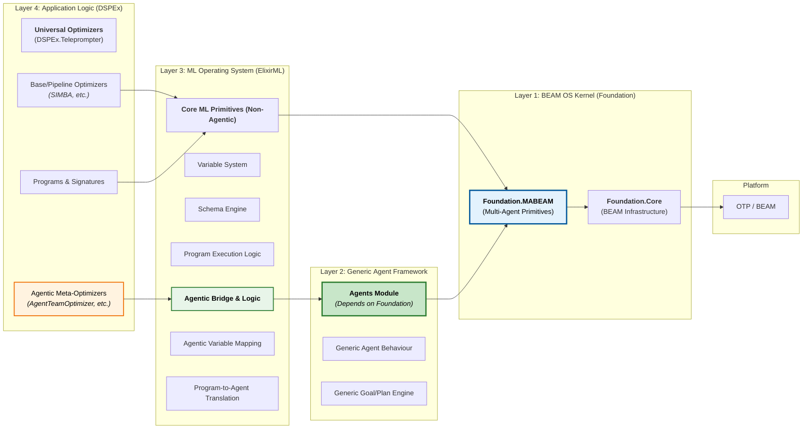

=== 20250622_1000_gemini.md ===
Of course. You've laid out a powerful and forward-thinking vision. The key is to translate that vision into a concrete technical design that respects the architectural principles we've established: maximum reusability in `foundation`, no unnecessary wrappers, and a clear path from simple optimization to recursive meta-optimization.

This document expands on the provided PRD and TDD, fleshing out the technical details to create a clear blueprint for implementation.

---

## Enhanced Technical Design: Foundation as a Universal Agent OS

### 1. Executive Summary & Architectural Principles

This design solidifies the vision of **Foundation as a generic, domain-agnostic "Agent Operating System" for the BEAM.** It provides two distinct but related layers of abstraction:

1.  **`Foundation.MABEAM`**: The low-level "kernel" for multi-agent primitives. It manages processes, state, and coordination via economic models (auctions, markets). It knows *how* to make agents interact but not *why*.
2.  **`Foundation.Agents`**: A higher-level "standard library" for building goal-oriented agents. It sits atop MABEAM and provides a generic framework for planning and execution. It knows *that* an agent has a goal and a plan, but not what those goals are.

**ElixirML** consumes these layers directly, providing the ML-specific domain knowledge to translate a `DSPEx.Program` into a `Foundation.Agents.Agent` and an optimization problem into a `Foundation.Agents.Goal`.

### 2. Detailed Component Specifications

Here we expand upon the PRD and TDD, defining the precise interfaces and internal logic.

#### **Epic 1: `Foundation.MABEAM` Core Enhancements**

##### **Feature 1.1: Universal Variable Orchestrator (`Core`)**

The `Core` module is the central nervous system. Its primary job is to execute coordination functions associated with system-wide variables.

*   **Data Structure (`orchestration_variable`)**:
    ```elixir
    defstruct [
      :id,      # :active_coder_pool, :system_temperature
      :type,    # :resource_allocation, :parameter_tuning
      :agents,  # List of agent_ids this variable affects
      :coordination_fn, # The function to call to enact a change
      # e.g., &Foundation.MABEAM.Coordination.Auction.run_auction/3
      :adaptation_fn,   # (Optional) Function to auto-adjust this variable based on metrics
      :constraints      # e.g., max_agents: 5
    ]
    ```
*   **Key Logic (`coordinate_system/0`)**:
    1.  Iterates through all registered orchestration variables.
    2.  For each variable, it gathers the current context (e.g., system load from Telemetry).
    3.  It calls the variable's `:coordination_fn`, passing in the affected agents and context.
    4.  The result of the `coordination_fn` (e.g., the winner of an auction) is then used to update system state, for example, by directing the `AgentRegistry` to start or stop agents.

##### **Feature 1.2: Advanced Agent Registry**

This is more than a process registry; it's an agent lifecycle manager.

*   **Public Interface (`register_agent/2`)**: It accepts a generic configuration map, making it domain-agnostic.
    ```elixir
    # This is how ElixirML would use it directly
    agent_config = %{
      module: ElixirML.Process.ProgramWorker, # The generic worker that wraps a DSPEx program
      args: [program_module: MyDSPExProgram],
      type: :ml_worker,
      restart_policy: {:permanent, max_restarts: 5, period_seconds: 60},
      capabilities: [:code_generation, :python],
      resource_requirements: %{memory_mb: 512}
    }
    Foundation.MABEAM.AgentRegistry.register_agent(:python_coder_1, agent_config)
    ```
*   **Internal Logic (Health Monitoring)**: It will use `Process.monitor/1` on every agent it starts. On a `{:DOWN, ...}` message, it will consult the agent's `restart_policy` and either restart it, mark it as failed, or give up.

##### **Feature 1.3: Coordination Protocols**

These are pure, algorithmic modules. They take agents and context, and return a result.

*   **Example: `Auction.run_auction/3`**:
    *   **Input**: `run_auction(:cpu_time, [agent1, agent2], auction_type: :english, starting_price: 10)`
    *   **Process**:
        1.  It does *not* know what `:cpu_time` is. It's just an ID.
        2.  It sends messages (e.g., `GenServer.call`) to the PIDs of `agent1` and `agent2`, asking for their bids at the current price. This requires the agents to implement a simple `:handle_bid_request` callback.
        3.  It iteratively increases the price and repeats step 2 until a winner is found.
    *   **Output**: `{:ok, %{winner: :agent2, payment: 50.0, ...}}`

---

#### **Epic 2: `Foundation.Agents` Framework (The New Generic Layer)**

This is the key to enabling meta-optimization. It provides the structure for any kind of goal-oriented agent.

##### **Feature 2.1: The `Agent` Behaviour**

**File: `lib/foundation/agents/agent.ex`**
```elixir
defmodule Foundation.Agents.Agent do
  @moduledoc "A generic behaviour for a goal-oriented, reasoning agent."

  alias Foundation.Agents.{Goal, Plan, Step}

  # An agent receives a high-level goal and must return a plan.
  @callback plan(goal :: Goal.t(), state :: map()) :: {:ok, Plan.t()} | {:error, term()}

  # An agent receives a single step from a plan and must execute it.
  @callback execute_step(step :: Step.t(), state :: map()) :: {:ok, result :: term()} | {:error, term()}

  # An agent declares its capabilities for planner matching.
  @callback get_capabilities() :: [atom()]
end
```

##### **Feature 2.2: The Generic `Planner`**

The Planner is the brain of this layer. It's a deterministic executor, not an AI itself.

**File: `lib/foundation/agents/planner.ex`**
```elixir
defmodule Foundation.Agents.Planner do
  alias Foundation.MABEAM.{AgentRegistry, Coordination}
  alias Foundation.Agents.{Goal, Plan}

  # This is the entry point for meta-optimizers.
  def execute_goal(goal, available_agents_by_capability) do
    # 1. Decompose the goal into a logical plan (this part is simple initially)
    plan = decompose(goal)

    # 2. Find and start the necessary agents using the generic MABEAM API
    required_capabilities = Enum.map(plan.steps, & &1.required_capability)
    agent_assignments = assign_agents(required_capabilities, available_agents_by_capability)
    
    for {step, agent_id} <- agent_assignments do
      # This is a direct call to the generic MABEAM layer
      AgentRegistry.start_agent(agent_id) 
    end

    # 3. Execute the plan
    execute_plan(plan, agent_assignments)
  end

  defp execute_plan(plan, assignments) do
    # This is where the coordination logic happens.
    # It sends `:execute_step` messages to the assigned agents' PIDs,
    # respecting the plan's dependency graph.
    # It might use MABEAM.Coordination.barrier_sync to wait for parallel steps.
  end
end
```

---

#### **Epic 3: `ElixirML` Integration (The Minimal, Essential Bridge)**

As established, this is a **translator**, not a wrapper.

##### **The `agentize` Function**
This is the most critical piece of the bridge.

**File: `lib/elixir_ml/mabeam/integration.ex`**
```elixir
defmodule ElixirML.MABEAM.Integration do
  # This module implements the generic `Foundation.Agents.Agent` behaviour
  # for DSPEx programs.

  defstruct [:program_module, :variable_config]

  @behaviour Foundation.Agents.Agent

  # `plan/2` is simple for a program-as-agent: the plan is a single step.
  @impl Foundation.Agents.Agent
  def plan(goal, state) do
    # Translate the generic goal into specific DSPEx input fields.
    dspex_inputs = translate_goal_to_inputs(goal, state.program_module)
    
    step = %Foundation.Agents.Step{
      id: :execute_program,
      action: :forward,
      params: dspex_inputs,
      required_capability: state.program_module.get_capability() # e.g., :code_generation_python
    }
    
    plan = %Foundation.Agents.Plan{steps: [step]}
    {:ok, plan}
  end

  # `execute_step/2` calls the DSPEx program's `forward` function.
  @impl Foundation.Agents.Agent
  def execute_step(step, state) do
    DSPEx.Program.forward(state.program_module, step.params, config: state.variable_config)
  end
  
  @impl Foundation.Agents.Agent
  def get_capabilities, do: # ...
end
```
When `Foundation.Agents.Planner` tells an "agent" to execute a step, it's actually calling the `execute_step` callback on this bridge module, which in turn runs the `DSPEx.Program`. This is how the generic framework drives the specific ML logic without knowing anything about it.

---

#### **Epic 4: `DSPEx` Universal Optimizer Structure**

The optimizer operates on the `OptimizationTarget` behaviour.

**Example: A Meta-Optimizer `evaluate` implementation**
```elixir
# In DSPEx.AgentTeam.OptimizerTarget

@impl DSPEx.Teleprompter.OptimizationTarget
def evaluate(target, _training_data, metric_fn) do
  # 1. Get the architecture chosen by the optimizer for this run.
  architecture = target.current_architecture
  # e.g., %{coder: PythonCoder, reviewer: StrictReviewer}

  # 2. Build the high-level goal for the generic Foundation.Agents layer.
  goal = %Foundation.Agents.Goal{
    id: :build_feature,
    description: "Implement and review the user login feature.",
    # The Planner will use this to find agents with matching capabilities
    steps: [
      %{id: :coding, capability: :code_generation, input: "feature specs..."},
      %{id: :review, capability: :code_review, depends_on: :coding}
    ]
  }

  # 3. Define the pool of available agents for the planner.
  available_agents = %{
    code_generation: [architecture.coder],
    code_review: [architecture.reviewer]
  }

  # 4. DIRECTLY CALL the generic Foundation.Agents Planner.
  #    This is the "system call" from the ML application to the Agent OS.
  case Foundation.Agents.Planner.execute_goal(goal, available_agents) do
    {:ok, final_result} ->
      # 5. Score the result and return it to the optimizer.
      score = metric_fn.(final_result)
      {:ok, score}
    
    {:error, reason} ->
      {:error, reason}
  end
end
```

This detailed design provides a clear path forward, respecting the architectural principles and enabling the powerful, layered optimization you envisioned. It makes `Foundation` a truly reusable and powerful asset while keeping `ElixirML` and `DSPEx` focused on their core ML competencies.


=== 20250622_1001_gemini.md ===
Excellent. This is a critical and insightful refinement of the architecture. Decoupling the generic `Agents` framework from `Foundation` and treating it as a separate, dependent layer is the correct move. It purifies `Foundation` into a true, reusable BEAM infrastructure library and provides maximum flexibility for `ElixirML` to evolve its agentic capabilities independently.

This new structure perfectly supports your vision of parallel non-agentic and agentic workflows, culminating in powerful meta-optimizers.

Here is the comprehensive architectural plan and revised Foundation PRD that reflects this more sophisticated, layered approach.

---

### Part 1: The New Grand Architecture - Parallel Stacks

This new architecture clearly delineates two primary workflows: a direct, non-agentic path for standard program optimization, and a more advanced agentic path that leverages the new `Agents` layer for meta-optimization.



**Workflow Explanation:**

1.  **Non-Agentic Path (Left Side):** This is for standard DSPy functionality. A `Base Optimizer` in `DSPEx` uses `ElixirML`'s core `Variable` and `Schema` systems. To execute a program, it can directly use `Foundation.MABEAM.AgentRegistry` to start a simple process, bypassing the `Agents` layer entirely. This is lean, fast, and efficient for single-program optimization.

2.  **Agentic Path (Right Side):** This is for advanced meta-optimization.
    *   An `Agentic Meta-Optimizer` in `DSPEx` orchestrates the workflow.
    *   It interacts with the `Agentic Bridge` in `ElixirML` to define *what constitutes an agent* (e.g., mapping a `DSPEx.Program` to the `Agent` behaviour) and *what architectural variables to tune*.
    *   The `ElixirML` bridge then uses the new, separate `Agents` module to create high-level goals and plans.
    *   The `Agents` module, in turn, uses the low-level primitives from `Foundation.MABEAM` to execute its plans (e.g., "start 3 worker processes," "run a resource auction").

This parallel design perfectly isolates the complexity. Simple workflows don't pay the overhead of the agentic framework, while complex workflows have a powerful, generic foundation to build upon.

---

### Part 2: Revised Foundation MABEAM Enhancement PRD

This PRD is now leaner and more focused. The `Foundation.Agents` epic has been removed and will become its own separate project.

**Product Requirements Document**  
**Version 2.0 (Refined Scope)**

#### Executive Summary

This PRD defines the enhancement of **Foundation's MABEAM system to serve as the universal primitive layer for multi-agent coordination on the BEAM.** It provides the low-level, domain-agnostic "kernel" functionalities—process management, state synchronization, and economic coordination—upon which higher-level agent frameworks (like the planned `Agents` module and `ElixirML`) can be built. This enhancement solidifies Foundation's role as a reusable, high-performance infrastructure library for any distributed Elixir application.

#### **Epic 1: Production-Ready MABEAM Primitives (The "Kernel")**

**Objective**: To provide a robust, generic, and performant set of tools for managing and coordinating groups of supervised processes (referred to generically as "agents").

*   **Feature 1.1: Universal Variable Orchestrator (`Core`)**
    *   **Requirement:** Manage system-wide variables that trigger generic coordination functions. The `Core` orchestrator should not have any domain-specific logic.
    *   **Acceptance Criteria:**
        *   Can register a variable with a reference to a coordination function (e.g., `&MyCoordination.run/3`).
        *   `coordinate_system/0` successfully invokes these functions, passing the relevant context.
        *   The system is fully observable via `Foundation.Telemetry`.

*   **Feature 1.2: Advanced Process Registry (`AgentRegistry`)**
    *   **Requirement:** Sophisticated lifecycle management for any supervised process, configured via a generic map.
    *   **Acceptance Criteria:**
        *   `register_agent/2` accepts a generic `%{module: ..., args: ..., restart_policy: ...}` config.
        *   Manages starting, stopping, and restarting these processes according to their policy.
        *   Provides health status based on process liveness (`Process.alive?/1`).
        *   Tracks basic resource usage (memory, message queue length) for registered PIDs.

*   **Feature 1.3: Pluggable Coordination Protocols (`Coordination`)**
    *   **Requirement:** A framework for executing domain-agnostic coordination algorithms like auctions and consensus.
    *   **Acceptance Criteria:**
        *   `register_protocol/2` allows adding new coordination algorithms at runtime.
        *   Includes built-in, generic implementations for `Auction` (sealed-bid, English), `Market` (equilibrium finding), and `Consensus` (majority vote).
        *   These protocols communicate with registered processes via a simple, defined message-passing interface (e.g., a `:get_bid` GenServer call), keeping them decoupled.

#### **Epic 2: Distribution and Clustering Primitives**

**Objective**: To enable MABEAM coordination to scale across multiple BEAM nodes.

*   **Feature 2.1: Cluster-Aware Registry & Orchestrator**
    *   **Requirement:** The `AgentRegistry` and `Core` orchestrator must be ableto operate across a distributed BEAM cluster.
    *   **Acceptance Criteria:**
        *   Can register and start a process on a remote node.
        *   Can coordinate processes running on different nodes.
        *   Leverages `Horde` or a similar library for distributed process supervision and registry.

*   **Feature 2.2: Generic Process Migration**
    *   **Requirement:** Provide a primitive for migrating a generic process (and its state) from one node to another.
    *   **Acceptance Criteria:**
        *   `MABEAM.migrate_process(pid, destination_node)` successfully moves a GenServer's state.
        *   The migration is stateful and handles temporary network failures.

*   **Feature 2.3: Distributed Variable Primitives**
    *   **Requirement:** Provide primitives for synchronizing a shared value across multiple nodes.
    *   **Acceptance Criteria:**
        *   Includes strategies for eventual consistency (gossip) and strong consistency (consensus via Raft/Paxos-lite).
        *   Provides basic conflict resolution like `last_write_wins`.

#### **OUT OF SCOPE for this PRD:**

*   **The `Agents` Framework:** The higher-level concepts of `Goal`, `Plan`, and the `Agent` behaviour are **not** part of Foundation. This will be a separate module/library that *depends on* this enhanced Foundation.MABEAM.
*   **ML-Specific Logic:** All translation from `DSPEx.Program` to a generic process config, and from `ElixirML.Variable` to an orchestration plan, resides exclusively in `ElixirML`.

---

### Part 3: Revised Foundation MABEAM Technical Design

The technical design is now simplified and purified, removing all high-level agentic concepts.

*   **`Foundation.MABEAM.AgentRegistry`:**
    *   **`register_agent(id, config)`**: The `config` map is now strictly generic. It contains `:module`, `:args`, `:restart_policy`, and optional `:capabilities` (a simple list of atoms like `:database_access` or `:gpu_enabled` that are domain-agnostic).
    *   **Supervision:** Will use a `DynamicSupervisor` to start children based on the provided `:module` and `:args`. The agent module itself must conform to a standard child spec (e.g., implement `start_link/1`).

*   **`Foundation.MABEAM.Coordination`:**
    *   **Interaction Model:** When a coordination protocol needs input from a process (e.g., an auction needs a bid), it will use a standardized `GenServer.call(pid, {:mabeam_coordination_request, request})`.
    *   **Example Request:** `{:mabeam_coordination_request, %{protocol: :auction, type: :get_bid, current_price: 50.0}}`.
    *   **Responsibility:** It is the responsibility of the *agent process module* (e.g., the `ElixirML.Process.ProgramWorker`) to implement the `handle_call` for this message, not Foundation. This keeps Foundation decoupled.

*   **API Purity:** All function names and types will be reviewed to remove high-level agentic language. For instance, functions related to the `Agents` framework (`handle_goal`, `plan`) will not exist anywhere in `Foundation`.

### Part 4: Revised Implementation Roadmap

The roadmap is now more focused on delivering the core primitives first.

*   **Phase 1: Core MABEAM Primitives (Weeks 1-4)**
    *   **Goal:** Implement a fully functional, single-node `Core`, `AgentRegistry`, and `Types`.
    *   **Deliverables:** Robust process lifecycle management and basic telemetry.

*   **Phase 2: Coordination Protocols (Weeks 5-8)**
    *   **Goal:** Implement the generic `Coordination` engine and the `Auction`, `Market`, and `Consensus` modules.
    *   **Deliverables:** A set of pluggable, domain-agnostic algorithms for resource allocation and agreement. The standard message-passing interface (`:mabeam_coordination_request`) will be finalized.

*   **Phase 3: Distribution & Clustering (Weeks 9-12)**
    *   **Goal:** Make the primitives work across a BEAM cluster.
    *   **Deliverables:** Distributed `AgentRegistry`, process migration, and basic distributed variable synchronization.

*   **Phase 4: Hardening & Production Readiness (Weeks 13-16)**
    *   **Goal:** Performance optimization, comprehensive documentation, and developer tools.
    *   **Deliverables:** Benchmarks, deployment guides, and observability dashboards.

This refined plan creates a powerful, reusable `Foundation.MABEAM` layer that perfectly serves as the "kernel" for the forthcoming `Agents` module and the broader `ElixirML`/`DSPEx` ecosystem, without baking in any domain-specific logic.

# Foundation 2.1: Ecosystem-Driven Implementation Roadmap + MABEAM Integration

## 18-Week Implementation Plan (12 weeks Foundation + 6 weeks MABEAM)

### Phase 1: Smart Configuration & Environment Detection (Weeks 1-3)

#### Week 1: Foundation Core & Environment Detection
**Goal**: Intelligent environment detection and tool selection

**Deliverables**:
```elixir
# lib/foundation/environment_detector.ex
defmodule Foundation.EnvironmentDetector do
  def detect_optimal_configuration() do
    %{
      environment: detect_environment(),
      infrastructure: detect_infrastructure(), 
      scale: detect_scale_requirements(),
      profile: determine_profile()
    }
  end
end

# lib/foundation/profiles.ex  
defmodule Foundation.Profiles do
  def get_profile(:development), do: development_profile()
  def get_profile(:production), do: production_profile()
  def get_profile(:enterprise), do: enterprise_profile()
end

# lib/foundation/configuration.ex
defmodule Foundation.Configuration do
  def configure_from_profile(profile) do
    # Automatically configure all tools based on profile
  end
end
```

**Tests**: Environment detection accuracy, profile selection logic

#### Week 2: mdns_lite Integration for Development  
**Goal**: Zero-config development clustering

**Deliverables**:
```elixir
# lib/foundation/strategies/mdns_lite.ex
defmodule Foundation.Strategies.MdnsLite do
  @behaviour Cluster.Strategy
  
  def start_link(opts) do
    # Configure mdns_lite for Foundation services
    configure_mdns_services()
    start_service_discovery()
  end
  
  defp configure_mdns_services() do
    MdnsLite.add_mdns_service(%{
      id: :foundation_node,
      protocol: "foundation",
      transport: "tcp",
      port: get_distribution_port(),
      txt_payload: [
        "node=#{Node.self()}",
        "foundation_version=#{Foundation.version()}",
        "capabilities=#{encode_capabilities()}"
      ]
    })
  end
end

# lib/foundation/development_cluster.ex
defmodule Foundation.DevelopmentCluster do
  def start_development_cluster() do
    # Automatic cluster formation for development
    discover_and_connect_nodes()
    setup_development_features()
  end
end
```

**Tests**: Automatic node discovery, development cluster formation

#### Week 3: libcluster Orchestration Layer
**Goal**: Intelligent production clustering strategy selection

**Deliverables**:
```elixir
# lib/foundation/cluster_manager.ex
defmodule Foundation.ClusterManager do
  def start_clustering(config \\ :auto) do
    strategy = determine_clustering_strategy(config)
    configure_libcluster(strategy)
    start_cluster_monitoring()
  end
  
  defp determine_clustering_strategy(:auto) do
    cond do
      kubernetes_available?() -> 
        {Cluster.Strategy.Kubernetes, kubernetes_config()}
      consul_available?() -> 
        {Cluster.Strategy.Consul, consul_config()}
      dns_srv_available?() -> 
        {Cluster.Strategy.DNS, dns_config()}
      true -> 
        {Cluster.Strategy.Epmd, static_config()}
    end
  end
end

# lib/foundation/cluster_health.ex
defmodule Foundation.ClusterHealth do
  def monitor_cluster_health() do
    # Continuous cluster health monitoring
    # Automatic failover strategies
    # Performance optimization recommendations
  end
end
```

**Tests**: Strategy detection, libcluster configuration, cluster formation

### Phase 2: Messaging & Process Distribution (Weeks 4-6)

#### Week 4: Phoenix.PubSub Integration & Intelligent Messaging
**Goal**: Unified messaging layer across local and distributed scenarios

**Deliverables**:
```elixir
# lib/foundation/messaging.ex
defmodule Foundation.Messaging do
  def send_message(target, message, opts \\ []) do
    case resolve_target(target) do
      {:local, pid} -> send(pid, message)
      {:remote, node, name} -> send_remote(node, name, message, opts)
      {:service, service_name} -> route_to_service(service_name, message, opts)
      {:broadcast, topic} -> broadcast_message(topic, message, opts)
    end
  end
  
  def subscribe(topic, handler \\ self()) do
    Phoenix.PubSub.subscribe(Foundation.PubSub, topic)
    register_handler(topic, handler)
  end
end

# lib/foundation/pubsub_manager.ex
defmodule Foundation.PubSubManager do
  def configure_pubsub(profile) do
    case profile do
      :development -> configure_local_pubsub()
      :production -> configure_distributed_pubsub()
      :enterprise -> configure_federated_pubsub()
    end
  end
end
```

**Tests**: Message routing, topic management, cross-node messaging

#### Week 5: Horde Integration & Process Distribution
**Goal**: Distributed process management with intelligent consistency handling

**Deliverables**:
```elixir
# lib/foundation/process_manager.ex
defmodule Foundation.ProcessManager do
  def start_distributed_process(module, args, opts \\ []) do
    strategy = determine_distribution_strategy(module, opts)
    
    case strategy do
      :singleton -> start_singleton_process(module, args, opts)
      :replicated -> start_replicated_process(module, args, opts)  
      :partitioned -> start_partitioned_process(module, args, opts)
      :local -> start_local_process(module, args, opts)
    end
  end
end

# lib/foundation/horde_manager.ex
defmodule Foundation.HordeManager do
  def start_child_with_retry(supervisor, child_spec, opts \\ []) do
    # Handle Horde's eventual consistency intelligently
    # Retry logic for failed registrations
    # Wait for registry sync when needed
  end
  
  def optimize_horde_performance(cluster_info) do
    # Adjust sync intervals based on cluster size
    # Optimize distribution strategies
    # Monitor and alert on consistency issues
  end
end
```

**Tests**: Process distribution, Horde consistency handling, failover scenarios

#### Week 6: Service Discovery & Registry
**Goal**: Unified service discovery across all deployment scenarios

**Deliverables**:
```elixir
# lib/foundation/service_mesh.ex
defmodule Foundation.ServiceMesh do
  def register_service(name, pid, capabilities \\ []) do
    # Multi-layer registration for redundancy
    registrations = [
      register_locally(name, pid, capabilities),
      register_in_horde(name, pid, capabilities),
      announce_via_pubsub(name, pid, capabilities)
    ]
    
    validate_registrations(registrations)
  end
  
  def discover_services(criteria) do
    # Intelligent service discovery with multiple fallbacks
    local_services = discover_local_services(criteria)
    cluster_services = discover_cluster_services(criteria) 
    
    merge_and_prioritize_services(local_services, cluster_services)
  end
end

# lib/foundation/load_balancer.ex
defmodule Foundation.LoadBalancer do
  def route_to_service(service_name, message, opts \\ []) do
    instances = get_healthy_instances(service_name)
    strategy = determine_routing_strategy(instances, message, opts)
    
    route_with_strategy(instances, message, strategy)
  end
end
```

**Tests**: Service registration, discovery, load balancing, health checking

### Phase 3: Advanced Features & Optimization (Weeks 7-9)

#### Week 7: Context Propagation & Distributed Debugging
**Goal**: Automatic context flow across all boundaries

**Deliverables**:
```elixir
# lib/foundation/context.ex
defmodule Foundation.Context do
  def with_context(context_map, fun) do
    # Store context in process dictionary and telemetry
    # Automatic propagation across process boundaries
    # Integration with Phoenix.PubSub for distributed context
  end
  
  def propagate_context(target, message) do
    # Automatic context injection for all message types
    # Support for different target types (pid, via tuple, service name)
    # Context compression for large payloads
  end
end

# lib/foundation/distributed_debugging.ex  
defmodule Foundation.DistributedDebugging do
  def enable_cluster_debugging() do
    # Integration with ElixirScope for distributed debugging
    # Automatic trace correlation across nodes
    # Performance profiling across cluster
  end
end
```

**Tests**: Context propagation, distributed tracing, debugging integration

#### Week 8: Caching & State Management  
**Goal**: Intelligent distributed caching with Nebulex

**Deliverables**:
```elixir
# lib/foundation/cache_manager.ex
defmodule Foundation.CacheManager do
  def configure_cache(profile) do
    case profile do
      :development -> configure_local_cache()
      :production -> configure_distributed_cache()
      :enterprise -> configure_multi_tier_cache()
    end
  end
  
  def get_or_compute(key, computation_fn, opts \\ []) do
    # Intelligent cache hierarchy
    # Automatic cache warming
    # Distributed cache invalidation
  end
end

# lib/foundation/state_synchronization.ex
defmodule Foundation.StateSynchronization do
  def sync_state_across_cluster(state_name, initial_state) do
    # CRDT-based state synchronization
    # Conflict resolution strategies
    # Partition tolerance
  end
end
```

**Tests**: Cache performance, state synchronization, partition scenarios

#### Week 9: Performance Optimization & Monitoring
**Goal**: Self-optimizing infrastructure with comprehensive observability

**Deliverables**:
```elixir
# lib/foundation/performance_optimizer.ex
defmodule Foundation.PerformanceOptimizer do
  def optimize_cluster_performance() do
    cluster_metrics = collect_cluster_metrics()
    optimizations = analyze_and_recommend(cluster_metrics)
    apply_safe_optimizations(optimizations)
  end
  
  def adaptive_scaling(service_name) do
    # Predictive scaling based on metrics
    # Automatic process distribution adjustment
    # Resource utilization optimization
  end
end

# lib/foundation/telemetry_integration.ex
defmodule Foundation.TelemetryIntegration do
  def setup_comprehensive_monitoring() do
    # Cluster-wide telemetry aggregation
    # Performance trend analysis
    # Automatic alerting on anomalies
    # Integration with external monitoring systems
  end
end
```

**Tests**: Performance optimization, monitoring accuracy, scaling behavior

### Phase 4: Multi-Clustering & Enterprise Features (Weeks 10-12)

#### Week 10: Multi-Cluster Support
**Goal**: Enterprise-grade multi-clustering capabilities

**Deliverables**:
```elixir
# lib/foundation/federation.ex
defmodule Foundation.Federation do
  def federate_clusters(clusters, strategy \\ :mesh) do
    case strategy do
      :mesh -> create_mesh_federation(clusters)
      :hub_spoke -> create_hub_spoke_federation(clusters)
      :hierarchical -> create_hierarchical_federation(clusters)
    end
  end
  
  def send_to_cluster(cluster_name, service_name, message) do
    # Cross-cluster communication
    # Routing strategies for different cluster types
    # Fallback mechanisms for cluster failures
  end
end

# lib/foundation/cluster_registry.ex
defmodule Foundation.ClusterRegistry do
  def register_cluster(cluster_name, config) do
    # Multi-cluster service registry
    # Cross-cluster service discovery
    # Global load balancing
  end
end
```

**Tests**: Multi-cluster formation, cross-cluster communication, federation strategies

#### Week 11: Project Integration (ElixirScope & DSPEx)
**Goal**: Seamless integration with your projects

**Deliverables**:
```elixir
# Integration with ElixirScope
defmodule ElixirScope.Foundation.Integration do
  def enable_distributed_debugging() do
    Foundation.DistributedDebugging.register_debug_service()
    setup_cluster_wide_tracing()
  end
  
  def trace_across_cluster(trace_id) do
    Foundation.Messaging.broadcast(
      "elixir_scope:tracing",
      {:start_trace, trace_id, Foundation.Context.current_context()}
    )
  end
end

# Integration with DSPEx  
defmodule DSPEx.Foundation.Integration do
  def distribute_optimization(program, dataset, metric) do
    # Use Foundation's process distribution for AI workloads
    workers = Foundation.ProcessManager.start_process_group(
      DSPEx.Worker,
      strategy: :distributed,
      count: Foundation.Cluster.optimal_worker_count()
    )
    
    Foundation.WorkDistribution.coordinate_work(workers, dataset, metric)
  end
end
```

**Tests**: ElixirScope integration, DSPEx optimization, project compatibility

#### Week 12: Production Hardening & Documentation
**Goal**: Production-ready release with comprehensive documentation

**Deliverables**:
```elixir
# lib/foundation/production_readiness.ex
defmodule Foundation.ProductionReadiness do
  def validate_production_config(config) do
    # Configuration validation
    # Security best practices checking
    # Performance baseline establishment
    # Capacity planning recommendations
  end
  
  def health_check() do
    # Comprehensive cluster health assessment
    # Service availability verification
    # Performance benchmark validation
  end
end

# lib/foundation/migration_helpers.ex
defmodule Foundation.MigrationHelpers do
  def migrate_from_libcluster(current_config) do
    # Seamless migration from plain libcluster
    # Configuration transformation
    # Zero-downtime upgrade path
  end
  
  def migrate_from_swarm(current_config) do
    # Migration path from Swarm to Foundation
    # Process migration strategies
    # Data preservation techniques
  end
end
```

**Tests**: Production scenarios, migration paths, documentation accuracy

## Success Metrics & Validation

### Technical Excellence Targets
- **Cluster Formation**: <30 seconds from startup to fully operational
- **Service Discovery**: <10ms average lookup time
- **Message Throughput**: 10k+ messages/second cluster-wide
- **Failover Time**: <5 seconds for automatic recovery
- **Memory Efficiency**: <10% overhead vs single-node deployment

### Developer Experience Goals
- **Zero-config Setup**: Working distributed app in <5 minutes
- **One-line Production**: Production deployment with 1 config change
- **Tool Learning Curve**: Familiar APIs, no new concepts to learn
- **Migration Path**: <1 day to migrate existing applications

### Integration Success Criteria
- **ElixirScope**: Distributed debugging working across entire cluster
- **DSPEx**: 5x performance improvement through distributed optimization
- **Ecosystem Compatibility**: Works with 95% of existing Elixir libraries
- **Community Adoption**: Clear value proposition for different use cases

## Dependencies & Infrastructure

### Required Dependencies
```elixir
# mix.exs
defp deps do
  [
    # Core clustering
    {:libcluster, "~> 3.3"},
    {:mdns_lite, "~> 0.8"},
    
    # Process distribution  
    {:horde, "~> 0.9"},
    
    # Messaging
    {:phoenix_pubsub, "~> 2.1"},
    
    # Caching
    {:nebulex, "~> 2.5"},
    
    # Observability
    {:telemetry, "~> 1.2"},
    {:telemetry_metrics, "~> 0.6"},
    
    # Optional advanced features
    {:partisan, "~> 5.0", optional: true},
    
    # Development and testing
    {:mox, "~> 1.0", only: :test},
    {:excoveralls, "~> 0.18", only: :test},
    {:credo, "~> 1.7", only: [:dev, :test]},
    {:dialyxir, "~> 1.4", only: [:dev, :test]}
  ]
end
```

### Testing Infrastructure
```elixir
# test/support/cluster_case.ex
defmodule Foundation.ClusterCase do
  use ExUnit.CaseTemplate
  
  using do
    quote do
      import Foundation.ClusterCase
      import Foundation.TestHelpers
    end
  end
  
  def setup_test_cluster(node_count \\ 3) do
    # Start multiple nodes for integration testing
    nodes = start_test_nodes(node_count)
    setup_foundation_on_nodes(nodes)
    
    on_exit(fn -> cleanup_test_nodes(nodes) end)
    
    %{nodes: nodes}
  end
end

# test/support/test_helpers.ex
defmodule Foundation.TestHelpers do
  def wait_for_cluster_formation(expected_nodes, timeout \\ 5000) do
    # Wait for cluster to stabilize
    wait_until(fn -> 
      Foundation.Cluster.size() == expected_nodes 
    end, timeout)
  end
  
  def simulate_network_partition(nodes_a, nodes_b) do
    # Simulate network partitions for testing
    partition_nodes(nodes_a, nodes_b)
    
    on_exit(fn -> heal_partition(nodes_a, nodes_b) end)
  end
  
  def assert_eventually(assertion, timeout \\ 5000) do
    # Assert that something becomes true within timeout
    wait_until(assertion, timeout)
    assertion.()
  end
end
```

## Real-World Usage Examples

### Example 1: Zero-Config Development
```elixir
# mix.exs - Just add Foundation
{:foundation, "~> 2.0"}

# lib/my_app/application.ex
defmodule MyApp.Application do
  def start(_type, _args) do
    children = [
      # Foundation automatically handles clustering in development
      {Foundation, []},
      
      # Your services work distributed automatically
      MyApp.UserService,
      MyApp.OrderService,
      MyApp.Web.Endpoint
    ]
    
    Supervisor.start_link(children, strategy: :one_for_one)
  end
end

# Start multiple nodes for development
# iex --name dev1@localhost -S mix
# iex --name dev2@localhost -S mix
# Foundation automatically discovers and connects them via mdns_lite
```

### Example 2: One-Line Production
```elixir
# config/prod.exs
config :foundation,
  cluster: :kubernetes  # That's it!

# Foundation automatically:
# - Configures libcluster with Kubernetes strategy
# - Sets up Horde for distributed processes
# - Enables Phoenix.PubSub for messaging
# - Configures Nebulex for distributed caching
# - Provides health checks and monitoring
```

### Example 3: Advanced Multi-Service Architecture
```elixir
# config/prod.exs
config :foundation,
  profile: :enterprise,
  clusters: %{
    # Web tier
    web: [
      strategy: {Cluster.Strategy.Kubernetes, [
        mode: :hostname,
        kubernetes_selector: "tier=web"
      ]},
      services: [:web_servers, :api_gateways],
      messaging: [:user_events, :api_requests]
    ],
    
    # Processing tier  
    processing: [
      strategy: {Cluster.Strategy.Kubernetes, [
        kubernetes_selector: "tier=processing"
      ]},
      services: [:background_jobs, :data_processors],
      messaging: [:job_queue, :data_events]
    ],
    
    # AI tier
    ai: [
      strategy: {Cluster.Strategy.Consul, [
        service_name: "ai-cluster"
      ]},
      services: [:ai_workers, :model_cache],
      messaging: [:inference_requests, :model_updates]
    ]
  }

# lib/my_app/user_service.ex
defmodule MyApp.UserService do
  use GenServer
  
  def start_link(opts) do
    # Foundation makes this automatically distributed
    Foundation.ProcessManager.start_distributed_process(
      __MODULE__, 
      opts,
      strategy: :singleton,  # One instance across entire cluster
      cluster: :web
    )
  end
  
  def process_user(user_id) do
    # Foundation handles service discovery and routing
    Foundation.Messaging.send_message(
      {:service, :user_service},
      {:process_user, user_id}
    )
  end
end
```

### Example 4: ElixirScope Integration
```elixir
# Distributed debugging across Foundation cluster
defmodule MyApp.DebuggingExample do
  def debug_distributed_request(request_id) do
    # ElixirScope + Foundation = distributed debugging magic
    Foundation.Context.with_context(%{
      request_id: request_id,
      debug_session: ElixirScope.start_debug_session()
    }) do
      
      # Process request across multiple services/nodes
      user = Foundation.call_service(:user_service, {:get_user, user_id})
      order = Foundation.call_service(:order_service, {:create_order, user, items})
      
      # ElixirScope automatically traces across all nodes
      ElixirScope.complete_trace(request_id)
    end
  end
end
```

### Example 5: DSPEx Distributed Optimization
```elixir
# Leverage Foundation for distributed AI optimization
defmodule MyApp.AIOptimization do
  def optimize_model_across_cluster() do
    # DSPEx + Foundation = distributed AI optimization
    program = create_base_program()
    dataset = load_training_dataset()
    metric = &accuracy_metric/2
    
    # Foundation automatically distributes across AI cluster
    optimized_program = Foundation.AI.distribute_optimization(
      DSPEx.BootstrapFewShot,
      program,
      dataset, 
      metric,
      cluster: :ai,
      max_workers: Foundation.Cluster.node_count(:ai) * 4
    )
    
    # Result is automatically cached across cluster
    Foundation.Cache.put("optimized_model_v#{version()}", optimized_program)
    
    optimized_program
  end
end
```

## Migration Strategies

### From Plain libcluster
```elixir
# Before: Manual libcluster setup
config :libcluster,
  topologies: [
    k8s: [
      strategy: Cluster.Strategy.Kubernetes,
      config: [
        mode: :hostname,
        kubernetes_node_basename: "myapp",
        kubernetes_selector: "app=myapp"
      ]
    ]
  ]

# After: Foundation orchestration
config :foundation,
  cluster: :kubernetes  # Foundation handles the rest
  
# Migration helper
Foundation.Migration.from_libcluster(existing_libcluster_config)
```

### From Swarm
```elixir
# Before: Swarm registration
Swarm.register_name(:my_process, MyProcess, :start_link, [args])

# After: Foundation process management  
Foundation.ProcessManager.start_distributed_process(
  MyProcess,
  args,
  name: :my_process,
  strategy: :singleton
)

# Migration helper
Foundation.Migration.from_swarm(existing_swarm_processes)
```

### From Manual OTP Distribution
```elixir
# Before: Manual distribution setup
children = [
  {Phoenix.PubSub, name: MyApp.PubSub},
  {Registry, keys: :unique, name: MyApp.Registry},
  MyApp.Worker
]

# After: Foundation orchestration
children = [
  {Foundation, []},  # Handles PubSub, Registry, clustering
  MyApp.Worker      # Automatically gets distributed capabilities
]
```

## Operational Excellence

### Health Monitoring
```elixir
# lib/foundation/health_monitor.ex
defmodule Foundation.HealthMonitor do
  def cluster_health_check() do
    %{
      cluster_status: check_cluster_status(),
      node_health: check_all_nodes(),
      service_health: check_all_services(),
      performance_metrics: get_performance_summary(),
      recommendations: generate_health_recommendations()
    }
  end
  
  defp check_cluster_status() do
    %{
      expected_nodes: Foundation.Config.get(:expected_nodes),
      actual_nodes: Foundation.Cluster.size(),
      partitions: detect_network_partitions(),
      last_topology_change: get_last_topology_change()
    }
  end
end

# Web endpoint for health checks
# GET /health -> Foundation.HealthMonitor.cluster_health_check()
```

### Performance Monitoring
```elixir
# lib/foundation/performance_monitor.ex
defmodule Foundation.PerformanceMonitor do
  def collect_cluster_metrics() do
    %{
      message_throughput: measure_message_throughput(),
      service_latency: measure_service_latencies(),
      resource_utilization: measure_resource_usage(),
      cache_hit_rates: measure_cache_performance(),
      horde_sync_times: measure_horde_performance()
    }
  end
  
  def performance_dashboard() do
    # Real-time performance dashboard
    metrics = collect_cluster_metrics()
    trends = analyze_performance_trends()
    alerts = check_performance_alerts()
    
    %{
      current_metrics: metrics,
      trends: trends,
      alerts: alerts,
      recommendations: generate_performance_recommendations(metrics)
    }
  end
end
```

### Disaster Recovery
```elixir
# lib/foundation/disaster_recovery.ex
defmodule Foundation.DisasterRecovery do
  def backup_cluster_state() do
    %{
      cluster_topology: Foundation.Cluster.get_topology(),
      service_registry: Foundation.ServiceMesh.export_registry(),
      process_state: Foundation.ProcessManager.export_state(),
      configuration: Foundation.Config.export_config()
    }
  end
  
  def restore_cluster_state(backup) do
    # Restore cluster from backup
    Foundation.Cluster.restore_topology(backup.cluster_topology)
    Foundation.ServiceMesh.import_registry(backup.service_registry)
    Foundation.ProcessManager.restore_state(backup.process_state)
    Foundation.Config.import_config(backup.configuration)
  end
  
  def failover_to_backup_cluster(backup_cluster_config) do
    # Automatic failover to backup cluster
    current_state = backup_cluster_state()
    connect_to_backup_cluster(backup_cluster_config)
    restore_cluster_state(current_state)
  end
end
```

## Documentation & Community

### API Documentation Structure
```
docs/
├── getting-started/
│   ├── zero-config-development.md
│   ├── one-line-production.md
│   └── migration-guide.md
├── guides/
│   ├── clustering-strategies.md
│   ├── process-distribution.md
│   ├── messaging-patterns.md
│   └── multi-cluster-setup.md
├── advanced/
│   ├── custom-strategies.md
│   ├── performance-tuning.md
│   └── enterprise-features.md
├── integrations/
│   ├── elixir-scope.md
│   ├── dspex.md
│   └── ecosystem-tools.md
└── reference/
    ├── api-reference.md
    ├── configuration-options.md
    └── troubleshooting.md
```

### Example Applications
```
examples/
├── chat-app/              # Simple distributed chat
├── job-queue/             # Background job processing
├── ai-optimization/       # DSPEx integration example
├── debugging-example/     # ElixirScope integration
├── multi-cluster/         # Enterprise multi-cluster setup
└── migration-examples/    # Migration from other tools
```

## Success Metrics Dashboard

### Development Experience Metrics
- **Time to First Cluster**: Target <5 minutes from `mix deps.get` to working distributed app
- **Learning Curve**: Developers productive within 1 day
- **Migration Effort**: <1 week to migrate existing applications
- **Bug Reduction**: 50% fewer distribution-related bugs

### Operational Metrics  
- **Cluster Stability**: 99.9% uptime target
- **Failover Speed**: <10 seconds automatic recovery
- **Performance Overhead**: <15% vs single-node deployment
- **Resource Efficiency**: Optimal resource utilization across cluster

### Ecosystem Impact
- **Community Adoption**: Clear growth in Foundation-based projects
- **Tool Integration**: Successful integration with major Elixir libraries
- **Performance Benchmarks**: Measurable improvements over alternatives
- **Developer Satisfaction**: Positive feedback from early adopters

## The Foundation 2.0 Promise

**For Individual Developers**:
- "I can build distributed applications as easily as single-node apps"
- "I don't need to learn complex distribution concepts to get started"
- "When I need advanced features, they're available without rewriting"

**For Teams**:
- "We can deploy anywhere without changing our application code"
- "Our applications automatically become more reliable when we add nodes"
- "Debugging and monitoring work seamlessly across our entire cluster"

**For Organizations**:
- "We can scale from startup to enterprise without architectural rewrites"
- "Our distributed systems are self-healing and self-optimizing"
- "We spend time building features, not managing infrastructure"

## Phase 5: MABEAM Multi-Agent Integration (Weeks 13-15)

### Week 13: MABEAM Core Infrastructure
**Goal**: Integrate MABEAM universal variable orchestrator with Foundation

**Deliverables**:
```elixir
# lib/foundation/mabeam/core.ex
defmodule Foundation.MABEAM.Core do
  @moduledoc """
  Universal Variable Orchestrator integrated with Foundation's distributed infrastructure.
  
  Leverages Foundation.ProcessManager for agent distribution and 
  Foundation.Channels for coordination messaging.
  """
  
  def register_orchestration_variable(variable) do
    # Register coordination variable in Foundation's service mesh
    Foundation.ServiceMesh.register_service(
      {:orchestration_variable, variable.id},
      %{
        type: :coordination_variable,
        variable: variable,
        capabilities: variable.coordination_capabilities
      }
    )
  end
  
  def coordinate_system(variable_id, context \\ %{}) do
    # Use Foundation's messaging for coordination
    agents = Foundation.ServiceMesh.discover_services(
      capabilities: [:agent_coordination],
      variable_id: variable_id
    )
    
    Foundation.Channels.coordinate_consensus(agents, context)
  end
end

# Integration with Foundation.ProcessManager
defmodule Foundation.ProcessManager do
  # Enhanced with MABEAM agent patterns
  def start_agent(agent_spec, coordination_opts \\ []) do
    case coordination_opts[:strategy] do
      :singleton -> start_singleton_agent(agent_spec, coordination_opts)
      :replicated -> start_replicated_agent(agent_spec, coordination_opts)
      :ecosystem -> start_agent_ecosystem(agent_spec, coordination_opts)
    end
  end
end
```

### Week 14: Agent Registry & Coordination Protocols
**Goal**: Agent lifecycle management with coordination capabilities

**Deliverables**:
```elixir
# lib/foundation/mabeam/agent_registry.ex
defmodule Foundation.MABEAM.AgentRegistry do
  @moduledoc """
  Agent registry that extends Foundation.ProcessManager with 
  coordination-specific capabilities.
  """
  
  def register_agent(agent_id, config) do
    # Register with Foundation's service mesh
    Foundation.ServiceMesh.register_service(agent_id, %{
      type: :coordination_agent,
      capabilities: config.coordination_capabilities,
      resource_requirements: config.resource_requirements,
      coordination_protocols: config.supported_protocols
    })
    
    # Start agent using Foundation's process management
    Foundation.ProcessManager.start_distributed_process(
      config.module,
      config.args,
      strategy: config.distribution_strategy,
      name: agent_id
    )
  end
end

# lib/foundation/mabeam/coordination.ex
defmodule Foundation.MABEAM.Coordination do
  def coordinate_consensus(agents, proposal, opts \\ []) do
    # Use Foundation.Channels for coordination messaging
    Foundation.Channels.broadcast(:coordination, {:consensus_proposal, proposal})
    
    # Collect votes using Foundation's messaging infrastructure
    collect_consensus_votes(agents, proposal, opts)
  end
  
  def run_auction(auction_spec, bidders, opts \\ []) do
    # Leverage Foundation's service discovery for bidder lookup
    active_bidders = Foundation.ServiceMesh.discover_services(
      capabilities: [:auction_bidding],
      ids: bidders
    )
    
    execute_auction_protocol(auction_spec, active_bidders, opts)
  end
end
```

### Week 15: Advanced Coordination & Telemetry Integration
**Goal**: Game-theoretic protocols and comprehensive telemetry

**Deliverables**:
```elixir
# lib/foundation/mabeam/telemetry.ex
defmodule Foundation.MABEAM.Telemetry do
  @moduledoc """
  MABEAM telemetry that extends Foundation.Telemetry with 
  agent-specific metrics and coordination analytics.
  """
  
  def record_coordination_event(event_type, agents, result, duration) do
    # Use Foundation's telemetry infrastructure
    Foundation.Telemetry.emit(
      [:mabeam, :coordination, event_type],
      %{
        agent_count: length(agents),
        result: result,
        duration: duration
      },
      %{
        coordination_type: event_type,
        cluster_size: Foundation.Cluster.size(),
        node: Node.self()
      }
    )
  end
end

# Enhanced Foundation.Channels with coordination capabilities
defmodule Foundation.Channels do
  # Existing message routing...
  
  # NEW: Coordination-specific message routing
  def coordinate_consensus(agents, proposal, opts \\ []) do
    broadcast(:coordination, {:consensus_start, proposal})
    collect_responses(agents, :consensus_vote, opts)
  end
  
  def run_auction(auction_spec, bidders, opts \\ []) do
    broadcast(:coordination, {:auction_start, auction_spec})
    collect_bids(bidders, auction_spec, opts)
  end
end
```

## Phase 6: Project Integration & Polish (Weeks 16-18)

### Week 16: ElixirScope Multi-Agent Debugging
**Goal**: Extend ElixirScope with multi-agent debugging capabilities

**Deliverables**:
```elixir
# Enhanced ElixirScope integration
defmodule ElixirScope.MultiAgentTracer do
  def trace_coordination_protocol(protocol_id, agents) do
    # Use Foundation.MABEAM.Telemetry for coordination tracing
    Foundation.MABEAM.Telemetry.start_coordination_trace(protocol_id, agents)
    
    # Leverage Foundation's distributed tracing
    Foundation.Channels.broadcast(:tracing, {:trace_coordination, protocol_id})
  end
  
  def analyze_agent_decisions(agent_id, decision_context) do
    # Trace agent decision-making process
    agent_state = Foundation.MABEAM.AgentRegistry.get_agent_state(agent_id)
    coordination_history = Foundation.MABEAM.Telemetry.get_coordination_history(agent_id)
    
    correlate_decisions_with_coordination(agent_state, coordination_history, decision_context)
  end
end
```

### Week 17: DSPEx Multi-Agent Optimization
**Goal**: Extend DSPEx with multi-agent optimization capabilities

**Deliverables**:
```elixir
# Enhanced DSPEx integration
defmodule DSPEx.MultiAgentOptimizer do
  def optimize_with_coordination(program, dataset, metric) do
    # Create optimization agents
    agents = Foundation.MABEAM.AgentRegistry.start_optimization_agents(
      count: Foundation.Cluster.size(),
      capabilities: [:dsp_optimization, :auction_bidding]
    )
    
    # Coordinate optimization using auction mechanism
    optimization_results = Foundation.MABEAM.Coordination.run_auction(
      %{
        type: :optimization_auction,
        objective: metric,
        constraints: %{max_time: 300, max_memory: 2048}
      },
      agents
    )
    
    select_best_optimization(optimization_results)
  end
end
```

### Week 18: Documentation & Final Integration
**Goal**: Complete documentation and final integration testing

**Deliverables**:
- Complete MABEAM integration documentation
- Multi-agent examples and tutorials
- Performance benchmarks comparing with/without MABEAM
- Migration guide for existing Foundation applications

## Enhanced Success Metrics

### MABEAM-Specific Metrics
- **Coordination Efficiency**: Protocols complete within defined time bounds
- **Agent Utilization**: Optimal distribution of agents across cluster
- **Decision Quality**: Measurable improvement in coordinated vs individual decisions
- **Scalability**: Linear performance improvement with agent count

### Integration Success
- **ElixirScope Enhancement**: Multi-agent debugging capabilities functional
- **DSPEx Enhancement**: Coordinated optimization outperforms individual optimization
- **Foundation Integration**: Zero breaking changes to existing Foundation APIs
- **Developer Experience**: MABEAM features accessible through familiar Foundation patterns

Foundation 2.1 + MABEAM represents the **evolution of distributed BEAM development** - from complex, manual orchestration to intelligent, automatic optimization that leverages the best tools in the ecosystem PLUS intelligent multi-agent coordination.

**The future where distributed BEAM applications are not just easy to build, but intelligently self-coordinating.** 🚀🤖
