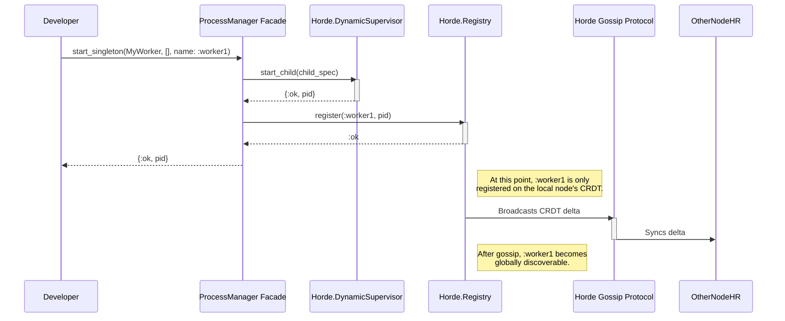
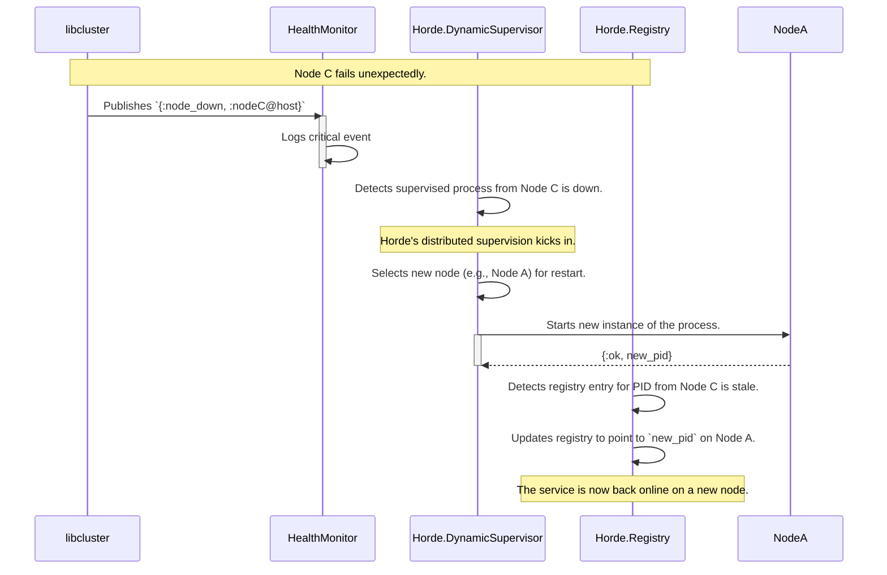
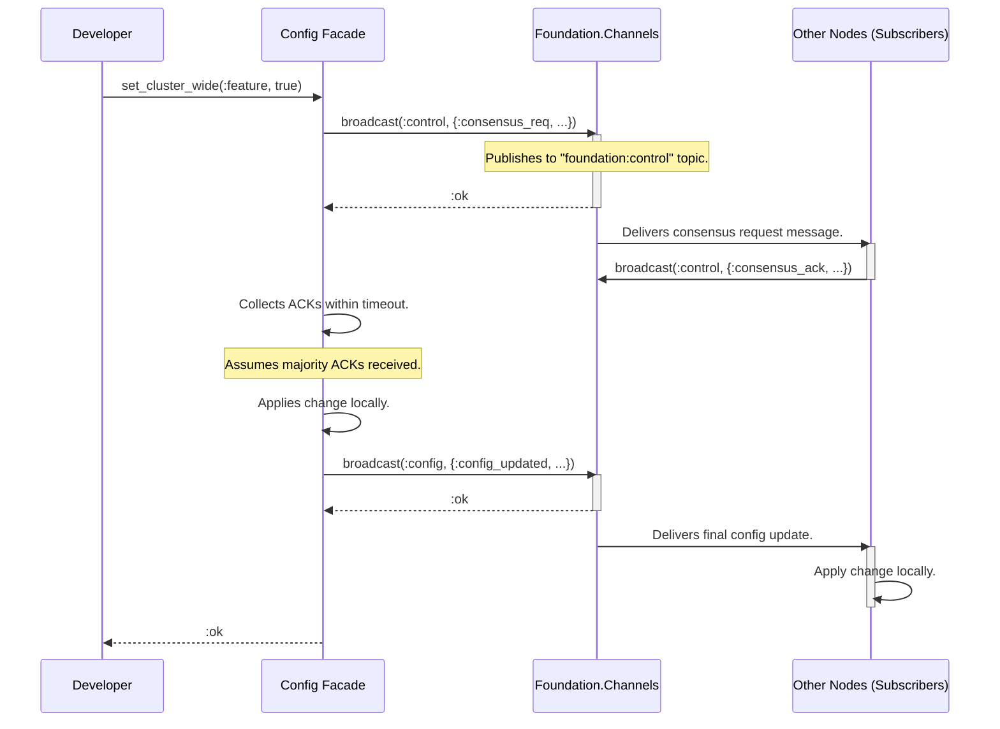

# Foundation 2.0: Sequence Diagrams & Interaction Flows

**Purpose**: To visualize the dynamic interactions between components for key operations. This clarifies timing, dependencies, and potential race conditions.

## 1. Flow: `Foundation.ProcessManager.start_singleton`

This shows the interaction to start a globally unique process.

## 2. Flow: Cluster Healing After Node Failure

This shows how a singleton process recovers when its node dies.

## 3. Flow: `set_cluster_wide` Configuration Change

This shows the simplified consensus flow for a distributed config update.

