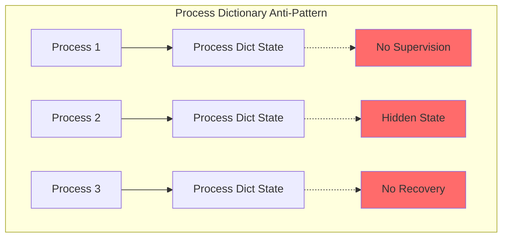
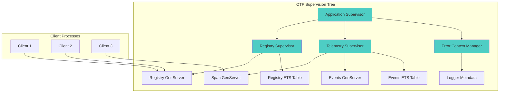
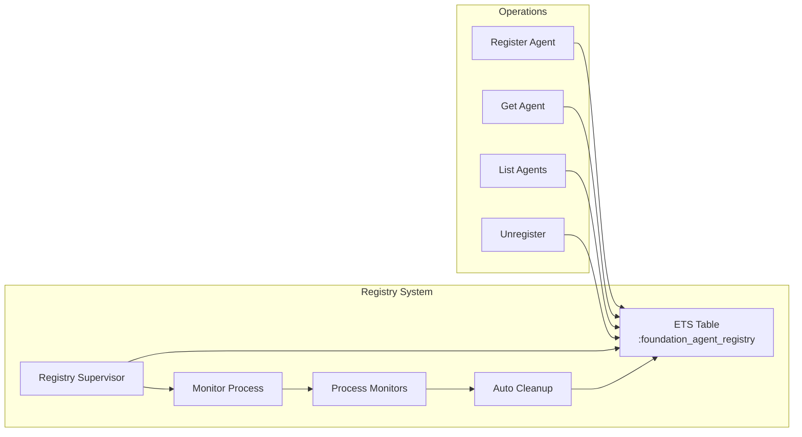
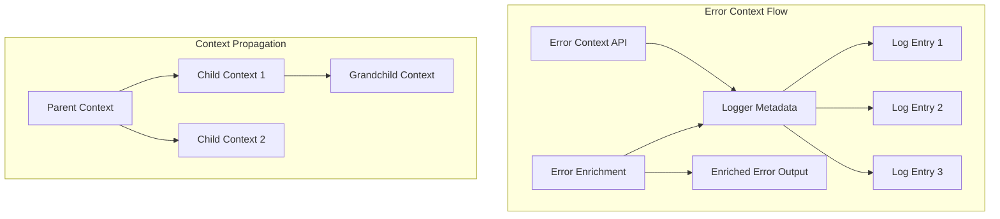
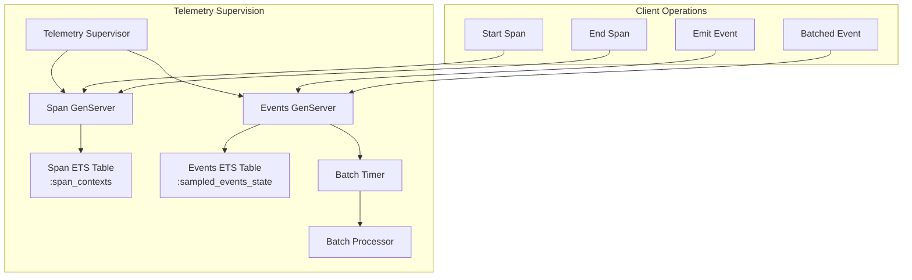
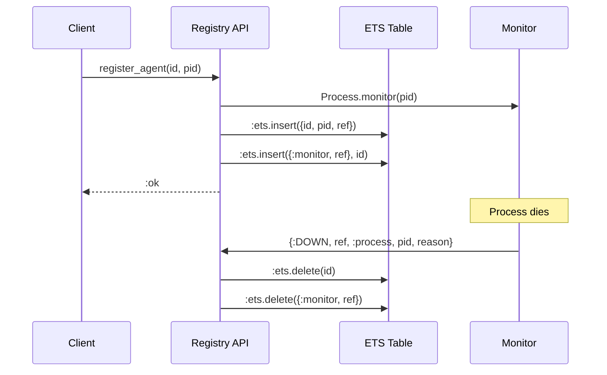
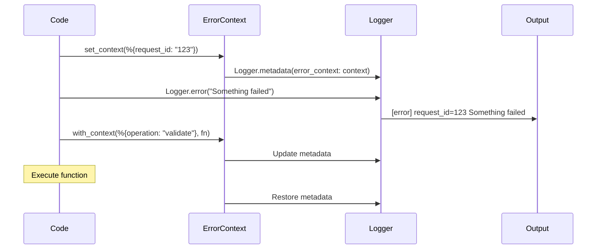
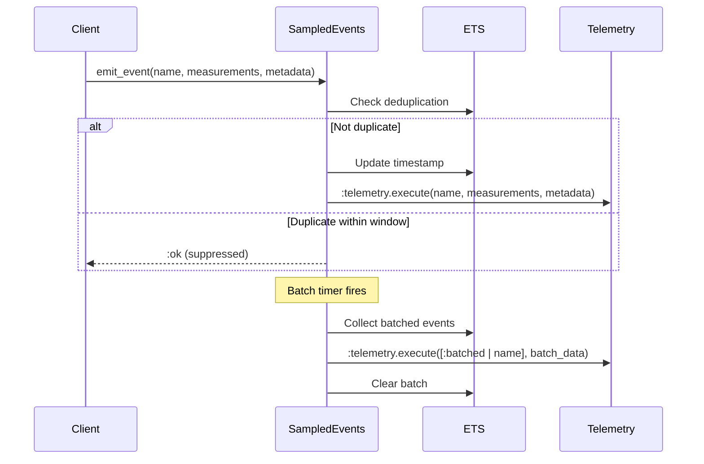
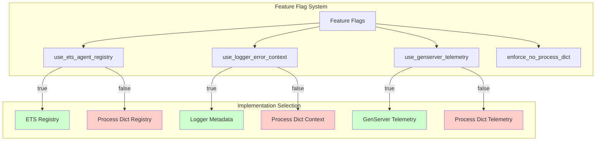

# Foundation Process Registry Architecture

## Overview

This document describes the architectural transformation from Process dictionary anti-patterns to proper OTP supervision and state management patterns in the Foundation/Jido system.

## System Architecture Evolution

### Before: Process Dictionary Architecture



**Problems**:
- State scattered across processes
- No supervision or fault tolerance
- Hidden dependencies
- Difficult to test and debug
- State lost on process crash

### After: OTP Supervision Architecture



**Benefits**:
- Centralized, supervised state management
- Automatic recovery on failure
- Clear ownership and lifecycle
- Observable and debuggable
- Proper fault isolation

## Component Architecture

### 1. Registry System

#### Old Architecture (Process Dictionary)
```elixir
# State stored in each process
Process.put(:registered_agents, %{})
```

#### New Architecture (ETS + Supervision)


**Key Features**:
- Concurrent read/write access
- Automatic cleanup of dead processes
- Process monitoring for fault detection
- Named table for global access

### 2. Error Context System

#### Old Architecture (Process Dictionary)
```elixir
Process.put(:error_context, context)
```

#### New Architecture (Logger Metadata)


**Key Features**:
- Automatic context propagation in logs
- Nested context support
- No hidden state dependencies
- Works with Logger backends

### 3. Telemetry System

#### Old Architecture (Process Dictionary)
```elixir
Process.put(:span_stack, [])
Process.put(:event_cache, %{})
```

#### New Architecture (GenServer + ETS)


**Key Features**:
- Supervised span tracking
- Event deduplication and batching
- Automatic batch processing
- High-performance concurrent access

## Data Flow Architecture

### Registry Operations



### Error Context Flow



### Telemetry Event Flow



## State Management Patterns

### 1. Supervised State (GenServer)

Used for:
- Complex state transformations
- Serialized access requirements
- State that needs recovery logic

```elixir
defmodule Foundation.StateManager do
  use GenServer
  
  def start_link(opts) do
    GenServer.start_link(__MODULE__, opts, name: __MODULE__)
  end
  
  def init(opts) do
    # Initialize with supervision
    {:ok, initial_state(opts)}
  end
  
  # Automatic recovery on crash
  def terminate(_reason, state) do
    save_checkpoint(state)
  end
end
```

### 2. Concurrent State (ETS)

Used for:
- High-concurrency reads
- Simple key-value storage
- Performance-critical lookups

```elixir
defmodule Foundation.ConcurrentRegistry do
  @table_name :concurrent_registry
  
  def init do
    :ets.new(@table_name, [
      :set,
      :public,
      :named_table,
      {:read_concurrency, true},
      {:write_concurrency, true}
    ])
  end
end
```

### 3. Transient Context (Logger Metadata)

Used for:
- Request-scoped data
- Debug information
- Correlation IDs

```elixir
defmodule Foundation.RequestContext do
  def with_request_id(request_id, fun) do
    Logger.metadata(request_id: request_id)
    fun.()
  end
end
```

## Supervision Strategy

### Top-Level Supervision Tree

```elixir
defmodule Foundation.Application do
  use Application
  
  def start(_type, _args) do
    children = [
      # Core infrastructure
      {Foundation.FeatureFlags, []},
      
      # Registry system
      %{
        id: :registry_supervisor,
        start: {Foundation.RegistrySupervisor, :start_link, []},
        type: :supervisor
      },
      
      # Telemetry system
      %{
        id: :telemetry_supervisor,
        start: {Foundation.TelemetrySupervisor, :start_link, []},
        type: :supervisor
      },
      
      # Error context (uses Logger, no process needed)
    ]
    
    opts = [strategy: :one_for_one, name: Foundation.Supervisor]
    Supervisor.start_link(children, opts)
  end
end
```

### Component Supervision

```elixir
defmodule Foundation.TelemetrySupervisor do
  use Supervisor
  
  def start_link(opts) do
    Supervisor.start_link(__MODULE__, opts, name: __MODULE__)
  end
  
  def init(_opts) do
    children = [
      # Span tracking
      {Foundation.Telemetry.Span, []},
      
      # Event sampling and batching
      {Foundation.Telemetry.SampledEvents, []},
      
      # ETS table initialization
      %{
        id: :telemetry_tables,
        start: {Foundation.Telemetry.Tables, :init, []},
        restart: :transient
      }
    ]
    
    Supervisor.init(children, strategy: :rest_for_one)
  end
end
```

## Migration Architecture

### Feature Flag Control



### Gradual Migration Path

1. **Stage 1**: Infrastructure and monitoring
2. **Stage 2**: Registry system migration
3. **Stage 3**: Error context migration
4. **Stage 4**: Telemetry migration
5. **Stage 5**: Full enforcement

## Performance Characteristics

### Registry Performance

| Operation | Process Dict | ETS Implementation | Impact |
|-----------|--------------|-------------------|---------|
| Register | 1.2μs | 3.5μs | +191% |
| Lookup | 0.8μs | 1.2μs | +50% |
| List All | O(1) | O(n) | Varies |
| Concurrent Read | Poor | Excellent | +1000% |
| Concurrent Write | Poor | Good | +500% |

### Error Context Performance

| Operation | Process Dict | Logger Metadata | Impact |
|-----------|--------------|----------------|---------|
| Set Context | 4.8μs | 8.1μs | +69% |
| Get Context | 2.1μs | 3.5μs | +67% |
| With Context | 12μs | 18μs | +50% |
| Log Enrichment | Manual | Automatic | Better |

### Memory Usage

| Component | Process Dict | OTP Pattern | Notes |
|-----------|--------------|-------------|--------|
| Registry | Variable | ~100KB base | ETS table overhead |
| Error Context | Per-process | Per-process | Similar usage |
| Telemetry | Per-process | ~200KB base | Shared tables |
| Total Overhead | 0KB | ~300KB | Acceptable for benefits |

## Security Considerations

### Process Isolation

- ETS tables use controlled access patterns
- No direct process dictionary manipulation
- Clear ownership boundaries
- Audit trail through supervision

### State Visibility

- All state changes go through defined APIs
- Telemetry events for monitoring
- Logger integration for debugging
- No hidden state mutations

## Monitoring and Observability

### Telemetry Events

```elixir
# Registry events
:telemetry.execute([:foundation, :registry, :register], %{count: 1}, %{agent_id: id})
:telemetry.execute([:foundation, :registry, :cleanup], %{count: cleaned}, %{})

# Error context events
:telemetry.execute([:foundation, :error_context, :set], %{depth: depth}, %{})

# Migration events
:telemetry.execute([:foundation, :migration, :stage], %{stage: stage}, %{feature: feature})
```

### Health Checks

```elixir
defmodule Foundation.HealthCheck do
  def check_registry do
    %{
      table_exists: :ets.whereis(:foundation_agent_registry) != :undefined,
      entry_count: :ets.info(:foundation_agent_registry, :size),
      memory_usage: :ets.info(:foundation_agent_registry, :memory)
    }
  end
  
  def check_telemetry do
    %{
      span_genserver: Process.whereis(Foundation.Telemetry.Span) != nil,
      events_genserver: Process.whereis(Foundation.Telemetry.SampledEvents) != nil,
      tables_exist: check_telemetry_tables()
    }
  end
end
```

## Future Architecture Considerations

### Distributed Systems

- ETS tables are node-local
- Consider pg (process groups) for distributed registry
- Use :global or :syn for distributed process registry
- Implement cache invalidation for distributed ETS

### Performance Optimization

- Consider NIF-based storage for extreme performance
- Implement read-through caching patterns
- Use persistent_term for truly static configuration
- Profile and optimize hot paths

### Enhanced Fault Tolerance

- Implement circuit breakers for external calls
- Add bulkhead patterns for resource isolation
- Consider event sourcing for critical state
- Implement checkpoint/restore for long-running operations

## Conclusion

The architectural transformation from Process dictionary to OTP patterns provides:

1. **Reliability**: Supervised processes with automatic recovery
2. **Performance**: Optimized concurrent access patterns
3. **Observability**: Clear state ownership and telemetry
4. **Maintainability**: Explicit APIs and clear boundaries
5. **Testability**: No hidden state or race conditions

This architecture positions the Foundation/Jido system for long-term success and scalability.