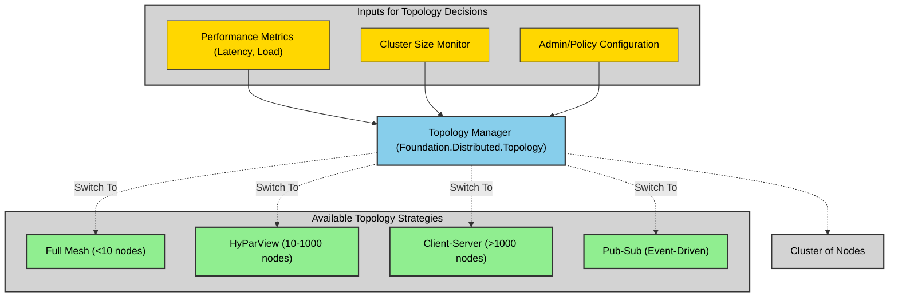

```mermaid
graph TD
    TM["Topology Manager (Foundation.Distributed.Topology)"]

    subgraph "Available Topology Strategies"
        direction LR
        FS["Full Mesh (<10 nodes)"]
        HV["HyParView (10-1000 nodes)"]
        CS["Client-Server (>1000 nodes)"]
        PS["Pub-Sub (Event-Driven)"]
    end

    Cluster["Cluster of Nodes"]

    subgraph "Inputs for Topology Decisions"
        direction TB
        Metrics["Performance Metrics (Latency, Load)"]
        ClusterSize["Cluster Size Monitor"]
        Admin["Admin/Policy Configuration"]
    end

    %% Inputs to Topology Manager
    Metrics --> TM
    ClusterSize --> TM
    Admin --> TM

    %% Topology Manager controls the Cluster's topology
    TM -.-> Cluster

    %% Topology Manager selects a strategy
    TM -. "Switch To" .-> FS
    TM -. "Switch To" .-> HV
    TM -. "Switch To" .-> CS
    TM -. "Switch To" .-> PS

    %% Styling
    classDef manager fill:#87CEEB,stroke:#333,stroke-width:2px,color:#000;
    classDef topology fill:#90EE90,stroke:#333,stroke-width:2px,color:#000;
    classDef input fill:#FFD700,stroke:#333,stroke-width:1px,color:#000;
    classDef cluster fill:#D3D3D3,stroke:#333,stroke-width:2px,color:#000;

    class TM manager;
    class FS,HV,CS,PS topology;
    class Metrics,ClusterSize,Admin input;
    class Cluster cluster;
```
