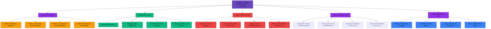

```mermaid
graph TD
    A["Foundation 2.0: BEAM-Native + Partisan-Distributed"] --> B["Enhanced Core Services"]
    A --> C["BEAM Primitives Layer"]
    A --> D["Partisan Distribution Layer"]
    A --> E["Process Ecosystems Layer"]
    A --> F["Intelligent Infrastructure Layer"]

    B --> B1["Config 2.0: Enhanced + Distributed"]
    B --> B2["Events 2.0: Enhanced + Partisan Channels"]
    B --> B3["Telemetry 2.0: Enhanced + Cluster Aggregation"]
    B --> B4["Registry 2.0: Enhanced + Service Mesh"]

    C --> C1["Processes: Ecosystems ✅"]
    C --> C2["Messages: Binary Optimization"]
    C --> C3["Schedulers: Reduction Awareness"]
    C --> C4["Memory: Atom Safety + GC Patterns"]

    D --> D1["Distribution: Partisan Integration"]
    D --> D2["Channels: Multi-channel Communication"]
    D --> D3["Topology: Dynamic Network Management"]
    D --> D4["Discovery: Multi-strategy Node Discovery"]

    E --> E1["Coordination: Partisan-aware Ecosystems"]
    E --> E2["Communication: Cross-node Messaging"]
    E --> E3["Supervision: Distributed Process Trees"]
    E --> E4["Patterns: Mesh/Tree/Ring across Cluster"]

    F --> F1["Adaptive: Self-optimizing Topologies"]
    F --> F2["Prediction: Predictive Scaling"]
    F --> F3["Healing: Self-recovery Mechanisms"]
    F --> F4["Context: Global Request Tracing"]

    %% Styling
    classDef primary fill:#6B46C1,stroke:#4C1D95,stroke-width:3px,color:#000;
    classDef secondary fill:#9333EA,stroke:#6B21A8,stroke-width:2px,color:#000;
    classDef partisan fill:#EF4444,stroke:#B91C1C,stroke-width:3px,color:#000;
    classDef beam fill:#10B981,stroke:#047857,stroke-width:2px,color:#000;
    classDef enhanced fill:#F59E0B,stroke:#D97706,stroke-width:2px,color:#000;
    classDef intelligent fill:#3B82F6,stroke:#1D4ED8,stroke-width:2px,color:#000;

    class A primary
    class B,E,F secondary
    class D,D1,D2,D3,D4 partisan
    class C,C1,C2,C3,C4 beam
    class B1,B2,B3,B4 enhanced
    class F1,F2,F3,F4 intelligent
```
