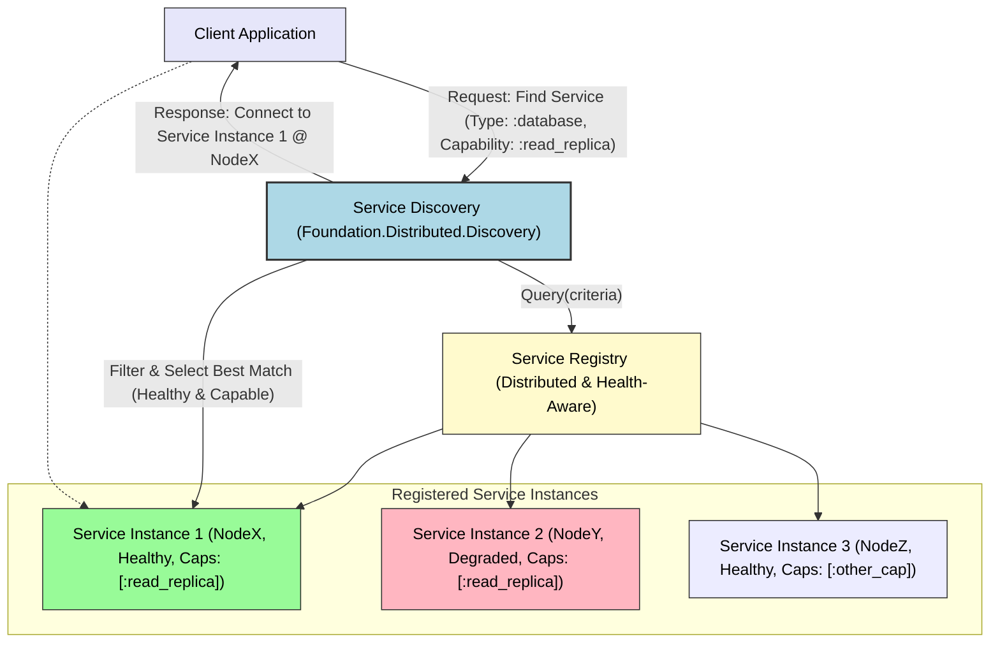

```mermaid
graph TD
    Client["Client Application"]
    SD["Service Discovery (Foundation.Distributed.Discovery)"]
    SR["Service Registry (Distributed & Health-Aware)"]

    subgraph "Registered Service Instances"
        Service1["Service Instance 1 (NodeX, Healthy, Caps: [:read_replica])"]
        Service2["Service Instance 2 (NodeY, Degraded, Caps: [:read_replica])"]
        Service3["Service Instance 3 (NodeZ, Healthy, Caps: [:other_cap])"]
    end

    %% Client requests service
    Client -- "Request: Find Service (Type: :database, Capability: :read_replica)" --> SD

    %% Service Discovery queries Registry
    SD -- "Query(criteria)" --> SR

    %% Registry shows available (but not yet filtered) services
    SR --> Service1
    SR --> Service2
    SR --> Service3

    %% Registry returns results (conceptually, SD will filter these)
    %% SR -- "Results[Service1, Service2, Service3]" --> SD
    %% Mermaid doesn't easily show data packets on return arrows like this without clutter,
    %% so the filtering logic is shown in the next step by SD.

    %% Service Discovery selects the best match
    SD -- "Filter & Select Best Match (Healthy & Capable)" --> Service1

    %% Service Discovery returns the selected service to Client
    SD -- "Response: Connect to Service Instance 1 @ NodeX" --> Client

    %% Client connects to the chosen service
    Client -.-> Service1

    %% Styling
    classDef client fill:#E6E6FA,stroke:#333,color:#000;
    classDef discovery fill:#ADD8E6,stroke:#333,stroke-width:2px,color:#000;
    classDef registry fill:#FFFACD,stroke:#333,color:#000;
    classDef service fill:#98FB98,stroke:#333,color:#000;
    classDef unhealthy_service fill:#FFB6C1,stroke:#333,color:#000;
    classDef nonmatch_service fill:#LIGHTGRAY,stroke:#333,color:#000;

    class Client client;
    class SD discovery;
    class SR registry;
    class Service1 service;
    class Service2 unhealthy_service;
    class Service3 nonmatch_service;
```
