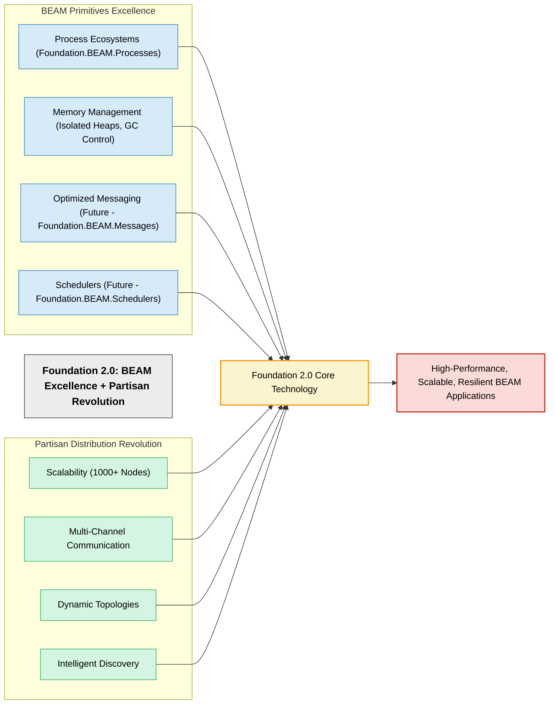

```mermaid
graph LR
    Title["Foundation 2.0: BEAM Excellence + Partisan Revolution"]

    subgraph BEAM_Primitives_Excellence["BEAM Primitives Excellence"]
        direction TB
        BP_Proc["Process Ecosystems (Foundation.BEAM.Processes)"]
        BP_Mem["Memory Management (Isolated Heaps, GC Control)"]
        BP_Msg["Optimized Messaging (Future - Foundation.BEAM.Messages)"]
        BP_Sched["Schedulers (Future - Foundation.BEAM.Schedulers)"]
    end

    subgraph Partisan_Distribution_Revolution["Partisan Distribution Revolution"]
        direction TB
        PD_Scale["Scalability (1000+ Nodes)"]
        PD_MC["Multi-Channel Communication"]
        PD_DT["Dynamic Topologies"]
        PD_SD["Intelligent Discovery"]
    end

    CoreTech["Foundation 2.0 Core Technology"]
    F2App["High-Performance, Scalable, Resilient BEAM Applications"]

    %% Connections from BEAM Primitives to Core Technology
    BP_Proc --> CoreTech
    BP_Mem --> CoreTech
    BP_Msg --> CoreTech
    BP_Sched --> CoreTech

    %% Connections from Partisan Features to Core Technology
    PD_Scale --> CoreTech
    PD_MC --> CoreTech
    PD_DT --> CoreTech
    PD_SD --> CoreTech

    %% Core Technology enables Foundation 2.0 Applications
    CoreTech --> F2App

    %% Styling
    classDef beam_primitive fill:#D6EAF8,stroke:#2980B9,color:#000;
    classDef partisan_feature fill:#D5F5E3,stroke:#27AE60,color:#000;
    classDef core fill:#FCF3CF,stroke:#F39C12,stroke-width:2px,color:#000;
    classDef app fill:#FADBD8,stroke:#C0392B,stroke-width:2px,color:#000;
    classDef main_title fill:#ECECEC,stroke:#333,font-size:18px,font-weight:bold,color:#000;

    class Title main_title;
    class BP_Proc,BP_Mem,BP_Msg,BP_Sched beam_primitive;
    class PD_Scale,PD_MC,PD_DT,PD_SD partisan_feature;
    class CoreTech core;
    class F2App app;

    %% Note: Mermaid doesn't directly style subgraph titles via classDef in older versions.
    %% The title string itself is what's displayed. The 'pillar_title' class was removed as it's not standard.
    %% Individual elements within subgraphs are styled.
    %% For subgraphs, direction TB was chosen for better layout within the LR main graph for the pillars.
```
