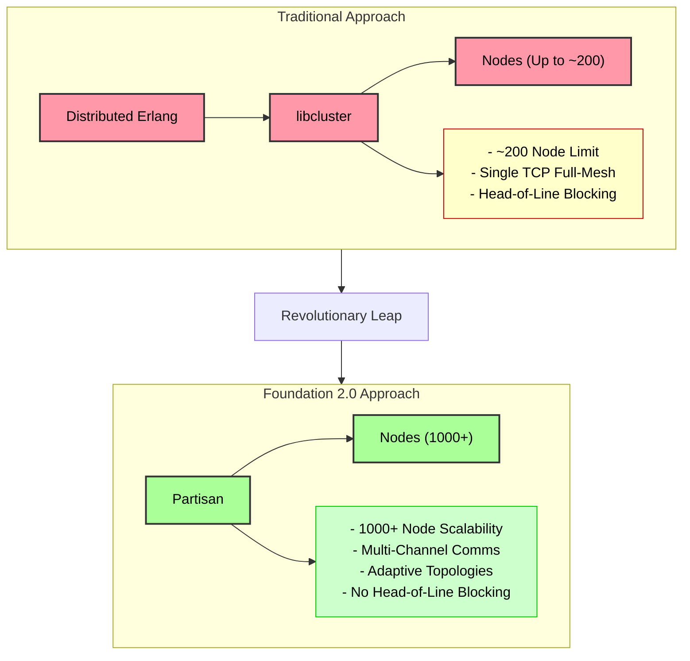

```mermaid
graph TD
    subgraph TraditionalApproach["Traditional Approach"]
        direction LR
        DE["Distributed Erlang"]
        LC["libcluster"]
        NodesA["Nodes (Up to ~200)"]
        Limitations["- ~200 Node Limit
- Single TCP Full-Mesh
- Head-of-Line Blocking"]

        DE --> LC
        LC --> NodesA
        LC --> Limitations
    end

    subgraph Foundation2Approach["Foundation 2.0 Approach"]
        direction LR
        P["Partisan"]
        NodesB["Nodes (1000+)"]
        Advantages["- 1000+ Node Scalability
- Multi-Channel Comms
- Adaptive Topologies
- No Head-of-Line Blocking"]

        P --> NodesB
        P --> Advantages
    end

    TraditionalApproach --> Transition["Revolutionary Leap"] --> Foundation2Approach

    classDef old fill:#f9a,stroke:#333,stroke-width:2px,color:#000;
    classDef new fill:#af9,stroke:#333,stroke-width:2px,color:#000;
    classDef limitation fill:#ffc,stroke:#c00,stroke-width:1px,color:#000;
    classDef advantage fill:#cfc,stroke:#0c0,stroke-width:1px,color:#000;

    class DE,LC,NodesA old
    class P,NodesB new
    class Limitations limitation
    class Advantages advantage
```
