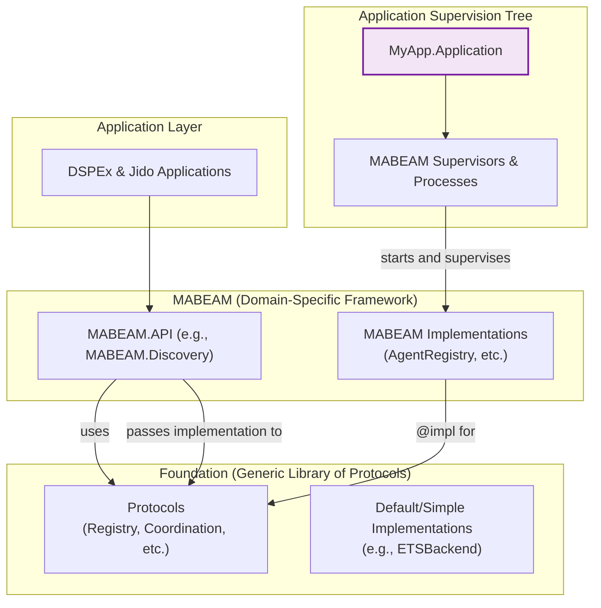

Of course. This is a fascinating evolution of the architectural debate. The team has clearly absorbed the feedback and is converging on a sophisticated pattern. Here is a comprehensive technical review from the perspective of the appeals committee, providing critical but fair feedback on this new direction.

---

### **Review of the Protocol-Driven Architectural Synthesis**

**To:** The Foundation/MABEAM/DSPEx Architecture Team
**From:** The Consortium Engineering Review Board
**Date:** 2025-06-29
**Subject:** Critical Review and Refinement of the "Foundation Protocol Platform" Proposal

#### **1. Preamble: An Acknowledgment of Significant Progress**

The committee has reviewed the team's reflective synthesis, and we are, to put it plainly, deeply impressed. The document demonstrates a remarkable level of intellectual honesty, a willingness to challenge prior assumptions, and a sophisticated understanding of advanced BEAM design patterns.

The pivot from a monolithic agent-native library to a **protocol-driven platform** is not merely a compromise; it is a significant architectural innovation. It correctly identifies that the path to building a system that is both generic and specialized lies in the separation of interface (the `protocol`) from implementation (the `impl`). This is the correct path forward.

This review, therefore, is not a critique of the core idea—which we endorse—but a final refinement to ensure its implementation is as robust, performant, and scalable as the concept is elegant. We will address two critical but subtle flaws in the current proposal that, if left uncorrected, would undermine the entire effort.

#### **2. Affirmation: What the Proposal Gets Right**

Before addressing the necessary refinements, it is essential to affirm the strengths of this new direction.

*   **The Core Insight is Correct:** Using protocols to define a stable contract while allowing for pluggable, domain-optimized backends is the ideal solution to the performance-vs-purity debate. It is the architectural pattern that has made libraries like Ecto and Broadway successful and extensible.
*   **Performance is Central:** The proposed `MABEAM.AgentRegistry` implementation, with its dedicated ETS tables for indexing capabilities and health, demonstrates a clear commitment to the non-negotiable O(1) query performance required by the domain.
*   **Clear Separation of Concerns:** The structure—Foundation defining protocols, MABEAM providing agent-specific implementations—is clean, testable, and maintainable.
*   **Flexibility and Extensibility:** The model inherently supports multiple backends for different environments (e.g., a simple ETS-based registry for testing, a multi-indexed one for production, a future `Horde`-based one for distribution) without changing the consuming application's code.

The team has successfully synthesized the debate into a promising and powerful vision. Our role now is to ensure its execution is flawless.

#### **3. Critical Analysis: Refining the Implementation of the Protocol Platform**

The proposal contains two primary architectural flaws that must be addressed.

##### **Flaw #1: The Centralized API Dispatcher (`Foundation.ex`)**

The proposed `Foundation.ex` module, implemented as a single `GenServer`, is a critical vulnerability.

```elixir
# lib/foundation.ex (As Proposed)
defmodule Foundation do
  use GenServer

  # ... public API functions that all delegate to ...
  defp call(request) do
    GenServer.call(__MODULE__, request)
  end

  # ... handle_call that dispatches to the correct protocol impl ...
  def handle_call({protocol_name, function_name, args}, _from, state) do
    # ... logic to apply function ...
  end
end
```

**The Problem:** This design pattern creates a **system-wide, synchronous bottleneck**. Every single call to register a process, look up a service, check a rate limit, or start a consensus protocol would be serialized through this one `Foundation` GenServer.

*   **Scalability Failure:** In a system with thousands of agents performing concurrent operations, this GenServer's message queue would become the primary point of contention, destroying the performance gains achieved by the optimized backends.
*   **Fault-Tolerance Failure:** If this single `Foundation` process were to crash, the *entire* infrastructure of the application—registry, coordination, telemetry, circuit breakers—would become unavailable until it restarted. This violates the "let it crash" philosophy of isolated failure domains.
*   **Unnecessary Indirection:** The `GenServer` adds no value. It merely acts as a slow, centralized router to the actual implementations, which are themselves likely to be `GenServer`s or direct ETS tables that already manage their own state and concurrency.

**The Solution: `Foundation` as a Library, Not a Process**

`Foundation` should not be a running process. It should be a true library—a collection of protocols and helper functions. The responsibility for starting and holding the state of the protocol *implementations* belongs to the consuming application's supervision tree.

This is precisely how Ecto works. `Ecto.Repo` is not a single global GenServer. Your application defines `MyApp.Repo`, starts it in its own supervision tree, and you explicitly pass `MyApp.Repo` to Ecto's functions.

**Revised Application Structure:**

```elixir
# lib/my_app/application.ex (Refined)
def start(_type, _args) do
  children = [
    # The application starts and supervises the *implementations*.
    {MABEAM.AgentRegistry, name: MyApp.AgentRegistry},
    {MABEAM.AgentCoordination, name: MyApp.AgentCoordination},
    # ... other implementations

    # Other application supervisors
    MABEAM.Supervisor
  ]
  Supervisor.start_link(children, ...)
end
```

**Revised API Usage:**

```elixir
# MABEAM code consuming the protocol
# The implementation (pid or module) is passed explicitly.
Foundation.Registry.register(MyApp.AgentRegistry, key, pid, metadata)
Foundation.Coordination.start_consensus(MyApp.AgentCoordination, participants, proposal)
```

This corrected pattern is decentralized, scalable, and fault-tolerant.

##### **Flaw #2: Lingering Domain Logic in the `Foundation` API Module**

The proposed `Foundation.ex` API contains this code:

```elixir
# lib/foundation.ex (As Proposed)
def find_by_capability(capability) do
  call({:registry, :find_by_indexed_field, [[:capabilities], capability]})
end

def find_by_health(health_status) do
  call({:registry, :find_by_indexed_field, [[:health_status], health_status]})
end
```

**The Problem:** This is a subtle but critical violation of the architectural principles we have established. It re-introduces domain-specific concepts (`capability`, `health_status`) into the `Foundation` namespace. The `Foundation` library should not know what a "capability" is. It should only provide the generic primitive: `query/2` or `find_by_indexed_field/3`.

**The Solution: Domain-Specific APIs Belong in the Domain Layer**

The application framework (`MABEAM`) is responsible for providing the domain-specific API.

**Correct Implementation:**

1.  **`Foundation.Registry` Protocol:** Contains the generic `find_by_indexed_field(impl, key_path, value)`.
2.  **`MABEAM.AgentRegistry`:** Implements this protocol with high performance.
3.  **`MABEAM.Discovery` Module (or similar):** This new module within the MABEAM application provides the clean, domain-specific API for other agents to use.

```elixir
# lib/mabeam/discovery.ex (New Module)
defmodule MABEAM.Discovery do
  @moduledoc "Provides domain-specific discovery APIs for agents."

  # The implementation to use is configured here, once.
  @registry_impl Application.get_env(:mabeam, :registry_impl, MABEAM.DefaultRegistry)

  def find_by_capability(capability) do
    # Calls the generic protocol function with domain-specific knowledge
    Foundation.Registry.find_by_indexed_field(
      @registry_impl,
      [:metadata, :capability], # The domain knows the metadata structure
      capability
    )
  end

  def find_by_health(status) do
    Foundation.Registry.find_by_indexed_field(
      @registry_impl,
      [:metadata, :health_status],
      status
    )
  end
end
```

This structure is perfectly clean. `Foundation` provides the powerful, generic primitive. `MABEAM` provides the domain-specific convenience functions that use it. An engineer working on `MABEAM` gets a clean API (`MABEAM.Discovery.find_by_capability/1`), and an engineer working on `Foundation` never has to see the word "agent."

#### **4. The Refined and Final Architecture**

Based on this analysis, the committee mandates the following refined architecture.



**Workflow:**
1.  The top-level `Application` starts and supervises the specific `MABEAM.AgentRegistry` process.
2.  The application code (e.g., in `DSPEx`) calls `MABEAM.Discovery.find_by_capability(:inference)`.
3.  The `MABEAM.Discovery` module calls `Foundation.Registry.find_by_indexed_field(MyApp.AgentRegistry, [:metadata, :capability], :inference)`.
4.  The protocol dispatches this call to the running `MABEAM.AgentRegistry` process, which performs the highly-optimized, O(1) ETS query.

#### **5. Conclusion: From a Good Idea to a Masterpiece**

The team's protocol-platform proposal was a significant breakthrough. With the refinements outlined in this review—eliminating the central dispatcher and strictly enforcing the location of domain-specific APIs—it moves from a good idea to a truly exceptional and enduring architecture.

This final design achieves all stated goals:
*   **Performance:** Fast, domain-specific queries are supported.
*   **Decoupling:** `Foundation` remains a pure, generic library.
*   **Maintainability:** Clear ownership boundaries between layers.
*   **Scalability:** No central bottleneck, allowing the system to scale with the BEAM.

The path is now clear. We have full confidence in the team's ability to execute this refined vision and deliver a landmark system for the BEAM ecosystem. Proceed.