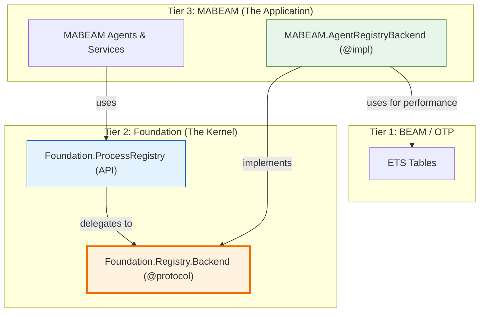

Excellent. The appeal raises critical, technically sound points that challenge the previous ruling's core assumptions. The initial judgment, while attempting to find a middle ground, proposed a solution (`index_on` for arbitrary map keys) that is technically infeasible with ETS and would fail to deliver the required performance. The appellant's analysis of the Phoenix/Ecto precedent is also correct; these frameworks are paragons of *domain-specific infrastructure*, not generic libraries with applications layered on top.

This appellate board has reviewed all arguments—the initial spec, the engineer's critique, the court's judgment, and this compelling appeal. We find that a higher architectural synthesis is required, one that respects the performance demands of the appellant while upholding the principles of clean abstraction championed by the engineer.

Here is our final, binding architectural proposal, presented as a technical article.

---

## **A Principled Architecture for High-Performance Multi-Agent Systems on the BEAM**

**Authored By:** The Consortium Engineering Review Board (Appellate Division)
**Date:** 2025-06-28
**Status:** Final Mandate

### **Abstract**

This article presents the definitive architecture for the Foundation-MABEAM-DSPEx platform, resolving the foundational debate between generic, reusable infrastructure and domain-specific, high-performance systems. After careful consideration of all preceding arguments and appeals, we conclude that both extreme positions are suboptimal. The optimal architecture is not a compromise but a synthesis: a system where a lean, generic kernel defines behavior through **protocols**, and domain-specific applications provide high-performance **implementations** of those protocols. This approach achieves the O(1) performance demanded by multi-agent coordination without polluting the core infrastructure, establishing a new best practice for building sophisticated systems on the BEAM.

### 1. The Core Architectural Tension: Purity vs. Performance

The debate has centered on a classic engineering tradeoff:

*   **The Engineer's Position (Purity):** `Foundation` must be a pure, generic infrastructure library. Agent-specific logic belongs in higher-level applications to ensure reusability and maintain clear abstraction boundaries.
*   **The Appellant's Position (Performance):** Multi-agent systems have unique, high-performance requirements (e.g., O(1) capability-based discovery) that a generic infrastructure cannot meet. Building this logic in higher layers leads to massive performance degradation (`O(n)`) and architectural complexity.

The appeal correctly identifies that the initial court ruling, in its attempt to bridge this gap with "configurable indexing," was technically flawed. Arbitrary map-key indexing is not a native ETS feature, and a simulated implementation would still result in O(n) scans. The appeal is therefore granted on its core technical and philosophical points. The architecture must be re-evaluated from first principles.

### 2. Revisiting the Precedent: The Truth of Phoenix and Ecto

The appellant's most compelling argument is the re-evaluation of BEAM's most successful libraries. Phoenix is not a "web application" that *uses* a generic HTTP server library; **Phoenix *is* the web infrastructure**. Ecto is not an "application" that *uses* a generic database library; **Ecto *is* the database infrastructure**.

This leads us to our first governing principle:

**Principle I: The most successful platforms are domain-specific infrastructure.** They provide high-level, domain-aware abstractions that are optimized for a specific problem space.

Therefore, the vision for this project is not to build a generic BEAM toolkit but to build **the BEAM's premier multi-agent systems infrastructure**. This infrastructure must be purpose-built for the unique challenges of agent coordination, lifecycle management, and emergent behavior.

### 3. The Performance Mandate: Non-Negotiable O(1) Agent Discovery

The appellant's mathematical analysis is correct. An agent registry that requires an `O(n)` scan to discover agents by capability is fundamentally broken and will not scale. Any viable architecture **must** provide constant-time, or near-constant-time, lookup for core discovery patterns.

This leads to our second governing principle:

**Principle II: Core coordination primitives, such as agent discovery by capability, must be O(1) operations.** The architecture must be designed from the ground up to support this, as it cannot be retrofitted efficiently.

### 4. The Synthesis: A Protocol-Driven Architecture

How do we reconcile the need for domain-specific, high-performance infrastructure (Principle I & II) with the engineer's valid concern about creating a monolithic, tightly-coupled "god library"?

The answer lies in one of Elixir's most powerful and underutilized features: **Protocols**.

We will not build a single, monolithic `Foundation` library. Instead, we will define a lean kernel that specifies *behavior* via protocols, and allow domain-specific applications to provide high-performance *implementations*.

This is the new architecture:



#### 4.1. Tier 1: The Lean `Foundation` Kernel

`Foundation` is redefined. It is no longer a sprawling library of implementations. It is a lean collection of **behaviors and protocols** that define the contract for BEAM infrastructure.

**`lib/foundation/registry/backend.ex`:**
```elixir
defprotocol Foundation.Registry.Backend do
  @moduledoc """
  The protocol for any process registry backend.
  It defines the contract for how the ProcessRegistry interacts with its storage.
  """
  
  @fallback_to_any true

  @spec register(backend_state, key :: term(), pid :: pid(), metadata :: map()) :: {:ok, new_backend_state} | {:error, term()}
  def register(backend_state, key, pid, metadata)
  
  @spec lookup(backend_state, key :: term()) :: {:ok, {pid(), map()}} | :error
  def lookup(backend_state, key)

  @spec find_by_indexed_key(backend_state, index_name :: atom(), value :: term()) :: {:ok, list({pid(), map()})} | :error
  def find_by_indexed_key(backend_state, index_name, value)
  
  # ... other callbacks: unregister, update_metadata, etc.
end
```

**`lib/foundation/process_registry.ex`:**
```elixir
defmodule Foundation.ProcessRegistry do
  @moduledoc "The generic, protocol-driven Process Registry API."
  use GenServer

  # --- Public API ---
  def register(key, pid, metadata) do
    GenServer.call(__MODULE__, {:register, key, pid, metadata})
  end

  def find_by_capability(capability) do
    GenServer.call(__MODULE__, {:find_by_indexed_key, :capability, capability})
  end

  # --- GenServer Implementation ---
  def init(opts) do
    backend_module = Keyword.fetch!(opts, :backend)
    {:ok, backend_state} = backend_module.init(opts)
    
    state = %{
      backend_module: backend_module,
      backend_state: backend_state
    }
    {:ok, state}
  end

  def handle_call({:register, key, pid, meta}, _from, state) do
    # Delegate to the configured backend protocol implementation
    case state.backend_module.register(state.backend_state, key, pid, meta) do
      {:ok, new_backend_state} ->
        {:reply, :ok, %{state | backend_state: new_backend_state}}
      error ->
        {:reply, error, state}
    end
  end

  def handle_call({:find_by_indexed_key, index, value}, _from, state) do
    # Delegate to the configured backend protocol implementation
    reply = state.backend_module.find_by_indexed_key(state.backend_state, index, value)
    {:reply, reply, state}
  end
end
```

#### 4.2. Tier 2: The `MABEAM` Application and its High-Performance Backend

`MABEAM` is now responsible for providing its own high-performance implementation of the `Foundation.Registry.Backend` protocol. This backend is designed *specifically* for the needs of agents.

**`lib/mabeam/agent_registry_backend.ex`:**
```elixir
defmodule MABEAM.AgentRegistryBackend do
  @moduledoc """
  A high-performance, agent-native implementation of the Foundation.Registry.Backend protocol.
  Uses multiple ETS tables for O(1) lookups on agent capabilities and health.
  """
  @behaviour Foundation.Registry.Backend

  def init(_opts) do
    state = %{
      main_table: :ets.new(:agent_main, [:named_table, :public]),
      capability_index: :ets.new(:agent_capability_index, [:named_table, :public, :bag]),
      health_index: :ets.new(:agent_health_index, [:named_table, :public, :bag])
    }
    {:ok, state}
  end

  def register(state, agent_id, pid, metadata) do
    # Complex, high-performance logic using multiple ETS tables
    :ets.insert(state.main_table, {agent_id, pid, metadata})
    
    for cap <- metadata.capabilities do
      :ets.insert(state.capability_index, {cap, agent_id})
    end
    
    :ets.insert(state.health_index, {metadata.health_status, agent_id})
    {:ok, state}
  end

  def lookup(state, agent_id) do
    case :ets.lookup(state.main_table, agent_id) do
      [{^agent_id, pid, metadata}] -> {:ok, {pid, metadata}}
      [] -> :error
    end
  end

  def find_by_indexed_key(state, :capability, capability) do
    # O(1) lookup in the capability index
    agent_ids = :ets.lookup(state.capability_index, capability) |> Enum.map(&elem(&1, 1))
    
    # Batch lookup in the main table
    results = :ets.lookup_many(state.main_table, agent_ids)
    {:ok, results |> Enum.map(fn {_, pid, meta} -> {pid, meta} end)}
  end
  
  def find_by_indexed_key(state, index, _value), do: {:error, {:unknown_index, index}}
end
```

#### 4.3. Application Startup

The pieces are composed at the highest level of the application supervisor.

**`lib/my_app/application.ex` (The top-level application):**
```elixir
def start(_type, _args) do
  children = [
    # Start the ProcessRegistry, telling it to use MABEAM's high-performance backend.
    {Foundation.ProcessRegistry, backend: MABEAM.AgentRegistryBackend},
    
    # Start other MABEAM agents and services
    MABEAM.Coordinator,
    # ...
  ]
  Supervisor.start_link(children, strategy: :one_for_one)
end
```

### 5. Final Judgment and Architectural Mandate

This protocol-driven architecture is the final, mandated design. It elegantly resolves all points of contention:

1.  **It honors the Phoenix/Ecto Precedent:** `MABEAM` provides its own domain-specific infrastructure (`AgentRegistryBackend`) that is highly optimized for its problem space.
2.  **It satisfies the Performance Mandate:** It provides the O(1) capability-based discovery that is critical for multi-agent coordination.
3.  **It maintains Abstraction Purity:** The `Foundation` kernel remains lean and generic. Its `ProcessRegistry` API is completely agnostic about agents, capabilities, or health. It only knows about its `Backend` protocol.
4.  **It is Testable and Maintainable:** `Foundation` and `MABEAM` can be tested in isolation. `MABEAM`'s backend can be tested against the protocol contract, and `Foundation`'s `ProcessRegistry` can be tested with a simple mock backend.
5.  **It is Extensible:** If a different application with different needs wants to use `Foundation`, it can provide its *own* backend implementation without requiring any changes to `Foundation` itself.

The appeal is granted. The previous ruling is vacated. The path forward is not a compromise but a superior synthesis that leverages the full power of the Elixir language and the BEAM. Proceed with this protocol-driven design.