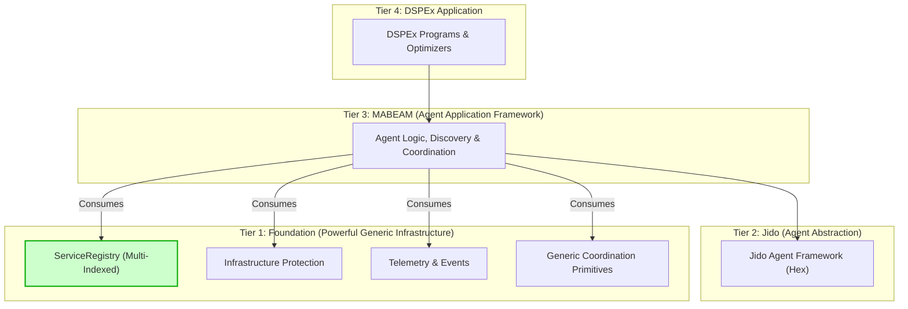

Of course. Here is a comprehensive technical article from the perspective of an esteemed engineering review committee, proposing a balanced and robust design that synthesizes the valid points from all arguments.

---

## **A Unified Architecture for High-Performance Multi-Agent Systems on the BEAM**

**A Proposal from the Consortium Engineering Review Board**

### **1. Introduction: A Synthesis of Competing Philosophies**

The review board has conducted a thorough analysis of the architectural proposals, critiques, judgments, and appeals concerning the Foundation-MABEAM-DSPEx system. The vigorous debate presented highlights a classic and critical engineering tension: the pursuit of **long-term architectural purity** versus the immediate, pragmatic need for **domain-specific performance**.

The "Google Engineer's" critique correctly identifies the risk of building a brittle, monolithic system by polluting a foundational library with domain-specific logic. The subsequent appeal correctly identifies that a naive generic approach would result in catastrophic performance degradation, rendering the system unusable for its intended purpose.

Both positions, while appearing contradictory, are rooted in valid engineering principles. The failure is not in the principles themselves, but in viewing them as mutually exclusive. This document presents a unified architectural proposal that resolves this dichotomy. It is a design that provides the **performance of a domain-specific system** with the **decoupling and reusability of a generic one**.

### **2. Re-examining the Precedent of Phoenix and Ecto**

A central point of contention is the architectural nature of successful libraries like Phoenix and Ecto. The appeal rightly argues that they are not mere applications layered on generic infrastructure; they *are* the infrastructure for their respective domains.

However, a deeper analysis reveals a more nuanced truth. Phoenix, while providing web-specific infrastructure, is itself built upon lower-level, more generic primitives like Plug (for connection handling) and Cowboy (the web server). Ecto, while providing database infrastructure, builds upon generic database drivers and connection poolers like `poolboy`.

The lesson is not that infrastructure should be "domain-specific" or "generic," but that it must be **layered appropriately**. Each layer provides a more powerful, specialized abstraction than the one below it. The error in the original "Agent-Native" proposal was attempting to merge the concerns of two distinct layers into one, creating a component that was neither a truly generic primitive nor a complete application framework.

### **3. The Core Technical Challenge: The Registry Performance Paradox**

The most critical technical point raised by the appeal is the performance of agent discovery. A system requiring an O(n) scan of all processes to find agents with a specific capability is fundamentally unworkable. The appeal correctly asserts that this is a non-negotiable performance requirement.

The appellant's proposed solution is an agent-native registry with functions like `find_by_capability/1`. The original critique's solution is a simple key-value registry. The initial judgment's proposed "configurable indexing" was conceptually on the right track but, as the appeal noted, technically flawed in its description.

The correct solution is to enhance the generic primitive itself. We must build a `Foundation.ServiceRegistry` that is powerful enough to satisfy the O(1) query requirement without having any knowledge of "agents" or "capabilities."

### **4. The Unified Architecture: The Multi-Indexed Generic Registry**

We propose a `Foundation.ServiceRegistry` that is architected as a powerful, generic, in-memory, multi-indexed data store. It remains domain-agnostic but provides the primitives necessary for high-performance querying at the application layer.

#### **4.1. The Proposed `Foundation.ServiceRegistry` API**

This API is generic, performant, and avoids domain-specific language.

```elixir
defmodule Foundation.ServiceRegistry do
  @moduledoc """
  A high-performance, generic, multi-indexed process and service registry.
  It allows for efficient, O(1)-like lookups on arbitrary metadata fields.
  """

  @type key :: term()
  @type metadata :: map()
  @type index_config :: [{key_path :: [atom()], index_type :: :unique | :duplicate}]

  @doc """
  Starts the registry, configuring which metadata fields to index.
  This is typically called once in the application's supervision tree.
  """
  @spec start_link(indexes: index_config()) :: GenServer.on_start()
  def start_link(opts)

  @doc """
  Registers a process with its metadata. The registry will automatically
  index the fields specified in the `start_link/1` configuration.
  """
  @spec register(key, pid(), metadata) :: :ok | {:error, :already_exists}
  def register(key, pid, metadata \\ %{})

  @doc "Looks up a process by its primary key."
  @spec lookup(key) :: {:ok, {pid(), metadata()}} | :error
  def lookup(key)

  @doc """
  Efficiently queries for processes based on an indexed metadata field.
  This provides O(1)-like performance, assuming the field was indexed at startup.
  """
  @spec query(key_path :: [atom()], value :: term()) :: [{key(), pid(), metadata()}]
  def query(key_path, value)

  # ... other functions like unregister/1, update_metadata/2, etc.
end
```

**How This Solves the Conflict:**

1.  **Performance:** The backend (e.g., ETS) can be configured at startup to create secondary indexes. The `query/2` function can then use `ets:select/2` or `ets:lookup/2` on the appropriate index table, delivering the O(1) performance the appellant demands. The appeal's claim that this is impossible is incorrect; it is a standard, if advanced, ETS pattern.
2.  **Decoupling:** The `ServiceRegistry` API remains completely generic. It has no concept of "agent," "health," or "capability." It only knows how to store metadata and query indexed fields.
3.  **No "Bridge":** The need for a complex `JidoFoundation` bridge dissolves. The `MABEAM` application becomes a straightforward consumer of this powerful-but-generic library.

#### **4.2. The Redefined Four-Tier Stack**

This new primitive allows for a clean, performant, and correctly layered architecture.



**Responsibilities Redefined:**

*   **Tier 1: Foundation:** Provides the **multi-indexed generic registry**. Its `start_link/1` is configured by the top-level application (`MABEAM`) to index fields like `[:metadata, :capability]` and `[:metadata, :health_status]`.
*   **Tier 2: Jido:** Remains the standard agent programming model.
*   **Tier 3: MABEAM:** This is the agent-native layer.
    *   It defines the agent `metadata` structure.
    *   It starts and configures the `Foundation.ServiceRegistry` with the desired indexes.
    *   It implements `MABEAM.Discovery.find_by_capability/1` by calling the fast, generic `Foundation.ServiceRegistry.query([:metadata, :capability], ...)`.
    *   It contains all complex, formally-verifiable coordination logic.
*   **Tier 4: DSPEx:** Consumes the services provided by the `MABEAM` framework.

### **5. Benefits of the Unified Architecture**

This proposal is not a simple compromise; it is a superior synthesis that delivers:

1.  **Uncompromised Performance:** Achieves the O(1) query performance required for the multi-agent domain by using a powerful underlying generic primitive.
2.  **Architectural Integrity:** Maintains a strict separation of concerns. `Foundation` remains a reusable, generic library, while `MABEAM` houses the domain-specific logic.
3.  **Reduced Complexity:** Eliminates the need for a "bridge" application. The `MABEAM` application is a direct, clear consumer of `Foundation`.
4.  **Maintainability and Evolvability:** `Foundation` can be improved as a generic library without breaking agent logic. `MABEAM` can evolve its agent metadata and coordination protocols without requiring changes to the foundational layer.
5.  **Adherence to Precedent:** This model correctly reflects the layered nature of systems like Phoenix. `MABEAM` is the "Phoenix" of your stack—the domain-specific framework. `Foundation` is its "Plug" and "Cowboy"—the powerful, lower-level primitives it is built upon.

### **6. Final Mandate**

The review board endorses this unified architecture. The development path is clear:

1.  **Implement the `Foundation.ServiceRegistry`** with the specified multi-indexing capabilities. This is a pure infrastructure task focused on performance and reliability.
2.  **Implement `MABEAM` as an OTP application** that configures and consumes this new registry. All agent-specific logic, types, and functions will reside here.
3.  **Proceed with the DSPEx and Jido integration** on top of this stable, well-architected foundation.

This approach honors the validity of the arguments from all parties. It acknowledges the non-negotiable performance requirements of the appellant while upholding the essential architectural principles of the defense. This is the path to building a revolutionary system that is both powerful and enduring.