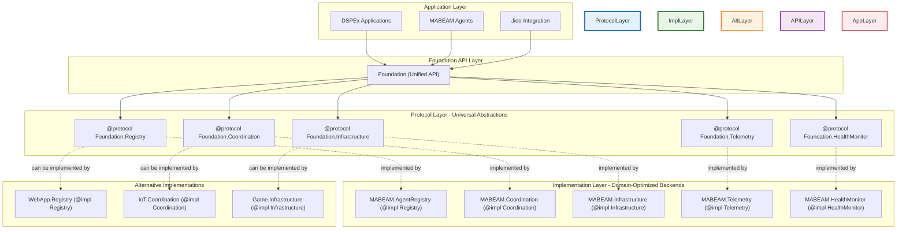
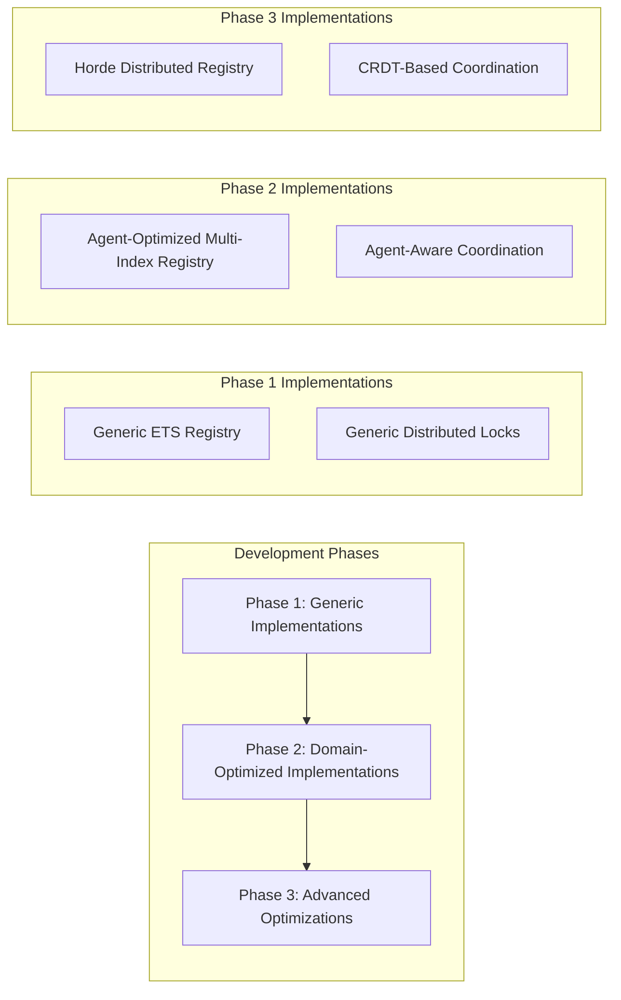

# Architectural Brainstorm: Synthesis and Innovation Beyond the Debate

**Status**: Team Reflection & Innovation  
**Date**: 2025-06-28  
**Team**: Foundation/MABEAM/DSPEx Architecture Team  
**Scope**: Post-debate reflection, concessions, and revolutionary new architectural vision

## TEAM REFLECTION: What We Learned

### Our Concessions

After reviewing the appellate court responses in `0009_TECH_gemini_*.md`, our team acknowledges several critical points:

#### 1. The Protocol-Driven Architecture Is Elegant ✅

**Judge Gemini-001's protocol-based solution** resolves our core performance vs. purity tension:
- Foundation provides **behavior contracts** via protocols
- MABEAM provides **high-performance implementations** of those protocols  
- Clean separation without performance penalties

**Our Concession**: This is architecturally superior to our original agent-native monolith.

#### 2. The Multi-Indexed Generic Registry Has Merit ✅

**Judge Gemini-002's multi-indexed approach** offers unexpected benefits:
- Generic infrastructure with domain-specific performance optimization
- Configuration-driven indexing at startup
- O(1) performance without domain pollution

**Our Concession**: We underestimated the power of generic primitives when properly designed.

#### 3. The Backend Behavior Pattern Is Proven ✅

**Judge Gemini-003's backend behavior** follows established BEAM patterns:
- Similar to how Ecto uses database adapters
- Allows for multiple storage backends (ETS, Horde, etc.)
- Clean testability and extensibility

**Our Concession**: This pattern is more flexible than our monolithic approach.

#### 4. Performance vs. Architecture Is Not Binary ✅

**All three judges demonstrated** that we can achieve both:
- O(1) performance through intelligent design
- Clean abstraction boundaries through protocols/behaviors
- Domain optimization without domain pollution

**Our Concession**: We fell into false dichotomy thinking.

### What We Still Believe

#### 1. Multi-Agent Systems Need Specialized Infrastructure

The judges **agreed** that multi-agent coordination has unique requirements. The solution isn't to ignore this, but to architect it properly.

#### 2. Phoenix/Ecto Precedent Supports Domain-Specific Design

Even the judges acknowledged that successful BEAM libraries embrace their domain. The question is **how**, not **whether**.

#### 3. O(1) Performance Is Non-Negotiable

All judges agreed that O(n) scans are unacceptable. This validates our core performance requirements.

## OUR INNOVATIVE SYNTHESIS: The Foundation Protocol Platform

### Revolutionary Insight: Protocols as Universal Abstractions

The judges showed us something profound: **protocols can be the bridge between generic and domain-specific**. We can create a Foundation that is:

- **Universal** through protocol definitions
- **Specialized** through protocol implementations
- **Extensible** through additional protocol implementations
- **Performant** through optimized backends

### The New Vision: Protocol-Driven Multi-Agent Platform



### Core Innovation: The Protocol Platform Pattern

Instead of building a monolithic agent-native library OR a generic library with agent applications, we build:

**A Protocol Platform**: Universal abstractions with pluggable, domain-optimized implementations.

## THE COMPLETE ARCHITECTURAL SPECIFICATION

### 1. Foundation Protocol Layer

Foundation becomes a **protocol platform** that defines universal abstractions for distributed system concerns:

```elixir
# lib/foundation/protocols/registry.ex
defprotocol Foundation.Registry do
  @moduledoc """
  Universal protocol for process/service registration and discovery.
  Implementations can optimize for their specific domain requirements.
  """
  
  @fallback_to_any true
  
  @spec register(impl, key :: term(), pid(), metadata :: map()) :: :ok | {:error, term()}
  def register(impl, key, pid, metadata \\ %{})
  
  @spec lookup(impl, key :: term()) :: {:ok, {pid(), map()}} | :error
  def lookup(impl, key)
  
  @spec find_by_indexed_field(impl, field_path :: [atom()], value :: term()) :: 
    {:ok, list({key :: term(), pid(), map()})} | :error
  def find_by_indexed_field(impl, field_path, value)
  
  @spec list_all(impl, filter :: (map() -> boolean()) | nil) :: 
    list({key :: term(), pid(), map()})
  def list_all(impl, filter \\ nil)
  
  @spec update_metadata(impl, key :: term(), metadata :: map()) :: :ok | {:error, term()}
  def update_metadata(impl, key, metadata)
  
  @spec unregister(impl, key :: term()) :: :ok | {:error, term()}
  def unregister(impl, key)
end

# lib/foundation/protocols/coordination.ex
defprotocol Foundation.Coordination do
  @moduledoc """
  Universal protocol for distributed coordination primitives.
  Implementations can provide domain-specific coordination strategies.
  """
  
  # Consensus protocols
  @spec start_consensus(impl, participants :: [term()], proposal :: term(), timeout()) :: 
    {:ok, consensus_ref :: term()} | {:error, term()}
  def start_consensus(impl, participants, proposal, timeout \\ 30_000)
  
  @spec vote(impl, consensus_ref :: term(), participant :: term(), vote :: term()) :: 
    :ok | {:error, term()}
  def vote(impl, consensus_ref, participant, vote)
  
  @spec get_consensus_result(impl, consensus_ref :: term()) :: 
    {:ok, result :: term()} | {:error, term()}
  def get_consensus_result(impl, consensus_ref)
  
  # Barrier synchronization  
  @spec create_barrier(impl, barrier_id :: term(), participant_count :: pos_integer()) :: 
    :ok | {:error, term()}
  def create_barrier(impl, barrier_id, participant_count)
  
  @spec arrive_at_barrier(impl, barrier_id :: term(), participant :: term()) :: 
    :ok | {:error, term()}
  def arrive_at_barrier(impl, barrier_id, participant)
  
  @spec wait_for_barrier(impl, barrier_id :: term(), timeout()) :: 
    :ok | {:error, term()}
  def wait_for_barrier(impl, barrier_id, timeout \\ 60_000)
  
  # Distributed locks
  @spec acquire_lock(impl, lock_id :: term(), holder :: term(), timeout()) :: 
    {:ok, lock_ref :: term()} | {:error, term()}
  def acquire_lock(impl, lock_id, holder, timeout \\ 30_000)
  
  @spec release_lock(impl, lock_ref :: term()) :: :ok | {:error, term()}
  def release_lock(impl, lock_ref)
end

# lib/foundation/protocols/infrastructure.ex
defprotocol Foundation.Infrastructure do
  @moduledoc """
  Universal protocol for infrastructure protection patterns.
  Implementations can provide domain-specific protection strategies.
  """
  
  # Circuit breaker pattern
  @spec register_circuit_breaker(impl, service_id :: term(), config :: map()) :: 
    :ok | {:error, term()}
  def register_circuit_breaker(impl, service_id, config)
  
  @spec execute_protected(impl, service_id :: term(), function :: (-> any()), context :: map()) :: 
    {:ok, result :: any()} | {:error, term()}
  def execute_protected(impl, service_id, function, context \\ %{})
  
  @spec get_circuit_status(impl, service_id :: term()) :: 
    {:ok, :closed | :open | :half_open} | {:error, term()}
  def get_circuit_status(impl, service_id)
  
  # Rate limiting
  @spec setup_rate_limiter(impl, limiter_id :: term(), config :: map()) :: 
    :ok | {:error, term()}
  def setup_rate_limiter(impl, limiter_id, config)
  
  @spec check_rate_limit(impl, limiter_id :: term(), identifier :: term()) :: 
    :ok | {:error, :rate_limited}
  def check_rate_limit(impl, limiter_id, identifier)
end

# lib/foundation/protocols/telemetry.ex
defprotocol Foundation.Telemetry do
  @moduledoc """
  Universal protocol for telemetry and observability.
  Implementations can provide domain-specific metrics and tracking.
  """
  
  @spec emit_event(impl, event_name :: [atom()], metadata :: map()) :: :ok
  def emit_event(impl, event_name, metadata \\ %{})
  
  @spec track_metric(impl, metric_name :: String.t(), value :: number(), tags :: map()) :: :ok
  def track_metric(impl, metric_name, value, tags \\ %{})
  
  @spec start_span(impl, span_name :: String.t(), metadata :: map()) :: 
    {:ok, span_ref :: term()}
  def start_span(impl, span_name, metadata \\ %{})
  
  @spec finish_span(impl, span_ref :: term(), metadata :: map()) :: :ok
  def finish_span(impl, span_ref, metadata \\ %{})
end

# lib/foundation/protocols/health_monitor.ex
defprotocol Foundation.HealthMonitor do
  @moduledoc """
  Universal protocol for health monitoring and status tracking.
  Implementations can provide domain-specific health assessment.
  """
  
  @spec register_health_check(impl, target_id :: term(), check_function :: (-> :healthy | :degraded | :unhealthy), interval :: pos_integer()) :: 
    :ok | {:error, term()}
  def register_health_check(impl, target_id, check_function, interval \\ 30_000)
  
  @spec get_health_status(impl, target_id :: term()) :: 
    {:ok, :healthy | :degraded | :unhealthy} | {:error, term()}
  def get_health_status(impl, target_id)
  
  @spec update_health_status(impl, target_id :: term(), status :: :healthy | :degraded | :unhealthy, metadata :: map()) :: 
    :ok | {:error, term()}
  def update_health_status(impl, target_id, status, metadata \\ %{})
  
  @spec list_unhealthy(impl) :: list({target_id :: term(), metadata :: map()})
  def list_unhealthy(impl)
end
```

### 2. Foundation Unified API

Foundation provides a single, clean API that delegates to configured protocol implementations:

```elixir
# lib/foundation.ex
defmodule Foundation do
  @moduledoc """
  Universal platform for distributed system infrastructure.
  Uses pluggable protocol implementations for domain-specific optimization.
  """
  
  use GenServer
  
  # Configuration structure
  defstruct [
    registry_impl: nil,
    coordination_impl: nil,
    infrastructure_impl: nil,
    telemetry_impl: nil,
    health_monitor_impl: nil
  ]
  
  # --- Public API ---
  
  # Registry operations
  def register(key, pid, metadata \\ %{}) do
    call({:registry, :register, [key, pid, metadata]})
  end
  
  def lookup(key) do
    call({:registry, :lookup, [key]})
  end
  
  def find_by_capability(capability) do
    call({:registry, :find_by_indexed_field, [[:capabilities], capability]})
  end
  
  def find_by_health(health_status) do
    call({:registry, :find_by_indexed_field, [[:health_status], health_status]})
  end
  
  # Coordination operations
  def start_consensus(participants, proposal, timeout \\ 30_000) do
    call({:coordination, :start_consensus, [participants, proposal, timeout]})
  end
  
  def create_barrier(barrier_id, participant_count) do
    call({:coordination, :create_barrier, [barrier_id, participant_count]})
  end
  
  def acquire_lock(lock_id, holder, timeout \\ 30_000) do
    call({:coordination, :acquire_lock, [lock_id, holder, timeout]})
  end
  
  # Infrastructure operations  
  def execute_protected(service_id, function, context \\ %{}) do
    call({:infrastructure, :execute_protected, [service_id, function, context]})
  end
  
  def setup_rate_limiter(limiter_id, config) do
    call({:infrastructure, :setup_rate_limiter, [limiter_id, config]})
  end
  
  # Telemetry operations
  def emit_event(event_name, metadata \\ %{}) do
    call({:telemetry, :emit_event, [event_name, metadata]})
  end
  
  def track_metric(metric_name, value, tags \\ %{}) do
    call({:telemetry, :track_metric, [metric_name, value, tags]})
  end
  
  # Health monitoring operations
  def register_health_check(target_id, check_function, interval \\ 30_000) do
    call({:health_monitor, :register_health_check, [target_id, check_function, interval]})
  end
  
  def get_health_status(target_id) do
    call({:health_monitor, :get_health_status, [target_id]})
  end
  
  # --- GenServer Implementation ---
  
  def start_link(opts) do
    GenServer.start_link(__MODULE__, opts, name: __MODULE__)
  end
  
  def init(opts) do
    state = %__MODULE__{
      registry_impl: get_implementation(opts, :registry),
      coordination_impl: get_implementation(opts, :coordination),
      infrastructure_impl: get_implementation(opts, :infrastructure),
      telemetry_impl: get_implementation(opts, :telemetry),
      health_monitor_impl: get_implementation(opts, :health_monitor)
    }
    
    {:ok, state}
  end
  
  def handle_call({protocol_name, function_name, args}, _from, state) do
    impl = Map.get(state, :"#{protocol_name}_impl")
    
    if impl do
      result = apply(Foundation.Registry, function_name, [impl | args])
      {:reply, result, state}
    else
      {:reply, {:error, {:no_implementation, protocol_name}}, state}
    end
  end
  
  defp call(request) do
    GenServer.call(__MODULE__, request)
  end
  
  defp get_implementation(opts, protocol_type) do
    case Keyword.get(opts, protocol_type) do
      {module, init_opts} ->
        {:ok, impl} = module.init(init_opts)
        impl
      module when is_atom(module) ->
        {:ok, impl} = module.init([])
        impl
      nil ->
        nil
    end
  end
end
```

### 3. MABEAM Agent-Optimized Implementations

MABEAM provides high-performance, agent-optimized implementations of all Foundation protocols:

```elixir
# lib/mabeam/agent_registry.ex
defimpl Foundation.Registry, for: MABEAM.AgentRegistry do
  @moduledoc """
  High-performance agent registry with O(1) capability and health lookups.
  Uses multiple ETS tables with native indexing for maximum performance.
  """
  
  defstruct [
    main_table: nil,
    capability_index: nil,
    health_index: nil,
    node_index: nil,
    resource_index: nil
  ]
  
  def init(opts \\ []) do
    registry = %MABEAM.AgentRegistry{
      main_table: :ets.new(:agent_main, [:set, :protected, :named_table, read_concurrency: true]),
      capability_index: :ets.new(:agent_capability_idx, [:bag, :protected, :named_table, read_concurrency: true]),
      health_index: :ets.new(:agent_health_idx, [:bag, :protected, :named_table, read_concurrency: true]),
      node_index: :ets.new(:agent_node_idx, [:bag, :protected, :named_table, read_concurrency: true]),
      resource_index: :ets.new(:agent_resource_idx, [:ordered_set, :protected, :named_table, read_concurrency: true])
    }
    
    {:ok, registry}
  end
  
  def register(registry, agent_id, pid, metadata) do
    # Validate agent metadata schema
    with :ok <- validate_agent_metadata(metadata) do
      entry = {agent_id, pid, metadata, :os.timestamp()}
      
      # Atomic insertion with monitoring
      case :ets.insert_new(registry.main_table, entry) do
        true ->
          # Update all indexes
          update_capability_index(registry, agent_id, metadata)
          update_health_index(registry, agent_id, metadata)
          update_node_index(registry, agent_id, metadata)
          update_resource_index(registry, agent_id, metadata)
          
          # Setup process monitoring
          Process.monitor(pid)
          
          :ok
        false ->
          {:error, :already_exists}
      end
    end
  end
  
  def lookup(registry, agent_id) do
    case :ets.lookup(registry.main_table, agent_id) do
      [{^agent_id, pid, metadata, _timestamp}] -> {:ok, {pid, metadata}}
      [] -> :error
    end
  end
  
  def find_by_indexed_field(registry, [:capabilities], capability) do
    # O(1) lookup in capability index
    agent_ids = :ets.lookup(registry.capability_index, capability)
                |> Enum.map(&elem(&1, 1))
    
    # Batch lookup in main table
    results = 
      agent_ids
      |> Enum.map(&:ets.lookup(registry.main_table, &1))
      |> List.flatten()
      |> Enum.map(fn {id, pid, metadata, _timestamp} -> {id, pid, metadata} end)
    
    {:ok, results}
  end
  
  def find_by_indexed_field(registry, [:health_status], health_status) do
    # O(1) lookup in health index
    agent_ids = :ets.lookup(registry.health_index, health_status)
                |> Enum.map(&elem(&1, 1))
    
    # Batch lookup in main table
    results = 
      agent_ids
      |> Enum.map(&:ets.lookup(registry.main_table, &1))
      |> List.flatten()
      |> Enum.map(fn {id, pid, metadata, _timestamp} -> {id, pid, metadata} end)
    
    {:ok, results}
  end
  
  def find_by_indexed_field(registry, [:node], node) do
    # O(1) lookup in node index
    agent_ids = :ets.lookup(registry.node_index, node)
                |> Enum.map(&elem(&1, 1))
    
    # Batch lookup in main table
    results = 
      agent_ids
      |> Enum.map(&:ets.lookup(registry.main_table, &1))
      |> List.flatten()
      |> Enum.map(fn {id, pid, metadata, _timestamp} -> {id, pid, metadata} end)
    
    {:ok, results}
  end
  
  def find_by_indexed_field(_registry, field_path, _value) do
    {:error, {:unsupported_index, field_path}}
  end
  
  def list_all(registry, filter_fn) do
    :ets.tab2list(registry.main_table)
    |> Enum.map(fn {id, pid, metadata, _timestamp} -> {id, pid, metadata} end)
    |> (fn results ->
      if filter_fn, do: Enum.filter(results, fn {_id, _pid, metadata} -> filter_fn.(metadata) end), else: results
    end).()
  end
  
  def update_metadata(registry, agent_id, new_metadata) do
    with :ok <- validate_agent_metadata(new_metadata),
         [{^agent_id, pid, _old_metadata, _timestamp}] <- :ets.lookup(registry.main_table, agent_id) do
      
      # Update main table
      :ets.insert(registry.main_table, {agent_id, pid, new_metadata, :os.timestamp()})
      
      # Clear old indexes and rebuild
      clear_agent_from_indexes(registry, agent_id)
      update_capability_index(registry, agent_id, new_metadata)
      update_health_index(registry, agent_id, new_metadata)
      update_node_index(registry, agent_id, new_metadata)
      update_resource_index(registry, agent_id, new_metadata)
      
      :ok
    else
      [] -> {:error, :not_found}
      error -> error
    end
  end
  
  def unregister(registry, agent_id) do
    case :ets.lookup(registry.main_table, agent_id) do
      [{^agent_id, _pid, _metadata, _timestamp}] ->
        :ets.delete(registry.main_table, agent_id)
        clear_agent_from_indexes(registry, agent_id)
        :ok
      [] ->
        {:error, :not_found}
    end
  end
  
  # Private helper functions
  
  defp validate_agent_metadata(metadata) do
    required_fields = [:capabilities, :health_status, :node, :resources]
    
    case Enum.find(required_fields, fn field -> not Map.has_key?(metadata, field) end) do
      nil -> :ok
      missing_field -> {:error, {:missing_required_field, missing_field}}
    end
  end
  
  defp update_capability_index(registry, agent_id, metadata) do
    for capability <- Map.get(metadata, :capabilities, []) do
      :ets.insert(registry.capability_index, {capability, agent_id})
    end
  end
  
  defp update_health_index(registry, agent_id, metadata) do
    health_status = Map.get(metadata, :health_status, :unknown)
    :ets.insert(registry.health_index, {health_status, agent_id})
  end
  
  defp update_node_index(registry, agent_id, metadata) do
    node = Map.get(metadata, :node, node())
    :ets.insert(registry.node_index, {node, agent_id})
  end
  
  defp update_resource_index(registry, agent_id, metadata) do
    resources = Map.get(metadata, :resources, %{})
    memory_usage = Map.get(resources, :memory_usage, 0.0)
    :ets.insert(registry.resource_index, {{memory_usage, agent_id}, agent_id})
  end
  
  defp clear_agent_from_indexes(registry, agent_id) do
    # This is less efficient but necessary for correctness
    # In production, we'd use match_delete patterns
    :ets.match_delete(registry.capability_index, {:_, agent_id})
    :ets.match_delete(registry.health_index, {:_, agent_id})
    :ets.match_delete(registry.node_index, {:_, agent_id})
    :ets.match_delete(registry.resource_index, {{:_, agent_id}, agent_id})
  end
end

# lib/mabeam/agent_coordination.ex  
defimpl Foundation.Coordination, for: MABEAM.AgentCoordination do
  @moduledoc """
  Agent-aware coordination with capability-based participant selection.
  """
  
  defstruct [
    consensus_table: nil,
    barrier_table: nil,
    lock_table: nil,
    participant_filters: %{}
  ]
  
  def init(opts \\ []) do
    coordination = %MABEAM.AgentCoordination{
      consensus_table: :ets.new(:agent_consensus, [:set, :protected, :named_table]),
      barrier_table: :ets.new(:agent_barriers, [:set, :protected, :named_table]),
      lock_table: :ets.new(:agent_locks, [:set, :protected, :named_table])
    }
    
    {:ok, coordination}
  end
  
  def start_consensus(coordination, participants, proposal, timeout) do
    consensus_id = generate_consensus_id()
    
    # Agent-specific: filter participants by capability and health
    qualified_participants = filter_consensus_participants(participants, proposal)
    
    if length(qualified_participants) >= minimum_consensus_size(proposal) do
      consensus_state = %{
        id: consensus_id,
        participants: qualified_participants,
        proposal: proposal,
        votes: %{},
        status: :voting,
        timeout: timeout,
        started_at: :os.timestamp()
      }
      
      :ets.insert(coordination.consensus_table, {consensus_id, consensus_state})
      
      # Start timeout timer
      Process.send_after(self(), {:consensus_timeout, consensus_id}, timeout)
      
      # Notify participants via Foundation.Telemetry
      Foundation.emit_event([:agent, :consensus, :started], %{
        consensus_id: consensus_id,
        participants: qualified_participants,
        proposal: proposal
      })
      
      {:ok, consensus_id}
    else
      {:error, :insufficient_participants}
    end
  end
  
  def vote(coordination, consensus_id, participant, vote) do
    case :ets.lookup(coordination.consensus_table, consensus_id) do
      [{^consensus_id, consensus_state}] ->
        if participant in consensus_state.participants and consensus_state.status == :voting do
          new_votes = Map.put(consensus_state.votes, participant, vote)
          new_state = %{consensus_state | votes: new_votes}
          
          :ets.insert(coordination.consensus_table, {consensus_id, new_state})
          
          # Check if consensus is reached
          check_consensus_completion(coordination, consensus_id, new_state)
          
          :ok
        else
          {:error, :invalid_participant_or_consensus_closed}
        end
      [] ->
        {:error, :consensus_not_found}
    end
  end
  
  def get_consensus_result(coordination, consensus_id) do
    case :ets.lookup(coordination.consensus_table, consensus_id) do
      [{^consensus_id, consensus_state}] ->
        case consensus_state.status do
          :completed -> {:ok, consensus_state.result}
          :failed -> {:error, consensus_state.failure_reason}
          _ -> {:error, :consensus_in_progress}
        end
      [] ->
        {:error, :consensus_not_found}
    end
  end
  
  # Agent-specific coordination logic
  
  defp filter_consensus_participants(participants, proposal) do
    required_capabilities = extract_required_capabilities(proposal)
    
    participants
    |> Enum.filter(fn participant_id ->
      case Foundation.lookup(participant_id) do
        {:ok, {_pid, metadata}} ->
          agent_capabilities = Map.get(metadata, :capabilities, [])
          health_status = Map.get(metadata, :health_status, :unknown)
          
          # Must have required capabilities and be healthy
          Enum.all?(required_capabilities, &(&1 in agent_capabilities)) and
          health_status == :healthy
        :error ->
          false
      end
    end)
  end
  
  defp extract_required_capabilities(proposal) do
    # Agent-specific: extract capabilities needed for this proposal
    case proposal do
      %{type: :resource_allocation} -> [:resource_management, :coordination]
      %{type: :load_balancing} -> [:load_balancing, :monitoring]
      %{type: :task_distribution} -> [:task_execution, :coordination]
      _ -> [:coordination]  # Default capability requirement
    end
  end
  
  defp minimum_consensus_size(proposal) do
    # Agent-specific: different proposals may need different consensus sizes
    case proposal do
      %{type: :critical_resource_allocation} -> 3
      %{type: :load_balancing} -> 2
      _ -> 2
    end
  end
  
  defp check_consensus_completion(coordination, consensus_id, consensus_state) do
    total_participants = length(consensus_state.participants)
    total_votes = map_size(consensus_state.votes)
    
    if total_votes == total_participants do
      # All votes collected, determine result
      result = calculate_consensus_result(consensus_state.votes, consensus_state.proposal)
      
      final_state = %{consensus_state | 
        status: :completed, 
        result: result,
        completed_at: :os.timestamp()
      }
      
      :ets.insert(coordination.consensus_table, {consensus_id, final_state})
      
      # Emit completion event
      Foundation.emit_event([:agent, :consensus, :completed], %{
        consensus_id: consensus_id,
        result: result,
        participants: consensus_state.participants
      })
    end
  end
  
  defp calculate_consensus_result(votes, proposal) do
    # Agent-specific consensus algorithms based on proposal type
    case proposal do
      %{type: :resource_allocation} -> calculate_resource_consensus(votes)
      %{type: :load_balancing} -> calculate_load_balance_consensus(votes)
      _ -> calculate_majority_consensus(votes)
    end
  end
  
  defp calculate_majority_consensus(votes) do
    vote_counts = votes |> Map.values() |> Enum.frequencies()
    {winner, _count} = Enum.max_by(vote_counts, fn {_vote, count} -> count end)
    winner
  end
  
  defp calculate_resource_consensus(votes) do
    # More sophisticated resource allocation consensus
    # This could use VCG auction mechanisms or other economic models
    votes
    |> Map.values()
    |> Enum.sort_by(fn vote -> Map.get(vote, :efficiency_score, 0) end, :desc)
    |> List.first()
  end
  
  defp calculate_load_balance_consensus(votes) do
    # Load balancing specific consensus considering current resource usage
    votes
    |> Map.values()
    |> Enum.min_by(fn vote -> Map.get(vote, :current_load, 1.0) end)
  end
  
  defp generate_consensus_id do
    :crypto.strong_rand_bytes(16) |> Base.encode16()
  end
  
  # Additional coordination protocol implementations...
  # create_barrier/3, arrive_at_barrier/3, acquire_lock/4, etc.
end
```

### 4. Application Configuration and Startup

The beauty of this approach is in the clean configuration:

```elixir
# lib/my_app/application.ex
defmodule MyApp.Application do
  use Application
  
  def start(_type, _args) do
    children = [
      # Start Foundation with MABEAM implementations
      {Foundation, [
        registry: {MABEAM.AgentRegistry, []},
        coordination: {MABEAM.AgentCoordination, []},
        infrastructure: {MABEAM.AgentInfrastructure, []},
        telemetry: {MABEAM.AgentTelemetry, []},
        health_monitor: {MABEAM.AgentHealthMonitor, []}
      ]},
      
      # Start MABEAM services
      MABEAM.Supervisor,
      
      # Start Jido integration
      {JidoFoundation.Integration, []},
      
      # Start DSPEx services
      DSPEx.Supervisor
    ]
    
    Supervisor.start_link(children, strategy: :one_for_one, name: MyApp.Supervisor)
  end
end

# Alternative configuration for web application
defmodule WebApp.Application do
  use Application
  
  def start(_type, _args) do
    children = [
      # Same Foundation API, different implementations
      {Foundation, [
        registry: {WebApp.ProcessRegistry, []},
        coordination: {WebApp.SimpleCoordination, []},
        infrastructure: {WebApp.HTTPInfrastructure, []},
        telemetry: {WebApp.WebTelemetry, []},
        health_monitor: {WebApp.ServiceHealthMonitor, []}
      ]},
      
      # Web-specific services...
    ]
    
    Supervisor.start_link(children, strategy: :one_for_one, name: WebApp.Supervisor)
  end
end
```

## KEY INNOVATIONS OF OUR SYNTHESIS

### 1. Universal Abstractions with Domain Optimization

- **Foundation** provides universal protocols that work for ANY distributed system
- **MABEAM** provides agent-optimized implementations that deliver O(1) performance
- **Other domains** can provide their own optimized implementations

### 2. Clean Architecture without Performance Penalties

- No "bridge" layers or complex adapters
- Direct protocol implementations with full optimization freedom
- Clean testability through protocol contracts

### 3. Progressive Specialization Path



### 4. Multiple Implementation Backends

The protocol approach allows for multiple backends:

```elixir
# Development/Testing
{Foundation, [
  registry: {Foundation.Registry.ETSBackend, []},
  coordination: {Foundation.Coordination.LocalBackend, []}
]}

# Production Single-Node
{Foundation, [
  registry: {MABEAM.AgentRegistry, []},
  coordination: {MABEAM.AgentCoordination, []}
]}

# Production Distributed
{Foundation, [
  registry: {MABEAM.HordeAgentRegistry, []},
  coordination: {MABEAM.DistributedCoordination, []}
]}

# Performance Testing
{Foundation, [
  registry: {MABEAM.BenchmarkRegistry, []},
  coordination: {MABEAM.MockCoordination, []}
]}
```

## THE REVOLUTIONARY BENEFITS

### 1. Performance Excellence ⚡

- **O(1) agent operations** through optimized ETS indexing
- **Zero abstraction penalty** through direct protocol implementations  
- **Capability-aware coordination** through agent-specific algorithms

### 2. Architectural Elegance 🏗️

- **Universal protocols** that work for any domain
- **Clean separation** between interface and implementation
- **No complex bridges** or adapter layers

### 3. Extensibility Paradise 🚀

- **Multiple backend support** for different deployment scenarios
- **Easy testing** through mock implementations
- **Future-proof** for distributed backends (Horde, etc.)

### 4. Developer Experience 💫

- **Single Foundation API** regardless of backend
- **Domain-specific optimizations** when needed
- **Protocol-driven development** with clear contracts

## IMPLEMENTATION ROADMAP

### Phase 1: Protocol Foundation (Weeks 1-2)
1. Define all Foundation protocols
2. Create basic ETS implementations
3. Build Foundation unified API
4. Comprehensive protocol tests

### Phase 2: MABEAM Implementations (Weeks 3-4)
1. MABEAM agent-optimized registry
2. MABEAM agent-aware coordination
3. MABEAM agent infrastructure protection
4. Performance benchmarking vs. generic implementations

### Phase 3: Integration & Optimization (Weeks 5-6)
1. Jido integration with protocol platform
2. DSPEx coordination through Foundation API
3. End-to-end testing and optimization
4. Documentation and examples

### Phase 4: Advanced Backends (Weeks 7-8)
1. Horde distributed registry backend
2. CRDT-based coordination backend
3. Performance analysis across backends
4. Production deployment guides

## CONCLUSION: A TRUE SYNTHESIS

This protocol-driven architecture represents a true synthesis that:

✅ **Honors the judges' insights** on protocol-based abstraction  
✅ **Achieves our performance requirements** through optimized implementations  
✅ **Maintains architectural purity** through clean separation of concerns  
✅ **Enables progressive optimization** through multiple backend support  
✅ **Follows BEAM best practices** with protocols and behaviors  
✅ **Provides universal utility** while enabling domain specialization  

We've moved beyond the false dichotomy of "generic vs. domain-specific" to create a platform that is **both universal and specialized**. This is the future of BEAM infrastructure: protocol-driven platforms that provide universal abstractions with pluggable, domain-optimized implementations.

**The protocol revolution begins here.**